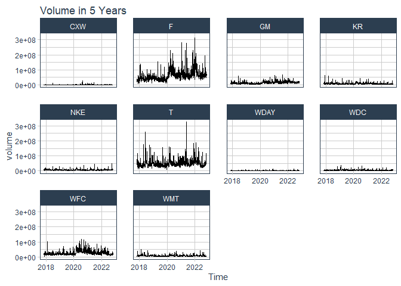

```r
library(ggplot2)
```

```
## Warning: package 'ggplot2' was built under R version 4.1.3
```

```r
library(readr)
```

```
## Warning: package 'readr' was built under R version 4.1.3
```

```r
library(knitr)
```

```
## Warning: package 'knitr' was built under R version 4.1.3
```

```r
library(tidyverse)
```

```
## Warning: package 'tidyverse' was built under R version 4.1.3
```

```
## -- Attaching packages --------------------------------------- tidyverse 1.3.2 --
## v tibble  3.1.8      v dplyr   1.0.10
## v tidyr   1.2.1      v stringr 1.4.1 
## v purrr   0.3.5      v forcats 0.5.2
```

```
## Warning: package 'tibble' was built under R version 4.1.3
```

```
## Warning: package 'tidyr' was built under R version 4.1.3
```

```
## Warning: package 'purrr' was built under R version 4.1.3
```

```
## Warning: package 'dplyr' was built under R version 4.1.3
```

```
## Warning: package 'stringr' was built under R version 4.1.3
```

```
## Warning: package 'forcats' was built under R version 4.1.3
```

```
## -- Conflicts ------------------------------------------ tidyverse_conflicts() --
## x dplyr::filter() masks stats::filter()
## x dplyr::lag()    masks stats::lag()
```

```r
library(dplyr)
library(forcats)
library(corrplot)
```

```
## Warning: package 'corrplot' was built under R version 4.1.3
```

```
## corrplot 0.92 loaded
```

```r
library(tidyquant)
```

```
## Warning: package 'tidyquant' was built under R version 4.1.3
```

```
## Loading required package: lubridate
```

```
## Warning: package 'lubridate' was built under R version 4.1.3
```

```
## 
## Attaching package: 'lubridate'
## 
## The following objects are masked from 'package:base':
## 
##     date, intersect, setdiff, union
## 
## Loading required package: PerformanceAnalytics
```

```
## Warning: package 'PerformanceAnalytics' was built under R version 4.1.3
```

```
## Loading required package: xts
```

```
## Warning: package 'xts' was built under R version 4.1.3
```

```
## Loading required package: zoo
```

```
## Warning: package 'zoo' was built under R version 4.1.3
```

```
## 
## Attaching package: 'zoo'
## 
## The following objects are masked from 'package:base':
## 
##     as.Date, as.Date.numeric
## 
## 
## Attaching package: 'xts'
## 
## The following objects are masked from 'package:dplyr':
## 
##     first, last
## 
## 
## Attaching package: 'PerformanceAnalytics'
## 
## The following object is masked from 'package:graphics':
## 
##     legend
## 
## Loading required package: quantmod
```

```
## Warning: package 'quantmod' was built under R version 4.1.3
```

```
## Loading required package: TTR
```

```
## Warning: package 'TTR' was built under R version 4.1.3
```

```
## Registered S3 method overwritten by 'quantmod':
##   method            from
##   as.zoo.data.frame zoo
```

```r
library(timetk)
```

```
## Warning: package 'timetk' was built under R version 4.1.3
```

```r
library(downloader)
```

```
## Warning: package 'downloader' was built under R version 4.1.3
```

```r
library(dygraphs)
```

```
## Warning: package 'dygraphs' was built under R version 4.1.3
```


```r
tickers_today <- c("CXW", "F", "GM", "KR", "WDC", "NKE","T", "WDAY", "WFC", "WMT")
start<-today()-years(5)
end<-today()
```


```r
activepl <- tq_get(tickers_today, get = 'stock.prices', from = start, to = end)
```


```r
firstpl <- activepl %>%
  select(symbol, date, adjusted) %>%
  pivot_wider(names_from = symbol, values_from = adjusted) %>%
  tk_xts(date_var = date) 
```

```
## Warning: Non-numeric columns being dropped: date
```

```r
dygraph(firstpl) %>%
  dyRangeSelector()
```

```{=html}
<div id="htmlwidget-d70af353056d91c2cdb6" style="width:672px;height:480px;" class="dygraphs html-widget"></div>
<script type="application/json" data-for="htmlwidget-d70af353056d91c2cdb6">{"x":{"attrs":{"labels":["day","CXW","F","GM","KR","WDC","NKE","T","WDAY","WFC","WMT"],"legend":"auto","retainDateWindow":false,"axes":{"x":{"pixelsPerLabel":60}},"showRangeSelector":true,"rangeSelectorHeight":40,"rangeSelectorPlotFillColor":" #A7B1C4","rangeSelectorPlotStrokeColor":"#808FAB","interactionModel":"Dygraph.Interaction.defaultModel"},"scale":"daily","annotations":[],"shadings":[],"events":[],"format":"date","data":[["2017-11-03T00:00:00.000Z","2017-11-06T00:00:00.000Z","2017-11-07T00:00:00.000Z","2017-11-08T00:00:00.000Z","2017-11-09T00:00:00.000Z","2017-11-10T00:00:00.000Z","2017-11-13T00:00:00.000Z","2017-11-14T00:00:00.000Z","2017-11-15T00:00:00.000Z","2017-11-16T00:00:00.000Z","2017-11-17T00:00:00.000Z","2017-11-20T00:00:00.000Z","2017-11-21T00:00:00.000Z","2017-11-22T00:00:00.000Z","2017-11-24T00:00:00.000Z","2017-11-27T00:00:00.000Z","2017-11-28T00:00:00.000Z","2017-11-29T00:00:00.000Z","2017-11-30T00:00:00.000Z","2017-12-01T00:00:00.000Z","2017-12-04T00:00:00.000Z","2017-12-05T00:00:00.000Z","2017-12-06T00:00:00.000Z","2017-12-07T00:00:00.000Z","2017-12-08T00:00:00.000Z","2017-12-11T00:00:00.000Z","2017-12-12T00:00:00.000Z","2017-12-13T00:00:00.000Z","2017-12-14T00:00:00.000Z","2017-12-15T00:00:00.000Z","2017-12-18T00:00:00.000Z","2017-12-19T00:00:00.000Z","2017-12-20T00:00:00.000Z","2017-12-21T00:00:00.000Z","2017-12-22T00:00:00.000Z","2017-12-26T00:00:00.000Z","2017-12-27T00:00:00.000Z","2017-12-28T00:00:00.000Z","2017-12-29T00:00:00.000Z","2018-01-02T00:00:00.000Z","2018-01-03T00:00:00.000Z","2018-01-04T00:00:00.000Z","2018-01-05T00:00:00.000Z","2018-01-08T00:00:00.000Z","2018-01-09T00:00:00.000Z","2018-01-10T00:00:00.000Z","2018-01-11T00:00:00.000Z","2018-01-12T00:00:00.000Z","2018-01-16T00:00:00.000Z","2018-01-17T00:00:00.000Z","2018-01-18T00:00:00.000Z","2018-01-19T00:00:00.000Z","2018-01-22T00:00:00.000Z","2018-01-23T00:00:00.000Z","2018-01-24T00:00:00.000Z","2018-01-25T00:00:00.000Z","2018-01-26T00:00:00.000Z","2018-01-29T00:00:00.000Z","2018-01-30T00:00:00.000Z","2018-01-31T00:00:00.000Z","2018-02-01T00:00:00.000Z","2018-02-02T00:00:00.000Z","2018-02-05T00:00:00.000Z","2018-02-06T00:00:00.000Z","2018-02-07T00:00:00.000Z","2018-02-08T00:00:00.000Z","2018-02-09T00:00:00.000Z","2018-02-12T00:00:00.000Z","2018-02-13T00:00:00.000Z","2018-02-14T00:00:00.000Z","2018-02-15T00:00:00.000Z","2018-02-16T00:00:00.000Z","2018-02-20T00:00:00.000Z","2018-02-21T00:00:00.000Z","2018-02-22T00:00:00.000Z","2018-02-23T00:00:00.000Z","2018-02-26T00:00:00.000Z","2018-02-27T00:00:00.000Z","2018-02-28T00:00:00.000Z","2018-03-01T00:00:00.000Z","2018-03-02T00:00:00.000Z","2018-03-05T00:00:00.000Z","2018-03-06T00:00:00.000Z","2018-03-07T00:00:00.000Z","2018-03-08T00:00:00.000Z","2018-03-09T00:00:00.000Z","2018-03-12T00:00:00.000Z","2018-03-13T00:00:00.000Z","2018-03-14T00:00:00.000Z","2018-03-15T00:00:00.000Z","2018-03-16T00:00:00.000Z","2018-03-19T00:00:00.000Z","2018-03-20T00:00:00.000Z","2018-03-21T00:00:00.000Z","2018-03-22T00:00:00.000Z","2018-03-23T00:00:00.000Z","2018-03-26T00:00:00.000Z","2018-03-27T00:00:00.000Z","2018-03-28T00:00:00.000Z","2018-03-29T00:00:00.000Z","2018-04-02T00:00:00.000Z","2018-04-03T00:00:00.000Z","2018-04-04T00:00:00.000Z","2018-04-05T00:00:00.000Z","2018-04-06T00:00:00.000Z","2018-04-09T00:00:00.000Z","2018-04-10T00:00:00.000Z","2018-04-11T00:00:00.000Z","2018-04-12T00:00:00.000Z","2018-04-13T00:00:00.000Z","2018-04-16T00:00:00.000Z","2018-04-17T00:00:00.000Z","2018-04-18T00:00:00.000Z","2018-04-19T00:00:00.000Z","2018-04-20T00:00:00.000Z","2018-04-23T00:00:00.000Z","2018-04-24T00:00:00.000Z","2018-04-25T00:00:00.000Z","2018-04-26T00:00:00.000Z","2018-04-27T00:00:00.000Z","2018-04-30T00:00:00.000Z","2018-05-01T00:00:00.000Z","2018-05-02T00:00:00.000Z","2018-05-03T00:00:00.000Z","2018-05-04T00:00:00.000Z","2018-05-07T00:00:00.000Z","2018-05-08T00:00:00.000Z","2018-05-09T00:00:00.000Z","2018-05-10T00:00:00.000Z","2018-05-11T00:00:00.000Z","2018-05-14T00:00:00.000Z","2018-05-15T00:00:00.000Z","2018-05-16T00:00:00.000Z","2018-05-17T00:00:00.000Z","2018-05-18T00:00:00.000Z","2018-05-21T00:00:00.000Z","2018-05-22T00:00:00.000Z","2018-05-23T00:00:00.000Z","2018-05-24T00:00:00.000Z","2018-05-25T00:00:00.000Z","2018-05-29T00:00:00.000Z","2018-05-30T00:00:00.000Z","2018-05-31T00:00:00.000Z","2018-06-01T00:00:00.000Z","2018-06-04T00:00:00.000Z","2018-06-05T00:00:00.000Z","2018-06-06T00:00:00.000Z","2018-06-07T00:00:00.000Z","2018-06-08T00:00:00.000Z","2018-06-11T00:00:00.000Z","2018-06-12T00:00:00.000Z","2018-06-13T00:00:00.000Z","2018-06-14T00:00:00.000Z","2018-06-15T00:00:00.000Z","2018-06-18T00:00:00.000Z","2018-06-19T00:00:00.000Z","2018-06-20T00:00:00.000Z","2018-06-21T00:00:00.000Z","2018-06-22T00:00:00.000Z","2018-06-25T00:00:00.000Z","2018-06-26T00:00:00.000Z","2018-06-27T00:00:00.000Z","2018-06-28T00:00:00.000Z","2018-06-29T00:00:00.000Z","2018-07-02T00:00:00.000Z","2018-07-03T00:00:00.000Z","2018-07-05T00:00:00.000Z","2018-07-06T00:00:00.000Z","2018-07-09T00:00:00.000Z","2018-07-10T00:00:00.000Z","2018-07-11T00:00:00.000Z","2018-07-12T00:00:00.000Z","2018-07-13T00:00:00.000Z","2018-07-16T00:00:00.000Z","2018-07-17T00:00:00.000Z","2018-07-18T00:00:00.000Z","2018-07-19T00:00:00.000Z","2018-07-20T00:00:00.000Z","2018-07-23T00:00:00.000Z","2018-07-24T00:00:00.000Z","2018-07-25T00:00:00.000Z","2018-07-26T00:00:00.000Z","2018-07-27T00:00:00.000Z","2018-07-30T00:00:00.000Z","2018-07-31T00:00:00.000Z","2018-08-01T00:00:00.000Z","2018-08-02T00:00:00.000Z","2018-08-03T00:00:00.000Z","2018-08-06T00:00:00.000Z","2018-08-07T00:00:00.000Z","2018-08-08T00:00:00.000Z","2018-08-09T00:00:00.000Z","2018-08-10T00:00:00.000Z","2018-08-13T00:00:00.000Z","2018-08-14T00:00:00.000Z","2018-08-15T00:00:00.000Z","2018-08-16T00:00:00.000Z","2018-08-17T00:00:00.000Z","2018-08-20T00:00:00.000Z","2018-08-21T00:00:00.000Z","2018-08-22T00:00:00.000Z","2018-08-23T00:00:00.000Z","2018-08-24T00:00:00.000Z","2018-08-27T00:00:00.000Z","2018-08-28T00:00:00.000Z","2018-08-29T00:00:00.000Z","2018-08-30T00:00:00.000Z","2018-08-31T00:00:00.000Z","2018-09-04T00:00:00.000Z","2018-09-05T00:00:00.000Z","2018-09-06T00:00:00.000Z","2018-09-07T00:00:00.000Z","2018-09-10T00:00:00.000Z","2018-09-11T00:00:00.000Z","2018-09-12T00:00:00.000Z","2018-09-13T00:00:00.000Z","2018-09-14T00:00:00.000Z","2018-09-17T00:00:00.000Z","2018-09-18T00:00:00.000Z","2018-09-19T00:00:00.000Z","2018-09-20T00:00:00.000Z","2018-09-21T00:00:00.000Z","2018-09-24T00:00:00.000Z","2018-09-25T00:00:00.000Z","2018-09-26T00:00:00.000Z","2018-09-27T00:00:00.000Z","2018-09-28T00:00:00.000Z","2018-10-01T00:00:00.000Z","2018-10-02T00:00:00.000Z","2018-10-03T00:00:00.000Z","2018-10-04T00:00:00.000Z","2018-10-05T00:00:00.000Z","2018-10-08T00:00:00.000Z","2018-10-09T00:00:00.000Z","2018-10-10T00:00:00.000Z","2018-10-11T00:00:00.000Z","2018-10-12T00:00:00.000Z","2018-10-15T00:00:00.000Z","2018-10-16T00:00:00.000Z","2018-10-17T00:00:00.000Z","2018-10-18T00:00:00.000Z","2018-10-19T00:00:00.000Z","2018-10-22T00:00:00.000Z","2018-10-23T00:00:00.000Z","2018-10-24T00:00:00.000Z","2018-10-25T00:00:00.000Z","2018-10-26T00:00:00.000Z","2018-10-29T00:00:00.000Z","2018-10-30T00:00:00.000Z","2018-10-31T00:00:00.000Z","2018-11-01T00:00:00.000Z","2018-11-02T00:00:00.000Z","2018-11-05T00:00:00.000Z","2018-11-06T00:00:00.000Z","2018-11-07T00:00:00.000Z","2018-11-08T00:00:00.000Z","2018-11-09T00:00:00.000Z","2018-11-12T00:00:00.000Z","2018-11-13T00:00:00.000Z","2018-11-14T00:00:00.000Z","2018-11-15T00:00:00.000Z","2018-11-16T00:00:00.000Z","2018-11-19T00:00:00.000Z","2018-11-20T00:00:00.000Z","2018-11-21T00:00:00.000Z","2018-11-23T00:00:00.000Z","2018-11-26T00:00:00.000Z","2018-11-27T00:00:00.000Z","2018-11-28T00:00:00.000Z","2018-11-29T00:00:00.000Z","2018-11-30T00:00:00.000Z","2018-12-03T00:00:00.000Z","2018-12-04T00:00:00.000Z","2018-12-06T00:00:00.000Z","2018-12-07T00:00:00.000Z","2018-12-10T00:00:00.000Z","2018-12-11T00:00:00.000Z","2018-12-12T00:00:00.000Z","2018-12-13T00:00:00.000Z","2018-12-14T00:00:00.000Z","2018-12-17T00:00:00.000Z","2018-12-18T00:00:00.000Z","2018-12-19T00:00:00.000Z","2018-12-20T00:00:00.000Z","2018-12-21T00:00:00.000Z","2018-12-24T00:00:00.000Z","2018-12-26T00:00:00.000Z","2018-12-27T00:00:00.000Z","2018-12-28T00:00:00.000Z","2018-12-31T00:00:00.000Z","2019-01-02T00:00:00.000Z","2019-01-03T00:00:00.000Z","2019-01-04T00:00:00.000Z","2019-01-07T00:00:00.000Z","2019-01-08T00:00:00.000Z","2019-01-09T00:00:00.000Z","2019-01-10T00:00:00.000Z","2019-01-11T00:00:00.000Z","2019-01-14T00:00:00.000Z","2019-01-15T00:00:00.000Z","2019-01-16T00:00:00.000Z","2019-01-17T00:00:00.000Z","2019-01-18T00:00:00.000Z","2019-01-22T00:00:00.000Z","2019-01-23T00:00:00.000Z","2019-01-24T00:00:00.000Z","2019-01-25T00:00:00.000Z","2019-01-28T00:00:00.000Z","2019-01-29T00:00:00.000Z","2019-01-30T00:00:00.000Z","2019-01-31T00:00:00.000Z","2019-02-01T00:00:00.000Z","2019-02-04T00:00:00.000Z","2019-02-05T00:00:00.000Z","2019-02-06T00:00:00.000Z","2019-02-07T00:00:00.000Z","2019-02-08T00:00:00.000Z","2019-02-11T00:00:00.000Z","2019-02-12T00:00:00.000Z","2019-02-13T00:00:00.000Z","2019-02-14T00:00:00.000Z","2019-02-15T00:00:00.000Z","2019-02-19T00:00:00.000Z","2019-02-20T00:00:00.000Z","2019-02-21T00:00:00.000Z","2019-02-22T00:00:00.000Z","2019-02-25T00:00:00.000Z","2019-02-26T00:00:00.000Z","2019-02-27T00:00:00.000Z","2019-02-28T00:00:00.000Z","2019-03-01T00:00:00.000Z","2019-03-04T00:00:00.000Z","2019-03-05T00:00:00.000Z","2019-03-06T00:00:00.000Z","2019-03-07T00:00:00.000Z","2019-03-08T00:00:00.000Z","2019-03-11T00:00:00.000Z","2019-03-12T00:00:00.000Z","2019-03-13T00:00:00.000Z","2019-03-14T00:00:00.000Z","2019-03-15T00:00:00.000Z","2019-03-18T00:00:00.000Z","2019-03-19T00:00:00.000Z","2019-03-20T00:00:00.000Z","2019-03-21T00:00:00.000Z","2019-03-22T00:00:00.000Z","2019-03-25T00:00:00.000Z","2019-03-26T00:00:00.000Z","2019-03-27T00:00:00.000Z","2019-03-28T00:00:00.000Z","2019-03-29T00:00:00.000Z","2019-04-01T00:00:00.000Z","2019-04-02T00:00:00.000Z","2019-04-03T00:00:00.000Z","2019-04-04T00:00:00.000Z","2019-04-05T00:00:00.000Z","2019-04-08T00:00:00.000Z","2019-04-09T00:00:00.000Z","2019-04-10T00:00:00.000Z","2019-04-11T00:00:00.000Z","2019-04-12T00:00:00.000Z","2019-04-15T00:00:00.000Z","2019-04-16T00:00:00.000Z","2019-04-17T00:00:00.000Z","2019-04-18T00:00:00.000Z","2019-04-22T00:00:00.000Z","2019-04-23T00:00:00.000Z","2019-04-24T00:00:00.000Z","2019-04-25T00:00:00.000Z","2019-04-26T00:00:00.000Z","2019-04-29T00:00:00.000Z","2019-04-30T00:00:00.000Z","2019-05-01T00:00:00.000Z","2019-05-02T00:00:00.000Z","2019-05-03T00:00:00.000Z","2019-05-06T00:00:00.000Z","2019-05-07T00:00:00.000Z","2019-05-08T00:00:00.000Z","2019-05-09T00:00:00.000Z","2019-05-10T00:00:00.000Z","2019-05-13T00:00:00.000Z","2019-05-14T00:00:00.000Z","2019-05-15T00:00:00.000Z","2019-05-16T00:00:00.000Z","2019-05-17T00:00:00.000Z","2019-05-20T00:00:00.000Z","2019-05-21T00:00:00.000Z","2019-05-22T00:00:00.000Z","2019-05-23T00:00:00.000Z","2019-05-24T00:00:00.000Z","2019-05-28T00:00:00.000Z","2019-05-29T00:00:00.000Z","2019-05-30T00:00:00.000Z","2019-05-31T00:00:00.000Z","2019-06-03T00:00:00.000Z","2019-06-04T00:00:00.000Z","2019-06-05T00:00:00.000Z","2019-06-06T00:00:00.000Z","2019-06-07T00:00:00.000Z","2019-06-10T00:00:00.000Z","2019-06-11T00:00:00.000Z","2019-06-12T00:00:00.000Z","2019-06-13T00:00:00.000Z","2019-06-14T00:00:00.000Z","2019-06-17T00:00:00.000Z","2019-06-18T00:00:00.000Z","2019-06-19T00:00:00.000Z","2019-06-20T00:00:00.000Z","2019-06-21T00:00:00.000Z","2019-06-24T00:00:00.000Z","2019-06-25T00:00:00.000Z","2019-06-26T00:00:00.000Z","2019-06-27T00:00:00.000Z","2019-06-28T00:00:00.000Z","2019-07-01T00:00:00.000Z","2019-07-02T00:00:00.000Z","2019-07-03T00:00:00.000Z","2019-07-05T00:00:00.000Z","2019-07-08T00:00:00.000Z","2019-07-09T00:00:00.000Z","2019-07-10T00:00:00.000Z","2019-07-11T00:00:00.000Z","2019-07-12T00:00:00.000Z","2019-07-15T00:00:00.000Z","2019-07-16T00:00:00.000Z","2019-07-17T00:00:00.000Z","2019-07-18T00:00:00.000Z","2019-07-19T00:00:00.000Z","2019-07-22T00:00:00.000Z","2019-07-23T00:00:00.000Z","2019-07-24T00:00:00.000Z","2019-07-25T00:00:00.000Z","2019-07-26T00:00:00.000Z","2019-07-29T00:00:00.000Z","2019-07-30T00:00:00.000Z","2019-07-31T00:00:00.000Z","2019-08-01T00:00:00.000Z","2019-08-02T00:00:00.000Z","2019-08-05T00:00:00.000Z","2019-08-06T00:00:00.000Z","2019-08-07T00:00:00.000Z","2019-08-08T00:00:00.000Z","2019-08-09T00:00:00.000Z","2019-08-12T00:00:00.000Z","2019-08-13T00:00:00.000Z","2019-08-14T00:00:00.000Z","2019-08-15T00:00:00.000Z","2019-08-16T00:00:00.000Z","2019-08-19T00:00:00.000Z","2019-08-20T00:00:00.000Z","2019-08-21T00:00:00.000Z","2019-08-22T00:00:00.000Z","2019-08-23T00:00:00.000Z","2019-08-26T00:00:00.000Z","2019-08-27T00:00:00.000Z","2019-08-28T00:00:00.000Z","2019-08-29T00:00:00.000Z","2019-08-30T00:00:00.000Z","2019-09-03T00:00:00.000Z","2019-09-04T00:00:00.000Z","2019-09-05T00:00:00.000Z","2019-09-06T00:00:00.000Z","2019-09-09T00:00:00.000Z","2019-09-10T00:00:00.000Z","2019-09-11T00:00:00.000Z","2019-09-12T00:00:00.000Z","2019-09-13T00:00:00.000Z","2019-09-16T00:00:00.000Z","2019-09-17T00:00:00.000Z","2019-09-18T00:00:00.000Z","2019-09-19T00:00:00.000Z","2019-09-20T00:00:00.000Z","2019-09-23T00:00:00.000Z","2019-09-24T00:00:00.000Z","2019-09-25T00:00:00.000Z","2019-09-26T00:00:00.000Z","2019-09-27T00:00:00.000Z","2019-09-30T00:00:00.000Z","2019-10-01T00:00:00.000Z","2019-10-02T00:00:00.000Z","2019-10-03T00:00:00.000Z","2019-10-04T00:00:00.000Z","2019-10-07T00:00:00.000Z","2019-10-08T00:00:00.000Z","2019-10-09T00:00:00.000Z","2019-10-10T00:00:00.000Z","2019-10-11T00:00:00.000Z","2019-10-14T00:00:00.000Z","2019-10-15T00:00:00.000Z","2019-10-16T00:00:00.000Z","2019-10-17T00:00:00.000Z","2019-10-18T00:00:00.000Z","2019-10-21T00:00:00.000Z","2019-10-22T00:00:00.000Z","2019-10-23T00:00:00.000Z","2019-10-24T00:00:00.000Z","2019-10-25T00:00:00.000Z","2019-10-28T00:00:00.000Z","2019-10-29T00:00:00.000Z","2019-10-30T00:00:00.000Z","2019-10-31T00:00:00.000Z","2019-11-01T00:00:00.000Z","2019-11-04T00:00:00.000Z","2019-11-05T00:00:00.000Z","2019-11-06T00:00:00.000Z","2019-11-07T00:00:00.000Z","2019-11-08T00:00:00.000Z","2019-11-11T00:00:00.000Z","2019-11-12T00:00:00.000Z","2019-11-13T00:00:00.000Z","2019-11-14T00:00:00.000Z","2019-11-15T00:00:00.000Z","2019-11-18T00:00:00.000Z","2019-11-19T00:00:00.000Z","2019-11-20T00:00:00.000Z","2019-11-21T00:00:00.000Z","2019-11-22T00:00:00.000Z","2019-11-25T00:00:00.000Z","2019-11-26T00:00:00.000Z","2019-11-27T00:00:00.000Z","2019-11-29T00:00:00.000Z","2019-12-02T00:00:00.000Z","2019-12-03T00:00:00.000Z","2019-12-04T00:00:00.000Z","2019-12-05T00:00:00.000Z","2019-12-06T00:00:00.000Z","2019-12-09T00:00:00.000Z","2019-12-10T00:00:00.000Z","2019-12-11T00:00:00.000Z","2019-12-12T00:00:00.000Z","2019-12-13T00:00:00.000Z","2019-12-16T00:00:00.000Z","2019-12-17T00:00:00.000Z","2019-12-18T00:00:00.000Z","2019-12-19T00:00:00.000Z","2019-12-20T00:00:00.000Z","2019-12-23T00:00:00.000Z","2019-12-24T00:00:00.000Z","2019-12-26T00:00:00.000Z","2019-12-27T00:00:00.000Z","2019-12-30T00:00:00.000Z","2019-12-31T00:00:00.000Z","2020-01-02T00:00:00.000Z","2020-01-03T00:00:00.000Z","2020-01-06T00:00:00.000Z","2020-01-07T00:00:00.000Z","2020-01-08T00:00:00.000Z","2020-01-09T00:00:00.000Z","2020-01-10T00:00:00.000Z","2020-01-13T00:00:00.000Z","2020-01-14T00:00:00.000Z","2020-01-15T00:00:00.000Z","2020-01-16T00:00:00.000Z","2020-01-17T00:00:00.000Z","2020-01-21T00:00:00.000Z","2020-01-22T00:00:00.000Z","2020-01-23T00:00:00.000Z","2020-01-24T00:00:00.000Z","2020-01-27T00:00:00.000Z","2020-01-28T00:00:00.000Z","2020-01-29T00:00:00.000Z","2020-01-30T00:00:00.000Z","2020-01-31T00:00:00.000Z","2020-02-03T00:00:00.000Z","2020-02-04T00:00:00.000Z","2020-02-05T00:00:00.000Z","2020-02-06T00:00:00.000Z","2020-02-07T00:00:00.000Z","2020-02-10T00:00:00.000Z","2020-02-11T00:00:00.000Z","2020-02-12T00:00:00.000Z","2020-02-13T00:00:00.000Z","2020-02-14T00:00:00.000Z","2020-02-18T00:00:00.000Z","2020-02-19T00:00:00.000Z","2020-02-20T00:00:00.000Z","2020-02-21T00:00:00.000Z","2020-02-24T00:00:00.000Z","2020-02-25T00:00:00.000Z","2020-02-26T00:00:00.000Z","2020-02-27T00:00:00.000Z","2020-02-28T00:00:00.000Z","2020-03-02T00:00:00.000Z","2020-03-03T00:00:00.000Z","2020-03-04T00:00:00.000Z","2020-03-05T00:00:00.000Z","2020-03-06T00:00:00.000Z","2020-03-09T00:00:00.000Z","2020-03-10T00:00:00.000Z","2020-03-11T00:00:00.000Z","2020-03-12T00:00:00.000Z","2020-03-13T00:00:00.000Z","2020-03-16T00:00:00.000Z","2020-03-17T00:00:00.000Z","2020-03-18T00:00:00.000Z","2020-03-19T00:00:00.000Z","2020-03-20T00:00:00.000Z","2020-03-23T00:00:00.000Z","2020-03-24T00:00:00.000Z","2020-03-25T00:00:00.000Z","2020-03-26T00:00:00.000Z","2020-03-27T00:00:00.000Z","2020-03-30T00:00:00.000Z","2020-03-31T00:00:00.000Z","2020-04-01T00:00:00.000Z","2020-04-02T00:00:00.000Z","2020-04-03T00:00:00.000Z","2020-04-06T00:00:00.000Z","2020-04-07T00:00:00.000Z","2020-04-08T00:00:00.000Z","2020-04-09T00:00:00.000Z","2020-04-13T00:00:00.000Z","2020-04-14T00:00:00.000Z","2020-04-15T00:00:00.000Z","2020-04-16T00:00:00.000Z","2020-04-17T00:00:00.000Z","2020-04-20T00:00:00.000Z","2020-04-21T00:00:00.000Z","2020-04-22T00:00:00.000Z","2020-04-23T00:00:00.000Z","2020-04-24T00:00:00.000Z","2020-04-27T00:00:00.000Z","2020-04-28T00:00:00.000Z","2020-04-29T00:00:00.000Z","2020-04-30T00:00:00.000Z","2020-05-01T00:00:00.000Z","2020-05-04T00:00:00.000Z","2020-05-05T00:00:00.000Z","2020-05-06T00:00:00.000Z","2020-05-07T00:00:00.000Z","2020-05-08T00:00:00.000Z","2020-05-11T00:00:00.000Z","2020-05-12T00:00:00.000Z","2020-05-13T00:00:00.000Z","2020-05-14T00:00:00.000Z","2020-05-15T00:00:00.000Z","2020-05-18T00:00:00.000Z","2020-05-19T00:00:00.000Z","2020-05-20T00:00:00.000Z","2020-05-21T00:00:00.000Z","2020-05-22T00:00:00.000Z","2020-05-26T00:00:00.000Z","2020-05-27T00:00:00.000Z","2020-05-28T00:00:00.000Z","2020-05-29T00:00:00.000Z","2020-06-01T00:00:00.000Z","2020-06-02T00:00:00.000Z","2020-06-03T00:00:00.000Z","2020-06-04T00:00:00.000Z","2020-06-05T00:00:00.000Z","2020-06-08T00:00:00.000Z","2020-06-09T00:00:00.000Z","2020-06-10T00:00:00.000Z","2020-06-11T00:00:00.000Z","2020-06-12T00:00:00.000Z","2020-06-15T00:00:00.000Z","2020-06-16T00:00:00.000Z","2020-06-17T00:00:00.000Z","2020-06-18T00:00:00.000Z","2020-06-19T00:00:00.000Z","2020-06-22T00:00:00.000Z","2020-06-23T00:00:00.000Z","2020-06-24T00:00:00.000Z","2020-06-25T00:00:00.000Z","2020-06-26T00:00:00.000Z","2020-06-29T00:00:00.000Z","2020-06-30T00:00:00.000Z","2020-07-01T00:00:00.000Z","2020-07-02T00:00:00.000Z","2020-07-06T00:00:00.000Z","2020-07-07T00:00:00.000Z","2020-07-08T00:00:00.000Z","2020-07-09T00:00:00.000Z","2020-07-10T00:00:00.000Z","2020-07-13T00:00:00.000Z","2020-07-14T00:00:00.000Z","2020-07-15T00:00:00.000Z","2020-07-16T00:00:00.000Z","2020-07-17T00:00:00.000Z","2020-07-20T00:00:00.000Z","2020-07-21T00:00:00.000Z","2020-07-22T00:00:00.000Z","2020-07-23T00:00:00.000Z","2020-07-24T00:00:00.000Z","2020-07-27T00:00:00.000Z","2020-07-28T00:00:00.000Z","2020-07-29T00:00:00.000Z","2020-07-30T00:00:00.000Z","2020-07-31T00:00:00.000Z","2020-08-03T00:00:00.000Z","2020-08-04T00:00:00.000Z","2020-08-05T00:00:00.000Z","2020-08-06T00:00:00.000Z","2020-08-07T00:00:00.000Z","2020-08-10T00:00:00.000Z","2020-08-11T00:00:00.000Z","2020-08-12T00:00:00.000Z","2020-08-13T00:00:00.000Z","2020-08-14T00:00:00.000Z","2020-08-17T00:00:00.000Z","2020-08-18T00:00:00.000Z","2020-08-19T00:00:00.000Z","2020-08-20T00:00:00.000Z","2020-08-21T00:00:00.000Z","2020-08-24T00:00:00.000Z","2020-08-25T00:00:00.000Z","2020-08-26T00:00:00.000Z","2020-08-27T00:00:00.000Z","2020-08-28T00:00:00.000Z","2020-08-31T00:00:00.000Z","2020-09-01T00:00:00.000Z","2020-09-02T00:00:00.000Z","2020-09-03T00:00:00.000Z","2020-09-04T00:00:00.000Z","2020-09-08T00:00:00.000Z","2020-09-09T00:00:00.000Z","2020-09-10T00:00:00.000Z","2020-09-11T00:00:00.000Z","2020-09-14T00:00:00.000Z","2020-09-15T00:00:00.000Z","2020-09-16T00:00:00.000Z","2020-09-17T00:00:00.000Z","2020-09-18T00:00:00.000Z","2020-09-21T00:00:00.000Z","2020-09-22T00:00:00.000Z","2020-09-23T00:00:00.000Z","2020-09-24T00:00:00.000Z","2020-09-25T00:00:00.000Z","2020-09-28T00:00:00.000Z","2020-09-29T00:00:00.000Z","2020-09-30T00:00:00.000Z","2020-10-01T00:00:00.000Z","2020-10-02T00:00:00.000Z","2020-10-05T00:00:00.000Z","2020-10-06T00:00:00.000Z","2020-10-07T00:00:00.000Z","2020-10-08T00:00:00.000Z","2020-10-09T00:00:00.000Z","2020-10-12T00:00:00.000Z","2020-10-13T00:00:00.000Z","2020-10-14T00:00:00.000Z","2020-10-15T00:00:00.000Z","2020-10-16T00:00:00.000Z","2020-10-19T00:00:00.000Z","2020-10-20T00:00:00.000Z","2020-10-21T00:00:00.000Z","2020-10-22T00:00:00.000Z","2020-10-23T00:00:00.000Z","2020-10-26T00:00:00.000Z","2020-10-27T00:00:00.000Z","2020-10-28T00:00:00.000Z","2020-10-29T00:00:00.000Z","2020-10-30T00:00:00.000Z","2020-11-02T00:00:00.000Z","2020-11-03T00:00:00.000Z","2020-11-04T00:00:00.000Z","2020-11-05T00:00:00.000Z","2020-11-06T00:00:00.000Z","2020-11-09T00:00:00.000Z","2020-11-10T00:00:00.000Z","2020-11-11T00:00:00.000Z","2020-11-12T00:00:00.000Z","2020-11-13T00:00:00.000Z","2020-11-16T00:00:00.000Z","2020-11-17T00:00:00.000Z","2020-11-18T00:00:00.000Z","2020-11-19T00:00:00.000Z","2020-11-20T00:00:00.000Z","2020-11-23T00:00:00.000Z","2020-11-24T00:00:00.000Z","2020-11-25T00:00:00.000Z","2020-11-27T00:00:00.000Z","2020-11-30T00:00:00.000Z","2020-12-01T00:00:00.000Z","2020-12-02T00:00:00.000Z","2020-12-03T00:00:00.000Z","2020-12-04T00:00:00.000Z","2020-12-07T00:00:00.000Z","2020-12-08T00:00:00.000Z","2020-12-09T00:00:00.000Z","2020-12-10T00:00:00.000Z","2020-12-11T00:00:00.000Z","2020-12-14T00:00:00.000Z","2020-12-15T00:00:00.000Z","2020-12-16T00:00:00.000Z","2020-12-17T00:00:00.000Z","2020-12-18T00:00:00.000Z","2020-12-21T00:00:00.000Z","2020-12-22T00:00:00.000Z","2020-12-23T00:00:00.000Z","2020-12-24T00:00:00.000Z","2020-12-28T00:00:00.000Z","2020-12-29T00:00:00.000Z","2020-12-30T00:00:00.000Z","2020-12-31T00:00:00.000Z","2021-01-04T00:00:00.000Z","2021-01-05T00:00:00.000Z","2021-01-06T00:00:00.000Z","2021-01-07T00:00:00.000Z","2021-01-08T00:00:00.000Z","2021-01-11T00:00:00.000Z","2021-01-12T00:00:00.000Z","2021-01-13T00:00:00.000Z","2021-01-14T00:00:00.000Z","2021-01-15T00:00:00.000Z","2021-01-19T00:00:00.000Z","2021-01-20T00:00:00.000Z","2021-01-21T00:00:00.000Z","2021-01-22T00:00:00.000Z","2021-01-25T00:00:00.000Z","2021-01-26T00:00:00.000Z","2021-01-27T00:00:00.000Z","2021-01-28T00:00:00.000Z","2021-01-29T00:00:00.000Z","2021-02-01T00:00:00.000Z","2021-02-02T00:00:00.000Z","2021-02-03T00:00:00.000Z","2021-02-04T00:00:00.000Z","2021-02-05T00:00:00.000Z","2021-02-08T00:00:00.000Z","2021-02-09T00:00:00.000Z","2021-02-10T00:00:00.000Z","2021-02-11T00:00:00.000Z","2021-02-12T00:00:00.000Z","2021-02-16T00:00:00.000Z","2021-02-17T00:00:00.000Z","2021-02-18T00:00:00.000Z","2021-02-19T00:00:00.000Z","2021-02-22T00:00:00.000Z","2021-02-23T00:00:00.000Z","2021-02-24T00:00:00.000Z","2021-02-25T00:00:00.000Z","2021-02-26T00:00:00.000Z","2021-03-01T00:00:00.000Z","2021-03-02T00:00:00.000Z","2021-03-03T00:00:00.000Z","2021-03-04T00:00:00.000Z","2021-03-05T00:00:00.000Z","2021-03-08T00:00:00.000Z","2021-03-09T00:00:00.000Z","2021-03-10T00:00:00.000Z","2021-03-11T00:00:00.000Z","2021-03-12T00:00:00.000Z","2021-03-15T00:00:00.000Z","2021-03-16T00:00:00.000Z","2021-03-17T00:00:00.000Z","2021-03-18T00:00:00.000Z","2021-03-19T00:00:00.000Z","2021-03-22T00:00:00.000Z","2021-03-23T00:00:00.000Z","2021-03-24T00:00:00.000Z","2021-03-25T00:00:00.000Z","2021-03-26T00:00:00.000Z","2021-03-29T00:00:00.000Z","2021-03-30T00:00:00.000Z","2021-03-31T00:00:00.000Z","2021-04-01T00:00:00.000Z","2021-04-05T00:00:00.000Z","2021-04-06T00:00:00.000Z","2021-04-07T00:00:00.000Z","2021-04-08T00:00:00.000Z","2021-04-09T00:00:00.000Z","2021-04-12T00:00:00.000Z","2021-04-13T00:00:00.000Z","2021-04-14T00:00:00.000Z","2021-04-15T00:00:00.000Z","2021-04-16T00:00:00.000Z","2021-04-19T00:00:00.000Z","2021-04-20T00:00:00.000Z","2021-04-21T00:00:00.000Z","2021-04-22T00:00:00.000Z","2021-04-23T00:00:00.000Z","2021-04-26T00:00:00.000Z","2021-04-27T00:00:00.000Z","2021-04-28T00:00:00.000Z","2021-04-29T00:00:00.000Z","2021-04-30T00:00:00.000Z","2021-05-03T00:00:00.000Z","2021-05-04T00:00:00.000Z","2021-05-05T00:00:00.000Z","2021-05-06T00:00:00.000Z","2021-05-07T00:00:00.000Z","2021-05-10T00:00:00.000Z","2021-05-11T00:00:00.000Z","2021-05-12T00:00:00.000Z","2021-05-13T00:00:00.000Z","2021-05-14T00:00:00.000Z","2021-05-17T00:00:00.000Z","2021-05-18T00:00:00.000Z","2021-05-19T00:00:00.000Z","2021-05-20T00:00:00.000Z","2021-05-21T00:00:00.000Z","2021-05-24T00:00:00.000Z","2021-05-25T00:00:00.000Z","2021-05-26T00:00:00.000Z","2021-05-27T00:00:00.000Z","2021-05-28T00:00:00.000Z","2021-06-01T00:00:00.000Z","2021-06-02T00:00:00.000Z","2021-06-03T00:00:00.000Z","2021-06-04T00:00:00.000Z","2021-06-07T00:00:00.000Z","2021-06-08T00:00:00.000Z","2021-06-09T00:00:00.000Z","2021-06-10T00:00:00.000Z","2021-06-11T00:00:00.000Z","2021-06-14T00:00:00.000Z","2021-06-15T00:00:00.000Z","2021-06-16T00:00:00.000Z","2021-06-17T00:00:00.000Z","2021-06-18T00:00:00.000Z","2021-06-21T00:00:00.000Z","2021-06-22T00:00:00.000Z","2021-06-23T00:00:00.000Z","2021-06-24T00:00:00.000Z","2021-06-25T00:00:00.000Z","2021-06-28T00:00:00.000Z","2021-06-29T00:00:00.000Z","2021-06-30T00:00:00.000Z","2021-07-01T00:00:00.000Z","2021-07-02T00:00:00.000Z","2021-07-06T00:00:00.000Z","2021-07-07T00:00:00.000Z","2021-07-08T00:00:00.000Z","2021-07-09T00:00:00.000Z","2021-07-12T00:00:00.000Z","2021-07-13T00:00:00.000Z","2021-07-14T00:00:00.000Z","2021-07-15T00:00:00.000Z","2021-07-16T00:00:00.000Z","2021-07-19T00:00:00.000Z","2021-07-20T00:00:00.000Z","2021-07-21T00:00:00.000Z","2021-07-22T00:00:00.000Z","2021-07-23T00:00:00.000Z","2021-07-26T00:00:00.000Z","2021-07-27T00:00:00.000Z","2021-07-28T00:00:00.000Z","2021-07-29T00:00:00.000Z","2021-07-30T00:00:00.000Z","2021-08-02T00:00:00.000Z","2021-08-03T00:00:00.000Z","2021-08-04T00:00:00.000Z","2021-08-05T00:00:00.000Z","2021-08-06T00:00:00.000Z","2021-08-09T00:00:00.000Z","2021-08-10T00:00:00.000Z","2021-08-11T00:00:00.000Z","2021-08-12T00:00:00.000Z","2021-08-13T00:00:00.000Z","2021-08-16T00:00:00.000Z","2021-08-17T00:00:00.000Z","2021-08-18T00:00:00.000Z","2021-08-19T00:00:00.000Z","2021-08-20T00:00:00.000Z","2021-08-23T00:00:00.000Z","2021-08-24T00:00:00.000Z","2021-08-25T00:00:00.000Z","2021-08-26T00:00:00.000Z","2021-08-27T00:00:00.000Z","2021-08-30T00:00:00.000Z","2021-08-31T00:00:00.000Z","2021-09-01T00:00:00.000Z","2021-09-02T00:00:00.000Z","2021-09-03T00:00:00.000Z","2021-09-07T00:00:00.000Z","2021-09-08T00:00:00.000Z","2021-09-09T00:00:00.000Z","2021-09-10T00:00:00.000Z","2021-09-13T00:00:00.000Z","2021-09-14T00:00:00.000Z","2021-09-15T00:00:00.000Z","2021-09-16T00:00:00.000Z","2021-09-17T00:00:00.000Z","2021-09-20T00:00:00.000Z","2021-09-21T00:00:00.000Z","2021-09-22T00:00:00.000Z","2021-09-23T00:00:00.000Z","2021-09-24T00:00:00.000Z","2021-09-27T00:00:00.000Z","2021-09-28T00:00:00.000Z","2021-09-29T00:00:00.000Z","2021-09-30T00:00:00.000Z","2021-10-01T00:00:00.000Z","2021-10-04T00:00:00.000Z","2021-10-05T00:00:00.000Z","2021-10-06T00:00:00.000Z","2021-10-07T00:00:00.000Z","2021-10-08T00:00:00.000Z","2021-10-11T00:00:00.000Z","2021-10-12T00:00:00.000Z","2021-10-13T00:00:00.000Z","2021-10-14T00:00:00.000Z","2021-10-15T00:00:00.000Z","2021-10-18T00:00:00.000Z","2021-10-19T00:00:00.000Z","2021-10-20T00:00:00.000Z","2021-10-21T00:00:00.000Z","2021-10-22T00:00:00.000Z","2021-10-25T00:00:00.000Z","2021-10-26T00:00:00.000Z","2021-10-27T00:00:00.000Z","2021-10-28T00:00:00.000Z","2021-10-29T00:00:00.000Z","2021-11-01T00:00:00.000Z","2021-11-02T00:00:00.000Z","2021-11-03T00:00:00.000Z","2021-11-04T00:00:00.000Z","2021-11-05T00:00:00.000Z","2021-11-08T00:00:00.000Z","2021-11-09T00:00:00.000Z","2021-11-10T00:00:00.000Z","2021-11-11T00:00:00.000Z","2021-11-12T00:00:00.000Z","2021-11-15T00:00:00.000Z","2021-11-16T00:00:00.000Z","2021-11-17T00:00:00.000Z","2021-11-18T00:00:00.000Z","2021-11-19T00:00:00.000Z","2021-11-22T00:00:00.000Z","2021-11-23T00:00:00.000Z","2021-11-24T00:00:00.000Z","2021-11-26T00:00:00.000Z","2021-11-29T00:00:00.000Z","2021-11-30T00:00:00.000Z","2021-12-01T00:00:00.000Z","2021-12-02T00:00:00.000Z","2021-12-03T00:00:00.000Z","2021-12-06T00:00:00.000Z","2021-12-07T00:00:00.000Z","2021-12-08T00:00:00.000Z","2021-12-09T00:00:00.000Z","2021-12-10T00:00:00.000Z","2021-12-13T00:00:00.000Z","2021-12-14T00:00:00.000Z","2021-12-15T00:00:00.000Z","2021-12-16T00:00:00.000Z","2021-12-17T00:00:00.000Z","2021-12-20T00:00:00.000Z","2021-12-21T00:00:00.000Z","2021-12-22T00:00:00.000Z","2021-12-23T00:00:00.000Z","2021-12-27T00:00:00.000Z","2021-12-28T00:00:00.000Z","2021-12-29T00:00:00.000Z","2021-12-30T00:00:00.000Z","2021-12-31T00:00:00.000Z","2022-01-03T00:00:00.000Z","2022-01-04T00:00:00.000Z","2022-01-05T00:00:00.000Z","2022-01-06T00:00:00.000Z","2022-01-07T00:00:00.000Z","2022-01-10T00:00:00.000Z","2022-01-11T00:00:00.000Z","2022-01-12T00:00:00.000Z","2022-01-13T00:00:00.000Z","2022-01-14T00:00:00.000Z","2022-01-18T00:00:00.000Z","2022-01-19T00:00:00.000Z","2022-01-20T00:00:00.000Z","2022-01-21T00:00:00.000Z","2022-01-24T00:00:00.000Z","2022-01-25T00:00:00.000Z","2022-01-26T00:00:00.000Z","2022-01-27T00:00:00.000Z","2022-01-28T00:00:00.000Z","2022-01-31T00:00:00.000Z","2022-02-01T00:00:00.000Z","2022-02-02T00:00:00.000Z","2022-02-03T00:00:00.000Z","2022-02-04T00:00:00.000Z","2022-02-07T00:00:00.000Z","2022-02-08T00:00:00.000Z","2022-02-09T00:00:00.000Z","2022-02-10T00:00:00.000Z","2022-02-11T00:00:00.000Z","2022-02-14T00:00:00.000Z","2022-02-15T00:00:00.000Z","2022-02-16T00:00:00.000Z","2022-02-17T00:00:00.000Z","2022-02-18T00:00:00.000Z","2022-02-22T00:00:00.000Z","2022-02-23T00:00:00.000Z","2022-02-24T00:00:00.000Z","2022-02-25T00:00:00.000Z","2022-02-28T00:00:00.000Z","2022-03-01T00:00:00.000Z","2022-03-02T00:00:00.000Z","2022-03-03T00:00:00.000Z","2022-03-04T00:00:00.000Z","2022-03-07T00:00:00.000Z","2022-03-08T00:00:00.000Z","2022-03-09T00:00:00.000Z","2022-03-10T00:00:00.000Z","2022-03-11T00:00:00.000Z","2022-03-14T00:00:00.000Z","2022-03-15T00:00:00.000Z","2022-03-16T00:00:00.000Z","2022-03-17T00:00:00.000Z","2022-03-18T00:00:00.000Z","2022-03-21T00:00:00.000Z","2022-03-22T00:00:00.000Z","2022-03-23T00:00:00.000Z","2022-03-24T00:00:00.000Z","2022-03-25T00:00:00.000Z","2022-03-28T00:00:00.000Z","2022-03-29T00:00:00.000Z","2022-03-30T00:00:00.000Z","2022-03-31T00:00:00.000Z","2022-04-01T00:00:00.000Z","2022-04-04T00:00:00.000Z","2022-04-05T00:00:00.000Z","2022-04-06T00:00:00.000Z","2022-04-07T00:00:00.000Z","2022-04-08T00:00:00.000Z","2022-04-11T00:00:00.000Z","2022-04-12T00:00:00.000Z","2022-04-13T00:00:00.000Z","2022-04-14T00:00:00.000Z","2022-04-18T00:00:00.000Z","2022-04-19T00:00:00.000Z","2022-04-20T00:00:00.000Z","2022-04-21T00:00:00.000Z","2022-04-22T00:00:00.000Z","2022-04-25T00:00:00.000Z","2022-04-26T00:00:00.000Z","2022-04-27T00:00:00.000Z","2022-04-28T00:00:00.000Z","2022-04-29T00:00:00.000Z","2022-05-02T00:00:00.000Z","2022-05-03T00:00:00.000Z","2022-05-04T00:00:00.000Z","2022-05-05T00:00:00.000Z","2022-05-06T00:00:00.000Z","2022-05-09T00:00:00.000Z","2022-05-10T00:00:00.000Z","2022-05-11T00:00:00.000Z","2022-05-12T00:00:00.000Z","2022-05-13T00:00:00.000Z","2022-05-16T00:00:00.000Z","2022-05-17T00:00:00.000Z","2022-05-18T00:00:00.000Z","2022-05-19T00:00:00.000Z","2022-05-20T00:00:00.000Z","2022-05-23T00:00:00.000Z","2022-05-24T00:00:00.000Z","2022-05-25T00:00:00.000Z","2022-05-26T00:00:00.000Z","2022-05-27T00:00:00.000Z","2022-05-31T00:00:00.000Z","2022-06-01T00:00:00.000Z","2022-06-02T00:00:00.000Z","2022-06-03T00:00:00.000Z","2022-06-06T00:00:00.000Z","2022-06-07T00:00:00.000Z","2022-06-08T00:00:00.000Z","2022-06-09T00:00:00.000Z","2022-06-10T00:00:00.000Z","2022-06-13T00:00:00.000Z","2022-06-14T00:00:00.000Z","2022-06-15T00:00:00.000Z","2022-06-16T00:00:00.000Z","2022-06-17T00:00:00.000Z","2022-06-21T00:00:00.000Z","2022-06-22T00:00:00.000Z","2022-06-23T00:00:00.000Z","2022-06-24T00:00:00.000Z","2022-06-27T00:00:00.000Z","2022-06-28T00:00:00.000Z","2022-06-29T00:00:00.000Z","2022-06-30T00:00:00.000Z","2022-07-01T00:00:00.000Z","2022-07-05T00:00:00.000Z","2022-07-06T00:00:00.000Z","2022-07-07T00:00:00.000Z","2022-07-08T00:00:00.000Z","2022-07-11T00:00:00.000Z","2022-07-12T00:00:00.000Z","2022-07-13T00:00:00.000Z","2022-07-14T00:00:00.000Z","2022-07-15T00:00:00.000Z","2022-07-18T00:00:00.000Z","2022-07-19T00:00:00.000Z","2022-07-20T00:00:00.000Z","2022-07-21T00:00:00.000Z","2022-07-22T00:00:00.000Z","2022-07-25T00:00:00.000Z","2022-07-26T00:00:00.000Z","2022-07-27T00:00:00.000Z","2022-07-28T00:00:00.000Z","2022-07-29T00:00:00.000Z","2022-08-01T00:00:00.000Z","2022-08-02T00:00:00.000Z","2022-08-03T00:00:00.000Z","2022-08-04T00:00:00.000Z","2022-08-05T00:00:00.000Z","2022-08-08T00:00:00.000Z","2022-08-09T00:00:00.000Z","2022-08-10T00:00:00.000Z","2022-08-11T00:00:00.000Z","2022-08-12T00:00:00.000Z","2022-08-15T00:00:00.000Z","2022-08-16T00:00:00.000Z","2022-08-17T00:00:00.000Z","2022-08-18T00:00:00.000Z","2022-08-19T00:00:00.000Z","2022-08-22T00:00:00.000Z","2022-08-23T00:00:00.000Z","2022-08-24T00:00:00.000Z","2022-08-25T00:00:00.000Z","2022-08-26T00:00:00.000Z","2022-08-29T00:00:00.000Z","2022-08-30T00:00:00.000Z","2022-08-31T00:00:00.000Z","2022-09-01T00:00:00.000Z","2022-09-02T00:00:00.000Z","2022-09-06T00:00:00.000Z","2022-09-07T00:00:00.000Z","2022-09-08T00:00:00.000Z","2022-09-09T00:00:00.000Z","2022-09-12T00:00:00.000Z","2022-09-13T00:00:00.000Z","2022-09-14T00:00:00.000Z","2022-09-15T00:00:00.000Z","2022-09-16T00:00:00.000Z","2022-09-19T00:00:00.000Z","2022-09-20T00:00:00.000Z","2022-09-21T00:00:00.000Z","2022-09-22T00:00:00.000Z","2022-09-23T00:00:00.000Z","2022-09-26T00:00:00.000Z","2022-09-27T00:00:00.000Z","2022-09-28T00:00:00.000Z","2022-09-29T00:00:00.000Z","2022-09-30T00:00:00.000Z","2022-10-03T00:00:00.000Z","2022-10-04T00:00:00.000Z","2022-10-05T00:00:00.000Z","2022-10-06T00:00:00.000Z","2022-10-07T00:00:00.000Z","2022-10-10T00:00:00.000Z","2022-10-11T00:00:00.000Z","2022-10-12T00:00:00.000Z","2022-10-13T00:00:00.000Z","2022-10-14T00:00:00.000Z","2022-10-17T00:00:00.000Z","2022-10-18T00:00:00.000Z","2022-10-19T00:00:00.000Z","2022-10-20T00:00:00.000Z","2022-10-21T00:00:00.000Z","2022-10-24T00:00:00.000Z","2022-10-25T00:00:00.000Z","2022-10-26T00:00:00.000Z","2022-10-27T00:00:00.000Z","2022-10-28T00:00:00.000Z","2022-10-31T00:00:00.000Z","2022-11-01T00:00:00.000Z","2022-11-02T00:00:00.000Z"],[19.427425,19.68878,19.791735,20.599562,20.449083,19.490782,19.300705,18.152323,18.350321,18.540396,18.382002,18.382002,18.255285,18.374081,18.215683,18.302805,18.564159,18.492876,18.619596,18.382002,18.334484,17.803848,17.732573,17.867207,17.859287,17.487057,17.281137,17.249462,17.241539,17.487057,17.843451,17.582094,17.384098,17.534575,17.708811,17.74049,17.708811,17.708811,18.160814,18.201172,18.451389,18.233459,18.346458,19.008318,18.112389,17.515097,18.249603,18.01553,18.1931,17.934813,17.741096,18.031672,18.104315,17.950958,18.217314,18.386818,19.39575,18.612818,18.402962,18.733889,18.459461,18.007458,17.256809,16.724092,16.441591,16.078377,16.255949,16.320517,17.159952,17.482809,17.329453,17.20031,17.168022,17.458597,17.490881,17.846029,17.644239,16.780596,16.780596,17.20838,17.20031,17.184168,17.523167,17.563524,17.119596,17.369812,17.700743,17.555454,17.272955,17.216452,17.345594,16.772524,16.764452,16.92588,16.514235,15.731298,15.55373,15.666729,16.191378,16.100643,15.671732,16.348095,16.925474,17.02445,17.098684,17.18117,17.007957,16.867737,16.570795,16.455322,16.735765,16.884228,16.859486,16.777004,16.711018,16.628534,16.562548,16.75226,16.900726,17.073944,16.628534,16.859486,16.900726,17.379128,17.717306,17.832781,17.214163,16.966715,17.148178,17.214163,17.065693,16.917227,17.304893,16.950216,17.0327,17.370878,17.255402,17.395626,17.329638,17.395626,17.66782,17.882275,17.750301,17.874023,17.849279,17.775042,17.60183,17.651323,17.684313,17.700809,17.66782,17.230658,17.478107,17.69256,17.370878,17.511101,18.129721,18.58338,19.317476,19.647404,19.127766,18.962795,19.556673,20.069113,19.800293,19.993504,20.228722,19.993504,19.968304,20.144718,20.598352,20.68236,20.867174,20.774765,20.379936,20.413538,20.673958,20.640356,20.715961,20.631956,20.816769,21.085588,21.261999,21.488819,21.539223,21.530819,21.640028,21.337608,21.65683,21.673634,21.497219,21.186396,21.312407,21.077187,20.791567,20.472343,20.909176,21.228399,21.261999,21.446817,21.312407,20.976379,20.984781,21.320807,21.598028,21.564425,21.808044,21.749239,21.362812,21.572826,21.63163,20.993181,20.741163,20.615154,20.85877,21.11919,21.194798,21.438416,21.413214,21.295605,21.665234,21.077187,20.640356,20.489141,20.203522,20.295929,20.809101,20.620937,20.663704,20.552515,20.141975,20.005133,20.484095,20.655148,20.364351,20.013683,19.132742,19.175505,19.628807,19.774206,19.671572,19.979475,20.013683,20.347248,20.390013,20.697914,20.304482,20.184742,20.193296,19.209717,19.278139,19.397881,19.979475,18.636679,18.807732,18.970236,18.687992,19.423536,19.278139,18.867601,18.602463,18.320221,18.303114,18.17482,18.14916,18.439959,18.74786,18.277456,18.74786,18.824839,18.773521,19.064316,18.337324,18.961681,18.918919,18.722204,18.576805,18.362982,18.397198,17.969551,17.037292,17.182688,16.053713,16.438591,15.74581,15.138557,15.514882,15.08724,15.506329,15.620215,15.225986,15.339878,15.690303,15.918077,16.426197,16.653973,16.899269,17.074484,16.557606,16.794144,17.16209,17.056961,17.074484,16.724058,16.732819,16.811665,16.794144,16.855467,17.19713,17.144569,17.407387,17.083244,17.494995,17.573837,17.459953,17.643927,17.766575,17.775335,17.530037,17.600122,17.521276,17.819138,17.933025,18.6952,18.958021,19.308447,19.24712,18.922979,18.800329,18.555031,18.213367,18.458664,18.292212,17.451189,17.179613,17.065722,17.311022,17.074484,16.846706,16.820425,16.7591,16.7591,16.706537,16.618931,17.074484,16.811665,16.802904,17.109528,16.978115,17.293499,17.427906,17.669834,17.616072,17.786318,17.974485,18.216415,18.198496,17.875925,18.225378,18.162653,18.234337,18.458347,18.126812,18.395622,18.512108,18.234337,18.368742,18.422503,18.225378,18.422503,18.31498,18.646513,18.933245,18.583792,19.085571,19.166214,18.55691,18.288097,19.345423,19.60527,19.435026,19.354383,19.55151,19.829279,19.784479,19.856161,20.06225,20.01745,19.981607,20.00849,19.721756,19.452944,19.488789,19.623194,19.2827,19.390224,19.372303,19.820322,20.411705,20.716358,21.083733,21.262938,21.504869,21.325663,21.460068,21.567591,21.415266,21.325663,20.044331,19.883043,19.372303,18.521069,18.673395,19.002924,18.490324,18.490324,18.4354,18.545242,18.4354,17.977718,17.70311,16.650444,16.641291,16.412449,15.991382,16.119534,15.561162,15.222476,14.883794,15.414704,15.021098,14.462727,14.810565,14.838025,15.167556,15.5337,15.158401,15.195017,15.378087,15.963923,16.229376,16.494831,16.192762,16.156147,16.265991,15.725927,15.753386,16.174456,16.064611,15.890693,15.854078,15.817463,15.268246,15.76254,15.240785,15.579469,15.634392,15.515394,15.771696,15.908998,15.918152,15.835769,16.11038,16.384987,16.751133,16.531445,16.302603,16.384987,16.073763,16.018845,15.863232,15.890693,15.606929,15.826618,16.558908,16.320913,16.220221,16.220222,15.253392,14.906084,15.093819,15.412967,15.262779,14.849764,14.652643,14.173923,14.586936,14.708963,14.46491,14.371043,14.596323,14.389815,14.568164,14.971791,15.20646,14.915471,14.859151,14.643257,14.52123,14.52123,14.324109,14.746511,15.150138,14.896698,14.624483,14.953018,15.159526,14.962404,14.924858,14.66203,14.774671,14.502456,14.511843,14.417975,14.371043,14.164535,14.145761,14.164535,14.361655,14.455523,14.220855,14.00496,14.033121,14.173923,13.94864,14.126988,14.427362,14.324109,14.164535,14.399202,14.943631,15.056273,15.694568,15.994943,16.03249,16.370411,16.257771,16.276543,16.576918,16.445505,16.285931,16.314089,16.210836,15.526958,15.49806,15.430635,15.392107,14.987559,15.026088,15.295786,15.642542,15.825552,15.989298,15.604014,15.594381,15.54622,15.729231,15.632909,15.623277,15.950768,15.81592,15.81592,15.363211,15.459531,15.77739,16.201204,16.220469,15.979666,16.162676,16.326422,16.750233,16.278261,16.230101,16.326422,16.143412,16.576855,16.759867,16.220469,15.26689,15.536588,15.180201,14.265151,15.488428,15.13204,15.931506,15.738863,15.565485,14.255519,14.159197,12.743278,10.431572,11.65485,10.171505,11.38515,8.803746,9.603211,9.535786,8.408829,9.757324,9.892175,10.739799,10.999866,11.52,11.17,10.08,9.78,8.98,9.6,9.48,10.34,11.26,12.02,12.48,11.96,11.39,11.64,11.42,11.1,11.1,10.93,11.16,11.84,12.5,13.21,13.12,12.16,11.72,11.81,11.54,11,12.33,11.65,11,10.33,10.05,10.24,11.62,11.06,11.43,11.58,11.48,12.23,13.07,12.56,12.03,12.55,12.2,12.97,12.93,13.79,13.96,14.16,13.22,11.96,12.38,12.5,12.52,10.43,10.19,9.84,10.1,9.73,9.35,9.45,9.02,9.53,9.36,9.4,9.53,9.26,9.17,9.25,8.8,9.25,9.12,9.11,9.42,9.24,9.14,8.83,9.16,9.16,9.17,8.91,8.84,8.91,9.04,8.79,8.91,8.92,9.21,9.14,8.74,8.74,8.98,9.16,9.9,9.68,9.87,10.05,9.59,9.37,9.31,9.25,9.66,9.54,9.21,9.43,9.35,9.31,9.41,9.48,9.53,9.49,9.5,9.4,9.06,9.03,9.13,9.15,9.13,8.93,8.57,8.22,8.21,8,8,8.04,8.25,8.16,8,8.18,8.31,8.03,7.98,7.91,7.99,7.92,7.89,7.72,7.82,7.94,7.76,7.64,7.66,6.85,6.73,6.62,6.41,6,5.92,6.32,6.41,7.19,7.51,6.46,6.18,6,6.22,6.38,6.58,6.23,6.6,6.72,6.81,6.71,6.82,6.8,7.09,7.79,7.84,7.68,7.09,7.46,7.64,7.71,7.86,7.59,7.85,7.71,7.55,7.53,7.86,7.76,7.55,7.55,7.4,7.2,6.45,6.73,6.98,7.03,6.83,6.78,6.55,6.7,6.73,6.93,6.85,6.69,6.52,6.86,6.87,7.1,7.34,7.28,6.71,6.77,6.77,6.65,6.26,7.29,6.94,7.11,7.23,7.29,6.92,7.24,7.19,7.63,7.96,7.85,7.62,7.73,7.62,7.6,6.95,7.19,7.59,7.51,7.73,8.23,7.18,7.59,7.42,7.67,7.79,7.74,8.15,8.31,8.54,8.33,8.52,9.09,9.09,9.31,9.25,9.22,9.01,8.48,8.51,8.63,8.92,9.11,9.06,9.05,8.84,8.97,9.08,7.51,7.26,7.53,7.59,7.61,7.94,8.14,8.61,8.42,8.32,8.73,8.47,8.18,8.15,8.18,8,7.96,7.77,8.42,8.34,8.29,7.91,8.14,8.07,7.92,7.72,7.8,7.83,8.13,8.22,8.11,8.06,7.97,7.86,7.55,7.45,7.63,7.83,8.59,8.63,9.07,9.03,9.3,9.43,11.12,10.79,11.41,11.38,11.29,11.97,11.98,11.7,11.63,11.4,11.24,11.65,11.15,11,10.69,10.47,10.59,10.49,10.48,10.6,10.42,10.42,10.62,10.13,10.19,9.97,9.69,9.55,10.01,10.24,9.83,9.73,10.16,10.17,10.13,10.2,10.28,10.16,10.04,10.27,10.29,10.51,10.69,10.55,10.8,10.84,10.72,10.55,10.43,10.01,9.37,9.39,9.45,9.6,9.54,9.38,9.64,9.62,9.72,9.74,9.77,9.5,9.42,9.18,9.07,8.9,8.98,8.74,8.79,8.81,8.56,8.73,8.62,8.57,8.62,8.52,8.72,8.69,8.95,8.9,8.88,8.82,8.94,8.87,8.97,9.4,9.51,9.48,9.49,9.49,9.41,9.23,9.15,9.23,9.16,9,9,8.47,8.36,8.56,8.61,8.82,8.92,9.3,9.11,9.57,9.64,9.79,10.6,10.87,11.39,11.45,11.63,11.58,11.32,11.59,11.84,11.88,11.88,11.3,11.07,10.77,10.41,10.33,10.25,10.43,10.37,10.03,9.8,9.64,9.32,9.69,9.81,9.53,9.85,9.77,10.24,10.29,10.29,10.26,10.28,10.19,9.99,9.97,10.13,10.17,10.05,9.98,10.37,10.24,10.69,10.72,10.8,10.95,10.71,10.51,10.11,9.99,10.17,10.57,10.59,10.2,9.97,10.11,10.29,10.28,9.94,9.73,9.87,9.6,10.06,9.69,9.72,9.74,9.78,9.84,9.84,9.87,9.24,9.06,9,9.16,9.11,8.74,8.71,8.81,8.73,8.59,8.4,8.93,8.91,8.85,8.85,9.43,9.4,9.38,9.47,9.75,9.7,9.75,9.78,10.1,9.98,10.2,10.13,11.17,11.49,11.65,11.35,11.41,11.21,11.17,11.09,11.47,11.7,13.45,13.14,13.79,13.81,13.41,13.04,12.93,12.49,12.76,13,12.43,12.92,13.22,13.73,11.99,12.15,11.62,10.79,10.36,10.41,10.67,11.33,11.82,11.57,12.1,12.16,12.42,12.91,13.26,13.03,13,12.87,12.61,12.68,12.43,12.81,13.06,12.82,12.38,12.25,11.65,11.51,11.54,10.75,10.86,11.1,11,11.09,11.67,11.63,11.4,11.28,11.11,11.14,11.14,10.76,10.77,11.05,11.21,11.11,10.92,10.73,10.99,10.98,11.29,11.56,11.07,11,10.98,11.12,11.21,11.02,10.77,10.63,10.9,10.38,9.82,9.58,9.62,9.5,9.6,9.87,10.07,10.3,10.11,10.08,9.98,9.79,9.75,9.79,9.63,9.78,9.77,10.06,9.66,9.53,9.6,9.54,9.36,9.59,9.38,9.67,9.87,9.56,9.66,9.58,9.74,9.7,9.44,9.53,9.48,9.19,8.93,8.89,9.11,8.82,8.84,9.39,9.8,9.74,9.64,9.43,9.54,9.62,9.17,9.57,9.4,9.52,9.5,9.63,9.53,9.55,9.67,9.88,10.06,10.32,10.36,10.47,10.21,9.95],[10.352158,10.327031,10.184646,10.100891,10.084141,10.059015,10.184646,10.067389,10.050638,10.084141,10.059015,10.15952,10.151144,10.109265,10.134394,10.142769,10.226522,10.519668,10.486167,10.536418,10.578297,10.410788,10.368907,10.494539,10.561543,10.536418,10.553169,10.578297,10.435911,10.536418,10.603421,10.628551,10.653676,10.578297,10.536418,10.553169,10.469414,10.536418,10.461038,10.603421,10.687178,10.871437,11.055699,11.013824,10.955194,10.913317,11.0222,11.080829,10.971947,10.201396,10.109265,10.050638,10.067389,10.017137,10.092515,9.69049,9.757494,9.542953,9.491459,9.414223,9.371315,9.191097,8.78775,9.234004,9.234004,8.950808,9.036622,9.182513,9.088114,9.216844,9.234004,9.105278,9.122441,9.096696,9.122441,9.182513,9.345568,9.105278,9.105278,8.83066,8.925061,9.079535,9.122441,9.122441,9.105278,9.20826,9.276916,9.251169,9.457133,9.500039,9.568695,9.44855,9.431386,9.525785,9.225423,9.06237,9.294077,9.294077,9.319822,9.508622,9.319822,9.568695,9.723167,9.740333,9.59444,9.654513,9.826147,9.808986,9.706003,9.680258,9.766075,9.766075,9.723167,9.531834,9.410078,9.60141,9.531834,9.662289,9.940592,9.992771,9.775348,9.792742,9.749258,9.740561,9.879712,9.862319,9.80144,9.618804,9.749258,9.731863,9.723167,9.757953,9.914499,9.966681,9.85362,10.010164,10.018862,9.949286,10.10583,10.010164,9.949286,10.044953,10.044953,10.184104,10.210196,10.288467,10.410225,10.462406,10.523285,10.462406,10.53198,10.453708,10.34065,10.331952,10.427618,10.34065,10.323255,10.184104,10.131923,10.001471,10.018862,9.931892,9.810136,9.627501,9.653592,9.557925,9.610107,9.618804,9.740561,9.784047,9.627501,9.610107,9.549227,9.43617,9.444863,9.453561,9.410078,9.313067,9.233694,9.321885,9.277791,8.722181,8.757458,8.880924,8.854467,8.730999,8.748638,8.854467,8.84565,8.889745,8.863288,8.739818,8.589892,8.342955,8.378232,8.334135,8.387053,8.422328,8.572255,8.695723,8.545796,8.492881,8.536977,8.810372,8.828011,8.792733,8.554615,8.360594,8.351775,8.369412,8.316498,8.175391,8.272402,8.210668,8.237124,8.263584,8.334135,8.422328,8.448786,8.62517,8.651627,8.686904,8.457603,8.28122,8.175391,8.140114,8.157751,8.219485,8.113656,8.051921,8.069559,8.043101,8.166572,7.893178,7.778527,7.769709,7.619782,7.769709,7.760888,7.725611,7.505132,7.496313,7.550178,7.711776,7.343694,8.070881,8.061903,8.331232,8.492828,8.573627,8.340208,8.421008,8.555671,8.564651,8.618516,8.492828,8.421008,8.519762,8.564651,8.564651,8.358166,8.124747,8.304297,8.133724,8.178611,8.196568,8.438965,8.331232,8.447941,8.412031,8.447941,8.618516,8.241457,8.097814,7.918261,7.648932,7.666888,7.756664,7.630978,7.648932,7.630978,7.604045,7.469379,7.415514,7.226985,6.849925,7.047432,7.047432,7.011522,6.86788,7.092321,6.984589,7.253917,7.442448,7.514268,7.828485,7.783597,7.918261,8.070881,7.936215,7.442448,7.505291,7.702797,7.630978,7.487335,7.720753,7.954172,7.774619,7.864395,7.955736,8.037942,7.96487,7.946601,7.992272,7.96487,7.590374,7.663447,7.608643,7.727384,7.681715,7.690849,7.800457,8.065344,8.165818,7.955736,7.955736,8.001407,8.111014,8.019674,8.01054,8.028807,8.047077,8.01054,7.836993,7.745653,7.690849,7.864395,7.827859,7.791322,7.681715,7.699983,7.827859,7.946601,7.773055,7.937468,7.800457,7.773055,8.001407,7.87353,8.01054,8.019674,8.202353,8.229756,8.339365,8.439839,8.448973,8.494643,8.412437,8.522045,8.57685,8.631653,8.522045,8.549447,8.677325,8.722994,8.677325,8.816533,8.881496,8.723725,9.661063,9.577536,9.698184,9.558977,9.596099,9.661063,9.62394,9.63322,9.596099,9.466171,9.63322,9.354804,9.503292,9.614659,9.651782,9.549696,9.540414,9.503292,9.252718,9.141352,9.122789,9.076387,9.011424,9.039266,8.835093,8.918617,9.206316,9.076387,9.048545,9.057826,9.113509,9.206316,9.141352,9.336244,9.261998,9.326962,9.373365,9.31768,9.31768,9.271279,9.234157,9.132071,9.197034,9.466171,9.494013,9.419767,9.391927,9.466171,9.466171,9.466171,9.410487,9.382644,9.456891,9.735306,9.670342,9.753869,9.586819,9.521855,9.466171,9.437915,9.579199,9.729905,9.004637,9.014055,9.042313,8.995217,8.976377,8.76916,8.740902,8.693806,8.929282,8.976377,9.004637,8.901026,8.75032,8.722063,8.477167,8.345301,8.439491,8.505424,8.439491,8.514844,8.514844,8.26053,8.307625,8.251111,8.477167,8.590197,8.637294,8.571359,8.66555,8.797417,8.797417,8.985798,8.872769,8.872769,8.863351,8.901026,8.759741,8.740902,8.712645,8.571359,8.637294,8.627872,8.580778,8.66555,8.609036,8.552521,8.627872,8.382977,8.109825,8.204015,8.232271,8.175757,8.043891,8.062729,8.119245,8.269948,8.307625,8.543101,8.543101,8.580778,8.75032,8.645012,8.683306,8.817337,8.233344,8.348228,8.242918,8.271639,8.175902,8.223771,8.51098,8.616289,8.635438,8.539701,8.51098,8.654585,8.69288,8.654585,8.434392,8.415243,8.568422,8.568422,8.520554,8.357801,8.338655,8.51098,8.616289,8.625864,8.712028,8.673732,8.625864,8.51098,8.568422,8.549274,8.635438,8.625864,8.683306,8.721601,8.922647,8.836483,8.989663,8.989663,9.133268,9.008811,9.075825,9.03753,9.066253,9.047105,8.960941,8.855632,8.9035,9.018383,8.817337,8.769469,8.855632,8.855632,8.865206,8.855632,8.846059,8.893926,8.798189,8.779043,8.769469,8.817337,8.769469,8.750321,8.616289,8.51098,8.587569,8.626513,8.607042,8.587569,8.743353,8.938083,8.09101,8.03259,7.896279,7.847598,7.886543,8.022854,8.03259,7.886543,7.847598,7.789178,7.818388,7.682077,7.37051,7.03947,7.019997,6.786322,6.776585,7.010261,6.786322,6.893423,6.562383,6.318971,5.744519,6.095033,5.744519,5.209013,5.481635,4.877973,4.877973,4.381413,4.352203,4.215893,3.904326,4.819554,5.247959,5.111648,5.053229,4.897446,4.702716,4.284049,4.245102,4.128264,4.410622,4.585879,4.897446,5.228486,5.02402,5.150594,4.897446,4.809817,4.985074,4.848764,4.644298,4.644298,4.761135,4.741663,5.033756,5.238223,5.121385,4.955865,4.790345,4.731926,4.839027,4.741663,4.741663,5.101912,4.985074,4.848764,4.595615,4.761135,4.770872,5.170067,5.160331,5.345324,5.481635,5.501107,5.6861,5.871093,5.695837,5.559526,5.71531,5.744519,6.026876,6.396863,7.146572,7.331564,7.049206,6.630538,5.968458,6.289762,6.328708,6.37739,6.163188,6.163188,6.065823,6.114505,5.987931,5.793201,5.871093,5.754255,5.851621,5.919775,5.822411,5.890566,6.026876,5.958721,5.929512,5.6861,5.939249,5.900302,6.192397,6.562383,6.679221,6.620802,6.484491,6.503963,6.659748,6.796058,6.698693,6.747375,6.825268,6.737639,6.562383,6.435809,6.513701,6.679221,6.776585,6.747375,6.679221,6.903159,7.03947,6.922632,6.84474,6.854476,6.796058,6.70843,6.688957,6.659748,6.484491,6.796058,6.757113,6.640275,6.727903,6.757113,6.640275,6.650011,6.766849,6.640275,6.718166,6.84474,6.786322,6.727903,6.815531,6.932369,6.854476,6.835004,7.088153,7.03947,6.688957,6.601328,6.465018,6.484491,6.338444,6.513701,6.426072,6.484491,6.572119,6.70843,6.835004,6.796058,7.03947,7.156308,7.058943,7.467875,7.555503,7.37051,7.419192,7.467875,7.389983,7.53603,7.643131,7.993644,7.944963,7.818388,7.711287,7.497084,7.691813,7.526294,7.506821,7.672341,7.438665,7.779442,7.584713,7.983907,8.159164,8.110481,7.993644,8.314948,8.568097,8.519414,8.587569,8.587569,8.509677,8.626513,9.200967,8.840717,8.850454,8.840717,8.996501,8.957555,8.967292,9.093866,8.977028,9.006238,9.200967,8.879663,8.782299,8.675197,8.908872,8.801771,8.840717,8.714144,8.694671,8.558358,8.753088,8.626513,8.655725,8.587569,8.626513,8.558358,8.295476,8.422049,8.607042,8.821244,8.762826,9.05492,9.52227,9.52227,9.901992,9.570953,9.755946,10.573809,11.226153,11.216416,10.992478,10.895113,10.505654,10.4375,10.252505,10.5446,10.573809,10.904849,11.07037,11.206681,11.255363,11.615613,11.450091,11.148261,11.148261,11.235889,11.177471,11.128789,11.274837,11.391674,11.313782,11.946653,11.450091,11.391674,11.664294,12.219274,11.849288,11.615613,11.946653,12.316638,12.238747,12.569786,12.472423,13.017665,12.852143,12.160855,12.355584,12.160855,12.491894,12.511368,11.888233,11.820078,11.995335,11.975863,11.829815,12.131645,11.927179,11.849288,12.365319,12.579523,12.39453,12.180328,12.180328,12.053753,11.878498,11.917442,11.917442,11.907706,11.790868,11.148261,11.420882,11.625349,11.89797,11.946653,12.160855,12.102437,10.963269,11.235889,11.323519,11.109317,11.304045,11.430619,11.508511,11.401411,11.274837,11.031424,11.245626,11.527985,11.829815,11.820078,11.790868,12.160855,12.978719,12.715834,12.472423,13.533697,14.487873,14.147096,14.419717,14.51708,15.56862,15.549148,15.461519,15.218107,15.07206,14.71181,14.87733,14.478134,14.60471,14.624183,14.380771,14.13736,14.390507,14.51708,15.013642,14.857859,14.789702,14.565764,14.614446,14.468398,14.51708,14.536555,14.117886,13.855001,13.689481,14.098413,14.224987,14.039993,13.874474,13.6408,13.251339,12.930036,13.543434,13.816055,13.543434,13.455806,13.660272,13.426596,13.494751,14.010785,13.582379,13.543434,13.650537,12.968982,13.348704,13.436333,13.38765,13.455806,13.562906,13.533697,13.231867,13.105292,12.647677,12.657415,12.33611,12.238747,12.39453,12.735307,12.822935,12.560049,12.959246,12.706098,12.686624,12.764516,12.667152,12.550315,12.608732,12.686624,12.42374,12.345848,12.647677,12.521105,12.871618,13.046873,13.192922,12.482158,12.433475,12.881353,13.348704,13.41686,13.786846,13.932894,13.923157,13.786846,13.786846,13.971839,13.91342,13.747899,14.497609,14.721547,14.692338,15.227844,15.10127,15.04285,15.286263,15.149952,15.013642,15.617304,16.113863,15.850978,15.578357,15.519938,15.10127,16.415693,16.629896,17.476967,17.535387,18.139048,18.90823,18.781658,19.618994,19.589785,18.849812,19.034805,18.986122,19.336636,19.26848,19.434,19.140434,18.974079,20.040699,19.766706,19.815634,19.326359,19.248074,18.778372,19.160006,19.443787,18.729443,18.807726,19.531855,19.385071,19.150221,20.989895,19.991776,19.619923,19.756922,19.91349,19.345932,19.003437,19.189363,19.707993,19.815634,20.353836,20.314693,20.118984,20.030914,20.32448,21.30303,23.788546,23.152489,23.935329,23.915758,23.338415,23.82769,23.945114,24.483318,24.64967,23.857044,21.968447,21.185604,20.207052,19.952629,19.551426,19.482925,19.13065,19.219173,19.966692,20.320784,20.291275,19.563425,17.665113,17.596262,17.429052,18.04871,17.783144,17.261845,17.173323,17.783144,17.714293,17.25201,17.743801,17.006115,16.6717,16.868412,17.537249,17.271681,16.425802,17.802816,17.311026,16.573339,15.707788,15.766803,16.101221,16.061876,15.77664,15.481564,15.796309,16.307774,16.307774,16.583174,16.209414,16.809399,16.40613,16.553667,16.199577,16.396296,17.458561,16.986444,16.632353,16.376621,16.386457,15.56025,15.137312,14.714372,14.802894,15.029117,15.107802,15.255341,15.225833,15.412713,15.884832,15.786473,15.442221,14.881579,15.039999,14.564739,14.703358,14.475628,14.020171,14.129085,14.416222,14.832073,14.386517,14.069677,13.237972,13.21817,12.703304,12.317155,13.366689,12.921132,13.396392,12.653798,12.723107,12.376563,12.703304,12.297354,12.58449,12.99044,13.495404,13.544911,13.416195,13.752837,13.366689,13.327084,13.604318,13.396392,13.148861,12.624095,11.693377,12.079526,12.148835,11.138906,11.119104,11.346833,11.366635,11.445847,11.891402,11.921105,11.693377,11.406241,11.020092,11.208216,11.0894,10.950784,11.534957,11.505253,11.178512,11.445847,11.396339,11.277525,11.762686,11.841896,12.465674,12.604292,12.871626,12.693403,12.713206,12.416168,13.05975,13.861751,14.544937,15.188519,15.010296,15.535062,15.218222,15.148913,15.624173,15.039999,15.5,15.83,16.18,16.32,16.43,16.030001,16.15,15.88,15.08,15.32,15.52,15.93,15.41,15.57,15.45,15.24,15.19,15.16,15.03,15.43,15.47,15.42,15.54,14.74,14.66,14.89,14.72,14.93,13.09,13.05,12.77,12.31,11.99,11.91,12.18,11.47,11.2,11.47,12.36,12.51,12.36,12.2,11.36,11.56,11.54,11.77,11.67,11.83,12.03,12.13,11.77,12.19,12.48,12.83,12.82,13,13.26,13.37,13.4,13.06],[38.129318,37.949211,37.552975,37.922199,37.922199,38.417507,39.237007,38.72369,38.597614,39.264019,39.516171,40.416729,40.49778,39.885395,40.038494,39.777332,40.452744,39.453133,38.804733,38.534569,38.768715,38.543579,37.958225,38.18541,38.18541,37.867344,37.740124,37.621983,37.085831,37.213051,38.303543,38.612514,38.639778,38.31263,38.18541,37.985481,37.540199,37.603821,37.249401,37.985481,38.912407,40.11195,39.993809,40.184639,40.030159,39.075981,40.157375,40.048328,40.157375,40.011978,39.857494,39.212288,39.339512,39.421303,40.130123,39.221371,39.521259,39.094151,38.803349,38.539822,38.557991,37.258492,35.931725,38.040009,38.521648,37.0313,37.676506,38.167233,37.621983,37.994568,38.030922,37.340282,37.049477,36.858646,37.176701,37.176701,37.749214,36.504227,35.75906,34.341427,34.014275,34.295986,34.468643,34.295986,34.736618,34.736618,34.72744,34.892681,34.598919,34.745796,34.828415,33.974689,33.864536,34.497944,33.368813,32.285595,33.038345,32.010193,32.560997,33.359638,32.827202,33.910427,34.911037,34.883495,34.589741,34.72744,35.865738,35.801487,35.645424,35.553616,35.957539,36.003441,35.737228,34.672359,34.525478,34.598919,34.819237,34.98447,35.112995,34.562202,33.726837,33.433071,33.231125,33.185223,33.699295,33.359638,33.350456,33.29538,34.112385,33.864536,33.625858,33.910427,34.911037,35.15889,34.69072,34.966114,35.140526,34.745796,35.241512,35.15889,34.314339,34.72744,39.198029,39.657028,40.189457,39.849804,40.327164,40.753113,40.975353,41.530949,40.910538,41.160553,40.34568,40.660515,40.697559,39.132614,38.845562,38.076984,38.197365,37.604721,37.975124,37.382488,37.521393,36.484272,36.576866,36.086094,36.549091,36.262028,36.808365,37.123211,36.39167,36.363888,36.447231,36.632435,37.067646,36.919487,36.400928,36.484272,36.363888,36.55835,34.863773,34.03038,34.752655,34.882294,35.104542,34.391518,33.91,34.937859,34.817478,34.798958,34.873035,34.734135,33.882221,33.484047,33.521084,33.280323,33.604424,33.687763,34.048897,34.178535,33.456261,33.030304,33.289581,34.900818,34.558197,34.373001,33.669243,33.382183,32.965485,32.678425,32.182308,31.742346,31.704903,31.611296,31.882761,32.060616,32.416321,32.781395,32.856277,33.446007,33.773636,33.062218,32.528648,31.405361,31.573851,31.517685,31.517685,32.013813,31.171339,31.826597,32.060616,31.938925,32.060616,30.562893,30.516088,30.244625,29.757868,30.066772,30.272707,29.888918,29.09325,29.205584,29.336632,30.066772,28.606495,29.954443,30.562893,31.012205,31.396,34.251034,34.138702,33.72683,33.93277,34.129341,34.522499,34.232307,33.417927,33.408562,33.633221,32.977974,33.277515,33.464729,33.399204,32.84692,33.277515,33.633221,35.243275,34.344643,34.58802,34.410164,35.524097,35.992138,34.185509,33.769306,32.813923,32.558529,32.813923,33.750385,33.211212,33.201748,32.785553,33.012569,33.040947,32.416637,31.196402,30.61939,31.707199,32.123398,32.085571,31.640985,31.820713,30.505884,31.527479,32.50177,32.927437,33.277424,32.851761,35.169262,35.623306,35.519253,35.632759,36.190853,36.521923,36.086807,35.632759,36.096264,36.550304,36.380039,36.3895,36.975971,36.909756,36.682732,36.824623,37.174606,37.751621,36.559769,36.607063,36.540844,36.919216,36.890835,36.786789,36.975971,37.39217,37.789463,37.477306,37.827301,37.969181,37.940807,37.836758,37.344875,37.39217,37.127312,37.155685,36.578686,36.339855,36.292095,36.893932,36.893932,37.065887,36.330303,36.368515,36.282539,36.559574,35.346336,35.680691,34.811367,35.107513,35.222149,34.973763,35.403656,35.441864,36.072369,36.120136,36.674206,37.056332,37.199631,37.314262,37.123207,37.495773,37.572205,37.935215,37.801472,37.887451,38.202709,38.498848,37.734604,38.049854,37.944767,37.362034,37.906563,38.221806,37.20919,37.01812,36.54047,37.065887,36.387623,36.807953,36.502258,35.900414,36.19656,34.926006,35.384548,35.699799,35.709354,35.346336,35.31768,35.470528,33.961143,33.559914,33.550358,33.292423,33.235111,33.263767,31.849913,32.193829,34.133095,34.238182,33.977482,34.267147,34.76923,34.952682,34.440941,34.778885,34.43129,34.894749,35.435459,35.512695,35.686493,35.647869,35.686493,36.381687,36.816185,36.99963,37.2024,37.414818,37.018944,36.84515,37.173435,36.912739,36.767906,36.787212,37.105846,37.858971,38.003803,38.071384,37.810688,37.772068,38.119663,38.486572,39.307278,39.471428,39.345905,39.365215,39.27832,39.036934,38.950027,38.766582,38.409328,37.665859,37.733448,38.032768,38.7183,38.245186,37.521027,37.665859,35.908569,35.213379,35.725121,36.072716,35.686493,35.840984,35.976154,34.817505,35.000961,34.653366,35.184414,35.638218,35.812016,35.638218,36.92239,37.770844,37.819607,38.5998,38.5998,38.482769,38.102428,37.897625,36.288486,37.341743,37.234467,36.844368,36.444527,36.317745,35.859383,36.190968,36.678581,36.49329,36.551804,35.215733,33.821144,34.113716,34.045452,33.889408,33.040958,33.294514,33.801643,34.689102,34.620838,35.362015,35.742355,35.293751,35.274242,35.040188,35.410782,35.703346,34.932915,35.830132,35.732605,37.263725,36.971157,36.239723,37.029671,37.439262,37.28323,37.468521,37.536789,37.71233,37.761097,37.634312,36.268982,35.888645,35.976414,35.7131,35.47905,34.406284,33.81139,34.455051,34.923157,35.020683,35.244987,35.108452,34.991425,34.650093,34.913406,34.804981,35.031689,34.873981,34.607841,34.735981,35.583679,35.140118,35.59354,35.79068,36.776375,36.727089,36.717236,36.244099,36.05682,35.958248,36.037106,35.918816,36.076527,36.845375,35.800533,35.3274,34.64727,34.154419,34.578274,34.154419,34.479702,34.64727,34.64727,35.041546,35.090832,34.489559,34.410702,34.381134,33.819283,32.932156,33.158863,33.119438,32.853302,32.912441,33.23772,33.878426,34.528984,33.838997,33.14901,33.760139,34.50927,34.982407,34.785267,34.262848,33.91785,34.420555,34.785267,34.154419,32.616734,31.295898,31.542322,30.270771,30.063774,30.970617,30.08349,31.079044,30.031435,28.624647,24.633759,27.058224,25.940775,22.987518,24.653711,20.952164,20.273712,16.76173,17.669657,18.098679,17.55991,21.061914,21.441048,22.50861,21.331297,21.271435,20.732666,19.216127,18.148565,17.998907,19.505466,21.25148,23.077311,24.005194,22.957586,22.927652,21.610661,20.82246,22.428793,22.32902,21.191616,21.25148,21.47098,21.900002,22.398861,22.129477,23.725832,22.239225,20.852392,20.702734,21.211573,21.840136,22.388884,23.87549,22.748062,22.50861,21.411116,22.25918,22.578449,24.753485,24.633759,25.421959,25.74123,25.92082,27.337585,27.726698,26.619226,25.821047,26.878633,27.347563,29.00378,29.093576,30.540274,30.610113,29.791983,28.684509,26.439636,27.896309,27.706743,27.716721,27.098131,27.028292,26.52943,26.309933,26.190205,25.222416,25.172527,24.404282,25.242369,25.242369,24.903143,25.182505,25.671389,25.072756,24.88319,23.366652,24.33444,24.803371,25.581594,26.818769,26.788839,26.38975,25.950752,26.090433,26.240089,26.699043,26.190205,25.641459,26.270023,25.831024,25.142597,24.833302,25.581594,25.74123,26.270023,26.559362,26.659134,27.916264,28.455034,27.96615,27.487244,27.796537,29.941641,29.772028,29.153439,28.764328,28.494942,30.240955,29.62237,29.412848,29.62237,29.951618,29.562504,29.722141,30.889475,29.412848,29.931664,32.306244,31.877222,30.101276,30.390614,31.108974,31.508064,31.717587,31.84729,31.428246,29.931664,29.372938,29.273167,29.04369,28.933941,29.372938,28.674532,29.522596,30.310797,30.390614,30.889475,30.330751,31.547974,32.136627,32.086742,32.136627,31.797403,31.597858,32.515762,33.373806,33.274029,35.518906,35.688519,37.324783,36.746105,35.738403,34.810524,34.012344,34.810524,34.451344,34.471298,35.269474,35.159729,37.055397,37.384647,38.87125,40.986423,40.467609,39.230431,41.096172,42.034031,41.884373,42.622688,42.722458,42.941959,44.668018,46.354168,45.356445,44.957359,43.740135,44.578224,44.478451,43.989567,44.298862,44.209068,43.700226,44.328793,42.772346,41.824509,41.525192,41.565102,41.325645,41.934258,40.91658,41.116127,40.806835,42.353302,41.485287,41.565102,41.475307,41.744694,41.545147,40.417721,41.565102,42.882095,43.221321,42.961914,44.907471,47.711071,48.618996,51.412617,49.856174,54.71508,55.732758,54.954533,55.273804,53.268383,51.921459,49.227608,50.923737,50.564556,51.392662,52.599911,54.126423,54.006699,54.28606,56.750435,55.932301,54.75499,53.378132,53.477901,53.338223,52.76952,52.041183,52.450249,51.861595,50.993576,52.779499,50.484737,51.213078,52.420319,53.986744,52.550022,51.711937,53.627563,54.854759,54.525513,56.700546,56.201687,59.125008,57.808018,56.989883,59.913212,59.134987,59.683735,57.967651,56.032074,55.682873,56.471069,56.391254,55.812572,58.376717,57.329109,57.668335,60.900959,61.798904,60.691437,59.953121,60.022961,59.524101,58.356766,58.346786,58.476494,58.576263,57.748154,55.64296,57.359043,56.530933,57.398952,58.0774,58.835674,58.416626,56.441139,57.089661,57.019817,55.21394,57.448841,58.586243,58.855629,57.279224,55.60305,53.637539,54.475624,55.872437,55.912346,55.762688,55.403507,55.383553,56.590797,56.471069,56.630703,57.947701,59.63385,59.1749,59.514126,59.514126,63.315441,63.225647,63.085968,63.774395,62.627014,61.200272,61.349934,60.651527,60.671482,61.619316,59.943146,58.626148,59.164921,59.105057,59.983051,59.903236,60.16264,58.506424,58.695992,59.035213,58.975353,58.825695,57.329109,56.461094,55.932301,58.626148,58.835674,58.596218,57.867882,56.820274,55.333668,54.056583,56.022099,56.920044,55.513256,54.81485,55.64296,54.874714,55.363602,57.149521,56.710526,56.900089,57.748154,52.599911,54.31599,54.924599,53.827106,54.136398,54.146378,54.495579,53.52779,52.829384,50.355034,50.72419,48.968201,48.688839,48.070251,49.457085,49.586788,48.509247,49.686558,49.057995,48.898357,48.998131,48.838497,48.708794,48.60902,48.858452,48.3097,49.37727,50.704235,50.62442,51.701958,51.402641,51.213078,49.257538,49.257538,50.664326,51.801727,52.111023,53.118725,52.72961,52.809429,52.589931,53.008976,53.857037,54.216217,53.807152,56.311432,58.436581,57.957676,58.825695,57.638405,57.558586,57.867882,56.76041,56.720501,57.538631,58.276947,57.638405,57.628426,57.239315,54.136398,54.116447,54.306015,55.363602,55.463371,55.872437,58.506424,58.386696,59.464233,58.486469,59.134987,61.67918,63.255581,62.826561,62.467381,64.462822,62.188019,61.659225,63.914074,62.906376,62.048336,60.032936,59.723644,57.738174,57.927746,60.881001,59.573986,59.70369,61.389839,60.641548,59.484188,63.066013,58.995308,58.266972,58.476494,58.256992,55.034351,53.916904,54.665195,55.952255,56.780365,57.299179,56.979908,57.099636,57.997585,58.496449,61.030659,65.590248,62.597084,62.726788,62.128155,60.930889,61.32,60.89098,61.629295,60.960819,58.656082,56.111893,54.525513,53.15863,52.520092,51.781776,52.230751,51.332802,50.125561,52.609886,53.946835,53.378132,52.989021,51.173168,50.594486,49.347332,50.604465,50.22533,48.718773,48.289749,49.556854,50.315125,48.708794,48.489292,46.663464,46.274353,46.244419,47.32196,46.613579,44.418587,46.214485,44.797722,42.303417,39.739273,40.108429,42.183689,41.754669,41.415443,40.736996,42.034031,43.750111,43.560547,44.717903,43.510662,44.458496,43.680271,44.248974,43.550571,44.11927,46.154621,45.116993,43.640366,42.862141,43.081638,41.325645,39.410023,38.631802,39.260365,40.238132,39.948792,40.128384,40.038589,40.537449,41.984146,41.624966,40.617264,39.749249,39.729294,37.95335,38.571938,38.661732,37.823643,38.362415,39.849018,41.076218,39.858997,39.489841,38.172844,38.611847,37.185104,35.479,38.122959,37.015488,38.01321,35.748383,36.03772,35.319363,35.917995,35.129795,35.898041,37.334759,38.48214,38.591892,38.182823,38.781456,37.52433,37.743828,38.282597,37.604145,36.566517,34.930248,32.206467,33.124374,34.102142,31.348429,31.807379,32.565647,32.755219,32.914852,34.740685,34.551117,33.912575,33.373806,31.687654,32.116673,32.296265,31.198771,32.585602,32.236401,30.799683,31.458178,31.647743,31.518042,32.795124,32.545692,34.32164,34.680817,35.049976,34.591022,34.441368,33.264053,34.601002,35.658588,36.177402,36.686241,36.047699,37.225014,36.147472,35.977859,37.474442,36.536583,37.863556,38.372391,39.390068,39.310253,38.901184,38.312531,38.631802,39.60957,38.462185,38.472164,39.160591,40.297993,39.140636,39.419998,39.130001,38.209999,38.560001,38.470001,38.709999,40.110001,40.5,41.290001,42.049999,40.529999,40.619999,40.66,39.970001,41.389999,39.060001,37.68,37.380001,35.48,35.040001,34.709999,35.25,33.259998,32.09,32.869999,35.799999,34.84,34.630001,33.619999,32.290001,32.09,32.200001,32.759998,32.889999,33.57,34.25,33.630001,33.439999,35,35.720001,37.009998,37.860001,38.16,38.849998,39.25,39.349998,38.52],[19.397505,19.244129,19.226082,19.713282,19.803497,19.920786,19.974916,19.979458,19.607449,20.215363,21.240644,21.050106,20.669025,20.995665,20.850494,21.03196,21.376745,22.120754,23.463606,23.291218,24.389086,23.790251,23.962641,24.071522,24.207624,24.11689,23.890055,24.216696,23.499903,23.998932,24.497967,24.4526,24.788313,24.997,25.632132,25.223827,25.142174,25.087734,24.906267,25.677498,25.269201,24.47982,24.788313,25.37808,25.196615,25.396227,25.477884,25.532326,25.632132,26.013208,26.367069,26.965912,26.884247,26.593906,26.748154,27.455872,28.018417,28.435789,27.973049,27.546602,27.410503,26.621124,25.831745,26.376146,26.221897,25.015144,25.096804,24.67944,25.514179,25.883293,26.238729,26.147591,25.053938,24.98102,24.807856,24.990137,25.382032,24.853424,24.716721,25.026585,24.926336,25.509624,25.527847,23.90559,20.943594,21.946114,21.864088,21.882317,21.362831,21.535988,21.590673,21.107637,21.335484,21.371943,21.317259,21.217005,21.754725,21.390171,21.526878,21.818521,21.217005,21.499535,21.946114,21.700041,21.663586,21.453968,21.381056,21.399284,21.508652,21.627131,22.028139,22.082823,22.40181,22.037251,21.982569,22.593199,23.130911,23.358757,23.358757,23.258507,22.957752,22.565851,22.37446,21.754725,22.000793,21.854977,21.955229,22.201303,22.201303,22.392693,22.653761,22.672087,22.846136,23.175913,22.800329,22.690405,22.626286,22.507195,22.498037,22.54384,22.443075,22.882772,22.287344,22.369789,22.672087,22.818649,22.607964,22.882772,23.230875,23.39576,23.533169,23.8263,23.963709,23.707214,23.8263,23.80798,23.982033,26.317942,27.197342,26.867571,26.565273,26.57443,26.043127,26.061445,25.850754,26.290457,26.198854,26.675196,26.336258,26.354588,25.621744,25.603428,25.69503,25.640066,26.033966,25.777475,25.75915,25.777475,25.914886,25.612587,25.90572,26.235495,26.290457,27.224823,26.565273,26.2813,27.243145,27.417196,27.39887,27.481318,28.040104,27.316429,27.609558,27.380552,28.024805,27.665863,28.098429,28.853121,28.899136,28.862324,29.212059,29.736662,28.715065,28.70586,28.632236,28.236481,28.567806,28.991173,29.359314,29.41453,29.966751,29.79188,29.22126,28.889929,29.202852,26.303736,25.585857,26.54303,26.95719,26.579842,26.855949,27.564621,27.251703,26.929579,27.049223,26.690287,26.791527,26.460194,26.763912,27.040016,26.487806,26.754711,27.012409,25.696304,25.521433,24.610283,24.775948,25.309753,25.033651,25.116478,25.180906,25.364973,25.751524,26.165682,25.723915,25.769928,25.383381,25.981609,27.693472,27.389753,26.994005,27.767103,28.172058,28.374535,28.825508,28.853121,28.889929,28.871523,28.880728,28.002472,27.76211,27.956247,28.252083,27.355339,27.299871,27.447786,27.336851,27.771357,27.965496,28.067184,27.420053,27.512499,26.477083,27.327604,26.967058,26.615757,27.031773,27.503256,27.512499,27.318361,26.735939,26.393885,26.098045,25.589581,25.330729,24.591148,25.635807,25.312241,25.497135,25.423178,25.238281,25.284506,25.571093,25.81146,26.310678,25.931643,26.329166,26.282944,26.16276,26.458599,26.532553,26.745182,27.207424,27.105728,27.031773,26.541796,25.996351,26.0888,25.959375,26.12578,26.190496,25.950132,25.996351,26.16276,26.153522,26.051828,25.728254,25.4694,26.421616,26.772917,26.902973,27.404617,27.451065,26.707886,26.549961,26.494226,26.800789,26.865816,27.683306,27.246693,26.029737,26.605701,26.865816,26.419909,23.790924,22.731899,22.91769,22.741184,22.973429,22.992012,22.629711,22.806211,22.601839,22.28599,22.592552,22.611132,22.434629,22.731899,22.546103,22.704025,22.852665,22.741184,22.07233,22.109488,21.998011,22.202383,22.165222,22.239542,23.205667,23.911688,23.846663,23.660868,23.753763,23.725893,23.948849,23.688738,23.428623,23.753763,23.939558,23.224247,23.753763,23.948849,23.763056,23.948849,23.911688,23.883818,23.939558,23.484362,23.558683,23.995298,23.586546,23.58655,23.549181,23.035418,22.624407,22.484285,22.699133,22.4189,21.979862,22.157343,22.063932,21.512798,21.279276,21.307293,21.447411,22.073271,21.830404,22.138664,22.353512,22.783205,23.035418,23.007391,22.998053,22.66177,22.755182,22.36285,22.082611,21.606213,20.774849,20.625387,20.41054,20.018211,19.980841,20.27976,20.177006,20.027546,20.130304,20.317127,20.363834,20.27976,20.223715,20.326469,20.447903,20.625387,20.51329,20.214375,20.233057,20.261078,19.485758,19.448393,19.840729,19.747311,20.064917,20.018211,20.018211,19.765993,20.102278,20.774849,20.475925,20.812212,22.325487,21.811718,21.783695,21.550167,21.531483,20.797777,20.910654,21.315132,21.625549,21.550295,21.954777,22.265192,21.907743,22.500355,21.747837,22.114691,22.265192,22.274599,22.585011,23.196432,23.356344,23.234062,23.694979,24.287592,24.052427,24.071238,24.673256,24.438091,24.127674,23.723196,24.287592,24.155899,24.193523,24.278183,24.240555,24.24996,24.212336,24.24996,24.071238,23.563288,23.130589,23.318718,23.365749,23.008305,23.074148,22.4251,22.810768,22.66967,22.867205,23.055334,22.980083,22.519165,22.679077,23.375156,23.49744,23.450411,23.779638,23.826668,23.168213,23.271681,23.177622,23.506849,23.506849,26.178297,25.397556,25.265867,25.41637,25.030701,25.397556,25.453997,25.463457,25.312057,25.558081,25.425606,25.160658,25.264742,25.59593,25.548616,25.586468,25.766256,25.87034,26.24884,25.91765,26.154217,25.359365,26.012281,26.343466,26.371855,26.51379,26.684116,26.580027,26.788198,27.157236,26.807127,27.21401,27.441111,27.337023,27.535736,27.337023,27.21401,27.497887,27.431646,27.119385,27.157236,27.25186,27.053152,26.892286,26.911209,26.835514,26.892286,27.289713,26.769278,26.57056,26.636803,26.882824,26.844976,26.911209,26.674652,26.807127,26.807127,25.97443,26.069056,25.416149,25.529694,25.91765,26.57056,26.542175,26.457012,26.62734,26.911209,27.147774,27.242928,26.862307,28.270605,28.108839,28.337214,28.841539,28.803476,28.23254,27.357115,26.986012,26.767149,28.242058,27.918531,29.460045,31.848446,30.48772,29.735994,31.020586,29.107973,27.70919,29.222155,29.593262,31.401209,32.267124,32.524036,30.230801,29.57423,28.689287,26.586361,27.595003,27.718704,28.213511,28.66074,29.022331,30.069038,30.725609,31.049135,30.316442,29.517138,29.555197,29.812119,30.535295,30.478203,30.402082,30.383053,30.383053,30.61142,30.74464,31.287024,31.36315,31.667643,30.792217,29.992916,30.078552,30.411596,30.953979,31.220411,31.19187,31.096714,31.724733,32.095848,31.924566,32.447914,31.338915,31.080784,30.841772,30.363756,30.880014,30.707928,30.946934,29.990902,31.816927,30.650568,31.185946,31.061661,31.549238,31.243313,31.654404,31.052103,31.558802,31.472757,31.138145,31.262428,30.841772,30.669689,31.099903,31.36759,30.411556,30.822659,30.660126,30.688805,31.377153,31.338915,31.243313,32.629566,32.36187,32.094181,32.02726,32.24715,32.199348,30.994741,31.31979,31.9699,31.816927,32.734734,32.285389,32.24715,32.36187,32.648682,33.260548,33.614281,33.585602,33.184063,33.231873,33.681202,33.566483,32.897255,33.260548,33.556919,33.834175,33.547363,33.489994,33.690765,33.489994,32.753845,33.088467,33.242226,34.011059,34.597294,34.827942,34.80872,34.520405,34.510792,34.654949,34.674171,34.952869,34.751053,33.924561,34.289753,34.020668,35.173904,34.703003,34.087944,33.271057,33.809238,33.386383,33.030804,31.560413,31.445095,30.772367,31.243275,31.915997,32.156258,32.425346,31.983265,32.127426,32.22353,32.386906,32.454178,32.588722,32.694435,32.742493,33.184563,32.627167,32.704048,32.953922,33.107681,33.280666,33.444042,32.521454,32.655994,32.742493,32.559898,32.031322,32.031322,31.368206,31.483528,31.867945,31.079895,30.906908,31.003014,30.954962,30.81081,31.46431,30.839636,31.445095,31.877556,29.80172,30.67626,30.839636,30.95561,31.061922,31.216555,30.829973,30.965279,31.661125,31.351856,31.92207,31.593475,31.235888,31.342196,31.893078,31.90274,31.206892,29.844187,29.554249,29.911839,30.250099,30.163118,30.163118,30.288757,30.250099,30.143787,29.931168,29.960161,29.834522,29.76687,29.853851,30.337078,30.472385,30.337078,30.404734,30.491714,30.69467,31.052259,30.829973,31.129576,30.752655,30.569027,30.69467,30.462719,30.916956,32.028381,32.569603,32.492279,31.960732,32.096027,32.434288,33.410412,35.826557,37.450207,34.193245,33.342766,32.569603,31.989723,32.820873,32.327984,32.038048,32.163681,32.46328,32.482613,32.453465,32.987881,32.706089,33.395969,32.880997,33.055893,32.638077,32.093952,31.82188,31.491524,31.29719,31.957916,31.637268,32.307713,33.123909,33.463993,33.755489,33.483421,34.241322,33.949821,34.455086,34.853466,34.804882,34.280182,33.706909,34.39679,35.164394,35.601643,34.697998,35.455894,36.174927,36.874523,37.000839,34.970058,34.931202,35.689091,35.844559,36.097195,36.174927,36.709339,36.893951,36.515007,36.184647,36.136059,36.058327,36.369255,36.689907,36.835651,36.369255,36.291519,35.504478,35.727962,35.611362,36.00975,35.504478,36.320675,34.872898,35.436462,36.621891,36.660755,37.758732,37.331192,35.59193,35.943455,36.324272,36.509796,36.324272,35.543102,35.504047,35.72863,35.738392,35.601692,35.533337,35.435692,36.109451,36.402386,37.056618,37.583908,37.701077,38.052605,37.974487,37.378845,37.876842,37.798721,37.496021,36.978504,36.666027,38.25766,37.837788,38.648247,38.892357,38.267426,38.228367,38.286949,38.43343,37.935429,37.408142,37.23238,37.466728,36.529324,36.753914,36.988266,37.36908,37.408142,37.17379,37.4179,37.925663,38.43343,40.103172,39.614941,39.165771,38.794708,38.950943,38.853298,39.087643,39.087643,39.761406,39.741875,40.044582,41.61668,40.933159,40.884335,40.767159,41.284683,41.772911,41.987736,41.840542,42.007359,42.635361,44.588047,45.392673,45.068863,46.059921,45.863678,44.892231,44.941296,44.323109,44.637112,45.333801,45.166981,44.882423,46.422989,45.77536,45.127739,45.422112,45.265114,41.869984,42.076046,41.006485,40.329418,40.103729,40.172417,39.652355,39.691605,39.348164,39.426666,39.230415,39.436478,39.750484,40.564919,39.671982,38.40617,38.886982,39.132294,38.808479,38.759415,38.72998,38.837917,39.083233,38.72998,38.386543,37.866482,38.47485,38.337479,38.58279,38.563164,39.475735,39.573856,39.210796,38.739792,38.945854,39.269669,39.691605,39.93692,42.144737,42.605919,41.526543,40.918171,41.143856,41.673733,41.477486,41.842358,42.069172,41.112606,40.087009,40.826626,40.323681,42.266403,42.463631,41.950832,42.542526,41.763462,40.954823,39.653103,44.031612,42.828506,44.485241,44.445793,42.217098,43.075047,43.9823,44.998039,44.94873,45.579868,45.274162,44.169674,44.8797,43.262409,42.917259,42.611553,43.13422,43.804798,44.090778,44.51482,44.63316,44.564129,45.53056,46.161697,46.4674,47.453552,48.419979,47.049229,46.487122,48.794716,48.439701,47.917042,47.907185,46.615326,46.270168,47.05909,44.455654,43.76535,44.771225,42.867954,42.98629,43.518814,43.489223,44.485241,44.149948,44.051334,44.869839,44.524685,44.544407,45.629177,45.262634,45.975903,44.153111,44.806938,45.16357,44.618717,44.113483,44.024326,46.025433,46.362251,47.897751,48.908215,54.584618,58.388699,57.279179,55.188911,54.822376,56.556007,55.367226,54.901627,55.664421,54.475647,55.139381,55.297882,55.159195,56.040867,55.921993,56.219185,56.466846,56.466846,55.862553,55.842739,56.833385,56.942356,56.902729,57.110767,58.180664,59.319912,61.093166,60.082706,58.200481,57.794312,57.774498,57.279179,57.249458,57.160297,57.635811,56.466846,56.159744,55.198822,55.060131,54.970974,53.45528,53.217525,54.277519,55.248352,53.346306,53.346306,54.327049,54.673775,53.821823,53.921268,53.09584,52.906891,50.947742,47.636089,47.735538,48.391903,49.94331,51.226196,50.878128,51.85273,52.668209,52.678158,51.067081,52.588654,52.250526,51.862675,51.743332,50.937798,50.152149,50.808514,50.052704,50.11237,50.59967,49.545509,45.945457,48.133335,47.079174,47.467026,48.18306,48.431683,48.16317,47.844933,47.069233,47.874767,46.96978,47.138847,48.471462,47.755428,47.636089,47.337742,47.685814,47.238293,47.486916,47.268127,47.039394,46.939945,46.025013,45.985237,45.458153,45.766449,45.686886,45.786339,46.184132,46.482483,46.522259,46.711216,46.442703,46.98967,46.830551,46.611763,46.532207,46.93,47.209999,47.52,49.080002,48.549999,49.619999,49.5,50.119999,49.599998,49.66,49.32,48.380001,48.299999,47.509998,47.939999,48.610001,48.43,48.52,49.82,48.360001,51.939999,50.540001,49.369999,48.939999,47.880001,47.279999,47.450001,46.919998,45.27,45.5,44.860001,45,44.290001,45.450001,44.68,43.75,43.75,44.700001,44.599998,43.720001,43,44.259998,45.68,46.040001,46.57,43.16,42.110001,43.16,42.939999,42.169998,43.630001,43.990002,44.77,45.439999,45.68,46.77,47.290001,47.169998,46.560001],[79.321167,80.086945,78.482468,79.421448,79.886383,81.062378,80.624809,83.487335,82.375145,83.150032,83.232079,82.84919,84.189285,84.699814,84.581299,78.901825,79.211769,73.842255,71.891357,72.347183,70.296013,71.617882,70.979736,71.42643,74.270737,74.02459,74.544212,76.239845,75.337341,74.407486,76.230751,76.795929,75.455841,73.687286,73.550529,72.930634,73.805794,73.970909,72.952713,74.649712,75.833023,75.374374,75.851372,74.704742,73.952568,74.218575,75.447754,76.245804,76.942947,78.117096,79.254539,78.520699,79.107765,80.116791,79.777397,80.713051,82.189896,80.217705,79.878311,81.62117,80.401161,78.199646,74.713913,77.282349,76.78701,73.466385,73.925026,75.530304,76.108223,76.438446,77.548378,77.887779,79.309578,78.584923,78.456497,81.767944,81.841331,79.979218,79.841614,80.052589,80.951538,82.510948,86.042564,87.390961,89.179703,91.317017,94.353256,94.399132,94.665146,93.775368,97.646362,94.628464,95.09626,94.334923,92.491158,84.7033,86.473671,84.556526,83.744896,85.100677,82.997833,84.123039,85.322044,83.495888,80.950317,81.678932,83.67112,82.66581,83.468216,82.94249,83.486664,84.270615,84.574959,82.555122,82.601242,80.24015,79.714432,79.244064,81.07946,74.595673,72.668068,73.59037,70.805016,70.998711,71.275391,72.419037,71.690422,72.354485,72.898643,72.677284,74.817024,76.532516,80.258583,79.797447,78.164986,79.806679,81.042557,81.623611,80.664413,79.640648,79.769783,79.806679,77.021324,79.19796,78.257202,79.225616,78.137306,76.18203,76.200478,76.550949,75.739319,76.421829,76.13591,74.337418,74.033073,74.254433,73.986954,74.604897,73.488907,72.059341,72.409828,71.293839,71.414513,71.860107,72.444939,71.358818,71.906509,72.342834,73.967361,74.338676,72.58419,73.196869,73.818825,72.806976,73.326828,73.131882,71.906509,71.145309,70.903938,69.725014,70.207726,71.563049,66.030342,65.009201,65.120613,64.266563,63.607468,63.087608,63.403244,62.892677,62.242867,61.370255,60.14489,59.615757,60.330555,59.365116,60.395527,59.996361,59.430092,60.237728,59.430092,58.808132,59.235149,59.847836,60.033493,58.845261,58.743153,58.706017,55.921108,55.707592,53.646755,53.553921,52.959808,51.038216,52.514221,53.006222,52.876263,53.080494,53.934528,54.203739,55.744724,56.366688,55.624046,55.401257,54.71431,54.564507,54.807938,54.321091,54.040207,54.639412,53.000977,52.570301,52.10218,50.950592,50.697811,50.679085,50.941231,51.025494,52.486038,52.205166,52.270706,52.93544,51.830669,52.111538,49.003201,50.566734,41.37278,38.901089,38.732555,40.324184,44.078541,44.696465,45.276939,45.782509,45.436096,44.527939,42.814602,40.68932,41.840904,42.177952,43.750851,43.629135,42.234127,42.767792,43.910011,44.321964,44.864983,45.576534,45.080322,42.617989,42.496277,43.413795,40.296093,40.820396,39.350483,39.004074,38.947899,38.358063,37.412449,36.307682,35.81147,36.251507,34.247936,34.350922,33.61129,32.824844,34.575626,35.012207,34.869843,35.088139,36.312473,33.835327,35.268463,36.521271,36.170109,37.764591,37.783573,37.992374,36.12265,35.761997,35.904362,34.613586,37.204628,35.648106,35.705048,38.096775,40.963051,41.760288,40.384098,41.598942,42.699898,44.607586,45.414318,44.996716,45.556686,43.525612,44.332348,43.592049,44.854351,45.262459,45.537701,45.224499,45.556686,45.993267,44.78791,46.970844,48.745647,48.375504,46.069195,47.739605,49.03038,49.932018,48.157207,45.670574,44.598099,45.063152,47.132183,46.648144,46.496288,45.158066,45.651592,45.831921,45.442795,44.768929,49.144268,45.926826,45.452278,44.683514,43.070053,43.904961,46.121803,47.321392,48.348244,49.912498,49.327106,49.941296,49.509441,48.08913,48.645737,48.780094,49.739769,49.768559,52.100555,52.254105,53.156193,52.023781,52.254105,51.764664,50.814598,48.866459,48.434612,49.058395,48.751301,47.753242,48.751301,47.56131,45.30608,44.81665,44.547939,44.010525,41.256271,42.830135,43.655453,43.27158,42.830135,40.258213,41.69772,40.488525,39.816761,39.327328,37.983791,38.060562,37.868629,35.718971,35.584614,37.561531,36.371544,36.457912,35.450256,36.448315,36.860973,34.778492,35.834126,34.864861,34.807274,36.573074,37.273636,38.04137,38.42524,39.375313,39.44249,42.321503,43.243649,46.155678,48.194099,46.912807,46.534241,47.097233,48.407646,49.970436,52.455372,52.668915,53.678421,53.037777,49.980145,49.980145,51.329388,50.9217,53.688129,54.338482,55.678017,55.299454,54.843235,54.154053,54.930595,52.309765,53.882263,52.795105,51.203194,52.008862,51.280853,53.581356,52.668915,52.581554,53.969624,52.833935,52.474785,53.571644,55.571243,54.54232,54.697632,55.250916,53.028072,53.037777,51.115833,51.872963,53.464878,55.590656,55.78479,57.590252,60.133423,60.414921,60.909962,60.444038,62.414516,62.80278,62.705711,61.142925,62.03595,61.696213,60.812897,58.900665,59.201572,57.83292,59.259811,59.98782,58.716236,57.891163,56.871948,55.153851,56.583622,57.357262,56.789272,54.370415,55.359501,56.152733,57.141819,58.052559,59.560677,58.228836,58.385521,56.926376,57.386642,57.641262,56.456314,58.287594,59.962185,61.431129,61.489887,60.872929,50.580547,52.715412,53.82201,53.01899,52.607685,52.137627,50.942886,50.913509,51.452122,49.963593,49.336845,49.297672,48.484856,46.536064,47.49577,46.849438,47.4566,48.729679,47.70142,49.366222,49.28788,47.49577,46.722126,46.457718,46.408752,48.063763,47.064884,48.220451,50.012558,52.617481,53.175674,55.330124,56.054802,56.04501,57.55312,59.844669,61.401752,60.941479,61.499676,60.843552,61.088375,62.155804,64.771545,63.774597,62.550629,66.785164,67.752487,67.73275,67.061546,68.236153,68.315117,65.807961,67.782104,67.377403,67.900551,67.782104,70.012878,68.621109,65.798096,67.525467,65.896797,66.094215,64.653091,66.37059,67.545204,67.229347,67.811714,66.163307,67.140503,68.02887,69.440376,68.680336,68.354607,67.426758,68.660591,68.167061,66.11396,62.738174,58.760281,58.849117,54.456654,54.841614,59.263687,56.193901,58.375324,56.963814,54.022346,46.787125,49.30415,44.556343,38.604313,41.27927,32.839821,33.609737,28.812576,30.934776,30.648525,33.925598,39.946728,41.091728,43.717335,41.703712,42.947418,41.081856,38.169998,38.400002,38.209999,43.310001,42.860001,45.34,45.049999,43.759998,44.77,42.650002,41.080002,42.32,39.549999,37.830002,39.93,39.389999,40.689999,43.09,44.700001,47.73,46.080002,40.48,39.669998,40.34,40.630001,41.849998,44.200001,42.389999,40.98,39.25,40.34,39.209999,42.380001,41.740002,42.98,42.689999,42.419998,45.07,46.009998,43.619999,44.369999,43.080002,44,45.439999,45.98,48.459999,48.529999,47.830002,46.849998,42.349998,42.950001,42.93,44.470001,43.709999,42.82,44.389999,45.110001,43.509998,42.25,42.57,40.869999,41.990002,44.150002,42.450001,42.439999,42.950001,41.720001,42.799999,42.32,42.310001,41.849998,42.049999,44.07,43.799999,43.41,43.580002,44.169998,43.959999,46.16,42.849998,43.73,42.849998,42.419998,42.759998,43.099998,43.900002,44.759998,44.470001,37.299999,36.990002,37.360001,36.98,36.77,35.740002,35.740002,35.599998,34.709999,34.450001,34.099998,33.709999,34.540001,34.310001,34.299999,35.240002,37.84,38.419998,37.34,38.860001,37.709999,38.16,36.450001,36.549999,36.25,37.369999,38.939999,37.779999,38.779999,38.279999,37.209999,36.09,36.470001,38.919998,37.529999,38.470001,38.619999,39.32,36.549999,36.330002,35.959999,36.57,36.259998,37.549999,38.700001,38.119999,38.32,37.849998,37.73,38,37.939999,40.919998,41.41,42.060001,42.939999,41.720001,40.490002,40.32,38.810001,38.110001,37.73,37.029999,37.48,37.509998,39.150002,39.810001,41.48,41.27,40.599998,39.310001,41.470001,43.580002,42.720001,42.490002,42.610001,42.419998,44.48,45.84,45.259998,45.849998,44.880001,47.27,47.720001,48.48,51.75,51.139999,52.419998,51.099998,51.610001,51.09,51.139999,53.580002,53.02,53.459999,53.189999,52.209999,49.720001,49.93,49.919998,50.060001,48.290001,49.529999,55.389999,52.23,53.060001,53.41,54.740002,51.82,51.560001,49.900002,49.470001,50.369999,51.209999,51.990002,51.82,53.509998,50.709999,51.279999,52.060001,53.189999,52.650002,56.43,57.59,57.91,57.700001,59.259998,59.740002,62.119999,61.689999,60.389999,63.959999,65.57,66.660004,67.300003,68.709999,68.879997,67.860001,67.150002,70.529999,67.790001,68.529999,72.209999,69.540001,69.669998,63.490002,68.07,68.860001,69.330002,66.580002,68.690002,68.470001,68.599998,69.769997,71.300003,69.169998,70.580002,70.330002,65.459999,63.66,64.050003,67.279999,65.349998,65.459999,66.75,71.370003,72.040001,72.82,72.220001,72.940002,72.93,71.43,69.800003,68.690002,68.730003,68.889999,68.309998,67.980003,69.459999,66.260002,68.07,71.410004,72.449997,70.599998,71.129997,70.629997,70.120003,67.279999,68.580002,69.610001,71.650002,68.620003,68.150002,64.379997,66.370003,71.870003,76.419998,73.209999,71.260002,72.949997,72.339996,73.910004,73.050003,74.760002,75.860001,75.230003,75.550003,76.599998,76.779999,77.169998,76.129997,75.699997,74.860001,73.559998,74.779999,74.709999,74.919998,73.269997,70.769997,69.470001,69.199997,68.459999,69.239998,69.790001,70.75,69.989998,70.650002,71.169998,70.860001,70.209999,69.150002,69.330002,67.82,70.169998,70.889999,70.080002,70.010002,66.910004,64.199997,62.990002,64.639999,64.449997,63.049999,63.75,64.269997,62.360001,63.52,64.459999,64.93,64.690002,66.139999,64.940002,67.07,68.760002,67.610001,65.5,66.720001,62.380001,63.150002,61.849998,61.139999,61.009998,59.57,60.040001,62.279999,60.759998,65.5,62.57,63.240002,62.07,63.200001,61.040001,61.639999,61.41,60.400002,58.080002,58.740002,57.970001,58.509998,57.540001,58.259998,58.279999,57.919998,56.619999,55.470001,56.580002,57.490002,57.939999,59.060001,58.32,56.700001,56.439999,57.09,56.950001,56.959999,56.43,57.389999,56.59,56.169998,54.200001,54.209999,56.549999,55.41,55.400002,55.650002,56.41,56.799999,57.049999,56.830002,56.32,55.48,57.279999,52.290001,54.18,55.029999,55.77,55.040001,56.18,55.779999,56.25,55.259998,58.82,60.560001,58.93,58.48,56.490002,55.700001,56.02,56.93,60.529999,59.869999,57.759998,58.990002,57.84,57.720001,56.950001,57.52,57.060001,59.169998,59,57.330002,57.869999,55.73,55.630001,56.349998,56.709999,56.849998,55.900002,59.02,59.790001,61.200001,62.09,62.84,66.129997,65.370003,65.209999,65.93,67.620003,67.059998,64.739998,65.830002,65.540001,66.019997,66.540001,66.510002,66.639999,64.120003,61.939999,59.919998,57.810001,57.02,55.09,54.580002,53.84,49.900002,51.740002,52.57,53.439999,52.290001,51.810001,51.849998,52.369999,54.48,54.09,53.73,52.860001,55.869999,56.389999,56.450001,55.529999,53.419998,51.98,51.830002,52.950001,50.939999,49.490002,51.84,52.02,50.27,46.610001,45.77,47.77,46.59,45.299999,44.470001,45.939999,48.25,48.860001,49.299999,48.950001,49.73,48.68,50.5,50.810001,50.700001,51.889999,50.619999,49.650002,48.389999,49.34,48.119999,47.860001,47.759998,47.200001,47.02,47.5,47.860001,46.34,47.279999,48.950001,49.5,50.240002,49.459999,51.009998,49.580002,50.049999,52.610001,53.07,53.919998,61.720001,62.860001,61.189999,59.450001,56.529999,57.360001,55.75,55.549999,58.450001,57.889999,61.189999,59.099998,58.009998,56.810001,57.34,56.599998,59.099998,60.68,62.25,60.689999,60.279999,61.93,60.080002,59.720001,60.32,57.82,56.580002,54.029999,50.360001,49.240002,49.950001,46.349998,46.349998,46.5,45.52,45.919998,47.07,47.580002,46.740002,45.400002,44.830002,43.419998,43.790001,43.77,44.860001,45.240002,44.82,46.029999,46.310001,46.009998,47.41,46.900002,48.560001,49.59,50.43,47.220001,46.84,46.950001,48.43,48.720001,49.099998,49.119999,48.470001,49.389999,49.91,47.09,47.580002,46.310001,47.68,49.060001,50.669998,49.610001,49.240002,48.200001,48.720001,47.669998,46.060001,45.849998,46.209999,47.91,45.490002,44.759998,43.360001,42.259998,41.990002,41.650002,40.970001,41.450001,42.41,43.799999,43.27,39.32,38.330002,37.77,37.220001,36.619999,35.540001,34.779999,33.82,33.84,32.400002,32.720001,33.150002,32.18,32.549999,34.049999,36.459999,37.169998,37.060001,35.740002,34.66,34.82,34.279999,35.099998,33.720001,33.889999,33.610001,33.360001,33.470001,34.860001,34.919998,35.290001,35.279999,34.34,35.5,34.369999,35.700001,34.580002],[53.009838,53.32383,52.476982,53.057407,53.409485,53.371414,53.20015,53.266743,53.885254,54.456169,56.321175,56.378258,56.511478,56.206993,56.444862,56.739841,56.692276,57.434456,57.491554,57.166954,57.376991,57.682491,57.014202,57.854328,58.522617,59.10498,59.353191,61.3867,61.606277,61.854488,61.873589,61.329411,60.708858,61.8354,60.422447,60.766148,60.097862,60.097862,59.715988,60.613388,60.603848,60.565655,61.081192,61.62537,61.186207,61.310326,61.377136,61.739937,60.546562,60.918896,61.205299,64.164848,63.382004,64.098015,64.919052,64.642174,64.957245,64.518089,64.279411,65.129074,64.584923,64.174393,61.472626,62.265011,62.656445,59.658703,62.522778,62.990589,62.885563,64.880875,65.195908,65.205475,64.432159,64.012093,64.08847,65.071808,66.494308,64.947701,63.993019,63.31517,63.094925,62.290573,62.472504,61.447891,62.348022,63.48753,63.985477,63.363045,63.391777,63.573723,63.114094,62.922573,63.966343,63.535412,61.687275,61.888386,63.104519,63.363045,62.664032,63.621609,61.400017,63.870571,65.517616,66.63797,64.684494,64.3302,64.157845,63.995049,64.895164,64.397247,64.215309,64.646225,63.391777,62.9417,63.286442,64.042938,64.129135,63.841843,65.163322,66.609238,65.488869,65.211182,65.364388,64.062073,65.211182,66.398582,65.555908,65.067551,65.038795,65.527191,65.919785,66.551796,68.313736,67.93071,68.294594,68.352013,68.284996,68.313736,69.118111,69.185143,67.911537,69.165993,68.754227,69.868126,70.895599,71.106865,71.779007,71.788635,71.92308,71.625366,71.337296,71.164459,71.731003,72.825699,72.604843,71.30851,71.750214,71.001221,70.511497,69.474419,69.676056,68.514168,68.85025,76.513107,75.235939,73.248222,73.507492,73.440269,74.208458,74.486938,74.285294,74.294884,74.304489,74.659805,74.390915,73.545891,73.891571,73.901184,73.545891,72.528023,74.093239,75.043892,73.833961,72.940941,73.85318,74.458138,75.524017,75.610413,76.349838,77.329285,77.300476,78.030273,77.521362,76.964394,76.954788,76.407463,76.868385,76.580292,78.913719,79.653114,79.355438,79.614716,79.172989,79.365028,79.297829,79.499466,78.164726,79.127335,76.624519,76.932564,77.394638,77.298363,79.031059,79.541267,79.897438,80.349861,80.369118,80.147736,82.072945,81.273994,82.178841,82.352119,81.119957,81.620529,80.571274,81.379883,81.553146,81.302864,79.676033,79.41613,77.182854,77.125099,77.230988,77.413879,72.138718,71.7248,73.072464,72.186829,74.583786,73.621147,72.774055,71.436005,72.10022,70.608154,69.424133,70.3675,69.375999,69.491524,71.7248,72.234985,73.919556,73.717422,74.631905,73.707771,75.055458,74.872559,73.505638,72.292747,72.388992,72.388992,71.551529,71.946182,69.809174,68.461517,69.664795,68.817673,69.992081,69.395248,71.869179,71.561142,72.526649,75.249268,73.173492,72.932137,70.808083,70.006744,71.030128,71.75425,70.412224,70.026047,67.486847,68.693687,66.588943,65.198639,69.871582,65.748985,70.489464,71.126694,70.808083,71.580452,71.50322,70.238457,72.072845,73.105919,74.081055,73.945885,73.781731,73.414848,73.463142,75.19133,74.998253,76.398186,77.672615,77.962257,77.720894,77.662964,77.827095,77.547096,77.450569,78.473969,79.053246,78.696022,79.159447,79.999413,79.854591,79.545647,79.516685,80.7911,81.785553,82.451714,81.756577,82.432426,81.650383,81.911057,81.051781,81.833817,82.229668,82.837921,83.195145,82.77034,84.36747,82.896179,82.702583,82.402504,82.528343,82.083076,83.070412,82.692902,83.17688,84.086777,84.019012,85.006325,84.880501,83.912521,85.190247,79.556725,79.69223,80.70858,80.427872,81.347435,81.511993,82.499313,81.666878,81.763664,82.547699,82.663864,82.01532,81.579742,82.160507,82.27668,83.476952,84.04805,84.986961,85.887177,86.342102,84.561066,84.62883,85.558075,84.754654,85.480629,85.43222,85.016022,83.147835,82.53804,82.954262,80.892494,79.895485,80.118126,80.321388,81.260307,79.885818,80.989296,81.31839,81.579742,81.860451,80.195557,80.960251,80.534355,79.992302,79.527664,78.598434,76.343086,76.720581,74.876328,75.672287,79.224884,80.292587,80.030518,80.962357,80.1567,80.816757,80.205215,81.156479,80.991463,79.700493,81.826241,81.098244,82.73864,83.233681,82.020348,80.195518,80.127586,81.204994,81.486496,82.903664,82.466858,83.670479,84.272278,85.883575,85.456474,84.874092,85.69915,86.504791,86.854233,86.000038,84.93232,84.874092,84.010216,83.44722,84.155785,84.155785,84.718781,84.971153,85.048805,84.641129,83.50547,80.680847,78.758957,76.652641,78.914253,78.894859,80.564377,79.574318,79.253983,80.874977,78.652176,77.176796,77.924187,78.749252,78.16684,80.312019,80.865288,78.079506,79.83638,79.622841,81.030296,82.874527,82.232246,82.397697,84.032608,86.047043,86.309799,86.290337,84.49971,84.421867,85.317169,84.976555,84.927895,85.239319,85.716171,85.346359,84.353729,85.336632,84.840317,88.37291,89.696411,89.832649,91.399445,89.803459,89.034653,89.745079,90.572258,90.669579,89.287666,90.036995,90.504135,91.360504,92.333687,92.246086,92.333687,92.995422,93.520927,93.637726,93.034348,89.842384,89.04438,88.479958,88.411827,86.883949,87.769547,87.146721,86.786652,87.448395,87.467857,87.078613,87.973915,87.39975,87.633316,87.098053,88.840012,88.820572,90.543068,91.652458,91.097763,90.552795,89.686676,90.835007,90.406815,90.825272,91.613525,91.218376,91.286682,90.213409,91.442787,93.462494,94.643105,94.282074,94.65284,94.818718,95.345596,95.394386,96.409103,97.228699,98.126358,98.692268,97.531181,97.60923,97.706802,98.262939,99.102058,98.350769,98.848381,99.716736,99.44355,99.355728,99.306953,99.082535,99.014236,98.448334,99.677719,100.41925,100.292404,100.858315,101.990128,102.038918,101.951096,100.516815,99.550865,97.804367,97.970238,97.41407,95.804184,93.960098,96.857918,98.916664,98.097076,97.833626,97.023811,97.589714,97.589714,100.497299,100.858315,101.024185,99.521599,99.970421,100.038727,97.81411,93.579582,90.642723,89.76458,86.398415,87.450195,90.678955,88.966743,91.764969,88.624298,86.452217,82.293983,86.393517,82.186363,72.597954,73.948158,65.347946,68.332085,66.570946,68.821289,65.993683,61.444084,70.768333,77.304092,82.479881,81.432983,83.53656,80.953568,77.519348,78.409706,77.157333,82.802757,82.342896,83.458305,84.916122,82.636421,85.581444,83.203896,84.436699,87.968765,86.002159,83.360458,86.853371,85.46402,86.462006,87.440422,86.882736,86.168495,85.297691,83.693108,83.898567,85.317261,86.530487,86.647903,88.506882,88.966743,86.354385,84.162735,84.681305,85.111801,89.074364,89.534218,90.943115,92.224838,91.725845,94.533897,97.713699,96.334145,96.692169,97.633766,98.810799,102.116264,99.340439,100.74308,102.292816,100.664604,100.164368,93.347466,94.583351,95.966339,97.143356,97.310097,96.564659,93.945778,97.604347,99.968185,98.163429,99.458168,91.87619,94.034058,96.17231,95.534752,96.545029,98.035927,95.211067,96.947174,95.132607,96.113441,94.612762,94.907013,96.652924,95.397446,94.436211,93.818275,96.476372,97.015854,96.417519,96.545029,95.348404,94.426399,95.112991,94.965866,95.740738,96.446945,95.466087,99.006966,98.526344,99.909348,103.391365,103.106926,103.205009,104.480095,104.391846,103.636581,104.921494,106.314285,105.941582,107.648247,109.688431,109.374557,109.394173,108.717369,110.383606,109.990395,112.890305,114.817032,110.93409,110.491745,110.806297,112.949295,112.841164,115.996666,117.254929,117.245102,116.576637,114.384499,112.713364,111.445259,114.885849,124.951988,122.632065,122.12088,122.209373,124.204895,123.408646,124.489975,124.489975,125.738419,125.482841,127.851906,127.507851,128.756302,127.262093,127.006508,125.492661,126.809906,125.826881,125.266556,126.308578,127.23259,127.812592,127.783112,126.190598,125.817047,120.007393,120.774155,118.041336,120.312119,122.47477,125.178101,127.498032,126.711609,126.760742,125.541809,125.492661,124.489975,126.102142,127.901054,129.965408,129.395264,129.670486,130.722351,131.852798,132.413132,133.238861,131.970779,132.413132,133.140549,133.278198,134.634735,135.132217,136.668793,137.033234,136.708191,135.516342,135.348877,134.235855,137.299194,136.264938,138.392517,135.22084,141.859741,140.313293,139.633652,139.476059,140.293594,139.446503,139.456345,139.348007,137.998535,139.111572,140.214798,142.775787,144.154816,144.844315,142.874283,140.89444,139.180527,138.609253,137.181,140.658051,139.485901,137.259811,135.486801,133.073532,129.054749,132.699249,131.586197,133.674393,137.496201,136.550598,138.520584,142.933411,141.258896,139.663177,140.323181,141.386932,139.988235,139.584396,141.8302,142.913696,139.889755,134.61998,134.088074,133.615295,133.506927,133.028244,135.860931,135.239136,132.515015,130.323868,131.616837,132.811081,134.183044,135.801727,139.354965,138.624557,143.056198,142.769943,142.937759,141.309219,135.703033,136.4729,135.33783,131.429306,126.968048,131.26152,131.755035,131.222031,131.162811,130.807495,133.363831,135.377335,134.765366,131.94252,133.689545,134.864059,131.804352,130.541,131.932663,132.564377,130.846985,125.457932,128.211655,127.501038,128.49791,129.889572,130.392944,129.011124,131.528,130.896301,131.300995,129.84024,130.491638,131.755035,136.018875,134.627197,135.33783,131.656311,131.873444,134.163284,134.63707,133.798111,131.231903,131.537872,130.935806,132.317627,132.574234,135.110809,134.78511,134.958191,133.029648,132.69339,132.69339,132.268127,132.475815,131.882416,130.389008,129.538498,130.487961,129.914307,128.856094,128.964874,127.50116,126.996788,128.648392,131.021973,131.635162,132.129654,152.651291,150.683212,154.233688,152.78978,156.261124,157.981979,158.347885,158.397369,158.862183,159.228104,160.039078,159.8116,159.762146,159.910522,158.090775,156.132553,157.981979,159.30722,161.878616,164.529099,163.273087,162.758835,163.639038,165.152191,165.666458,166.892807,169.34552,170.018036,171.936707,170.898239,169.879593,170.374069,169.385086,168.762009,169.800461,170.463104,168.781799,166.952164,163.767593,165.943375,167.852158,168.109253,167.970825,165.082947,166.009201,166.454971,163.195816,163.017487,162.135849,161.759399,161.115509,159.203598,161.808929,162.056595,158.02475,157.271866,156.429825,156.122742,154.953796,152.804138,153.56694,155.964233,158.084183,148.187836,146.652328,143.938049,144.651276,143.868683,145.681534,145.760788,148.059052,147.405228,150.426636,151.050735,148.871368,151.912582,154.834915,155.667038,156.528885,157.935577,156.340683,156.964767,160.659805,161.947617,162.680695,162.254715,160.828217,162.918442,165.721909,164.770905,166.256851,170.883072,173.795517,175.8461,170.239151,172.190704,166.682816,165.404922,167.50502,167.267288,170.219345,170.130203,169.743866,173.240768,172.606781,170.536346,170.41748,166.445053,168.277725,167.653625,165.137436,168.406494,168.947372,167.627457,169.989395,168.957275,166.823624,167.776321,165.573181,164.144119,162.655502,161.484467,160.134796,155.78804,165.364777,164.183807,164.412064,166.307571,165.156387,167.498444,166.218246,165.404465,163.419662,165.126587,161.018036,159.8172,155.778122,149.297714,149.158768,151.054276,148.454147,147.054855,145.834213,144.008163,141.64624,141.864563,144.891418,144.375366,142.896683,143.541733,144.802109,146.945694,147.094559,147.580841,144.20665,144.286041,144.037964,142.44017,145.149445,143.720383,139.115616,140.514908,144.474609,145.377701,141.715729,141.864563,137.140717,135.791061,136.128464,137.746094,135.513168,131.216034,134.649765,132.952759,130.481003,123.776924,120.564133,126.273544,125.358452,121.976563,116.943527,118.763779,124.522926,126.731094,130.540695,129.496292,132.380829,132.291306,131.376205,132.987579,134.091675,138.39859,137.801788,133.843002,132.808548,133.624161,131.595047,127.676033,128.690613,127.467148,124.314049,124.373726,126.810661,132.748871,130.928619,136.319733,135.146011,134.73822,128.382263,127.258278,119.877808,120.593971,126.373024,124.035538,125.408188,122.205345,125.388283,117.997879,113.879944,110.617416,108.906586,107.344948,107.325058,112.407829,112.000008,115.282425,108.787224,105.872841,107.424522,108.051163,106.718307,107.623451,112.338203,115.371948,118.216705,118.047615,122.752411,120.603584,119.885651,121.321518,122.049431,118.260315,114.401405,110.123688,110.402885,113.115097,106.813194,107.032562,108.368729,104.619492,107.690674,112.586617,110.183517,102.485626,102.954277,101.90728,100.890205,104.021217,103.931473,107.820297,107.620872,104.808952,103.462822,104.808952,102.92437,104.400124,103.642303,108.877266,110.791771,111.300308,108.807472,108.96701,104.898689,107.551079,111.908562,114.590851,113.972633,111.449875,113.95269,114.152115,113.543861,113.673492,109.794632,112.815956,113.773201,115.737564,115.986847,117.721863,116.704781,115.677734,112.835899,110.023972,110.362999,111.090912,112.895729,107.969872,107.571014,107.551079,106.145111,106.184998,105.739998,105.150002,108.480003,108.730003,110.970001,112.379997,105.720001,107,105.5,104.120003,107.209999,102.419998,99.790001,98.550003,97.019997,96.059998,96.290001,98.699997,95.330002,83.120003,85.400002,88.639999,91.099998,90.169998,87.160004,86.690002,87.989998,88.510002,89.559998,87.550003,89.970001,89.68,88.57,86.830002,88.5,88.010002,91.720001,92.389999,90.540001,93.830002,92.68,93.769997,90.300003],[16.651405,16.431389,16.536398,16.721411,17.001434,17.111446,17.086439,16.861423,16.906429,17.261454,17.256456,17.321463,17.166451,17.436472,17.406464,17.341461,17.711496,18.241539,18.191532,18.251543,18.636572,18.276539,18.056526,18.086529,18.36655,18.451557,19.051607,19.021608,18.871592,19.121614,19.231625,19.026608,19.276627,19.441641,19.47164,19.531649,19.446646,19.591654,19.441641,19.271629,18.826584,19.001604,19.071611,19.126612,19.076744,18.634048,18.562807,18.776525,18.684933,18.751085,18.90374,18.934271,19.270107,18.924097,18.837587,19.056395,19.244667,18.959711,19.051304,19.056395,19.926523,19.37188,18.639135,18.74091,18.791796,18.099758,18.344004,18.506834,18.623871,18.527187,18.82741,18.898645,18.710377,18.476303,18.557716,18.684933,19.06148,18.761259,18.471214,18.318562,18.496658,18.674755,18.761259,18.781616,18.883387,18.852854,19.010597,19.02586,18.842676,18.847767,18.82741,18.613691,18.491571,18.318562,17.997988,17.657057,17.651968,17.758831,18.094667,18.140465,17.8606,17.997988,18.257498,18.389803,18.130287,18.23502,18.566853,18.276499,18.229836,18.219465,18.478704,18.333532,18.255764,18.053553,17.975777,18.089844,18.146877,18.250578,17.161758,17.130653,16.954369,16.871414,16.622545,16.560322,16.664019,16.612175,16.435888,16.280342,16.529211,16.741793,16.689943,16.638094,16.746975,16.555138,16.617357,16.897339,16.814379,16.762531,16.995846,16.855854,16.762531,16.886965,16.757347,16.835123,16.80401,16.944002,17.306938,17.529886,17.540253,17.721724,17.809868,16.705494,16.861044,17.187687,16.689943,16.79364,16.591433,16.384037,16.430702,16.441074,16.394411,16.409966,16.689943,16.648468,16.700314,16.959555,16.902517,16.944002,17.013855,17.199078,16.865675,17.05619,16.759836,16.881556,16.807468,16.781008,16.548159,16.458193,16.405272,16.765135,16.008369,16.061293,16.447611,16.934471,16.9186,16.881556,16.855093,17.07736,16.992689,17.146154,17.124987,17.193781,17.072067,17.045605,17.061481,17.183203,17.511307,17.479549,17.521887,17.67536,17.294333,17.193781,17.273163,17.373714,17.289038,17.05619,16.913307,16.902723,16.860392,16.945057,17.029734,16.997978,17.140865,17.289038,17.68594,17.823534,17.781199,17.79178,17.844706,17.659485,17.696527,17.876453,17.945248,17.865871,17.648895,17.68594,17.770615,17.722986,17.950542,17.950542,18.056385,17.987585,18.05109,18.079157,17.728365,17.134724,17.40456,17.463923,17.480116,17.577257,17.539478,17.739159,17.631222,17.820112,16.384567,16.179495,15.699181,15.996006,16.443933,16.557266,16.454731,16.470921,16.530287,16.708374,16.783934,16.751553,16.562664,16.611237,16.368382,16.465523,16.255051,16.346794,16.379171,15.877277,16.066164,15.844894,16.163301,16.427748,16.589649,16.497904,16.859486,17.113136,16.584253,16.476316,16.265844,16.141714,16.028385,16.276636,16.141714,16.309019,16.114735,16.055368,16.093143,15.461724,15.278234,14.765544,15.154113,15.191884,15.359189,15.402362,15.942039,15.963625,16.373777,16.670599,16.881077,16.602659,16.768131,17.027374,16.889481,16.878452,16.856388,16.900513,17.077017,16.86742,17.038406,16.878452,16.911543,16.917059,16.933605,16.199999,16.580591,16.547497,16.332382,16.343416,16.3048,16.244129,16.299288,16.387541,16.442698,16.459246,16.431664,16.806742,16.894995,17.016344,17.00531,17.181818,17.170786,17.220428,17.132177,17.165272,16.999798,16.536467,16.519918,16.442698,16.503368,16.525434,16.668846,16.894995,16.701942,16.701942,16.917059,16.988764,16.922573,16.828804,17.132177,17.137691,16.972219,17.314196,17.319714,17.104595,17.297653,17.623089,17.446579,17.57896,17.639633,17.843718,17.865784,17.885632,17.958866,18.139132,18.139132,18.037733,18.167297,17.998301,18.043369,18.071531,18.082802,17.344839,17.091345,17.282871,17.39554,17.440603,17.344839,17.249075,17.294138,17.232178,17.198374,17.068813,17.113878,17.249075,17.164577,17.513838,17.60397,17.812403,17.913803,18.133497,18.257431,18.184198,18.10533,18.178564,17.987032,17.975767,17.947599,17.226543,17.513838,17.733536,17.846205,18.082802,18.302496,17.987032,18.088432,18.127865,18.189833,18.223631,18.195465,18.274332,18.257431,18.330664,18.279964,18.353193,18.336296,18.325031,18.578531,18.877089,18.832024,19.062984,19.141851,19.322119,19.293951,19.273979,19.400398,19.228001,19.337187,19.37167,19.296963,19.113073,19.015383,18.842983,18.463713,18.440723,19.101576,19.429134,19.624516,19.733704,19.641758,19.567055,19.607277,19.636011,19.245243,19.515331,19.572798,19.848629,19.848629,19.814154,20.032524,19.590036,19.733704,20.095736,20.331345,20.101484,20.204918,20.337088,20.009539,20.072744,19.95207,20.089989,20.199177,20.262386,20.331345,20.526726,20.62442,20.831295,21.141609,21.595591,22.26219,22.055315,21.785225,21.440434,21.354235,21.124371,21.34849,21.785225,21.607082,21.480658,21.480658,21.480658,21.509392,21.745001,21.497898,21.30826,21.371473,21.555361,21.64156,21.538122,21.681635,21.898161,21.991791,21.92742,22.179054,22.114685,22.126389,22.512621,22.372171,22.337059,22.085424,21.547043,21.599709,22.524323,22.272688,22.35462,22.524323,22.793514,22.758402,22.92226,22.969076,23.06856,23.045151,23.039297,22.92226,22.916409,22.793514,23.115372,23.191452,22.237577,21.757713,22.003498,22.091274,21.804529,21.886457,22.038609,21.874754,21.83964,21.974237,22.296095,22.348766,22.35462,22.260984,22.272688,22.337059,22.442396,22.38973,22.582844,22.530176,22.670624,22.781811,22.910559,22.863739,22.799368,22.916409,22.963226,22.846184,22.869591,22.740845,22.857885,22.881294,22.969076,23.039297,23.109867,22.972876,22.692938,22.686981,22.555946,22.651241,22.859707,22.943094,23.252817,23.008612,22.931187,22.78228,22.97883,22.067537,22.293875,22.407042,22.013935,22.412996,22.520208,22.895445,22.901403,22.835888,22.734629,22.657198,22.818014,22.78228,22.788237,22.895445,22.996702,22.960964,22.663155,22.246225,22.097322,21.281326,20.977564,22.144972,21.620831,22.740585,22.144972,22.055628,20.661892,21.3528,20.560633,18.66062,20.530851,18.946518,20.096052,19.565956,18.553411,16.945248,15.944617,16.730827,16.915472,18.225822,17.773155,18.005445,17.362185,16.707006,17.12989,16.355591,17.534912,17.916103,18.219961,18.731995,18.40283,18.975822,18.341873,18.384542,19.036779,18.884386,18.207769,17.96394,17.982229,18.110241,18.616182,18.683233,19.158695,18.573507,18.226053,18.043184,18.128527,17.54944,17.610394,18.159004,17.909082,17.610394,17.12274,17.421429,17.256844,17.951752,17.653065,18.037094,18.146812,18.213863,18.786858,19.414713,18.933153,18.811239,18.85391,18.890482,19.20746,19.384233,19.975512,20.255913,19.884081,19.591486,18.390636,18.591797,18.591797,18.762474,18.445501,18.500362,18.475979,18.354065,18.439405,17.933466,18.116335,17.72621,18.232151,18.427212,18.226053,18.335779,18.585703,18.482075,18.567413,18.423023,18.790985,18.560226,18.684958,18.716145,18.953136,18.865824,18.61636,18.865824,18.809692,18.647541,18.441734,18.267109,18.516571,18.435497,18.441734,18.447969,18.472916,18.716145,18.61636,18.610121,18.72238,18.834641,18.834641,18.822166,18.653778,18.716145,18.61636,18.578939,18.541519,18.504097,18.516571,18.728617,18.647541,18.703671,18.647541,18.734854,18.591412,18.379364,18.52281,18.45421,18.348185,18.404314,18.316999,18.030113,18.086243,18.173557,18.161083,18.235924,18.129898,18.042587,17.85549,17.780651,17.38151,17.487526,17.487526,17.699574,17.649681,17.780651,17.768177,17.886671,17.880438,17.90538,17.961512,18.28001,18.094719,17.97332,17.730524,17.564398,17.538841,17.46217,17.174646,17.097975,17.072418,18.06916,17.775248,17.494114,17.200207,16.93185,17.097975,17.264099,17.468561,17.545227,17.276875,17.577177,17.532455,18.081938,18.433353,18.356682,18.171391,18.471691,18.510027,18.548363,18.286402,18.06916,18.094719,18.286402,18.676151,18.522806,18.548363,18.369463,18.446135,18.586699,18.676151,18.87422,18.938114,19.685675,20.100985,19.609001,19.813459,19.51955,19.538717,19.353424,18.925337,18.784769,18.535583,18.145832,18.369463,18.331123,18.241674,18.235287,18.203337,18.375851,18.810329,18.695318,19.059515,19.110628,18.978832,18.880737,18.802259,18.710701,19.155415,19.076935,18.933058,18.939598,18.854576,18.919975,19.037693,19.456249,19.057314,18.834957,18.723778,18.73686,18.664921,18.645302,18.893818,18.919975,18.815336,18.717241,18.671461,18.763018,18.834957,18.946136,19.338531,19.116173,18.965757,19.17503,19.083473,19.214273,18.723778,18.239828,18.370625,18.455641,18.782639,18.913435,19.371231,19.613203,19.38431,19.613203,19.318911,19.495487,19.573969,19.613203,19.717846,19.626287,19.462788,19.613203,19.619747,19.613203,19.672066,19.822485,19.985985,20.09716,19.796328,19.927124,20.084082,20.26066,20.227961,20.066414,20.093168,20.039656,19.818926,19.885815,19.899193,20.032969,20.059721,19.992834,20.13999,20.976089,21.002842,20.675091,20.58145,20.708538,20.962711,21.009533,21.069733,21.417549,21.424238,21.678413,21.511194,21.825565,21.578081,21.384106,21.544638,21.564703,20.982779,19.765417,19.370775,19.825615,20.073101,19.899193,19.745352,19.765417,19.872435,19.685152,19.611574,19.805548,19.551374,19.578127,19.451042,19.384155,19.404219,19.517929,19.611574,19.457731,19.584818,19.437664,19.223623,19.163424,19.350708,19.250378,19.163424,19.257065,19.323954,19.250378,19.170115,19.250378,19.471109,19.551374,19.410908,19.350708,19.308556,19.493555,19.514112,19.370224,19.363373,19.479855,19.418188,19.041334,19.123556,19.116705,19.192074,19.288,19.308556,19.32226,19.192074,19.383926,19.219484,19.260593,19.315407,19.082445,19.14411,19.157816,19.082445,19.246887,19.294853,19.198925,19.315407,19.32226,19.315407,19.068739,18.863184,18.890594,18.856333,18.808372,18.794666,18.513739,18.589111,18.657629,18.787815,18.630224,18.938557,18.883739,18.787815,18.911148,18.787815,18.623373,18.856333,18.726151,18.890594,18.911148,18.863184,18.643927,18.472628,18.506889,18.630224,18.589111,18.774113,18.66448,18.774113,18.506889,18.609667,18.671335,18.739853,18.712444,19.041742,18.816811,18.296661,17.874918,17.783537,18.008469,18.064699,17.804626,17.987383,18.212311,18.106874,17.917091,18.022526,17.832741,17.61484,17.959265,17.755424,17.832741,17.734337,17.69919,17.432085,17.642958,17.488317,17.368822,17.537521,17.516434,17.530493,17.432085,17.333679,17.333679,17.143894,16.96114,17.361794,17.403969,17.200123,17.024399,16.792439,16.047359,15.625616,16.201998,16.490189,16.363667,16.223085,16.286348,16.124678,16.054388,15.773227,15.667789,15.58344,16.665916,16.71512,17.003313,17.200123,17.418026,17.481289,17.418026,17.446142,17.31962,17.418026,17.291502,17.874918,18.022526,18.423185,18.352894,18.979885,19.102615,19.015984,19.095396,19.348076,19.622417,19.716269,19.694611,19.506905,19.210909,19.015984,19.117054,17.507122,17.413271,18.200188,18.409552,17.629852,17.716484,17.730925,17.384394,17.276102,17.283319,17.687609,17.507122,17.420488,17.362736,17.572096,17.283319,17.153372,17.232784,17.146151,16.972885,16.770741,17.261662,17.102835,16.98732,17.196686,17.261662,17.232784,17.016201,16.604692,16.792398,16.741863,16.741863,16.52528,16.669668,16.741863,16.741863,16.763519,16.720203,16.7563,16.7563,16.842936,17.211124,17.232784,17.319416,17.427708,17.059515,17.312197,17.456585,17.247221,17.348295,17.131712,17.427708,18.763388,18.69648,18.83029,18.946646,18.869074,18.898165,18.839987,19.596298,18.927254,18.917557,18.713932,18.490917,18.83029,18.287294,18.5394,18.743023,19.344196,19.344196,19.421766,18.956341,18.772112,18.839987,19.121178,19.237535,19.664173,19.945368,19.615692,19.596298,19.780531,20.110207,20.517452,20.6532,20.672594,20.643505,20.643505,20.57563,20.546541,20.265347,20.304134,20.498058,20.410791,20.245955,20.061724,19.159964,18.859379,18.849682,18.384256,18.791502,19.353889,19.702961,19.984154,20.352613,20.148993,19.984154,20.313829,20.323524,20.662895,20.527147,20.449577,20.507755,20.437012,20.299456,20.240503,20.093121,19.975214,20.211025,20.171724,20.437012,20.122597,18.589821,18.078896,18.206627,17.98064,18.069069,18.255754,18.452265,18.403135,18.039595,18.049419,17.951164,18.029768,17.685875,17.78413,17.695702,17.725178,17.951164,18.069069,18.245928,18.098547,18.108372,18.108372,17.813606,17.744827,17.695702,17.774305,17.577795,17.469715,17.509016,17.233904,17.194601,16.890013,16.496992,16.575596,16.477341,16.732803,17.076694,16.536293,16.477341,16.467516,16.447865,16.467516,16.271006,15.966415,15.95659,15.730604,15.396538,15.45549,15.553745,15.258981,15.072296,15.622523,15.809208,15.652,15.32,14.94,14.9,14.81,14.63,15.12,14.99,15.31,15.6,15.54,16.74,17.1,17.51,17.690001,18.139999,18.030001,18.48,18.23,18.35,18.43],[109.760002,108.419998,108.529999,110.879997,106.150002,107.309998,106.169998,107.470001,106.610001,109.339996,111.68,113.800003,115.290001,115.150002,116.139999,114.940002,114.760002,106.540001,103,100.519997,96.580002,99.199997,102.349998,104.199997,104.849998,104.809998,102.489998,101.470001,103.349998,103.470001,103.650002,102.93,102,102.889999,102.32,102.93,103.059998,102.199997,101.739998,103.400002,105.169998,109.25,109.32,109.940002,109.699997,114.139999,114.239998,112.900002,110.089996,112.260002,113.279999,114.110001,115.300003,117.209999,115.870003,115.32,118.809998,116.519997,120.260002,119.889999,119.029999,117.489998,114.75,116.07,117.769997,110.970001,112.959999,115.629997,116.629997,120.709999,124.309998,124.010002,126.019997,125.669998,124.360001,127.330002,127.800003,128.210007,126.669998,123.949997,131.279999,132.919998,135.949997,137.580002,136.940002,137.619995,139.070007,137.339996,138.789993,136.419998,135.330002,131.600006,133.080002,133.429993,131.220001,127.639999,131.740005,126.440002,123.769997,127.110001,125.239998,125.010002,126.040001,126,122.580002,123.290001,126.5,126.629997,128.229996,124.709999,126.830002,132.570007,132.600006,131.970001,130.529999,129.830002,125.559998,122.580002,125.93,124.239998,124.839996,125.620003,126.370003,128.699997,130.050003,133.130005,134.789993,136.5,138.009995,135.740005,133.960007,133.429993,133.970001,132.919998,134.479996,131.699997,130.350006,129.520004,130.5,130.789993,130.410004,131.779999,130.960007,126.290001,128.149994,128.710007,128.309998,123.370003,123.900002,123.239998,126.589996,126.440002,128.199997,128.089996,131.130005,129.559998,128.179993,125.760002,124.010002,120.720001,121.82,117.720001,119.910004,121.120003,124.260002,123.739998,126.389999,128.75,129.100006,129.139999,131.619995,137.309998,134.759995,132.880005,133.199997,133.190002,132.979996,132.330002,133.919998,130.910004,133.669998,134.410004,130.550003,123.900002,124.019997,126.379997,130.779999,129.160004,131.550003,132.75,135.009995,136.529999,137.169998,137.089996,137.399994,139.199997,140.050003,142.649994,143.289993,145.009995,146.139999,145.679993,151,151.679993,152.259995,153.779999,153.809998,154.539993,156.690002,142.210007,144.520004,144.929993,143.660004,146.149994,148.210007,150.539993,151.070007,144.729996,143.679993,140.660004,141.660004,138.630005,141.5,143.789993,144.509995,145.970001,145.979996,145.869995,142.899994,145.660004,139.759995,139.970001,132.419998,131.669998,124.300003,124.75,128.309998,127,134.190002,137.25,130.429993,127.699997,129.720001,128.779999,122.110001,125.839996,120.650002,122.75,128.020004,133.020004,137.889999,132.839996,130.320007,134.979996,144.240005,145.990005,139.929993,133.100006,135.059998,132.389999,136.179993,134.229996,124.07,126.809998,133.100006,135.259995,140.229996,138.75,145.830002,145.300003,164,167.800003,165.020004,168.130005,160.429993,159.679993,162.940002,165.520004,164.649994,162.029999,153.759995,155.710007,155.690002,152.059998,144.929993,142.410004,153.809998,158.490005,159.559998,159.679993,159.740005,154.020004,163.350006,163.5,166.949997,166.179993,167.960007,167.460007,163.330002,164.470001,165.339996,166.580002,172.080002,170.770004,171.660004,171.199997,175.580002,172.5,166.690002,172.619995,181.529999,186.059998,186.779999,189.289993,188.479996,186.610001,189.410004,190.300003,189.520004,187.75,188.539993,190.789993,192.740005,188.649994,189.470001,194.699997,196.229996,195.119995,197.449997,197.929993,189.139999,179.220001,181.960007,182.429993,181.75,181.610001,185.5,187.339996,186.160004,187.039993,186.690002,187.509995,191.529999,192.710007,197.580002,191.080002,190.699997,192.639999,189.679993,190.199997,192.850006,192.75,193.779999,193.5,185.470001,186.289993,187.110001,190.800003,195.100006,195.869995,195.75,192.910004,195.789993,191.020004,187.830002,189.369995,195.199997,195.369995,198.820007,204.410004,204.509995,205.630005,201.179993,198.649994,203.119995,202.979996,198.539993,196.919998,200.350006,203.529999,194.080002,201.279999,204.990005,212,210.380005,202.809998,206.830002,210.410004,205.320007,210.720001,212.869995,203.229996,207.910004,204.119995,191.880005,195.789993,199.600006,204.110001,211.470001,213.690002,205.770004,209.449997,208.460007,208,209.029999,213.240005,215.759995,220.110001,216.330002,209.070007,204.520004,204.580002,206.259995,205.580002,213.470001,213.960007,216.800003,216.009995,215.270004,218.740005,219.229996,224.300003,222.169998,218,213.5,218.009995,217.880005,214.240005,214.339996,211.970001,214.589996,215.009995,215.889999,212.5,205.970001,199.979996,203.860001,195.830002,187.839996,187.330002,187.149994,192.789993,191.520004,189.740005,192.149994,185.770004,185.990005,192.389999,187.639999,186.149994,190.919998,193.369995,192.130005,193.860001,188.350006,185.309998,187.649994,177.279999,174.979996,173.669998,175.899994,172.300003,171.039993,173.889999,172.559998,170.380005,167.589996,173,175.070007,175.509995,172.740005,174.970001,174.449997,167.509995,169.979996,174.440002,168.649994,169.960007,168.740005,165.809998,172.089996,173.880005,177.839996,169.490005,173.289993,174.320007,180.440002,180.240005,180.960007,160.460007,157.830002,154.539993,154.089996,153.020004,152.289993,158.589996,160.75,159.399994,158.110001,164.100006,162.160004,165.330002,165.190002,161.380005,161.550003,160.440002,162.419998,163.970001,163.710007,166.380005,164.800003,165.979996,164,166.889999,172.559998,171.509995,172.839996,176.449997,177.990005,179.679993,179.119995,171.929993,173.5,165.389999,160.970001,166.220001,163.630005,163.220001,165,159.740005,159.460007,160.449997,159.610001,161.479996,161.570007,167.160004,165.610001,166.190002,165.360001,165.850006,163.839996,164.449997,167.460007,168.440002,169.490005,172.949997,178.710007,179.479996,180.110001,181.919998,179.979996,179.179993,182.779999,181.059998,182.309998,182.410004,184.380005,186.070007,183.960007,186.679993,183.610001,188.149994,184.630005,188.570007,194.699997,188.470001,187.5,192.080002,194.860001,193.070007,194.399994,194.669998,196.990005,199.380005,197.580002,190.559998,183.860001,177.110001,175.470001,175.360001,171.199997,173.25,172.889999,166.559998,170.889999,165.309998,158.679993,142.970001,150.309998,142.029999,131.289993,137.759995,120.190002,124.019997,113.870003,126.739998,125,127.150002,132.389999,135.729996,145.279999,136.210007,137.300003,130.220001,126.279999,122.370003,116.080002,130.309998,131.800003,142.110001,145.410004,141.179993,149.449997,146.070007,142.580002,149.300003,150.899994,140.149994,145.820007,143.600006,144.960007,148.100006,145.070007,154.770004,153.899994,146.660004,148.470001,152.179993,152.279999,160.660004,165.550003,166.580002,159.729996,153.759995,155.229996,154.300003,150.559998,157.419998,159.539993,163.830002,168.149994,168.339996,170.380005,182.559998,183.429993,177.960007,178.830002,181.710007,175.300003,178.669998,181.229996,179.759995,183.050003,173.5,173.550003,178,181.139999,182.559998,187.809998,183.559998,184.940002,185.339996,180.070007,186.259995,187.479996,186.179993,187.360001,191.470001,188.449997,190.789993,191.600006,198.300003,197.559998,195.880005,184.770004,185.679993,183.229996,181.710007,182.830002,193.990005,188.5,188.570007,185.369995,182.779999,183.759995,180.380005,183.910004,180.580002,180.919998,181.589996,181.490005,183.990005,183.690002,177.470001,181.050003,177.550003,178.25,183.759995,181.580002,185.240005,191.559998,191.199997,194.320007,192.649994,191.600006,194.029999,213.619995,216.630005,243.880005,239.710007,241.75,233.479996,223,215.800003,208.580002,210.75,207.309998,206.199997,208.410004,207.630005,205.619995,203.190002,200.449997,203.550003,211.800003,207.389999,208.690002,215.779999,220.339996,220.779999,215.130005,220.520004,218.979996,222.039993,217.009995,227.210007,224.039993,225.729996,228.190002,232.899994,230.539993,226.669998,229.449997,227.639999,224.429993,224.309998,220.850006,224.139999,210.330002,214.169998,209.699997,217.630005,210.119995,205.479996,209.179993,215.240005,225.229996,225,223.399994,213.899994,218.619995,219.809998,222,224.970001,226.779999,223.610001,230.800003,209.399994,207.100006,213.139999,214.880005,223.860001,224.789993,225.699997,225.429993,224.169998,222.179993,227.279999,228.169998,219.479996,218.289993,219.240005,220.369995,220.25,230.589996,239.809998,241.389999,242.320007,257.709991,248.759995,248.759995,241.919998,237.720001,236.929993,239.610001,228.080002,225.360001,220,226.210007,227.649994,228.830002,225.619995,229.070007,227.330002,222.559998,221.039993,226.789993,229.389999,235.529999,234.990005,235.600006,223.449997,228.559998,227.529999,236.690002,257.76001,258.630005,264.190002,263.950012,272.790009,275.369995,274.089996,275.98999,281.359985,274.869995,271.049988,272.790009,276.339996,269.950012,261.730011,262.779999,251.190002,245.179993,252.800003,247.960007,236.699997,230.350006,237.020004,231.070007,245.919998,242.710007,257.269989,252.729996,254.880005,257.119995,260.720001,249.139999,251.229996,257.269989,257.390015,246.070007,246.149994,249.660004,243.119995,243.229996,248.429993,254.970001,255,254.899994,251.929993,257.040009,257.609985,259.51001,265.929993,259.850006,260.290009,256.350006,254.509995,249.919998,251.619995,252.949997,254.800003,259.23999,261.329987,260.890015,254.669998,247,243.75,237.160004,235.940002,234.929993,236.710007,232.289993,236.899994,224.5,222.580002,228.770004,229.449997,225.089996,226,233.429993,231.419998,234,236.570007,237.070007,229.350006,228.720001,226.410004,226.830002,221.240005,223.309998,225.649994,224.720001,225.460007,229.070007,230.089996,232.279999,231.809998,230.199997,235.039993,236.490005,236.929993,238.970001,238.690002,241.710007,243,242.910004,246.389999,238.740005,235.509995,238.300003,238.550003,238.649994,237.089996,239.940002,236.389999,232.990005,232.029999,228.699997,227.529999,226.149994,230.830002,237.360001,237.919998,240.399994,238.610001,230.660004,234.389999,235.25,234.399994,233.649994,235.360001,232.229996,236,235.720001,234.190002,230.699997,231.369995,235.330002,236.679993,232.580002,231.360001,231.580002,231.899994,235.949997,242.619995,245.809998,246.110001,246.759995,269.279999,271.369995,273.160004,273.369995,271.320007,277.73999,274.369995,272.200012,270,267.529999,267.75,269.779999,269.850006,271.070007,268.51001,267.190002,270.179993,270.709991,270.070007,268.429993,263.779999,252.369995,249.509995,249.889999,254.550003,249.679993,252.050003,256.329987,257.859985,255.899994,253.669998,257.190002,266.600006,271.109985,270.98999,272.670013,277.269989,277.26001,281.01001,280.790009,282.149994,282.76001,283.130005,286.73999,289.980011,288.070007,291.279999,288.959991,290.480011,289.920013,292.730011,293.480011,291.01001,295.23999,296.450012,295.600006,299.839996,300.899994,299.089996,286.600006,274.75,274.279999,277.880005,277.549988,281.589996,274.230011,260.859985,266.660004,266.98999,269.089996,280.23999,282.299988,279.350006,279.679993,280.920013,273.350006,279.220001,272.230011,273.880005,269.700012,278.859985,277.880005,278.049988,279.350006,275.799988,275.75,276.5,273.179993,263.720001,253.059998,248.259995,250.630005,250.240005,252.309998,255.720001,257.959991,249.410004,254.309998,245.860001,249.460007,251.770004,245.690002,247.630005,236.110001,225.039993,226.179993,238.179993,253.009995,252.740005,242.850006,233.020004,236.789993,236.449997,238.509995,243.449997,239.639999,232.770004,232.979996,235.460007,228.309998,216.710007,214.470001,218.089996,213.009995,222.360001,225.229996,229.050003,240.330002,248.389999,245.369995,240.210007,224.410004,219.899994,233.529999,228.449997,224.910004,220.910004,221.419998,227.470001,235.300003,243.600006,242.839996,244.149994,236.779999,241.229996,238.089996,244.229996,246.259995,241.559998,239.460007,237.929993,243,239.720001,230.139999,233.25,228.770004,227.210007,225.970001,228.660004,224.669998,219.5,224.619995,220.139999,212.449997,206.130005,209.130005,201.899994,206.720001,215.460007,206.699997,208.410004,201.300003,207.759995,195.820007,189.460007,176.210007,183.669998,173.139999,171.919998,182.289993,176.059998,173.339996,162.949997,164.520004,165.990005,165.789993,158.770004,164.509995,168.149994,158.789993,156.300003,156.559998,169.440002,162.130005,158.860001,159.25,160.039993,153.830002,149.279999,142.229996,139.380005,142.809998,136.860001,139.380005,138.600006,136.589996,142.190002,152.050003,148.050003,144.25,146.309998,139.580002,142.350006,146.369995,145.940002,147.600006,148.009995,145.539993,137.779999,140.050003,137.919998,140.710007,138.740005,141.839996,147.300003,149.779999,148,145.440002,140.910004,150.100006,152.809998,155.100006,155.580002,155.059998,160.360001,162.539993,161.710007,166.800003,166.429993,171.330002,166.080002,176.229996,179.550003,177.789993,175.889999,173.130005,168.179993,160.850006,157.660004,160.380005,162.360001,166.460007,160.889999,164.270004,164.559998,161.089996,158.539993,159.899994,165.770004,167.580002,169.960007,169.75,160.110001,160.130005,154.330002,152.289993,155,152.649994,150.979996,150.490005,151.240005,146.970001,149.179993,156.850006,156.259995,152.220001,154.25,159,159.449997,159.5,152.880005,147.830002,142.699997,143.929993,142.710007,139.589996,148.940002,152.610001,146.5,145.419998,149.479996,147.949997,156.179993,154.729996,155.240005,157.649994,155.820007,151.600006,143.509995],[49.091164,48.943066,47.95863,47.270401,47.043877,46.878357,46.79995,47.078739,46.826084,47.566593,47.174568,47.087448,47.496906,47.096161,47.122295,47.000328,48.411636,49.378658,49.195713,48.960484,49.9972,51.007759,51.025188,51.713425,51.669865,51.286545,52.558475,51.74828,51.591461,52.157726,53.072468,52.584614,52.392948,53.673592,53.621323,53.255424,53.098606,53.40353,52.854671,53.220577,53.630028,54.300842,54.666744,54.048199,54.239857,54.989075,54.893246,54.492504,54.448948,55.651173,55.712162,55.947376,56.391674,56.182598,57.045071,57.193176,57.437103,57.34127,56.870831,57.306423,57.411594,56.149601,50.970207,50.198986,50.426842,48.551395,49.191151,49.515415,50.829979,52.18837,52.600266,52.538918,52.538918,52.346115,51.539852,51.855335,52.556442,51.8904,51.189297,50.225285,50.31292,50.470665,50.014954,49.603046,49.708225,51.031555,50.847507,50.444374,49.629353,49.804623,48.989586,48.621506,48.113209,48.016804,46.036194,44.677795,45.825855,44.782963,45.115997,45.931019,45.002064,45.641819,46.369213,46.675941,45.773281,45.790798,46.115059,45.510372,46.185173,44.598923,44.520058,44.318485,44.160736,45.168571,46.062489,46.106297,46.01865,46.544495,45.957317,45.887199,45.536648,46.062489,45.738228,45.508644,46.276836,46.497585,46.965565,47.468853,48.254704,48.078114,48.104603,48.342995,48.59906,47.875038,47.415874,48.157578,48.793324,49.605656,48.272366,48.475452,46.753651,47.883862,47.671944,48.29002,48.413651,48.122257,49.075874,49.120022,49.164173,49.014069,48.899281,48.705029,48.334175,48.546085,48.634392,48.634392,48.104603,48.007462,47.627792,47.645451,47.177467,47.045017,47.354076,48.952259,49.729275,49.05822,48.775665,49.349594,50.126617,49.994164,49.508541,49.473209,48.881622,50.320873,49.941196,49.95002,49.738098,49.808743,51.212673,51.521725,51.415768,51.486401,51.768948,51.645332,50.585762,50.903641,51.468742,51.945557,51.998531,51.936726,52.263424,51.978794,51.63192,51.24057,51.649715,51.578552,52.174469,52.352364,52.503574,52.441319,52.62809,52.138893,52.201153,52.56583,52.539143,52.441319,51.996586,52.014381,52.299,52.432423,51.525188,51.053772,51.107147,51.035995,49.755207,48.919128,48.678986,48.305424,48.474411,49.114811,49.408318,48.91024,48.260944,48.234268,47.282566,46.98016,46.748901,46.473171,46.366451,46.82896,47.593868,47.309254,47.736179,47.611656,46.633274,45.752731,46.34866,47.353714,47.789551,48.438831,47.229195,47.042412,45.939518,45.859467,44.640926,46.126293,45.58374,46.455387,46.864525,47.344826,47.638344,47.682812,47.727283,47.629444,47.656128,47.6651,47.557499,46.93882,47.288521,46.759499,47.360241,47.467842,47.808559,47.109184,47.010551,46.472572,47.414043,47.691998,48.732075,48.454136,48.669327,48.633465,46.427742,45.809059,45.064854,43.755768,42.823269,42.80534,42.168728,41.729385,41.792141,41.711445,40.949303,41.281055,40.45615,39.093262,40.877575,40.823776,41.047932,41.316929,42.088028,41.756283,42.993641,42.715672,42.626007,42.859138,42.814312,42.921894,43.415051,42.742565,43.881298,44.141327,44.840694,44.706207,44.939323,44.813793,44.948292,44.670338,44.697235,44.91243,44.251949,44.251949,44.387665,44.577675,44.532433,43.501003,43.111958,43.111958,44.378616,44.351482,43.899097,44.532433,44.6772,45.066242,44.840046,44.351482,44.930523,44.867191,45.147675,45.138611,45.265289,45.337666,45.138611,45.075291,44.948612,45.05719,45.020996,44.921474,45.16576,45.554806,45.835289,46.803383,46.513859,45.600044,45.111481,43.709095,43.501003,44.342426,44.125294,44.414806,43.71814,44.161472,43.618614,44.206711,44.48719,44.134331,44.224815,43.55529,43.238613,43.193382,42.062428,42.315758,43.111958,43.021481,43.048626,42.759083,42.840515,42.958145,42.985283,43.392422,43.672905,43.799572,43.636715,43.700047,44.016716,43.817661,42.677666,42.523857,42.697422,43.071968,42.322884,42.469048,41.875267,41.93008,41.747372,41.518993,42.322884,42.112774,41.619476,42.17672,41.646889,41.546402,41.153587,40.532402,40.669434,41.729103,41.893532,41.948345,41.683437,42.268074,42.258926,41.0257,41.372841,41.646889,41.354568,42.112774,41.701698,41.893532,42.834457,42.268074,42.149315,41.838726,42.286346,43.227257,43.565266,43.145042,43.537849,43.63834,43.41909,43.693146,43.071968,43.062824,43.263794,42.670017,41.381969,41.299755,41.856995,42.048828,42.459911,43.117645,44.259518,43.930664,45.036007,44.104225,44.35088,44.222984,42.98975,43.33688,42.149315,42.870987,41.847862,42.864037,42.771656,41.967953,42.457565,40.619209,40.074181,41.007206,41.80167,41.275108,41.570724,42.143475,41.034924,41.552242,41.339775,42.004906,42.670036,43.021072,42.577663,42.956413,43.991062,43.556877,44.720863,44.628471,45.127323,44.94257,45.19199,45.247417,45.044178,45.201229,45.182751,44.924095,45.228943,44.94257,45.506084,45.145805,46.845581,46.596157,45.321323,44.776287,44.785519,45.459896,45.090378,44.175812,44.480671,44.94257,45.459896,45.51532,46.291306,45.810928,45.829411,46.16198,46.614639,46.76244,47.04882,47.205864,47.640049,47.713951,48.194324,48.064987,47.695473,48.20356,48.702412,49.238213,49.700104,50.362274,50.455544,50.408913,50.567459,49.700104,49.886631,50.175747,50.362274,50.390255,49.93327,49.951916,50.623413,50.558136,50.185081,50.679375,50.791298,50.007885,49.037937,49.653473,49.644157,50.707355,50.287663,50.073154,49.588192,50.698029,50.166424,50.567459,50.679375,50.054512,50.017208,49.737419,50.185081,50.194401,50.502178,50.287663,49.989223,50.175747,50.129128,49.821354,49.522903,49.112549,49.261772,49.177834,48.963329,48.599602,45.978897,45.064911,45.932266,45.866978,45.643147,45.288746,44.971649,44.365444,43.927097,44.178909,44.085644,44.682533,43.777878,43.945747,44.076317,45.055584,45.22525,45.093288,45.027309,45.234684,45.046162,45.357208,45.451473,44.292091,44.386356,44.621994,44.961327,43.72654,42.529465,41.605724,40.031605,38.504616,39.83366,38.202995,39.023037,36.666573,34.960495,30.615173,33.065899,30.473791,25.638327,29.116465,24.978516,27.928804,26.505505,26.665745,24.978516,23.800282,27.259571,27.306702,29.125887,28.541489,28.202158,27.052202,25.044497,25.657175,24.724016,26.986225,27.118183,28.541489,31.293842,29.62546,28.447229,26.807133,25.346127,26.750574,26.090767,25.298996,25.26129,25.006794,25.374403,26.778852,27.212442,28.277567,27.382109,26.005934,25.779711,24.808847,24.139614,24.264637,24.456985,23.831858,23.120174,21.667948,23.139404,22.46619,24.437754,23.033617,23.581806,23.524099,23.245197,25.25523,26.880568,26.178495,25.457193,26.053473,26.351612,27.726896,29.063711,30.458231,32.045097,31.3815,28.573223,25.764954,26.899799,27.130617,27.428755,26.399698,26.495871,26.543959,26.303522,26.188116,25.120586,26.322758,24.370432,24.716656,24.620483,24.129999,24.370432,24.51469,23.524099,23.610659,23.120174,24.495459,24.437754,23.322138,24.380049,24.48584,23.995356,23.629894,25.197527,25.25523,25.341787,25.25523,24.51469,24.553164,24.793598,23.706833,23.331755,23.360609,23.293285,23.466398,23.408455,24.209984,23.852676,24.451406,24.325865,24.161699,24.432091,23.630566,23.215319,23.244289,22.935265,22.829037,23.649878,23.765764,23.215319,23.74645,23.843023,23.321545,23.224974,23.727137,23.678852,23.939592,23.147717,23.022179,23.128407,23.437429,23.9589,24.026501,24.828028,24.248613,24.267925,23.215319,22.838696,22.046827,22.520014,22.829037,23.002865,22.462076,22.703497,22.75178,23.167032,23.611256,23.350513,23.9589,24.432091,24.432091,24.799057,23.891304,22.452417,22.162712,22.075798,21.766773,22.027512,21.921286,22.452417,22.48139,21.921286,21.071472,20.453434,20.414803,20.714165,21.148729,21.332211,21.129414,21.662987,21.255529,23.496529,23.467428,23.467428,23.098774,23.351011,24.156219,24.292038,24.31144,25.37858,24.718891,25.514399,27.755398,27.735994,27.609877,26.533033,27.221827,28.007631,28.288967,28.667316,28.463591,28.075539,28.182255,28.60911,28.211357,27.7845,28.84194,28.764334,28.58971,28.143448,28.667316,28.09494,29.443422,28.948656,29.035967,28.89045,28.861345,29.2785,28.81284,29.618046,31.713518,32.431419,32.198586,32.247097,32.926186,32.790367,33.711987,31.082941,31.655317,31.490393,31.044134,30.947123,31.27697,30.442654,29.268799,29.889681,28.987461,29.094177,29.831476,30.753098,31.784689,31.68737,32.504852,32.36861,32.310215,31.843079,32.631371,33.857605,35.60936,35.969444,36.816128,36.261406,36.144619,37.263802,36.553364,35.200619,36.095959,36.144619,36.679886,36.164082,36.426846,37.633617,37.108089,38.519226,37.837986,38.898769,38.636005,38.295387,38.772259,39.716263,38.56789,37.925571,37.215145,37.098358,38.246731,38.694397,37.409779,38.33432,38.0229,38.56789,38.421906,38.781986,38.91824,38.957161,39.414574,39.677338,38.723598,40.864639,41.107941,42.665051,42.703983,41.399895,42.081135,41.555614,42.684521,42.95702,43.881557,43.871826,45.000736,43.842628,44.261105,44.514133,44.708775,45.479275,45.391495,45.45002,44.59174,44.51371,45.254955,45.801136,46.717937,45.703602,45.030628,44.60149,44.747787,45.098904,44.952606,45.254955,45.606068,45.567062,46.093731,45.654839,45.313477,45.801136,45.947433,45.459774,44.786797,43.977283,44.552723,44.035805,44.33815,44.445438,41.734043,40.719707,42.211948,42.465534,42.875164,44.065063,45.235451,44.660011,43.684685,44.172348,44.289383,43.957771,42.416771,42.328995,41.275639,42.826401,43.070236,42.163181,43.840736,43.889503,43.187271,41.987629,43.733452,44.669758,43.918766,43.489624,43.899258,44.026051,44.386917,45.352486,44.806309,44.660011,45.674347,45.011127,46.029873,47.773506,47.65596,48.615936,49.624886,50.104877,49.340809,48.400429,47.714729,46.989849,46.284561,46.451088,46.637207,47.371883,48.282879,48.047783,48.792255,47.42086,44.766235,42.562206,43.659321,43.267494,43.404633,42.924641,43.453613,43.424225,44.825005,45.109077,45.687023,45.334381,45.5205,44.873985,44.913166,46.118038,46.823322,46.940872,46.58823,44.981735,46.069057,45.461723,46.059261,46.059261,46.980049,46.891895,46.784138,47.019238,46.313946,45.696823,45.109077,44.384201,47.391476,48.420017,49.311424,49.135101,49.301632,49.624886,49.585697,49.595497,49.027348,50.310581,50.11467,50.653431,50.251808,50.937508,49.777153,49.600151,50.022991,49.059307,49.521484,49.747654,50.111496,50.229496,49.531319,49.010143,49.069145,48.007122,49.501816,50.544167,50.455669,47.623619,48.341465,46.984444,46.423935,48.095631,46.954945,47.997292,49.413315,48.587303,48.86264,49.364147,47.751457,48.075958,48.12513,49.462482,47.151615,46.069927,47.013943,47.230278,47.554787,47.957958,47.613785,47.643288,47.299114,47.18111,49.885323,51.871689,51.41935,52.737038,53.858055,54.428398,55.126579,55.460918,55.067574,57.093277,55.746082,54.644733,54.084225,52.776367,52.432198,52.697704,53.238544,52.864872,53.287712,52.904205,54.674236,54.998741,54.49498,55.640789,56.628555,58.031178,58.337387,58.327507,57.596565,57.142189,57.665707,57.428642,55.462994,54.949356,54.603634,53.289906,52.065079,53.447948,52.717003,49.67469,51.581074,50.613068,48.193043,45.249504,45.891548,48.558517,48.410347,47.876957,49.24995,49.496895,50.968658,50.850128,50.790859,50.51429,52.736759,50.494534,50.701969,51.91692,51.176094,50.968658,49.496895,47.867077,48.114021,47.867077,47.531239,47.304054,47.155891,48.133778,48.726437,47.827564,47.946102,45.782894,46.592861,47.244789,48.05476,47.1954,45.773018,45.26926,44.034557,44.034557,44.617332,43.09618,43.135685,43.61969,45.417423,44.454052,44.245487,43.659519,42.785538,42.279022,41.52422,42.348541,41.921482,43.411228,41.822166,41.712917,41.385174,43.520477,42.994102,43.818428,45.288311,45.576328,45.45715,44.851318,45.020157,44.513641,44.811592,45.159203,44.324944,42.378338,39.806046,38.723495,37.174156,37.909096,37.392654,38.216976,38.723495,38.336155,37.640945,40.481392,39.964951,39.905357,39.438572,38.90226,39.647133,39.825905,39.230007,39.845768,39.905357,39.518024,39.329323,38.802944,38.475204,40.848866,40.908455,42.60677,42.427998,42.984169,42.87492,43.202663,42.60677,43.411228,43.023895,43.570137,43.242393,42.586903,43.59,42.77,43.759998,43.189999,43.400002,44.330002,45.25,45.939999,45.75,46.060001,46.139999,46.139999,45.349998,44.41,44.369999,44.639999,45.389999,43.970001,43.919998,44.139999,43.709999,43.700001,43.380001,42.880001,43.84,45.23,45.330002,45.529999,43.220001,43.279999,44.139999,43.939999,44.32,43.41,42.27,41.52,40.41,40.009998,40.029999,40.810001,40.5,40.220001,41.580002,43.540001,43.310001,42.240002,41.790001,41.450001,40.23,40.509998,42.380001,43.169998,43.959999,44.669998,43.619999,43.650002,44.830002,45.200001,45.369999,45.700001,45.650002,46.349998,45.990002,46.950001,46.880001],[81.721405,80.828384,81.05619,82.249931,82.2864,82.851379,82.915146,83.006294,81.858101,90.779305,88.820099,88.829216,87.954384,87.854156,88.045525,88.045525,88.182205,88.902092,88.601387,88.710747,88.400932,89.148155,88.646942,88.656113,88.445427,88.793518,88.58284,89.553848,88.97673,88.95842,89.682114,90.506561,90.460747,89.828667,89.966064,90.836342,90.927948,91.056175,90.460747,90.314186,91.101982,91.184441,91.724899,93.080681,91.963081,91.303505,91.62413,92.402794,92.2379,94.07917,95.544876,95.810532,96.598328,97.010574,96.909798,97.65181,99.291542,100.354179,98.686958,97.65181,96.66246,95.709755,91.688271,92.43026,94.216591,91.62413,91.028709,91.193581,92.503555,93.163124,94.56469,95.984573,86.210228,83.837646,84.982712,85.092651,85.303345,83.837646,82.454399,81.60247,81.318481,82.426918,81.584152,80.374954,81.020012,81.757233,81.158241,81.370209,80.789635,80.642189,82.171921,80.586906,81.047646,81.259613,80.301216,78.716209,80.63298,79.296783,80.881775,81.987579,78.835991,79.987907,80.374931,80.91864,79.886543,79.508728,79.665375,79.167755,78.725433,79.269127,80.024765,81.001602,80.697479,80.992363,80.153778,79.342842,79.739082,80.328873,81.038437,80.439445,81.517632,80.550041,79.564003,79.462646,80.660614,78.762291,79.011086,76.54142,76.680519,77.320374,78.256973,78.377541,79.870522,78.349709,77.561478,78.368263,77.311119,76.977257,76.828888,76.467255,76.411598,78.006607,76.541412,76.958717,79.212112,78.470261,78.414627,78.776268,78.229156,78.173515,77.98806,77.978783,77.700584,77.617104,76.968002,77.533653,77.533653,78.09005,78.655731,80.185806,79.73143,80.575302,79.620163,79.425392,77.895325,78.303329,78.423882,78.368263,79.685051,80.872025,80.241432,80.232178,81.326408,81.270798,81.780807,81.669525,81.344978,81.660263,81.261505,81.567528,81.511902,81.817909,81.725174,82.420662,82.745239,81.827171,82.309387,83.088341,83.153259,83.245979,83.505638,83.020622,84.1119,83.608215,84.736801,84.149223,92.002625,91.265785,89.540276,89.614899,89.232483,88.775459,88.560936,88.17852,89.605568,89.204498,89.633545,89.409698,88.943352,90.118546,89.959991,89.381706,90.379715,90.137199,89.512291,88.719498,88.225143,88.439667,89.008629,88.831421,89.307106,89.447021,88.532944,88.700844,88.225143,87.796097,87.590904,88.047943,88.747475,87.740135,87.870728,87.031288,88.318428,90.547615,89.316422,87.600227,88.430359,87.506966,89.363052,90.062592,89.698845,90.6129,90.603577,91.219162,90.995308,92.506302,92.282455,93.084587,95.528297,93.53228,93.812111,94.52095,95.985313,96.377045,97.300438,97.822762,98.456993,96.880722,96.013298,94.698174,92.842087,91.116562,90.267784,87.824097,87.833412,88.700844,88.747475,88.644859,90.902023,90.743454,91.079254,92.10524,89.363052,88.875397,87.393684,88.097038,88.012627,87.318649,87.177994,86.137032,85.124199,85.414925,84.9179,81.851265,81.710609,80.482094,84.786591,85.893204,86.399597,87.356178,87.53434,87.084198,87.628136,88.659721,89.278664,88.987946,89.053589,88.94104,89.044228,90.263367,90.357124,90.722878,91.651314,91.426216,92.570351,92.242111,90.910431,91.02298,90.69474,88.903534,89.869476,88.022011,88.875397,89.653778,89.691284,90.713493,89.635025,90.216461,90.93856,91.848244,92.392159,93.770729,95.843262,93.667557,93.208046,93.358101,92.954857,92.551582,92.007652,92.832932,91.838882,91.763832,92.223351,92.148331,91.388695,91.520012,92.35466,92.251495,92.87043,92.606438,92.794991,93.964142,94.143288,93.002426,93.398415,92.663017,92.559296,92.700722,91.654152,91.578735,91.955872,92.229301,91.399605,91.635307,92.502724,93.181572,93.558723,93.049568,93.907562,95.038986,95.755547,96.575829,97.047249,97.264099,97.282982,96.519257,97.17926,97.612946,97.603523,95.727264,95.755547,96.962395,95.566978,95.36898,96.245834,96.604118,95.510406,94.567574,94.349564,96.595963,94.681313,95.06044,94.671814,96.027245,95.600708,96.226288,95.847176,96.899292,96.548592,97.316338,97.079369,96.795029,96.861366,96.150482,96.643356,97.212097,98.975082,99.62912,100.529556,101.913445,102.311554,103.145653,102.984512,103.382622,103.467926,103.932373,103.903931,104.567429,105.335213,105.439461,104.946564,104.415779,104.358902,104.728584,104.851791,105.780685,106.463142,106.140877,106.842293,106.993942,107.088737,107.979706,108.624252,108.984444,108.775925,108.624252,108.737999,107.960754,106.93708,106.24514,106.159836,106.368362,107.126648,106.415749,106.216705,104.624313,103.676437,103.695404,100.302086,101.676476,102.557976,103.367622,102.186501,100.224319,102.310326,101.157776,107.339645,107.625389,108.406464,106.730034,106.701447,106.596664,105.56794,106.672874,107.082466,107.368217,108.663643,108.835098,109.197052,110.406754,109.959076,109.282776,110.806808,110.540115,110.511528,111.368813,111.854599,110.082901,110.978271,111.59742,111.549767,111.425957,112.035576,112.778534,112.845215,112.683273,112.826157,113.045235,112.254654,110.606789,110.787766,112.549942,111.664078,111.997467,113.283371,113.931076,114.531174,113.511986,113.854889,113.750107,114.150146,113.483414,114.054909,113.902504,113.683426,113.445297,113.388145,113.559608,111.587875,112.49279,111.69265,112.035576,111.987946,113.216682,113.826317,114.521667,113.769165,113.388145,113.464348,115.236046,114.921715,113.226227,114.540703,114.1978,113.473869,114.16922,113.692963,113.273857,113.531021,113.121437,113.435776,113.616753,113.035721,113.054764,113.533157,114.604774,114.202927,113.992439,113.858467,114.585632,115.092735,115.331932,116.039963,114.68132,114.891823,115.092735,113.887184,114.346443,114.356003,114.422974,114.24118,113.705383,113.801071,112.796432,112.566811,111.523895,111.141174,112.289345,111.351677,110.873276,111.160316,110.299202,110.892426,109.993027,110.59581,111.083771,110.806297,109.428535,110.854134,111.562164,110.882843,111.543037,109.543327,109.33284,110.289635,111.763092,111.284698,111.41864,110.270477,110.414009,110.844574,112.365891,112.796432,114.46125,112.595497,112.60508,113.456619,111.294258,109.447647,108.864006,105.630043,103.027573,110.873276,108.031601,111.724823,110.911545,112.16494,112.097984,114.614342,109.485916,99.554398,109.170189,102.147316,114.107231,117.283798,114.794739,109.528297,109.826218,110.546989,105.136414,105.540039,105.309395,110.700752,109.191948,109.691673,114.025902,114.82357,121.156723,117.235741,117.091576,117.053154,120.416748,123.972557,123.74189,127.172768,126.970963,124.789413,124.174362,126.461601,123.520866,124.395409,123.299828,123.011513,118.78299,116.812897,118.129486,118.879089,119.868965,118.49469,117.654915,118.668449,119.373062,119.47924,119.411682,119.131752,121.564201,123.224434,120.608597,121.091217,120.647202,120.010147,119.556465,118.224426,119.392372,119.749512,119.652985,119.633698,119.180023,117.867279,117.336388,117.027496,117.133682,116.950287,115.91745,113.649101,113.977287,115.492737,114.894279,113.890419,115.685799,117.452225,116.863411,116.120155,115.550652,114.208961,114.923233,115.618233,115.531349,115.068031,114.759155,122.539093,120.116318,123.31131,126.139503,125.019814,127.423271,127.413643,127.606689,127.162682,126.902061,127.732185,128.050705,127.066154,126.680038,126.6511,127.181984,126.149178,125.598961,124.903984,124.807457,127.066154,125.299728,124.855728,125.454185,127.297829,125.676163,127.307457,127.792084,128.518997,131.426651,130.564072,128.334824,126.551453,127.578857,127.288094,126.609627,126.677467,132.424973,135.98201,134.57666,143.047653,143.134857,140.091537,138.434143,134.18895,135.584641,132.599411,132.492813,133.093765,133.132507,132.066345,132.483109,131.12619,132.851425,134.053253,131.804657,132.492813,133.045258,133.025879,132.919281,135.604019,138.676453,136.175842,137.435837,136.301865,136.553848,137.009384,138.385681,139.810425,141.729507,139.509979,140.081833,140.256302,138.550446,139.471207,139.955811,139.132019,139.422775,137.784775,138.4729,135.72998,135.613724,134.479706,136.078949,138.385681,137.590942,139.054474,141.283661,139.122284,141.080124,143.425644,143.667953,145.906845,147.748367,144.772873,144.50148,147.438232,145.616089,146.284836,146.701614,147.15715,146.934235,148.087601,147.942215,145.887466,144.705017,144.327042,143.551636,144.850403,143.706711,143.035507,142.996597,141.683365,141.61528,141.46936,142.121109,141.975189,141.994659,140.272842,139.319534,139.591904,141.265076,140.370117,140.253387,140.224197,142.539413,141.78064,142.665848,142.656128,142.636703,143.278671,144.912949,143.434341,142.967407,140.700882,139.484909,141.54718,140.905167,142.344864,142.218384,143.492722,139.922668,139.835129,136.663895,135.477127,136.936279,137.354553,138.648346,140.428513,141.080246,141.858475,140.204758,140.097763,140.535507,141.6931,143.191177,133.91098,134.572449,133.940155,131.780609,129.582169,128.356476,126.381767,127.792252,126.566589,124.115211,124.056854,125.603539,124.397324,125.379807,128.5802,128.53157,130.467361,129.796143,129.757233,128.677475,126.997345,128.687256,129.302643,130.836288,130.025482,130.904648,131.998703,133.503021,132.594559,132.682495,132.477341,136.199051,136.853546,136.560486,136.472565,136.540924,136.560486,136.140442,136.091614,136.91214,137.35173,136.472565,137.527542,137.928024,136.433487,136.658157,134.714279,135.173386,134.694733,136.39444,136.667938,138.826721,137.459167,137.341934,138.322617,137.489059,138.097061,136.851608,133.311417,135.566956,136.82222,136.204376,139.16597,139.175797,139.666107,139.009064,139.01889,139.587662,139.420944,138.950226,139.283646,138.920837,138.616806,138.861984,139.107147,138.175491,137.126175,136.390701,137.175217,138.028412,137.842087,137.292908,134.498001,135.056976,132.55629,133.762512,134.380325,133.331024,134.262665,135.851349,135.429642,134.645126,138.293182,136.626068,137.400772,137.23407,137.008514,136.890839,137.587128,137.341934,137.861694,138.812943,138.920837,138.822754,138.499115,139.126755,138.440277,138.538361,139.675919,139.87207,139.881851,139.31308,139.489594,139.79361,139.469986,141.039063,140.077988,142.676758,142.421783,142.765015,145.805054,147.109344,146.715637,147.178238,148.379074,148.329849,146.75502,147.74913,149.068054,148.083786,146.558167,146.617233,145.032547,144.215607,145.377045,145.770737,145.455765,146.223495,146.902664,144.953796,145.140823,144.117157,143.59549,142.778549,142.030502,142.276566,142.749023,142.453751,140.495041,140.770645,140.445816,140.524567,140.918274,140.012756,138.290268,138.231216,137.187881,134.894516,133.595291,134.471283,135.455551,137.050095,137.46347,137.335526,137.187881,136.193756,137.670181,138.339493,139.451691,142.414383,143.703766,144.501022,146.006958,147.69989,146.410522,145.209702,146.115234,147.069977,147.434158,147.36528,147.818008,148.900726,147.867233,146.922348,147.434158,146.105392,146.164444,145.436096,144.599442,140.918274,139.707626,140.908432,140.150543,142.50296,143.516754,144.235275,142.621048,140.38678,138.418213,134.983124,133.339386,135.34729,136.813873,136.370941,134.99295,136.870605,139.370834,141.880966,143.234848,144.055084,141.653656,137.117661,137.562363,137.977402,138.155304,137.848953,139.104019,141.10025,141.031067,141.485657,142.987793,142.948257,140.329437,142.226837,141.831558,143.185425,142.908722,142.50354,141.752502,143.758606,143.353424,140.843307,142.246597,139.558609,138.540726,138.550598,135.536484,134.152954,134.241898,135.902145,138.165192,139.252243,139.192947,139.331314,137.690842,136.336945,136.366608,136.070145,134.47908,133.7379,132.37413,132.7892,131.959076,137.24614,136.366608,134.844727,133.461182,132.947311,134.775543,133.569901,134.390137,134.558136,137.651306,141.139786,140.003311,137.107788,137.819321,140.952026,140.398621,142.355316,144.064941,143.640015,143.858261,144.284851,143.084457,142.657883,140.822571,141.695602,142.310654,144.840408,146.060638,148.679672,147.737213,149.810608,149.840378,150.266968,153.759003,155.296677,156.15979,153.06456,152.012985,155.971298,155.832413,154.641937,156.397873,158.362152,158.600235,155.614151,155.693512,154.066559,153.014969,154.96933,151.774902,150.772919,151.298706,153.391937,152.077667,148.911453,150.65387,148.533096,146.979858,146.840469,147.408005,147.567322,130.780426,121.899101,118.553673,118.683105,122.068359,123.591728,122.83503,125.453621,127.922859,128.07222,124.905998,126.957077,124.776566,124.328522,122.83503,121.769669,120.495209,121.172264,118.892197,118.941978,118.86232,120.096954,117.777054,121.640228,120.166649,123.083939,123.18351,123.581772,121.839363,121.391312,121.052788,122.098228,123.711205,124.587387,124.776566,124.856224,124.905998,124.527649,124.826355,127.265724,128.510315,128.211609,128.998184,130.073502,131.97522,131.636703,131.447525,121.451057,126.041054,129.187363,131.477386,131.965256,132.104645,129.934113,125.025482,126.031105,127.056641,128.311172,128.580002,129.820007,132.220001,132.600006,139.369995,139.520004,139.070007,137.020004,134.570007,134,134.970001,135.869995,131.600006,132.880005,132.479996,132.550003,134.479996,133,132.339996,135.740005,136.429993,136.839996,138.070007,135.220001,134.919998,133.470001,133.190002,134.330002,133.550003,134.770004,133.389999,130.059998,131.309998,130.949997,133.110001,132.25,129.699997,132.529999,134.25,132.919998,131.679993,128.559998,129.320007,132.669998,131.169998,132.279999,130.429993,131.369995,134.139999,133.759995,134.089996,136.800003,139.410004,140.070007,141.139999,140.729996,142.509995,142.330002,141.690002,140.75]]},"evals":["attrs.interactionModel"],"jsHooks":[]}</script>
```


```r
volume <- activepl  %>%
  ggplot(aes(x = date, y = volume)) +
  geom_line() +
  labs(title = "Volume in 5 Years", 
       y = "volume", x = "Time") + 
  coord_x_date(xlim = c(start, end)) +
  facet_wrap(~symbol)+
  theme_tq()
volume
```

<!-- -->

```r
monthlyReturns <- activepl %>%
  group_by(symbol) %>%
  tq_transmute(adjusted, mutate_fun = monthlyReturn) %>%
  select(symbol, date, monthly.returns) %>%
  pivot_wider(names_from = symbol, values_from = monthly.returns) %>%
  tk_xts(date_var = date)
```

```
## Warning: Non-numeric columns being dropped: date
```

```r
dygraph(monthlyReturns, main = "Stock Monthly Returns") %>%
  dyOptions(colors = RColorBrewer::brewer.pal(3, "Set2"))
```

```{=html}
<div id="htmlwidget-3361096c82b65a705719" style="width:672px;height:480px;" class="dygraphs html-widget"></div>
<script type="application/json" data-for="htmlwidget-3361096c82b65a705719">{"x":{"attrs":{"title":"Stock Monthly Returns","labels":["month","CXW","F","GM","KR","WDC","NKE","T","WDAY","WFC","WMT"],"legend":"auto","retainDateWindow":false,"axes":{"x":{"pixelsPerLabel":60,"drawAxis":true},"y":{"drawAxis":true}},"stackedGraph":false,"fillGraph":false,"fillAlpha":0.15,"stepPlot":false,"drawPoints":false,"pointSize":1,"drawGapEdgePoints":false,"connectSeparatedPoints":false,"strokeWidth":1,"strokeBorderColor":"white","colors":["#66C2A5","#FC8D62","#8DA0CB"],"colorValue":0.5,"colorSaturation":1,"includeZero":false,"drawAxesAtZero":false,"logscale":false,"axisTickSize":3,"axisLineColor":"black","axisLineWidth":0.3,"axisLabelColor":"black","axisLabelFontSize":14,"axisLabelWidth":60,"drawGrid":true,"gridLineWidth":0.3,"rightGap":5,"digitsAfterDecimal":2,"labelsKMB":false,"labelsKMG2":false,"labelsUTC":false,"maxNumberWidth":6,"animatedZooms":false,"mobileDisableYTouch":true,"disableZoom":false},"scale":"monthly","annotations":[],"shadings":[],"events":[],"format":"date","data":[["2017-11-30T00:00:00.000Z","2017-12-29T00:00:00.000Z","2018-01-31T00:00:00.000Z","2018-02-28T00:00:00.000Z","2018-03-29T00:00:00.000Z","2018-04-30T00:00:00.000Z","2018-05-31T00:00:00.000Z","2018-06-29T00:00:00.000Z","2018-07-31T00:00:00.000Z","2018-08-31T00:00:00.000Z","2018-09-28T00:00:00.000Z","2018-10-31T00:00:00.000Z","2018-11-30T00:00:00.000Z","2018-12-31T00:00:00.000Z","2019-01-31T00:00:00.000Z","2019-02-28T00:00:00.000Z","2019-03-29T00:00:00.000Z","2019-04-30T00:00:00.000Z","2019-05-31T00:00:00.000Z","2019-06-28T00:00:00.000Z","2019-07-31T00:00:00.000Z","2019-08-30T00:00:00.000Z","2019-09-30T00:00:00.000Z","2019-10-31T00:00:00.000Z","2019-11-29T00:00:00.000Z","2019-12-31T00:00:00.000Z","2020-01-31T00:00:00.000Z","2020-02-28T00:00:00.000Z","2020-03-31T00:00:00.000Z","2020-04-30T00:00:00.000Z","2020-05-29T00:00:00.000Z","2020-06-30T00:00:00.000Z","2020-07-31T00:00:00.000Z","2020-08-31T00:00:00.000Z","2020-09-30T00:00:00.000Z","2020-10-30T00:00:00.000Z","2020-11-30T00:00:00.000Z","2020-12-31T00:00:00.000Z","2021-01-29T00:00:00.000Z","2021-02-26T00:00:00.000Z","2021-03-31T00:00:00.000Z","2021-04-30T00:00:00.000Z","2021-05-28T00:00:00.000Z","2021-06-30T00:00:00.000Z","2021-07-30T00:00:00.000Z","2021-08-31T00:00:00.000Z","2021-09-30T00:00:00.000Z","2021-10-29T00:00:00.000Z","2021-11-30T00:00:00.000Z","2021-12-31T00:00:00.000Z","2022-01-31T00:00:00.000Z","2022-02-28T00:00:00.000Z","2022-03-31T00:00:00.000Z","2022-04-29T00:00:00.000Z","2022-05-31T00:00:00.000Z","2022-06-30T00:00:00.000Z","2022-07-29T00:00:00.000Z","2022-08-31T00:00:00.000Z","2022-09-30T00:00:00.000Z","2022-10-31T00:00:00.000Z","2022-11-02T00:00:00.000Z"],[-0.0415818874606386,-0.0246397397666417,0.0315555789514723,-0.10426521690184,-0.0405201936808441,0.0327869514279646,0.067460366620413,0.130635080498072,0.0732523654632866,0.00975039814574563,-0.0432262480540124,-0.0768598316669229,-0.0227070497706969,-0.16796561497441,0.114414046157495,0.0659285623971018,-0.0607449807009215,0.0699227434437619,0.0523787477047319,-0.0316090234851677,-0.182562641412448,-0.00117847003611493,0.0454276572029044,-0.116898091777042,-0.00720840647051757,0.147194665862214,-0.0582856940402863,-0.0714733397855436,-0.216972887283142,0.174574753804834,-0.083079268292683,-0.221945137157107,-0.048076923076923,0.0448933782267116,-0.140708915145005,-0.19875,0.106084243369735,-0.076163610719323,0.085496183206107,0.00984528832630094,0.260445682451254,-0.141436464088398,0.00772200772200771,0.337164750957855,-0.0181470869149953,-0.0544747081712061,-0.0843621399176955,-0.0325842696629215,0.250871080139373,-0.0742804085422469,0.0140421263791373,-0.0989119683481702,0.226125137211855,0.112802148612354,0.0353982300884956,-0.136752136752137,-0.0306030603060305,-0.115134633240483,-0.0724029380902413,0.184389140271493,-0.0496657115568292],[0.0129450303984928,-0.00239639517470969,-0.100067985605253,-0.0328168346978821,0.0442978237457441,0.0280509625895318,0.0275800922892975,-0.0415583826026861,-0.0802943567598695,-0.0557767057012013,-0.0242617928821806,0.0509792466085324,-0.0146596067218693,-0.187035042029768,0.170367274908705,-0.00340908157834419,0.00114024772362398,0.209299031357135,-0.0889951149617288,0.0745798601101313,-0.0545223605655482,-0.0377750399743682,-0.00109085090770333,-0.0468366939147916,0.0547146801631515,0.0264900967657289,-0.0354839108215869,-0.210884360870929,-0.306034529191326,0.0538303822727122,0.121807393865652,0.0647985098010153,0.0871712185007032,0.0317700540833328,-0.0234604741520493,0.160660721095919,0.174644120997665,-0.0319384728636828,0.197952340857907,0.111111284510468,0.0470084554737082,-0.0579592207008883,0.259098946242705,0.0227115162009222,-0.0612382241627581,-0.0659497868525094,0.0867229926574635,0.206214677381614,0.12919359207057,0.0823345069529988,-0.0176037960134775,-0.134975337927785,-0.0370159685093768,-0.157054266464883,-0.0338983026669217,-0.186403513467161,0.319856222615927,0.0477872815812128,-0.26509186351706,0.19375,-0.0231862378459237],[0.0177137970314603,-0.0400809870280514,0.0346427315703681,-0.072152953897919,-0.0670996944550556,0.0110072837121316,0.162220726479628,-0.0692319759240956,-0.0378171174691383,-0.0490637080523656,-0.0558530878582745,0.0867242946301416,0.0371686005158267,-0.109309238740115,0.166517287625527,0.0117887259942873,-0.0509577552475406,0.0498654924018669,-0.144031004168594,0.168053426080002,0.0469761897081908,-0.0805650532668437,0.020657535727673,-0.00853804643951361,-0.0312163257980752,0.0275738446115481,-0.0877048392158147,-0.0865528934787912,-0.310377133622678,0.0726659562257939,0.161058759916319,-0.022411097427614,-0.0162055708796587,0.190437904713598,-0.00134995330571464,0.166948326630896,0.269620569809991,-0.0501824697157428,0.217098979093756,0.0128256243365412,0.119423226231393,-0.00417672634681976,0.0365256854476681,-0.00236057855611083,-0.0393779726008611,-0.13775518498982,0.0754948474035642,0.0326314175996922,0.063200347143866,0.013132992394252,-0.100631116941816,-0.113976810366021,-0.0637842676701569,-0.133287676826542,0.0203113433573812,-0.178903848507868,0.14168761120656,0.0561841615934722,-0.160167473440656,0.223122468058585,-0.0185987261146496],[0.209619793885863,0.0614850505075819,0.106010868670122,-0.10273067436775,-0.117256653906479,0.0522139424574195,-0.0292018138361282,0.169338302491315,0.0193323125406133,0.0913184667818019,-0.0758729562270558,0.0223289251112861,0.00110625313050461,-0.072825351577548,0.0301818285660431,0.0403274913159339,-0.161268305111376,0.0479674471226879,-0.110299914622202,-0.0482244741272391,-0.0253339783113803,0.126915252879023,0.0886822249864072,-0.0442201966518708,0.116177492237987,0.0603511975490079,-0.0734734255465385,0.0531551809835549,0.070743096323034,0.0494687855233324,0.0368167324012141,0.0377068568001753,0.0277696560798246,0.0309437174637051,-0.0496075606027259,-0.0501326808703944,0.0303058359432002,-0.0375758024985861,0.0862721768958585,-0.0613499191998648,0.117354561224187,0.0152822165751054,0.0170393436005454,0.035965404181858,0.0623856966753389,0.136508556780474,-0.121659647785625,-0.0101409856457386,0.0429123555892461,0.0898145012127143,-0.0368979028148578,0.0785357610531172,0.225854736863402,-0.0594387436187375,-0.0145377968275537,-0.106475344107514,-0.0188042367293302,0.0380188372924277,-0.0874008987776574,0.0809143085714286,-0.0154366670451116],[-0.0936674317966099,0.0147633323989143,0.118822955905697,-0.0218026279211631,0.0658686959910404,-0.146092950588395,0.0599060374083429,-0.0670102347240876,-0.0937863062185531,-0.0985033110790895,-0.0663999909924055,-0.264263800619538,0.0538657645248319,-0.174324400229225,0.216932536661463,0.118026206994686,-0.0338880474608032,0.0636703643177174,-0.271909099349867,0.292189464248564,0.13333325966959,0.0627204308793972,0.0413829799022338,-0.126282071755926,-0.0255566038065979,0.261076840797372,0.0401778569222595,-0.151755729668053,-0.250899946161322,0.121663101102345,-0.037109438493514,-0.00495823765964021,-0.0237826489792685,-0.108584691813675,-0.0486725428772797,0.032284569966746,0.189504399681951,0.23417998586943,0.0187759707307451,0.214424933545986,-0.0259740117608933,0.0581272958801498,0.065128220237642,-0.0539678962926532,-0.087677366521775,-0.0266440628369013,-0.106962055269588,-0.0735293776316333,0.106138819924674,0.12742045297372,-0.206563367682309,-0.0154619823942024,-0.025323852087237,0.068882132169904,0.143583926889014,-0.26132801551043,0.0952486239014667,-0.139307541315989,-0.22976808943531,0.0559139802124111,0.00611006709659789],[0.0845449857816958,0.0386914919711512,0.0906471814549898,-0.017443131465373,-0.00580391433009275,0.0293494620672041,0.0498612672636018,0.11284949796614,-0.034764331292938,0.0714140542086341,0.0306570542278468,-0.114258755879264,0.00403771108971651,-0.013046197681076,0.104397133452021,0.0470201312163703,-0.0152028733964364,0.0429878950450886,-0.119268036323789,0.0882811454108701,0.0247767924638704,-0.0152471927886879,0.111479370270392,-0.0465289915053642,0.0467218382203962,0.0836454816954864,-0.0494523324565124,-0.0692836974265396,-0.0742894512699485,0.0536619090093717,0.133584835256561,-0.00537643332832893,-0.00448748709477809,0.148835880082729,0.121994752359967,-0.0434921715290516,0.121752230930358,0.0523730153894404,-0.055700904283475,0.0109589533923531,-0.0140228341283675,-0.00203190216775706,0.0310313581741322,0.132126763613777,0.0842770897372849,-0.0149133507761722,-0.118429096245948,0.151897032379173,0.011656370673355,-0.0134155166641939,-0.111597779419074,-0.0778010276367812,-0.0123247506102138,-0.0732758818425188,-0.0469126275729138,-0.137962101041473,0.124461873577629,-0.0737034407746915,-0.216921041233826,0.115014396715073,-0.0256797259387139],[0.0924923152130406,0.0687192810369133,-0.0198155083719529,-0.030707854240007,-0.0179061863502854,-0.0653839909836931,-0.0116207214789298,-0.00649738887665208,0.0162256370976597,-0.000938434622250073,0.0513462830811342,-0.0682783910404902,0.0182530135108057,-0.0864275458931547,0.0764966438264467,0.0352629770555226,0.00771214111841623,0.00826412693097733,-0.0122736581986299,0.0958141166222382,0.0365504448275895,0.0355358023984702,0.0731708003193701,0.0358391337852779,-0.0288385582110503,0.0454787742984446,-0.0202255038142134,-0.063795926298527,-0.172345034914445,0.069767831641006,0.0127995213827954,-0.0204147637484166,0.0011264319312112,0.00777554428891314,-0.04360943644302,-0.0290513547563583,0.0640267412739002,0.000347751047485856,0.0189339258355981,-0.0258468136078093,0.0853352345208518,0.0612843452583733,-0.0630371460422277,-0.0220863928304946,-0.00160485160343349,-0.0224599682280754,-0.0149525636695911,-0.0406046094511077,-0.0961996176492322,0.0775294551583223,0.0646589289929818,-0.0709803801852431,-0.00253291340295325,0.0719703344438571,0.128844158135151,-0.01550032322515,-0.0920735498430291,-0.0660277207161289,-0.125427645413367,0.209503847323593,0.0109709270433351],[-0.0615889383821258,-0.0122330291262136,0.178395924481933,0.0565518313166389,0.00347361653862177,-0.017858586910089,0.0490228388023979,-0.075137473076036,0.0239431466988984,0.246089314128914,-0.0553901733384963,-0.0887792324641521,0.232897271601345,-0.026341506097561,0.136836215918421,0.0903431614077186,-0.025665574595357,0.0662691138313991,-0.00734333493791439,0.0071526897695644,-0.0272400328121409,-0.113511338404067,-0.0412905688249694,-0.0458931670907733,0.104588003093537,-0.0819003930856519,0.122712121423754,-0.0616368124996801,-0.248369402597403,0.181846051437214,0.191877843737928,0.0214251112139552,-0.034372347169234,0.324950307593967,-0.102540575204272,-0.0232882902596503,0.0698172394302599,0.065928237294798,-0.0504152662642825,0.0775721622536463,0.0132555677167345,-0.00575612059853015,-0.074008093117409,0.043809041431405,-0.0181788175802375,0.165358408669584,-0.0851881851634474,0.160430638122496,-0.0543140885666081,-0.00382896823061418,-0.0738340966280061,-0.0946997844887512,0.0454486088786472,-0.136807855350977,-0.243831614569399,-0.106973772738827,0.111190742066331,0.060992853862301,-0.0749878290591618,0.0236500195529497,-0.0790014853484123],[0.00212969079323511,0.074375545690333,0.0842262739654551,-0.106744160248843,-0.102722215544394,-0.00858615829968845,0.0468918133807303,0.0268567818421668,0.0333693078392971,0.0282415237710563,-0.10123123449263,0.0127473584887055,0.0279756229329051,-0.151068413171195,0.0710367413802706,0.0200366768026419,-0.0314690897333991,0.00186265929886309,-0.0745936512804281,0.0664864371965916,0.0230347023869684,-0.0271784463933958,0.0831007883764496,0.0235924177180535,0.0649081517652628,-0.0121192216824227,-0.127509192837727,-0.120454947587912,-0.297429638046514,0.0121951994887515,-0.0702983104771076,-0.0328673314453797,-0.0523437334677797,-0.000437601029155354,-0.0265011601932892,-0.0876222724631363,0.280912506007363,0.103473545598801,-0.00994036579742819,0.214339503552933,0.0801770275687481,0.153058498957207,0.0393323593649542,-0.0306079422017597,0.0143519878092058,-0.000894382976290187,0.0155359949301075,0.102348672530515,-0.0624612713203537,0.00418576837899787,0.121300558634589,-0.00353850889546492,-0.0919992739344457,-0.0996696957284441,0.0547837418536863,-0.144199317379114,0.119989866912616,0.00321004269506897,-0.0798443852629692,0.143460985990527,0.0193520104652312],[0.0841882490884731,0.0209856759917313,0.0794937388699652,-0.155628564386057,-0.00566155360613319,-0.00573192922308374,-0.0610447074811988,0.0376786882374212,0.0417983080272364,0.0805419028398722,-0.0203422452002915,0.0678309702112447,-0.0262265177327015,-0.0408773220738062,0.0287706955311164,0.0329751115940633,-0.00944772486556822,0.0544448428480999,-0.00837348334887977,0.0892153821964199,-0.000995630763039768,0.0402467158852455,0.0386836331051956,-0.0119649890594682,0.0156064521703085,0.00237673694760976,-0.036603860698486,-0.0594810672493086,0.0598322839265562,0.0697940566093758,0.0251394758234613,-0.0344993389200616,0.0803138982412921,0.077440892517888,0.00763400577782192,-0.00829114806693154,0.101189208429709,-0.0530996784801721,-0.0253900687340004,-0.0752366087619557,0.0498547231104942,0.0300374438994384,0.0191391487885038,-0.00711112918454193,0.0108496165776271,0.0427567969666138,-0.0588791425263906,0.0720333015421384,-0.0588275335080796,0.0330128521454038,-0.0337273616077144,-0.0332593972004179,0.106066650449939,0.0273302096202397,-0.156169970710968,-0.054808388579506,0.0861161330708053,0.00815818622983588,-0.0215013650358047,0.0973786067242546,-0.0111009764476783]],"fixedtz":false,"tzone":"UTC"},"evals":[],"jsHooks":[]}</script>
```
#So I belive that the first two visulizations are the best at answering the question about volume. Volume when it comes to a stock is how much it is traded.The amount of trading doesn't neccarly mean that the stock is good or bad. So I used the three above visuals to to show what I think needs to be known about the stock. The best perfomance, the most volume, and the month to month retuns. This should give an all around answer to volume and the performance of the stock. A great example of volume is WDAY. While it may have the best month comparison and the higest value stock, when you look at its volume it is very low. 


```r
inclass <- tq_get(c("QQQ","MO","KO","ABB","LH","CINF"), get = "stock.prices", from = today()-years(5), to = today())
head(inclass)
```

```
## # A tibble: 6 x 8
##   symbol date        open  high   low close   volume adjusted
##   <chr>  <date>     <dbl> <dbl> <dbl> <dbl>    <dbl>    <dbl>
## 1 QQQ    2017-11-03  152.  153.  152.  153. 26199200     148.
## 2 QQQ    2017-11-06  153.  154.  153.  154. 28693900     149.
## 3 QQQ    2017-11-07  154.  154.  153.  154. 21333100     149.
## 4 QQQ    2017-11-08  154.  155.  154.  154. 17373500     149.
## 5 QQQ    2017-11-09  153.  154.  152.  154. 40594500     149.
## 6 QQQ    2017-11-10  153.  154.  153.  154. 20150800     149.
```

```r
moreinclass <- inclass %>%
 select(symbol, date, adjusted) %>%
  pivot_wider(names_from = symbol, values_from = adjusted) %>%
   tk_xts(date_var = date)
```

```
## Warning: Non-numeric columns being dropped: date
```


```r
dygraph(moreinclass, main = "Ticker Chart") %>%
  dyShading(from = today()-years(5), to = today()) %>%
  dyRangeSelector()
```

```{=html}
<div id="htmlwidget-334ded93dc9bc8782aa3" style="width:672px;height:480px;" class="dygraphs html-widget"></div>
<script type="application/json" data-for="htmlwidget-334ded93dc9bc8782aa3">{"x":{"attrs":{"title":"Ticker Chart","labels":["day","QQQ","MO","KO","ABB","LH","CINF"],"legend":"auto","retainDateWindow":false,"axes":{"x":{"pixelsPerLabel":60}},"showRangeSelector":true,"rangeSelectorHeight":40,"rangeSelectorPlotFillColor":" #A7B1C4","rangeSelectorPlotStrokeColor":"#808FAB","interactionModel":"Dygraph.Interaction.defaultModel"},"scale":"daily","annotations":[],"shadings":[{"from":"2017-11-03T00:00:00.000Z","to":"2022-11-03T00:00:00.000Z","color":"#EFEFEF","axis":"x"}],"events":[],"format":"date","data":[["2017-11-03T00:00:00.000Z","2017-11-06T00:00:00.000Z","2017-11-07T00:00:00.000Z","2017-11-08T00:00:00.000Z","2017-11-09T00:00:00.000Z","2017-11-10T00:00:00.000Z","2017-11-13T00:00:00.000Z","2017-11-14T00:00:00.000Z","2017-11-15T00:00:00.000Z","2017-11-16T00:00:00.000Z","2017-11-17T00:00:00.000Z","2017-11-20T00:00:00.000Z","2017-11-21T00:00:00.000Z","2017-11-22T00:00:00.000Z","2017-11-24T00:00:00.000Z","2017-11-27T00:00:00.000Z","2017-11-28T00:00:00.000Z","2017-11-29T00:00:00.000Z","2017-11-30T00:00:00.000Z","2017-12-01T00:00:00.000Z","2017-12-04T00:00:00.000Z","2017-12-05T00:00:00.000Z","2017-12-06T00:00:00.000Z","2017-12-07T00:00:00.000Z","2017-12-08T00:00:00.000Z","2017-12-11T00:00:00.000Z","2017-12-12T00:00:00.000Z","2017-12-13T00:00:00.000Z","2017-12-14T00:00:00.000Z","2017-12-15T00:00:00.000Z","2017-12-18T00:00:00.000Z","2017-12-19T00:00:00.000Z","2017-12-20T00:00:00.000Z","2017-12-21T00:00:00.000Z","2017-12-22T00:00:00.000Z","2017-12-26T00:00:00.000Z","2017-12-27T00:00:00.000Z","2017-12-28T00:00:00.000Z","2017-12-29T00:00:00.000Z","2018-01-02T00:00:00.000Z","2018-01-03T00:00:00.000Z","2018-01-04T00:00:00.000Z","2018-01-05T00:00:00.000Z","2018-01-08T00:00:00.000Z","2018-01-09T00:00:00.000Z","2018-01-10T00:00:00.000Z","2018-01-11T00:00:00.000Z","2018-01-12T00:00:00.000Z","2018-01-16T00:00:00.000Z","2018-01-17T00:00:00.000Z","2018-01-18T00:00:00.000Z","2018-01-19T00:00:00.000Z","2018-01-22T00:00:00.000Z","2018-01-23T00:00:00.000Z","2018-01-24T00:00:00.000Z","2018-01-25T00:00:00.000Z","2018-01-26T00:00:00.000Z","2018-01-29T00:00:00.000Z","2018-01-30T00:00:00.000Z","2018-01-31T00:00:00.000Z","2018-02-01T00:00:00.000Z","2018-02-02T00:00:00.000Z","2018-02-05T00:00:00.000Z","2018-02-06T00:00:00.000Z","2018-02-07T00:00:00.000Z","2018-02-08T00:00:00.000Z","2018-02-09T00:00:00.000Z","2018-02-12T00:00:00.000Z","2018-02-13T00:00:00.000Z","2018-02-14T00:00:00.000Z","2018-02-15T00:00:00.000Z","2018-02-16T00:00:00.000Z","2018-02-20T00:00:00.000Z","2018-02-21T00:00:00.000Z","2018-02-22T00:00:00.000Z","2018-02-23T00:00:00.000Z","2018-02-26T00:00:00.000Z","2018-02-27T00:00:00.000Z","2018-02-28T00:00:00.000Z","2018-03-01T00:00:00.000Z","2018-03-02T00:00:00.000Z","2018-03-05T00:00:00.000Z","2018-03-06T00:00:00.000Z","2018-03-07T00:00:00.000Z","2018-03-08T00:00:00.000Z","2018-03-09T00:00:00.000Z","2018-03-12T00:00:00.000Z","2018-03-13T00:00:00.000Z","2018-03-14T00:00:00.000Z","2018-03-15T00:00:00.000Z","2018-03-16T00:00:00.000Z","2018-03-19T00:00:00.000Z","2018-03-20T00:00:00.000Z","2018-03-21T00:00:00.000Z","2018-03-22T00:00:00.000Z","2018-03-23T00:00:00.000Z","2018-03-26T00:00:00.000Z","2018-03-27T00:00:00.000Z","2018-03-28T00:00:00.000Z","2018-03-29T00:00:00.000Z","2018-04-02T00:00:00.000Z","2018-04-03T00:00:00.000Z","2018-04-04T00:00:00.000Z","2018-04-05T00:00:00.000Z","2018-04-06T00:00:00.000Z","2018-04-09T00:00:00.000Z","2018-04-10T00:00:00.000Z","2018-04-11T00:00:00.000Z","2018-04-12T00:00:00.000Z","2018-04-13T00:00:00.000Z","2018-04-16T00:00:00.000Z","2018-04-17T00:00:00.000Z","2018-04-18T00:00:00.000Z","2018-04-19T00:00:00.000Z","2018-04-20T00:00:00.000Z","2018-04-23T00:00:00.000Z","2018-04-24T00:00:00.000Z","2018-04-25T00:00:00.000Z","2018-04-26T00:00:00.000Z","2018-04-27T00:00:00.000Z","2018-04-30T00:00:00.000Z","2018-05-01T00:00:00.000Z","2018-05-02T00:00:00.000Z","2018-05-03T00:00:00.000Z","2018-05-04T00:00:00.000Z","2018-05-07T00:00:00.000Z","2018-05-08T00:00:00.000Z","2018-05-09T00:00:00.000Z","2018-05-10T00:00:00.000Z","2018-05-11T00:00:00.000Z","2018-05-14T00:00:00.000Z","2018-05-15T00:00:00.000Z","2018-05-16T00:00:00.000Z","2018-05-17T00:00:00.000Z","2018-05-18T00:00:00.000Z","2018-05-21T00:00:00.000Z","2018-05-22T00:00:00.000Z","2018-05-23T00:00:00.000Z","2018-05-24T00:00:00.000Z","2018-05-25T00:00:00.000Z","2018-05-29T00:00:00.000Z","2018-05-30T00:00:00.000Z","2018-05-31T00:00:00.000Z","2018-06-01T00:00:00.000Z","2018-06-04T00:00:00.000Z","2018-06-05T00:00:00.000Z","2018-06-06T00:00:00.000Z","2018-06-07T00:00:00.000Z","2018-06-08T00:00:00.000Z","2018-06-11T00:00:00.000Z","2018-06-12T00:00:00.000Z","2018-06-13T00:00:00.000Z","2018-06-14T00:00:00.000Z","2018-06-15T00:00:00.000Z","2018-06-18T00:00:00.000Z","2018-06-19T00:00:00.000Z","2018-06-20T00:00:00.000Z","2018-06-21T00:00:00.000Z","2018-06-22T00:00:00.000Z","2018-06-25T00:00:00.000Z","2018-06-26T00:00:00.000Z","2018-06-27T00:00:00.000Z","2018-06-28T00:00:00.000Z","2018-06-29T00:00:00.000Z","2018-07-02T00:00:00.000Z","2018-07-03T00:00:00.000Z","2018-07-05T00:00:00.000Z","2018-07-06T00:00:00.000Z","2018-07-09T00:00:00.000Z","2018-07-10T00:00:00.000Z","2018-07-11T00:00:00.000Z","2018-07-12T00:00:00.000Z","2018-07-13T00:00:00.000Z","2018-07-16T00:00:00.000Z","2018-07-17T00:00:00.000Z","2018-07-18T00:00:00.000Z","2018-07-19T00:00:00.000Z","2018-07-20T00:00:00.000Z","2018-07-23T00:00:00.000Z","2018-07-24T00:00:00.000Z","2018-07-25T00:00:00.000Z","2018-07-26T00:00:00.000Z","2018-07-27T00:00:00.000Z","2018-07-30T00:00:00.000Z","2018-07-31T00:00:00.000Z","2018-08-01T00:00:00.000Z","2018-08-02T00:00:00.000Z","2018-08-03T00:00:00.000Z","2018-08-06T00:00:00.000Z","2018-08-07T00:00:00.000Z","2018-08-08T00:00:00.000Z","2018-08-09T00:00:00.000Z","2018-08-10T00:00:00.000Z","2018-08-13T00:00:00.000Z","2018-08-14T00:00:00.000Z","2018-08-15T00:00:00.000Z","2018-08-16T00:00:00.000Z","2018-08-17T00:00:00.000Z","2018-08-20T00:00:00.000Z","2018-08-21T00:00:00.000Z","2018-08-22T00:00:00.000Z","2018-08-23T00:00:00.000Z","2018-08-24T00:00:00.000Z","2018-08-27T00:00:00.000Z","2018-08-28T00:00:00.000Z","2018-08-29T00:00:00.000Z","2018-08-30T00:00:00.000Z","2018-08-31T00:00:00.000Z","2018-09-04T00:00:00.000Z","2018-09-05T00:00:00.000Z","2018-09-06T00:00:00.000Z","2018-09-07T00:00:00.000Z","2018-09-10T00:00:00.000Z","2018-09-11T00:00:00.000Z","2018-09-12T00:00:00.000Z","2018-09-13T00:00:00.000Z","2018-09-14T00:00:00.000Z","2018-09-17T00:00:00.000Z","2018-09-18T00:00:00.000Z","2018-09-19T00:00:00.000Z","2018-09-20T00:00:00.000Z","2018-09-21T00:00:00.000Z","2018-09-24T00:00:00.000Z","2018-09-25T00:00:00.000Z","2018-09-26T00:00:00.000Z","2018-09-27T00:00:00.000Z","2018-09-28T00:00:00.000Z","2018-10-01T00:00:00.000Z","2018-10-02T00:00:00.000Z","2018-10-03T00:00:00.000Z","2018-10-04T00:00:00.000Z","2018-10-05T00:00:00.000Z","2018-10-08T00:00:00.000Z","2018-10-09T00:00:00.000Z","2018-10-10T00:00:00.000Z","2018-10-11T00:00:00.000Z","2018-10-12T00:00:00.000Z","2018-10-15T00:00:00.000Z","2018-10-16T00:00:00.000Z","2018-10-17T00:00:00.000Z","2018-10-18T00:00:00.000Z","2018-10-19T00:00:00.000Z","2018-10-22T00:00:00.000Z","2018-10-23T00:00:00.000Z","2018-10-24T00:00:00.000Z","2018-10-25T00:00:00.000Z","2018-10-26T00:00:00.000Z","2018-10-29T00:00:00.000Z","2018-10-30T00:00:00.000Z","2018-10-31T00:00:00.000Z","2018-11-01T00:00:00.000Z","2018-11-02T00:00:00.000Z","2018-11-05T00:00:00.000Z","2018-11-06T00:00:00.000Z","2018-11-07T00:00:00.000Z","2018-11-08T00:00:00.000Z","2018-11-09T00:00:00.000Z","2018-11-12T00:00:00.000Z","2018-11-13T00:00:00.000Z","2018-11-14T00:00:00.000Z","2018-11-15T00:00:00.000Z","2018-11-16T00:00:00.000Z","2018-11-19T00:00:00.000Z","2018-11-20T00:00:00.000Z","2018-11-21T00:00:00.000Z","2018-11-23T00:00:00.000Z","2018-11-26T00:00:00.000Z","2018-11-27T00:00:00.000Z","2018-11-28T00:00:00.000Z","2018-11-29T00:00:00.000Z","2018-11-30T00:00:00.000Z","2018-12-03T00:00:00.000Z","2018-12-04T00:00:00.000Z","2018-12-06T00:00:00.000Z","2018-12-07T00:00:00.000Z","2018-12-10T00:00:00.000Z","2018-12-11T00:00:00.000Z","2018-12-12T00:00:00.000Z","2018-12-13T00:00:00.000Z","2018-12-14T00:00:00.000Z","2018-12-17T00:00:00.000Z","2018-12-18T00:00:00.000Z","2018-12-19T00:00:00.000Z","2018-12-20T00:00:00.000Z","2018-12-21T00:00:00.000Z","2018-12-24T00:00:00.000Z","2018-12-26T00:00:00.000Z","2018-12-27T00:00:00.000Z","2018-12-28T00:00:00.000Z","2018-12-31T00:00:00.000Z","2019-01-02T00:00:00.000Z","2019-01-03T00:00:00.000Z","2019-01-04T00:00:00.000Z","2019-01-07T00:00:00.000Z","2019-01-08T00:00:00.000Z","2019-01-09T00:00:00.000Z","2019-01-10T00:00:00.000Z","2019-01-11T00:00:00.000Z","2019-01-14T00:00:00.000Z","2019-01-15T00:00:00.000Z","2019-01-16T00:00:00.000Z","2019-01-17T00:00:00.000Z","2019-01-18T00:00:00.000Z","2019-01-22T00:00:00.000Z","2019-01-23T00:00:00.000Z","2019-01-24T00:00:00.000Z","2019-01-25T00:00:00.000Z","2019-01-28T00:00:00.000Z","2019-01-29T00:00:00.000Z","2019-01-30T00:00:00.000Z","2019-01-31T00:00:00.000Z","2019-02-01T00:00:00.000Z","2019-02-04T00:00:00.000Z","2019-02-05T00:00:00.000Z","2019-02-06T00:00:00.000Z","2019-02-07T00:00:00.000Z","2019-02-08T00:00:00.000Z","2019-02-11T00:00:00.000Z","2019-02-12T00:00:00.000Z","2019-02-13T00:00:00.000Z","2019-02-14T00:00:00.000Z","2019-02-15T00:00:00.000Z","2019-02-19T00:00:00.000Z","2019-02-20T00:00:00.000Z","2019-02-21T00:00:00.000Z","2019-02-22T00:00:00.000Z","2019-02-25T00:00:00.000Z","2019-02-26T00:00:00.000Z","2019-02-27T00:00:00.000Z","2019-02-28T00:00:00.000Z","2019-03-01T00:00:00.000Z","2019-03-04T00:00:00.000Z","2019-03-05T00:00:00.000Z","2019-03-06T00:00:00.000Z","2019-03-07T00:00:00.000Z","2019-03-08T00:00:00.000Z","2019-03-11T00:00:00.000Z","2019-03-12T00:00:00.000Z","2019-03-13T00:00:00.000Z","2019-03-14T00:00:00.000Z","2019-03-15T00:00:00.000Z","2019-03-18T00:00:00.000Z","2019-03-19T00:00:00.000Z","2019-03-20T00:00:00.000Z","2019-03-21T00:00:00.000Z","2019-03-22T00:00:00.000Z","2019-03-25T00:00:00.000Z","2019-03-26T00:00:00.000Z","2019-03-27T00:00:00.000Z","2019-03-28T00:00:00.000Z","2019-03-29T00:00:00.000Z","2019-04-01T00:00:00.000Z","2019-04-02T00:00:00.000Z","2019-04-03T00:00:00.000Z","2019-04-04T00:00:00.000Z","2019-04-05T00:00:00.000Z","2019-04-08T00:00:00.000Z","2019-04-09T00:00:00.000Z","2019-04-10T00:00:00.000Z","2019-04-11T00:00:00.000Z","2019-04-12T00:00:00.000Z","2019-04-15T00:00:00.000Z","2019-04-16T00:00:00.000Z","2019-04-17T00:00:00.000Z","2019-04-18T00:00:00.000Z","2019-04-22T00:00:00.000Z","2019-04-23T00:00:00.000Z","2019-04-24T00:00:00.000Z","2019-04-25T00:00:00.000Z","2019-04-26T00:00:00.000Z","2019-04-29T00:00:00.000Z","2019-04-30T00:00:00.000Z","2019-05-01T00:00:00.000Z","2019-05-02T00:00:00.000Z","2019-05-03T00:00:00.000Z","2019-05-06T00:00:00.000Z","2019-05-07T00:00:00.000Z","2019-05-08T00:00:00.000Z","2019-05-09T00:00:00.000Z","2019-05-10T00:00:00.000Z","2019-05-13T00:00:00.000Z","2019-05-14T00:00:00.000Z","2019-05-15T00:00:00.000Z","2019-05-16T00:00:00.000Z","2019-05-17T00:00:00.000Z","2019-05-20T00:00:00.000Z","2019-05-21T00:00:00.000Z","2019-05-22T00:00:00.000Z","2019-05-23T00:00:00.000Z","2019-05-24T00:00:00.000Z","2019-05-28T00:00:00.000Z","2019-05-29T00:00:00.000Z","2019-05-30T00:00:00.000Z","2019-05-31T00:00:00.000Z","2019-06-03T00:00:00.000Z","2019-06-04T00:00:00.000Z","2019-06-05T00:00:00.000Z","2019-06-06T00:00:00.000Z","2019-06-07T00:00:00.000Z","2019-06-10T00:00:00.000Z","2019-06-11T00:00:00.000Z","2019-06-12T00:00:00.000Z","2019-06-13T00:00:00.000Z","2019-06-14T00:00:00.000Z","2019-06-17T00:00:00.000Z","2019-06-18T00:00:00.000Z","2019-06-19T00:00:00.000Z","2019-06-20T00:00:00.000Z","2019-06-21T00:00:00.000Z","2019-06-24T00:00:00.000Z","2019-06-25T00:00:00.000Z","2019-06-26T00:00:00.000Z","2019-06-27T00:00:00.000Z","2019-06-28T00:00:00.000Z","2019-07-01T00:00:00.000Z","2019-07-02T00:00:00.000Z","2019-07-03T00:00:00.000Z","2019-07-05T00:00:00.000Z","2019-07-08T00:00:00.000Z","2019-07-09T00:00:00.000Z","2019-07-10T00:00:00.000Z","2019-07-11T00:00:00.000Z","2019-07-12T00:00:00.000Z","2019-07-15T00:00:00.000Z","2019-07-16T00:00:00.000Z","2019-07-17T00:00:00.000Z","2019-07-18T00:00:00.000Z","2019-07-19T00:00:00.000Z","2019-07-22T00:00:00.000Z","2019-07-23T00:00:00.000Z","2019-07-24T00:00:00.000Z","2019-07-25T00:00:00.000Z","2019-07-26T00:00:00.000Z","2019-07-29T00:00:00.000Z","2019-07-30T00:00:00.000Z","2019-07-31T00:00:00.000Z","2019-08-01T00:00:00.000Z","2019-08-02T00:00:00.000Z","2019-08-05T00:00:00.000Z","2019-08-06T00:00:00.000Z","2019-08-07T00:00:00.000Z","2019-08-08T00:00:00.000Z","2019-08-09T00:00:00.000Z","2019-08-12T00:00:00.000Z","2019-08-13T00:00:00.000Z","2019-08-14T00:00:00.000Z","2019-08-15T00:00:00.000Z","2019-08-16T00:00:00.000Z","2019-08-19T00:00:00.000Z","2019-08-20T00:00:00.000Z","2019-08-21T00:00:00.000Z","2019-08-22T00:00:00.000Z","2019-08-23T00:00:00.000Z","2019-08-26T00:00:00.000Z","2019-08-27T00:00:00.000Z","2019-08-28T00:00:00.000Z","2019-08-29T00:00:00.000Z","2019-08-30T00:00:00.000Z","2019-09-03T00:00:00.000Z","2019-09-04T00:00:00.000Z","2019-09-05T00:00:00.000Z","2019-09-06T00:00:00.000Z","2019-09-09T00:00:00.000Z","2019-09-10T00:00:00.000Z","2019-09-11T00:00:00.000Z","2019-09-12T00:00:00.000Z","2019-09-13T00:00:00.000Z","2019-09-16T00:00:00.000Z","2019-09-17T00:00:00.000Z","2019-09-18T00:00:00.000Z","2019-09-19T00:00:00.000Z","2019-09-20T00:00:00.000Z","2019-09-23T00:00:00.000Z","2019-09-24T00:00:00.000Z","2019-09-25T00:00:00.000Z","2019-09-26T00:00:00.000Z","2019-09-27T00:00:00.000Z","2019-09-30T00:00:00.000Z","2019-10-01T00:00:00.000Z","2019-10-02T00:00:00.000Z","2019-10-03T00:00:00.000Z","2019-10-04T00:00:00.000Z","2019-10-07T00:00:00.000Z","2019-10-08T00:00:00.000Z","2019-10-09T00:00:00.000Z","2019-10-10T00:00:00.000Z","2019-10-11T00:00:00.000Z","2019-10-14T00:00:00.000Z","2019-10-15T00:00:00.000Z","2019-10-16T00:00:00.000Z","2019-10-17T00:00:00.000Z","2019-10-18T00:00:00.000Z","2019-10-21T00:00:00.000Z","2019-10-22T00:00:00.000Z","2019-10-23T00:00:00.000Z","2019-10-24T00:00:00.000Z","2019-10-25T00:00:00.000Z","2019-10-28T00:00:00.000Z","2019-10-29T00:00:00.000Z","2019-10-30T00:00:00.000Z","2019-10-31T00:00:00.000Z","2019-11-01T00:00:00.000Z","2019-11-04T00:00:00.000Z","2019-11-05T00:00:00.000Z","2019-11-06T00:00:00.000Z","2019-11-07T00:00:00.000Z","2019-11-08T00:00:00.000Z","2019-11-11T00:00:00.000Z","2019-11-12T00:00:00.000Z","2019-11-13T00:00:00.000Z","2019-11-14T00:00:00.000Z","2019-11-15T00:00:00.000Z","2019-11-18T00:00:00.000Z","2019-11-19T00:00:00.000Z","2019-11-20T00:00:00.000Z","2019-11-21T00:00:00.000Z","2019-11-22T00:00:00.000Z","2019-11-25T00:00:00.000Z","2019-11-26T00:00:00.000Z","2019-11-27T00:00:00.000Z","2019-11-29T00:00:00.000Z","2019-12-02T00:00:00.000Z","2019-12-03T00:00:00.000Z","2019-12-04T00:00:00.000Z","2019-12-05T00:00:00.000Z","2019-12-06T00:00:00.000Z","2019-12-09T00:00:00.000Z","2019-12-10T00:00:00.000Z","2019-12-11T00:00:00.000Z","2019-12-12T00:00:00.000Z","2019-12-13T00:00:00.000Z","2019-12-16T00:00:00.000Z","2019-12-17T00:00:00.000Z","2019-12-18T00:00:00.000Z","2019-12-19T00:00:00.000Z","2019-12-20T00:00:00.000Z","2019-12-23T00:00:00.000Z","2019-12-24T00:00:00.000Z","2019-12-26T00:00:00.000Z","2019-12-27T00:00:00.000Z","2019-12-30T00:00:00.000Z","2019-12-31T00:00:00.000Z","2020-01-02T00:00:00.000Z","2020-01-03T00:00:00.000Z","2020-01-06T00:00:00.000Z","2020-01-07T00:00:00.000Z","2020-01-08T00:00:00.000Z","2020-01-09T00:00:00.000Z","2020-01-10T00:00:00.000Z","2020-01-13T00:00:00.000Z","2020-01-14T00:00:00.000Z","2020-01-15T00:00:00.000Z","2020-01-16T00:00:00.000Z","2020-01-17T00:00:00.000Z","2020-01-21T00:00:00.000Z","2020-01-22T00:00:00.000Z","2020-01-23T00:00:00.000Z","2020-01-24T00:00:00.000Z","2020-01-27T00:00:00.000Z","2020-01-28T00:00:00.000Z","2020-01-29T00:00:00.000Z","2020-01-30T00:00:00.000Z","2020-01-31T00:00:00.000Z","2020-02-03T00:00:00.000Z","2020-02-04T00:00:00.000Z","2020-02-05T00:00:00.000Z","2020-02-06T00:00:00.000Z","2020-02-07T00:00:00.000Z","2020-02-10T00:00:00.000Z","2020-02-11T00:00:00.000Z","2020-02-12T00:00:00.000Z","2020-02-13T00:00:00.000Z","2020-02-14T00:00:00.000Z","2020-02-18T00:00:00.000Z","2020-02-19T00:00:00.000Z","2020-02-20T00:00:00.000Z","2020-02-21T00:00:00.000Z","2020-02-24T00:00:00.000Z","2020-02-25T00:00:00.000Z","2020-02-26T00:00:00.000Z","2020-02-27T00:00:00.000Z","2020-02-28T00:00:00.000Z","2020-03-02T00:00:00.000Z","2020-03-03T00:00:00.000Z","2020-03-04T00:00:00.000Z","2020-03-05T00:00:00.000Z","2020-03-06T00:00:00.000Z","2020-03-09T00:00:00.000Z","2020-03-10T00:00:00.000Z","2020-03-11T00:00:00.000Z","2020-03-12T00:00:00.000Z","2020-03-13T00:00:00.000Z","2020-03-16T00:00:00.000Z","2020-03-17T00:00:00.000Z","2020-03-18T00:00:00.000Z","2020-03-19T00:00:00.000Z","2020-03-20T00:00:00.000Z","2020-03-23T00:00:00.000Z","2020-03-24T00:00:00.000Z","2020-03-25T00:00:00.000Z","2020-03-26T00:00:00.000Z","2020-03-27T00:00:00.000Z","2020-03-30T00:00:00.000Z","2020-03-31T00:00:00.000Z","2020-04-01T00:00:00.000Z","2020-04-02T00:00:00.000Z","2020-04-03T00:00:00.000Z","2020-04-06T00:00:00.000Z","2020-04-07T00:00:00.000Z","2020-04-08T00:00:00.000Z","2020-04-09T00:00:00.000Z","2020-04-13T00:00:00.000Z","2020-04-14T00:00:00.000Z","2020-04-15T00:00:00.000Z","2020-04-16T00:00:00.000Z","2020-04-17T00:00:00.000Z","2020-04-20T00:00:00.000Z","2020-04-21T00:00:00.000Z","2020-04-22T00:00:00.000Z","2020-04-23T00:00:00.000Z","2020-04-24T00:00:00.000Z","2020-04-27T00:00:00.000Z","2020-04-28T00:00:00.000Z","2020-04-29T00:00:00.000Z","2020-04-30T00:00:00.000Z","2020-05-01T00:00:00.000Z","2020-05-04T00:00:00.000Z","2020-05-05T00:00:00.000Z","2020-05-06T00:00:00.000Z","2020-05-07T00:00:00.000Z","2020-05-08T00:00:00.000Z","2020-05-11T00:00:00.000Z","2020-05-12T00:00:00.000Z","2020-05-13T00:00:00.000Z","2020-05-14T00:00:00.000Z","2020-05-15T00:00:00.000Z","2020-05-18T00:00:00.000Z","2020-05-19T00:00:00.000Z","2020-05-20T00:00:00.000Z","2020-05-21T00:00:00.000Z","2020-05-22T00:00:00.000Z","2020-05-26T00:00:00.000Z","2020-05-27T00:00:00.000Z","2020-05-28T00:00:00.000Z","2020-05-29T00:00:00.000Z","2020-06-01T00:00:00.000Z","2020-06-02T00:00:00.000Z","2020-06-03T00:00:00.000Z","2020-06-04T00:00:00.000Z","2020-06-05T00:00:00.000Z","2020-06-08T00:00:00.000Z","2020-06-09T00:00:00.000Z","2020-06-10T00:00:00.000Z","2020-06-11T00:00:00.000Z","2020-06-12T00:00:00.000Z","2020-06-15T00:00:00.000Z","2020-06-16T00:00:00.000Z","2020-06-17T00:00:00.000Z","2020-06-18T00:00:00.000Z","2020-06-19T00:00:00.000Z","2020-06-22T00:00:00.000Z","2020-06-23T00:00:00.000Z","2020-06-24T00:00:00.000Z","2020-06-25T00:00:00.000Z","2020-06-26T00:00:00.000Z","2020-06-29T00:00:00.000Z","2020-06-30T00:00:00.000Z","2020-07-01T00:00:00.000Z","2020-07-02T00:00:00.000Z","2020-07-06T00:00:00.000Z","2020-07-07T00:00:00.000Z","2020-07-08T00:00:00.000Z","2020-07-09T00:00:00.000Z","2020-07-10T00:00:00.000Z","2020-07-13T00:00:00.000Z","2020-07-14T00:00:00.000Z","2020-07-15T00:00:00.000Z","2020-07-16T00:00:00.000Z","2020-07-17T00:00:00.000Z","2020-07-20T00:00:00.000Z","2020-07-21T00:00:00.000Z","2020-07-22T00:00:00.000Z","2020-07-23T00:00:00.000Z","2020-07-24T00:00:00.000Z","2020-07-27T00:00:00.000Z","2020-07-28T00:00:00.000Z","2020-07-29T00:00:00.000Z","2020-07-30T00:00:00.000Z","2020-07-31T00:00:00.000Z","2020-08-03T00:00:00.000Z","2020-08-04T00:00:00.000Z","2020-08-05T00:00:00.000Z","2020-08-06T00:00:00.000Z","2020-08-07T00:00:00.000Z","2020-08-10T00:00:00.000Z","2020-08-11T00:00:00.000Z","2020-08-12T00:00:00.000Z","2020-08-13T00:00:00.000Z","2020-08-14T00:00:00.000Z","2020-08-17T00:00:00.000Z","2020-08-18T00:00:00.000Z","2020-08-19T00:00:00.000Z","2020-08-20T00:00:00.000Z","2020-08-21T00:00:00.000Z","2020-08-24T00:00:00.000Z","2020-08-25T00:00:00.000Z","2020-08-26T00:00:00.000Z","2020-08-27T00:00:00.000Z","2020-08-28T00:00:00.000Z","2020-08-31T00:00:00.000Z","2020-09-01T00:00:00.000Z","2020-09-02T00:00:00.000Z","2020-09-03T00:00:00.000Z","2020-09-04T00:00:00.000Z","2020-09-08T00:00:00.000Z","2020-09-09T00:00:00.000Z","2020-09-10T00:00:00.000Z","2020-09-11T00:00:00.000Z","2020-09-14T00:00:00.000Z","2020-09-15T00:00:00.000Z","2020-09-16T00:00:00.000Z","2020-09-17T00:00:00.000Z","2020-09-18T00:00:00.000Z","2020-09-21T00:00:00.000Z","2020-09-22T00:00:00.000Z","2020-09-23T00:00:00.000Z","2020-09-24T00:00:00.000Z","2020-09-25T00:00:00.000Z","2020-09-28T00:00:00.000Z","2020-09-29T00:00:00.000Z","2020-09-30T00:00:00.000Z","2020-10-01T00:00:00.000Z","2020-10-02T00:00:00.000Z","2020-10-05T00:00:00.000Z","2020-10-06T00:00:00.000Z","2020-10-07T00:00:00.000Z","2020-10-08T00:00:00.000Z","2020-10-09T00:00:00.000Z","2020-10-12T00:00:00.000Z","2020-10-13T00:00:00.000Z","2020-10-14T00:00:00.000Z","2020-10-15T00:00:00.000Z","2020-10-16T00:00:00.000Z","2020-10-19T00:00:00.000Z","2020-10-20T00:00:00.000Z","2020-10-21T00:00:00.000Z","2020-10-22T00:00:00.000Z","2020-10-23T00:00:00.000Z","2020-10-26T00:00:00.000Z","2020-10-27T00:00:00.000Z","2020-10-28T00:00:00.000Z","2020-10-29T00:00:00.000Z","2020-10-30T00:00:00.000Z","2020-11-02T00:00:00.000Z","2020-11-03T00:00:00.000Z","2020-11-04T00:00:00.000Z","2020-11-05T00:00:00.000Z","2020-11-06T00:00:00.000Z","2020-11-09T00:00:00.000Z","2020-11-10T00:00:00.000Z","2020-11-11T00:00:00.000Z","2020-11-12T00:00:00.000Z","2020-11-13T00:00:00.000Z","2020-11-16T00:00:00.000Z","2020-11-17T00:00:00.000Z","2020-11-18T00:00:00.000Z","2020-11-19T00:00:00.000Z","2020-11-20T00:00:00.000Z","2020-11-23T00:00:00.000Z","2020-11-24T00:00:00.000Z","2020-11-25T00:00:00.000Z","2020-11-27T00:00:00.000Z","2020-11-30T00:00:00.000Z","2020-12-01T00:00:00.000Z","2020-12-02T00:00:00.000Z","2020-12-03T00:00:00.000Z","2020-12-04T00:00:00.000Z","2020-12-07T00:00:00.000Z","2020-12-08T00:00:00.000Z","2020-12-09T00:00:00.000Z","2020-12-10T00:00:00.000Z","2020-12-11T00:00:00.000Z","2020-12-14T00:00:00.000Z","2020-12-15T00:00:00.000Z","2020-12-16T00:00:00.000Z","2020-12-17T00:00:00.000Z","2020-12-18T00:00:00.000Z","2020-12-21T00:00:00.000Z","2020-12-22T00:00:00.000Z","2020-12-23T00:00:00.000Z","2020-12-24T00:00:00.000Z","2020-12-28T00:00:00.000Z","2020-12-29T00:00:00.000Z","2020-12-30T00:00:00.000Z","2020-12-31T00:00:00.000Z","2021-01-04T00:00:00.000Z","2021-01-05T00:00:00.000Z","2021-01-06T00:00:00.000Z","2021-01-07T00:00:00.000Z","2021-01-08T00:00:00.000Z","2021-01-11T00:00:00.000Z","2021-01-12T00:00:00.000Z","2021-01-13T00:00:00.000Z","2021-01-14T00:00:00.000Z","2021-01-15T00:00:00.000Z","2021-01-19T00:00:00.000Z","2021-01-20T00:00:00.000Z","2021-01-21T00:00:00.000Z","2021-01-22T00:00:00.000Z","2021-01-25T00:00:00.000Z","2021-01-26T00:00:00.000Z","2021-01-27T00:00:00.000Z","2021-01-28T00:00:00.000Z","2021-01-29T00:00:00.000Z","2021-02-01T00:00:00.000Z","2021-02-02T00:00:00.000Z","2021-02-03T00:00:00.000Z","2021-02-04T00:00:00.000Z","2021-02-05T00:00:00.000Z","2021-02-08T00:00:00.000Z","2021-02-09T00:00:00.000Z","2021-02-10T00:00:00.000Z","2021-02-11T00:00:00.000Z","2021-02-12T00:00:00.000Z","2021-02-16T00:00:00.000Z","2021-02-17T00:00:00.000Z","2021-02-18T00:00:00.000Z","2021-02-19T00:00:00.000Z","2021-02-22T00:00:00.000Z","2021-02-23T00:00:00.000Z","2021-02-24T00:00:00.000Z","2021-02-25T00:00:00.000Z","2021-02-26T00:00:00.000Z","2021-03-01T00:00:00.000Z","2021-03-02T00:00:00.000Z","2021-03-03T00:00:00.000Z","2021-03-04T00:00:00.000Z","2021-03-05T00:00:00.000Z","2021-03-08T00:00:00.000Z","2021-03-09T00:00:00.000Z","2021-03-10T00:00:00.000Z","2021-03-11T00:00:00.000Z","2021-03-12T00:00:00.000Z","2021-03-15T00:00:00.000Z","2021-03-16T00:00:00.000Z","2021-03-17T00:00:00.000Z","2021-03-18T00:00:00.000Z","2021-03-19T00:00:00.000Z","2021-03-22T00:00:00.000Z","2021-03-23T00:00:00.000Z","2021-03-24T00:00:00.000Z","2021-03-25T00:00:00.000Z","2021-03-26T00:00:00.000Z","2021-03-29T00:00:00.000Z","2021-03-30T00:00:00.000Z","2021-03-31T00:00:00.000Z","2021-04-01T00:00:00.000Z","2021-04-05T00:00:00.000Z","2021-04-06T00:00:00.000Z","2021-04-07T00:00:00.000Z","2021-04-08T00:00:00.000Z","2021-04-09T00:00:00.000Z","2021-04-12T00:00:00.000Z","2021-04-13T00:00:00.000Z","2021-04-14T00:00:00.000Z","2021-04-15T00:00:00.000Z","2021-04-16T00:00:00.000Z","2021-04-19T00:00:00.000Z","2021-04-20T00:00:00.000Z","2021-04-21T00:00:00.000Z","2021-04-22T00:00:00.000Z","2021-04-23T00:00:00.000Z","2021-04-26T00:00:00.000Z","2021-04-27T00:00:00.000Z","2021-04-28T00:00:00.000Z","2021-04-29T00:00:00.000Z","2021-04-30T00:00:00.000Z","2021-05-03T00:00:00.000Z","2021-05-04T00:00:00.000Z","2021-05-05T00:00:00.000Z","2021-05-06T00:00:00.000Z","2021-05-07T00:00:00.000Z","2021-05-10T00:00:00.000Z","2021-05-11T00:00:00.000Z","2021-05-12T00:00:00.000Z","2021-05-13T00:00:00.000Z","2021-05-14T00:00:00.000Z","2021-05-17T00:00:00.000Z","2021-05-18T00:00:00.000Z","2021-05-19T00:00:00.000Z","2021-05-20T00:00:00.000Z","2021-05-21T00:00:00.000Z","2021-05-24T00:00:00.000Z","2021-05-25T00:00:00.000Z","2021-05-26T00:00:00.000Z","2021-05-27T00:00:00.000Z","2021-05-28T00:00:00.000Z","2021-06-01T00:00:00.000Z","2021-06-02T00:00:00.000Z","2021-06-03T00:00:00.000Z","2021-06-04T00:00:00.000Z","2021-06-07T00:00:00.000Z","2021-06-08T00:00:00.000Z","2021-06-09T00:00:00.000Z","2021-06-10T00:00:00.000Z","2021-06-11T00:00:00.000Z","2021-06-14T00:00:00.000Z","2021-06-15T00:00:00.000Z","2021-06-16T00:00:00.000Z","2021-06-17T00:00:00.000Z","2021-06-18T00:00:00.000Z","2021-06-21T00:00:00.000Z","2021-06-22T00:00:00.000Z","2021-06-23T00:00:00.000Z","2021-06-24T00:00:00.000Z","2021-06-25T00:00:00.000Z","2021-06-28T00:00:00.000Z","2021-06-29T00:00:00.000Z","2021-06-30T00:00:00.000Z","2021-07-01T00:00:00.000Z","2021-07-02T00:00:00.000Z","2021-07-06T00:00:00.000Z","2021-07-07T00:00:00.000Z","2021-07-08T00:00:00.000Z","2021-07-09T00:00:00.000Z","2021-07-12T00:00:00.000Z","2021-07-13T00:00:00.000Z","2021-07-14T00:00:00.000Z","2021-07-15T00:00:00.000Z","2021-07-16T00:00:00.000Z","2021-07-19T00:00:00.000Z","2021-07-20T00:00:00.000Z","2021-07-21T00:00:00.000Z","2021-07-22T00:00:00.000Z","2021-07-23T00:00:00.000Z","2021-07-26T00:00:00.000Z","2021-07-27T00:00:00.000Z","2021-07-28T00:00:00.000Z","2021-07-29T00:00:00.000Z","2021-07-30T00:00:00.000Z","2021-08-02T00:00:00.000Z","2021-08-03T00:00:00.000Z","2021-08-04T00:00:00.000Z","2021-08-05T00:00:00.000Z","2021-08-06T00:00:00.000Z","2021-08-09T00:00:00.000Z","2021-08-10T00:00:00.000Z","2021-08-11T00:00:00.000Z","2021-08-12T00:00:00.000Z","2021-08-13T00:00:00.000Z","2021-08-16T00:00:00.000Z","2021-08-17T00:00:00.000Z","2021-08-18T00:00:00.000Z","2021-08-19T00:00:00.000Z","2021-08-20T00:00:00.000Z","2021-08-23T00:00:00.000Z","2021-08-24T00:00:00.000Z","2021-08-25T00:00:00.000Z","2021-08-26T00:00:00.000Z","2021-08-27T00:00:00.000Z","2021-08-30T00:00:00.000Z","2021-08-31T00:00:00.000Z","2021-09-01T00:00:00.000Z","2021-09-02T00:00:00.000Z","2021-09-03T00:00:00.000Z","2021-09-07T00:00:00.000Z","2021-09-08T00:00:00.000Z","2021-09-09T00:00:00.000Z","2021-09-10T00:00:00.000Z","2021-09-13T00:00:00.000Z","2021-09-14T00:00:00.000Z","2021-09-15T00:00:00.000Z","2021-09-16T00:00:00.000Z","2021-09-17T00:00:00.000Z","2021-09-20T00:00:00.000Z","2021-09-21T00:00:00.000Z","2021-09-22T00:00:00.000Z","2021-09-23T00:00:00.000Z","2021-09-24T00:00:00.000Z","2021-09-27T00:00:00.000Z","2021-09-28T00:00:00.000Z","2021-09-29T00:00:00.000Z","2021-09-30T00:00:00.000Z","2021-10-01T00:00:00.000Z","2021-10-04T00:00:00.000Z","2021-10-05T00:00:00.000Z","2021-10-06T00:00:00.000Z","2021-10-07T00:00:00.000Z","2021-10-08T00:00:00.000Z","2021-10-11T00:00:00.000Z","2021-10-12T00:00:00.000Z","2021-10-13T00:00:00.000Z","2021-10-14T00:00:00.000Z","2021-10-15T00:00:00.000Z","2021-10-18T00:00:00.000Z","2021-10-19T00:00:00.000Z","2021-10-20T00:00:00.000Z","2021-10-21T00:00:00.000Z","2021-10-22T00:00:00.000Z","2021-10-25T00:00:00.000Z","2021-10-26T00:00:00.000Z","2021-10-27T00:00:00.000Z","2021-10-28T00:00:00.000Z","2021-10-29T00:00:00.000Z","2021-11-01T00:00:00.000Z","2021-11-02T00:00:00.000Z","2021-11-03T00:00:00.000Z","2021-11-04T00:00:00.000Z","2021-11-05T00:00:00.000Z","2021-11-08T00:00:00.000Z","2021-11-09T00:00:00.000Z","2021-11-10T00:00:00.000Z","2021-11-11T00:00:00.000Z","2021-11-12T00:00:00.000Z","2021-11-15T00:00:00.000Z","2021-11-16T00:00:00.000Z","2021-11-17T00:00:00.000Z","2021-11-18T00:00:00.000Z","2021-11-19T00:00:00.000Z","2021-11-22T00:00:00.000Z","2021-11-23T00:00:00.000Z","2021-11-24T00:00:00.000Z","2021-11-26T00:00:00.000Z","2021-11-29T00:00:00.000Z","2021-11-30T00:00:00.000Z","2021-12-01T00:00:00.000Z","2021-12-02T00:00:00.000Z","2021-12-03T00:00:00.000Z","2021-12-06T00:00:00.000Z","2021-12-07T00:00:00.000Z","2021-12-08T00:00:00.000Z","2021-12-09T00:00:00.000Z","2021-12-10T00:00:00.000Z","2021-12-13T00:00:00.000Z","2021-12-14T00:00:00.000Z","2021-12-15T00:00:00.000Z","2021-12-16T00:00:00.000Z","2021-12-17T00:00:00.000Z","2021-12-20T00:00:00.000Z","2021-12-21T00:00:00.000Z","2021-12-22T00:00:00.000Z","2021-12-23T00:00:00.000Z","2021-12-27T00:00:00.000Z","2021-12-28T00:00:00.000Z","2021-12-29T00:00:00.000Z","2021-12-30T00:00:00.000Z","2021-12-31T00:00:00.000Z","2022-01-03T00:00:00.000Z","2022-01-04T00:00:00.000Z","2022-01-05T00:00:00.000Z","2022-01-06T00:00:00.000Z","2022-01-07T00:00:00.000Z","2022-01-10T00:00:00.000Z","2022-01-11T00:00:00.000Z","2022-01-12T00:00:00.000Z","2022-01-13T00:00:00.000Z","2022-01-14T00:00:00.000Z","2022-01-18T00:00:00.000Z","2022-01-19T00:00:00.000Z","2022-01-20T00:00:00.000Z","2022-01-21T00:00:00.000Z","2022-01-24T00:00:00.000Z","2022-01-25T00:00:00.000Z","2022-01-26T00:00:00.000Z","2022-01-27T00:00:00.000Z","2022-01-28T00:00:00.000Z","2022-01-31T00:00:00.000Z","2022-02-01T00:00:00.000Z","2022-02-02T00:00:00.000Z","2022-02-03T00:00:00.000Z","2022-02-04T00:00:00.000Z","2022-02-07T00:00:00.000Z","2022-02-08T00:00:00.000Z","2022-02-09T00:00:00.000Z","2022-02-10T00:00:00.000Z","2022-02-11T00:00:00.000Z","2022-02-14T00:00:00.000Z","2022-02-15T00:00:00.000Z","2022-02-16T00:00:00.000Z","2022-02-17T00:00:00.000Z","2022-02-18T00:00:00.000Z","2022-02-22T00:00:00.000Z","2022-02-23T00:00:00.000Z","2022-02-24T00:00:00.000Z","2022-02-25T00:00:00.000Z","2022-02-28T00:00:00.000Z","2022-03-01T00:00:00.000Z","2022-03-02T00:00:00.000Z","2022-03-03T00:00:00.000Z","2022-03-04T00:00:00.000Z","2022-03-07T00:00:00.000Z","2022-03-08T00:00:00.000Z","2022-03-09T00:00:00.000Z","2022-03-10T00:00:00.000Z","2022-03-11T00:00:00.000Z","2022-03-14T00:00:00.000Z","2022-03-15T00:00:00.000Z","2022-03-16T00:00:00.000Z","2022-03-17T00:00:00.000Z","2022-03-18T00:00:00.000Z","2022-03-21T00:00:00.000Z","2022-03-22T00:00:00.000Z","2022-03-23T00:00:00.000Z","2022-03-24T00:00:00.000Z","2022-03-25T00:00:00.000Z","2022-03-28T00:00:00.000Z","2022-03-29T00:00:00.000Z","2022-03-30T00:00:00.000Z","2022-03-31T00:00:00.000Z","2022-04-01T00:00:00.000Z","2022-04-04T00:00:00.000Z","2022-04-05T00:00:00.000Z","2022-04-06T00:00:00.000Z","2022-04-07T00:00:00.000Z","2022-04-08T00:00:00.000Z","2022-04-11T00:00:00.000Z","2022-04-12T00:00:00.000Z","2022-04-13T00:00:00.000Z","2022-04-14T00:00:00.000Z","2022-04-18T00:00:00.000Z","2022-04-19T00:00:00.000Z","2022-04-20T00:00:00.000Z","2022-04-21T00:00:00.000Z","2022-04-22T00:00:00.000Z","2022-04-25T00:00:00.000Z","2022-04-26T00:00:00.000Z","2022-04-27T00:00:00.000Z","2022-04-28T00:00:00.000Z","2022-04-29T00:00:00.000Z","2022-05-02T00:00:00.000Z","2022-05-03T00:00:00.000Z","2022-05-04T00:00:00.000Z","2022-05-05T00:00:00.000Z","2022-05-06T00:00:00.000Z","2022-05-09T00:00:00.000Z","2022-05-10T00:00:00.000Z","2022-05-11T00:00:00.000Z","2022-05-12T00:00:00.000Z","2022-05-13T00:00:00.000Z","2022-05-16T00:00:00.000Z","2022-05-17T00:00:00.000Z","2022-05-18T00:00:00.000Z","2022-05-19T00:00:00.000Z","2022-05-20T00:00:00.000Z","2022-05-23T00:00:00.000Z","2022-05-24T00:00:00.000Z","2022-05-25T00:00:00.000Z","2022-05-26T00:00:00.000Z","2022-05-27T00:00:00.000Z","2022-05-31T00:00:00.000Z","2022-06-01T00:00:00.000Z","2022-06-02T00:00:00.000Z","2022-06-03T00:00:00.000Z","2022-06-06T00:00:00.000Z","2022-06-07T00:00:00.000Z","2022-06-08T00:00:00.000Z","2022-06-09T00:00:00.000Z","2022-06-10T00:00:00.000Z","2022-06-13T00:00:00.000Z","2022-06-14T00:00:00.000Z","2022-06-15T00:00:00.000Z","2022-06-16T00:00:00.000Z","2022-06-17T00:00:00.000Z","2022-06-21T00:00:00.000Z","2022-06-22T00:00:00.000Z","2022-06-23T00:00:00.000Z","2022-06-24T00:00:00.000Z","2022-06-27T00:00:00.000Z","2022-06-28T00:00:00.000Z","2022-06-29T00:00:00.000Z","2022-06-30T00:00:00.000Z","2022-07-01T00:00:00.000Z","2022-07-05T00:00:00.000Z","2022-07-06T00:00:00.000Z","2022-07-07T00:00:00.000Z","2022-07-08T00:00:00.000Z","2022-07-11T00:00:00.000Z","2022-07-12T00:00:00.000Z","2022-07-13T00:00:00.000Z","2022-07-14T00:00:00.000Z","2022-07-15T00:00:00.000Z","2022-07-18T00:00:00.000Z","2022-07-19T00:00:00.000Z","2022-07-20T00:00:00.000Z","2022-07-21T00:00:00.000Z","2022-07-22T00:00:00.000Z","2022-07-25T00:00:00.000Z","2022-07-26T00:00:00.000Z","2022-07-27T00:00:00.000Z","2022-07-28T00:00:00.000Z","2022-07-29T00:00:00.000Z","2022-08-01T00:00:00.000Z","2022-08-02T00:00:00.000Z","2022-08-03T00:00:00.000Z","2022-08-04T00:00:00.000Z","2022-08-05T00:00:00.000Z","2022-08-08T00:00:00.000Z","2022-08-09T00:00:00.000Z","2022-08-10T00:00:00.000Z","2022-08-11T00:00:00.000Z","2022-08-12T00:00:00.000Z","2022-08-15T00:00:00.000Z","2022-08-16T00:00:00.000Z","2022-08-17T00:00:00.000Z","2022-08-18T00:00:00.000Z","2022-08-19T00:00:00.000Z","2022-08-22T00:00:00.000Z","2022-08-23T00:00:00.000Z","2022-08-24T00:00:00.000Z","2022-08-25T00:00:00.000Z","2022-08-26T00:00:00.000Z","2022-08-29T00:00:00.000Z","2022-08-30T00:00:00.000Z","2022-08-31T00:00:00.000Z","2022-09-01T00:00:00.000Z","2022-09-02T00:00:00.000Z","2022-09-06T00:00:00.000Z","2022-09-07T00:00:00.000Z","2022-09-08T00:00:00.000Z","2022-09-09T00:00:00.000Z","2022-09-12T00:00:00.000Z","2022-09-13T00:00:00.000Z","2022-09-14T00:00:00.000Z","2022-09-15T00:00:00.000Z","2022-09-16T00:00:00.000Z","2022-09-19T00:00:00.000Z","2022-09-20T00:00:00.000Z","2022-09-21T00:00:00.000Z","2022-09-22T00:00:00.000Z","2022-09-23T00:00:00.000Z","2022-09-26T00:00:00.000Z","2022-09-27T00:00:00.000Z","2022-09-28T00:00:00.000Z","2022-09-29T00:00:00.000Z","2022-09-30T00:00:00.000Z","2022-10-03T00:00:00.000Z","2022-10-04T00:00:00.000Z","2022-10-05T00:00:00.000Z","2022-10-06T00:00:00.000Z","2022-10-07T00:00:00.000Z","2022-10-10T00:00:00.000Z","2022-10-11T00:00:00.000Z","2022-10-12T00:00:00.000Z","2022-10-13T00:00:00.000Z","2022-10-14T00:00:00.000Z","2022-10-17T00:00:00.000Z","2022-10-18T00:00:00.000Z","2022-10-19T00:00:00.000Z","2022-10-20T00:00:00.000Z","2022-10-21T00:00:00.000Z","2022-10-24T00:00:00.000Z","2022-10-25T00:00:00.000Z","2022-10-26T00:00:00.000Z","2022-10-27T00:00:00.000Z","2022-10-28T00:00:00.000Z","2022-10-31T00:00:00.000Z","2022-11-01T00:00:00.000Z","2022-11-02T00:00:00.000Z"],[148.125,148.627533,148.714523,149.31366,148.530853,148.521194,148.704865,148.163605,147.467773,149.352341,148.782166,148.666183,150.280106,150.46376,151.014587,150.94696,151.333542,148.695145,149.941833,149.304047,147.583817,147.680405,148.347244,148.849808,149.506927,150.666672,150.46376,150.753693,150.647339,152.357941,153.635315,152.72496,152.560364,152.579697,152.405411,151.58223,151.601593,151.785583,150.846191,153.490082,154.981461,155.25264,156.811844,157.421997,157.431686,157.063629,158.138657,159.300781,158.845596,160.559738,160.588806,161.092422,162.816208,164.162415,163.097122,163.039017,165.537582,164.733795,163.37796,164.055862,162.661316,159.417038,153.13176,157.18956,155.155838,148.609039,151.175476,153.858063,154.652176,157.547867,160.472626,159.755966,160.075546,159.620346,159.600983,162.864685,165.024307,162.980911,161.934967,159.291077,160.753448,162.535416,163.223007,163.600723,164.501373,167.69725,168.588287,166.293045,166.263931,166.118668,165.624802,162.091003,162.624466,161.916367,157.919891,153.758469,159.471924,154.311386,152.53624,155.329895,150.848389,152.545914,154.951599,155.834305,151.93483,153.001846,156.377563,155.475418,157.34758,156.532745,157.725876,161.120972,161.45076,159.966629,157.434875,157.037155,153.709991,153.894302,157.134171,157.231155,156.115616,157.900452,156.969269,156.94986,159.927811,161.25676,161.091858,162.84761,164.535446,164.380264,164.66156,162.837875,163.914642,163.284103,162.440201,163.35199,163.138596,164.516006,164.467529,164.632462,163.904922,165.078629,164.971954,167.561905,169.075165,169.598938,170.588379,169.201233,169.210968,169.666855,170.559296,170.549606,172.276245,171.67482,171.575668,171.0896,172.304733,170.807709,170.428604,166.58876,167.269257,164.994507,166.413788,166.860992,167.978882,166.034714,168.095566,170.71051,172.246399,172.372803,171.497879,174.453094,174.598846,174.180862,175.240479,174.909943,174.03508,173.996185,174.550262,175.269653,177.71936,175.026581,172.664413,170.224426,171.527054,172.178284,174.521118,175.055756,176.086197,176.727783,176.94162,176.834732,175.483459,175.289124,176.387543,174.229462,174.803024,174.841934,174.686401,175.327942,176.008423,175.755676,177.388794,179.196899,179.459396,181.529984,181.209152,181.442474,180.66481,178.331741,176.737518,176.057007,176.650009,178.010941,177.485992,179.381622,178.856674,176.28064,177.73877,177.602676,179.566299,178.584518,179.081161,179.324615,179.451218,180.970459,180.931458,181.301514,180.892532,181.087296,177.610657,175.438965,174.367752,174.932587,167.239151,165.164825,169.761429,167.706604,172.585587,172.653748,168.651184,168.495438,169.362167,168.738892,161.016251,166.586655,162.301743,158.961426,161.581085,165.37912,167.560501,164.950638,164.54155,165.788116,170.98848,169.897766,167.034637,161.980362,162.116684,160.879913,163.694336,163.119766,157.822006,154.997864,156.176239,155.046539,158.63031,159.165955,164.288391,163.752777,164.940857,167.823456,161.386322,162.525742,157.159821,158.805664,159.331482,160.733871,160.782532,156.867661,153.31308,154.277237,150.488937,148.307526,143.710983,140.147217,148.897888,149.474075,149.39595,150.655807,151.261307,146.319565,152.579788,154.396317,155.792892,157.062531,157.511765,156.935577,155.548737,158.58609,158.556778,159.806885,161.389023,158.156372,158.36145,159.386932,161.291367,159.299026,157.795044,161.80899,164.231033,163.537628,165.569016,167.033981,166.535889,164.299393,164.621689,164.465424,166.897247,167.01442,167.219543,167.922729,168.254776,168.225479,167.610184,168.85054,169.465805,169.641571,169.534149,169.143509,170.31546,170.344772,170.471725,169.504868,167.424637,167.170715,170.647537,171.585114,172.874252,172.581253,174.182983,174.597794,175.184845,175.879501,178.628876,174.705414,174.372742,175.184845,174.059677,174.460815,175.781693,178.110306,178.7854,179.812744,179.744247,180.673737,181.133591,180.49762,181.466278,181.035721,181.818481,181.847855,182.473999,183.110001,183.344818,183.863373,186.201782,185.614731,186.368073,186.534439,186.896454,185.44841,184.851547,184.049286,186.984512,185.839767,182.21965,181.75975,180.781372,181.006378,174.725006,176.6427,179.137604,180.937912,179.088669,176.065399,177.904861,177.11232,174.40213,174.314072,173.658539,172.230026,172.954071,170.194946,166.447632,171.134216,172.406158,173.775925,177.131882,179.19632,179.440933,178.403854,179.460495,178.697357,179.773621,182.385971,183.070877,184.773315,184.499344,184.505219,181.337952,182.181259,182.877441,183.112793,185.583847,186.31926,187.721512,187.339096,186.025116,186.95665,188.819748,188.682465,189.770905,190.378876,189.3983,188.466751,188.682465,187.299866,188.790329,190.025894,191.359451,189.54541,191.496719,190.839737,190.016037,187.388107,186.456528,183.710953,177.219528,179.700394,180.671173,184.603256,182.867661,180.769226,184.730743,179.210114,179.004181,181.877258,184.769958,183.338318,184.96611,184.367966,178.533508,181.230103,180.847641,181.494843,184.269882,183.828598,182.043945,184.671906,188.054916,187.868591,187.476379,186.937042,188.692291,189.476746,188.800156,187.956818,188.858994,188.780518,189.09433,187.093948,187.176483,184.690613,186.763794,186.076019,183.767014,185.515976,184.002808,180.839005,182.823776,185.515976,184.955887,182.185089,183.963531,185.388229,187.775818,187.756165,190.143799,189.672165,190.173248,188.345734,190.016052,188.502914,188.86647,190.703857,192.226807,194.123108,192.619812,193.553268,193.641663,195.400467,196.608978,196.717056,196.274948,196.933182,197.719254,197.45401,198.023865,198.072983,197.915802,199.369949,199.527176,199.821915,198.623215,198.181061,198.308823,200.657104,201.040329,202.445358,201.521759,199.458405,197.896149,198.898331,199.291367,201.423477,200.50975,200.342682,201.403839,202.907135,203.575287,205.619003,205.736923,205.894119,207.181259,208.016434,208.565887,208.67421,210.515579,210.338333,208.959763,209.353653,212.849274,210.899582,212.258453,212.228897,213.824097,215.635956,215.084473,217.565918,216.709213,216.797836,218.875534,219.958679,219.860214,220.441162,221.150177,219.289108,214.759567,218.058243,218.412735,219.190643,215.714676,218.974014,223.986038,224.724533,226.664383,225.689545,228.417114,228.456512,230.6819,230.38649,231.046204,231.134842,233.350388,231.184097,226.743134,217.999176,212.07135,213.164337,202.490387,202.647949,213.10527,206.271591,214.877716,208.349258,204.833923,190.60527,200.98381,192.22998,174.604126,189.394119,166.707001,179.350296,173.895187,174.93895,168.085526,168.206924,181.232452,179.890396,189.36351,182.850739,189.501663,187.883331,179.900253,183.551376,180.946274,193.88298,193.804031,197.918915,198.205078,200.34639,209.059692,206.661804,210.43132,212.444366,209.92807,202.181824,208.181473,207.737411,211.013535,212.710785,208.704453,216.105316,216.01651,209.92807,212.37529,214.783035,216.105316,218.888046,221.887878,223.871307,219.184082,216.440826,218.897919,220.318893,224.423904,223.86145,228.331573,225.844849,226.624435,226.012604,227.246078,226.950073,230.275513,230.966248,232.515533,233.561493,231.923447,236.521851,238.357269,240.084137,242.96553,230.926773,232.762207,235.594269,239.64006,240.399902,241.051178,241.011734,243.902054,245.977921,240.906921,243.200256,237.457047,240.046921,244.752182,247.608948,249.289398,255.418091,253.658539,256.999664,259.164459,260.933899,255.56636,257.375275,257.8992,256.139679,256.436218,263.711548,260.963531,261.882904,255.042465,252.620605,257.128143,253.856277,256.782196,258.126587,262.733002,266.281677,267.270142,267.932465,271.481201,268.347626,267.200958,262.139862,268.733124,269.346039,269.029724,272.153381,274.772858,272.924408,276.710327,278.628021,280.367737,282.572113,288.601959,287.702393,289.165405,291.488373,296.470398,299.277802,284.104279,280.318298,266.845123,274.683929,269.207611,267.339355,271.995209,275.850311,271.451508,267.210846,263.800568,264.433228,269.346039,261.121735,262.337616,268.436584,274.011719,272.776154,274.644348,279.003601,271.154999,276.937683,271.995209,276.70047,278.173309,282.423859,291.142365,291.132538,288.700806,286.763397,285.19165,280.535797,281.138855,280.921326,280.911407,281.464996,277.24411,279.408936,268.515686,273.21106,266.281677,266.874786,271.491028,283.610046,291.003998,291.221436,285.270691,280.160187,286.427277,285.082916,287.583771,289.827698,288.908386,286.773193,289.01712,287.040131,287.050049,291.083099,292.872284,295.570862,296.173859,299.969666,300.355255,300.780243,302.006012,303.716064,304.744141,297.844421,299.040527,298.378235,300.54306,303.755707,305.426208,307.422943,306.493774,305.92041,306.752228,305.207428,306.554169,309.64389,309.921143,309.931091,310.693604,306.306549,308.831848,304.553802,311.92157,315.93222,311.367035,310.871857,312.971283,311.297699,308.831848,313.337677,320.62619,323.191071,322.260193,324.924072,325.399414,316.328339,318.199982,311.505646,319.289368,324.49823,323.210846,327.033386,328.142487,330.340942,330.271637,329.518982,331.331207,333.183105,332.281952,330.687561,329.24173,327.805786,319.309113,318.358459,320.982697,309.79245,311.089722,320.447968,315.30835,306.158081,301.147156,305.682709,297.027618,308.742706,307.861328,314.951843,312.396881,315.734131,317.467163,318.774353,309.010071,310.099426,315.914764,314.53656,309.231842,308.696381,313.326874,313.237671,311.661102,316.43042,321.824402,328.249603,328.021545,328.814789,332.245453,334.258331,333.822052,337.718811,333.663391,338.720245,339.116882,336.013306,333.56424,336.419891,332.364441,336.548798,338.740082,337.272583,336.132324,337.34198,335.13089,333.3461,327.34726,326.246674,328.705658,331.372925,323.004364,322.558136,314.209351,316.638641,323.628998,321.665741,319.494293,319.861176,326.04834,324.243774,329.697235,330.15332,331.303558,330.064117,331.105225,330.004608,330.649109,327.208466,332.761047,333.752625,333.911285,333.99057,337.470886,338.353394,341.595734,339.364777,338.125305,342.418701,339.731598,341.843048,345.029602,345.198364,347.332642,346.905762,351.124695,352.395325,351.839417,351.978455,356.018677,357.557373,358.311798,356.147736,358.371399,359.771088,359.771088,360.416321,357.884949,354.986267,352.077667,356.167603,358.917358,361.289886,365.508789,365.796692,361.766357,363.156128,363.801422,361.905334,361.93512,364.128967,364.65509,366.968048,365.359924,366.034943,364.158752,363.533386,364.843719,366.124268,366.283142,363.056885,359.562592,361.299805,365.042236,370.502075,371.633698,372.060577,369.697968,373.291504,377.480682,377.172943,377.798309,377.619598,378.781097,379.317139,377.996887,376.696442,373.837494,373.579346,372.517212,375.286774,375.544891,371.097626,363.429565,363.87677,367.275543,370.664398,371.012177,368.05069,357.635712,357.049408,355.73764,357.943817,350.430786,355.161224,357.437042,360.716492,358.917755,356.164948,354.922729,357.764954,364.35379,366.649414,370.336395,373.138885,372.651947,374.927734,371.777405,375.583649,376.766235,377.640778,381.834595,383.71286,385.024628,386.634583,390.738922,395.747681,396.125305,395.588684,392.865692,387.091736,388.165039,392.249542,392.160065,394.952667,395.161346,399.255768,401.481842,396.820953,395.012268,396.284332,388.771271,397.208557,391.375,384.716583,387.489288,380.751343,383.802307,395.360046,397.128998,391.285553,395.538971,389.824677,385.789886,394.58493,384.438293,382.520325,378.809753,387.287628,392.004211,394.959564,401.487152,399.626373,399.56665,398.37262,395.884949,399.696045,394.511749,382.391937,382.12326,377.983795,378.232574,383.914368,385.436829,375.794678,378.133087,368.719788,364.669891,359.933441,349.952942,351.554993,343.405457,342.868103,339.415283,350.062378,361.256805,363.7146,366.669952,351.803772,356.24176,353.375977,357.346222,364.91864,356.659668,345.345795,345.773651,354.371002,354.281494,343.743774,339.823242,336.410156,327.792938,338.808258,344.062164,345.087097,339.803314,345.505005,340.56955,335.634003,323.255432,321.752899,333.335419,329.63382,322.797729,316.598541,326.529236,338.63913,342.73877,349.753937,348.781555,355.636017,350.525055,358.31604,358.017181,363.556549,369.813263,365.728455,361.195343,360.507904,367.930267,359.760681,351.949768,352.786682,347.855011,339.625671,338.19101,345.065399,337.174774,337.433807,344.975739,339.944458,332.910645,324.193115,328.357574,315.963745,315.585144,326.793427,312.088165,317.298767,317.637512,328.377533,311.839081,308.102997,296.047882,299.644501,290.757568,290.070129,300.820129,297.333099,305.034424,290.060181,288.505951,287.609283,292.39151,286.174622,290.179718,298.219788,307.953583,307.136597,304.865051,313.213959,305.064331,306.080536,308.720673,306.498993,298.28952,287.768707,274.388519,274.886658,281.751099,270.383423,273.671173,280.575775,280.166534,284.33902,294.081482,291.925385,283.031372,283.290894,279.777222,281.623901,286.445221,288.281921,294.450867,294.82019,288.521515,285.726501,285.137573,286.155762,291.346436,288.880859,297.764893,302.48642,306.828613,301.448273,299.731354,293.841949,306.259613,309.254242,314.894104,314.704437,313.766113,322.310791,323.818054,321.172821,320.134674,316.5112,325.345306,323.498627,329.797333,332.462524,331.683929,327.900726,328.689331,322.280823,313.796082,313.53656,314.444916,320.004913,306.888489,303.863922,300.480011,298.733154,298.862915,294.640533,292.524292,298.433685,299.980896,306.539124,310.182556,293.173157,295.498962,290.57782,288.800995,291.049988,288.730011,283.559998,280.070007,275.51001,274.369995,274.480011,279.940002,271.869995,267.26001,273.529999,282.130005,281.980011,279.76001,269.100006,266.410004,262.75,262.660004,268.820007,260.73999,269.350006,271.480011,270.48999,269.109985,275.420013,278.450012,284.209991,277.929993,272.869995,281.220001,277.950012,275.109985,265.679993],[45.24321,44.917561,45.526371,45.724586,45.667953,46.028992,46.609486,46.531624,46.198902,46.637806,47.020081,46.602409,46.474987,46.36171,46.354645,46.064396,47.005932,47.692616,48.018257,48.549198,49.611076,49.681873,50.729591,50.616318,50.644634,50.722519,50.772064,51.196812,50.821636,50.736671,51.430435,52.315331,51.858181,51.386742,51.529602,51.48674,51.736748,50.908157,51.008175,50.529579,50.343857,50.143856,50.28672,50.222435,49.693848,50.208149,50.208149,49.72242,49.229557,50.108143,50.022427,50.80101,50.915298,51.036739,51.115307,49.936707,50.72958,49.87957,49.872417,50.243862,49.951004,49.572422,47.172379,47.522381,47.708107,45.750919,45.736629,46.679501,46.886662,46.558075,46.658073,46.758083,45.850914,45.665199,45.243767,46.136635,46.73666,45.715199,44.965187,44.59375,44.679466,45.808048,46.265209,45.765198,46.73666,46.893795,46.979511,47.236656,46.074333,46.067112,45.619503,45.10693,44.413868,43.316509,43.59808,42.789494,43.027733,43.836311,45.08527,44.991421,43.684704,45.236874,45.73502,46.594135,46.095985,45.66283,46.363113,46.088772,45.771114,46.168186,46.384769,46.189835,44.399422,41.713806,41.31673,40.840252,39.923382,40.313232,39.54076,40.522598,40.50816,40.450401,40.204948,40.688644,40.616451,40.219379,39.901722,40.370995,40.457623,39.843975,39.721237,39.360279,39.612957,39.916168,40.096649,40.168846,39.858414,40.34211,40.349335,40.161621,40.233818,40.854691,40.241035,40.226608,40.443188,40.666992,40.652542,40.926884,41.663269,42.053123,41.785992,41.461128,41.43919,42.235821,41.366112,41.504978,41.475739,41.431889,41.673069,41.709606,41.000683,40.9203,41.870399,41.504978,40.832592,41.263794,42.118885,42.601254,42.403915,42.944748,42.893589,42.39661,42.75473,41.760761,41.914242,41.972721,41.614601,42.126198,42.089661,42.381996,42.279678,41.000683,42.316219,42.718185,42.886276,42.447777,42.995911,43.653664,44.004478,43.529427,42.835125,43.280937,43.156689,43.105545,43.273632,43.982555,44.457607,44.581852,44.574551,43.799847,43.354023,43.719452,42.959362,43.12746,42.718185,42.696259,42.886276,42.769344,43.20055,44.326054,44.428371,44.530701,44.274895,43.463657,46.357819,45.491806,45.943325,46.217178,45.995129,45.773071,46.083946,46.298595,45.195721,44.936661,45.010681,44.981071,44.640583,44.655392,45.365971,45.047688,45.728653,45.943325,46.757523,46.705704,46.565063,45.240131,44.455536,45.476994,44.981071,44.870041,45.099506,45.854492,45.380772,45.780476,46.120964,46.750118,46.698311,47.808582,48.75602,48.14167,47.127605,47.127605,47.838188,48.015835,48.385929,48.385929,46.942566,45.299343,44.411129,43.744961,42.397827,42.027729,41.213524,41.176525,40.258694,39.762764,39.385269,39.814579,40.673199,41.405979,40.58437,41.250538,40.266087,40.266087,40.103245,39.4963,39.933002,39.474091,39.910812,39.02998,38.748711,37.668037,38.045532,37.334957,36.335705,35.786419,36.441048,36.644211,36.787178,37.163406,37.103203,36.90004,37.848122,36.704407,36.9151,37.366558,36.764603,36.794704,36.313133,36.04977,35.515533,35.410198,36.350754,33.837582,33.634418,32.603569,33.288292,34.085892,34.54488,35.967007,37.133305,37.020439,36.952717,36.90004,37.073112,36.65926,36.749554,36.787178,37.366558,36.869949,36.975281,36.674305,36.862427,38.006138,37.900791,38.75106,39.006901,39.20253,39.368073,39.435799,39.69162,39.473419,39.789444,41.13633,41.189003,41.663036,42.1446,41.948967,42.234901,42.438065,42.701416,43.115261,42.1446,41.926395,42.836857,42.676579,43.157383,43.523705,42.966595,43.271866,43.828987,44.057934,43.264229,41.196033,41.669201,41.798943,42.18816,42.058422,42.294998,42.722382,43.16502,43.455025,43.03529,42.875023,41.493675,41.676834,41.837097,41.753151,39.23468,40.287861,40.837341,41.463139,40.745766,40.570236,41.02813,40.852604,40.402336,39.65443,39.677326,39.768902,39.257572,39.601006,39.784168,39.707851,39.952065,39.936798,39.585743,40.318386,40.303127,39.990219,38.059399,38.303612,38.318874,37.441235,38.234932,38.479137,37.922024,38.730984,39.211792,39.082043,39.799435,39.372063,39.697632,39.426319,39.426319,38.852669,38.682137,38.961201,37.209267,37.589115,37.813915,37.162754,37.131744,36.705383,36.968956,37.674381,38.131744,37.813915,38.046474,37.480583,37.984459,38.186001,38.372059,38.403057,38.302288,38.333294,39.170502,39.170502,38.503838,38.790657,38.589111,38.441822,38.651123,38.999958,37.596863,36.488331,37.116238,37.155003,36.162754,35.782913,35.837173,36.046478,35.782913,35.643375,36.263535,35.558098,35.263531,36.030972,36.201515,35.682133,35.852676,36.116241,35.976704,36.527096,35.077484,35.542595,34.302288,33.906952,34.1395,34.341049,33.992214,33.992214,34.1395,34.294537,34.666634,34.46508,33.192989,32.71891,32.639896,32.268547,31.699654,32.244843,32.300152,32.181633,32.04731,32.12632,31.70756,32.315956,32.521389,31.770767,32.244843,32.908543,33.319397,33.185081,33.548534,33.959404,33.635452,33.753967,34.31496,34.37817,34.986561,35.026066,35.99791,36.614212,36.938164,37.104088,36.977665,36.337669,36.645817,36.313961,35.389526,35.602856,36.029518,36.543098,36.274456,36.329769,36.669514,36.669514,37.135693,37.001369,36.843342,37.902107,38.19445,37.080383,38.281364,38.573711,38.715931,38.92136,38.889759,39.308525,39.26902,39.980129,39.585072,39.592964,39.640369,39.830002,39.924816,39.545559,39.743092,39.450745,39.632477,39.980129,40.161854,40.580624,40.130253,40.398888,40.73074,40.385357,40.481747,40.481747,40.072105,40.088173,39.558056,39.863277,40.023914,39.815079,40.224716,40.61829,40.33717,40.770901,40.859245,41.164474,41.035961,40.979736,41.035961,40.987766,40.61026,40.361263,39.975719,40.297001,40.248814,38.554043,38.17654,37.156452,37.365288,37.17252,37.477741,37.124329,37.108265,36.602249,36.465702,36.6665,36.280956,36.321117,36.256863,36.594208,36.859272,35.180561,34.128361,33.831173,32.369331,32.42556,33.791012,33.654465,35.284977,34.666508,33.855267,32.401459,33.855267,32.513916,29.25288,32.184597,30.698656,32.007885,30.778978,29.799065,27.534014,25.204704,26.723261,28.36561,30.239044,30.239044,30.792,31.9144,31.039589,29.892418,30.874525,30.767233,31.757597,33.119347,33.763084,33.375183,34.761692,33.763084,33.342175,33.713558,32.244526,31.163382,31.204647,31.732841,32.533379,32.805729,33.598026,33.399948,32.393082,31.287172,31.369707,30.371094,29.488016,28.968079,30.321577,30.05748,29.776875,29.999706,29.917173,30.197773,31.031328,30.635183,31.171642,30.981817,31.138622,31.592537,32.228016,32.029949,32.228016,32.335304,32.731457,33.185368,33.614529,34.588375,35.34766,34.811211,34.514099,32.426094,32.999554,33.994686,34.652489,34.458515,34.972954,34.315155,33.775421,34.019989,33.25256,33.446526,32.206825,33.083889,33.100761,33.092327,33.227261,33.39592,33.682655,33.623619,32.552593,33.960957,33.910351,34.627186,34.576588,34.981384,35.031986,34.466953,34.762119,34.863319,35.065716,35.293415,35.529552,35.858448,35.107887,35.065716,34.703083,34.585018,35.082588,35.133186,35.040417,35.563278,36.448784,36.769249,36.229511,35.90062,35.875317,36.288548,36.448784,36.811417,36.684917,36.65118,37.140316,36.701782,36.431915,36.895748,37.04755,36.887314,36.364449,36.904182,36.50782,36.676487,36.322281,36.929482,36.558414,36.760822,36.993095,36.803833,35.926315,35.152042,34.274536,33.397026,33.164738,32.631355,32.975475,32.923859,33.508869,33.001289,33.242168,33.483055,33.526077,33.982037,34.068066,34.868145,34.739101,35.005791,34.79932,33.878796,34.025051,34.154095,34.007839,33.70673,33.293789,33.130333,33.543278,33.620705,33.18195,31.97752,31.590389,31.719429,31.039795,31.383911,32.166794,32.760406,32.097969,32.063553,32.837826,34.059456,34.205711,33.982037,34.696091,35.685432,35.435951,34.55843,34.463806,34.360565,34.584251,35.272491,34.739101,34.730499,34.26593,34.833736,34.42939,34.773514,35.590797,35.866096,36.330662,36.975887,36.950085,36.993095,36.907074,36.287647,37.079128,36.993095,37.664135,36.941479,36.605961,36.881256,36.626667,36.415962,35.757523,35.766308,35.994564,35.854095,35.783867,36.363285,36.679337,36.512531,36.301834,35.933113,36.073578,36.091133,36.170151,36.196484,36.96027,36.819805,36.723236,36.837364,37.074398,36.714451,37.443127,36.0648,35.792645,36.494976,36.872478,37.337769,37.285103,37.724056,38.066444,38.233246,38.022556,38.101563,38.110336,38.277149,38.303486,38.452728,38.997036,38.882908,39.506233,39.1814,38.277149,39.10239,39.26041,39.550125,38.856567,39.611576,41.174274,41.859047,42.315563,41.96439,42.710621,43.755341,43.404179,43.702663,44.396221,44.378658,45.33559,44.343548,44.218506,44.825832,46.888947,46.71032,45.781471,45.692162,45.549259,45.835056,45.888653,45.665363,45.977959,45.986893,46.219101,45.701088,45.861855,46.094067,46.71925,43.834465,42.146465,42.494781,41.530205,42.325092,42.173256,42.119671,42.137531,41.619518,42.64661,43.200352,42.735924,43.18248,44.200645,44.611481,45.263462,45.04018,44.075603,44.763309,44.906212,44.843689,44.647209,44.155991,44.68293,44.656136,44.94194,44.307819,44.138126,43.941639,43.959499,44.084538,44.218506,44.459648,44.450718,45.093769,44.548962,44.566826,44.78117,44.441784,43.696552,43.532959,43.051277,42.596867,42.087921,42.978573,42.933136,42.733192,43.105808,43.278492,42.878601,42.515072,43.333015,43.469337,43.196693,42.415096,42.524158,42.19698,43.078541,43.160343,42.569599,43.223957,43.160343,42.996746,42.524158,42.905869,43.014931,42.705921,43.160343,43.269394,43.432995,43.278492,44.169136,43.660194,43.378456,43.432995,42.742275,43.042194,43.0331,43.151249,43.72382,43.778339,43.732899,44.169136,43.978291,44.132793,43.823788,43.841965,44.050991,44.060078,43.814693,44.214581,44.305462,45.014351,45.168854,45.650532,45.514214,46.386684,46.323071,46.159481,46.241276,45.977711,45.986797,45.514214,44.764587,45.560478,45.153275,44.986694,44.551727,44.449924,44.644276,45.171783,44.847874,45.107006,44.672039,45.107006,42.127014,42.441681,43.033966,42.728565,42.987698,43.015461,43.246826,43.228313,43.635521,44.348125,45.042221,45.069984,44.542473,44.329617,44.82011,44.635021,44.625767,44.375889,44.523968,43.959435,41.257084,40.822117,40.766586,40.859138,41.608761,41.284847,41.830868,41.71056,41.451435,41.41441,41.553234,41.571739,41.830868,41.136772,41.109005,40.729568,40.165039,40.71106,40.942429,40.794357,40.479702,40.239079,39.461685,39.785603,39.989201,40.646278,41.118263,41.173798,41.201557,41.266335,41.729073,41.978943,42.015961,42.534218,43.82061,44.65353,44.523968,44.209309,44.218739,44.048954,44.133846,44.690357,44.709217,44.56773,44.699787,45.246864,46.246685,45.878822,46.41647,46.944679,47.670971,46.671139,46.680576,47.454029,47.92564,47.595509,47.246513,47.472893,47.463459,47.11446,47.189919,46.661713,47.482327,47.614376,47.991669,47.765293,47.63324,47.557777,47.340839,47.529484,47.557777,47.727562,47.331406,47.51062,47.246513,47.463459,47.736996,48.453854,48.802849,48.368958,49.000927,46.756035,48.557606,48.378395,48.642498,49.812107,50.151672,50.453506,49.849838,48.001099,48.104855,48.3218,47.614376,47.670971,48.614201,48.368958,48.755688,48.746254,49.283897,50.283726,50.198833,50.371532,51.446125,49.920586,49.584778,49.939774,50.131668,50.573021,50.582615,50.505856,51.647614,51.551662,51.91626,52.242474,52.683823,52.578285,52.750988,52.386391,52.981258,53.125175,54.238144,53.278687,52.990849,52.655041,52.693417,52.962067,53.31707,53.134769,53.192337,54.113419,53.68166,54.276524,53.019634,49.479237,49.594372,50.054909,50.889641,51.56126,52.040993,51.043156,49.0187,49.0187,50.006939,50.7841,51.705177,52.290451,52.223286,51.897072,51.887478,51.954639,51.638016,51.417339,51.820313,47.483566,46.687214,46.95586,45.248028,45.277374,44.670933,44.38728,44.318813,44.700279,40.592155,41.580059,42.450596,42.245186,42.245186,40.846466,40.856251,41.325748,40.807346,40.259594,40.895378,40.611721,41.032314,41.384438,41.042091,40.719315,41.071438,41.345314,42.020218,41.394218,41.834373,42.147373,42.871189,43.174404,43.105934,43.037468,42.900532,43.086372,42.871189,43.262436,43.281998,43.135277,43.252655,43.252655,43.76128,44.14275,44.162312,44.289467,44.739407,44.45575,44.612247,44.475311,44.38728,44.533997,44.798092,45.375183,44.876343,44.71006,44.132965,44.132965,44.377495,44.015591,43.594997,43.966686,44.162312,44.573124,44.162312,42.029999,41.759998,42.009998,42.290001,42.91,42.919998,43.009998,43.27,41.68,41.470001,40.790001,41.41,41.169998,40.380001,41.369999,42.5,42.900002,42.990002,42.82,43.459999,44.349998,44.75,45.889999,45.23,44.59,44.77,44.669998,43.560001,44.48,45.41,45.740002,46.310001,45.419998,46.310001,46.27,46.139999,44.84],[39.167637,38.741623,39.142067,39.346561,39.389156,39.653282,39.806656,40.411598,39.883335,39.661812,38.946106,38.733101,39.005741,39.056877,39.090954,39.107998,39.048344,38.767174,39.316948,39.488754,39.71209,39.737862,39.901085,39.325531,38.921803,38.938988,38.904625,39.428627,39.540287,39.677734,39.454388,39.626198,39.583248,39.170921,39.162331,39.351315,39.454388,39.274006,39.411442,39.119385,39.03347,39.583248,39.574654,39.514515,39.71209,39.574654,39.548874,39.643372,39.969791,40.218903,40.270454,40.510971,40.699959,40.760094,41.086521,41.0951,41.68782,40.974838,40.725719,40.880348,40.760094,40.141602,38.56102,38.372036,38.277554,37.02338,37.04916,37.770733,37.959713,37.882397,38.466526,38.638336,37.787907,37.229557,37.384171,37.830864,37.822266,37.47007,37.126465,37.30685,37.555977,37.702007,37.736366,37.64188,38.183056,38.500885,38.251778,38.286137,37.939495,37.84417,37.662186,37.488873,37.40221,37.263554,37.055576,36.682945,36.9949,37.168232,37.540859,37.636177,36.977573,37.592865,38.338131,38.47678,38.060818,37.982826,38.121483,38.121483,38.156147,38.572109,38.719433,38.892746,38.572109,38.3988,37.904831,38.112823,37.324215,36.769596,37.046898,37.532188,37.445538,36.908249,36.448952,36.301636,36.708935,36.518284,36.232304,36.206306,36.552944,36.518284,36.431618,36.154316,36.006989,36.656937,36.552944,36.752262,36.613605,36.743591,36.674274,36.743591,36.98624,37.376213,37.263554,37.367542,37.68819,37.358891,37.662186,37.644855,38.086819,38.242805,38.485451,38.286129,38.102524,38.574657,38.076298,38.120007,37.82275,37.67411,37.813999,38.102524,37.883953,37.656628,38.006355,38.34734,38.251163,38.460995,39.046787,39.029308,38.819458,39.317822,39.160442,39.055531,39.11673,39.107983,39.562637,39.448971,39.44022,39.588852,39.300331,39.571365,40.29705,40.428207,40.401962,40.41946,40.76918,40.559345,40.37574,40.760441,40.786667,40.655521,40.34951,40.524368,40.288315,40.069729,40.122189,40.288315,40.410717,40.742947,40.856609,40.410717,40.157158,39.956078,39.894871,39.947327,39.667542,39.632568,39.300331,38.968098,39.13422,39.676289,40.017273,39.973557,40.270824,40.235851,40.428207,40.410564,40.551647,40.842621,40.498734,40.525188,41.124779,41.07188,40.622189,40.278305,40.428192,40.569279,40.727985,40.763264,41.010147,40.445843,40.428192,40.454655,40.983696,40.904343,40.278305,39.361282,39.396553,39.599358,40.110771,40.437012,40.216576,40.851437,40.534,40.877895,41.204136,41.010147,40.489918,40.966061,41.997715,42.218151,42.0947,42.323959,42.932358,43.302692,43.531952,43.496689,43.805305,43.972828,43.964012,43.875839,43.858208,44.237354,44.537144,43.540775,42.967628,43.223339,43.091076,43.531952,43.831749,43.529583,44.791573,44.160572,44.06282,43.885078,43.627342,43.760654,44.027271,43.742882,43.965061,43.849518,42.951916,42.943027,42.569763,42.249821,42.276489,40.845646,41.716587,42.240932,41.947655,42.080971,41.707706,41.449978,42.276489,41.725479,42.196507,41.387764,41.832127,42.072083,41.903225,42.276489,41.69883,41.823231,42.312038,42.40979,42.898602,42.383133,42.098736,41.921001,42.125408,42.534222,42.77417,43.280746,43.769547,43.778431,43.778431,43.92062,43.991722,44.089481,44.133911,44.249454,40.516819,40.205765,39.841393,40.081348,40.756767,40.24131,39.939148,39.71698,39.939148,40.29464,40.330185,40.570145,40.525707,40.392391,40.24131,39.850281,41.041164,40.925629,41.076717,40.969135,40.61055,40.709156,40.843632,40.816727,40.798801,41.175331,41.264969,41.811825,41.784931,41.75803,42.009048,41.883549,41.749077,41.399445,41.668385,41.659428,41.73114,41.838711,41.811825,41.874577,41.90147,42.13456,42.089733,42.385571,42.564865,42.493156,43.219299,43.013107,42.887596,43.264114,43.407558,43.981312,43.559967,43.380665,43.676506,43.452385,43.031033,42.896568,42.493156,43.201366,43.075867,43.649609,44.08889,44.447479,44.106815,43.793045,43.568924,44.510235,44.689529,44.474369,44.017162,43.577892,44.151642,44.044067,44.806072,44.823994,45.523247,46.079075,46.159756,46.06115,46.016319,46.294228,46.194839,46.357475,45.959934,45.752136,46.185806,46.673691,46.574299,46.908585,46.76403,46.185806,46.149673,46.005108,46.619476,46.962799,47.07122,47.08025,46.980869,46.610447,46.818241,47.017006,47.089283,47.098316,47.107349,47.143494,47.00798,46.429741,46.27615,49.085976,48.589054,47.94759,48.941414,48.778797,48.534851,47.550056,47.00798,47.279011,46.664654,47.2248,48.046967,48.507748,48.263813,48.065041,48.33609,47.875317,48.670376,49.158253,49.411228,48.679405,48.878162,49.230537,48.552925,49.275707,49.438328,49.790684,49.736477,49.727444,49.962341,50.386982,49.799721,49.899105,49.257633,49.149216,49.483505,49.790684,49.381145,49.10812,49.362949,49.353844,49.617771,49.062618,49.271935,49.417549,49.29924,49.499458,49.426651,49.54496,49.73608,48.307251,48.998917,49.635979,49.026218,48.762299,48.989811,48.835098,48.507465,48.507465,48.698589,48.680389,48.953411,49.854393,49.353844,49.008011,49.726982,49.699684,48.917004,48.753193,48.607578,49.08992,49.535862,49.05352,48.361855,47.706596,48.052429,47.588291,47.515476,47.178749,47.060429,47.697495,47.897709,47.93412,48.261742,48.307251,48.434658,48.19804,48.261742,48.434658,49.05352,49.099026,48.961487,49.282398,49.328247,49.777523,49.685825,49.896709,49.575802,49.300739,49.465775,49.63998,49.896709,49.896709,49.896709,49.4291,49.805031,50.400993,50.345978,50.162609,50.446842,50.749409,50.67606,50.749409,50.419334,50.144268,50.125927,49.740845,49.832523,50.740242,50.914448,51.464584,51.34539,51.987206,52.097233,52.207245,52.418133,52.821564,53.023285,52.885742,52.702366,52.271431,52.271431,53.96767,53.545902,53.710941,53.949333,53.958496,54.086864,54.270237,54.783688,54.63699,54.471954,54.655331,54.967068,54.581982,54.802029,54.756184,55.132107,53.775124,53.014111,52.812389,50.364323,49.044018,51.272038,51.400398,54.022678,52.02388,50.666885,47.549496,49.199879,47.870399,43.240147,44.831017,41.862011,43.637867,41.4828,38.689533,35.424553,34.740105,36.488213,38.486046,40.96484,39.595951,41.621536,40.927837,38.957752,40.650364,40.539368,43.166149,43.018162,44.22982,45.321224,43.406643,45.247231,44.035572,43.563873,44.451801,43.036667,41.973003,42.250481,41.686275,42.019253,43.267895,43.230896,43.582375,42.444717,42.176491,41.751022,41.991505,41.390297,41.251564,42.648201,42.120995,41.455051,40.641117,40.419132,40.012161,41.593792,41.196072,42.444717,41.77877,41.649277,42.6297,43.221649,43.554626,43.175404,43.462135,43.378887,44.30381,44.322308,45.404469,46.107414,45.321224,44.969746,42.120995,42.559658,43.212982,43.651649,43.474316,43.856979,42.951645,42.690331,42.596989,41.672993,41.93433,40.665001,41.402332,41.700996,41.831661,41.887665,42.214325,42.19566,42.064991,40.98233,42.139668,42.232986,42.811653,43.30632,43.072987,43.698315,43.044983,44.052979,45.247631,45.06097,45.256969,45.247631,44.967644,44.818302,44.510303,44.090313,43.212982,43.576981,44.071648,44.314312,44.612968,44.538307,44.734306,45.200962,45.154301,45.219635,44.995636,45.191635,44.211639,44.192978,44.127644,44.771641,44.715637,44.948975,45.014305,46.507629,46.227623,45.844959,47.776947,47.114288,47.636948,46.48896,46.84362,46.666283,47.655617,47.712067,48.031963,47.787338,47.561535,47.467438,46.18784,46.724144,45.359863,45.820896,45.839714,46.366604,46.027893,46.451286,46.272514,46.441875,46.460693,46.046711,46.630058,47.476849,47.806156,48.069595,47.251034,47.156944,47.034634,47.072262,46.686508,47.279266,47.034634,47.683842,47.533298,46.855865,46.949955,45.124641,45.181099,45.218735,45.745625,46.432465,46.263111,46.517147,46.526558,49.462109,50.788746,50.412403,49.876095,50.290081,50.666431,50.506485,49.499737,49.988998,49.556198,49.565605,50.073677,49.800823,49.584423,48.930122,49.347351,49.413738,50.049061,51.063702,50.248207,50.428371,50.57061,50.305096,50.589577,50.513714,51.054222,50.314587,50.513714,50.9594,50.077518,50.030102,50.333546,50.674915,51.357662,51.329216,51.623177,52.00248,50.030102,49.480122,47.906002,47.374981,48.437035,47.602562,47.517216,47.564636,46.682751,46.180176,46.000008,46.161205,46.41724,45.981041,46.256031,46.739651,46.018974,46.606895,45.658634,45.971554,46.42672,46.246552,46.474129,47.081017,47.337048,47.128433,47.033607,47.697384,48.067207,47.668945,47.536182,48.14307,47.517216,48.010319,47.924969,48.086174,47.574108,46.45517,47.318085,47.507732,47.393944,47.35601,48.162037,48.96806,48.228413,48.7784,48.247375,48.151764,48.792377,48.974049,48.993176,48.352551,48.582031,48.763702,49.136597,49.260899,49.738968,50.714249,51.488728,50.81942,50.398716,50.207485,50.494335,50.857674,50.943722,50.790741,50.848106,51.010654,50.762054,50.752491,50.991531,51.326187,51.632149,51.794697,52.215408,52.052856,52.081543,51.30706,51.230576,51.240124,51.880749,51.613026,52.091106,51.766006,51.632149,52.148476,52.119785,52.502251,51.938118,51.670399,52.119785,52.330143,52.244087,51.957241,51.794697,52.253651,52.22496,52.397072,52.387512,52.616989,53.05682,52.865589,52.856026,53.066376,53.200241,53.773933,53.582703,53.209805,53.047253,53.458401,53.697437,53.5144,53.379532,52.666649,52.93639,51.799625,52.368008,52.56068,52.136799,52.396904,52.329472,52.271671,51.886333,52.127167,51.982666,52.194603,51.905594,52.329472,52.146439,52.464344,52.483612,53.003826,54.198383,54.371784,54.333256,53.687805,53.784142,54.477757,54.400688,54.920898,54.96907,55.161736,54.660793,54.959431,54.940166,54.795666,54.834198,54.044239,54.429588,54.564457,54.574097,54.71859,54.651161,54.757126,55.132843,55.373676,55.181004,54.429588,54.776398,54.564457,54.371784,53.957546,54.015347,53.504768,53.610741,54.121315,54.246552,54.612625,54.689697,54.651161,53.630005,54.352524,53.813038,53.572205,54.015347,54.054169,54.23859,53.724155,52.840889,52.47205,52.462341,52.539993,52.452641,52.307041,52.035267,51.093761,51.404358,50.928757,51.462597,51.433483,51.52084,52.132332,52.297337,52.530289,52.637054,52.637054,52.646759,53.005894,52.879711,52.355572,52.55941,53.025307,52.753529,52.850594,52.637054,52.870007,53.889164,54.393887,54.714199,54.520069,54.452126,54.636547,54.937443,55.170391,54.675369,54.830669,55.053917,55.073326,54.947144,54.956848,54.568604,54.267704,53.782391,53.51062,53.840633,54.23859,53.801811,52.151741,52.976776,51.304134,51.157413,51.910591,52.370323,53.710392,54.003838,53.798424,53.661484,55.050461,56.498123,56.537254,56.791573,57.368687,56.468781,56.282936,56.507912,56.908955,56.948078,57.368687,57.593658,57.662132,57.495842,57.916451,58.004486,58.972855,59.461933,59.148922,59.011986,59.109795,59.12936,59.217396,59.56953,60.048824,59.56953,59.667339,59.422806,59.12936,58.650063,58.513123,58.297928,58.34684,59.510841,59.677124,59.236958,59.843414,60.264015,59.62822,60.254234,60.645496,59.70647,60.039043,58.972855,59.354336,59.579308,59.56953,60.762878,61.173698,60.919376,60.244453,59.188046,61.476925,60.880257,60.616154,61.066105,61.105228,61.203045,59.745598,57.378468,57.671913,56.615505,56.654629,57.699413,58.763905,58.606197,59.227154,59.237011,59.710117,59.92696,59.532703,60.104374,60.646477,61.030876,61.267429,61.316711,61.10973,61.967236,61.641975,61.572979,62.193932,62.529049,62.913452,62.893742,63.632969,63.800526,64.086357,63.514694,64.135643,65.012871,65.25927,64.313057,64.993156,64.115936,64.618607,65.239563,63.682247,62.529049,62.174221,64.096222,63.583687,63.810383,63.682247,63.090866,63.386555,63.583687,64.776314,65.012871,64.835449,60.321217,59.138447,60.104374,61.957378,63.100719,63.150002,63.376705,63.751247,62.46991,62.164364,62.814884,62.0658,61.967236,62.341778,61.986946,60.912598,60.528198,60.459206,58.801292,59.238106,58.642448,58.999844,60.260651,60.707397,61.43211,62.583717,62.454655,61.829216,62.275959,62.454655,63.914013,62.821976,62.951035,62.454655,62.682991,62.484436,62.216393,61.928493,61.729939,62.047623,61.203777,62.077404,61.054863,60.915874,61.144211,61.739864,62.752483,62.553928,63.596329,63.705532,64.053001,63.179371,63.457344,63.209152,62.921253,62.514221,62.593643,63.189301,62.762413,63.238937,64.03315,64.559311,64.410393,64.74794,64.698296,63.735317,63.80481,63.894161,64.201912,62.65321,62.275959,61.700157,61.26334,61.551243,60.707397,60.737179,61.859001,61.670372,61.868927,62.047623,60.032318,60.350002,59.529999,59.540001,59.990002,59.900002,59.400002,59.259998,58.599998,57.869999,56.380001,56.98,56.57,56.02,56.650002,56.779999,56.240002,55.029999,54.509998,54.389999,54.48,55.139999,55.869999,54.98,55.689999,56.439999,55.959999,55.080002,55.959999,57.57,58.950001,59.389999,59.529999,60.759998,59.849998,59.639999,58.810001],[22.030758,22.098024,22.081207,22.047573,21.643957,21.324427,21.425329,21.282381,21.097393,21.257158,21.215111,21.341242,21.484192,21.358061,21.55146,21.55146,21.719633,21.442148,21.643957,21.576687,21.635548,21.374878,21.568277,21.702818,22.030758,21.862581,21.88781,21.946669,21.946669,21.862581,22.224155,22.358694,22.333467,22.375513,22.367102,22.417557,22.484825,22.543684,22.552094,22.720268,22.888441,23.081841,23.233196,23.20797,23.107065,23.15752,23.308874,23.619997,23.60318,23.460232,23.5275,23.552727,23.577951,23.678858,23.872257,23.779762,24.048841,23.594772,23.510681,23.435007,23.594772,23.065023,21.971893,22.190519,21.980301,20.424698,20.433104,20.685368,20.483559,20.912401,21.416922,21.374878,21.231932,20.962851,21.021711,21.063755,21.03853,20.85354,20.424698,20.197662,20.189253,20.340611,20.458332,20.340611,20.483559,20.693775,20.567644,20.374245,20.365833,20.290157,20.39106,20.147207,20.113575,20.063124,19.482925,19.365202,19.735184,19.550194,19.810862,19.962217,19.718369,19.600647,19.422806,19.78023,19.457676,19.727922,20.024321,19.841251,19.910992,19.928427,20.059193,20.303286,20.451483,21.157608,21.096586,21.061716,20.713011,20.338154,20.390457,20.294567,20.285849,20.338154,20.381741,20.320721,20.434048,20.64327,20.852491,20.800188,20.957104,20.913515,20.835056,20.765316,20.843775,21.00069,21.183762,21.358112,21.410418,20.843775,20.713011,20.512508,19.980734,20.146366,19.823818,20.250978,20.111498,20.146366,20.198671,20.137651,20.163803,20.355589,20.355589,20.259695,20.460199,20.076626,19.745358,19.588442,19.588442,19.257174,19.588442,18.917187,18.952055,18.725397,18.699245,18.978209,18.812572,18.768986,18.725397,18.786421,19.091539,19.108973,18.742834,18.777706,18.856163,19.030514,19.00436,19.178713,19.701771,19.457676,19.466393,19.588442,19.78023,19.910992,19.963297,19.910992,20.067909,19.893557,19.675617,19.797663,20.006884,20.137651,20.189953,19.963297,19.69305,19.640747,19.62331,19.283327,19.440243,19.649464,19.823818,20.033037,20.059193,20.320721,20.434048,20.747883,20.678141,20.817621,20.582247,20.49507,20.416613,20.320721,20.399179,20.181238,20.320721,20.294567,20.582247,20.948387,20.887362,20.930948,20.930948,21.009409,21.201195,21.192478,20.913515,20.774033,20.704294,20.669422,20.599682,20.416613,20.207394,20.224827,19.972015,19.736637,19.597158,19.457676,18.777706,18.428999,18.533611,18.38541,18.716681,18.629507,18.490023,18.289518,18.289518,18.115168,17.3393,17.269558,17.008034,16.816246,17.269558,17.487499,17.757746,17.801332,17.714157,17.792616,17.984402,17.775181,17.565958,17.069056,17.173666,17.173666,17.391607,17.55724,17.330582,17.164951,17.400324,17.278278,17.548523,17.452631,17.818769,17.740311,17.679289,17.705441,17.138796,16.755222,16.432671,16.511131,16.450106,17.217253,17.269558,16.912138,16.65061,16.920855,16.61574,16.301907,16.075249,15.85731,16.284473,16.240885,16.502411,16.572153,16.563435,16.232166,16.816246,16.755222,16.999315,17.208538,17.269558,16.912138,16.920855,16.790091,16.711636,16.694197,16.955727,16.711636,16.676762,16.519848,16.990595,16.746502,16.58087,16.877268,16.694197,16.772655,16.929575,17.095211,17.086491,16.877268,16.737789,16.633175,16.737789,16.824963,16.868551,17.278278,17.313148,17.661854,17.626982,17.722874,17.731592,17.85364,17.810049,17.182383,17.060337,16.885984,16.894703,16.868551,16.502411,16.476259,16.598305,16.502411,16.755222,16.72035,16.798809,17.095211,17.042902,16.981878,16.824963,16.197296,16.197296,16.275755,16.240885,16.275755,16.450106,16.68548,16.790091,17.095211,17.130077,17.069056,17.217253,16.981878,16.94701,17.008034,17.191101,17.260841,17.391607,18.211061,18.272083,18.080296,17.99312,17.966967,17.844919,17.88851,17.932098,18.010555,17.862356,17.679289,17.801332,17.771397,17.290598,17.263384,17.236168,17.426672,16.973089,16.954947,17.109165,17.462961,17.218025,17.145452,17.127306,17.199881,16.954947,17.081949,16.773516,16.619295,16.646511,16.492292,16.719086,17.109165,17.145452,17.308743,17.444818,17.544605,17.626251,17.472033,17.490177,17.081949,16.991232,17.372242,17.544605,17.952831,18.043545,18.079834,17.907471,17.943758,18.107048,18.170551,18.333841,18.270338,18.152407,17.635324,17.417604,16.954947,16.991232,16.973089,17.154522,17.218025,17.190811,17.000303,17.027519,17.199881,17.227097,17.571821,17.526463,16.809801,16.945875,16.809801,17.036592,17.054733,16.764442,16.900517,16.374359,16.274572,16.301786,16.465076,16.38343,16.782585,17.027519,16.58301,16.555794,16.755369,16.900517,16.773516,16.900517,16.909588,16.710012,16.7463,16.719086,16.764442,17.072878,17.254313,16.973089,17.199881,17.544605,17.653465,17.871185,18.179623,18.397343,18.351984,18.469917,18.388271,18.469917,18.342911,18.306627,18.206837,18.052618,17.762325,17.644394,17.635324,17.753254,17.843969,17.417604,16.827942,16.601152,16.58301,16.428791,16.229214,16.338074,16.465076,16.764442,16.827942,17.036592,17.109165,17.208952,17.381315,17.753254,17.671608,18.569704,18.859997,19.077717,19.159363,19.150291,19.186577,19.04143,19.20472,19.576658,19.576658,19.640162,19.658304,19.74902,19.703661,19.794376,19.894167,19.85788,20.148172,20.039314,19.876022,19.74902,19.676449,19.830666,19.957668,19.975813,20.02117,19.80345,19.767164,19.821592,20.084673,20.338678,20.374966,20.574543,20.574543,20.810406,21.42728,21.32749,21.581499,21.663141,21.808289,21.844576,21.626856,21.735714,21.681284,21.826431,21.87179,21.790146,21.853647,22.107655,21.935293,22.053223,22.016939,22.080439,21.92622,21.744787,21.76293,21.663141,21.635927,21.753859,21.690357,21.545212,21.65407,21.617785,21.690357,21.082554,21.173273,21.354706,21.409136,21.019054,21.091627,21.862719,22.824316,22.443306,22.016939,22.134869,22.352589,22.443306,22.062296,21.944365,21.917149,22.162085,22.044153,21.76293,20.683401,20.247961,20.338678,19.912312,19.631088,19.966742,19.622017,20.202604,19.377083,19.068645,17.254313,18.107048,17.081949,15.267617,15.984281,14.033871,14.723316,14.169945,14.52374,14.478382,13.471427,15.267617,16.011492,17.199881,16.52858,16.437626,16.35236,15.717591,15.992342,15.603902,16.655531,16.797644,16.892385,17.148188,16.873438,17.280825,16.390255,16.200773,16.740799,16.579739,16.020765,16.162876,16.162876,16.494471,16.977654,17.650316,18.161921,17.773479,17.422935,17.157661,17.015547,16.740799,16.920809,17.366093,17.328196,17.110289,16.920809,16.589214,16.731325,17.697687,17.640842,17.944014,17.56505,17.782953,18.398773,18.53141,18.6451,18.626152,18.796686,19.336712,20.340969,20.322023,20.483084,20.786255,20.587297,20.502029,19.317764,19.772522,19.980953,20.123066,20.246229,20.198858,20.198858,20.719938,20.824152,20.606247,20.937841,20.56835,20.994686,21.37365,22.036842,22.197901,22.908463,22.737928,23.315849,22.965307,23.20216,22.908463,23.524281,23.306376,23.543228,23.457962,23.581125,23.543228,24.822239,24.519064,24.386427,24.680124,24.490643,24.746445,24.225367,23.675865,24.395901,24.291685,24.585384,24.661177,24.62328,24.689598,24.60433,25.134884,25.049618,24.765392,25.144358,25.078039,24.888556,24.632753,24.481169,24.680124,24.556961,24.793816,24.282211,24.462219,24.159046,24.433798,24.490643,23.941143,24.386427,24.424324,25.002245,24.585384,24.774866,24.774866,24.793816,24.746445,24.699074,24.500116,23.893772,23.865351,23.495857,23.742186,23.770609,24.054832,24.263264,24.111677,24.291685,24.528538,24.983299,24.547485,24.916977,25.144358,25.438057,25.599117,25.362263,25.352789,25.248571,25.333839,25.115934,25.324366,25.021194,25.343315,24.755917,24.642229,24.234842,23.164265,22.955832,23.012678,23.61902,24.111677,24.339056,24.935926,25.343315,25.324366,25.646486,25.608591,25.409634,25.580168,25.835972,26.224409,26.082298,25.504374,25.248571,25.210678,25.419107,25.153831,25.201202,24.954876,25.267523,25.153831,25.494902,25.665436,25.494902,25.655962,25.513849,25.447531,25.343315,25.258047,25.845444,25.627539,25.902288,25.873865,25.959133,25.655962,26.11072,26.195988,26.394945,26.423367,26.461262,26.489683,26.783384,27.399202,28.109762,28.460306,28.668737,28.460306,28.74453,28.678209,29.123495,27.806589,27.948702,28.185556,28.573996,28.829798,28.507675,28.915064,28.251875,28.56452,27.958176,28.555046,28.867693,28.952961,27.493944,27.304461,27.550789,27.797117,27.645529,27.721323,27.967651,28.176081,27.825539,28.119236,28.555046,28.213978,27.749744,28.157133,27.740273,27.266565,27.740273,28.204504,27.87291,27.636055,28.138186,28.422409,28.839272,29.104546,29.265608,29.170866,29.464563,29.294029,29.388771,29.227711,29.710892,29.900373,29.398247,29.227711,29.445616,29.928797,29.542946,29.445507,29.6891,29.874231,30.517317,30.361418,30.410135,30.770653,31.257841,30.955784,30.887579,30.780397,32.086056,32.524525,32.388111,31.754768,31.900927,31.491688,31.930157,31.910667,32.212727,32.436829,32.388111,31.598869,32.047081,31.822975,32.651188,32.90453,33.235813,32.651188,32.524525,31.735281,32.407597,33.342995,32.96299,32.972733,32.095798,32.475807,32.787605,32.88504,32.807087,32.90453,33.284531,33.265045,33.820435,33.888641,33.742489,34.200439,34.268646,34.132233,33.839924,33.742489,33.664536,33.742489,33.927616,33.187096,32.592728,31.969131,32.875298,32.972733,32.836323,33.420944,33.606075,33.576843,33.625561,33.118889,33.089657,33.635307,33.674282,34.200439,34.268646,35.057888,35.038399,34.794807,34.833782,34.716858,34.346596,33.537868,34.219929,34.921478,35.096863,35.759438,36.003029,35.886105,35.895847,36.061489,35.681484,35.496357,36.149181,36.207645,36.334316,36.032261,35.76918,36.207645,36.460983,36.558422,36.850731,37.00663,36.665604,36.558422,36.509705,36.655857,36.840988,36.977402,36.344059,36.412266,36.685089,36.499958,36.042004,36.227135,36.548676,36.704575,36.012772,35.56456,35.56456,35.671741,35.798412,35.866619,35.691231,35.671741,34.726601,33.791206,34.054287,34.297878,34.765575,34.04454,33.567101,32.768116,32.777859,32.505035,32.397854,32.095798,32.115284,31.959387,32.358879,32.20298,31.764511,32.183491,32.943504,33.625561,33.606075,33.362484,33.654793,34.141979,32.017849,32.358879,31.715794,32.105545,32.20298,32.349136,32.193237,32.495289,32.943504,33.84967,33.84967,33.64505,33.98608,34.112747,33.742489,33.869152,34.161469,33.98608,34.200439,34.736347,34.775318,34.824039,34.707115,34.648655,34.268646,33.313763,33.84967,33.664536,33.274792,34.395313,34.512238,35.194298,35.340458,35.856873,35.778923,35.788666,35.749691,35.252762,35.84713,36.431751,35.817898,35.623024,36.051746,36.061489,36.802013,37.2892,37.396381,37.659462,37.162529,37.191761,37.484074,38.000492,37.445099,37.2892,37.123554,35.837383,36.460983,37.620487,36.977402,36.392776,35.681484,36.080978,36.022518,35.457378,34.794807,34.375828,34.346596,33.654793,33.089657,33.878899,34.278393,34.648655,33.411201,33.177349,33.800949,34.04454,34.892246,34.288132,33.44043,33.079914,34.054287,34.424549,33.576843,33.459919,32.914268,32.251698,32.241955,32.875298,32.816833,32.066566,32.514778,32.232212,30.868092,29.718332,31.111685,32.456318,32.105545,31.667076,32.446571,32.456318,33.800949,34.385574,34.551216,34.161469,34.40506,33.937363,33.888641,33.723,33.540001,33.970001,32.630001,32.34,32.869999,32.93,32.209999,31.690001,31.790001,31.889999,31.209999,30.709999,31.110001,30.83,30.85,31.530001,31.799999,32.700001,31.370001,30.99,29.809999,29.66,30.23,29.870001,29.6,29.709999,30.530001,29.559999,29,27.959999,28.51,28.059999,28.15,28.809999,28.440001,29.32,28.809999,29.41,29.5,30.040001,30.1,29.780001,30.370001,30.860001,30.969999,30.66,31.969999,31.57,31.549999,31.6,30.65,29.93,29.219999,27.870001,27.540001,28.15,27.379999,26.65,26.75,26.370001,26.18,26.77,27.1,26.870001,26.879999,26.73,26.610001,26.389999,26.370001,27.030001,26.9,26.440001,26.42,26.59,26.33,26.93,27.049999,28.110001,28.09,28.709999,28.540001,28.540001,28.35,28.870001,29.549999,30.370001,30.129999,29.639999,29.75,30.120001,29.690001,29.709999,29.280001,30.49,30.51,30.75,30.59,30.610001,30.030001,30.299999,29.719999,28.440001,28.540001,28.49,29.07,28.17,28.33,27.969999,27.57,27.25,27.33,27.32,27.76,27.93,28.52,29.09,28.15,27.969999,27.879999,27.129999,27.389999,26.83,26.540001,26.120001,25.76,25.379999,25.469999,26.299999,25.950001,25.66,24.299999,26.379999,26.059999,25.620001,25.01,24.99,24.77,24.860001,25.780001,25.15,26.09,26.870001,26.66,26.42,27.41,27.48,28,28.27,27.91,28.02,27.84,28.09,27.41],[152.867325,150.878677,151.524979,150.928391,151.226669,149.605942,149.019272,149.059067,148.52211,150.16275,149.5065,149.864456,151.972427,151.047714,150.232361,150.689743,150.361618,156.128693,157.371597,155.6017,157.013657,154.338913,154.627258,154.378693,155.373001,154.90567,155.134384,155.373001,154.955383,158.15712,160.543503,163.019363,162.104584,160.463959,159.807693,160.12587,159.837524,159.936966,158.604553,161.378738,162.124466,161.537827,165.535004,164.998077,169.571945,169.50235,169.313431,170.66571,170.029343,171.669983,172.127365,173.400101,175.259476,174.782196,173.847534,173.718292,175.40863,177.098984,176.462631,173.509476,172.057755,168.696945,162.293518,167.71257,168.696945,164.520798,167.125916,167.5336,170.039276,171.709747,172.972549,176.780792,173.419983,172.773666,170.238159,171.391556,173.847534,174.344696,171.719681,169.373093,171.252365,173.002365,171.739578,170.476776,171.819122,174.75238,174.613174,173.658615,173.360336,172.843277,172.843277,169.611725,169.532181,168.607468,164.759415,161.567657,163.804886,161.80629,160.613083,160.831848,159.419907,162.542084,162.909988,164.123062,160.732422,161.716797,164.202606,163.238113,163.963974,163.88443,165.554886,165.833298,166.648636,167.304901,164.232437,165.674194,165.137268,171.729645,171.500931,173.529358,169.780762,169.910034,169.969681,168.677063,170.327652,170.138718,169.035019,170.88446,173.012299,174.941299,176.134476,174.831924,175.866013,175.299255,175.209778,176.671417,175.66716,174.573395,174.404358,181.10611,179.087631,182.040771,179.564896,181.384521,182.010941,181.314926,183.562088,182.915787,185.898758,187.877441,187.907272,186.684265,186.813538,188.334854,184.854706,186.24675,186.107544,186.515228,188.056442,186.445618,182.189926,178.371719,178.481094,178.510925,179.75383,178.888779,179.763763,180.310654,181.096161,183.452713,183.412933,184.944199,186.147339,185.381699,183.800735,184.854706,185.928574,185.87886,187.201324,183.432816,178.640182,173.54924,172.992416,171.610306,174.344696,173.867432,175.488174,177.89444,178.331955,179.097565,178.809219,178.918594,178.570587,178.749573,179.564896,178.192749,177.864624,181.155838,178.003815,176.572006,175.577667,174.921417,173.708328,173.191284,173.250961,172.952652,171.878784,171.888733,168.189835,167.941254,168.746674,166.718246,167.93132,169.820526,171.003769,171.550644,171.998108,170.337585,170.347534,170.039276,171.192703,171.10321,168.547806,169.571945,169.880188,169.79071,172.694122,172.435608,172.356049,170.824799,169.50235,168.140137,169.233871,171.302078,169.492416,167.294952,168.895813,168.567688,172.71402,173.101791,171.421387,171.62027,168.388718,167.642975,154.418457,155.750854,153.652832,157.212509,157.520752,159.638657,163.44693,161.557709,162.074768,163.794922,170.019409,170.48674,169.184158,166.54921,163.506577,162.939819,163.367386,163.367386,160.782135,160.086105,159.777863,160.782135,161.309113,159.618774,164.152878,160.89151,144.813293,147.229507,142.516418,142.774918,141.15419,138.757874,140.1698,140.050491,138.916962,136.630005,133.040512,129.739334,127.671143,124.877106,123.415451,120.134186,123.833069,123.892723,123.803238,125.642738,125.712341,122.997833,127.23365,126.259224,127.631386,128.953842,130.156952,131.171173,130.405548,131.887085,131.280548,134.492218,136.918365,134.929718,135.228012,135.585968,136.620056,135.725189,135.844498,137.584549,138.559006,140.189682,140.1698,141.104462,140.438278,146.622971,144.007889,143.470947,145.757904,146.354507,145.926941,149.317581,148.939728,148.899963,147.478088,147.915588,146.255066,146.086029,146.284897,147.398544,147.885742,146.185471,146.533463,144.385742,144.982315,145.678345,148.164154,150.550552,154.050552,151.952545,153.483795,154.010788,155.074722,153.235214,155.412796,153.444031,152.051971,150.282074,150.053375,149.765015,152.111633,153.911346,156.685532,155.790619,156.556259,158.07756,157.868759,156.745178,158.703995,156.973877,156.556259,158.167068,151.743729,143.341705,144.395676,143.431198,150.431213,153.086075,153.841751,153.742325,154.597443,159.012238,160.245209,164.689835,164.013672,164.500916,161.299179,162.571915,164.978165,165.395782,161.100311,162.402893,164.421356,164.053452,163.476761,164.65004,165.425629,166.509445,165.296356,165.853195,164.311981,162.770767,162.442642,161.686966,162.750885,165.485275,165.892944,166.280746,166.03215,166.489548,165.664261,165.52507,167.056305,165.445511,165.186981,165.147217,168.537857,167.036438,169.830475,168.358887,168.44838,167.215408,169.999527,171.918549,174.036453,175.179932,175.219711,176.770859,174.881638,173.708328,173.320541,173.956924,174.454071,173.608917,174.056351,172.883041,173.976807,172.256622,171.172806,174.97113,177.08905,170.794968,165.584717,166.350357,169.651489,166.569107,165.057724,163.834702,158.863098,160.732422,161.010818,163.506577,164.003738,162.989517,165.256592,162.701187,162.701187,165.206879,167.662842,166.061996,167.623077,166.986725,164.918518,164.28215,162.999466,163.287827,166.897232,166.608871,166.638687,167.235291,169.522247,171.94838,171.500931,173.131638,173.171402,171.819122,171.341843,171.769409,170.407181,170.277924,170.138718,171.709747,171.10321,169.46257,166.996658,166.052048,164.490952,167.046371,167.006607,163.506577,163.496628,166.201187,166.03215,162.552017,164.421356,163.566238,164.819077,164.510849,166.827621,169.015121,169.532181,166.509445,167.086151,166.668533,168.090408,163.327606,164.749481,162.890106,164.152878,165.336136,163.834702,165.584717,165.097504,164.202606,164.331863,164.858856,167.454041,164.888702,165.177032,166.231018,168.438431,170.576218,167.473923,170.26799,169.900085,168.73671,168.796371,171.79924,172.485321,172.624527,171.312012,171.62027,169.323364,170.844696,169.999527,170.705475,168.120255,166.588974,166.469666,168.199783,165.644379,166.360291,166.54921,166.936996,168.140137,166.847504,168.140137,168.030762,167.185577,168.378754,167.394394,168.209717,166.529312,166.280746,168.458313,168.199783,172.853226,173.917145,176.572006,178.202682,179.366028,177.218307,176.731079,175.995285,178.610352,178.540756,178.749573,176.174255,176.482513,179.554962,178.958374,178.023697,174.404358,177.566315,181.473999,183.273743,182.836243,181.295029,182.528,185.063507,186.445618,193.624634,194.171524,189.856155,188.822052,187.738251,188.483994,186.485397,183.462646,182.557831,181.553543,174.692734,186.893082,180.012344,190.144501,185.968353,178.689911,175.090439,169.740997,158.087524,136.112961,150.16275,121.218002,123.723694,107.148323,113.860008,106.631264,103.727844,117.101494,122.122826,136.272064,127.979401,131.201004,125.672562,115.510574,115.351486,112.666809,125.692459,132.69249,140.358734,145.966721,139.65274,143.858734,140.676895,137.743652,147.676941,144.783478,147.338867,153.255112,158.763657,162.790665,177.476822,174.961197,172.49527,163.51651,158.127289,156.755112,161.826172,158.196899,159.270752,166.310562,167.911438,162.402893,157.789215,162.820496,166.479599,166.141541,166.061996,169.552063,171.341843,169.194122,167.613144,173.867432,174.662888,174.324829,176.015167,178.799286,178.172852,179.614624,178.719727,181.404404,177.924286,174.106079,162.621643,166.777908,169.542114,172.733902,169.253769,167.473923,161.428452,164.162842,161.348907,156.198288,160.404297,161.040665,161.11026,165.167099,166.081879,169.303497,171.610306,172.137299,173.469711,172.137299,171.699799,177.248123,186.773758,187.678589,189.368927,192.550766,194.370377,195.692825,198.934326,197.63176,197.611893,200.157349,195.424362,193.505325,193.734009,191.824921,194.907333,193.664429,192.421524,188.692795,192.01384,186.31636,185.073456,187.032288,189.508148,188.762405,186.694199,185.461243,181.672882,180.648712,179.594742,178.053543,178.550705,178.272278,173.270828,176.402954,174.75238,173.121704,175.915726,173.728226,174.722549,172.743835,174.722549,180.559235,180.439911,182.0905,184.864639,184.258102,182.020889,182.358948,183.283676,183.850433,177.665741,176.840469,179.962631,183.025162,185.41153,187.201324,185.849045,186.922913,191.964111,190.025192,191.417236,193.157303,194.648788,192.550766,193.147369,191.775208,191.645935,197.959885,198.775253,204.045151,202.006805,204.094864,206.31221,200.813599,205.317902,202.842026,198.387451,198.636032,206.053696,209.295197,210.508255,213.202866,212.715652,197.422958,200.018158,202.344864,200.395981,198.457062,203.339188,203.607651,197.900223,197.641724,201.579239,197.243973,197.63176,195.344833,198.864731,198.705627,200.316452,197.711319,195.523804,197.721268,196.209885,200.95282,201.221268,206.411636,203.001114,202.951401,204.60199,200.823547,201.539459,203.945709,203.756805,202.235489,202.901672,202.712769,201.370438,201.052246,200.36615,202.394577,203.717026,207.594879,215.917374,217.050903,212.337814,215.768234,218.950058,218.810852,218.950058,222.440155,224.458618,228.60495,227.153229,227.600662,224.160324,220.710022,213.590652,218.542374,227.610626,233.079407,232.065186,226.695862,222.50975,225.264023,224.687302,225.492706,227.898972,235.863525,236.907547,235.028275,241.570923,241.441666,244.981461,242.475754,245.747086,243.112122,235.187363,238.548187,240.129166,242.266953,238.558136,233.56662,236.450165,239.204453,237.862106,231.299561,235.943039,237.354996,238.568069,237.374878,237.404694,238.568069,238.856415,241.720078,237.424606,248.998535,247.069534,251.414734,250.151947,252.100815,253.582367,251.265594,251.235748,250.440292,250.867859,250.589447,253.30394,254.208786,252.60791,251.683197,257.9375,260.71167,259.03125,258.52417,259.876404,263.346619,262.451721,263.147766,262.660522,261.218781,265.484406,264.36084,265.812531,272.027039,274.64212,276.501495,276.561188,275.507172,274.532745,270.366547,275.000092,272.941833,265.812531,265.514221,265.5242,268.079559,267.483032,269.730164,272.892151,273.588135,273.856628,272.921967,262.242889,262.024139,263.674713,264.838104,262.561096,258.931824,257.71875,259.528412,257.082367,258.355103,258.951721,257.619293,258.703094,258.713043,263.823883,265.802612,262.352295,263.485809,265.723022,268.527039,274.433319,274.28418,276.412018,276.372253,276.988739,279.673401,275.556915,279.434784,279.872284,278.122253,275.66629,275.37793,274.880768,273.26001,275.208893,275.914856,279.504364,282.15921,279.504364,281.522858,281.58252,292.987396,294.468933,295.920654,298.376617,298.376617,297.213287,296.557037,299.440552,299.937714,298.28714,298.814117,300.3255,304.581238,303.726074,298.734619,301.051361,304.521545,301.986023,300.395111,302.532928,299.917847,298.814117,301.459045,301.657928,303.238892,306.589752,304.909332,301.737457,305.326965,301.439178,299.241699,295.771484,295.115234,297.99881,295.14505,294.250183,292.241638,292.490265,289.805573,295.055603,294.687683,289.079712,281.403534,285.281403,279.842438,277.893585,273.47876,274.532745,273.84668,277.7146,276.76004,272.663422,272.424805,271.917694,274.144989,270.058319,272.733032,274.483032,277.05838,278.22168,280.548401,279.474548,281.950409,278.897827,283.610931,285.390778,287.140778,284.615204,285.858093,282.626526,273.279907,279.017151,274.980194,282.228821,285.251587,295.542816,283.69046,286.733093,288.085388,285.858093,281.711792,282.149292,284.287079,282.119476,287.657806,290.26297,283.710327,283.829681,289.616638,288.672028,287.618073,294.429169,295.14505,280.369415,286.753021,290.779999,292.987396,305.416473,308.369598,306.17215,307.653656,300.872406,302.493164,300.196259,305.06842,305.257355,306.917908,311.561371,312.426422,296.487427,288.562653,284.943329,286.912079,283.650696,289.96463,290.282837,281.184784,276.233063,274.512848,270.237274,270.475922,269.332428,270.028473,270.605194,266.528442,265.285522,264.221619,268.546936,269.819641,271.410553,271.629303,276.451813,275.904938,273.001495,276.61087,280.051239,280.588165,274.691864,271.132172,263.11792,268.089508,260.433258,262.968781,265.007141,266.956024,270.167664,275.059753,269.720245,267.522766,268.904877,268.914825,267.612274,265.23584,258.345184,264.122192,264.708832,263.982971,264.152039,269.988708,272.464539,272.772797,273.667694,275.089569,275.865173,270.147766,269.8992,272.404877,274.850952,275.179077,267.473083,262.163361,261.676178,261.835205,262.750031,263.376465,270.346649,275.179077,270.873657,267.13501,267.403442,267.512848,265.603729,269.600922,276.292694,274.731598,266.995758,262.600861,248.690292,251.603653,239.29393,238.916077,241.630585,243.917526,252.259903,250.519836,250.062454,239.890503,239.274033,237.235672,243.251343,243.23143,241.004166,246.343674,241.776398,245.745331,247.859451,248.806824,248.457779,246.712646,249.455002,257.153564,246.034546,245.097153,248.098785,242.973068,241.307709,244.807968,236.700546,229.151566,223.946091,215.868591,213.265839,218.351669,217.533936,225.591492,228.902267,232.611923,238.954254,241.886093,240.639572,235.304443,239.333206,233.708878,240.270599,239.323242,243.202438,243.711014,243.262268,241.955902,239.243469,239.622391,239.702179,243.830673,240.21077,245.256714,244.598541,248.397949,245.655594,246.204071,246.233978,248.776901,251.678818,261.461548,257.223358,251.788513,252.077698,251.688782,253.962448,255.099289,252.147522,258.390106,258.021149,258.69928,259.427216,258.429993,253.300003,250.419998,249.309998,243.490005,238.850006,232.800003,237.059998,229.160004,229.669998,228.009995,225.270004,227.089996,225.740005,226.100006,231.940002,238.270004,238.320007,241.270004,228.429993,222.960007,224.119995,223.990005,223.550003,220.210007,213.399994,213.029999,211.660004,210.429993,206.639999,212.020004,208,204.809998,211.800003,216.009995,215.029999,210.270004,205.610001,205.710007,204.300003,204.830002,209.289993,208.660004,212.429993,212.990005,208.820007,211.160004,211.710007,214.710007,228.210007,229.949997,216.300003,224.289993,221.860001,222.559998,224.580002],[63.290127,63.900604,63.551785,63.403503,63.752357,64.014015,63.926788,64.589607,64.633224,64.179703,64.066322,64.040169,64.066322,63.368622,63.237812,64.022728,64.75531,65.296021,65.612114,65.427719,66.174019,65.304802,65.375053,65.111649,65.322357,65.462852,65.427719,64.690201,63.785881,65.217003,65.480408,65.011925,64.923515,65.109177,65.400841,65.648323,65.895851,66.364319,66.26709,64.596481,64.340149,65.073807,65.409691,65.118011,64.711388,63.809799,64.322472,65.436203,65.586472,66.346626,66.169853,66.43502,67.115631,68.070274,68.273552,68.255898,68.512238,67.699043,67.522255,67.973045,68.211693,67.51339,64.870506,64.172195,64.198723,62.174557,63.765606,65.683708,65.383163,66.797432,67.345467,68.22937,66.903496,66.770927,66.222885,67.000732,68.291252,67.071449,65.931206,64.826302,65.94886,67.080292,67.212883,66.930023,66.523422,68.096794,66.50573,66.364319,65.453888,65.674866,66.408516,66.390823,67.120796,67.254311,65.376015,63.746952,65.108932,65.100044,65.749893,66.105957,64.423515,65.420517,65.785484,66.186104,64.984329,64.779572,65.349312,65.349312,65.856728,65.456123,66.533272,66.310707,66.373024,66.800316,67.005074,67.405647,66.7202,66.604477,63.595612,63.604515,62.616375,63.364162,62.055584,61.735107,62.322662,62.135693,62.473976,63.390846,63.996197,63.987301,62.812241,63.105999,62.990292,63.105999,62.963596,63.462074,63.604515,63.097118,62.696518,62.687611,60.987339,62.40276,61.752914,62.473976,62.52737,62.313732,62.660919,62.999187,63.453186,62.785538,62.367142,62.019978,61.352322,61.414635,61.423538,61.683693,61.441467,60.795578,61.306904,61.199261,60.230404,59.503769,60.24836,59.979218,60.086891,60.427757,60.553364,61.306904,62.607693,62.688419,62.607693,62.473118,62.446224,63.280506,63.289486,63.96228,63.029339,63.424038,63.59449,63.459923,63.96228,64.859398,66.779152,67.640358,67.84668,67.505798,67.505798,67.765938,68.142715,67.32637,67.353287,67.281509,66.734299,66.106339,66.662521,66.779152,67.541664,67.954346,68.304192,68.564346,68.196533,68.313171,68.618164,68.941124,68.887299,68.815536,68.465668,68.779655,69.23716,69.47937,69.649818,69.219223,69.102608,68.896278,68.151703,68.985977,69.766441,69.829239,70.434418,70.976349,71.328606,71.382813,69.919563,69.756973,69.187935,69.115677,69.377609,68.076958,68.718262,68.510513,69.097626,69.260193,70.100212,70.479568,68.944061,65.900154,65.331116,65.177559,67.101479,68.420204,68.356964,68.926003,67.824043,66.758224,64.482071,64.807236,69.097626,69.368591,70.786667,71.030556,70.840874,70.49765,71.51828,72.403473,72.96347,73.523491,73.45121,72.502815,73.126053,71.346664,71.762169,72.484741,72.900238,72.069267,71.84346,71.184082,72.222801,72.23185,73.658943,73.595734,73.821548,74.643486,73.622841,72.755722,72.385384,71.707947,71.482162,71.997017,71.987984,71.726028,69.784065,69.629463,69.474861,68.97464,68.783653,65.618675,68.565369,69.611282,69.67495,70.411606,68.774567,67.665001,69.020111,68.710892,68.647247,69.338432,70.302483,70.075089,70.575317,70.611687,70.884537,71.102821,73.076378,72.303329,72.448837,71.95771,72.166908,71.839493,72.203262,72.930855,73.776665,74.176842,75.004478,75.104507,74.44059,76.668816,76.414162,76.450523,77.050797,76.850693,76.386871,77.741989,77.860229,78.169441,77.796547,78.324059,78.087601,77.860229,78.205811,78.960686,79.115288,78.033028,77.814743,77.087151,76.932564,76.841599,77.714699,77.932983,77.341812,77.596489,77.869316,78.142166,77.428116,76.924614,77.730217,77.483032,77.50135,77.849213,78.151337,78.215393,78.636505,79.011841,78.288628,78.242859,78.407639,78.929451,78.416801,77.885834,78.773804,79.524475,80.092049,79.762505,80.302612,79.158302,79.277306,78.700592,79.606865,80.275139,85.657951,86.225525,86.95787,88.047234,87.168411,87.8367,87.946541,88.019775,86.976173,87.113495,87.049416,88.257805,87.168411,87.644455,88.266953,88.935226,89.466187,89.795723,90.839333,91.214676,90.830185,91.260445,90.491493,90.161919,90.070381,89.93306,91.150597,91.315376,93.008949,93.109642,93.961006,93.906075,93.375122,94.272255,93.970154,94.784889,95.077858,95.630081,96.495255,97.507729,96.26516,96.66095,96.679352,94.111427,94.654457,95.418388,96.762184,97.019897,99.0448,99.247284,98.833084,98.943535,98.54776,98.308464,99.109222,99.238075,100.020416,98.529366,98.89753,98.244026,97.958717,98.023148,98.722656,98.658226,99.247284,97.802238,97.443283,98.787094,97.829857,97.793037,95.538055,98.474159,98.814697,101.005257,101.216942,100.011208,101.898033,98.428123,99.937592,100.96843,101.750793,100.719925,101.686356,102.192589,99.61544,101.548294,101.603516,102.257004,103.711243,103.536377,103.711243,104.613243,104.86174,105.791367,104.373924,102.882874,102.606766,104.226669,103.959755,103.803299,105.496033,105.958542,105.727287,105.274033,105.708778,105.773544,106.46727,107.84552,107.077782,107.919533,105.634796,104.543282,105.625542,108.604027,107.281288,105.283264,106.217529,107.512527,107.420013,107.447784,107.373779,106.606033,106.485786,107.040787,107.336784,104.876282,105.412788,106.624535,103.276031,102.425056,103.026283,104.321289,104.71904,103.692284,101.916306,101.777534,102.573051,100.852547,100.547279,100.954285,100.427032,100.24205,99.899803,99.067299,99.770294,99.807297,99.835037,98.133049,97.81855,97.994308,99.23378,99.344803,99.021057,97.707542,96.560555,96.708557,96.84729,97.467033,98.290291,97.781555,97.420792,98.216301,97.541061,97.772293,97.661308,96.536072,96.052521,96.833641,95.773529,96.033913,96.294319,96.619774,97.121948,97.782181,98.535431,99.037605,98.275047,96.424484,95.875824,97.586899,97.363716,97.726395,97.512512,98.014671,98.135559,99.790848,98.879509,99.632744,98.554031,98.591248,97.410217,97.968178,97.679893,99.316574,97.596199,98.860901,98.609825,100.441803,104.93335,104.924057,106.086479,106.867607,105.770287,106.802505,107.137291,105.872574,105.100739,104.263802,103.519867,99.948936,97.382324,95.903725,90.817009,86.706711,94.257759,92.77916,97.112648,94.053177,91.328476,84.344688,89.26403,83.693748,74.915192,84.233116,73.018135,79.633995,79.999474,76.775887,70.309929,62.578945,73.111855,69.560272,73.767807,71.172073,74.723648,70.703522,68.941795,68.332695,66.5616,72.540222,74.854843,75.979347,78.322083,77.441216,81.620636,77.722336,77.281906,80.40242,77.291283,75.126595,74.676804,73.467957,73.589775,76.869583,67.292526,65.989944,61.660599,57.115707,56.366032,55.288383,49.778278,51.549385,52.224091,50.46236,48.213337,45.486404,47.304356,46.151737,49.825134,48.81308,50.190601,53.835888,53.714066,55.513287,57.537395,56.759609,55.24152,55.888119,56.965767,59.852009,60.564201,64.453125,66.936417,64.481239,61.126453,54.969761,57.19067,58.043423,59.822392,58.724731,59.737228,59.77507,59.424953,60.361759,58.677414,60.314445,58.667953,60.32391,60.588848,60.655087,61.38372,64.402275,64.629372,65.424225,63.739891,66.692223,66.323166,68.802368,69.56884,71.735771,72.540077,72.918602,73.950012,75.908775,78.227081,78.757011,78.018906,78.917854,78.955719,75.520805,73.741837,74.186577,73.297089,75.284225,75.180145,77.28083,78.93679,78.652916,76.656303,75.303169,75.804672,74.025719,74.735413,74.006783,73.789146,73.183533,75.246391,75.085526,74.281204,76.135864,76.069618,75.142296,75.700584,77.28083,76.258881,76.722549,74.896271,74.602921,73.07946,72.78611,73.495804,72.456352,73.619781,73.848656,74.392212,71.941406,72.361,71.474121,72.771049,73.305084,75.355362,74.277779,74.354065,72.942711,74.172874,78.225777,76.213638,75.755898,76.900238,75.994316,77.453354,75.47934,75.116966,75.16465,74.935783,74.06797,76.118271,80.380974,73.181091,73.810501,73.247871,70.425133,67.869423,68.327164,67.459366,68.870743,70.27256,68.937469,71.092682,70.806587,81.754189,82.621994,80.600311,79.141266,75.126503,76.137344,76.013367,75.813118,74.716446,73.810501,74.029839,75.870331,74.8881,74.201477,72.809196,76.289932,76.223167,77.911087,79.112663,76.461578,77.491493,77.558243,77.214943,76.452042,75.918007,77.762878,78.829437,80.991386,79.790306,80.760773,80.674301,82.355812,81.894608,83.950851,82.855469,83.076462,83.950851,81.193169,80.424477,84.210289,84.248726,84.34481,85.199974,88.85128,88.217102,89.831352,90.033127,90.100388,88.860878,84.825226,83.902809,85.017426,83.383934,80.952957,82.278946,80.799217,83.989296,83.701035,82.749771,83.922035,83.316681,84.229523,83.768288,85.555504,87.794312,88.803223,87.265839,90.129219,90.974785,92.492966,93.184784,94.55883,96.941757,94.904716,94.039948,97.201195,96.067383,97.133934,95.961685,100.179871,102.831863,101.332924,102.092003,100.641083,103.398781,104.667122,102.840523,102.734215,104.174232,103.410721,102.308975,101.129898,101.110573,102.521591,102.241325,100.550026,101.555145,99.631889,100.646667,102.048027,102.39595,101.719429,101.013924,101.564796,102.898521,101.912727,102.444283,102.927505,102.840523,103.623352,103.381744,106.155457,105.189003,105.691582,105.362976,104.792763,103.178787,107.759781,108.900192,111.045731,112.398766,113.732483,115.704048,116.312912,116.651169,114.186714,113.036636,116.013306,116.902458,116.167953,115.24015,115.617073,117.1054,116.245262,116.873459,115.249817,114.901886,116.747826,117.627289,117.762589,118.091194,119.221947,120.053093,118.642075,119.270264,117.076408,117.472664,117.714287,116.438553,117.617615,116.850151,113.411095,110.574356,113.527672,113.92598,113.459671,114.392296,115.68438,114.032845,113.041931,113.294525,114.557449,114.479721,113.061363,113.857979,110.516083,115.480362,116.393555,115.324921,114.63517,115.111198,115.150063,110.875526,113.828827,114.285439,111.740135,111.953873,113.440247,112.740784,110.457787,114.353432,114.518585,115.713516,115.54837,112.595055,113.071083,115.88839,116.218697,116.966736,117.802208,118.365662,117.928505,118.579399,119.220581,117.675911,118.219955,119.793747,119.745178,119.628601,121.299553,119.084572,120.852676,119.444016,119.881187,118.695976,118.637695,117.62735,116.024391,116.811295,115.849525,114.032845,115.111198,114.091141,115.536682,115.145996,113.739502,111.61026,111.102364,111.795837,113.407433,113.905563,115.722275,113.026505,113.641838,111.561424,112.118156,110.682373,112.81163,113.759048,116.103188,117.294792,115.99575,115.331581,114.266945,115.76133,116.17157,114.237648,115.077629,116.992012,116.992012,119.345909,120.566811,120.185898,118.369194,123.243042,118.613373,117.685486,120.693787,121.777954,121.289597,123.155136,121.514244,121.270058,120.674255,119.92218,119.287308,118.652443,117.831993,115.98597,115.937141,116.044586,117.07991,118.125015,117.031075,114.540421,115.702728,111.248878,110.223305,114.97995,113.18277,113.583237,115.019028,114.481827,112.460007,113.671143,111.707932,113.192551,113.732681,115.176315,110.973083,108.03672,109.539276,110.423134,110.324928,112.073006,112.770264,112.956848,111.631073,111.886406,111.081108,113.663933,112.063179,114.13533,116.511917,116.128922,117.336861,116.747612,118.819771,117.395775,115.264709,112.907745,113.703224,112.406898,115.068283,113.025597,112.917572,111.434662,115.323624,115.716454,116.197662,118.770668,118.328735,119.507217,119.143845,120.950844,120.931198,120.341965,118.967079,117.336861,118.525154,125.841515,123.98542,123.327438,121.716858,120.243759,117.277924,122.698921,120.587486,117.896637,121.17672,122.129326,120.990128,117.582375,117.179718,119.183128,119.968781,119.507217,125.743301,128.375229,128.15918,130.587906,126.312965,129.442642,130.015289,130.064636,133.105469,135.149139,134.043381,134.823349,136.393112,134.230988,136.314148,133.41153,133.559631,135.623032,135.247879,136.136429,134.744354,135.099792,136.087051,136.432617,136.82753,137.074341,139.45369,138.496033,134.922073,134.349457,132.325516,133.293045,134.270477,121.100121,119.214401,120.616341,125.720596,124.24955,124.851784,123.430099,123.410355,123.558449,123.232643,124.624718,124.506241,125.355309,123.222763,121.109985,120.428764,123.746025,123.499207,122.857475,125.444153,126.786858,126.233978,124.506241,125.730469,124.733307,126.490677,126.70787,124.901154,121.850449,118.375214,114.850609,114.939468,116.025475,111.92392,113.185173,114.754295,114.923126,112.797859,115.697754,116.37307,116.829903,117.088112,118.160675,119.531174,118.24012,118.984955,118.339439,117.823013,116.949081,116.025482,115.012505,110.354805,111.606125,108.209671,110.940735,110.116447,109.947624,110.066803,111.774956,112.837585,112.678688,97.007355,96.669693,94.236565,93.958496,96.034096,94.842361,96.590248,97.662804,98.159363,99.351105,102.052368,103.611557,103.780388,104.604675,105.716957,105.438889,103.164658,100.920219,100.463394,100.602425,102.211266,100.135658,99.529861,97.861427,96.292313,97.047081,96.153275,96.550522,98.348053,98.993576,99.996628,101.913338,98.695641,99.509995,99.800003,97.410004,99.160004,97.029999,94.5,92.989998,92,90.260002,90.739998,92.480003,91.849998,89.57,93.260002,96.190002,96.639999,95.57,93.940002,95.75,96.559998,97.099998,101.400002,99.050003,100.290001,101.589996,101.040001,97.75,99.239998,99.660004,98.949997,98.099998,98.809998,102.489998,103.32,99.220001,99.050003]]},"evals":["attrs.interactionModel"],"jsHooks":[]}</script>
```


```r
monthlyReturns1 <- inclass %>%
  group_by(symbol) %>%
  tq_transmute(adjusted, mutate_fun = monthlyReturn) %>%
  select(symbol, date, monthly.returns) %>%
  pivot_wider(names_from = symbol, values_from = monthly.returns) %>%
  tk_xts(date_var = date)
```

```
## Warning: Non-numeric columns being dropped: date
```

```r
dygraph(monthlyReturns1, main = "Stock Monthly Returns") %>%
  dyOptions(colors = RColorBrewer::brewer.pal(3, "Set2"))
```

```{=html}
<div id="htmlwidget-567bb25538c5a705dc8c" style="width:672px;height:480px;" class="dygraphs html-widget"></div>
<script type="application/json" data-for="htmlwidget-567bb25538c5a705dc8c">{"x":{"attrs":{"title":"Stock Monthly Returns","labels":["month","QQQ","MO","KO","ABB","LH","CINF"],"legend":"auto","retainDateWindow":false,"axes":{"x":{"pixelsPerLabel":60,"drawAxis":true},"y":{"drawAxis":true}},"stackedGraph":false,"fillGraph":false,"fillAlpha":0.15,"stepPlot":false,"drawPoints":false,"pointSize":1,"drawGapEdgePoints":false,"connectSeparatedPoints":false,"strokeWidth":1,"strokeBorderColor":"white","colors":["#66C2A5","#FC8D62","#8DA0CB"],"colorValue":0.5,"colorSaturation":1,"includeZero":false,"drawAxesAtZero":false,"logscale":false,"axisTickSize":3,"axisLineColor":"black","axisLineWidth":0.3,"axisLabelColor":"black","axisLabelFontSize":14,"axisLabelWidth":60,"drawGrid":true,"gridLineWidth":0.3,"rightGap":5,"digitsAfterDecimal":2,"labelsKMB":false,"labelsKMG2":false,"labelsUTC":false,"maxNumberWidth":6,"animatedZooms":false,"mobileDisableYTouch":true,"disableZoom":false},"scale":"monthly","annotations":[],"shadings":[],"events":[],"format":"date","data":[["2017-11-30T00:00:00.000Z","2017-12-29T00:00:00.000Z","2018-01-31T00:00:00.000Z","2018-02-28T00:00:00.000Z","2018-03-29T00:00:00.000Z","2018-04-30T00:00:00.000Z","2018-05-31T00:00:00.000Z","2018-06-29T00:00:00.000Z","2018-07-31T00:00:00.000Z","2018-08-31T00:00:00.000Z","2018-09-28T00:00:00.000Z","2018-10-31T00:00:00.000Z","2018-11-30T00:00:00.000Z","2018-12-31T00:00:00.000Z","2019-01-31T00:00:00.000Z","2019-02-28T00:00:00.000Z","2019-03-29T00:00:00.000Z","2019-04-30T00:00:00.000Z","2019-05-31T00:00:00.000Z","2019-06-28T00:00:00.000Z","2019-07-31T00:00:00.000Z","2019-08-30T00:00:00.000Z","2019-09-30T00:00:00.000Z","2019-10-31T00:00:00.000Z","2019-11-29T00:00:00.000Z","2019-12-31T00:00:00.000Z","2020-01-31T00:00:00.000Z","2020-02-28T00:00:00.000Z","2020-03-31T00:00:00.000Z","2020-04-30T00:00:00.000Z","2020-05-29T00:00:00.000Z","2020-06-30T00:00:00.000Z","2020-07-31T00:00:00.000Z","2020-08-31T00:00:00.000Z","2020-09-30T00:00:00.000Z","2020-10-30T00:00:00.000Z","2020-11-30T00:00:00.000Z","2020-12-31T00:00:00.000Z","2021-01-29T00:00:00.000Z","2021-02-26T00:00:00.000Z","2021-03-31T00:00:00.000Z","2021-04-30T00:00:00.000Z","2021-05-28T00:00:00.000Z","2021-06-30T00:00:00.000Z","2021-07-30T00:00:00.000Z","2021-08-31T00:00:00.000Z","2021-09-30T00:00:00.000Z","2021-10-29T00:00:00.000Z","2021-11-30T00:00:00.000Z","2021-12-31T00:00:00.000Z","2022-01-31T00:00:00.000Z","2022-02-28T00:00:00.000Z","2022-03-31T00:00:00.000Z","2022-04-29T00:00:00.000Z","2022-05-31T00:00:00.000Z","2022-06-30T00:00:00.000Z","2022-07-29T00:00:00.000Z","2022-08-31T00:00:00.000Z","2022-09-30T00:00:00.000Z","2022-10-31T00:00:00.000Z","2022-11-02T00:00:00.000Z"],[0.0122655392405064,0.00603139218659554,0.0875704644076825,-0.0129278830646112,-0.040788423416914,0.00505840166826865,0.056729353711803,0.0114506614863761,0.0279637675892517,0.0578067410870358,-0.00281640780537429,-0.0859570699971919,-0.00265005038120902,-0.0866071042664704,0.09010755224324,0.0299119838088091,0.039245869021199,0.0549927403418513,-0.0822517917516791,0.0759002972978999,0.0233479809354444,-0.0189953837358525,0.00917908322403682,0.0438004703163677,0.0406942177520961,0.0388637635899158,0.0303841032093191,-0.0605741215307947,-0.0728584625349453,0.149737493210614,0.06600885737854,0.0628667321653085,0.0734654124554444,0.109447122291854,-0.0577862671729964,-0.0304490919288825,0.112257750276975,0.0490243975245634,0.00261364247459706,-0.00133520533364595,0.0171677095780105,0.0590982055391513,-0.0120122170773336,0.0626211561596468,0.0286094067737725,0.0421867476537385,-0.0568314970567758,0.0786400337057389,0.0199684211782738,0.0115233446183327,-0.0874702210515208,-0.0447595942171939,0.0466787838201901,-0.135957395220348,-0.0158659268607638,-0.0890788504764217,0.125517301762329,-0.0513218564422534,-0.105355376792226,0.039998509316826,-0.0441446967809449],[0.0613362093450045,0.0622662750961578,-0.0149841275442613,-0.105061091840432,0.000583429131518987,-0.0996470193728712,-0.00659435037286316,0.0314093064455228,0.0332802971248414,-0.00272655989062809,0.0437518751748918,0.0784283440025861,-0.156980428805233,-0.0842926476375018,-0.000809963435536631,0.0620061693942946,0.111401014088747,-0.0539790709741934,-0.0969995059949513,-0.0196535183735259,-0.00591335608730725,-0.0707453295137014,-0.0469224128432422,0.095109982201981,0.109622660670844,0.0208600316483578,-0.0476857101968702,-0.150641729187611,-0.015764107080957,0.0149989346501893,-0.00509571765971517,0.0270803204267989,0.0484074067058458,0.0629405462333132,-0.0988184176272635,-0.0662523876300727,0.103935448027282,0.0504476020350242,0.0019512946454916,0.0613437201925424,0.193719051541691,-0.0666537074783198,0.0307853074370976,-0.0142513908086168,0.00755034008134436,0.045587016860255,-0.0771845988563725,-0.0309753024508218,-0.0333258561774245,0.132738933981152,0.073644243539684,0.0080581902663146,0.036240826096029,0.0635407144242639,-0.0266330839260297,-0.212744584126056,0.0500359418684793,0.0287276857079535,-0.0850376583581003,0.14586426087508,-0.0309055543548735],[0.0038121013018988,0.00240339102618048,0.0372710544313501,-0.0918261018717355,0.0137290743947747,-0.00506531255818055,-0.00485996489087703,0.0290843433774461,0.0631553583638396,-0.0441775380324059,0.0451622504131457,0.0365882574352745,0.0609553459600825,-0.0605158921299772,0.0164729801505767,-0.0579679278405635,0.0425468002692169,0.0469485526070479,0.00142685602466774,0.0445245213163443,0.0335820970140968,0.0457914918123334,-0.00366968388723132,-0.000183631190740718,-0.0115951348540175,0.0365169056242103,0.0551039520479932,-0.0840752295105608,-0.165487684960886,0.0370623055403587,0.0172150281977379,-0.0341492577579586,0.0572964012658115,0.0484757275367949,0.00483829765592758,-0.0265342707627083,0.0820763119534413,0.0627907283779101,-0.121991220418718,0.017445462779285,0.0848892814298172,0.0240940662059723,0.0242683503966616,-0.0139679139865443,0.0539641642140267,-0.0126248981482873,-0.0611613987926828,0.074328183583982,-0.0623250465569276,0.128884682080395,0.0304002225550732,0.0201607068061793,0.0037692514997103,0.0420966841123336,-0.0190372836561499,-0.000244197566476312,0.020028563123117,-0.0383356346510064,-0.0855869105406267,0.0683684041413779,-0.0173767257268747],[-0.017557316911202,0.041957993171027,0.0391499343697308,-0.128453514010045,-0.0226432234151026,0.0162122273292591,-0.022776024804286,-0.0426562128445691,0.0574184845366599,0.0212857752145477,0.00510425190057906,-0.151079176853313,0.0109672629573847,-0.062623332872719,0.00736440219927958,0.029242856065494,-0.042617895317547,0.0948595103277754,-0.0842985127332279,0.101760204100194,-0.0614080442579865,0.0117023233374571,0.0341744119281946,0.0671073234884008,0.0400190531908582,0.103527264188815,-0.0381901016338371,-0.0660337044664333,-0.167017131195174,0.0869060490351239,0.0479744567734883,0.147507547452636,0.107712767823933,0.020408166713233,-0.00196071483948501,-0.0455795339328741,0.0843968702816769,0.0615032909800874,0.055436412734724,-0.0247373433803407,0.0888463581679613,0.0643255942416578,0.0527289758377112,-0.00439368111481575,0.077375632980925,0.0101038398515039,-0.0981346375745367,-0.00959229854697885,0.0457021143912926,0.104775690358542,-0.0890751583395043,-0.0313488935989329,-0.0145301345806281,-0.0763759740259742,0.036826178880945,-0.136906656018943,0.136176618032174,-0.0921962761871492,-0.069278200943054,0.0849571317225253,-0.0154454022988506],[0.02946523725721,0.00783467934178739,0.0939753791305096,-0.0103152579401484,-0.0634046891806187,0.0556414299237549,0.0576280485771408,-0.00586958266052195,-0.0233387900488443,-0.0140868237253401,0.00468552525778398,-0.0755987803684482,-0.0928682580936522,-0.132381182713662,0.102801548307551,0.0637961995772398,0.0319751394559231,0.0453653995023509,0.0168208939993664,0.0632801966238887,-0.031116142098198,0.000238723738850366,0.00262591059752149,-0.0192262123431584,0.0456393542315596,-0.0181090337086228,0.0368268915166179,0.00165349079178401,-0.28060796163394,0.301131347986683,0.0660992519960215,-0.052532562644877,0.161399105278225,-0.0890006413713055,0.071237622056993,0.0610824098658618,0.000350364429349881,0.0185648995234544,0.124588560492903,0.0480538241654853,0.0630236607080146,0.0425048205343079,0.0323842479846863,0.00499121787437495,0.0735906569602374,0.0244134242847276,-0.0723186363595257,0.0198266568846859,-0.0058882456250916,0.101216248642229,-0.136373808358629,-0.000368379409414477,-0.02801748900977,-0.0886748015104979,0.0297948513527619,-0.050097306253895,0.118748890660457,-0.138420139698706,-0.0908243691423737,0.0832479037473552,0.0122599882256378],[0.0366879813655614,0.00998254682054589,0.0257436232675978,-0.0300389514696597,0.00265050513409393,-0.0527877086780546,-0.0137896995793833,-0.0287224664410167,0.131169799512891,0.0137512255573891,0.00869376271224387,0.0238253670575472,0.0392928361703941,-0.0461916891799669,0.0477912547542232,0.0702664046958479,-0.00410560009572358,0.119673795268495,0.0214183446126199,0.0609934544649098,0.0353045788197555,0.0480759460340032,0.0423344541020592,-0.029656290302887,-0.054412101180454,-0.0125112378875132,-0.0019020029835497,-0.111576968279267,-0.184566901632331,-0.127899187256895,-0.104103416186405,0.0967990743194611,0.217085972652921,0.0189913766319654,-0.0104898444945041,-0.092727936260109,0.0793044808633392,0.153025381574053,-0.0375414181328549,0.163872021185552,0.0594634633358155,0.0930254669767427,0.0801384904812656,-0.0368346838291922,0.0108042290657913,0.0468273512111592,-0.0694000719228781,0.0632113570009647,-0.0620882351941884,0.00573064655986899,0.0342315759074432,0.0420945494925034,0.113141939122937,-0.0978229185052262,0.0423934919107141,-0.0639550707971827,-0.181879309677268,-0.00390380881834396,-0.0698115227536387,0.153511220274646,-0.0413278842431281]],"fixedtz":false,"tzone":"UTC"},"evals":[],"jsHooks":[]}</script>
```


