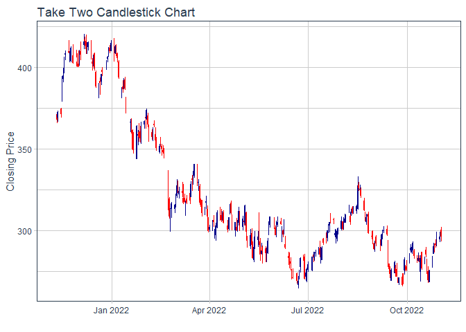

```r
library(ggplot2)
```

```
## Warning: package 'ggplot2' was built under R version 4.1.3
```

```r
library(readr)
```

```
## Warning: package 'readr' was built under R version 4.1.3
```

```r
library(knitr)
```

```
## Warning: package 'knitr' was built under R version 4.1.3
```

```r
library(tidyverse)
```

```
## Warning: package 'tidyverse' was built under R version 4.1.3
```

```
## -- Attaching packages --------------------------------------- tidyverse 1.3.2 --
## v tibble  3.1.8      v dplyr   1.0.10
## v tidyr   1.2.1      v stringr 1.4.1 
## v purrr   0.3.5      v forcats 0.5.2
```

```
## Warning: package 'tibble' was built under R version 4.1.3
```

```
## Warning: package 'tidyr' was built under R version 4.1.3
```

```
## Warning: package 'purrr' was built under R version 4.1.3
```

```
## Warning: package 'dplyr' was built under R version 4.1.3
```

```
## Warning: package 'stringr' was built under R version 4.1.3
```

```
## Warning: package 'forcats' was built under R version 4.1.3
```

```
## -- Conflicts ------------------------------------------ tidyverse_conflicts() --
## x dplyr::filter() masks stats::filter()
## x dplyr::lag()    masks stats::lag()
```

```r
library(dplyr)
library(forcats)
library(corrplot)
```

```
## Warning: package 'corrplot' was built under R version 4.1.3
```

```
## corrplot 0.92 loaded
```

```r
library(tidyquant)
```

```
## Warning: package 'tidyquant' was built under R version 4.1.3
```

```
## Loading required package: lubridate
```

```
## Warning: package 'lubridate' was built under R version 4.1.3
```

```
## 
## Attaching package: 'lubridate'
## 
## The following objects are masked from 'package:base':
## 
##     date, intersect, setdiff, union
## 
## Loading required package: PerformanceAnalytics
```

```
## Warning: package 'PerformanceAnalytics' was built under R version 4.1.3
```

```
## Loading required package: xts
```

```
## Warning: package 'xts' was built under R version 4.1.3
```

```
## Loading required package: zoo
```

```
## Warning: package 'zoo' was built under R version 4.1.3
```

```
## 
## Attaching package: 'zoo'
## 
## The following objects are masked from 'package:base':
## 
##     as.Date, as.Date.numeric
## 
## 
## Attaching package: 'xts'
## 
## The following objects are masked from 'package:dplyr':
## 
##     first, last
## 
## 
## Attaching package: 'PerformanceAnalytics'
## 
## The following object is masked from 'package:graphics':
## 
##     legend
## 
## Loading required package: quantmod
```

```
## Warning: package 'quantmod' was built under R version 4.1.3
```

```
## Loading required package: TTR
```

```
## Warning: package 'TTR' was built under R version 4.1.3
```

```
## Registered S3 method overwritten by 'quantmod':
##   method            from
##   as.zoo.data.frame zoo
```

```r
library(timetk)
```

```
## Warning: package 'timetk' was built under R version 4.1.3
```

```r
library(downloader)
```

```
## Warning: package 'downloader' was built under R version 4.1.3
```

```r
library(dygraphs)
```

```
## Warning: package 'dygraphs' was built under R version 4.1.3
```
#My stocks AAPL, TSLA, HD My friend: AMZN, F, GOOGL

```r
(Apple <- tq_get("AAPL", get = "stock.prices"))
```

```
## # A tibble: 2,727 x 8
##    symbol date        open  high   low close    volume adjusted
##    <chr>  <date>     <dbl> <dbl> <dbl> <dbl>     <dbl>    <dbl>
##  1 AAPL   2012-01-03  14.6  14.7  14.6  14.7 302220800     12.5
##  2 AAPL   2012-01-04  14.6  14.8  14.6  14.8 260022000     12.6
##  3 AAPL   2012-01-05  14.8  14.9  14.7  14.9 271269600     12.7
##  4 AAPL   2012-01-06  15.0  15.1  15.0  15.1 318292800     12.9
##  5 AAPL   2012-01-09  15.2  15.3  15.0  15.1 394024400     12.9
##  6 AAPL   2012-01-10  15.2  15.2  15.1  15.1 258196400     12.9
##  7 AAPL   2012-01-11  15.1  15.1  15.0  15.1 215084800     12.9
##  8 AAPL   2012-01-12  15.1  15.1  15.0  15.0 212587200     12.8
##  9 AAPL   2012-01-13  15.0  15.0  15.0  15.0 226021600     12.8
## 10 AAPL   2012-01-17  15.2  15.2  15.1  15.2 242897200     13.0
## # ... with 2,717 more rows
```

```r
(Tesla <- tq_get("TSLA", get = "stock.prices"))
```

```
## # A tibble: 2,727 x 8
##    symbol date        open  high   low close   volume adjusted
##    <chr>  <date>     <dbl> <dbl> <dbl> <dbl>    <dbl>    <dbl>
##  1 TSLA   2012-01-03  1.93  1.97  1.84  1.87 13921500     1.87
##  2 TSLA   2012-01-04  1.88  1.91  1.83  1.85  9451500     1.85
##  3 TSLA   2012-01-05  1.85  1.86  1.79  1.81 15082500     1.81
##  4 TSLA   2012-01-06  1.81  1.85  1.76  1.79 14794500     1.79
##  5 TSLA   2012-01-09  1.8   1.83  1.74  1.82 13455000     1.82
##  6 TSLA   2012-01-10  1.83  1.85  1.82  1.84 10077000     1.84
##  7 TSLA   2012-01-11  1.84  1.89  1.82  1.88 10084500     1.88
##  8 TSLA   2012-01-12  1.90  1.91  1.85  1.88 10939500     1.88
##  9 TSLA   2012-01-13  1.89  1.9   1.51  1.52 82506000     1.52
## 10 TSLA   2012-01-17  1.77  1.82  1.76  1.77 69774000     1.77
## # ... with 2,717 more rows
```

```r
(Home_Depot <- tq_get("HD", get = "stock.prices"))
```

```
## # A tibble: 2,727 x 8
##    symbol date        open  high   low close   volume adjusted
##    <chr>  <date>     <dbl> <dbl> <dbl> <dbl>    <dbl>    <dbl>
##  1 HD     2012-01-03  42.4  42.9  42.1  42.1  8452900     33.2
##  2 HD     2012-01-04  42.1  42.9  41.9  42.7 11085800     33.6
##  3 HD     2012-01-05  42.6  43.2  42.4  43.1 10245500     33.9
##  4 HD     2012-01-06  43    43.3  42.8  43.2  7285500     34.0
##  5 HD     2012-01-09  43.2  43.3  42.8  43.2  7346600     34.0
##  6 HD     2012-01-10  43.5  43.6  43.1  43.5  7497500     34.3
##  7 HD     2012-01-11  43.5  43.6  43.2  43.5  8222100     34.2
##  8 HD     2012-01-12  43.6  43.7  43.1  43.4  8449900     34.2
##  9 HD     2012-01-13  43.1  43.5  42.9  43.5  8076200     34.2
## 10 HD     2012-01-17  43.6  44.0  43.5  43.7  7709100     34.4
## # ... with 2,717 more rows
```

```r
(Amazon <- tq_get("AMZN", get = "stock.prices"))
```

```
## # A tibble: 2,727 x 8
##    symbol date        open  high   low close    volume adjusted
##    <chr>  <date>     <dbl> <dbl> <dbl> <dbl>     <dbl>    <dbl>
##  1 AMZN   2012-01-03  8.79  8.97  8.78  8.95 102216000     8.95
##  2 AMZN   2012-01-04  8.96  9.02  8.80  8.88  84104000     8.88
##  3 AMZN   2012-01-05  8.80  8.91  8.70  8.88  76182000     8.88
##  4 AMZN   2012-01-06  8.90  9.23  8.88  9.13 140168000     9.13
##  5 AMZN   2012-01-09  9.14  9.22  8.85  8.93 101138000     8.93
##  6 AMZN   2012-01-10  9.06  9.12  8.86  8.97  79716000     8.97
##  7 AMZN   2012-01-11  8.98  9.04  8.91  8.94  62054000     8.94
##  8 AMZN   2012-01-12  8.97  8.97  8.79  8.80 107716000     8.80
##  9 AMZN   2012-01-13  8.79  8.94  8.68  8.92  95070000     8.92
## 10 AMZN   2012-01-17  9.01  9.16  8.93  9.08 112890000     9.08
## # ... with 2,717 more rows
```

```r
(Ford <- tq_get("F", get = "stock.prices"))
```

```
## # A tibble: 2,727 x 8
##    symbol date        open  high   low close    volume adjusted
##    <chr>  <date>     <dbl> <dbl> <dbl> <dbl>     <dbl>    <dbl>
##  1 F      2012-01-03  11    11.2  11.0  11.1  45709900     7.35
##  2 F      2012-01-04  11.2  11.5  11.1  11.3  79725200     7.46
##  3 F      2012-01-05  11.3  11.6  11.2  11.6  67877500     7.65
##  4 F      2012-01-06  11.7  11.8  11.5  11.7  59840700     7.73
##  5 F      2012-01-09  11.8  12.0  11.7  11.8  53981500     7.79
##  6 F      2012-01-10  12    12.0  11.6  11.8 121750600     7.79
##  7 F      2012-01-11  11.7  12.2  11.6  12.1  63806000     7.97
##  8 F      2012-01-12  12.2  12.2  11.9  12.1  48687700     8.01
##  9 F      2012-01-13  12.0  12.1  11.8  12.0  46366700     7.95
## 10 F      2012-01-17  12.2  12.3  12.0  12.0  44398400     7.93
## # ... with 2,717 more rows
```

```r
(Google<- tq_get("GOOGL", get = "stock.prices"))
```

```
## # A tibble: 2,727 x 8
##    symbol date        open  high   low close    volume adjusted
##    <chr>  <date>     <dbl> <dbl> <dbl> <dbl>     <dbl>    <dbl>
##  1 GOOGL  2012-01-03  16.3  16.7  16.3  16.7 146912940     16.7
##  2 GOOGL  2012-01-04  16.6  16.8  16.5  16.7 114445440     16.7
##  3 GOOGL  2012-01-05  16.6  16.6  16.4  16.5 131184684     16.5
##  4 GOOGL  2012-01-06  16.5  16.5  16.3  16.3 107608284     16.3
##  5 GOOGL  2012-01-09  16.2  16.2  15.5  15.6 232671096     15.6
##  6 GOOGL  2012-01-10  15.8  15.9  15.4  15.6 175648176     15.6
##  7 GOOGL  2012-01-11  15.6  15.8  15.5  15.7  95904000     15.7
##  8 GOOGL  2012-01-12  15.8  15.8  15.7  15.8  74932992     15.8
##  9 GOOGL  2012-01-13  15.7  15.7  15.5  15.6  92199708     15.6
## 10 GOOGL  2012-01-17  15.8  15.8  15.7  15.7  76295628     15.7
## # ... with 2,717 more rows
```


```r
mystock <- tq_get(c("AAPL", "TSLA", "HD"), get = "stock.prices", from = "2021-11-02", to = today())
head(mystock)
```

```
## # A tibble: 6 x 8
##   symbol date        open  high   low close   volume adjusted
##   <chr>  <date>     <dbl> <dbl> <dbl> <dbl>    <dbl>    <dbl>
## 1 AAPL   2021-11-02  149.  152.  149.  150. 69122000     149.
## 2 AAPL   2021-11-03  150.  152.  150.  151. 54511500     151.
## 3 AAPL   2021-11-04  152.  152.  151.  151. 60394600     150.
## 4 AAPL   2021-11-05  152.  152.  150.  151. 65463900     151.
## 5 AAPL   2021-11-08  151.  152.  150.  150. 55020900     150.
## 6 AAPL   2021-11-09  150.  151.  150.  151. 56787900     150.
```


```r
friend <- tq_get(c("AMZN", "F", "GOOGL"), get = "stock.prices", from = "2021-11-02", to = today())
tail(friend)
```

```
## # A tibble: 6 x 8
##   symbol date        open  high   low close   volume adjusted
##   <chr>  <date>     <dbl> <dbl> <dbl> <dbl>    <dbl>    <dbl>
## 1 GOOGL  2022-10-25 103.  105.  103.  104.  40611400    104. 
## 2 GOOGL  2022-10-26  96.4  98.3  94.7  94.9 88114100     94.9
## 3 GOOGL  2022-10-27  94.5  95.4  91.8  92.2 60710900     92.2
## 4 GOOGL  2022-10-28  92.3  96.6  92.1  96.3 43697300     96.3
## 5 GOOGL  2022-10-31  95.4  96.0  94.0  94.5 31675000     94.5
## 6 GOOGL  2022-11-01  95.4  96.0  90.4  90.5 47161400     90.5
```


```r
together <- tq_get(c("AAPL", "TSLA", "HD","AMZN", "F", "GOOGL"), get = "stock.prices", from = "2021-11-11", to = today())
head(together)
```

```
## # A tibble: 6 x 8
##   symbol date        open  high   low close    volume adjusted
##   <chr>  <date>     <dbl> <dbl> <dbl> <dbl>     <dbl>    <dbl>
## 1 AAPL   2021-11-11  149.  149.  148.  148.  41000000     147.
## 2 AAPL   2021-11-12  148.  150.  147.  150.  63804000     149.
## 3 AAPL   2021-11-15  150.  152.  149.  150   59222800     149.
## 4 AAPL   2021-11-16  150.  151.  149.  151   59256200     150.
## 5 AAPL   2021-11-17  151   155   151.  153.  88807000     153.
## 6 AAPL   2021-11-18  154.  159.  153.  158. 137827700     157.
```


```r
Combined <- together %>%
  select(symbol, date, adjusted) %>%
  pivot_wider(names_from = symbol, values_from = adjusted) %>%
  tk_xts(date_var = date)
```

```
## Warning: Non-numeric columns being dropped: date
```

```r
dygraph(Combined)
```

```{=html}
<div id="htmlwidget-9a82455dd440895eb2f1" style="width:672px;height:480px;" class="dygraphs html-widget"></div>
<script type="application/json" data-for="htmlwidget-9a82455dd440895eb2f1">{"x":{"attrs":{"labels":["day","AAPL","TSLA","HD","AMZN","F","GOOGL"],"legend":"auto","retainDateWindow":false,"axes":{"x":{"pixelsPerLabel":60}}},"scale":"daily","annotations":[],"shadings":[],"events":[],"format":"date","data":[["2021-11-11T00:00:00.000Z","2021-11-12T00:00:00.000Z","2021-11-15T00:00:00.000Z","2021-11-16T00:00:00.000Z","2021-11-17T00:00:00.000Z","2021-11-18T00:00:00.000Z","2021-11-19T00:00:00.000Z","2021-11-22T00:00:00.000Z","2021-11-23T00:00:00.000Z","2021-11-24T00:00:00.000Z","2021-11-26T00:00:00.000Z","2021-11-29T00:00:00.000Z","2021-11-30T00:00:00.000Z","2021-12-01T00:00:00.000Z","2021-12-02T00:00:00.000Z","2021-12-03T00:00:00.000Z","2021-12-06T00:00:00.000Z","2021-12-07T00:00:00.000Z","2021-12-08T00:00:00.000Z","2021-12-09T00:00:00.000Z","2021-12-10T00:00:00.000Z","2021-12-13T00:00:00.000Z","2021-12-14T00:00:00.000Z","2021-12-15T00:00:00.000Z","2021-12-16T00:00:00.000Z","2021-12-17T00:00:00.000Z","2021-12-20T00:00:00.000Z","2021-12-21T00:00:00.000Z","2021-12-22T00:00:00.000Z","2021-12-23T00:00:00.000Z","2021-12-27T00:00:00.000Z","2021-12-28T00:00:00.000Z","2021-12-29T00:00:00.000Z","2021-12-30T00:00:00.000Z","2021-12-31T00:00:00.000Z","2022-01-03T00:00:00.000Z","2022-01-04T00:00:00.000Z","2022-01-05T00:00:00.000Z","2022-01-06T00:00:00.000Z","2022-01-07T00:00:00.000Z","2022-01-10T00:00:00.000Z","2022-01-11T00:00:00.000Z","2022-01-12T00:00:00.000Z","2022-01-13T00:00:00.000Z","2022-01-14T00:00:00.000Z","2022-01-18T00:00:00.000Z","2022-01-19T00:00:00.000Z","2022-01-20T00:00:00.000Z","2022-01-21T00:00:00.000Z","2022-01-24T00:00:00.000Z","2022-01-25T00:00:00.000Z","2022-01-26T00:00:00.000Z","2022-01-27T00:00:00.000Z","2022-01-28T00:00:00.000Z","2022-01-31T00:00:00.000Z","2022-02-01T00:00:00.000Z","2022-02-02T00:00:00.000Z","2022-02-03T00:00:00.000Z","2022-02-04T00:00:00.000Z","2022-02-07T00:00:00.000Z","2022-02-08T00:00:00.000Z","2022-02-09T00:00:00.000Z","2022-02-10T00:00:00.000Z","2022-02-11T00:00:00.000Z","2022-02-14T00:00:00.000Z","2022-02-15T00:00:00.000Z","2022-02-16T00:00:00.000Z","2022-02-17T00:00:00.000Z","2022-02-18T00:00:00.000Z","2022-02-22T00:00:00.000Z","2022-02-23T00:00:00.000Z","2022-02-24T00:00:00.000Z","2022-02-25T00:00:00.000Z","2022-02-28T00:00:00.000Z","2022-03-01T00:00:00.000Z","2022-03-02T00:00:00.000Z","2022-03-03T00:00:00.000Z","2022-03-04T00:00:00.000Z","2022-03-07T00:00:00.000Z","2022-03-08T00:00:00.000Z","2022-03-09T00:00:00.000Z","2022-03-10T00:00:00.000Z","2022-03-11T00:00:00.000Z","2022-03-14T00:00:00.000Z","2022-03-15T00:00:00.000Z","2022-03-16T00:00:00.000Z","2022-03-17T00:00:00.000Z","2022-03-18T00:00:00.000Z","2022-03-21T00:00:00.000Z","2022-03-22T00:00:00.000Z","2022-03-23T00:00:00.000Z","2022-03-24T00:00:00.000Z","2022-03-25T00:00:00.000Z","2022-03-28T00:00:00.000Z","2022-03-29T00:00:00.000Z","2022-03-30T00:00:00.000Z","2022-03-31T00:00:00.000Z","2022-04-01T00:00:00.000Z","2022-04-04T00:00:00.000Z","2022-04-05T00:00:00.000Z","2022-04-06T00:00:00.000Z","2022-04-07T00:00:00.000Z","2022-04-08T00:00:00.000Z","2022-04-11T00:00:00.000Z","2022-04-12T00:00:00.000Z","2022-04-13T00:00:00.000Z","2022-04-14T00:00:00.000Z","2022-04-18T00:00:00.000Z","2022-04-19T00:00:00.000Z","2022-04-20T00:00:00.000Z","2022-04-21T00:00:00.000Z","2022-04-22T00:00:00.000Z","2022-04-25T00:00:00.000Z","2022-04-26T00:00:00.000Z","2022-04-27T00:00:00.000Z","2022-04-28T00:00:00.000Z","2022-04-29T00:00:00.000Z","2022-05-02T00:00:00.000Z","2022-05-03T00:00:00.000Z","2022-05-04T00:00:00.000Z","2022-05-05T00:00:00.000Z","2022-05-06T00:00:00.000Z","2022-05-09T00:00:00.000Z","2022-05-10T00:00:00.000Z","2022-05-11T00:00:00.000Z","2022-05-12T00:00:00.000Z","2022-05-13T00:00:00.000Z","2022-05-16T00:00:00.000Z","2022-05-17T00:00:00.000Z","2022-05-18T00:00:00.000Z","2022-05-19T00:00:00.000Z","2022-05-20T00:00:00.000Z","2022-05-23T00:00:00.000Z","2022-05-24T00:00:00.000Z","2022-05-25T00:00:00.000Z","2022-05-26T00:00:00.000Z","2022-05-27T00:00:00.000Z","2022-05-31T00:00:00.000Z","2022-06-01T00:00:00.000Z","2022-06-02T00:00:00.000Z","2022-06-03T00:00:00.000Z","2022-06-06T00:00:00.000Z","2022-06-07T00:00:00.000Z","2022-06-08T00:00:00.000Z","2022-06-09T00:00:00.000Z","2022-06-10T00:00:00.000Z","2022-06-13T00:00:00.000Z","2022-06-14T00:00:00.000Z","2022-06-15T00:00:00.000Z","2022-06-16T00:00:00.000Z","2022-06-17T00:00:00.000Z","2022-06-21T00:00:00.000Z","2022-06-22T00:00:00.000Z","2022-06-23T00:00:00.000Z","2022-06-24T00:00:00.000Z","2022-06-27T00:00:00.000Z","2022-06-28T00:00:00.000Z","2022-06-29T00:00:00.000Z","2022-06-30T00:00:00.000Z","2022-07-01T00:00:00.000Z","2022-07-05T00:00:00.000Z","2022-07-06T00:00:00.000Z","2022-07-07T00:00:00.000Z","2022-07-08T00:00:00.000Z","2022-07-11T00:00:00.000Z","2022-07-12T00:00:00.000Z","2022-07-13T00:00:00.000Z","2022-07-14T00:00:00.000Z","2022-07-15T00:00:00.000Z","2022-07-18T00:00:00.000Z","2022-07-19T00:00:00.000Z","2022-07-20T00:00:00.000Z","2022-07-21T00:00:00.000Z","2022-07-22T00:00:00.000Z","2022-07-25T00:00:00.000Z","2022-07-26T00:00:00.000Z","2022-07-27T00:00:00.000Z","2022-07-28T00:00:00.000Z","2022-07-29T00:00:00.000Z","2022-08-01T00:00:00.000Z","2022-08-02T00:00:00.000Z","2022-08-03T00:00:00.000Z","2022-08-04T00:00:00.000Z","2022-08-05T00:00:00.000Z","2022-08-08T00:00:00.000Z","2022-08-09T00:00:00.000Z","2022-08-10T00:00:00.000Z","2022-08-11T00:00:00.000Z","2022-08-12T00:00:00.000Z","2022-08-15T00:00:00.000Z","2022-08-16T00:00:00.000Z","2022-08-17T00:00:00.000Z","2022-08-18T00:00:00.000Z","2022-08-19T00:00:00.000Z","2022-08-22T00:00:00.000Z","2022-08-23T00:00:00.000Z","2022-08-24T00:00:00.000Z","2022-08-25T00:00:00.000Z","2022-08-26T00:00:00.000Z","2022-08-29T00:00:00.000Z","2022-08-30T00:00:00.000Z","2022-08-31T00:00:00.000Z","2022-09-01T00:00:00.000Z","2022-09-02T00:00:00.000Z","2022-09-06T00:00:00.000Z","2022-09-07T00:00:00.000Z","2022-09-08T00:00:00.000Z","2022-09-09T00:00:00.000Z","2022-09-12T00:00:00.000Z","2022-09-13T00:00:00.000Z","2022-09-14T00:00:00.000Z","2022-09-15T00:00:00.000Z","2022-09-16T00:00:00.000Z","2022-09-19T00:00:00.000Z","2022-09-20T00:00:00.000Z","2022-09-21T00:00:00.000Z","2022-09-22T00:00:00.000Z","2022-09-23T00:00:00.000Z","2022-09-26T00:00:00.000Z","2022-09-27T00:00:00.000Z","2022-09-28T00:00:00.000Z","2022-09-29T00:00:00.000Z","2022-09-30T00:00:00.000Z","2022-10-03T00:00:00.000Z","2022-10-04T00:00:00.000Z","2022-10-05T00:00:00.000Z","2022-10-06T00:00:00.000Z","2022-10-07T00:00:00.000Z","2022-10-10T00:00:00.000Z","2022-10-11T00:00:00.000Z","2022-10-12T00:00:00.000Z","2022-10-13T00:00:00.000Z","2022-10-14T00:00:00.000Z","2022-10-17T00:00:00.000Z","2022-10-18T00:00:00.000Z","2022-10-19T00:00:00.000Z","2022-10-20T00:00:00.000Z","2022-10-21T00:00:00.000Z","2022-10-24T00:00:00.000Z","2022-10-25T00:00:00.000Z","2022-10-26T00:00:00.000Z","2022-10-27T00:00:00.000Z","2022-10-28T00:00:00.000Z","2022-10-31T00:00:00.000Z","2022-11-01T00:00:00.000Z"],[147.26062,149.371887,149.381836,150.377731,152.857468,157.219406,159.888382,160.35643,160.744827,161.272644,156.163788,159.579651,164.618805,164.090988,163.085144,161.17305,164.638733,170.474548,174.35849,173.840637,178.710495,175.015778,173.611588,178.561096,171.550095,170.434738,169.050446,172.2771,174.916183,175.553543,179.586868,178.551132,178.640778,177.465637,176.838226,181.259933,178.959457,174.199142,171.291183,171.460495,171.480408,174.35849,174.806641,171.480408,172.356796,169.10025,165.544968,163.832047,161.740723,160.953949,159.121536,159.031921,158.563858,169.628082,174.059738,173.890427,175.115356,172.187469,171.898315,171.170395,174.33136,175.777206,171.629074,168.159012,168.398331,172.297165,172.057861,168.398331,166.82283,163.851334,159.613464,162.275848,164.379822,164.649048,162.734512,166.084946,165.755875,162.704605,158.845657,156.990952,162.485229,158.067886,154.288681,150.190399,154.647644,159.134811,160.16188,163.512283,164.90831,168.338501,169.724533,173.573532,174.221664,175.099167,178.44957,177.26297,174.111984,173.812836,177.931061,174.560699,171.33992,171.649017,169.604874,165.277252,167.181808,169.913986,164.818558,164.599197,166.922531,166.753021,165.945328,161.328537,162.415436,156.352783,156.123444,163.173264,157.200348,157.50946,159.025131,165.546494,156.322876,157.061829,151.849075,154.29567,146.296783,142.362244,146.905945,145.33812,149.03299,140.62468,137.159485,137.399139,142.911484,140.165298,140.325089,143.580551,149.432434,148.633545,148.503723,151.000259,145.178345,145.937286,148.503723,147.754776,142.442139,136.939789,131.697067,132.575836,135.242142,129.879593,131.377502,135.681534,135.162262,138.078201,141.463501,141.463501,137.249359,139.036865,136.53035,138.737274,141.363632,142.721756,146.147003,146.836029,144.669037,145.657669,145.288193,148.264053,149.9617,146.865997,150.790543,152.827713,155.134521,153.876251,152.737839,151.389725,156.57251,157.131744,162.284576,161.285965,159.78804,165.899567,165.580002,165.350006,164.869995,164.919998,169.240005,168.490005,172.100006,173.190002,173.029999,174.550003,174.149994,171.520004,167.570007,167.229996,167.529999,170.029999,163.619995,161.380005,158.910004,157.220001,157.960007,155.809998,154.529999,155.960007,154.460007,157.369995,163.429993,153.839996,155.309998,152.369995,150.699997,154.479996,156.899994,153.720001,152.740005,150.429993,150.770004,151.759995,149.839996,142.479996,138.199997,142.449997,146.100006,146.399994,145.429993,140.089996,140.419998,138.979996,138.339996,142.990005,138.380005,142.410004,143.75,143.860001,143.389999,147.270004,149.449997,152.339996,149.350006,144.800003,155.740005,153.339996,150.649994],[354.503326,344.473328,337.796661,351.57666,363.003326,365.459991,379.019989,385.623322,369.676666,372,360.640015,378.996674,381.58667,365,361.533325,338.323334,336.33667,350.583344,356.320007,334.600006,339.01001,322.136658,319.503326,325.329987,308.973328,310.856659,299.980011,312.843323,336.290009,355.666656,364.646667,362.823334,362.063324,356.779999,352.26001,399.926666,383.196655,362.706665,354.899994,342.320007,352.706665,354.799988,368.73999,343.853333,349.869995,343.503326,331.883331,332.089996,314.633331,310,306.133331,312.470001,276.366669,282.116669,312.23999,310.416656,301.886658,297.046661,307.773346,302.446655,307.333344,310.666656,301.516663,286.666656,291.920013,307.476654,307.796661,292.116669,285.660004,273.843323,254.679993,266.92334,269.956665,290.143341,288.123322,293.296661,279.763336,279.429993,268.193329,274.799988,286.323334,279.433319,265.116669,255.456665,267.296661,280.07666,290.533325,301.796661,307.053345,331.32666,333.036682,337.973328,336.880005,363.946655,366.523346,364.66333,359.200012,361.529999,381.816681,363.753326,348.58667,352.420013,341.829987,325.309998,328.983337,340.790009,328.333344,334.763336,342.716675,325.733337,336.26001,335.016663,332.67334,292.140015,293.83667,292.503326,290.253326,300.980011,303.083344,317.540009,291.093323,288.549988,262.369995,266.679993,244.666672,242.666672,256.529999,241.456665,253.869995,236.603333,236.473328,221.300003,224.96666,209.386673,219.600006,235.910004,253.210007,252.753326,246.789993,258.333344,234.516663,238.279999,238.886673,241.866669,239.706665,232.229996,215.736664,220.889999,233,213.100006,216.759995,237.036667,236.08667,235.070007,245.706665,244.919998,232.66333,228.490005,224.473328,227.263336,233.066666,231.733337,244.543335,250.763336,234.343338,233.070007,237.039993,238.313339,240.066666,240.546661,245.529999,247.5,271.706665,272.243347,268.433319,258.859985,274.820007,280.899994,297.149994,297.276672,300.58667,307.396667,308.633331,288.170013,290.42334,283.333344,294.356659,286.630005,300.029999,309.320007,306.563324,303.996674,302.869995,296.666656,289.91333,296.453339,297.09668,296.070007,288.089996,284.820007,277.700012,275.609985,277.160004,270.209991,274.420013,283.700012,289.26001,299.679993,304.420013,292.130005,302.609985,303.75,303.350006,309.070007,308.730011,300.799988,288.589996,275.329987,276.01001,282.940002,287.809998,268.209991,265.25,242.399994,249.440002,240.809998,238.130005,223.070007,222.960007,216.5,217.240005,221.720001,204.990005,219.350006,220.190002,222.039993,207.279999,214.440002,211.25,222.419998,224.639999,225.089996,228.520004,227.539993,227.820007],[359.291473,364.17807,362.663177,383.431244,385.894073,396.644562,399.420135,399.517883,399.107422,402.762543,393.56604,397.59256,391.523376,392.956207,400.16922,400.208466,407.951416,408.422424,403.584351,403.672668,407.656982,397.686371,394.703064,400.208466,392.082794,380.748108,382.141632,383.191681,388.26532,389.668671,396.5578,398.648071,403.181976,402.298767,407.274292,401.02301,405.144684,399.649078,398.196686,386.273132,380.237762,379.462524,382.141632,379.766724,365.065948,359.884399,352.985413,343.063843,342.592804,357.028656,352.288666,350.620331,349.786163,359.707733,360.139526,361.827484,366.763733,358.009979,352.96579,350.689026,354.702789,357.578186,348.471161,343.76062,345.006958,346.675262,343.564331,341.454437,340.404358,310.276642,302.700531,307.401245,310.747681,309.942963,314.280579,321.267822,318.313965,318.215851,316.753601,310.835999,313.165985,313.896576,312.7612,314.311218,324.361786,326.70166,332.082306,336.406616,325.181213,325.536652,313.017883,311.764038,306.728912,310.283112,313.669495,304.537109,295.523254,298.05069,301.693756,300.98291,294.743286,298.89978,307.153412,302.819275,302.394745,306.472229,300.647247,296.392059,303.885529,311.132202,306.412964,296.293304,301.06189,296.145233,297.764374,307.795197,296.579651,303.066101,301.081635,311.300018,295.30603,290.567078,293.252502,287.457153,279.36142,286.005829,292.265198,292.225739,297.122681,281.553192,284.100403,283.537628,282.392395,284.258362,289.836487,298.958984,304.537109,298.89978,295.263489,303.887207,303.102325,301.920074,299.813782,295.601288,297.916168,287.365021,281.324432,276.863556,277.916687,271.687317,268.975037,267.454956,267.236359,273.634613,281.165466,280.857483,268.398773,272.094666,272.492065,277.270874,281.890747,281.741699,284.831543,284.612976,284.533508,283.271729,285.318359,287.603485,290.514465,291.150299,297.886353,300.340363,303.022858,304.602539,304.165405,296.24707,296.972351,297.687683,298.989197,303.837555,298.760651,304.383972,305.178802,307.682465,309.947693,303.231506,309.560181,308.675964,312.848755,312.570557,325.257782,323.648285,323.101837,319.237061,310.186127,304.910553,306.112701,307.771881,296.167603,294.399139,291.200012,288.420013,293.369995,291.899994,289.540009,297.470001,299.899994,299.769989,297.540009,277.929993,276.339996,271.540009,275.970001,280.420013,274.170013,271.570007,269.140015,270.940002,266.579987,268.690002,282.190002,278.329987,275.940002,283.700012,289.559998,289.850006,290.390015,284.320007,282.459991,282.890015,280.519989,282.829987,276.429993,281.26001,285.059998,275.48999,269.459991,275.529999,283.26001,290.26001,290.149994,291.059998,298.649994,296.130005,296.059998],[173.625,176.257507,177.283997,177.035004,177.449997,184.802994,183.828506,178.628494,179.001999,179.020493,175.227997,178.078506,175.3535,172.186005,171.867996,169.489502,171.3685,176.164505,176.158005,174.171005,172.212006,169.567505,169.091507,173.315002,168.871002,170.017502,167.078995,170.417007,171.037003,171.068497,169.669495,170.660995,169.201004,168.644501,166.716995,170.404495,167.522003,164.356995,163.253998,162.554001,161.485992,165.362,165.207001,161.214005,162.138,158.917496,156.298996,151.667496,142.643005,144.544006,139.985992,138.872498,139.637497,143.977997,149.573502,151.193497,150.612503,138.845505,157.639496,157.935501,161.413498,161.189499,159.003494,153.293503,155.167007,156.510498,158.100494,154.652496,152.601501,150.197495,144.826996,151.358002,153.788498,153.563004,151.141998,152.052505,147.898499,145.641006,137.453003,136.014496,139.279007,146.817505,145.524506,141.852997,147.366501,153.104004,157.238998,161.250504,161.491501,164.889008,163.408005,163.649506,164.773499,168.990494,169.315002,166.300995,162.997498,163.559998,168.346497,164.054993,158.755997,157.7845,154.460495,151.121994,150.787506,155.541,151.706497,152.785004,158.115494,153.998001,148.296005,144.350006,146.074005,139.391006,138.167007,144.596497,124.281502,124.5,124.253502,125.928497,116.406998,114.772499,108.789001,108.859001,105.372002,106.930496,113.055,110.810501,115.3685,107.112503,107.319,107.591003,107.556999,104.099998,106.775002,111.077499,115.1465,120.209503,121.683998,125.511002,122.349998,124.790001,123,121.18,116.150002,109.650002,103.669998,102.309998,107.669998,103.660004,106.220001,108.68,108.949997,112.440002,116.459999,113.220001,107.400002,108.919998,106.209999,109.559998,113.5,114.330002,116.330002,115.540001,111.75,109.220001,110.400002,110.629997,113.550003,113.760002,118.209999,122.769997,124.629997,122.419998,121.139999,114.809998,120.970001,122.279999,134.949997,135.389999,134.160004,139.520004,142.570007,140.800003,139.410004,137.830002,142.690002,140.639999,143.550003,143.179993,144.779999,142.100006,142.300003,138.229996,133.220001,133.619995,133.800003,137.279999,130.75,129.789993,128.729996,126.769997,127.82,127.510002,126.110001,129.479996,129.820007,133.270004,136.449997,126.82,128.550003,126.279999,123.529999,124.660004,122.190002,118.540001,117.309998,113.779999,115.150002,114.410004,118.010002,114.800003,113,115.879997,121.089996,120.949997,120.300003,114.559998,113.669998,112.209999,112.900002,112.529999,106.900002,113.790001,116.360001,115.07,115.25,119.32,119.82,120.599998,115.660004,110.959999,103.410004,102.440002,96.790001],[19.034803,18.986122,19.336637,19.268482,19.434,19.140434,18.974079,20.040701,19.766706,19.815636,19.326359,19.248074,18.778374,19.160007,19.443787,18.729445,18.807726,19.531855,19.385073,19.150221,20.989895,19.991774,19.619923,19.756922,19.91349,19.34593,19.003439,19.189362,19.707993,19.815636,20.353836,20.314695,20.118984,20.030916,20.32448,21.30303,23.788546,23.152489,23.935329,23.915758,23.338415,23.827688,23.945114,24.483316,24.649672,23.857044,21.968445,21.185604,20.207052,19.952631,19.551424,19.482927,19.130648,19.219172,19.966694,20.320784,20.291273,19.563423,17.665112,17.596262,17.429054,18.04871,17.783144,17.261845,17.173323,17.783144,17.714294,17.25201,17.743801,17.006115,16.6717,16.868412,17.537249,17.271681,16.425802,17.802816,17.311024,16.573339,15.707788,15.766803,16.101221,16.061876,15.77664,15.481564,15.796309,16.307772,16.307772,16.583176,16.209414,16.809399,16.40613,16.553667,16.199577,16.396294,17.458563,16.986444,16.632355,16.376623,16.386459,15.56025,15.137311,14.714371,14.802894,15.029117,15.107803,15.255341,15.225832,15.412713,15.884832,15.786473,15.442221,14.88158,15.039999,14.564739,14.703358,14.475628,14.020171,14.129085,14.416222,14.832073,14.386517,14.069677,13.237972,13.21817,12.703304,12.317155,13.366689,12.921132,13.396392,12.653798,12.723107,12.376563,12.703304,12.297354,12.58449,12.99044,13.495404,13.544911,13.416195,13.752837,13.366689,13.327084,13.604318,13.396392,13.148861,12.624095,11.693377,12.079526,12.148835,11.138906,11.119104,11.346833,11.366635,11.445847,11.891402,11.921105,11.693377,11.406241,11.020092,11.208216,11.0894,10.950784,11.534957,11.505253,11.178512,11.445847,11.396339,11.277525,11.762686,11.841896,12.465674,12.604292,12.871626,12.693403,12.713206,12.416168,13.05975,13.861751,14.544937,15.188519,15.010296,15.535062,15.218222,15.148913,15.624173,15.039999,15.5,15.83,16.18,16.32,16.43,16.030001,16.15,15.88,15.08,15.32,15.52,15.93,15.41,15.57,15.45,15.24,15.19,15.16,15.03,15.43,15.47,15.42,15.54,14.74,14.66,14.89,14.72,14.93,13.09,13.05,12.77,12.31,11.99,11.91,12.18,11.47,11.2,11.47,12.36,12.51,12.36,12.2,11.36,11.56,11.54,11.77,11.67,11.83,12.03,12.13,11.77,12.19,12.48,12.83,12.82,13,13.26,13.37,13.4],[145.766495,148.677994,148.451996,147.876007,148.046997,149.838501,148.926498,146.302002,145.781998,146.119995,142.182999,145.530502,141.897507,141.051498,142.966003,142.001495,143.154999,147.269501,148.186493,147.638504,148.001495,145.826508,143.906998,146.440994,144.445007,141.725006,141.606995,143.472504,146.414993,146.916504,147.906494,146.686996,146.654999,146.2005,144.852005,144.991501,144.399506,137.774994,137.747498,137.016998,138.669495,139.735992,141.430496,138.587006,139.480499,135.998001,135.116501,133.307495,130.351501,130.804001,126.934998,129.233002,129.005005,133.350998,135.303497,137.643997,148,143.089996,143.292999,139.201004,139.399002,141.591995,138.619995,134.282501,135.526001,136.608505,137.738007,132.539001,130.403,129.813507,127.587997,132.690994,134.459503,135.057007,134.061493,134.571503,133.899506,131.906494,126.378502,127.1045,133.419998,132.429504,129.870499,125.950996,129.197998,133.280502,133.839005,136.125504,136.101501,139.867996,138.275497,141.572006,141.673004,141.455505,142.505493,141.938507,139.067505,140.150497,142.971497,140.591003,136.548004,135.888504,133.287506,128.823502,127.7145,129.893997,126.730003,127.676498,130.009003,128.039993,124.814499,119.635498,123.073997,118.650002,114.294502,118.522499,114.109497,116.583,117.334,122.261002,116.505501,115.746498,112.511002,114.394997,113.602501,112.844002,116.050499,114.445,116.473,111.899498,110.384003,108.907997,111.487999,105.970001,105.805,107.792503,112.316498,113.762001,113.891998,117.622498,114.541,116.820503,117.149498,117.194,114.835503,111.161499,106.392502,106.7155,109.764503,106.033501,107.143501,111.543999,111.487503,112.241997,117.974998,115.833504,112.0075,111.7015,108.962997,108.737503,113.263,114.571999,118.782997,119.3535,115.676498,114.0205,111.3535,110.3675,111.777496,109.029999,113.809998,113.900002,114.339996,107.900002,107.510002,105.019997,113.059998,114.220001,116.32,114.860001,115.129997,118.080002,118.190002,117.470001,117.300003,116.629997,119.699997,118.839996,121.68,122.080002,121.699997,119.550003,120.169998,117.209999,114.239998,113.860001,113.690002,116.650002,110.339996,109.419998,108.940002,108.220001,109.739998,107.849998,106.809998,109.449997,108.379997,110.650002,110.860001,104.32,105,102.910004,102.800003,103.07,101.139999,99.279999,100.139999,98.739998,98.169998,97.5,100.050003,97.419998,95.650002,98.639999,101.639999,101.43,101.419998,98.68,97.860001,97.18,97.559998,99.059998,96.559998,99.970001,100.769997,99.629997,99.970001,101.129997,102.519997,104.480003,94.93,92.220001,96.290001,94.510002,90.470001]]},"evals":[],"jsHooks":[]}</script>
```
#As we can learn from the graph above it seems that home depot was the best performer. Most stocks stayed the same or had a decline in the case of home depot can amazon. 

```r
together %>%
  filter(symbol == "HD") %>%
  ggplot(aes(x = date, y = adjusted)) +
  geom_candlestick(aes(open = open, high = high, low = low, close = close)) +
  labs(title = "Take Two Candlestick Chart", 
       y = "Closing Price", x = "") + 
  theme_tq()
```

<!-- -->
#Using the candle stick plot you can see that home depot had been on a steady decline. So while it may seem like home depot won, the compnay has had an obvous fall. 
