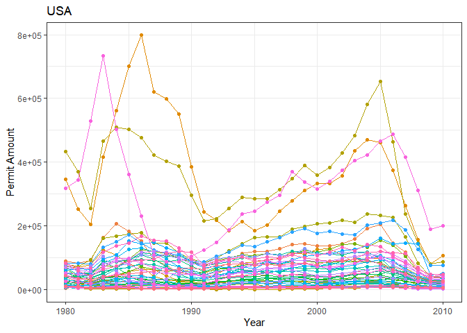
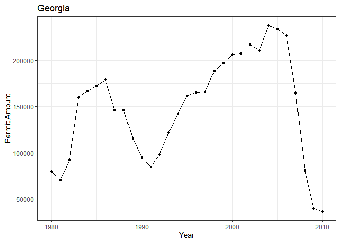
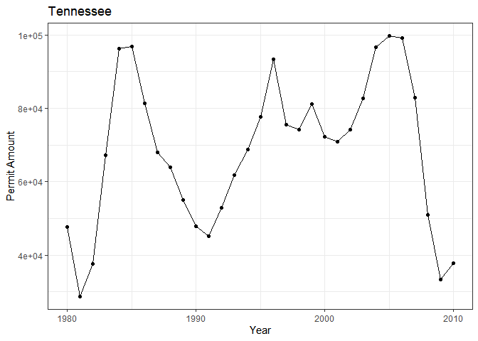
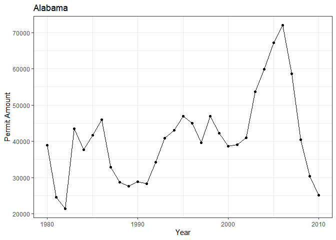
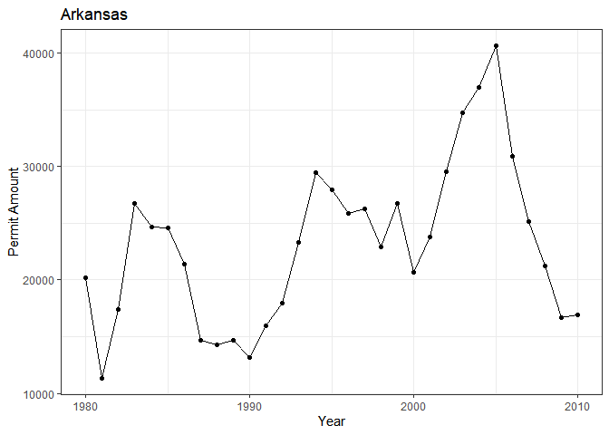
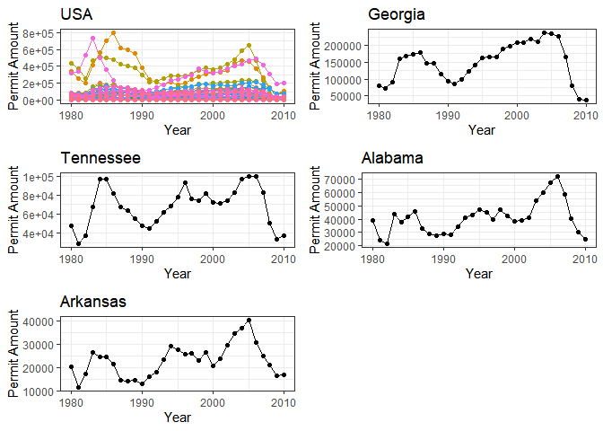

```r
library(tidyverse)
```

```
## Warning: package 'tidyverse' was built under R version 4.1.3
```

```
## -- Attaching packages --------------------------------------- tidyverse 1.3.2 --
## v ggplot2 3.3.5     v purrr   0.3.4
## v tibble  3.1.6     v dplyr   1.0.7
## v tidyr   1.1.4     v stringr 1.4.0
## v readr   2.1.1     v forcats 0.5.1
## -- Conflicts ------------------------------------------ tidyverse_conflicts() --
## x dplyr::filter() masks stats::filter()
## x dplyr::lag()    masks stats::lag()
```

```r
library(sf)
```

```
## Warning: package 'sf' was built under R version 4.1.3
```

```
## Linking to GEOS 3.10.2, GDAL 3.4.1, PROJ 7.2.1; sf_use_s2() is TRUE
```

```r
library(USAboundaries)
library(ggplot2)
library(readr)
library(knitr)
library(tidyverse)
library(dplyr)
library(forcats)
library(downloader)
```

```
## Warning: package 'downloader' was built under R version 4.1.3
```

```r
library(corrplot)
```

```
## Warning: package 'corrplot' was built under R version 4.1.3
```

```
## corrplot 0.92 loaded
```

```r
library(ggrepel)
```

```
## Warning: package 'ggrepel' was built under R version 4.1.3
```

```r
library(sf)
library(maps)
```

```
## Warning: package 'maps' was built under R version 4.1.3
```

```
## 
## Attaching package: 'maps'
## 
## The following object is masked from 'package:purrr':
## 
##     map
```

```r
library(readr)
library(remotes)
```

```
## Warning: package 'remotes' was built under R version 4.1.3
```

```r
library(dygraphs)
```

```
## Warning: package 'dygraphs' was built under R version 4.1.3
```

```r
library(ggsflabel)
```

```
## 
## Attaching package: 'ggsflabel'
## 
## The following objects are masked from 'package:ggplot2':
## 
##     geom_sf_label, geom_sf_text, StatSfCoordinates
```

```r
library(plotly)
```

```
## 
## Attaching package: 'plotly'
## 
## The following object is masked from 'package:ggplot2':
## 
##     last_plot
## 
## The following object is masked from 'package:stats':
## 
##     filter
## 
## The following object is masked from 'package:graphics':
## 
##     layout
```

```r
library(gridExtra)
```

```
## Warning: package 'gridExtra' was built under R version 4.1.3
```

```
## 
## Attaching package: 'gridExtra'
## 
## The following object is masked from 'package:dplyr':
## 
##     combine
```


```r
permits_data <- tempfile()
download("https://raw.githubusercontent.com/WJC-Data-Science/DTS350/master/permits.csv", 
         permits_data, mode = "wb")
permits <- read_csv(permits_data)
```

```
## New names:
## * `` -> ...1
```

```
## Rows: 327422 Columns: 8
## -- Column specification --------------------------------------------------------
## Delimiter: ","
## chr (3): StateAbbr, countyname, variable
## dbl (5): ...1, state, county, year, value
## 
## i Use `spec()` to retrieve the full column specification for this data.
## i Specify the column types or set `show_col_types = FALSE` to quiet this message.
```


```r
counties<-us_counties()
FIPS<-permits%>%
  mutate(state=as.character(state), stateFIPS=str_pad(state, 2,pad="0")) %>%
  mutate(county=as.character(county), countyFIPS=str_pad(county, 3,pad="0"))
FIPS
```

```
## # A tibble: 327,422 x 10
##     ...1 state StateAbbr county countyname   varia~1  year value state~2 count~3
##    <dbl> <chr> <chr>     <chr>  <chr>        <chr>   <dbl> <dbl> <chr>   <chr>  
##  1     1 1     AL        1      Autauga Cou~ All Pe~  2010   191 01      001    
##  2     2 1     AL        1      Autauga Cou~ All Pe~  2009   110 01      001    
##  3     3 1     AL        1      Autauga Cou~ All Pe~  2008   173 01      001    
##  4     4 1     AL        1      Autauga Cou~ All Pe~  2007   260 01      001    
##  5     5 1     AL        1      Autauga Cou~ All Pe~  2006   347 01      001    
##  6     6 1     AL        1      Autauga Cou~ All Pe~  2005   313 01      001    
##  7     7 1     AL        1      Autauga Cou~ All Pe~  2004   367 01      001    
##  8     8 1     AL        1      Autauga Cou~ All Pe~  2003   283 01      001    
##  9     9 1     AL        1      Autauga Cou~ All Pe~  2002   276 01      001    
## 10    10 1     AL        1      Autauga Cou~ All Pe~  2001   400 01      001    
## # ... with 327,412 more rows, and abbreviated variable names 1: variable,
## #   2: stateFIPS, 3: countyFIPS
```


```r
FIPS1 <- FIPS%>%
  mutate(geoid=paste0(stateFIPS,countyFIPS))
countyFIP <- merge(FIPS1,counties, by = "geoid") %>%
  group_by(state_name,year) %>%
  summarise(geoid=sum(value))
```

```
## `summarise()` has grouped output by 'state_name'. You can override using the
## `.groups` argument.
```


```r
USA <- ggplot(data = countyFIP, aes(x = year, y = geoid, color = state_name)) +
  geom_line() +
  geom_point() +
  labs(title="USA", x = "Year", y = "Permit Amount") +
  theme_bw() +
  theme(legend.position = 'none') 
USA
```

<!-- -->


```r
Georgia <- countyFIP %>%
  filter(state_name == 'Georgia') %>%
  ggplot(aes(x = year, y = geoid)) +
  geom_point() +
  geom_line() +
  labs(title="Georgia",x = 'Year', y = 'Permit Amount') +
  theme_bw() +
  theme(legend.position = 'none')
Georgia
```

<!-- -->


```r
Tennessee <- countyFIP %>%
  filter(state_name == 'Tennessee') %>%
  ggplot(aes(x = year, y = geoid)) +
  geom_point() +
  geom_line() +
  labs(title="Tennessee",x = 'Year', y = 'Permit Amount') +
  theme_bw() +
  theme(legend.position = 'none')
Tennessee
```

<!-- -->


```r
Alabama <- countyFIP %>%
  filter(state_name == 'Alabama') %>%
  ggplot(aes(x = year, y = geoid)) +
  geom_point() +
  geom_line() +
  labs(title="Alabama",x = 'Year', y = 'Permit Amount') +
  theme_bw() +
  theme(legend.position = 'none')
Alabama
```

<!-- -->


```r
Arkansas <- countyFIP %>%
  filter(state_name == 'Arkansas') %>%
  ggplot(aes(x = year, y = geoid)) +
  geom_point() +
  geom_line() +
  labs(title="Arkansas",x = 'Year', y = 'Permit Amount') +
  theme_bw() +
  theme(legend.position = 'none')
Arkansas
```

<!-- -->


```r
grid.arrange(USA, Georgia, Tennessee, Alabama, Arkansas, nrow = 3)
```

<!-- -->
#In the above graphs it shows the bulding permits for each state and the entire United States. As can be seen for the viusals above, I chose to use scatter plot and line graph to show the changes of the permits from year to year. Comparing all of the visuals you can see that the 2008 housing market crash had a huge impact on the United States as a whole. Each state had a sharp decline in the permits. Obviusly from the above graphs I only did sothern states, but each state has vastly different economies and populations and are a good representation of the entire US. 
