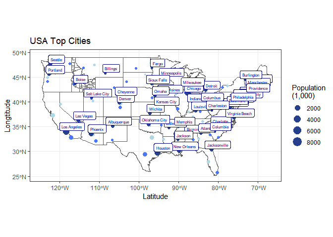

```r
library(tidyverse)
```

```
## Warning: package 'tidyverse' was built under R version 4.1.3
```

```
## -- Attaching packages --------------------------------------- tidyverse 1.3.2 --
## v ggplot2 3.3.5     v purrr   0.3.4
## v tibble  3.1.6     v dplyr   1.0.7
## v tidyr   1.1.4     v stringr 1.4.0
## v readr   2.1.1     v forcats 0.5.1
## -- Conflicts ------------------------------------------ tidyverse_conflicts() --
## x dplyr::filter() masks stats::filter()
## x dplyr::lag()    masks stats::lag()
```

```r
library(sf)
```

```
## Warning: package 'sf' was built under R version 4.1.3
```

```
## Linking to GEOS 3.10.2, GDAL 3.4.1, PROJ 7.2.1; sf_use_s2() is TRUE
```

```r
library(USAboundaries)
library(ggplot2)
library(readr)
library(knitr)
library(tidyverse)
library(dplyr)
library(forcats)
library(downloader)
```

```
## Warning: package 'downloader' was built under R version 4.1.3
```

```r
library(corrplot)
```

```
## Warning: package 'corrplot' was built under R version 4.1.3
```

```
## corrplot 0.92 loaded
```

```r
library(ggrepel)
```

```
## Warning: package 'ggrepel' was built under R version 4.1.3
```

```r
library(sf)
library(maps)
```

```
## Warning: package 'maps' was built under R version 4.1.3
```

```
## 
## Attaching package: 'maps'
## 
## The following object is masked from 'package:purrr':
## 
##     map
```


```r
id <- us_counties(states = "ID")
states <- sf::st_as_sf(map("state", plot = FALSE, fill = TRUE))
```


```r
cities <- us_cities()
```

```
## City populations for contemporary data come from the 2010 census.
```


```r
topcity <- cities %>%
  filter(state_name != 'Alaska', state_name != 'Hawaii') %>%
  group_by(state_name) %>%
  arrange(desc(population)) %>%
  slice(1:3)
head(topcity)
```

```
## Simple feature collection with 6 features and 12 fields
## Geometry type: POINT
## Dimension:     XY
## Bounding box:  xmin: -112.088 ymin: 30.66843 xmax: -86.26859 ymax: 33.57216
## Geodetic CRS:  WGS 84
## # A tibble: 6 x 13
## # Groups:   state_name [2]
##   city    state~1 state~2 county count~3 stplf~4 name_~5 city_~6 popul~7 place~8
##   <chr>   <chr>   <chr>   <chr>  <chr>   <chr>   <chr>   <chr>   <chr>   <chr>  
## 1 Birmin~ Alabama AL      JEFFE~ Jeffer~ 0107000 Birmin~ US Cen~ US Cen~ Incorp~
## 2 Montgo~ Alabama AL      MONTG~ Montgo~ 0151000 Montgo~ US Cen~ US Cen~ Incorp~
## 3 Mobile  Alabama AL      MOBILE Mobile  0150000 Mobile~ US Cen~ US Cen~ Incorp~
## 4 Phoenix Arizona AZ      MARIC~ Marico~ 0455000 Phoeni~ US Cen~ US Cen~ Incorp~
## 5 Tucson  Arizona AZ      PIMA   Pima    0477000 Tucson~ US Cen~ US Cen~ Incorp~
## 6 Mesa    Arizona AZ      MARIC~ Marico~ 0446000 Mesa c~ US Cen~ US Cen~ Incorp~
## # ... with 3 more variables: year <int>, population <int>,
## #   geometry <POINT [°]>, and abbreviated variable names 1: state_name,
## #   2: state_abbr, 3: county_name, 4: stplfips_2010, 5: name_2010,
## #   6: city_source, 7: population_source, 8: place_type
```


```r
number1 <- topcity %>%
  slice(1:1)
head(number1)
```

```
## Simple feature collection with 6 features and 12 fields
## Geometry type: POINT
## Dimension:     XY
## Bounding box:  xmin: -118.4108 ymin: 33.52744 xmax: -73.19573 ymax: 41.18739
## Geodetic CRS:  WGS 84
## # A tibble: 6 x 13
## # Groups:   state_name [6]
##   city    state~1 state~2 county count~3 stplf~4 name_~5 city_~6 popul~7 place~8
##   <chr>   <chr>   <chr>   <chr>  <chr>   <chr>   <chr>   <chr>   <chr>   <chr>  
## 1 Birmin~ Alabama AL      JEFFE~ Jeffer~ 0107000 Birmin~ US Cen~ US Cen~ Incorp~
## 2 Phoenix Arizona AZ      MARIC~ Marico~ 0455000 Phoeni~ US Cen~ US Cen~ Incorp~
## 3 Little~ Arkans~ AR      PULAS~ Pulaski 0541000 Little~ US Cen~ US Cen~ Incorp~
## 4 Los An~ Califo~ CA      LOS A~ Los An~ 0644000 Los An~ US Cen~ US Cen~ Incorp~
## 5 Denver  Colora~ CO      ARAPA~ Arapah~ 0820000 Denver~ US Cen~ US Cen~ Incorp~
## 6 Bridge~ Connec~ CT      FAIRF~ Fairfi~ 0908000 Bridge~ US Cen~ US Cen~ Incorp~
## # ... with 3 more variables: year <int>, population <int>,
## #   geometry <POINT [°]>, and abbreviated variable names 1: state_name,
## #   2: state_abbr, 3: county_name, 4: stplfips_2010, 5: name_2010,
## #   6: city_source, 7: population_source, 8: place_type
```

```r
number2 <- topcity %>%
  slice(2:2)

number3 <- topcity %>%
  slice(3:3)
```


```r
ggplot() +
  geom_sf(data = states, fill = NA) +
  geom_sf(data = id, fill = NA) +
  geom_sf(data = number3, aes(size = population/1000), color = "lightblue") +
  geom_sf(data = number2, aes(size = population/1000), color = "royalblue1") +
  geom_sf(data = number1, aes(size = population/1000), color = "royalblue4") +
  geom_sf_label(data = number1, aes(label = city), color = "darkblue", nudge_x = 1.5, nudge_y = 1, size = 2) +
  scale_size_continuous(name = 'Population\n(1,000)') +
  labs(title="USA Top Cities", x="Latitude", y="Longtitude")+
  theme_bw()
```

```
## Warning in st_point_on_surface.sfc(sf::st_zm(x)): st_point_on_surface may not
## give correct results for longitude/latitude data
```

<!-- -->

