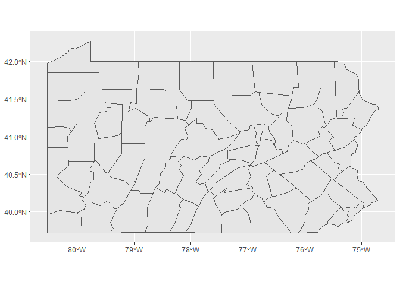

```r
library(tidyverse)
```

```
## Warning: package 'tidyverse' was built under R version 4.1.3
```

```
## -- Attaching packages --------------------------------------- tidyverse 1.3.2 --
## v ggplot2 3.3.5     v purrr   0.3.4
## v tibble  3.1.6     v dplyr   1.0.7
## v tidyr   1.1.4     v stringr 1.4.0
## v readr   2.1.1     v forcats 0.5.1
## -- Conflicts ------------------------------------------ tidyverse_conflicts() --
## x dplyr::filter() masks stats::filter()
## x dplyr::lag()    masks stats::lag()
```

```r
library(sf)
```

```
## Warning: package 'sf' was built under R version 4.1.3
```

```
## Linking to GEOS 3.10.2, GDAL 3.4.1, PROJ 7.2.1; sf_use_s2() is TRUE
```

```r
library(USAboundaries)
library(ggplot2)
library(readr)
library(knitr)
library(tidyverse)
library(dplyr)
library(forcats)
library(downloader)
```

```
## Warning: package 'downloader' was built under R version 4.1.3
```

```r
library(corrplot)
```

```
## Warning: package 'corrplot' was built under R version 4.1.3
```

```
## corrplot 0.92 loaded
```

```r
library(ggrepel)
```

```
## Warning: package 'ggrepel' was built under R version 4.1.3
```

```r
library(sf)
library(maps)
```

```
## Warning: package 'maps' was built under R version 4.1.3
```

```
## 
## Attaching package: 'maps'
## 
## The following object is masked from 'package:purrr':
## 
##     map
```

```r
library(readr)
library(remotes)
```

```
## Warning: package 'remotes' was built under R version 4.1.3
```

```r
library(dygraphs)
```

```
## Warning: package 'dygraphs' was built under R version 4.1.3
```

```r
library(ggsflabel)
```

```
## 
## Attaching package: 'ggsflabel'
## 
## The following objects are masked from 'package:ggplot2':
## 
##     geom_sf_label, geom_sf_text, StatSfCoordinates
```

```r
library(plotly)
```

```
## 
## Attaching package: 'plotly'
## 
## The following object is masked from 'package:ggplot2':
## 
##     last_plot
## 
## The following object is masked from 'package:stats':
## 
##     filter
## 
## The following object is masked from 'package:graphics':
## 
##     layout
```

```r
library(gridExtra)
```

```
## Warning: package 'gridExtra' was built under R version 4.1.3
```

```
## 
## Attaching package: 'gridExtra'
## 
## The following object is masked from 'package:dplyr':
## 
##     combine
```

```r
library(leaflet)
```

```
## Warning: package 'leaflet' was built under R version 4.1.3
```


```r
permits_data <- tempfile()
download("https://raw.githubusercontent.com/WJC-Data-Science/DTS350/master/permits.csv", 
         permits_data, mode = "wb")
permits <- read_csv(permits_data)
```

```
## New names:
## * `` -> ...1
```

```
## Rows: 327422 Columns: 8
## -- Column specification --------------------------------------------------------
## Delimiter: ","
## chr (3): StateAbbr, countyname, variable
## dbl (5): ...1, state, county, year, value
## 
## i Use `spec()` to retrieve the full column specification for this data.
## i Specify the column types or set `show_col_types = FALSE` to quiet this message.
```

```r
head(permits)
```

```
## # A tibble: 6 x 8
##    ...1 state StateAbbr county countyname     variable     year value
##   <dbl> <dbl> <chr>      <dbl> <chr>          <chr>       <dbl> <dbl>
## 1     1     1 AL             1 Autauga County All Permits  2010   191
## 2     2     1 AL             1 Autauga County All Permits  2009   110
## 3     3     1 AL             1 Autauga County All Permits  2008   173
## 4     4     1 AL             1 Autauga County All Permits  2007   260
## 5     5     1 AL             1 Autauga County All Permits  2006   347
## 6     6     1 AL             1 Autauga County All Permits  2005   313
```

```r
filterPA<- permits %>%
  filter(StateAbbr=="PA",year==2010)
head(filterPA)
```

```
## # A tibble: 6 x 8
##     ...1 state StateAbbr county countyname       variable             year value
##    <dbl> <dbl> <chr>      <dbl> <chr>            <chr>               <dbl> <dbl>
## 1 235713    42 PA             1 Adams County     All Permits          2010   306
## 2 235744    42 PA             1 Adams County     Single Family        2010   284
## 3 235775    42 PA             1 Adams County     All Multifamily      2010    22
## 4 235833    42 PA             1 Adams County     5+-Unit Multifamily  2010    22
## 5 235844    42 PA             3 Allegheny County All Permits          2010  1424
## 6 235875    42 PA             3 Allegheny County Single Family        2010  1407
```


```r
county1 <- read_csv("CountyDat.csv")
```

```
## Rows: 68 Columns: 6
## -- Column specification --------------------------------------------------------
## Delimiter: ","
## chr (2): County Name, Georeferenced Latitude & Longitude
## dbl (4): County Code Number, County Code text, Longitude, Latitude
## 
## i Use `spec()` to retrieve the full column specification for this data.
## i Specify the column types or set `show_col_types = FALSE` to quiet this message.
```

```r
head(county1)
```

```
## # A tibble: 6 x 6
##   `County Name` `County Code Number` `County Code text` Longit~1 Latit~2 Geore~3
##   <chr>                        <dbl>              <dbl>    <dbl>   <dbl> <chr>  
## 1 Adams                            1                  1    -77.2    39.9 POINT ~
## 2 Allegheny                        2                  2    -80.0    40.5 POINT ~
## 3 Armstrong                        3                  3    -79.5    40.8 POINT ~
## 4 Beaver                           4                  4    -80.4    40.7 POINT ~
## 5 Bedford                          5                  5    -78.5    40.0 POINT ~
## 6 Berks                            6                  6    -75.9    40.4 POINT ~
## # ... with abbreviated variable names 1: Longitude, 2: Latitude,
## #   3: `Georeferenced Latitude & Longitude`
```

```r
permitsPA<-filterPA %>%
  mutate(county = as.character(county))
head(permitsPA)
```

```
## # A tibble: 6 x 8
##     ...1 state StateAbbr county countyname       variable             year value
##    <dbl> <dbl> <chr>     <chr>  <chr>            <chr>               <dbl> <dbl>
## 1 235713    42 PA        1      Adams County     All Permits          2010   306
## 2 235744    42 PA        1      Adams County     Single Family        2010   284
## 3 235775    42 PA        1      Adams County     All Multifamily      2010    22
## 4 235833    42 PA        1      Adams County     5+-Unit Multifamily  2010    22
## 5 235844    42 PA        3      Allegheny County All Permits          2010  1424
## 6 235875    42 PA        3      Allegheny County Single Family        2010  1407
```

```r
county2<-county1 %>%
  mutate(county=as.character(`County Code Number`))
head(county2)
```

```
## # A tibble: 6 x 7
##   `County Name` `County Code Number` County Cod~1 Longi~2 Latit~3 Geore~4 county
##   <chr>                        <dbl>        <dbl>   <dbl>   <dbl> <chr>   <chr> 
## 1 Adams                            1            1   -77.2    39.9 POINT ~ 1     
## 2 Allegheny                        2            2   -80.0    40.5 POINT ~ 2     
## 3 Armstrong                        3            3   -79.5    40.8 POINT ~ 3     
## 4 Beaver                           4            4   -80.4    40.7 POINT ~ 4     
## 5 Bedford                          5            5   -78.5    40.0 POINT ~ 5     
## 6 Berks                            6            6   -75.9    40.4 POINT ~ 6     
## # ... with abbreviated variable names 1: `County Code text`, 2: Longitude,
## #   3: Latitude, 4: `Georeferenced Latitude & Longitude`
```


```r
combine<- left_join(county2, permitsPA, by="county")
head(combine)
```

```
## # A tibble: 6 x 14
##   County N~1 Count~2 Count~3 Longi~4 Latit~5 Geore~6 county   ...1 state State~7
##   <chr>        <dbl>   <dbl>   <dbl>   <dbl> <chr>   <chr>   <dbl> <dbl> <chr>  
## 1 Adams            1       1   -77.2    39.9 POINT ~ 1      235713    42 PA     
## 2 Adams            1       1   -77.2    39.9 POINT ~ 1      235744    42 PA     
## 3 Adams            1       1   -77.2    39.9 POINT ~ 1      235775    42 PA     
## 4 Adams            1       1   -77.2    39.9 POINT ~ 1      235833    42 PA     
## 5 Allegheny        2       2   -80.0    40.5 POINT ~ 2          NA    NA <NA>   
## 6 Armstrong        3       3   -79.5    40.8 POINT ~ 3      235844    42 PA     
## # ... with 4 more variables: countyname <chr>, variable <chr>, year <dbl>,
## #   value <dbl>, and abbreviated variable names 1: `County Name`,
## #   2: `County Code Number`, 3: `County Code text`, 4: Longitude, 5: Latitude,
## #   6: `Georeferenced Latitude & Longitude`, 7: StateAbbr
```


```r
combine1 <- combine %>%
  arrange(desc(value))
head(combine1)
```

```
## # A tibble: 6 x 14
##   County N~1 Count~2 Count~3 Longi~4 Latit~5 Geore~6 county   ...1 state State~7
##   <chr>        <dbl>   <dbl>   <dbl>   <dbl> <chr>   <chr>   <dbl> <dbl> <chr>  
## 1 Armstrong        3       3   -79.5    40.8 POINT ~ 3      235844    42 PA     
## 2 Armstrong        3       3   -79.5    40.8 POINT ~ 3      235875    42 PA     
## 3 Fulton          29      29   -78.1    39.9 POINT ~ 29     237703    42 PA     
## 4 Fulton          29      29   -78.1    39.9 POINT ~ 29     237734    42 PA     
## 5 Lycoming        41      41   -77.1    41.3 POINT ~ 41     238489    42 PA     
## 6 Mercer          43      43   -80.3    41.3 POINT ~ 43     238671    42 PA     
## # ... with 4 more variables: countyname <chr>, variable <chr>, year <dbl>,
## #   value <dbl>, and abbreviated variable names 1: `County Name`,
## #   2: `County Code Number`, 3: `County Code text`, 4: Longitude, 5: Latitude,
## #   6: `Georeferenced Latitude & Longitude`, 7: StateAbbr
```


```r
topcounty <- combine1 %>%
  filter(row_number() == 1)
topcounty
```

```
## # A tibble: 1 x 14
##   County N~1 Count~2 Count~3 Longi~4 Latit~5 Geore~6 county   ...1 state State~7
##   <chr>        <dbl>   <dbl>   <dbl>   <dbl> <chr>   <chr>   <dbl> <dbl> <chr>  
## 1 Armstrong        3       3   -79.5    40.8 POINT ~ 3      235844    42 PA     
## # ... with 4 more variables: countyname <chr>, variable <chr>, year <dbl>,
## #   value <dbl>, and abbreviated variable names 1: `County Name`,
## #   2: `County Code Number`, 3: `County Code text`, 4: Longitude, 5: Latitude,
## #   6: `Georeferenced Latitude & Longitude`, 7: StateAbbr
```


```r
PA <- us_counties(states = 'PA')
PAcounties <- ggplot(PA) +
  geom_sf()
PAcounties
```

<!-- -->


```r
combine1$quartile <- ntile(combine1$value, 4)
combine1
```

```
## # A tibble: 163 x 15
##    County ~1 Count~2 Count~3 Longi~4 Latit~5 Geore~6 county   ...1 state State~7
##    <chr>       <dbl>   <dbl>   <dbl>   <dbl> <chr>   <chr>   <dbl> <dbl> <chr>  
##  1 Armstrong       3       3   -79.5    40.8 POINT ~ 3      235844    42 PA     
##  2 Armstrong       3       3   -79.5    40.8 POINT ~ 3      235875    42 PA     
##  3 Fulton         29      29   -78.1    39.9 POINT ~ 29     237703    42 PA     
##  4 Fulton         29      29   -78.1    39.9 POINT ~ 29     237734    42 PA     
##  5 Lycoming       41      41   -77.1    41.3 POINT ~ 41     238489    42 PA     
##  6 Mercer         43      43   -80.3    41.3 POINT ~ 43     238671    42 PA     
##  7 Lycoming       41      41   -77.1    41.3 POINT ~ 41     238520    42 PA     
##  8 Mercer         43      43   -80.3    41.3 POINT ~ 43     238702    42 PA     
##  9 Northumb~      49      49   -76.7    40.9 POINT ~ 49     239131    42 PA     
## 10 Snyder         55      55   -77.1    40.8 POINT ~ 55     239546    42 PA     
## # ... with 153 more rows, 5 more variables: countyname <chr>, variable <chr>,
## #   year <dbl>, value <dbl>, quartile <int>, and abbreviated variable names
## #   1: `County Name`, 2: `County Code Number`, 3: `County Code text`,
## #   4: Longitude, 5: Latitude, 6: `Georeferenced Latitude & Longitude`,
## #   7: StateAbbr
```
Quartile 4 is top 25%
Quartile 3 is top 25-50%
Quartile 2 is bottom 25-50%
Quartile 1 is bottom 25%

```r
ntile4<- combine1%>%
  filter(quartile==4)
ntile3 <- combine1%>%
  filter(quartile==3)
ntile2<- combine1%>%
  filter(quartile==2)
ntile1 <- combine1%>%
  filter(quartile==1)
```


```r
leaflet() %>%
  addTiles() %>%
  addCircleMarkers(data = ntile4,radius = 7,color = "blue",stroke = FALSE,fillOpacity = 1,popup = ~county,label = ~value)%>%
addCircleMarkers(data = ntile3,radius = 7,color = "red",stroke = FALSE,fillOpacity = 1,popup = ~county,label = ~value)%>%
addCircleMarkers(data = ntile2,radius = 7,color = "yellow",stroke = FALSE,fillOpacity = 1,popup = ~county,label = ~value)%>%
addCircleMarkers(data = ntile1,radius = 7,color = "green",stroke = FALSE,fillOpacity = 1,popup = ~county,label = ~value)
```

```
## Assuming "Longitude" and "Latitude" are longitude and latitude, respectively
## Assuming "Longitude" and "Latitude" are longitude and latitude, respectively
## Assuming "Longitude" and "Latitude" are longitude and latitude, respectively
## Assuming "Longitude" and "Latitude" are longitude and latitude, respectively
```

```{=html}
<div id="htmlwidget-7152a8f682b9e7b870fa" style="width:672px;height:480px;" class="leaflet html-widget"></div>
<script type="application/json" data-for="htmlwidget-7152a8f682b9e7b870fa">{"x":{"options":{"crs":{"crsClass":"L.CRS.EPSG3857","code":null,"proj4def":null,"projectedBounds":null,"options":{}}},"calls":[{"method":"addTiles","args":["https://{s}.tile.openstreetmap.org/{z}/{x}/{y}.png",null,null,{"minZoom":0,"maxZoom":18,"tileSize":256,"subdomains":"abc","errorTileUrl":"","tms":false,"noWrap":false,"zoomOffset":0,"zoomReverse":false,"opacity":1,"zIndex":1,"detectRetina":false,"attribution":"&copy; <a href=\"https://openstreetmap.org\">OpenStreetMap<\/a> contributors, <a href=\"https://creativecommons.org/licenses/by-sa/2.0/\">CC-BY-SA<\/a>"}]},{"method":"addCircleMarkers","args":[[40.81509526,40.81509526,39.92487511,39.92487511,41.34459792,41.30237777,41.34459792,41.30237777,40.85150926,40.77113737,41.04912086,40.77113737,41.000429,41.04912086,41.000429,41.51357876,40.49127491,40.85150926,41.06091787,41.06091787,40.49127491,41.51357876,40.48555024,39.87209565,40.48555024,39.87209565,39.92487511,39.92487511,40.00444354,40.00444354,40.85150926,41.34459792],[-79.47316899,-79.47316899,-78.11485045,-78.11485045,-77.06942457,-80.26009411,-77.06942457,-80.26009411,-76.71188423,-77.07255968,-76.4100218,-77.07255968,-78.47558343,-76.4100218,-78.47558343,-79.23780995,-78.71894174,-76.71188423,-75.34083603,-75.34083603,-78.71894174,-79.23780995,-78.34907687,-77.22224271,-78.34907687,-77.22224271,-78.11485045,-78.11485045,-75.140236,-75.140236,-76.71188423,-77.06942457],7,null,null,{"interactive":true,"className":"","stroke":false,"color":"blue","weight":5,"opacity":0.5,"fill":true,"fillColor":"blue","fillOpacity":1},null,null,["3","3","29","29","41","43","41","43","49","55","19","55","17","19","17","27","11","49","45","45","11","27","7","1","7","1","29","29","51","51","49","41"],null,["1424","1407","1112","839","832","691","620","606","586","570","523","513","474","463","444","426","415","369","363","354","350","347","337","306","305","284","273","246","240","232","217","212"],{"interactive":false,"permanent":false,"direction":"auto","opacity":1,"offset":[0,0],"textsize":"10px","textOnly":false,"className":"","sticky":true},null]},{"method":"addCircleMarkers","args":[[41.34459792,40.85150926,39.97487056,39.97487056,40.91936701,41.99413787,41.99413787,41.13139091,41.13139091,40.99325035,40.99325035,40.16759839,40.16759839,40.91936701,40.33501133,40.61464794,41.40341259,40.33501133,40.61464794,41.40341259,40.19109663,41.30237777,41.30237777,40.310315,41.51357876,41.51357876,40.19109663,40.49127491,40.49127491,40.00737536,40.00737536,41.04912086],[-77.06942457,-76.71188423,-75.75626498,-75.75626498,-75.71107039,-80.0407591,-80.0407591,-79.00101814,-79.00101814,-80.33754114,-80.33754114,-77.26866271,-77.26866271,-75.71107039,-75.11291241,-75.60099481,-79.76286561,-75.11291241,-75.60099481,-79.76286561,-80.25180083,-80.26009411,-80.26009411,-79.47134118,-79.23780995,-79.23780995,-80.25180083,-78.71894174,-78.71894174,-78.49116474,-78.49116474,-76.4100218],7,null,null,{"interactive":true,"className":"","stroke":false,"color":"red","weight":5,"opacity":0.5,"fill":true,"fillColor":"red","fillOpacity":1},null,null,["41","49","15","15","13","25","25","33","33","37","37","21","21","13","9","39","61","9","39","61","63","43","43","65","27","27","63","11","11","5","5","19"],null,["195","195","175","171","159","149","149","124","124","123","123","117","117","112","108","108","99","98","96","93","88","85","82","81","79","77","74","65","65","60","60","60"],{"interactive":false,"permanent":false,"direction":"auto","opacity":1,"offset":[0,0],"textsize":"10px","textOnly":false,"className":"","sticky":true},null]},{"method":"addCircleMarkers","args":[[40.77113737,40.310315,40.91936701,40.416105,40.416105,41.77333834,41.77333834,39.92192531,39.92192531,41.04912086,41.02801824,41.02801824,40.48555024,41.43910064,41.43910064,41.000429,40.77113737,40.91936701,41.4480994,41.4480994,40.310315,40.310315,41.04912086,39.87209565,39.87209565,40.48555024,40.77113737,40.81509526,41.000429,39.92487511,40.91936701,40.81509526],[-77.07255968,-79.47134118,-75.71107039,-77.9827661,-77.9827661,-77.25788076,-77.25788076,-76.72576052,-76.72576052,-76.4100218,-76.66470527,-76.66470527,-78.34907687,-75.61218345,-75.61218345,-78.47558343,-77.07255968,-75.71107039,-76.5147922,-76.5147922,-79.47134118,-79.47134118,-76.4100218,-77.22224271,-77.22224271,-78.34907687,-77.07255968,-79.47316899,-78.47558343,-78.11485045,-75.71107039,-79.47316899],7,null,null,{"interactive":true,"className":"","stroke":false,"color":"yellow","weight":5,"opacity":0.5,"fill":true,"fillColor":"yellow","fillOpacity":1},null,null,["55","65","13","31","31","59","59","67","67","19","47","47","7","35","35","17","55","13","57","57","65","65","19","1","1","7","55","3","17","29","13","3"],null,["57","57","47","47","47","41","41","41","41","37","36","36","32","31","31","30","29","24","24","24","24","24","23","22","22","20","20","17","17","17","16","15"],{"interactive":false,"permanent":false,"direction":"auto","opacity":1,"offset":[0,0],"textsize":"10px","textOnly":false,"className":"","sticky":true},null]},{"method":"addCircleMarkers","args":[[40.85150926,40.19109663,40.19109663,40.48555024,40.61464794,40.33501133,39.92487511,41.34459792,41.74420644,41.74420644,41.06091787,40.61464794,40.85150926,40.00444354,40.00444354,40.77113737,40.91936701,41.000429,41.34459792,41.06091787,40.33501133,41.000429,41.40341259,41.40341259,40.33501133,39.97487056,39.97487056,40.61464794,41.30237777,40.81509526,41.51357876,41.06091787],[-76.71188423,-80.25180083,-80.25180083,-78.34907687,-75.60099481,-75.11291241,-78.11485045,-77.06942457,-77.89879229,-77.89879229,-75.34083603,-75.60099481,-76.71188423,-75.140236,-75.140236,-77.07255968,-75.71107039,-78.47558343,-77.06942457,-75.34083603,-75.11291241,-78.47558343,-79.76286561,-79.76286561,-75.11291241,-75.75626498,-75.75626498,-75.60099481,-80.26009411,-79.47316899,-79.23780995,-75.34083603],7,null,null,{"interactive":true,"className":"","stroke":false,"color":"green","weight":5,"opacity":0.5,"fill":true,"fillColor":"green","fillOpacity":1},null,null,["49","63","63","7","39","9","29","41","53","53","45","39","49","51","51","55","13","17","41","45","9","17","61","61","9","15","15","39","43","3","27","45"],null,["14","14","14","12","12","10","10","10","10","10","9","8","8","8","8","8","7","7","7","7","6","6","6","6","4","4","4","4","3","2","2","2"],{"interactive":false,"permanent":false,"direction":"auto","opacity":1,"offset":[0,0],"textsize":"10px","textOnly":false,"className":"","sticky":true},null]}],"limits":{"lat":[39.87209565,41.99413787],"lng":[-80.33754114,-75.11291241]}},"evals":[],"jsHooks":[]}</script>
```

#So to ge this code to work I first had to make sure that joining the two datasets together would work. To do that I simply mutated each set so that the country codes were chacters and bith said county. I also had to get just pennsilvania for the main permits dataset. Once they were joined I used the entile functin to find the 4 quateriles that the question was looking for. Once I did that I used leaflet to drop all the pins on each county. For some reason there are multiple values for some counties and I was unable and unsure how to adress that. 
