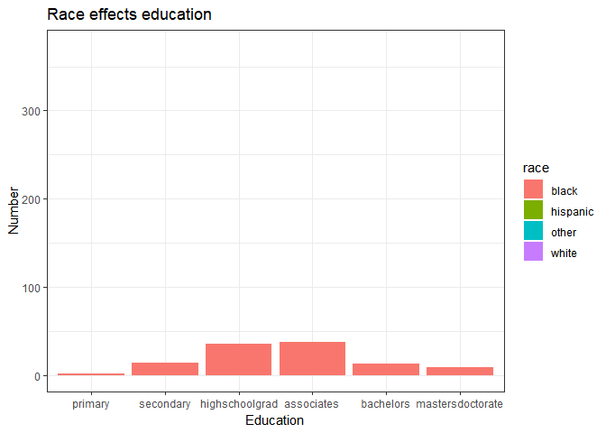

```r
library(tidyverse)
```

```
## Warning: package 'tidyverse' was built under R version 4.1.3
```

```
## -- Attaching packages --------------------------------------- tidyverse 1.3.2 --
## v ggplot2 3.3.5     v purrr   0.3.4
## v tibble  3.1.6     v dplyr   1.0.7
## v tidyr   1.1.4     v stringr 1.4.0
## v readr   2.1.1     v forcats 0.5.1
## -- Conflicts ------------------------------------------ tidyverse_conflicts() --
## x dplyr::filter() masks stats::filter()
## x dplyr::lag()    masks stats::lag()
```

```r
library(sf)
```

```
## Warning: package 'sf' was built under R version 4.1.3
```

```
## Linking to GEOS 3.10.2, GDAL 3.4.1, PROJ 7.2.1; sf_use_s2() is TRUE
```

```r
library(USAboundaries)
library(ggplot2)
library(readr)
library(knitr)
library(tidyverse)
library(dplyr)
library(forcats)
library(downloader)
```

```
## Warning: package 'downloader' was built under R version 4.1.3
```

```r
library(corrplot)
```

```
## Warning: package 'corrplot' was built under R version 4.1.3
```

```
## corrplot 0.92 loaded
```

```r
library(ggrepel)
```

```
## Warning: package 'ggrepel' was built under R version 4.1.3
```

```r
library(sf)
library(maps)
```

```
## Warning: package 'maps' was built under R version 4.1.3
```

```
## 
## Attaching package: 'maps'
## 
## The following object is masked from 'package:purrr':
## 
##     map
```

```r
library(readr)
library(remotes)
```

```
## Warning: package 'remotes' was built under R version 4.1.3
```

```r
library(dygraphs)
```

```
## Warning: package 'dygraphs' was built under R version 4.1.3
```

```r
library(ggsflabel)
```

```
## 
## Attaching package: 'ggsflabel'
## 
## The following objects are masked from 'package:ggplot2':
## 
##     geom_sf_label, geom_sf_text, StatSfCoordinates
```

```r
library(plotly)
```

```
## 
## Attaching package: 'plotly'
## 
## The following object is masked from 'package:ggplot2':
## 
##     last_plot
## 
## The following object is masked from 'package:stats':
## 
##     filter
## 
## The following object is masked from 'package:graphics':
## 
##     layout
```

```r
library(gridExtra)
```

```
## Warning: package 'gridExtra' was built under R version 4.1.3
```

```
## 
## Attaching package: 'gridExtra'
## 
## The following object is masked from 'package:dplyr':
## 
##     combine
```

```r
library(gganimate)
```

```
## Warning: package 'gganimate' was built under R version 4.1.3
```
#THis data came from task 7

```r
download.file("https://raw.githubusercontent.com/hadley/r4ds/master/data/heights.csv", "heights")

Height <- read_csv("heights")
```

```
## Rows: 1192 Columns: 6
## -- Column specification --------------------------------------------------------
## Delimiter: ","
## chr (2): sex, race
## dbl (4): earn, height, ed, age
## 
## i Use `spec()` to retrieve the full column specification for this data.
## i Specify the column types or set `show_col_types = FALSE` to quiet this message.
```

```r
Height
```

```
## # A tibble: 1,192 x 6
##     earn height sex       ed   age race    
##    <dbl>  <dbl> <chr>  <dbl> <dbl> <chr>   
##  1 50000   74.4 male      16    45 white   
##  2 60000   65.5 female    16    58 white   
##  3 30000   63.6 female    16    29 white   
##  4 50000   63.1 female    16    91 other   
##  5 51000   63.4 female    17    39 white   
##  6  9000   64.4 female    15    26 white   
##  7 29000   61.7 female    12    49 white   
##  8 32000   72.7 male      17    46 white   
##  9  2000   72.0 male      15    21 hispanic
## 10 27000   72.2 male      12    26 white   
## # ... with 1,182 more rows
```


```r
HeightEd <- Height %>%
  mutate(ed = as.factor(ed)) %>%
  mutate(ed = fct_recode(ed,
                         "primary" = "3",
                         "primary" = "4",
                         "primary" = "5",
                         "primary" = "6",
                         "secondary" = "7",
                         "secondary" = "8",
                         "secondary" = "9",
                         "secondary" = "10",
                         "secondary" = "11",
                         "highschoolgrad" = "12",
                         "associates" = "13",
                         "associates" = "14",
                         "associates" = "15",
                         "bachelors" =  "16",
                         "mastersdoctorate" = "17",
                         "mastersdoctorate" = "18"))
```


```r
HeightEd1 <- HeightEd %>%
  group_by(race) %>%
  count(ed)

HeightEd1
```

```
## # A tibble: 24 x 3
## # Groups:   race [4]
##    race     ed                   n
##    <chr>    <fct>            <int>
##  1 black    primary              2
##  2 black    secondary           14
##  3 black    highschoolgrad      36
##  4 black    associates          38
##  5 black    bachelors           13
##  6 black    mastersdoctorate     9
##  7 hispanic primary              3
##  8 hispanic secondary            6
##  9 hispanic highschoolgrad      19
## 10 hispanic associates          22
## # ... with 14 more rows
```


```r
ggplot(HeightEd1, mapping=aes(ed,n, fill=race ))+
  geom_bar(stat="identity", position = "dodge")+
  labs(title="Race effects education",x="Education",y="Number")+
    theme_bw()+
  transition_states(race, transition_length=2, state_length=1)+
  ease_aes('sine-in-out')
```

<!-- -->

```r
anim_save("animated-barplot-hieght.gif")
```


