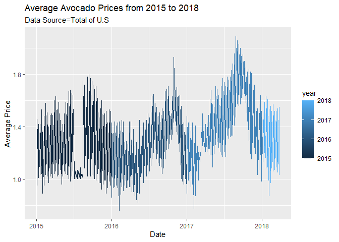
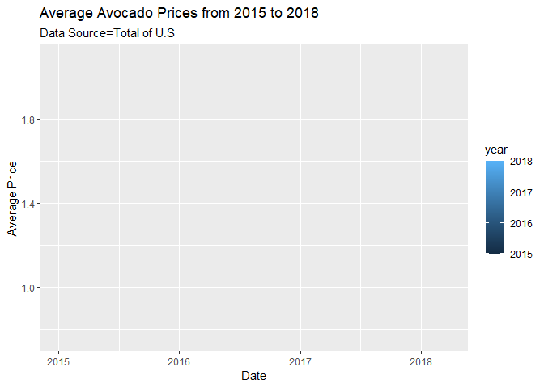
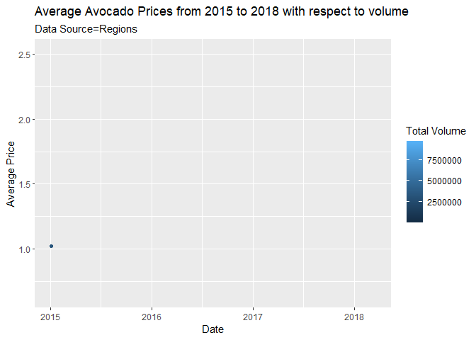
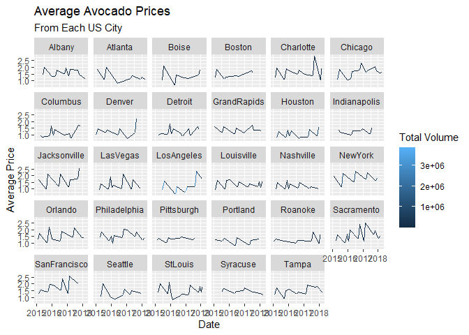

```r
library(tidyverse)
```

```
## Warning: package 'tidyverse' was built under R version 4.1.3
```

```
## -- Attaching packages --------------------------------------- tidyverse 1.3.2 --
## v ggplot2 3.3.5     v purrr   0.3.4
## v tibble  3.1.6     v dplyr   1.0.7
## v tidyr   1.1.4     v stringr 1.4.0
## v readr   2.1.1     v forcats 0.5.1
## -- Conflicts ------------------------------------------ tidyverse_conflicts() --
## x dplyr::filter() masks stats::filter()
## x dplyr::lag()    masks stats::lag()
```

```r
library(sf)
```

```
## Warning: package 'sf' was built under R version 4.1.3
```

```
## Linking to GEOS 3.10.2, GDAL 3.4.1, PROJ 7.2.1; sf_use_s2() is TRUE
```

```r
library(USAboundaries)
library(ggplot2)
library(readr)
library(knitr)
library(tidyquant)
```

```
## Warning: package 'tidyquant' was built under R version 4.1.3
```

```
## Loading required package: lubridate
## 
## Attaching package: 'lubridate'
## 
## The following objects are masked from 'package:base':
## 
##     date, intersect, setdiff, union
## 
## Loading required package: PerformanceAnalytics
```

```
## Warning: package 'PerformanceAnalytics' was built under R version 4.1.3
```

```
## Loading required package: xts
```

```
## Warning: package 'xts' was built under R version 4.1.3
```

```
## Loading required package: zoo
```

```
## Warning: package 'zoo' was built under R version 4.1.3
```

```
## 
## Attaching package: 'zoo'
## 
## The following objects are masked from 'package:base':
## 
##     as.Date, as.Date.numeric
## 
## 
## Attaching package: 'xts'
## 
## The following objects are masked from 'package:dplyr':
## 
##     first, last
## 
## 
## Attaching package: 'PerformanceAnalytics'
## 
## The following object is masked from 'package:graphics':
## 
##     legend
## 
## Loading required package: quantmod
```

```
## Warning: package 'quantmod' was built under R version 4.1.3
```

```
## Loading required package: TTR
```

```
## Warning: package 'TTR' was built under R version 4.1.3
```

```
## Registered S3 method overwritten by 'quantmod':
##   method            from
##   as.zoo.data.frame zoo
```

```r
library(dplyr)
library(forcats)
library(downloader)
```

```
## Warning: package 'downloader' was built under R version 4.1.3
```

```r
library(corrplot)
```

```
## Warning: package 'corrplot' was built under R version 4.1.3
```

```
## corrplot 0.92 loaded
```

```r
library(ggrepel)
```

```
## Warning: package 'ggrepel' was built under R version 4.1.3
```

```r
library(sf)
library(maps)
```

```
## Warning: package 'maps' was built under R version 4.1.3
```

```
## 
## Attaching package: 'maps'
## 
## The following object is masked from 'package:purrr':
## 
##     map
```

```r
library(readr)
library(remotes)
```

```
## Warning: package 'remotes' was built under R version 4.1.3
```

```r
library(dygraphs)
```

```
## Warning: package 'dygraphs' was built under R version 4.1.3
```

```r
library(ggsflabel)
```

```
## 
## Attaching package: 'ggsflabel'
## 
## The following objects are masked from 'package:ggplot2':
## 
##     geom_sf_label, geom_sf_text, StatSfCoordinates
```

```r
library(plotly)
```

```
## 
## Attaching package: 'plotly'
## 
## The following object is masked from 'package:ggplot2':
## 
##     last_plot
## 
## The following object is masked from 'package:stats':
## 
##     filter
## 
## The following object is masked from 'package:graphics':
## 
##     layout
```

```r
library(gridExtra)
```

```
## Warning: package 'gridExtra' was built under R version 4.1.3
```

```
## 
## Attaching package: 'gridExtra'
## 
## The following object is masked from 'package:dplyr':
## 
##     combine
```

```r
library(gganimate)
```

```
## Warning: package 'gganimate' was built under R version 4.1.3
```

```r
library(leaflet)
```

```
## Warning: package 'leaflet' was built under R version 4.1.3
```

```
## 
## Attaching package: 'leaflet'
## 
## The following object is masked from 'package:xts':
## 
##     addLegend
```

```r
library(maps)
library(grid)
```


```r
avocado <- read_csv("avocado.csv")
```

```
## New names:
## * `` -> ...1
```

```
## Rows: 18249 Columns: 14
## -- Column specification --------------------------------------------------------
## Delimiter: ","
## chr   (2): type, region
## dbl  (11): ...1, AveragePrice, Total Volume, 4046, 4225, 4770, Total Bags, S...
## date  (1): Date
## 
## i Use `spec()` to retrieve the full column specification for this data.
## i Specify the column types or set `show_col_types = FALSE` to quiet this message.
```

```r
head(avocado)
```

```
## # A tibble: 6 x 14
##    ...1 Date       Averag~1 Total~2 `4046` `4225` `4770` Total~3 Small~4 Large~5
##   <dbl> <date>        <dbl>   <dbl>  <dbl>  <dbl>  <dbl>   <dbl>   <dbl>   <dbl>
## 1     0 2015-12-27     1.33  64237.  1037. 5.45e4   48.2   8697.   8604.    93.2
## 2     1 2015-12-20     1.35  54877.   674. 4.46e4   58.3   9506.   9408.    97.5
## 3     2 2015-12-13     0.93 118220.   795. 1.09e5  130.    8145.   8042.   103. 
## 4     3 2015-12-06     1.08  78992.  1132  7.20e4   72.6   5811.   5677.   134. 
## 5     4 2015-11-29     1.28  51040.   941. 4.38e4   75.8   6184.   5986.   198. 
## 6     5 2015-11-22     1.26  55980.  1184. 4.81e4   43.6   6684.   6556.   127. 
## # ... with 4 more variables: `XLarge Bags` <dbl>, type <chr>, year <dbl>,
## #   region <chr>, and abbreviated variable names 1: AveragePrice,
## #   2: `Total Volume`, 3: `Total Bags`, 4: `Small Bags`, 5: `Large Bags`
```

```r
tail(avocado)
```

```
## # A tibble: 6 x 14
##    ...1 Date       Averag~1 Total~2 `4046` `4225` `4770` Total~3 Small~4 Large~5
##   <dbl> <date>        <dbl>   <dbl>  <dbl>  <dbl>  <dbl>   <dbl>   <dbl>   <dbl>
## 1     6 2018-02-11     1.57  15986.  1924.  1368.     0   12694.  12437.   256. 
## 2     7 2018-02-04     1.63  17075.  2047.  1529.     0   13499.  13067.   432. 
## 3     8 2018-01-28     1.71  13888.  1192.  3432.     0    9265.   8940.   325. 
## 4     9 2018-01-21     1.87  13767.  1192.  2453.   728.   9394.   9352.    42.3
## 5    10 2018-01-14     1.93  16205.  1528.  2981.   727.  10970.  10920.    50  
## 6    11 2018-01-07     1.62  17490.  2895.  2356.   225.  12014.  11988.    26.0
## # ... with 4 more variables: `XLarge Bags` <dbl>, type <chr>, year <dbl>,
## #   region <chr>, and abbreviated variable names 1: AveragePrice,
## #   2: `Total Volume`, 3: `Total Bags`, 4: `Small Bags`, 5: `Large Bags`
```


```r
region <- avocado %>% distinct(region)
```

#Region 

```r
regions <- c("West", "Midsouth", "Northeast", "SouthCentral", "Southeast", "GreatLakes", "Plains")
avocado_regions <- avocado %>%
  filter(region == regions)
head(avocado_regions)
```

```
## # A tibble: 6 x 14
##    ...1 Date       Averag~1 Total~2 `4046` `4225` `4770` Total~3 Small~4 Large~5
##   <dbl> <date>        <dbl>   <dbl>  <dbl>  <dbl>  <dbl>   <dbl>   <dbl>   <dbl>
## 1     2 2015-12-13     1.03  2.61e6 4.63e5 1.34e6 2.29e5 574072. 409910. 148005.
## 2     9 2015-10-25     1.1   2.67e6 3.84e5 1.46e6 3.31e5 496813. 335249. 130934.
## 3    16 2015-09-06     1.07  3.27e6 4.33e5 1.88e6 3.48e5 614943. 468148. 121209.
## 4    23 2015-07-19     1.12  3.44e6 4.49e5 1.84e6 4.55e5 690083. 535843. 110898.
## 5    30 2015-05-31     1.2   3.15e6 6.67e5 1.48e6 2.80e5 725079. 593193. 119920.
## 6    37 2015-04-12     1.11  2.90e6 5.49e5 1.40e6 1.90e5 754074. 688966.  60642.
## # ... with 4 more variables: `XLarge Bags` <dbl>, type <chr>, year <dbl>,
## #   region <chr>, and abbreviated variable names 1: AveragePrice,
## #   2: `Total Volume`, 3: `Total Bags`, 4: `Small Bags`, 5: `Large Bags`
```
unique(avocado$region)

#City

```r
cities = c("Albany", "Boston", "Chicago", "Denver", "Jacksonville", "NewYork", "Philadelphia", "Portland", "Sacramento", "StLouis", "Atlanta", "Detroit", "LasVegas", "SanDeigo", "Syracuse", "Columbus", "Houston", "GrandRapids", "LosAngeles", "Nashville", "Pittsburgh", "SanFrancisco", "Tampa", "SanDi", "Boise", "Charlotte", "Indianapolis", "Louisville", "Orlando", "Roanoke", "Seattle", "Spokan")
avocado_cities <- avocado %>%
  filter(region == cities)
```

```
## Warning in region == cities: longer object length is not a multiple of shorter
## object length
```


#Total 

```r
unique(avocado$region)
```

```
##  [1] "Albany"              "Atlanta"             "BaltimoreWashington"
##  [4] "Boise"               "Boston"              "BuffaloRochester"   
##  [7] "California"          "Charlotte"           "Chicago"            
## [10] "CincinnatiDayton"    "Columbus"            "DallasFtWorth"      
## [13] "Denver"              "Detroit"             "GrandRapids"        
## [16] "GreatLakes"          "HarrisburgScranton"  "HartfordSpringfield"
## [19] "Houston"             "Indianapolis"        "Jacksonville"       
## [22] "LasVegas"            "LosAngeles"          "Louisville"         
## [25] "MiamiFtLauderdale"   "Midsouth"            "Nashville"          
## [28] "NewOrleansMobile"    "NewYork"             "Northeast"          
## [31] "NorthernNewEngland"  "Orlando"             "Philadelphia"       
## [34] "PhoenixTucson"       "Pittsburgh"          "Plains"             
## [37] "Portland"            "RaleighGreensboro"   "RichmondNorfolk"    
## [40] "Roanoke"             "Sacramento"          "SanDiego"           
## [43] "SanFrancisco"        "Seattle"             "SouthCarolina"      
## [46] "SouthCentral"        "Southeast"           "Spokane"            
## [49] "StLouis"             "Syracuse"            "Tampa"              
## [52] "TotalUS"             "West"                "WestTexNewMexico"
```

```r
avocado_us <- avocado %>%
  filter(region == "TotalUS")
head(avocado_us)
```

```
## # A tibble: 6 x 14
##    ...1 Date       Averag~1 Total~2 `4046` `4225` `4770` Total~3 Small~4 Large~5
##   <dbl> <date>        <dbl>   <dbl>  <dbl>  <dbl>  <dbl>   <dbl>   <dbl>   <dbl>
## 1     0 2015-12-27     0.95  2.73e7 9.63e6 1.02e7 1.18e6  6.29e6  4.85e6  1.25e6
## 2     1 2015-12-20     0.98  2.51e7 8.71e6 9.33e6 1.20e6  5.84e6  4.62e6  1.03e6
## 3     2 2015-12-13     0.93  2.80e7 9.86e6 1.08e7 1.02e6  6.36e6  4.96e6  1.37e6
## 4     3 2015-12-06     0.89  2.88e7 9.41e6 1.22e7 9.32e5  6.30e6  5.01e6  1.23e6
## 5     4 2015-11-29     0.99  2.26e7 8.09e6 9.00e6 7.31e5  4.79e6  3.90e6  8.57e5
## 6     5 2015-11-22     0.96  2.51e7 8.57e6 1.04e7 8.05e5  5.35e6  4.18e6  1.14e6
## # ... with 4 more variables: `XLarge Bags` <dbl>, type <chr>, year <dbl>,
## #   region <chr>, and abbreviated variable names 1: AveragePrice,
## #   2: `Total Volume`, 3: `Total Bags`, 4: `Small Bags`, 5: `Large Bags`
```
#Avocado Prices over Time 

```r
total_us_plot <- ggplot(data = avocado_us, mapping = aes(x =Date, y =AveragePrice, color =year)) +
  geom_line() + 
  labs(title = "Average Avocado Prices from 2015 to 2018", subtitle = "Data Source=Total of U.S", x = "Date", y = "Average Price") 
total_us_plot
```

<!-- -->

```r
total_us_plot + transition_reveal(Date)
```

```
## geom_path: Each group consists of only one observation. Do you need to adjust
## the group aesthetic?
## geom_path: Each group consists of only one observation. Do you need to adjust
## the group aesthetic?
```

<!-- -->
#It is worth noting that the price of the avacado is not static, and seems to constantly be changing over time

#Avocado Prices for US Regions Plot

```r
price_region_plot <- ggplot(data = avocado_regions, mapping = aes(x = Date, y = AveragePrice, color = `Total Volume`)) +
  geom_point() + 
  labs(title = "Average Avocado Prices from 2015 to 2018 with respect to volume", subtitle = "Data Source=Regions", x = "Date", y = "Average Price") + transition_time(Date)
price_region_plot
```

<!-- -->
#It seems that there is a lot more volume when the price is lower. This makes sense as more people buy avocados when they are cheap 

#Avocado Prices for Each US City 

```r
price_city_plot <- ggplot(data = avocado_cities, mapping = aes(x = Date, y = AveragePrice, color = `Total Volume`)) +
  geom_line() +
  facet_wrap(~region) +
  labs(title = "Average Avocado Prices", subtitle = "From Each US City", x = "Date", y = "Average Price")
price_city_plot 
```

<!-- -->
#Iw would tell the friend to not live in San Francisco, New York, Chicago, and Jacksonville. The best spot would be columbus, Atlanta, Pittburg, and Nashville. 


#I did the rest of this case on a seprate document beacuse it will not run. 

