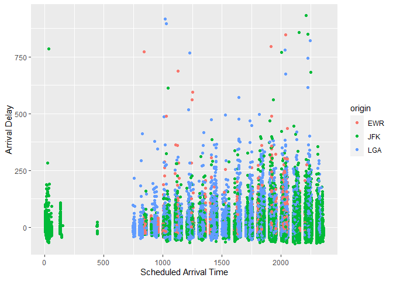
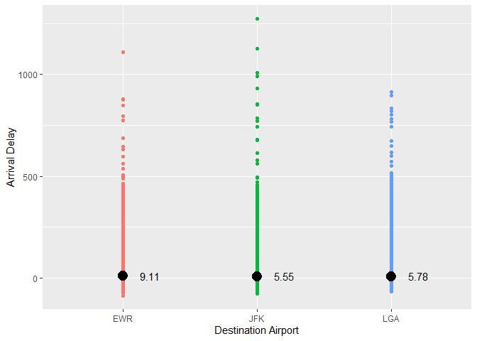

Load Data 

```r
library(nycflights13)
```

```
## Warning: package 'nycflights13' was built under R version 4.1.3
```

```r
library(tidyverse)
```

```
## Warning: package 'tidyverse' was built under R version 4.1.3
```

```
## -- Attaching packages --------------------------------------- tidyverse 1.3.2 --
## v ggplot2 3.3.5     v purrr   0.3.4
## v tibble  3.1.6     v dplyr   1.0.7
## v tidyr   1.1.4     v stringr 1.4.0
## v readr   2.1.1     v forcats 0.5.1
## -- Conflicts ------------------------------------------ tidyverse_conflicts() --
## x dplyr::filter() masks stats::filter()
## x dplyr::lag()    masks stats::lag()
```

```r
library(ggrepel)
```

```
## Warning: package 'ggrepel' was built under R version 4.1.3
```

```r
?flights
```

```
## starting httpd help server ... done
```

```r
str(flights)
```

```
## tibble [336,776 x 19] (S3: tbl_df/tbl/data.frame)
##  $ year          : int [1:336776] 2013 2013 2013 2013 2013 2013 2013 2013 2013 2013 ...
##  $ month         : int [1:336776] 1 1 1 1 1 1 1 1 1 1 ...
##  $ day           : int [1:336776] 1 1 1 1 1 1 1 1 1 1 ...
##  $ dep_time      : int [1:336776] 517 533 542 544 554 554 555 557 557 558 ...
##  $ sched_dep_time: int [1:336776] 515 529 540 545 600 558 600 600 600 600 ...
##  $ dep_delay     : num [1:336776] 2 4 2 -1 -6 -4 -5 -3 -3 -2 ...
##  $ arr_time      : int [1:336776] 830 850 923 1004 812 740 913 709 838 753 ...
##  $ sched_arr_time: int [1:336776] 819 830 850 1022 837 728 854 723 846 745 ...
##  $ arr_delay     : num [1:336776] 11 20 33 -18 -25 12 19 -14 -8 8 ...
##  $ carrier       : chr [1:336776] "UA" "UA" "AA" "B6" ...
##  $ flight        : int [1:336776] 1545 1714 1141 725 461 1696 507 5708 79 301 ...
##  $ tailnum       : chr [1:336776] "N14228" "N24211" "N619AA" "N804JB" ...
##  $ origin        : chr [1:336776] "EWR" "LGA" "JFK" "JFK" ...
##  $ dest          : chr [1:336776] "IAH" "IAH" "MIA" "BQN" ...
##  $ air_time      : num [1:336776] 227 227 160 183 116 150 158 53 140 138 ...
##  $ distance      : num [1:336776] 1400 1416 1089 1576 762 ...
##  $ hour          : num [1:336776] 5 5 5 5 6 5 6 6 6 6 ...
##  $ minute        : num [1:336776] 15 29 40 45 0 58 0 0 0 0 ...
##  $ time_hour     : POSIXct[1:336776], format: "2013-01-01 05:00:00" "2013-01-01 05:00:00" ...
```

```r
head(flights)
```

```
## # A tibble: 6 x 19
##    year month   day dep_time sched_dep_time dep_delay arr_time sched_arr_time
##   <int> <int> <int>    <int>          <int>     <dbl>    <int>          <int>
## 1  2013     1     1      517            515         2      830            819
## 2  2013     1     1      533            529         4      850            830
## 3  2013     1     1      542            540         2      923            850
## 4  2013     1     1      544            545        -1     1004           1022
## 5  2013     1     1      554            600        -6      812            837
## 6  2013     1     1      554            558        -4      740            728
## # ... with 11 more variables: arr_delay <dbl>, carrier <chr>, flight <int>,
## #   tailnum <chr>, origin <chr>, dest <chr>, air_time <dbl>, distance <dbl>,
## #   hour <dbl>, minute <dbl>, time_hour <dttm>
```


2. Which origin airport is best to minimize my chances of a late arrival when I am using Delta Airline?

```r
lowest_late_arrival <- flights %>%
  filter(carrier == "DL")
lowest_late_arrival
```

```
## # A tibble: 48,110 x 19
##     year month   day dep_time sched_dep_time dep_delay arr_time sched_arr_time
##    <int> <int> <int>    <int>          <int>     <dbl>    <int>          <int>
##  1  2013     1     1      554            600        -6      812            837
##  2  2013     1     1      602            610        -8      812            820
##  3  2013     1     1      606            610        -4      837            845
##  4  2013     1     1      615            615         0      833            842
##  5  2013     1     1      653            700        -7      936           1009
##  6  2013     1     1      655            655         0     1021           1030
##  7  2013     1     1      655            700        -5     1037           1045
##  8  2013     1     1      655            700        -5     1002           1020
##  9  2013     1     1      657            700        -3      959           1013
## 10  2013     1     1      658            700        -2      944            939
## # ... with 48,100 more rows, and 11 more variables: arr_delay <dbl>,
## #   carrier <chr>, flight <int>, tailnum <chr>, origin <chr>, dest <chr>,
## #   air_time <dbl>, distance <dbl>, hour <dbl>, minute <dbl>, time_hour <dttm>
```


```r
ggplot(data = lowest_late_arrival, mapping = aes(x = sched_arr_time, y = arr_delay, color = origin)) + 
  geom_point() +
  labs(x = "Scheduled Arrival Time",
       y = "Arrival Delay")
```

```
## Warning: Removed 452 rows containing missing values (geom_point).
```

<!-- -->
The above plot shows that JFK seems to be the best to arrive on time with delta. While JFK has lots of late times they still are the only ones close to on time arrival. 
3. Which destination airport is the worst airport for arrival time?

```r
delay <- flights %>%
  group_by(origin) %>%
  summarise(
    avg_delay = mean(arr_delay, na.rm = TRUE))
delay
```

```
## # A tibble: 3 x 2
##   origin avg_delay
##   <chr>      <dbl>
## 1 EWR         9.11
## 2 JFK         5.55
## 3 LGA         5.78
```


```r
ggplot(data = flights, aes(x = origin, y = arr_delay)) +
  geom_point(aes(color = origin)) +
  geom_point(data = delay, aes(y = avg_delay, size = 1)) +
  annotate("text", x = c(1.2,2.2,3.2), y = 10, label = c("9.11", "5.55", "5.78")) +
  labs(x = "Destination Airport", 
       y = "Arrival Delay") +
  theme(legend.position = "none")
```

```
## Warning: Removed 9430 rows containing missing values (geom_point).
```

<!-- -->
This shows that EWR has the worst arrival delays. The dots show the average delay time for each airport. 
