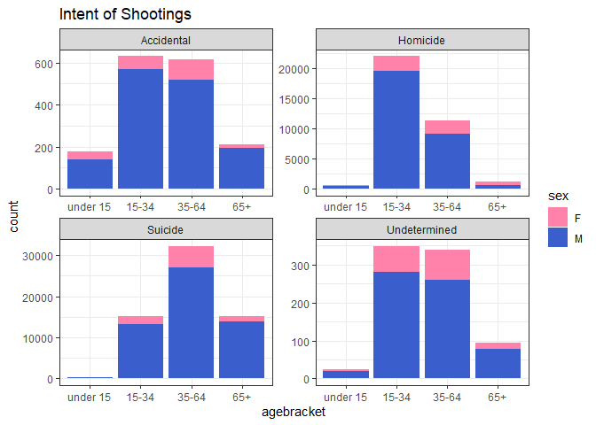
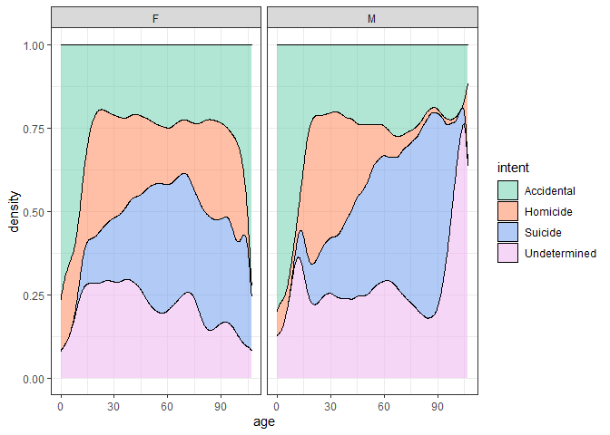
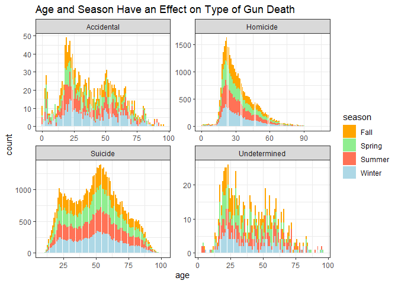
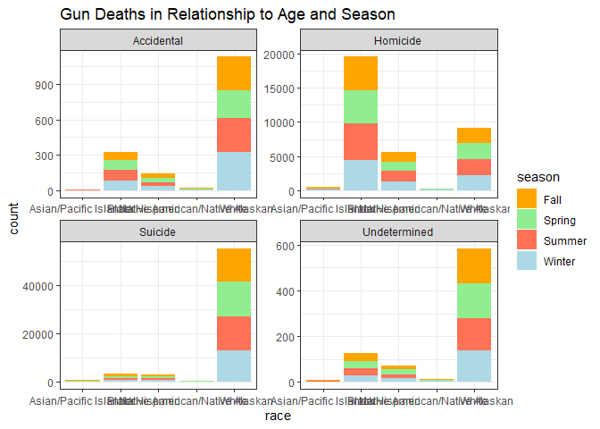

Brief Explanation:


```r
library(ggplot2)
```

```
## Warning in register(): Can't find generic `scale_type` in package ggplot2 to
## register S3 method.
```

```r
library(readr)
library(knitr)
library(tidyverse)
```

```
## Warning: package 'tidyverse' was built under R version 4.1.3
```

```
## -- Attaching packages --------------------------------------- tidyverse 1.3.2 --
## v tibble  3.1.6     v dplyr   1.0.7
## v tidyr   1.1.4     v stringr 1.4.0
## v purrr   0.3.4     v forcats 0.5.1
## -- Conflicts ------------------------------------------ tidyverse_conflicts() --
## x dplyr::filter() masks stats::filter()
## x dplyr::lag()    masks stats::lag()
```

```r
library(dplyr)
```
FIVETHIRTYEIGHT 
The graphic that I saw on FiveThirtyEight was very eye opening. Typically when you think of gun violance, the first thing that comes to mund is police shootings, mass shootings, and terriorisum. But as the graphic showed me, the data is completely different. Almost two-thrids of all gun dealths are from suicide, and 85% of that is male. Also other than mass shootings terriosum and police shootings, the rest are mostly young african american men. It seems that gun death is a male issue, with most of it coming from suicide. 


```r
#download data as tempfile
gundata <- tempfile()
download.file("https://raw.githubusercontent.com/fivethirtyeight/guns-data/master/full_data.csv", gundata, mode = "wb")
mygundata <- read_csv(gundata)
```

```
## New names:
## * `` -> ...1
```

```
## Rows: 100798 Columns: 11
## -- Column specification --------------------------------------------------------
## Delimiter: ","
## chr (6): month, intent, sex, race, place, education
## dbl (5): ...1, year, police, age, hispanic
## 
## i Use `spec()` to retrieve the full column specification for this data.
## i Specify the column types or set `show_col_types = FALSE` to quiet this message.
```

```r
head(mygundata)
```

```
## # A tibble: 6 x 11
##    ...1  year month intent  police sex     age race     hispanic place education
##   <dbl> <dbl> <chr> <chr>    <dbl> <chr> <dbl> <chr>       <dbl> <chr> <chr>    
## 1     1  2012 01    Suicide      0 M        34 Asian/P~      100 Home  BA+      
## 2     2  2012 01    Suicide      0 F        21 White         100 Stre~ Some col~
## 3     3  2012 01    Suicide      0 M        60 White         100 Othe~ BA+      
## 4     4  2012 02    Suicide      0 M        64 White         100 Home  BA+      
## 5     5  2012 02    Suicide      0 M        31 White         100 Othe~ HS/GED   
## 6     6  2012 02    Suicide      0 M        17 Native ~      100 Home  Less tha~
```

```r
str(mygundata)
```

```
## spec_tbl_df [100,798 x 11] (S3: spec_tbl_df/tbl_df/tbl/data.frame)
##  $ ...1     : num [1:100798] 1 2 3 4 5 6 7 8 9 10 ...
##  $ year     : num [1:100798] 2012 2012 2012 2012 2012 ...
##  $ month    : chr [1:100798] "01" "01" "01" "02" ...
##  $ intent   : chr [1:100798] "Suicide" "Suicide" "Suicide" "Suicide" ...
##  $ police   : num [1:100798] 0 0 0 0 0 0 0 0 0 0 ...
##  $ sex      : chr [1:100798] "M" "F" "M" "M" ...
##  $ age      : num [1:100798] 34 21 60 64 31 17 48 41 50 NA ...
##  $ race     : chr [1:100798] "Asian/Pacific Islander" "White" "White" "White" ...
##  $ hispanic : num [1:100798] 100 100 100 100 100 100 100 100 100 998 ...
##  $ place    : chr [1:100798] "Home" "Street" "Other specified" "Home" ...
##  $ education: chr [1:100798] "BA+" "Some college" "BA+" "BA+" ...
##  - attr(*, "spec")=
##   .. cols(
##   ..   ...1 = col_double(),
##   ..   year = col_double(),
##   ..   month = col_character(),
##   ..   intent = col_character(),
##   ..   police = col_double(),
##   ..   sex = col_character(),
##   ..   age = col_double(),
##   ..   race = col_character(),
##   ..   hispanic = col_double(),
##   ..   place = col_character(),
##   ..   education = col_character()
##   .. )
##  - attr(*, "problems")=<externalptr>
```

```r
mygundatanew <- mygundata %>%
  filter(age != "", intent != "")
str(mygundatanew)
```

```
## spec_tbl_df [100,779 x 11] (S3: spec_tbl_df/tbl_df/tbl/data.frame)
##  $ ...1     : num [1:100779] 1 2 3 4 5 6 7 8 9 11 ...
##  $ year     : num [1:100779] 2012 2012 2012 2012 2012 ...
##  $ month    : chr [1:100779] "01" "01" "01" "02" ...
##  $ intent   : chr [1:100779] "Suicide" "Suicide" "Suicide" "Suicide" ...
##  $ police   : num [1:100779] 0 0 0 0 0 0 0 0 0 0 ...
##  $ sex      : chr [1:100779] "M" "F" "M" "M" ...
##  $ age      : num [1:100779] 34 21 60 64 31 17 48 41 50 30 ...
##  $ race     : chr [1:100779] "Asian/Pacific Islander" "White" "White" "White" ...
##  $ hispanic : num [1:100779] 100 100 100 100 100 100 100 100 100 100 ...
##  $ place    : chr [1:100779] "Home" "Street" "Other specified" "Home" ...
##  $ education: chr [1:100779] "BA+" "Some college" "BA+" "BA+" ...
##  - attr(*, "spec")=
##   .. cols(
##   ..   ...1 = col_double(),
##   ..   year = col_double(),
##   ..   month = col_character(),
##   ..   intent = col_character(),
##   ..   police = col_double(),
##   ..   sex = col_character(),
##   ..   age = col_double(),
##   ..   race = col_character(),
##   ..   hispanic = col_double(),
##   ..   place = col_character(),
##   ..   education = col_character()
##   .. )
##  - attr(*, "problems")=<externalptr>
```


```r
age <- mygundatanew %>%
  mutate(agebracket = 
           case_when(
             age < 15 ~ "under 15",
             age >= 15 & age <= 34 ~ "15-34",
             age >=35 & age <= 64 ~ "35-64",
             age >= 65 ~ "65+"),
         agebracket = fct_relevel(agebracket, "under 15", "15-34", "35-64",
                                "65+"))
head(age)
```

```
## # A tibble: 6 x 12
##    ...1  year month intent  police sex     age race     hispanic place education
##   <dbl> <dbl> <chr> <chr>    <dbl> <chr> <dbl> <chr>       <dbl> <chr> <chr>    
## 1     1  2012 01    Suicide      0 M        34 Asian/P~      100 Home  BA+      
## 2     2  2012 01    Suicide      0 F        21 White         100 Stre~ Some col~
## 3     3  2012 01    Suicide      0 M        60 White         100 Othe~ BA+      
## 4     4  2012 02    Suicide      0 M        64 White         100 Home  BA+      
## 5     5  2012 02    Suicide      0 M        31 White         100 Othe~ HS/GED   
## 6     6  2012 02    Suicide      0 M        17 Native ~      100 Home  Less tha~
## # ... with 1 more variable: agebracket <fct>
```

```r
plot1 <- ggplot(data = age, aes(x = agebracket, fill = sex)) +
  geom_bar() +
  facet_wrap(~ intent, scales = "free") +
  theme_bw() +
  scale_fill_manual(values = c("palevioletred1", "royalblue3")) +
  ggtitle("Intent of Shootings")
plot1
```

<!-- -->


```r
age2 <- ggplot(data = age, aes(x = age, fill = intent)) +
  geom_density(position = "fill", alpha = 0.5) +
  facet_wrap(~ sex) +
  theme_bw() +
scale_fill_manual(values = c("aquamarine3", "coral", "cornflowerblue", "plum2"))
age2
```

<!-- -->

```r
age$month <- as.integer(age$month)
```


```r
age1 <- age %>%
  mutate(season =
           case_when(
             month >= 3 & month <= 5 ~ "Spring",
             month >= 6 & month <= 8 ~ "Summer",
             month >= 9 & month <= 11 ~ "Fall",
             month <= 2 | month == 12 ~ "Winter"))
head(age1)
```

```
## # A tibble: 6 x 13
##    ...1  year month intent  police sex     age race     hispanic place education
##   <dbl> <dbl> <int> <chr>    <dbl> <chr> <dbl> <chr>       <dbl> <chr> <chr>    
## 1     1  2012     1 Suicide      0 M        34 Asian/P~      100 Home  BA+      
## 2     2  2012     1 Suicide      0 F        21 White         100 Stre~ Some col~
## 3     3  2012     1 Suicide      0 M        60 White         100 Othe~ BA+      
## 4     4  2012     2 Suicide      0 M        64 White         100 Home  BA+      
## 5     5  2012     2 Suicide      0 M        31 White         100 Othe~ HS/GED   
## 6     6  2012     2 Suicide      0 M        17 Native ~      100 Home  Less tha~
## # ... with 2 more variables: agebracket <fct>, season <chr>
```

```r
age1
```

```
## # A tibble: 100,779 x 13
##     ...1  year month intent    police sex     age race  hispanic place education
##    <dbl> <dbl> <int> <chr>      <dbl> <chr> <dbl> <chr>    <dbl> <chr> <chr>    
##  1     1  2012     1 Suicide        0 M        34 Asia~      100 Home  BA+      
##  2     2  2012     1 Suicide        0 F        21 White      100 Stre~ Some col~
##  3     3  2012     1 Suicide        0 M        60 White      100 Othe~ BA+      
##  4     4  2012     2 Suicide        0 M        64 White      100 Home  BA+      
##  5     5  2012     2 Suicide        0 M        31 White      100 Othe~ HS/GED   
##  6     6  2012     2 Suicide        0 M        17 Nati~      100 Home  Less tha~
##  7     7  2012     2 Undeterm~      0 M        48 White      100 Home  HS/GED   
##  8     8  2012     3 Suicide        0 M        41 Nati~      100 Home  HS/GED   
##  9     9  2012     2 Accident~      0 M        50 White      100 Othe~ Some col~
## 10    11  2012     2 Suicide        0 M        30 White      100 Home  Some col~
## # ... with 100,769 more rows, and 2 more variables: agebracket <fct>,
## #   season <chr>
```


```r
ggplot(data = age1, aes(x = age, fill =season)) +
  geom_bar() +
  facet_wrap(~intent, nrow = 2, scales="free") +
  scale_fill_manual(values = c("orange", "lightgreen", "coral1", "lightblue", "grey")) +
  labs(x = "age",
       title = "Age and Season Have an Effect on Type of Gun Death") +
  theme_bw()
```

<!-- -->

The plot above shows the gun deaths catagorized by the incident. Inside each graph it is colorcoded by the season in which the death happned. On the x axis it shows the age of person and on the y is the amount of deaths. This can give anyone a lot of information on how the seasons effect each age and cause. The scales had to be free because you could not tell for some of them. 

```r
ggplot(data = age1, aes(x = race, fill =season)) +
  geom_bar() +
  facet_wrap(~intent, nrow = 2, scales = 'free') +
  scale_fill_manual(values = c("orange", "lightgreen", "coral1", "lightblue", "grey")) +
  labs(x = "race",
       title = "Gun Deaths in Relationship to Age and Season") +
  theme_bw()
```

<!-- -->
The above graph is very similar to the one before except I switched age with race. Now this graph can tell us how age plays a role in the seasons and by the type of gun death. Once again the scales had to be free because you could not tell on two of the grpahs what the numbers were indicating. Whites dominate the sucicide catagory while blacks seem to dominate homicide. 
