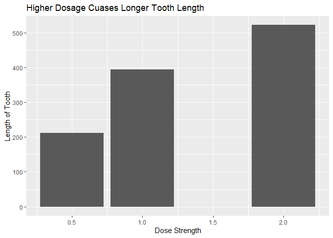
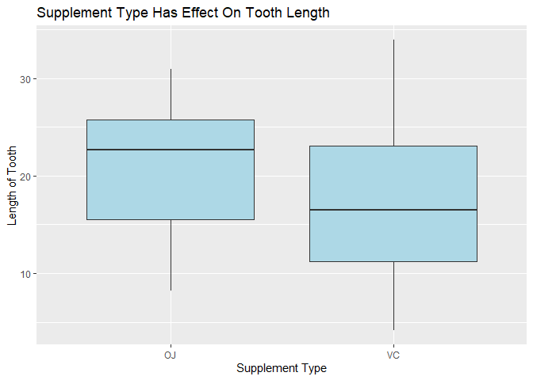
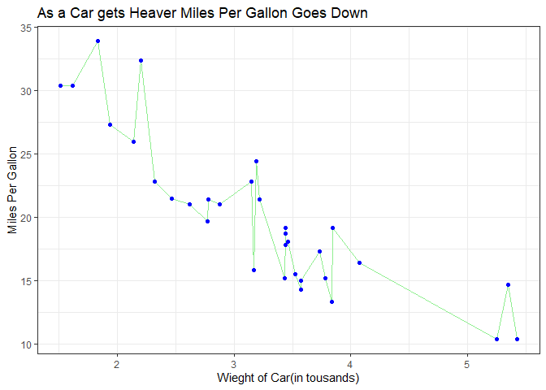
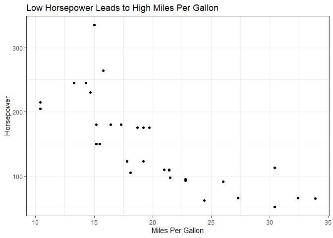

```r
library(ggplot2)
```

```
## Warning in register(): Can't find generic `scale_type` in package ggplot2 to
## register S3 method.
```

```r
library(readr)
library(knitr)
library(tidyverse)
```

```
## Warning: package 'tidyverse' was built under R version 4.1.3
```

```
## -- Attaching packages --------------------------------------- tidyverse 1.3.2 --
## v tibble  3.1.6     v dplyr   1.0.7
## v tidyr   1.1.4     v stringr 1.4.0
## v purrr   0.3.4     v forcats 0.5.1
## -- Conflicts ------------------------------------------ tidyverse_conflicts() --
## x dplyr::filter() masks stats::filter()
## x dplyr::lag()    masks stats::lag()
```

```r
library(dplyr)
```


```r
?ToothGrowth
```

```
## starting httpd help server ... done
```

```r
head(ToothGrowth)
```

```
##    len supp dose
## 1  4.2   VC  0.5
## 2 11.5   VC  0.5
## 3  7.3   VC  0.5
## 4  5.8   VC  0.5
## 5  6.4   VC  0.5
## 6 10.0   VC  0.5
```

```r
ToothGrowth
```

```
##     len supp dose
## 1   4.2   VC  0.5
## 2  11.5   VC  0.5
## 3   7.3   VC  0.5
## 4   5.8   VC  0.5
## 5   6.4   VC  0.5
## 6  10.0   VC  0.5
## 7  11.2   VC  0.5
## 8  11.2   VC  0.5
## 9   5.2   VC  0.5
## 10  7.0   VC  0.5
## 11 16.5   VC  1.0
## 12 16.5   VC  1.0
## 13 15.2   VC  1.0
## 14 17.3   VC  1.0
## 15 22.5   VC  1.0
## 16 17.3   VC  1.0
## 17 13.6   VC  1.0
## 18 14.5   VC  1.0
## 19 18.8   VC  1.0
## 20 15.5   VC  1.0
## 21 23.6   VC  2.0
## 22 18.5   VC  2.0
## 23 33.9   VC  2.0
## 24 25.5   VC  2.0
## 25 26.4   VC  2.0
## 26 32.5   VC  2.0
## 27 26.7   VC  2.0
## 28 21.5   VC  2.0
## 29 23.3   VC  2.0
## 30 29.5   VC  2.0
## 31 15.2   OJ  0.5
## 32 21.5   OJ  0.5
## 33 17.6   OJ  0.5
## 34  9.7   OJ  0.5
## 35 14.5   OJ  0.5
## 36 10.0   OJ  0.5
## 37  8.2   OJ  0.5
## 38  9.4   OJ  0.5
## 39 16.5   OJ  0.5
## 40  9.7   OJ  0.5
## 41 19.7   OJ  1.0
## 42 23.3   OJ  1.0
## 43 23.6   OJ  1.0
## 44 26.4   OJ  1.0
## 45 20.0   OJ  1.0
## 46 25.2   OJ  1.0
## 47 25.8   OJ  1.0
## 48 21.2   OJ  1.0
## 49 14.5   OJ  1.0
## 50 27.3   OJ  1.0
## 51 25.5   OJ  2.0
## 52 26.4   OJ  2.0
## 53 22.4   OJ  2.0
## 54 24.5   OJ  2.0
## 55 24.8   OJ  2.0
## 56 30.9   OJ  2.0
## 57 26.4   OJ  2.0
## 58 27.3   OJ  2.0
## 59 29.4   OJ  2.0
## 60 23.0   OJ  2.0
```


```r
ggplot(ToothGrowth, aes(x=dose, y=len)) + 
  geom_bar(stat = "identity")+
  labs(x="Dose Strength", y="Length of Tooth", title="Higher Dosage Cuases Longer Tooth Length")
```

<!-- -->
On the above plot I chose a bar chart because it can clearly show a rise. The plot above demonstrates that a higher dosage causes the tooth length to increase. 


```r
ggplot(ToothGrowth, aes(x=as.factor(supp), y=len)) + 
    geom_boxplot(fill="lightblue") + 
    labs(x="Supplement Type", y="Length of Tooth", title="Supplement Type Has Effect On Tooth Length")
```

<!-- -->
On the above plot the reason I chose a boxplot is that you can see much more information than a simple bar chart. As can be seen above on average OJ had a higher tooth length than VC, but VC had a wide array of tooth length and had tooth lengths much higher than OJ. 


```r
?mtcars
```


```r
ggplot( mtcars, aes(x=wt, y=mpg)) +
    geom_line(color="lightgreen") +
    geom_point(color="blue")+
    labs(x="Wieght of Car(in tousands)", y="Miles Per Gallon", title="As a Car gets Heaver Miles Per Gallon Goes Down")+
  theme_bw()
```

<!-- -->
I chose a line graph with points because it can cleary show each car and how the MPG is effect by the weight of the car. This plot demonstrates that as the weight of the car goes up miles per gallon goes down. 

```r
ggplot( mtcars, aes(x=mpg, y=hp)) + 
  labs(x="Miles Per Gallon", y="Horsepower", title="Low Horsepower Leads to High Miles Per Gallon")+
  theme_bw()+
    geom_point()
```

<!-- -->
I chose a scatter plot because I think it can show that there are outliers while showing a genral trend. Here you can see that as MPG goes up, horsepower goes down. 
