```r
library(tidyverse)
```

```
## Warning: package 'tidyverse' was built under R version 4.1.3
```

```
## -- Attaching packages --------------------------------------- tidyverse 1.3.2 --
## v ggplot2 3.3.5     v purrr   0.3.4
## v tibble  3.1.6     v dplyr   1.0.7
## v tidyr   1.1.4     v stringr 1.4.0
## v readr   2.1.1     v forcats 0.5.1
## -- Conflicts ------------------------------------------ tidyverse_conflicts() --
## x dplyr::filter() masks stats::filter()
## x dplyr::lag()    masks stats::lag()
```

```r
plot1 <- ggplot(diamonds, aes(x=x)) + 
  geom_histogram() +
    labs(title = "Distribution of length in mm")
plot1
```

```
## `stat_bin()` using `bins = 30`. Pick better value with `binwidth`.
```

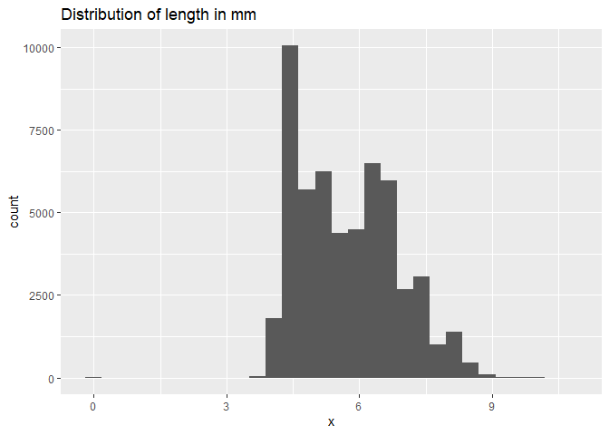<!-- -->

```r
plot2 <- ggplot(diamonds, aes(x=y)) + 
  geom_histogram() +
    labs(title = "Distribution of width in mm")
plot2
```

```
## `stat_bin()` using `bins = 30`. Pick better value with `binwidth`.
```

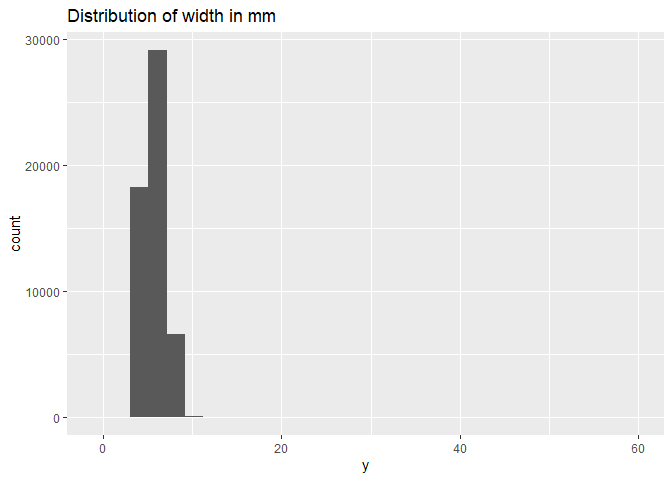<!-- -->

```r
plot3 <- ggplot(diamonds, aes(x=z)) + 
  geom_histogram() +
    labs(title = "Distribution of depth in mm")
plot3
```

```
## `stat_bin()` using `bins = 30`. Pick better value with `binwidth`.
```

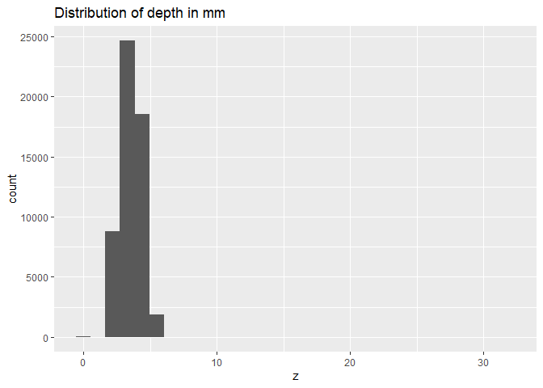<!-- -->


```r
plot4 <- ggplot(diamonds, aes(x = price)) + 
  geom_histogram() +
      labs(title = "Distribution of price")
plot4
```

```
## `stat_bin()` using `bins = 30`. Pick better value with `binwidth`.
```

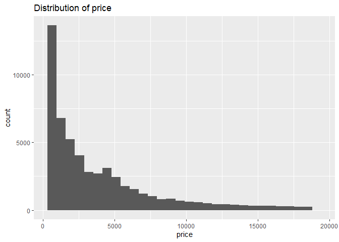<!-- -->
It is unusual as the distribution for price is skewed to the cheaper side. It is odd considering dimonds are expensive. 


```r
plot5 <- ggplot(diamonds, aes(x=carat, y=price)) + geom_point() +
      labs(title = "Price to Carat Size")
plot5
```

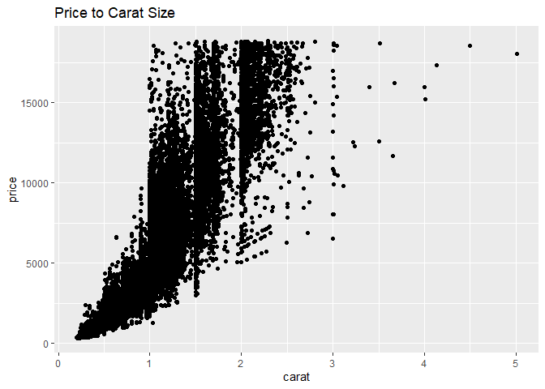<!-- -->
Carat seems to have the most effect on the price of the diamond. 


```r
plot6 <- ggplot(diamonds, aes(x=carat, y=price, color=cut)) + 
  geom_point() +
      labs(title = "How the Carats and the Cut Lines Up")
plot6
```

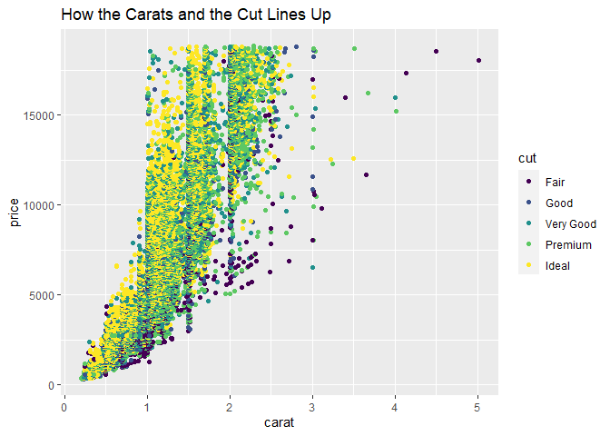<!-- -->
It seems like the more ideal cuts are group at the lower end of the carats. 


```r
plot7 <- ggplot(diamonds, aes(x=carat, y=price, color=clarity)) + 
  geom_point() +
      labs(title = "The Level of Clarity by Carat")
plot7
```

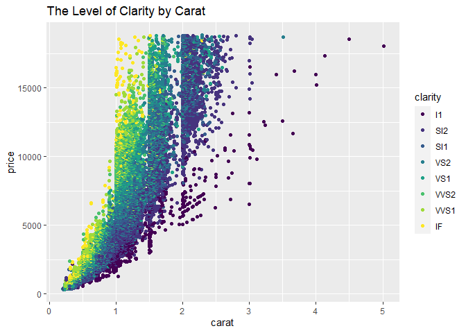<!-- -->
It seems that these grpahs above show us that the lower the carat the better quality of diamond. This includes the clarity and cut, which would lead to lower carat diamonds being more expensive.  


```r
price_diamonds <- diamonds %>%
  mutate(groupprice = 
           case_when(
             price>=0 & price <= 2000 ~ "1-2000",
             price>=2001 & price <= 4000 ~ "2001-4000",
             price>=4001 & price <= 6000 ~ "4001-6000",
             price>=6001 & price <= 8000 ~ "6001-8000",
             price>=8001 & price <= 10000 ~ "8001-10000",
             price>=10001 & price <= 12000 ~ "10001-12000",
             price>=12001 & price <= 14000 ~ "12001-14000",
             price>=14001 & price <= 16000 ~ "14001-16000",
             price>=16001 & price <= 18000 ~ "16001-18000",
             price>=18001 & price <= 20000 ~ "18001-20000"),
         groupprice = fct_relevel(groupprice,
"1-2000","2001-4000","4001-6000","6001-8000","8001-10000","10001-12000","12001-14000","14001-16000","16001-18000","18001-20000"))
head(price_diamonds)
```

```
## # A tibble: 6 x 11
##   carat cut       color clarity depth table price     x     y     z groupprice
##   <dbl> <ord>     <ord> <ord>   <dbl> <dbl> <int> <dbl> <dbl> <dbl> <fct>     
## 1  0.23 Ideal     E     SI2      61.5    55   326  3.95  3.98  2.43 1-2000    
## 2  0.21 Premium   E     SI1      59.8    61   326  3.89  3.84  2.31 1-2000    
## 3  0.23 Good      E     VS1      56.9    65   327  4.05  4.07  2.31 1-2000    
## 4  0.29 Premium   I     VS2      62.4    58   334  4.2   4.23  2.63 1-2000    
## 5  0.31 Good      J     SI2      63.3    58   335  4.34  4.35  2.75 1-2000    
## 6  0.24 Very Good J     VVS2     62.8    57   336  3.94  3.96  2.48 1-2000
```

```r
plot8 <- ggplot(price_diamonds, aes(x = groupprice, y = carat, fill = groupprice)) +
  geom_boxplot() +
  coord_flip() +
  theme_bw() +
  labs(title = "The number of carats in groups of prices")
plot8
```

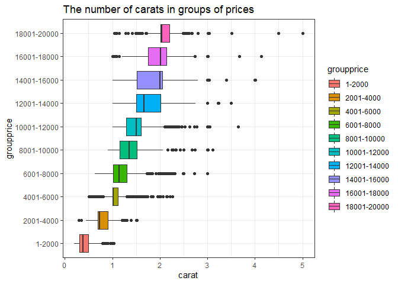<!-- -->


```r
plot9 <- diamonds %>% 
  filter(carat>=4.0) %>%
  group_by(carat) %>% 
  ggplot(aes(x = price)) +
  geom_histogram() +
  theme_bw() +
  labs(title = "The Price of Very Large Diamonds")
plot10 <- diamonds %>% 
  filter(carat<=1.5) %>%
  group_by(carat) %>% 
  ggplot(aes(x = price)) +
  geom_histogram() +
  theme_bw() +
  labs(title = "The Price of Very Small Diamonds")
plot9
```

```
## `stat_bin()` using `bins = 30`. Pick better value with `binwidth`.
```

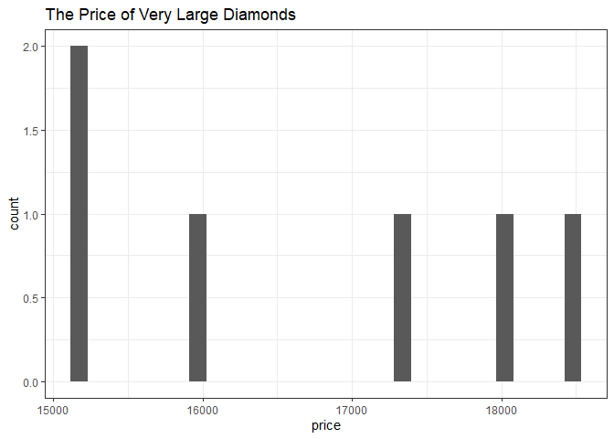<!-- -->

```r
plot10
```

```
## `stat_bin()` using `bins = 30`. Pick better value with `binwidth`.
```

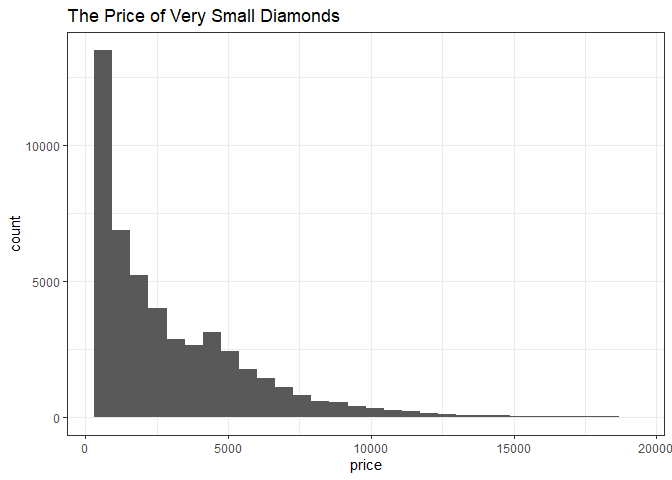<!-- -->
This is pretty predictable, as the bigger carats leads to hgiher prices. There are very few big diamonds, but of them, they are much more expensive than the small ones.  


```r
plot11 <- ggplot(diamonds, aes(x = price, y = carat, color)) + 
  geom_col() +
  facet_wrap(~cut, ncol=5) +
  theme_bw() +
  theme(axis.text.x = element_text(face="bold", 
                           size=8, angle=45)) +
  coord_cartesian(ylim = c(0, 12), expand = TRUE) +
  labs(title = "Cut, Carat, and Price")
plot11
```

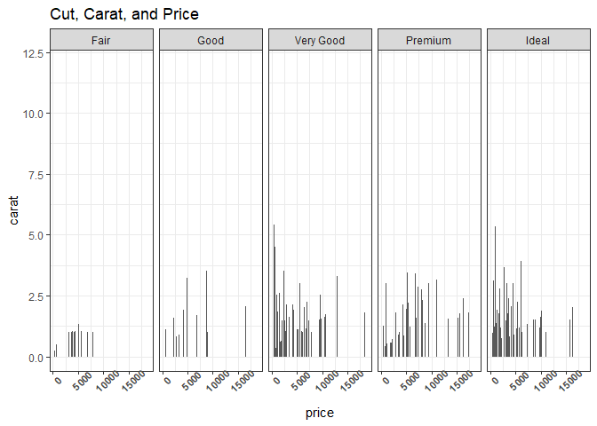<!-- -->
