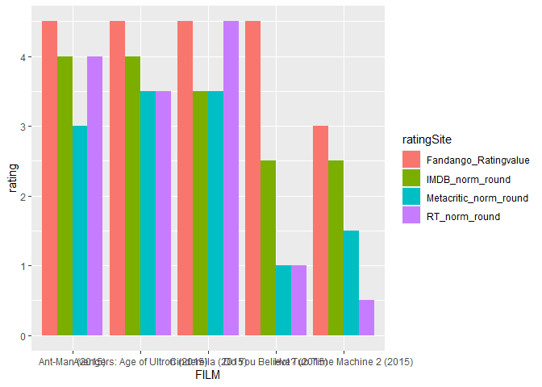

```r
library(lubridate)
```

```
## 
## Attaching package: 'lubridate'
```

```
## The following objects are masked from 'package:base':
## 
##     date, intersect, setdiff, union
```

```r
library(tidyverse)
```

```
## Warning: package 'tidyverse' was built under R version 4.1.3
```

```
## -- Attaching packages --------------------------------------- tidyverse 1.3.2 --
```

```
## v ggplot2 3.3.5     v purrr   0.3.4
## v tibble  3.1.6     v dplyr   1.0.7
## v tidyr   1.1.4     v stringr 1.4.0
## v readr   2.1.1     v forcats 0.5.1
## -- Conflicts ------------------------------------------ tidyverse_conflicts() --
## x lubridate::as.difftime() masks base::as.difftime()
## x lubridate::date()        masks base::date()
## x dplyr::filter()          masks stats::filter()
## x lubridate::intersect()   masks base::intersect()
## x dplyr::lag()             masks stats::lag()
## x lubridate::setdiff()     masks base::setdiff()
## x lubridate::union()       masks base::union()
```

```r
library(ggrepel)
```

```
## Warning: package 'ggrepel' was built under R version 4.1.3
```

```r
library(downloader)
```

```
## Warning: package 'downloader' was built under R version 4.1.3
```

```r
download.file("https://github.com/fivethirtyeight/data/raw/master/fandango/fandango_score_comparison.csv", "fandango_score_comparison")

movie <- read_csv("fandango_score_comparison")
```

```
## Rows: 146 Columns: 22
## -- Column specification --------------------------------------------------------
## Delimiter: ","
## chr  (1): FILM
## dbl (21): RottenTomatoes, RottenTomatoes_User, Metacritic, Metacritic_User, ...
## 
## i Use `spec()` to retrieve the full column specification for this data.
## i Specify the column types or set `show_col_types = FALSE` to quiet this message.
```

```r
movie
```

```
## # A tibble: 146 x 22
##    FILM         RottenTomatoes RottenTomatoes_~ Metacritic Metacritic_User  IMDB
##    <chr>                 <dbl>            <dbl>      <dbl>           <dbl> <dbl>
##  1 Avengers: A~             74               86         66             7.1   7.8
##  2 Cinderella ~             85               80         67             7.5   7.1
##  3 Ant-Man (20~             80               90         64             8.1   7.8
##  4 Do You Beli~             18               84         22             4.7   5.4
##  5 Hot Tub Tim~             14               28         29             3.4   5.1
##  6 The Water D~             63               62         50             6.8   7.2
##  7 Irrational ~             42               53         53             7.6   6.9
##  8 Top Five (2~             86               64         81             6.8   6.5
##  9 Shaun the S~             99               82         81             8.8   7.4
## 10 Love & Merc~             89               87         80             8.5   7.8
## # ... with 136 more rows, and 16 more variables: Fandango_Stars <dbl>,
## #   Fandango_Ratingvalue <dbl>, RT_norm <dbl>, RT_user_norm <dbl>,
## #   Metacritic_norm <dbl>, Metacritic_user_nom <dbl>, IMDB_norm <dbl>,
## #   RT_norm_round <dbl>, RT_user_norm_round <dbl>, Metacritic_norm_round <dbl>,
## #   Metacritic_user_norm_round <dbl>, IMDB_norm_round <dbl>,
## #   Metacritic_user_vote_count <dbl>, IMDB_user_vote_count <dbl>,
## #   Fandango_votes <dbl>, Fandango_Difference <dbl>
```


```r
newmovie <- movie %>%
  select(FILM, Fandango_Ratingvalue, RT_norm_round, Metacritic_norm_round,
         IMDB_norm_round) %>%
  pivot_longer(2:5, names_to = "ratingSite", values_to = "rating") %>%
  select(FILM, ratingSite, rating)
view(newmovie)
```


```r
f20ratings <- head(newmovie, n = 20)
view(f20ratings)
```


```r
plot1 <- ggplot(f20ratings, mapping=aes(x=FILM, y=rating, fill=ratingSite)) + 
  geom_bar(stat = "identity", position = "dodge")
plot1 
```

<!-- -->
The graph above shows the first 20 ratings from each movie site. Since there are four movie sites that rated each movie, above shows only 5 movies and thier ratings. Someting to note, it seems that fandango rates each of these movies the highest above all the other sites. Of course this is not enough to show a trend as it is only 5 movies. 
