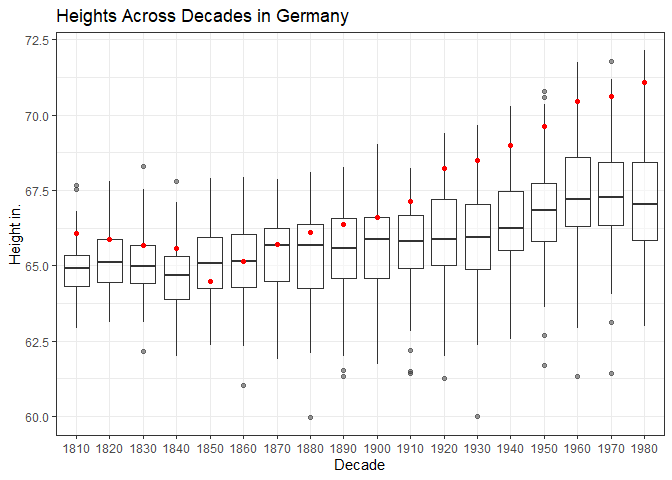
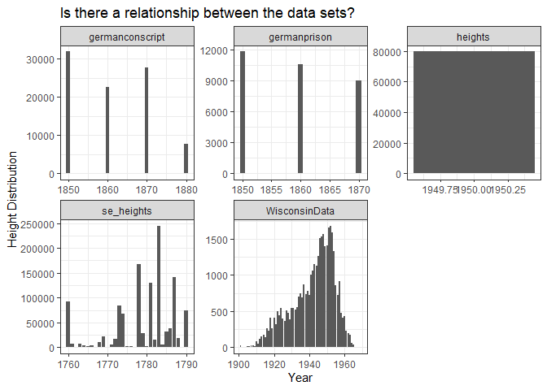

```r
library(tidyverse)
```

```
## Warning: package 'tidyverse' was built under R version 4.1.3
```

```
## -- Attaching packages --------------------------------------- tidyverse 1.3.2 --
## v ggplot2 3.3.5     v purrr   0.3.4
## v tibble  3.1.6     v dplyr   1.0.7
## v tidyr   1.1.4     v stringr 1.4.0
## v readr   2.1.1     v forcats 0.5.1
## -- Conflicts ------------------------------------------ tidyverse_conflicts() --
## x dplyr::filter() masks stats::filter()
## x dplyr::lag()    masks stats::lag()
```

```r
library(readr)
library(haven)
library(downloader)
```

```
## Warning: package 'downloader' was built under R version 4.1.3
```

```r
library(foreign)
library(readxl)
```


```r
germancon <- read_dta(url("https://github.com/WJC-Data-Science/DTS350/blob/master/germanconscr.dta?raw=true"))
head(germancon)
```

```
## # A tibble: 6 x 5
##   gebger      bdec height   age co   
##   <chr>      <dbl>  <dbl> <dbl> <chr>
## 1 brueckenau  1850   170.    21 de-se
## 2 brueckenau  1850   156.    21 de-se
## 3 brueckenau  1850   172.    21 de-se
## 4 brueckenau  1850   168.    21 de-se
## 5 brueckenau  1850   167.    21 de-se
## 6 brueckenau  1850   160.    21 de-se
```

```r
germanprison <- read_dta(url("https://github.com/WJC-Data-Science/DTS350/blob/master/germanprison.dta?raw=true"))
head(germanprison)
```

```
## # A tibble: 6 x 4
##     age  bdec co    height
##   <dbl> <dbl> <chr>  <dbl>
## 1    22  1850 de       156
## 2    26  1850 de       168
## 3    26  1850 de       161
## 4    25  1850 de       159
## 5    26  1850 de       175
## 6    24  1850 de       173
```

```r
height <- read_csv(url("https://raw.githubusercontent.com/hadley/r4ds/master/data/heights.csv"))
```

```
## Rows: 1192 Columns: 6
## -- Column specification --------------------------------------------------------
## Delimiter: ","
## chr (2): sex, race
## dbl (4): earn, height, ed, age
## 
## i Use `spec()` to retrieve the full column specification for this data.
## i Specify the column types or set `show_col_types = FALSE` to quiet this message.
```

```r
head(height)
```

```
## # A tibble: 6 x 6
##    earn height sex       ed   age race 
##   <dbl>  <dbl> <chr>  <dbl> <dbl> <chr>
## 1 50000   74.4 male      16    45 white
## 2 60000   65.5 female    16    58 white
## 3 30000   63.6 female    16    29 white
## 4 50000   63.1 female    16    91 other
## 5 51000   63.4 female    17    39 white
## 6  9000   64.4 female    15    26 white
```

```r
height1 <- tempfile()
download("https://github.com/WJC-Data-Science/DTS350/blob/master/Height.xlsx?raw=true", height1, mode = "wb")
head(height1)
```

```
## [1] "C:\\Users\\SALES\\AppData\\Local\\Temp\\RtmpA1VnNc\\file27f42c64c12"
```

```r
heightalt <- read_xlsx(height1, skip = 2)
head(heightalt)
```

```
## # A tibble: 6 x 203
##    Code `Continent, Re~` `1800` `1801` `1802` `1803` `1804` `1805` `1806` `1807`
##   <dbl> <chr>            <lgl>  <lgl>  <lgl>  <lgl>  <lgl>  <lgl>  <lgl>  <lgl> 
## 1   150 Europe           NA     NA     NA     NA     NA     NA     NA     NA    
## 2   155 Western Europe   NA     NA     NA     NA     NA     NA     NA     NA    
## 3    40 Austria          NA     NA     NA     NA     NA     NA     NA     NA    
## 4    56 Belgium          NA     NA     NA     NA     NA     NA     NA     NA    
## 5   280 Federal Republi~ NA     NA     NA     NA     NA     NA     NA     NA    
## 6   250 France           NA     NA     NA     NA     NA     NA     NA     NA    
## # ... with 193 more variables: `1808` <lgl>, `1809` <lgl>, `1810` <dbl>,
## #   `1811` <lgl>, `1812` <lgl>, `1813` <lgl>, `1814` <lgl>, `1815` <lgl>,
## #   `1816` <lgl>, `1817` <lgl>, `1818` <lgl>, `1819` <lgl>, `1820` <dbl>,
## #   `1821` <lgl>, `1822` <lgl>, `1823` <lgl>, `1824` <lgl>, `1825` <lgl>,
## #   `1826` <lgl>, `1827` <lgl>, `1828` <lgl>, `1829` <lgl>, `1830` <dbl>,
## #   `1831` <lgl>, `1832` <lgl>, `1833` <lgl>, `1834` <lgl>, `1835` <lgl>,
## #   `1836` <lgl>, `1837` <lgl>, `1838` <lgl>, `1839` <lgl>, `1840` <dbl>, ...
```

```r
heightse <- tempfile()
download("https://github.com/WJC-Data-Science/DTS350/raw/master/Heights_south-east/B6090.DBF?raw=true", heightse, mode = "wb")
head(heightse)
```

```
## [1] "C:\\Users\\SALES\\AppData\\Local\\Temp\\RtmpA1VnNc\\file27f423645e0e"
```

```r
seheight <- read.dbf(heightse)
head(seheight)
```

```
##   RECNO   SJ REG GEBGER SL GEBJZ GEWERBE BERUF STD_ELT F  Z V S GEBJ CMETER
## 1  3669 1773   2    lau  0   173    <NA>     0    <NA> 6  1 0 0 1733 177.55
## 2  3670 1773   2     ma  0   173    <NA>     0    <NA> 5  8 0 0 1737 165.39
## 3  3671 1773   2    bre  0   175    <NA>     0    <NA> 5 11 0 0 1750 172.68
## 4  3672 1773   2    neu  0   173    <NA>     0    <NA> 5 11 0 0 1734 172.68
## 5  3673 1773   2    alz  0   173    <NA>     0    <NA> 6  0 2 0 1734 176.33
## 6  3674 1773   2     hd  0   173    <NA>     0    <NA> 5  6 0 0 1737 160.52
##   MASS ALTER ALTERGR ARMGATT ZOLLABRD ZOLLVRD   KOM2 REGIM  COMP GREN LEIB OFF1
## 1    v    40       6       0       73    73.0 B03H18 06.ir riedl    0    0    1
## 2    v    36       6       0       68    68.0 B03H18 06.ir riedl    0    0    1
## 3    v    23       6       0       71    71.0 B03H18 06.ir riedl    0    0    0
## 4    v    39       6       0       71    71.0 B03H18 06.ir riedl    0    0    0
## 5    v    39       6       0       72    72.5 B03H18 06.ir riedl    0    0    0
## 6    v    36       6       0       66    66.0 B03H18 06.ir riedl    0    0    0
##   OFF2 OPF PF A16 A17 A18 A19 A20 A21 A22 A50 G2529 G3034 G3539 G4044 G4549
## 1    0   0  1   0   0   0   0   0   0   0   0     0     1     0     0     0
## 2    0   0  1   0   0   0   0   0   0   0   0     0     0     1     0     0
## 3    1   0  1   0   0   0   0   0   0   0   0     0     0     0     0     0
## 4    1   0  1   0   0   0   0   0   0   0   0     0     1     0     0     0
## 5    1   0  1   0   0   0   0   0   0   0   0     0     1     0     0     0
## 6    1   0  1   0   0   0   0   0   0   0   0     0     0     1     0     0
##   G5054 G5559 G6064 G6569 G7074 COMPOS
## 1     0     0     0     0     0      1
## 2     0     0     0     0     0      2
## 3     1     0     0     0     0      3
## 4     0     0     0     0     0      4
## 5     0     0     0     0     0      5
## 6     0     0     0     0     0      6
```


```r
WisconsinData=read.spss("http://www.ssc.wisc.edu/nsfh/wave3/NSFH3%20Apr%202005%20release/main05022005.sav", to.data.frame=TRUE)
```

```
## Warning in read.spss("http://www.ssc.wisc.edu/nsfh/wave3/
## NSFH3%20Apr%202005%20release/main05022005.sav", : Undeclared level(s) 1, 4, 6,
## 7, 8, 9, 10, 11, 12, 13, 14, 15, 16, 17, 18, 19, 20, 21, 22, 23, 24, 25, 26, 27,
## 28, 29, 30, 31, 32, 33, 34, 35, 36, 37, 38, 39, 40, 41, 42, 43, 44, 45, 46, 47,
## 48, 49, 50, 51, 52, 53, 54, 55, 56, 57, 58, 59, 60, 61, 62, 63, 64, 65, 66, 67,
## 68, 69, 70 added in variable: DOBY
```

```
## Warning in read.spss("http://www.ssc.wisc.edu/nsfh/wave3/
## NSFH3%20Apr%202005%20release/main05022005.sav", : Undeclared level(s) 1, 2, 3,
## 4, 5, 6, 7, 8, 9, 10, 11, 12, 13, 14, 15, 16, 17, 18, 19, 20, 21, 22, 23, 24,
## 25, 26, 28, 29, 30, 31, 32, 35, 36, 40, 42, 48, 49, 50, 55, 72, 80, 99 added in
## variable: RT1A1
```

```
## Warning in read.spss("http://www.ssc.wisc.edu/nsfh/wave3/
## NSFH3%20Apr%202005%20release/main05022005.sav", : Undeclared level(s) 1, 2, 3,
## 4, 5, 6, 7, 8, 9, 10, 11, 12, 13, 14, 15, 16, 17, 18, 19, 20, 21, 22, 23, 24,
## 25, 26, 28, 29, 30, 32, 35, 40, 42, 50 added in variable: RT1A2
```

```
## Warning in read.spss("http://www.ssc.wisc.edu/nsfh/wave3/
## NSFH3%20Apr%202005%20release/main05022005.sav", : Undeclared level(s) 1, 2, 3,
## 4, 5, 6, 7, 8, 9, 10, 11, 12, 13, 14, 15, 17, 18, 20, 21, 22, 24, 25, 30, 34,
## 35, 36, 40 added in variable: RT1A3
```

```
## Warning in read.spss("http://www.ssc.wisc.edu/nsfh/wave3/
## NSFH3%20Apr%202005%20release/main05022005.sav", : Undeclared level(s) 1, 2,
## 3, 4, 5, 6, 7, 8, 9, 10, 11, 12, 13, 14, 15, 16, 17, 18, 20, 21, 22, 23, 24,
## 25, 26, 28, 30, 32, 35, 36, 39, 40, 42, 48, 50, 60, 72, 75, 80, 99 added in
## variable: RT1B1
```

```
## Warning in read.spss("http://www.ssc.wisc.edu/nsfh/wave3/
## NSFH3%20Apr%202005%20release/main05022005.sav", : Undeclared level(s) 1, 2, 3,
## 4, 5, 6, 7, 8, 9, 10, 11, 12, 13, 14, 15, 16, 17, 18, 20, 21, 22, 23, 24, 25,
## 28, 30, 35, 36, 40, 50, 56, 75 added in variable: RT1B2
```

```
## Warning in read.spss("http://www.ssc.wisc.edu/nsfh/wave3/
## NSFH3%20Apr%202005%20release/main05022005.sav", : Undeclared level(s) 1, 2, 3,
## 4, 5, 6, 7, 8, 9, 10, 11, 12, 13, 14, 15, 16, 17, 18, 20, 21, 22, 23, 24, 25,
## 30, 31, 35, 36, 40, 97 added in variable: RT1B3
```

```
## Warning in read.spss("http://www.ssc.wisc.edu/nsfh/wave3/
## NSFH3%20Apr%202005%20release/main05022005.sav", : Undeclared level(s) 1, 2, 3,
## 4, 5, 6, 7, 8, 9, 10, 11, 12, 13, 14, 15, 16, 17, 18, 20, 21, 22, 23, 24, 25,
## 26, 27, 28, 30, 32, 35, 36, 40, 42, 45, 48, 50, 56, 60, 64, 70, 78, 80, 99 added
## in variable: RT1C1
```

```
## Warning in read.spss("http://www.ssc.wisc.edu/nsfh/wave3/
## NSFH3%20Apr%202005%20release/main05022005.sav", : Undeclared level(s) 1, 2, 3,
## 4, 5, 6, 7, 8, 9, 10, 11, 12, 13, 14, 15, 16, 17, 18, 20, 21, 22, 24, 25, 26,
## 28, 30, 34, 35, 36, 40, 41, 43, 45, 48, 50, 60, 80, 99 added in variable: RT1C2
```

```
## Warning in read.spss("http://www.ssc.wisc.edu/nsfh/wave3/
## NSFH3%20Apr%202005%20release/main05022005.sav", : Undeclared level(s) 1, 2, 3,
## 4, 5, 6, 7, 8, 9, 10, 11, 12, 13, 14, 15, 16, 20, 21, 25, 28, 30, 35, 40, 45,
## 48, 74 added in variable: RT1C3
```

```
## Warning in read.spss("http://www.ssc.wisc.edu/nsfh/wave3/
## NSFH3%20Apr%202005%20release/main05022005.sav", : Undeclared level(s) 1, 2, 3,
## 4, 5, 6, 7, 8, 9, 10, 11, 12, 13, 14, 15, 16, 17, 18, 20, 21, 22, 23, 24, 25,
## 26, 27, 28, 30, 32, 35, 40, 42, 45, 48, 49, 50, 56, 70, 72 added in variable:
## RT1D1
```

```
## Warning in read.spss("http://www.ssc.wisc.edu/nsfh/wave3/
## NSFH3%20Apr%202005%20release/main05022005.sav", : Undeclared level(s) 1, 2, 3,
## 4, 5, 6, 7, 8, 9, 10, 11, 12, 13, 14, 15, 16, 17, 18, 20, 21, 24, 25, 28, 30,
## 32, 35, 36, 40, 42, 45, 48, 50, 54, 55, 60, 70, 99 added in variable: RT1D2
```

```
## Warning in read.spss("http://www.ssc.wisc.edu/nsfh/wave3/
## NSFH3%20Apr%202005%20release/main05022005.sav", : Undeclared level(s) 1, 2, 3,
## 4, 5, 6, 7, 8, 10, 12, 14, 15, 16, 18, 20, 21, 23, 24, 25, 28, 30, 35, 40, 50
## added in variable: RT1D3
```

```
## Warning in read.spss("http://www.ssc.wisc.edu/nsfh/wave3/
## NSFH3%20Apr%202005%20release/main05022005.sav", : Undeclared level(s) 1, 2, 3,
## 4, 5, 6, 7, 8, 9, 10, 11, 12, 14, 15, 16, 18, 20, 24, 25, 28, 30, 42, 46, 50, 99
## added in variable: RT1E1
```

```
## Warning in read.spss("http://www.ssc.wisc.edu/nsfh/wave3/
## NSFH3%20Apr%202005%20release/main05022005.sav", : Undeclared level(s) 1, 2, 3,
## 4, 5, 6, 7, 8, 9, 10, 12, 13, 14, 15, 16, 18, 20, 21, 24, 25, 28, 30, 32, 42,
## 45, 90, 99 added in variable: RT1E2
```

```
## Warning in read.spss("http://www.ssc.wisc.edu/nsfh/wave3/
## NSFH3%20Apr%202005%20release/main05022005.sav", : Undeclared level(s) 1, 2, 3,
## 4, 5, 6, 7, 8, 9, 10, 12, 14, 15, 20, 21, 22, 25, 30 added in variable: RT1E3
```

```
## Warning in read.spss("http://www.ssc.wisc.edu/nsfh/wave3/
## NSFH3%20Apr%202005%20release/main05022005.sav", : Undeclared level(s) 1, 2, 3,
## 4, 5, 6, 7, 8, 9, 10, 12, 13, 14, 15, 16, 18, 20, 21, 24, 25, 27, 30, 32, 35,
## 38, 40, 72 added in variable: RT1F1
```

```
## Warning in read.spss("http://www.ssc.wisc.edu/nsfh/wave3/
## NSFH3%20Apr%202005%20release/main05022005.sav", : Undeclared level(s) 1, 2, 3,
## 4, 5, 6, 7, 8, 9, 10, 12, 14, 15, 16, 18, 20, 21, 22, 24, 25, 30, 40 added in
## variable: RT1F2
```

```
## Warning in read.spss("http://www.ssc.wisc.edu/nsfh/wave3/
## NSFH3%20Apr%202005%20release/main05022005.sav", : Undeclared level(s) 1, 2, 3,
## 4, 5, 6, 7, 8, 9, 10, 11, 12, 14, 15, 16, 19, 20, 21, 24, 25, 28, 30, 36, 40
## added in variable: RT1F3
```

```
## Warning in read.spss("http://www.ssc.wisc.edu/nsfh/wave3/
## NSFH3%20Apr%202005%20release/main05022005.sav", : Undeclared level(s) 1, 2, 3,
## 4, 5, 6, 7, 8, 9, 10, 11, 12, 13, 14, 15, 16, 18, 19, 20, 21, 24, 25, 30, 35,
## 36, 40, 45, 48, 50, 70, 76 added in variable: RT1G1
```

```
## Warning in read.spss("http://www.ssc.wisc.edu/nsfh/wave3/
## NSFH3%20Apr%202005%20release/main05022005.sav", : Undeclared level(s) 1, 2, 3,
## 4, 5, 6, 7, 8, 10, 11, 12, 14, 15, 16, 19, 20, 24, 25, 30, 40, 45, 60 added in
## variable: RT1G2
```

```
## Warning in read.spss("http://www.ssc.wisc.edu/nsfh/wave3/
## NSFH3%20Apr%202005%20release/main05022005.sav", : Undeclared level(s) 1, 2, 3,
## 4, 5, 6, 7, 8, 10, 14, 15, 20, 24, 35 added in variable: RT1G3
```

```
## Warning in read.spss("http://www.ssc.wisc.edu/nsfh/wave3/
## NSFH3%20Apr%202005%20release/main05022005.sav", : Undeclared level(s) 1, 2, 3,
## 4, 5, 6, 7, 8, 9, 10, 12, 15, 16, 18, 19, 20, 25, 28, 30, 35, 36, 40, 45, 50,
## 53, 60 added in variable: RT1H1
```

```
## Warning in read.spss("http://www.ssc.wisc.edu/nsfh/wave3/
## NSFH3%20Apr%202005%20release/main05022005.sav", : Undeclared level(s) 1, 2, 3,
## 4, 5, 6, 7, 8, 10, 12, 14, 15, 18, 20, 21, 24, 25, 30, 40, 50 added in variable:
## RT1H2
```

```
## Warning in read.spss("http://www.ssc.wisc.edu/nsfh/wave3/
## NSFH3%20Apr%202005%20release/main05022005.sav", : Undeclared level(s) 1, 2, 3,
## 4, 5, 6, 7, 8, 10, 11, 12, 15, 20, 24, 25, 40 added in variable: RT1H3
```

```
## Warning in read.spss("http://www.ssc.wisc.edu/nsfh/wave3/
## NSFH3%20Apr%202005%20release/main05022005.sav", : Undeclared level(s) 1, 2, 3,
## 4, 5, 6, 7, 8, 9, 10, 12, 13, 14, 15, 16, 18, 19, 20, 21, 24, 25, 28, 30, 32,
## 40, 99 added in variable: RT1I1
```

```
## Warning in read.spss("http://www.ssc.wisc.edu/nsfh/wave3/
## NSFH3%20Apr%202005%20release/main05022005.sav", : Undeclared level(s) 1, 2, 3,
## 4, 5, 6, 7, 8, 9, 10, 11, 12, 13, 14, 15, 16, 20, 25, 30, 32, 40, 50, 99 added
## in variable: RT1I2
```

```
## Warning in read.spss("http://www.ssc.wisc.edu/nsfh/wave3/
## NSFH3%20Apr%202005%20release/main05022005.sav", : Undeclared level(s) 1, 2,
## 3, 4, 5, 6, 7, 8, 9, 10, 11, 12, 14, 15, 20, 21, 22, 25, 30, 40, 50 added in
## variable: RT1I3
```

```
## Warning in read.spss("http://www.ssc.wisc.edu/nsfh/wave3/
## NSFH3%20Apr%202005%20release/main05022005.sav", : Undeclared level(s) 1, 2, 3,
## 4, 5, 6, 7, 8, 9, 10, 11, 12, 13, 14, 15, 16, 17, 18, 19, 20, 21, 22, 24, 25,
## 26, 27, 28, 30, 31, 32, 33, 34, 35, 36, 38, 40, 41, 42, 44, 45, 46, 47, 48, 49,
## 50, 51, 52 added in variable: RE37
```

```
## Warning in read.spss("http://www.ssc.wisc.edu/nsfh/wave3/
## NSFH3%20Apr%202005%20release/main05022005.sav", : Undeclared level(s) 1, 2, 3,
## 4, 5, 6, 7, 8, 9, 10, 11, 12, 13, 14, 15, 16, 17, 18, 20, 21, 24, 25, 26, 27,
## 28, 30, 32, 35, 36, 38, 40, 48, 49, 50, 52, 54, 56, 60, 70, 72, 74 added in
## variable: RE38
```

```
## Warning in read.spss("http://www.ssc.wisc.edu/nsfh/wave3/
## NSFH3%20Apr%202005%20release/main05022005.sav", : Undeclared level(s) 1, 2, 3,
## 4, 5, 6, 7, 8, 9, 10, 12, 13, 14, 15, 16, 17, 18, 20, 22, 24, 25, 26, 28, 30,
## 32, 34, 35, 36, 40, 45, 48, 49, 50, 52 added in variable: RE45
```

```
## Warning in read.spss("http://www.ssc.wisc.edu/nsfh/wave3/
## NSFH3%20Apr%202005%20release/main05022005.sav", : Undeclared level(s) 1, 2, 3,
## 4, 5, 6, 7, 8, 9, 10, 11, 12, 13, 14, 15, 16, 18, 20, 22, 24, 25, 28, 30, 32,
## 35, 36, 40, 42, 48, 50, 56, 60, 65, 70, 72 added in variable: RE46
```

```
## Warning in read.spss("http://www.ssc.wisc.edu/nsfh/wave3/
## NSFH3%20Apr%202005%20release/main05022005.sav", : Undeclared level(s) 1, 2, 3,
## 4, 5, 6, 7, 8, 9, 10, 12, 13, 14, 15, 16, 17, 18, 20, 21, 22, 24, 25, 26, 28,
## 30, 32, 35, 36, 40, 47, 48, 50, 51, 52 added in variable: RE51
```

```
## Warning in read.spss("http://www.ssc.wisc.edu/nsfh/wave3/
## NSFH3%20Apr%202005%20release/main05022005.sav", : Undeclared level(s) 1, 2, 3,
## 4, 5, 6, 7, 8, 9, 10, 11, 12, 13, 14, 15, 16, 18, 20, 21, 24, 25, 26, 30, 32,
## 33, 35, 36, 48, 50, 52 added in variable: RE55
```

```
## Warning in read.spss("http://www.ssc.wisc.edu/nsfh/wave3/
## NSFH3%20Apr%202005%20release/main05022005.sav", : Undeclared level(s) 47, 49,
## 50, 52, 53, 54, 55, 56, 57, 58, 59, 60, 61, 62, 63, 64, 65, 66, 67, 68, 69, 70,
## 71, 72, 73, 74, 75, 76, 77, 78, 79, 80, 81, 82, 83, 84, 85, 86, 87, 88, 89, 90,
## 91, 92, 93, 94, 95, 96, 97, 98 added in variable: RF2
```

```
## Warning in read.spss("http://www.ssc.wisc.edu/nsfh/wave3/
## NSFH3%20Apr%202005%20release/main05022005.sav", : Undeclared level(s) 1906,
## 1916, 1917, 1918, 1920, 1923, 1924, 1925, 1926, 1927, 1928, 1929, 1930, 1931,
## 1932, 1933, 1934, 1935, 1936, 1937, 1938, 1939, 1940, 1941, 1942, 1943, 1944,
## 1945, 1946, 1947, 1948, 1949, 1950, 1951, 1952, 1953, 1954, 1955, 1956, 1957,
## 1958, 1959, 1960, 1961, 1962, 1963, 1964, 1965, 1966, 1967, 1968, 1969, 1970,
## 1971, 1972, 1973, 1974, 1975, 1976, 1977, 1978, 1979, 1980, 1981, 1982, 1983,
## 1984, 1985, 1986, 1987, 1988, 1989, 1990, 1991, 1992, 1993, 1994, 1995, 1996,
## 1997, 1998, 1999, 2000, 2001, 2002, 2003 added in variable: RF3
```

```
## Warning in read.spss("http://www.ssc.wisc.edu/nsfh/wave3/
## NSFH3%20Apr%202005%20release/main05022005.sav", : Undeclared level(s) 54, 55,
## 57, 58, 59, 60, 61, 62, 63, 64, 65, 66, 67, 68, 69, 70, 71, 72, 73, 74, 75, 76,
## 77, 78, 79, 80, 81, 82, 83, 84, 85, 86, 87, 88, 89, 90, 91, 92, 93, 94, 95, 96,
## 97, 98 added in variable: RF5
```

```
## Warning in read.spss("http://www.ssc.wisc.edu/nsfh/wave3/
## NSFH3%20Apr%202005%20release/main05022005.sav", : Undeclared level(s) 1918,
## 1933, 1937, 1944, 1948, 1949, 1951, 1954, 1955, 1957, 1958, 1959, 1960, 1961,
## 1962, 1963, 1964, 1965, 1966, 1967, 1968, 1969, 1970, 1971, 1972, 1973, 1974,
## 1975, 1976, 1977, 1978, 1979, 1980, 1981, 1982, 1984, 1985, 1986, 1987, 1988,
## 1989, 1990, 1991, 1992, 1993, 1994, 1995, 1996, 1997, 1998, 1999, 2000, 2001,
## 2002, 2003 added in variable: RF6
```

```
## Warning in read.spss("http://www.ssc.wisc.edu/nsfh/wave3/
## NSFH3%20Apr%202005%20release/main05022005.sav", : Undeclared level(s) 1906,
## 1916, 1917, 1918, 1921, 1923, 1924, 1925, 1926, 1928, 1929, 1930, 1931, 1932,
## 1933, 1934, 1935, 1936, 1937, 1938, 1939, 1940, 1941, 1942, 1943, 1944, 1945,
## 1946, 1947, 1948, 1949, 1950, 1951, 1952, 1953, 1954, 1955, 1956, 1957, 1958,
## 1959, 1960, 1961, 1962, 1963, 1964, 1965, 1966, 1967, 1968, 1969, 1970, 1971,
## 1972, 1973, 1974, 1975, 1976, 1977, 1978, 1979, 1980, 1981, 1982, 1983, 1984,
## 1985, 1986, 1987, 1988, 1989, 1990, 1991, 1992, 1993, 1994, 1995, 1996, 1997,
## 1998, 1999, 2000, 2001, 2002, 2003 added in variable: RF12
```

```
## Warning in read.spss("http://www.ssc.wisc.edu/nsfh/wave3/
## NSFH3%20Apr%202005%20release/main05022005.sav", : Undeclared level(s) 47, 48,
## 49, 50, 51, 52, 53, 54, 55, 56, 57, 58, 59, 60, 61, 62, 63, 64, 65, 66, 67, 68,
## 69, 70, 71, 72, 73, 74, 75, 76, 77, 78, 79, 80, 81, 82, 83, 84, 85, 86, 87, 88,
## 89, 90, 91, 92, 93, 94, 95, 96, 97, 98 added in variable: RF13
```

```
## Warning in read.spss("http://www.ssc.wisc.edu/nsfh/wave3/
## NSFH3%20Apr%202005%20release/main05022005.sav", : Undeclared level(s) 1918,
## 1920, 1921, 1922, 1925, 1927, 1929, 1930, 1931, 1932, 1933, 1934, 1935, 1936,
## 1937, 1938, 1939, 1940, 1941, 1942, 1943, 1944, 1945, 1946, 1947, 1948, 1949,
## 1950, 1951, 1952, 1953, 1954, 1955, 1956, 1957, 1958, 1959, 1960, 1961, 1962,
## 1963, 1964, 1965, 1966, 1967, 1968, 1969, 1970, 1971, 1972, 1973, 1974, 1975,
## 1976, 1977, 1978, 1979, 1980, 1981, 1982, 1983, 1984, 1985, 1986, 1987, 1988,
## 1989, 1990, 1991, 1992, 1993, 1994, 1995, 1996, 1997, 1998, 1999, 2000, 2001,
## 2002 added in variable: RF15
```

```
## Warning in read.spss("http://www.ssc.wisc.edu/nsfh/wave3/
## NSFH3%20Apr%202005%20release/main05022005.sav", : Undeclared level(s) 48, 51,
## 52, 53, 54, 55, 56, 57, 58, 59, 60, 61, 62, 63, 64, 65, 66, 67, 68, 69, 70, 71,
## 72, 73, 74, 75, 76, 77, 78, 79, 80, 81, 82, 83, 84, 85, 86, 87, 88, 89, 90, 91,
## 92, 93, 94, 95, 96, 97 added in variable: RF16
```

```
## Warning in read.spss("http://www.ssc.wisc.edu/nsfh/wave3/
## NSFH3%20Apr%202005%20release/main05022005.sav", : Undeclared level(s) 1, 2, 3,
## 4, 5, 6, 7, 8, 9 added in variable: RF18
```

```
## Warning in read.spss("http://www.ssc.wisc.edu/nsfh/wave3/
## NSFH3%20Apr%202005%20release/main05022005.sav", : Undeclared level(s) 1945,
## 1946, 1948, 1951, 1952, 1953, 1954, 1955, 1956, 1957, 1958, 1959, 1960, 1961,
## 1962, 1963, 1964, 1965, 1966, 1967, 1968, 1969, 1970, 1971, 1972, 1973, 1974,
## 1975, 1976, 1977, 1978, 1979, 1980, 1981, 1982, 1983, 1984, 1985, 1986, 1987,
## 1988, 1989, 1990, 1991, 1992, 1993, 1994, 1995, 1996, 1997, 1998, 1999, 2000,
## 2001, 2002 added in variable: RF21
```

```
## Warning in read.spss("http://www.ssc.wisc.edu/nsfh/wave3/
## NSFH3%20Apr%202005%20release/main05022005.sav", : Undeclared level(s) 1, 2, 3,
## 4, 5, 6, 7, 8, 9 added in variable: RF22
```

```
## Warning in read.spss("http://www.ssc.wisc.edu/nsfh/wave3/
## NSFH3%20Apr%202005%20release/main05022005.sav", : Undeclared level(s) 1951,
## 1956, 1961, 1963, 1965, 1966, 1970, 1971, 1972, 1973, 1974, 1975, 1978, 1979,
## 1980, 1981, 1982, 1983, 1984, 1985, 1986, 1987, 1988, 1989, 1990, 1991, 1992,
## 1993, 1994, 1995, 1996, 1997, 1998, 1999, 2000, 2001, 2002, 2003 added in
## variable: RF24Y
```

```
## Warning in read.spss("http://www.ssc.wisc.edu/nsfh/wave3/
## NSFH3%20Apr%202005%20release/main05022005.sav", : Undeclared level(s) 1, 2, 3,
## 4, 5, 6, 7, 8, 9, 10, 11, 12, 13, 14, 15, 16, 17, 18, 19, 20, 22, 23, 25, 26,
## 27, 28, 30, 31, 32, 33, 34, 35, 36, 38, 40, 43, 44, 45, 48, 50, 51, 54, 55, 58,
## 60, 62, 65, 67, 68, 70, 75, 76, 77, 80, 81, 83, 85, 86, 89, 90, 95, 97, 98, 100,
## 109, 110, 112, 115, 120, 125, 130, 140, 144, 150, 155, 156, 160, 162, 164, 165,
## 167, 170, 175, 180, 184, 185, 186, 187, 190, 195, 200, 201, 208, 210, 220, 223,
## 225, 230, 240, 241, 242, 243, 250, 260, 275, 278, 280, 285, 290, 298, 300, 305,
## 307, 310, 311, 312, 320, 330, 340, 342, 350, 360, 365, 370, 375, 400, 405, 415,
## 420, 427, 430, 440, 450, 480, 485, 487, 500, 510, 520, 525, 528, 534, 535, 550,
## 570, 575, 584, 600, 633, 650, 666, 670, 680, 697, 700, 720, 725, 750, 780, 800,
## 825, 850, 875, 900, 950, 960, 975, 980, 990, 998, 1000, 1100, 1200, 1223, 1250,
## 1300, 1303, 1350, 1400, 1450, 1462, 1500, 1560, 1600, 1650, 1700, 1800, 1850,
## 1900, 2000, 2100, 2200, 2300, 2400, 2500, 2600, 2800, 3000, 3200, 3482, 3500,
## 3600, 4000, 5000, 6000, 6500, 7000, 8000 added in variable: RF25
```

```
## Warning in read.spss("http://www.ssc.wisc.edu/nsfh/wave3/
## NSFH3%20Apr%202005%20release/main05022005.sav", : Undeclared level(s) 1968,
## 1973, 1978, 1980, 1982, 1983, 1985, 1986, 1989, 1990, 1991, 1992, 1993, 1994,
## 1995, 1996, 1997, 1998, 1999, 2000, 2001 added in variable: RF27
```

```
## Warning in read.spss("http://www.ssc.wisc.edu/nsfh/wave3/
## NSFH3%20Apr%202005%20release/main05022005.sav", : Undeclared level(s) 1, 2, 3,
## 4, 5, 6, 7, 8, 9 added in variable: RF30
```

```
## Warning in read.spss("http://www.ssc.wisc.edu/nsfh/wave3/
## NSFH3%20Apr%202005%20release/main05022005.sav", : Undeclared level(s) 1946,
## 1948, 1949, 1950, 1952, 1953, 1954, 1955, 1956, 1958, 1959, 1960, 1961, 1962,
## 1963, 1964, 1965, 1966, 1967, 1968, 1969, 1970, 1971, 1972, 1973, 1974, 1975,
## 1976, 1977, 1978, 1979, 1980, 1981, 1982, 1983, 1984, 1985, 1986, 1987, 1988,
## 1989, 1990, 1991, 1992, 1993, 1994, 1995, 1996, 1997, 1998, 1999, 2000, 2001,
## 2002 added in variable: RF32
```

```
## Warning in read.spss("http://www.ssc.wisc.edu/nsfh/wave3/
## NSFH3%20Apr%202005%20release/main05022005.sav", : Undeclared level(s) 1, 2, 3,
## 4, 5, 6, 7, 8, 9 added in variable: RF33
```

```
## Warning in read.spss("http://www.ssc.wisc.edu/nsfh/wave3/
## NSFH3%20Apr%202005%20release/main05022005.sav", : Undeclared level(s) 1, 2, 3,
## 4, 5, 6, 7, 8, 9, 10, 11, 12, 13, 14, 15, 18, 20, 22, 25, 27, 28, 29, 30, 31,
## 32, 35, 36, 37, 38, 40, 42, 44, 45, 47, 50, 55, 60, 65, 70, 72, 75, 76, 80, 82,
## 90, 100, 120, 125, 140, 150, 160, 162, 200, 220, 230, 250, 275, 280, 285, 300,
## 340, 350, 400, 450, 500, 520, 550, 560, 590, 600, 603, 640, 650, 690, 700, 725,
## 750, 800, 850, 900, 950, 1000, 1100, 1200, 1265, 1300, 1400, 1425, 1500, 1600,
## 1800, 2000, 2005, 2300, 2400, 2500, 2700, 3000, 3200, 3600, 4000, 5000, 7000
## added in variable: RF35
```

```
## Warning in read.spss("http://www.ssc.wisc.edu/nsfh/wave3/
## NSFH3%20Apr%202005%20release/main05022005.sav", : Undeclared level(s) 1950,
## 1958, 1960, 1961, 1966, 1969, 1970, 1973, 1975, 1976, 1980, 1982, 1985, 1986,
## 1988, 1989, 1990, 1991, 1992, 1993, 1994, 1995, 1996, 1997, 1998, 1999, 2000,
## 2001, 2002 added in variable: RF37
```

```
## Warning in read.spss("http://www.ssc.wisc.edu/nsfh/wave3/
## NSFH3%20Apr%202005%20release/main05022005.sav", : Undeclared level(s) 1984,
## 1985, 1987, 1989, 1990, 1991, 1992, 1994, 1995, 1996, 1997, 1998, 1999, 2000,
## 2001, 2002, 2003 added in variable: RF39Y
```

```
## Warning in read.spss("http://www.ssc.wisc.edu/nsfh/wave3/
## NSFH3%20Apr%202005%20release/main05022005.sav", : Undeclared level(s) 1959,
## 1962, 1966, 1971, 1972, 1973, 1975, 1976, 1978, 1980, 1982, 1983, 1985, 1986,
## 1987, 1989, 1990, 1991, 1992, 1993, 1994, 1995, 1996, 1997, 1998, 1999, 2000,
## 2001 added in variable: RF41
```

```
## Warning in read.spss("http://www.ssc.wisc.edu/nsfh/wave3/
## NSFH3%20Apr%202005%20release/main05022005.sav", : Undeclared level(s) 1, 2, 3,
## 4, 5, 6, 7, 8, 9 added in variable: RF42
```

```
## Warning in read.spss("http://www.ssc.wisc.edu/nsfh/wave3/
## NSFH3%20Apr%202005%20release/main05022005.sav", : Undeclared level(s) 1, 2, 3,
## 4, 5, 6, 7, 8, 9 added in variable: RF44
```

```
## Warning in read.spss("http://www.ssc.wisc.edu/nsfh/wave3/
## NSFH3%20Apr%202005%20release/main05022005.sav", : Undeclared level(s) 1, 2, 3,
## 4, 5, 6, 7, 8, 9, 10, 11, 12, 13, 14, 15, 16, 17, 18, 19, 20, 22, 25, 26, 27,
## 28, 30, 32, 34, 35, 36, 37, 38, 40, 41, 42, 44, 45, 46, 47, 50, 51, 55, 57, 60,
## 62, 65, 67, 70, 72, 75, 77, 80, 82, 85, 86, 90, 92, 95, 96, 100, 105, 110, 115,
## 120, 122, 125, 130, 135, 139, 140, 150, 154, 155, 159, 160, 163, 165, 170, 175,
## 180, 185, 187, 189, 190, 195, 200, 210, 220, 225, 230, 240, 250, 260, 265, 270,
## 275, 290, 300, 306, 315, 325, 342, 350, 360, 365, 375, 380, 400, 417, 430, 434,
## 440, 450, 454, 500, 525, 530, 532, 535, 546, 550, 600, 620, 637, 650, 680, 700,
## 720, 740, 750, 800, 820, 850, 860, 900, 938, 950, 979, 1000, 1100, 1200, 1250,
## 1300, 1400, 1432, 1450, 1500, 1600, 1700, 1800, 1900, 2000, 2100, 2200, 2300,
## 2400, 2500, 2600, 2800, 3000, 3100, 3200, 3500, 3800, 4000, 5000, 5500, 6000,
## 7000, 8000, 8250 added in variable: RF48
```

```
## Warning in read.spss("http://www.ssc.wisc.edu/nsfh/wave3/
## NSFH3%20Apr%202005%20release/main05022005.sav", : Undeclared level(s) 1959,
## 1971, 1976, 1978, 1979, 1980, 1981, 1983, 1984, 1985, 1986, 1987, 1988, 1989,
## 1990, 1992, 1993, 1994, 1995, 1996, 1997, 1998, 1999, 2000, 2001, 2002 added in
## variable: RF51Y
```

```
## Warning in read.spss("http://www.ssc.wisc.edu/nsfh/wave3/
## NSFH3%20Apr%202005%20release/main05022005.sav", : Undeclared level(s) 1, 2, 3,
## 4, 5, 6, 7, 8, 9 added in variable: RF53
```

```
## Warning in read.spss("http://www.ssc.wisc.edu/nsfh/wave3/
## NSFH3%20Apr%202005%20release/main05022005.sav", : Undeclared level(s) 1, 2, 3,
## 4, 5, 6, 7, 8, 10, 11, 12, 14, 15, 16, 18, 20, 22, 23, 25, 26, 30, 32, 35, 37,
## 40, 45, 50, 54, 60, 65, 70, 75, 80, 85, 90, 95, 97, 100, 110, 115, 120, 125,
## 130, 140, 150, 160, 180, 190, 200, 220, 230, 240, 250, 280, 285, 300, 350, 360,
## 400, 450, 500, 525, 541, 550, 565, 600, 650, 700, 800, 850, 900, 950, 1000,
## 1200, 1300, 1400, 1500, 1600, 1700, 1800, 2000, 2100, 2200, 2400, 2500, 2700,
## 2800, 3000, 3200 added in variable: RF56
```

```
## Warning in read.spss("http://www.ssc.wisc.edu/nsfh/wave3/
## NSFH3%20Apr%202005%20release/main05022005.sav", : Undeclared level(s) 1980,
## 1993, 1994, 1995, 1996, 1997, 1998, 1999, 2000, 2001, 2002 added in variable:
## RF59Y
```

```
## Warning in read.spss("http://www.ssc.wisc.edu/nsfh/wave3/
## NSFH3%20Apr%202005%20release/main05022005.sav", : Undeclared level(s) 1968,
## 1970, 1979, 1980, 1981, 1982, 1983, 1985, 1986, 1987, 1988, 1989, 1990, 1991,
## 1992, 1993, 1994, 1995, 1996, 1997, 1998, 1999, 2000, 2001, 2002 added in
## variable: RF62Y
```

```
## Warning in read.spss("http://www.ssc.wisc.edu/nsfh/wave3/
## NSFH3%20Apr%202005%20release/main05022005.sav", : Undeclared level(s) 1989,
## 1990, 1991, 1992, 1993, 1994, 1995, 1996, 1997, 1998, 1999, 2000, 2001, 2002,
## 2003 added in variable: RF64Y
```

```
## Warning in read.spss("http://www.ssc.wisc.edu/nsfh/wave3/
## NSFH3%20Apr%202005%20release/main05022005.sav", : Undeclared level(s) 1993,
## 1994, 1998, 2000, 2001, 2002 added in variable: RF67Y
```

```
## Warning in read.spss("http://www.ssc.wisc.edu/nsfh/wave3/
## NSFH3%20Apr%202005%20release/main05022005.sav", : Undeclared level(s) 1993,
## 1998, 2000, 2001, 2002 added in variable: RF69Y
```

```
## Warning in read.spss("http://www.ssc.wisc.edu/nsfh/wave3/
## NSFH3%20Apr%202005%20release/main05022005.sav", : Undeclared level(s) 1971,
## 1979, 1986, 1987, 1989, 1990, 1992, 1993, 1994, 1995, 1996, 1997, 1998, 1999,
## 2000, 2001, 2002 added in variable: RF73Y
```

```
## Warning in read.spss("http://www.ssc.wisc.edu/nsfh/wave3/
## NSFH3%20Apr%202005%20release/main05022005.sav", : Undeclared level(s) 1990,
## 1993, 1994, 1995, 1996, 1997, 1998, 1999, 2000, 2001, 2002, 2003 added in
## variable: RF75Y
```

```
## Warning in read.spss("http://www.ssc.wisc.edu/nsfh/wave3/
## NSFH3%20Apr%202005%20release/main05022005.sav", : Undeclared level(s) 1994,
## 1995, 2002 added in variable: RF78Y
```

```
## Warning in read.spss("http://www.ssc.wisc.edu/nsfh/wave3/
## NSFH3%20Apr%202005%20release/main05022005.sav", : Undeclared level(s) 1995 added
## in variable: RF79Y
```

```
## Warning in read.spss("http://www.ssc.wisc.edu/nsfh/wave3/
## NSFH3%20Apr%202005%20release/main05022005.sav", : Undeclared level(s) 1, 2, 3,
## 4, 5, 6, 7, 8, 9, 10, 11, 12, 13, 14, 15, 16, 17, 18, 20, 21, 22, 24, 25, 28,
## 30, 32, 35, 36, 38, 40, 42, 45, 48, 50, 52, 55, 60, 70, 72 added in variable:
## RF92
```

```
## Warning in read.spss("http://www.ssc.wisc.edu/nsfh/wave3/
## NSFH3%20Apr%202005%20release/main05022005.sav", : Undeclared level(s) 1, 2, 3,
## 4, 5, 6, 7, 8, 9, 10, 11, 12, 14, 15, 16, 18, 20, 21, 24, 25, 28, 30, 35, 38,
## 40, 50, 60, 72 added in variable: RF108
```

```
## Warning in read.spss("http://www.ssc.wisc.edu/nsfh/wave3/
## NSFH3%20Apr%202005%20release/main05022005.sav", : Undeclared level(s) 1986,
## 1988, 1989, 1990, 1992, 1993, 1994, 1995, 1996, 1997, 1998, 1999, 2000, 2001,
## 2002, 2003 added in variable: RF135Y
```

```
## Warning in read.spss("http://www.ssc.wisc.edu/nsfh/wave3/
## NSFH3%20Apr%202005%20release/main05022005.sav", : Undeclared level(s) 1993,
## 1994, 1995, 1996, 1998, 2000, 2001 added in variable: RF137Y
```

```
## Warning in read.spss("http://www.ssc.wisc.edu/nsfh/wave3/
## NSFH3%20Apr%202005%20release/main05022005.sav", : Undeclared level(s) 1994,
## 1995, 1996, 2000, 2002 added in variable: RF139Y
```

```
## Warning in read.spss("http://www.ssc.wisc.edu/nsfh/wave3/
## NSFH3%20Apr%202005%20release/main05022005.sav", : Undeclared level(s) 1980,
## 1987, 1988, 1989, 1990, 1991, 1992, 1993, 1994, 1995, 1996, 1997, 1998, 1999,
## 2000, 2001, 2002 added in variable: RF142Y
```

```
## Warning in read.spss("http://www.ssc.wisc.edu/nsfh/wave3/
## NSFH3%20Apr%202005%20release/main05022005.sav", : Undeclared level(s) 1988,
## 1989, 1990, 1991, 1992, 1993, 1994, 1995, 1996, 1997, 1998, 1999, 2000, 2001,
## 2002, 2004 added in variable: RF144Y
```

```
## Warning in read.spss("http://www.ssc.wisc.edu/nsfh/wave3/
## NSFH3%20Apr%202005%20release/main05022005.sav", : Undeclared level(s) 1994,
## 1995, 1997, 1998, 1999, 2000, 2001, 2002 added in variable: RF147Y
```

```
## Warning in read.spss("http://www.ssc.wisc.edu/nsfh/wave3/
## NSFH3%20Apr%202005%20release/main05022005.sav", : Undeclared level(s) 1, 2, 3,
## 4, 5, 6, 7, 8, 9, 10, 12, 13, 14, 15, 16, 17, 18, 20, 21, 23, 24, 25, 26, 27,
## 28, 30, 32, 35, 36, 40, 43, 45, 48, 50, 54, 55, 56, 58, 60, 63, 64, 65, 70, 72,
## 75, 80, 84, 90, 96, 99 added in variable: RG11
```

```
## Warning in read.spss("http://www.ssc.wisc.edu/nsfh/wave3/
## NSFH3%20Apr%202005%20release/main05022005.sav", : Undeclared level(s) 1, 2, 3,
## 4, 5, 6, 7, 8, 9, 10, 11, 12, 13, 14, 15, 16, 18, 20, 22, 24, 25, 28, 30, 35,
## 38, 40, 45, 50, 60, 70, 72, 84, 96 added in variable: RG18
```

```
## Warning in read.spss("http://www.ssc.wisc.edu/nsfh/wave3/
## NSFH3%20Apr%202005%20release/main05022005.sav", : Undeclared level(s) 2, 3, 4,
## 5, 6 added in variable: RT201
```

```
## Warning in read.spss("http://www.ssc.wisc.edu/nsfh/wave3/
## NSFH3%20Apr%202005%20release/main05022005.sav", : Undeclared level(s) 2, 3, 4,
## 5, 6 added in variable: RT202A
```

```
## Warning in read.spss("http://www.ssc.wisc.edu/nsfh/wave3/
## NSFH3%20Apr%202005%20release/main05022005.sav", : Undeclared level(s) 2, 3, 4,
## 5, 6 added in variable: RT202B
```

```
## Warning in read.spss("http://www.ssc.wisc.edu/nsfh/wave3/
## NSFH3%20Apr%202005%20release/main05022005.sav", : Undeclared level(s) 2, 3, 4,
## 5, 6 added in variable: RT202C
```

```
## Warning in read.spss("http://www.ssc.wisc.edu/nsfh/wave3/
## NSFH3%20Apr%202005%20release/main05022005.sav", : Undeclared level(s) 2, 3, 4,
## 5, 6 added in variable: RT202D
```

```
## Warning in read.spss("http://www.ssc.wisc.edu/nsfh/wave3/
## NSFH3%20Apr%202005%20release/main05022005.sav", : Undeclared level(s) 2, 3, 4,
## 5, 6 added in variable: RT202E
```

```
## Warning in read.spss("http://www.ssc.wisc.edu/nsfh/wave3/
## NSFH3%20Apr%202005%20release/main05022005.sav", : Undeclared level(s) 2, 3, 4,
## 5, 6 added in variable: RT202F
```

```
## Warning in read.spss("http://www.ssc.wisc.edu/nsfh/wave3/
## NSFH3%20Apr%202005%20release/main05022005.sav", : Undeclared level(s) 2, 3, 4,
## 5, 6 added in variable: RT202G
```

```
## Warning in read.spss("http://www.ssc.wisc.edu/nsfh/wave3/
## NSFH3%20Apr%202005%20release/main05022005.sav", : Undeclared level(s) 2, 3, 4,
## 5, 6 added in variable: RT202H
```

```
## Warning in read.spss("http://www.ssc.wisc.edu/nsfh/wave3/
## NSFH3%20Apr%202005%20release/main05022005.sav", : Undeclared level(s) 2, 3, 4,
## 5, 6 added in variable: RT202I
```

```
## Warning in read.spss("http://www.ssc.wisc.edu/nsfh/wave3/
## NSFH3%20Apr%202005%20release/main05022005.sav", : Undeclared level(s) 2, 3, 4,
## 5, 6 added in variable: RT202J
```

```
## Warning in read.spss("http://www.ssc.wisc.edu/nsfh/wave3/
## NSFH3%20Apr%202005%20release/main05022005.sav", : Undeclared level(s) 2, 3, 4,
## 5, 6 added in variable: RT202K
```

```
## Warning in read.spss("http://www.ssc.wisc.edu/nsfh/wave3/
## NSFH3%20Apr%202005%20release/main05022005.sav", : Undeclared level(s) 2, 3, 4,
## 5, 6 added in variable: RT206A
```

```
## Warning in read.spss("http://www.ssc.wisc.edu/nsfh/wave3/
## NSFH3%20Apr%202005%20release/main05022005.sav", : Undeclared level(s) 2, 3, 4,
## 5, 6 added in variable: RT206B
```

```
## Warning in read.spss("http://www.ssc.wisc.edu/nsfh/wave3/
## NSFH3%20Apr%202005%20release/main05022005.sav", : Undeclared level(s) 2, 3, 4,
## 5, 6 added in variable: RT206C
```

```
## Warning in read.spss("http://www.ssc.wisc.edu/nsfh/wave3/
## NSFH3%20Apr%202005%20release/main05022005.sav", : Undeclared level(s) 2, 3, 4,
## 5, 6 added in variable: RT206D
```

```
## Warning in read.spss("http://www.ssc.wisc.edu/nsfh/wave3/
## NSFH3%20Apr%202005%20release/main05022005.sav", : Undeclared level(s) 2, 3, 4,
## 5, 6 added in variable: RT206E
```

```
## Warning in read.spss("http://www.ssc.wisc.edu/nsfh/wave3/
## NSFH3%20Apr%202005%20release/main05022005.sav", : Undeclared level(s) 2, 3, 4,
## 5, 6 added in variable: RT206F
```

```
## Warning in read.spss("http://www.ssc.wisc.edu/nsfh/wave3/
## NSFH3%20Apr%202005%20release/main05022005.sav", : Undeclared level(s) 2, 3, 4,
## 5, 6 added in variable: RT206G
```

```
## Warning in read.spss("http://www.ssc.wisc.edu/nsfh/wave3/
## NSFH3%20Apr%202005%20release/main05022005.sav", : Undeclared level(s) 2, 3, 4,
## 5, 6 added in variable: RT206H
```

```
## Warning in read.spss("http://www.ssc.wisc.edu/nsfh/wave3/
## NSFH3%20Apr%202005%20release/main05022005.sav", : Undeclared level(s) 2, 3, 4,
## 5, 6 added in variable: RT206I
```

```
## Warning in read.spss("http://www.ssc.wisc.edu/nsfh/wave3/
## NSFH3%20Apr%202005%20release/main05022005.sav", : Undeclared level(s) 2, 3, 4,
## 5, 6 added in variable: RT206J
```

```
## Warning in read.spss("http://www.ssc.wisc.edu/nsfh/wave3/
## NSFH3%20Apr%202005%20release/main05022005.sav", : Undeclared level(s) 2, 3, 4,
## 5, 6 added in variable: RT206K
```

```
## Warning in read.spss("http://www.ssc.wisc.edu/nsfh/wave3/
## NSFH3%20Apr%202005%20release/main05022005.sav", : Undeclared level(s) 2, 3, 4,
## 5, 6 added in variable: RT206L
```

```
## Warning in read.spss("http://www.ssc.wisc.edu/nsfh/wave3/
## NSFH3%20Apr%202005%20release/main05022005.sav", : Undeclared level(s) 2, 3, 4,
## 5, 6 added in variable: RT206M
```

```
## Warning in read.spss("http://www.ssc.wisc.edu/nsfh/wave3/
## NSFH3%20Apr%202005%20release/main05022005.sav", : Undeclared level(s) 2, 3, 4,
## 5, 6 added in variable: RT206N
```

```
## Warning in read.spss("http://www.ssc.wisc.edu/nsfh/wave3/
## NSFH3%20Apr%202005%20release/main05022005.sav", : Undeclared level(s) 2, 3, 4,
## 5, 6 added in variable: RT206O
```

```
## Warning in read.spss("http://www.ssc.wisc.edu/nsfh/wave3/
## NSFH3%20Apr%202005%20release/main05022005.sav", : Undeclared level(s) 1, 2, 3,
## 4, 5, 6, 7, 8, 9, 10, 12, 13, 14, 15, 16, 17, 18, 19, 20, 21, 22, 23, 24, 25,
## 26, 27, 28, 29, 30 added in variable: RT212
```

```
## Warning in read.spss("http://www.ssc.wisc.edu/nsfh/wave3/
## NSFH3%20Apr%202005%20release/main05022005.sav", : Undeclared level(s) 1, 2, 3,
## 4, 5, 6, 7, 8, 10, 11, 12, 13, 15, 20, 30 added in variable: RT213
```

```
## Warning in read.spss("http://www.ssc.wisc.edu/nsfh/wave3/
## NSFH3%20Apr%202005%20release/main05022005.sav", : Undeclared level(s) 1, 2, 3,
## 4, 5, 6, 7, 8, 9, 10, 12, 14, 15, 20, 25, 28, 29, 30 added in variable: RT214
```

```
## Warning in read.spss("http://www.ssc.wisc.edu/nsfh/wave3/
## NSFH3%20Apr%202005%20release/main05022005.sav", : Undeclared level(s) 1, 2, 3,
## 4, 5, 6, 7, 8, 9, 10, 11, 12, 13, 14, 15 added in variable: RH1
```

```
## Warning in read.spss("http://www.ssc.wisc.edu/nsfh/wave3/
## NSFH3%20Apr%202005%20release/main05022005.sav", : Undeclared level(s) 1, 2, 3,
## 4, 5, 6, 7, 8, 9, 10, 11, 12, 13, 14, 15, 16, 17, 18, 19, 20, 22, 23, 24, 25,
## 26, 30, 34, 35, 38, 40, 43, 45, 50, 55, 60, 62, 65, 67, 70, 75, 80, 85, 90, 95,
## 100, 110, 112, 120, 125, 128, 130, 135, 138, 140, 150, 160, 162, 170, 172, 175,
## 180, 190, 195, 200, 206, 220, 225, 230, 235, 240, 242, 250, 265, 270, 275, 280,
## 290, 300, 320, 330, 340, 350, 360, 362, 365, 367, 380, 400, 450, 500, 515, 550,
## 570, 600, 630, 650, 697, 700, 720, 736, 750, 760, 778, 780, 800, 850, 880, 900,
## 1000, 1100, 1150, 1200, 1280, 1300, 1400, 1450, 1500, 1600, 1700, 1800, 1850,
## 2000, 2100, 2200, 2300, 2400, 2500, 2600, 2700, 2720, 2800, 3000, 3500, 3800,
## 4000, 5000, 5500, 6000, 7000 added in variable: RH2
```

```
## Warning in read.spss("http://www.ssc.wisc.edu/nsfh/wave3/
## NSFH3%20Apr%202005%20release/main05022005.sav", : Undeclared level(s) 1, 2, 3,
## 4, 5, 6, 7, 8, 9, 10, 11, 12 added in variable: RH3
```

```
## Warning in read.spss("http://www.ssc.wisc.edu/nsfh/wave3/
## NSFH3%20Apr%202005%20release/main05022005.sav", : Undeclared level(s) 1, 2, 3,
## 4, 5, 6, 7, 8, 9, 10, 11 added in variable: RH4
```

```
## Warning in read.spss("http://www.ssc.wisc.edu/nsfh/wave3/
## NSFH3%20Apr%202005%20release/main05022005.sav", : Undeclared level(s) 1, 2, 3,
## 4, 5, 6, 7, 8, 9, 10, 11, 12, 13, 14, 15 added in variable: RH5
```

```
## Warning in read.spss("http://www.ssc.wisc.edu/nsfh/wave3/
## NSFH3%20Apr%202005%20release/main05022005.sav", : Undeclared level(s) 1, 2, 3,
## 4, 5, 6, 7, 8, 9, 10, 11, 12, 13, 15 added in variable: RH6
```

```
## Warning in read.spss("http://www.ssc.wisc.edu/nsfh/wave3/
## NSFH3%20Apr%202005%20release/main05022005.sav", : Undeclared level(s) 1, 2, 3,
## 4, 5, 6, 7, 8, 9, 10, 11, 12, 13, 14, 15, 16, 17, 18, 19, 20, 21, 22, 23, 24,
## 25, 26, 27, 28 added in variable: RH9
```

```
## Warning in read.spss("http://www.ssc.wisc.edu/nsfh/wave3/
## NSFH3%20Apr%202005%20release/main05022005.sav", : Undeclared level(s) 1, 2, 3,
## 4, 5, 6, 7, 8, 9, 10, 11, 12, 13, 14, 15, 16, 17, 18, 19, 20, 21, 22, 23, 24,
## 25, 26, 27, 28, 29, 30, 31, 32, 33, 34, 35, 36, 37, 38, 39, 40, 46, 47, 48 added
## in variable: RH10
```

```
## Warning in read.spss("http://www.ssc.wisc.edu/nsfh/wave3/
## NSFH3%20Apr%202005%20release/main05022005.sav", : Undeclared level(s) 1, 2, 3,
## 4, 5, 6, 7, 8, 9, 10, 11, 12, 13, 14, 15, 16, 17, 18, 19, 20, 21, 22, 23, 24,
## 25, 26, 27, 28, 29, 30, 31, 32, 33, 34, 35, 36, 37, 38, 39, 40, 41, 42, 43, 44,
## 45, 46, 47, 48, 49, 50, 51, 60, 62, 63 added in variable: RH11
```

```
## Warning in read.spss("http://www.ssc.wisc.edu/nsfh/wave3/
## NSFH3%20Apr%202005%20release/main05022005.sav", : Undeclared level(s) 1, 2, 3,
## 4, 5, 6, 7, 8, 9, 10, 11, 12, 13, 14, 15, 16, 18, 20, 21, 22, 24, 25, 26, 28,
## 30, 31, 32, 33, 35, 36, 37, 40, 42, 45, 47, 48, 50, 52, 55, 60, 62, 64, 65, 70,
## 72, 75, 77, 78, 80, 82, 85, 86, 90, 96, 100, 104, 120, 130, 134, 140, 144, 150,
## 156, 180, 200, 210, 240, 250, 270, 300, 350, 352, 360 added in variable: RH12
```

```
## Warning in read.spss("http://www.ssc.wisc.edu/nsfh/wave3/
## NSFH3%20Apr%202005%20release/main05022005.sav", : Undeclared level(s) 1, 2, 3,
## 4, 5, 6, 7, 8, 9 added in variable: RH15
```

```
## Warning in read.spss("http://www.ssc.wisc.edu/nsfh/wave3/
## NSFH3%20Apr%202005%20release/main05022005.sav", : Undeclared level(s) 2, 3, 4,
## 5, 6, 7, 8 added in variable: RH17
```

```
## Warning in read.spss("http://www.ssc.wisc.edu/nsfh/wave3/
## NSFH3%20Apr%202005%20release/main05022005.sav", : Undeclared level(s) 1, 2, 3,
## 4, 5, 6, 7, 8, 9, 10, 11, 12, 13, 14, 15, 16, 17, 18, 19 added in variable: RH18
```

```
## Warning in read.spss("http://www.ssc.wisc.edu/nsfh/wave3/
## NSFH3%20Apr%202005%20release/main05022005.sav", : Undeclared level(s) 1956,
## 1957, 1960, 1961, 1963, 1965, 1969, 1971, 1972, 1973, 1975, 1976, 1977, 1978,
## 1979, 1980, 1981, 1982, 1983, 1984, 1985, 1986, 1987, 1988, 1989, 1990, 1991,
## 1992, 1993, 1994, 1995, 1996, 1997, 1998, 1999, 2000, 2001, 2002 added in
## variable: RH19Y
```

```
## Warning in read.spss("http://www.ssc.wisc.edu/nsfh/wave3/
## NSFH3%20Apr%202005%20release/main05022005.sav", : Undeclared level(s) 1901,
## 1957, 1958, 1962, 1963, 1965, 1966, 1969, 1971, 1974, 1976, 1977, 1978, 1979,
## 1980, 1981, 1982, 1983, 1984, 1985, 1986, 1987, 1988, 1989, 1990, 1991, 1992,
## 1993, 1994, 1995, 1996, 1997, 1998, 1999, 2000, 2001, 2002, 2004 added in
## variable: RH20Y
```

```
## Warning in read.spss("http://www.ssc.wisc.edu/nsfh/wave3/
## NSFH3%20Apr%202005%20release/main05022005.sav", : Undeclared level(s) 1, 2, 3,
## 4, 5, 6, 7, 8, 9, 10, 11, 12, 13, 14, 15, 16, 17, 18 added in variable: RH21
```

```
## Warning in read.spss("http://www.ssc.wisc.edu/nsfh/wave3/
## NSFH3%20Apr%202005%20release/main05022005.sav", : Undeclared level(s) 1993,
## 1994, 1995, 1996, 1997, 1998, 1999, 2001 added in variable: RI3Y
```

```
## Warning in read.spss("http://www.ssc.wisc.edu/nsfh/wave3/
## NSFH3%20Apr%202005%20release/main05022005.sav", : Undeclared level(s) 1987,
## 1988, 1989, 1991, 1992, 1993, 1994, 1995, 1996, 1997, 1998, 1999, 2000, 2001
## added in variable: RI6Y
```

```
## Warning in read.spss("http://www.ssc.wisc.edu/nsfh/wave3/
## NSFH3%20Apr%202005%20release/main05022005.sav", : Undeclared level(s) 1988,
## 1989, 1992, 1993, 1994, 1995 added in variable: RI9Y
```

```
## Warning in read.spss("http://www.ssc.wisc.edu/nsfh/wave3/
## NSFH3%20Apr%202005%20release/main05022005.sav", : Undeclared level(s) 1989 added
## in variable: RI13Y
```

```
## Warning in read.spss("http://www.ssc.wisc.edu/nsfh/wave3/
## NSFH3%20Apr%202005%20release/main05022005.sav", : Undeclared level(s) 1989, 1993
## added in variable: RI14Y
```

```
## Warning in read.spss("http://www.ssc.wisc.edu/nsfh/wave3/
## NSFH3%20Apr%202005%20release/main05022005.sav", : Undeclared level(s) 36 added
## in variable: RI15
```

```
## Warning in read.spss("http://www.ssc.wisc.edu/nsfh/wave3/
## NSFH3%20Apr%202005%20release/main05022005.sav", : Undeclared level(s) 1987,
## 1988, 1989, 1990, 1991, 1992, 1993, 1996, 1997, 1998, 1999, 2001 added in
## variable: RI29Y
```

```
## Warning in read.spss("http://www.ssc.wisc.edu/nsfh/wave3/
## NSFH3%20Apr%202005%20release/main05022005.sav", : Undeclared level(s) 1987,
## 1988, 1989, 1990, 1991, 1992, 1993, 1994, 1995, 1996, 1997, 1998, 1999, 2000,
## 2001, 2002 added in variable: RI36Y
```

```
## Warning in read.spss("http://www.ssc.wisc.edu/nsfh/wave3/
## NSFH3%20Apr%202005%20release/main05022005.sav", : Undeclared level(s) 1987,
## 1988, 1989, 1990, 1991, 1992, 1993, 1994, 1995, 1996, 1997, 1998, 1999, 2000,
## 2001, 2002 added in variable: RI37Y
```

```
## Warning in read.spss("http://www.ssc.wisc.edu/nsfh/wave3/
## NSFH3%20Apr%202005%20release/main05022005.sav", : Undeclared level(s) 1987,
## 1988, 1989, 1990, 1991, 1992, 1993, 1994, 1995, 1996, 1997, 1998, 1999, 2000,
## 2001, 2002, 2003 added in variable: RI38Y
```

```
## Warning in read.spss("http://www.ssc.wisc.edu/nsfh/wave3/
## NSFH3%20Apr%202005%20release/main05022005.sav", : Undeclared level(s) 1987,
## 1988, 1989, 1990, 1991, 1992, 1993, 1994, 1995, 1996, 1997, 1998, 1999, 2000,
## 2001, 2002 added in variable: RI47Y
```

```
## Warning in read.spss("http://www.ssc.wisc.edu/nsfh/wave3/
## NSFH3%20Apr%202005%20release/main05022005.sav", : Undeclared level(s) 1987,
## 1988, 1989, 1990, 1991, 1992, 1993, 1994, 1995, 1996, 1997, 1998, 1999, 2000,
## 2001, 2002 added in variable: RI49Y
```

```
## Warning in read.spss("http://www.ssc.wisc.edu/nsfh/wave3/
## NSFH3%20Apr%202005%20release/main05022005.sav", : Undeclared level(s) 1, 2, 3
## added in variable: RI53
```

```
## Warning in read.spss("http://www.ssc.wisc.edu/nsfh/wave3/
## NSFH3%20Apr%202005%20release/main05022005.sav", : Undeclared level(s) 1978,
## 1979, 1980, 1982, 1983, 1984, 1986, 1987, 1989, 1990, 1991, 1992, 1993, 1994,
## 1995, 1996, 1997, 1998, 1999 added in variable: RI54Y
```

```
## Warning in read.spss("http://www.ssc.wisc.edu/nsfh/wave3/
## NSFH3%20Apr%202005%20release/main05022005.sav", : Undeclared level(s) 1987,
## 1988, 1990, 1991, 1992, 1993, 1994, 1995, 1996, 1997, 1998, 1999, 2000, 2001
## added in variable: RI55Y
```

```
## Warning in read.spss("http://www.ssc.wisc.edu/nsfh/wave3/
## NSFH3%20Apr%202005%20release/main05022005.sav", : Undeclared level(s) 1987,
## 1988, 1989, 1992, 1995, 1997, 1998 added in variable: RI56Y
```

```
## Warning in read.spss("http://www.ssc.wisc.edu/nsfh/wave3/
## NSFH3%20Apr%202005%20release/main05022005.sav", : Undeclared level(s) 1987,
## 1991, 1992, 1995, 1997, 1999 added in variable: RI57Y
```

```
## Warning in read.spss("http://www.ssc.wisc.edu/nsfh/wave3/
## NSFH3%20Apr%202005%20release/main05022005.sav", : Undeclared level(s) 1994,
## 1997, 1999 added in variable: RI58Y
```

```
## Warning in read.spss("http://www.ssc.wisc.edu/nsfh/wave3/
## NSFH3%20Apr%202005%20release/main05022005.sav", : Undeclared level(s) 1996, 1997
## added in variable: RI59Y
```

```
## Warning in read.spss("http://www.ssc.wisc.edu/nsfh/wave3/
## NSFH3%20Apr%202005%20release/main05022005.sav", : Undeclared level(s) 1993,
## 1995, 1996, 1997, 1998, 1999, 2000, 2001, 2002 added in variable: RI62Y
```

```
## Warning in read.spss("http://www.ssc.wisc.edu/nsfh/wave3/
## NSFH3%20Apr%202005%20release/main05022005.sav", : Undeclared level(s) 1993,
## 1994, 1995, 1996, 1997, 1998, 1999, 2000, 2001, 2002 added in variable: RI63Y
```

```
## Warning in read.spss("http://www.ssc.wisc.edu/nsfh/wave3/
## NSFH3%20Apr%202005%20release/main05022005.sav", : Undeclared level(s) 1993,
## 1994, 1996, 1997, 1998, 1999, 2000, 2001, 2002, 2003 added in variable: RI64Y
```

```
## Warning in read.spss("http://www.ssc.wisc.edu/nsfh/wave3/
## NSFH3%20Apr%202005%20release/main05022005.sav", : Undeclared level(s) 18, 19,
## 20, 22, 23, 24, 25, 26, 27, 28, 29, 30, 31, 32, 33, 34, 35, 36, 37, 38, 39,
## 40, 41, 42, 43, 44, 45, 46, 47, 48, 49, 50, 51, 52, 53, 54, 55, 56, 57, 58,
## 59, 60, 61, 62, 63, 64, 65, 66, 67, 68, 69, 70, 71, 72, 73, 74, 75, 78 added in
## variable: RI65
```

```
## Warning in read.spss("http://www.ssc.wisc.edu/nsfh/wave3/
## NSFH3%20Apr%202005%20release/main05022005.sav", : Undeclared level(s) 3, 4, 5,
## 7, 8, 9, 10, 14 added in variable: RI66
```

```
## Warning in read.spss("http://www.ssc.wisc.edu/nsfh/wave3/
## NSFH3%20Apr%202005%20release/main05022005.sav", : Undeclared level(s) -3 added
## in variable: RI67REL
```

```
## Warning in read.spss("http://www.ssc.wisc.edu/nsfh/wave3/
## NSFH3%20Apr%202005%20release/main05022005.sav", : Undeclared level(s) 1995,
## 1996, 1997, 1999, 2000, 2001, 2002 added in variable: RI78Y
```

```
## Warning in read.spss("http://www.ssc.wisc.edu/nsfh/wave3/
## NSFH3%20Apr%202005%20release/main05022005.sav", : Undeclared level(s) 1987,
## 1994, 1996, 1997, 1998, 1999, 2000, 2001 added in variable: RI80Y
```

```
## Warning in read.spss("http://www.ssc.wisc.edu/nsfh/wave3/
## NSFH3%20Apr%202005%20release/main05022005.sav", : Undeclared level(s) 1 added in
## variable: RI83
```

```
## Warning in read.spss("http://www.ssc.wisc.edu/nsfh/wave3/
## NSFH3%20Apr%202005%20release/main05022005.sav", : Undeclared level(s) 1998 added
## in variable: RI84Y
```

```
## Warning in read.spss("http://www.ssc.wisc.edu/nsfh/wave3/
## NSFH3%20Apr%202005%20release/main05022005.sav", : Undeclared level(s) 2000 added
## in variable: RI85Y
```

```
## Warning in read.spss("http://www.ssc.wisc.edu/nsfh/wave3/
## NSFH3%20Apr%202005%20release/main05022005.sav", : Undeclared level(s) 1998,
## 2000, 2002 added in variable: RI93Y
```

```
## Warning in read.spss("http://www.ssc.wisc.edu/nsfh/wave3/
## NSFH3%20Apr%202005%20release/main05022005.sav", : Undeclared level(s) 1998, 2002
## added in variable: RI94Y
```

```
## Warning in read.spss("http://www.ssc.wisc.edu/nsfh/wave3/
## NSFH3%20Apr%202005%20release/main05022005.sav", : Undeclared level(s) 28, 29,
## 32, 34, 35, 36, 38, 41, 42, 48, 49, 51, 55, 56, 62, 63 added in variable: RI95
```

```
## Warning in read.spss("http://www.ssc.wisc.edu/nsfh/wave3/
## NSFH3%20Apr%202005%20release/main05022005.sav", : Undeclared level(s) 8, 9, 14
## added in variable: RI96
```

```
## Warning in read.spss("http://www.ssc.wisc.edu/nsfh/wave3/
## NSFH3%20Apr%202005%20release/main05022005.sav", : Undeclared level(s) 2000 added
## in variable: RI108Y
```

```
## Warning in read.spss("http://www.ssc.wisc.edu/nsfh/wave3/
## NSFH3%20Apr%202005%20release/main05022005.sav", : Undeclared level(s) 2000 added
## in variable: RI110Y
```

```
## Warning in read.spss("http://www.ssc.wisc.edu/nsfh/wave3/
## NSFH3%20Apr%202005%20release/main05022005.sav", : Undeclared level(s) 49, 59
## added in variable: RI126
```

```
## Warning in read.spss("http://www.ssc.wisc.edu/nsfh/wave3/
## NSFH3%20Apr%202005%20release/main05022005.sav", : Undeclared level(s) 1, 2, 3,
## 4, 5 added in variable: RI140
```

```
## Warning in read.spss("http://www.ssc.wisc.edu/nsfh/wave3/
## NSFH3%20Apr%202005%20release/main05022005.sav", : Undeclared level(s) 1987,
## 1988, 1989, 1990, 1991, 1992, 1993, 1994, 1995, 1996, 1997, 1998, 1999, 2000,
## 2001, 2002 added in variable: RI141Y
```

```
## Warning in read.spss("http://www.ssc.wisc.edu/nsfh/wave3/
## NSFH3%20Apr%202005%20release/main05022005.sav", : Undeclared level(s) 1989,
## 1990, 1991, 1992, 1993, 1994, 1995, 1996, 1997, 1998, 1999, 2000, 2001, 2002,
## 2003 added in variable: RI143Y
```

```
## Warning in read.spss("http://www.ssc.wisc.edu/nsfh/wave3/
## NSFH3%20Apr%202005%20release/main05022005.sav", : Undeclared level(s) 17, 18,
## 19, 20, 21, 22, 23, 24, 25, 26, 27, 28, 29, 30, 31, 32, 33, 34, 35, 36, 37, 38,
## 39, 40, 41, 42, 43, 44, 45, 46, 47, 48, 49, 50, 51, 52, 53, 54, 55, 56, 57, 58,
## 59, 60, 61, 62, 63, 64, 65, 66, 67, 69, 71, 75, 83 added in variable: RI144
```

```
## Warning in read.spss("http://www.ssc.wisc.edu/nsfh/wave3/
## NSFH3%20Apr%202005%20release/main05022005.sav", : Undeclared level(s) 4, 6, 7,
## 8, 9, 10, 14 added in variable: RI145
```

```
## Warning in read.spss("http://www.ssc.wisc.edu/nsfh/wave3/
## NSFH3%20Apr%202005%20release/main05022005.sav", : Undeclared level(s) -3 added
## in variable: RI146REL
```

```
## Warning in read.spss("http://www.ssc.wisc.edu/nsfh/wave3/
## NSFH3%20Apr%202005%20release/main05022005.sav", : Undeclared level(s) 1992,
## 1993, 1994, 1995, 1996, 1997, 1998, 1999, 2000, 2001, 2002, 2003 added in
## variable: RI148Y
```

```
## Warning in read.spss("http://www.ssc.wisc.edu/nsfh/wave3/
## NSFH3%20Apr%202005%20release/main05022005.sav", : Undeclared level(s) 1992,
## 1994, 1995, 1997, 1998, 1999, 2000, 2001, 2002, 2003 added in variable: RI150Y
```

```
## Warning in read.spss("http://www.ssc.wisc.edu/nsfh/wave3/
## NSFH3%20Apr%202005%20release/main05022005.sav", : Undeclared level(s) 1994,
## 1996, 1997, 1998, 1999, 2000, 2001, 2002 added in variable: RI151Y
```

```
## Warning in read.spss("http://www.ssc.wisc.edu/nsfh/wave3/
## NSFH3%20Apr%202005%20release/main05022005.sav", : Undeclared level(s) 1997,
## 1998, 1999, 2001, 2003 added in variable: RI153Y
```

```
## Warning in read.spss("http://www.ssc.wisc.edu/nsfh/wave3/
## NSFH3%20Apr%202005%20release/main05022005.sav", : Undeclared level(s) 1, 2, 3,
## 4, 5, 6, 7, 8, 9, 10, 11, 12, 13, 14, 15, 16, 18, 20, 21, 24, 25, 26, 30 added
## in variable: RI158
```

```
## Warning in read.spss("http://www.ssc.wisc.edu/nsfh/wave3/
## NSFH3%20Apr%202005%20release/main05022005.sav", : Undeclared level(s) 1, 2, 3,
## 4, 5, 6, 7, 10, 12, 15, 16, 20, 36 added in variable: RI159
```

```
## Warning in read.spss("http://www.ssc.wisc.edu/nsfh/wave3/
## NSFH3%20Apr%202005%20release/main05022005.sav", : Undeclared level(s) 1, 2, 3,
## 4, 5, 6, 7, 8, 9, 10, 12, 13, 15, 16, 20, 24, 25, 28, 30, 31, 40, 60 added in
## variable: RT404
```

```
## Warning in read.spss("http://www.ssc.wisc.edu/nsfh/wave3/
## NSFH3%20Apr%202005%20release/main05022005.sav", : Undeclared level(s) 1, 2, 3,
## 4, 5, 6, 7 added in variable: RI162
```

```
## Warning in read.spss("http://www.ssc.wisc.edu/nsfh/wave3/
## NSFH3%20Apr%202005%20release/main05022005.sav", : Undeclared level(s) 98 added
## in variable: RI166DTH
```

```
## Warning in read.spss("http://www.ssc.wisc.edu/nsfh/wave3/
## NSFH3%20Apr%202005%20release/main05022005.sav", : Undeclared level(s) 1, 2, 3,
## 4, 5, 6, 7, 8, 9, 10, 11, 12, 13, 14, 15, 16, 17, 18, 20, 24, 25, 28, 30, 39,
## 40, 50, 75 added in variable: RI167
```

```
## Warning in read.spss("http://www.ssc.wisc.edu/nsfh/wave3/
## NSFH3%20Apr%202005%20release/main05022005.sav", : Undeclared level(s) 1, 2, 3,
## 4, 5, 6, 7, 8, 9, 10, 12, 14, 15, 16, 20, 24, 25, 26, 30, 32, 33, 36, 37, 40, 52
## added in variable: RI172
```

```
## Warning in read.spss("http://www.ssc.wisc.edu/nsfh/wave3/
## NSFH3%20Apr%202005%20release/main05022005.sav", : Undeclared level(s) 1, 2, 3,
## 4, 5, 6, 8, 10, 12, 14, 20, 24, 27, 28, 44, 51, 52 added in variable: RI173
```

```
## Warning in read.spss("http://www.ssc.wisc.edu/nsfh/wave3/
## NSFH3%20Apr%202005%20release/main05022005.sav", : Undeclared level(s) 1, 2, 3,
## 4, 5, 6, 7, 8, 9, 10, 12, 15, 16, 20, 24, 25, 26, 30, 32, 36, 40, 44, 48, 49,
## 50, 52 added in variable: RI174
```

```
## Warning in read.spss("http://www.ssc.wisc.edu/nsfh/wave3/
## NSFH3%20Apr%202005%20release/main05022005.sav", : Undeclared level(s) 1, 2, 3,
## 4, 5, 6, 7, 8, 9, 10, 11, 12, 14, 15, 20, 21, 24, 28, 30, 32, 40, 42, 45, 48
## added in variable: RI179
```

```
## Warning in read.spss("http://www.ssc.wisc.edu/nsfh/wave3/
## NSFH3%20Apr%202005%20release/main05022005.sav", : Undeclared level(s) 1954,
## 1956, 1957, 1958, 1960, 1962, 1963, 1965, 1967, 1968, 1969, 1970, 1971, 1972,
## 1973, 1975, 1976, 1977, 1978, 1979, 1980, 1981, 1982, 1983, 1984, 1985, 1986,
## 1987, 1988, 1989, 1990, 1991, 1992, 1993, 1994, 1995, 1996, 1997, 1998, 1999,
## 2000, 2001, 2002 added in variable: RI185Y
```

```
## Warning in read.spss("http://www.ssc.wisc.edu/nsfh/wave3/
## NSFH3%20Apr%202005%20release/main05022005.sav", : Undeclared level(s) 1, 2, 3,
## 4, 5, 6, 8, 9, 10, 12, 14, 15, 16, 20, 25, 30, 35, 40, 43, 44, 45, 46, 48, 50,
## 55, 60, 65, 70, 80, 84 added in variable: RI188
```

```
## Warning in read.spss("http://www.ssc.wisc.edu/nsfh/wave3/
## NSFH3%20Apr%202005%20release/main05022005.sav", : Undeclared level(s) 3, 6, 7,
## 8, 9, 10, 14 added in variable: RI190
```

```
## Warning in read.spss("http://www.ssc.wisc.edu/nsfh/wave3/
## NSFH3%20Apr%202005%20release/main05022005.sav", : Undeclared level(s) 2, 3, 4,
## 5, 6 added in variable: RHAPP
```

```
## Warning in read.spss("http://www.ssc.wisc.edu/nsfh/wave3/
## NSFH3%20Apr%202005%20release/main05022005.sav", : Undeclared level(s) 2, 3, 4,
## 5, 6 added in variable: RT403A
```

```
## Warning in read.spss("http://www.ssc.wisc.edu/nsfh/wave3/
## NSFH3%20Apr%202005%20release/main05022005.sav", : Undeclared level(s) 2, 3, 4,
## 5, 6 added in variable: RT403B
```

```
## Warning in read.spss("http://www.ssc.wisc.edu/nsfh/wave3/
## NSFH3%20Apr%202005%20release/main05022005.sav", : Undeclared level(s) 2, 3, 4,
## 5, 6 added in variable: RT403C
```

```
## Warning in read.spss("http://www.ssc.wisc.edu/nsfh/wave3/
## NSFH3%20Apr%202005%20release/main05022005.sav", : Undeclared level(s) 2, 3, 4,
## 5, 6 added in variable: RT403D
```

```
## Warning in read.spss("http://www.ssc.wisc.edu/nsfh/wave3/
## NSFH3%20Apr%202005%20release/main05022005.sav", : Undeclared level(s) 2, 3, 4,
## 5, 6 added in variable: RT412A
```

```
## Warning in read.spss("http://www.ssc.wisc.edu/nsfh/wave3/
## NSFH3%20Apr%202005%20release/main05022005.sav", : Undeclared level(s) 1, 2, 3,
## 4, 5, 6, 7 added in variable: RT411
```

```
## Warning in read.spss("http://www.ssc.wisc.edu/nsfh/wave3/
## NSFH3%20Apr%202005%20release/main05022005.sav", : Undeclared level(s) 2, 3, 4,
## 5, 6 added in variable: RT412B
```

```
## Warning in read.spss("http://www.ssc.wisc.edu/nsfh/wave3/
## NSFH3%20Apr%202005%20release/main05022005.sav", : Undeclared level(s) 2, 3, 4,
## 5, 6 added in variable: RT413A
```

```
## Warning in read.spss("http://www.ssc.wisc.edu/nsfh/wave3/
## NSFH3%20Apr%202005%20release/main05022005.sav", : Undeclared level(s) 2, 3, 4,
## 5, 6 added in variable: RT413B
```

```
## Warning in read.spss("http://www.ssc.wisc.edu/nsfh/wave3/
## NSFH3%20Apr%202005%20release/main05022005.sav", : Undeclared level(s) 3, 4, 5, 6
## added in variable: RT501
```

```
## Warning in read.spss("http://www.ssc.wisc.edu/nsfh/wave3/
## NSFH3%20Apr%202005%20release/main05022005.sav", : Undeclared level(s) 2, 3, 4,
## 5, 6 added in variable: RT504A
```

```
## Warning in read.spss("http://www.ssc.wisc.edu/nsfh/wave3/
## NSFH3%20Apr%202005%20release/main05022005.sav", : Undeclared level(s) 2, 3, 4,
## 5, 6 added in variable: RT504B
```

```
## Warning in read.spss("http://www.ssc.wisc.edu/nsfh/wave3/
## NSFH3%20Apr%202005%20release/main05022005.sav", : Undeclared level(s) 2, 3, 4,
## 5, 6 added in variable: RT504C
```

```
## Warning in read.spss("http://www.ssc.wisc.edu/nsfh/wave3/
## NSFH3%20Apr%202005%20release/main05022005.sav", : Undeclared level(s) 2, 3, 4,
## 5, 6 added in variable: RT504D
```

```
## Warning in read.spss("http://www.ssc.wisc.edu/nsfh/wave3/
## NSFH3%20Apr%202005%20release/main05022005.sav", : Undeclared level(s) 2, 3, 4,
## 5, 6 added in variable: RT504E
```

```
## Warning in read.spss("http://www.ssc.wisc.edu/nsfh/wave3/
## NSFH3%20Apr%202005%20release/main05022005.sav", : Undeclared level(s) 2, 3, 4,
## 5, 6 added in variable: RT504F
```

```
## Warning in read.spss("http://www.ssc.wisc.edu/nsfh/wave3/
## NSFH3%20Apr%202005%20release/main05022005.sav", : Undeclared level(s) 2, 3, 4,
## 5, 6 added in variable: RT504G
```

```
## Warning in read.spss("http://www.ssc.wisc.edu/nsfh/wave3/
## NSFH3%20Apr%202005%20release/main05022005.sav", : Undeclared level(s) 2, 3, 4,
## 5, 6 added in variable: RT504H
```

```
## Warning in read.spss("http://www.ssc.wisc.edu/nsfh/wave3/
## NSFH3%20Apr%202005%20release/main05022005.sav", : Undeclared level(s) 1, 2, 3,
## 4, 5, 6, 7, 8, 9, 10, 12, 14, 15, 16, 18, 20, 22, 25, 28, 30, 37, 45 added in
## variable: RT510
```

```
## Warning in read.spss("http://www.ssc.wisc.edu/nsfh/wave3/
## NSFH3%20Apr%202005%20release/main05022005.sav", : Undeclared level(s) 1, 2, 3, 6
## added in variable: RT518
```

```
## Warning in read.spss("http://www.ssc.wisc.edu/nsfh/wave3/
## NSFH3%20Apr%202005%20release/main05022005.sav", : Undeclared level(s) 1, 2, 3, 6
## added in variable: RT519
```

```
## Warning in read.spss("http://www.ssc.wisc.edu/nsfh/wave3/
## NSFH3%20Apr%202005%20release/main05022005.sav", : Undeclared level(s) 2, 3, 4,
## 5, 6 added in variable: RT531A
```

```
## Warning in read.spss("http://www.ssc.wisc.edu/nsfh/wave3/
## NSFH3%20Apr%202005%20release/main05022005.sav", : Undeclared level(s) 2, 3, 4,
## 5, 6 added in variable: RT531B
```

```
## Warning in read.spss("http://www.ssc.wisc.edu/nsfh/wave3/
## NSFH3%20Apr%202005%20release/main05022005.sav", : Undeclared level(s) 1, 2, 3,
## 4, 5, 6 added in variable: RT534
```

```
## Warning in read.spss("http://www.ssc.wisc.edu/nsfh/wave3/
## NSFH3%20Apr%202005%20release/main05022005.sav", : Undeclared level(s) 1, 2, 3,
## 4, 5, 6, 12 added in variable: RT535
```

```
## Warning in read.spss("http://www.ssc.wisc.edu/nsfh/wave3/
## NSFH3%20Apr%202005%20release/main05022005.sav", : Undeclared level(s) 2, 3, 4,
## 5, 6 added in variable: RT536A
```

```
## Warning in read.spss("http://www.ssc.wisc.edu/nsfh/wave3/
## NSFH3%20Apr%202005%20release/main05022005.sav", : Undeclared level(s) 2, 3, 4,
## 5, 6 added in variable: RT536B
```

```
## Warning in read.spss("http://www.ssc.wisc.edu/nsfh/wave3/
## NSFH3%20Apr%202005%20release/main05022005.sav", : Undeclared level(s) 2, 3, 4,
## 5, 6 added in variable: RT601
```

```
## Warning in read.spss("http://www.ssc.wisc.edu/nsfh/wave3/
## NSFH3%20Apr%202005%20release/main05022005.sav", : Undeclared level(s) 2, 3, 4,
## 5, 6 added in variable: RT602A
```

```
## Warning in read.spss("http://www.ssc.wisc.edu/nsfh/wave3/
## NSFH3%20Apr%202005%20release/main05022005.sav", : Undeclared level(s) 2, 3, 4,
## 5, 6 added in variable: RT602B
```

```
## Warning in read.spss("http://www.ssc.wisc.edu/nsfh/wave3/
## NSFH3%20Apr%202005%20release/main05022005.sav", : Undeclared level(s) 2, 3, 4,
## 5, 6 added in variable: RT602C
```

```
## Warning in read.spss("http://www.ssc.wisc.edu/nsfh/wave3/
## NSFH3%20Apr%202005%20release/main05022005.sav", : Undeclared level(s) 2, 3, 4,
## 5, 6 added in variable: RT602D
```

```
## Warning in read.spss("http://www.ssc.wisc.edu/nsfh/wave3/
## NSFH3%20Apr%202005%20release/main05022005.sav", : Undeclared level(s) 2, 3, 4,
## 5, 6 added in variable: RT602E
```

```
## Warning in read.spss("http://www.ssc.wisc.edu/nsfh/wave3/
## NSFH3%20Apr%202005%20release/main05022005.sav", : Undeclared level(s) 2, 3, 4,
## 5, 6 added in variable: RT602F
```

```
## Warning in read.spss("http://www.ssc.wisc.edu/nsfh/wave3/
## NSFH3%20Apr%202005%20release/main05022005.sav", : Undeclared level(s) 2, 3, 4,
## 5, 6 added in variable: RT602G
```

```
## Warning in read.spss("http://www.ssc.wisc.edu/nsfh/wave3/
## NSFH3%20Apr%202005%20release/main05022005.sav", : Undeclared level(s) 2, 3, 4,
## 5, 6 added in variable: RT602H
```

```
## Warning in read.spss("http://www.ssc.wisc.edu/nsfh/wave3/
## NSFH3%20Apr%202005%20release/main05022005.sav", : Undeclared level(s) 1, 2, 3,
## 4, 5, 6, 7, 8, 9, 10, 11, 12, 13, 14, 15, 16, 17, 18, 20, 21, 22, 23, 24, 25,
## 27, 28, 30, 31, 32, 35 added in variable: RT608
```

```
## Warning in read.spss("http://www.ssc.wisc.edu/nsfh/wave3/
## NSFH3%20Apr%202005%20release/main05022005.sav", : Undeclared level(s) 1, 2, 3,
## 4, 5, 6, 7, 8 added in variable: RT616
```

```
## Warning in read.spss("http://www.ssc.wisc.edu/nsfh/wave3/
## NSFH3%20Apr%202005%20release/main05022005.sav", : Undeclared level(s) 1, 2, 3,
## 4, 5, 6, 7, 9 added in variable: RT617
```

```
## Warning in read.spss("http://www.ssc.wisc.edu/nsfh/wave3/
## NSFH3%20Apr%202005%20release/main05022005.sav", : Undeclared level(s) 1, 2, 3,
## 4, 5, 6, 7, 8, 10, 12, 13 added in variable: RT629
```

```
## Warning in read.spss("http://www.ssc.wisc.edu/nsfh/wave3/
## NSFH3%20Apr%202005%20release/main05022005.sav", : Undeclared level(s) 1, 2, 3,
## 4, 5, 6, 7, 8, 9, 10, 12, 15 added in variable: RT630
```

```
## Warning in read.spss("http://www.ssc.wisc.edu/nsfh/wave3/
## NSFH3%20Apr%202005%20release/main05022005.sav", : Undeclared level(s) 1, 2, 3, 6
## added in variable: RJ2
```

```
## Warning in read.spss("http://www.ssc.wisc.edu/nsfh/wave3/
## NSFH3%20Apr%202005%20release/main05022005.sav", : Undeclared level(s) 1, 2, 3
## added in variable: RJ4
```

```
## Warning in read.spss("http://www.ssc.wisc.edu/nsfh/wave3/
## NSFH3%20Apr%202005%20release/main05022005.sav", : Undeclared level(s) 1987,
## 1988, 1989, 1990, 1991, 1992, 1993, 1994, 1995, 1996, 1997, 1998, 1999, 2000,
## 2001 added in variable: RJ5P01Y
```

```
## Warning in read.spss("http://www.ssc.wisc.edu/nsfh/wave3/
## NSFH3%20Apr%202005%20release/main05022005.sav", : Undeclared level(s) 1994,
## 1996, 1998, 1999, 2000, 2002 added in variable: RJ11P01Y
```

```
## Warning in read.spss("http://www.ssc.wisc.edu/nsfh/wave3/
## NSFH3%20Apr%202005%20release/main05022005.sav", : Undeclared level(s) 1997, 1999
## added in variable: RJ14P01Y
```

```
## Warning in read.spss("http://www.ssc.wisc.edu/nsfh/wave3/
## NSFH3%20Apr%202005%20release/main05022005.sav", : Undeclared level(s) 1990,
## 1992, 1993, 1994, 1995, 1996, 1997, 1998, 1999, 2000, 2001 added in variable:
## RJ5P02Y
```

```
## Warning in read.spss("http://www.ssc.wisc.edu/nsfh/wave3/
## NSFH3%20Apr%202005%20release/main05022005.sav", : Undeclared level(s) 1996, 2000
## added in variable: RJ11P02Y
```

```
## Warning in read.spss("http://www.ssc.wisc.edu/nsfh/wave3/
## NSFH3%20Apr%202005%20release/main05022005.sav", : Undeclared level(s) 1 added in
## variable: RJ13P02
```

```
## Warning in read.spss("http://www.ssc.wisc.edu/nsfh/wave3/
## NSFH3%20Apr%202005%20release/main05022005.sav", : Undeclared level(s) 1993,
## 1997, 1998, 2000, 2001 added in variable: RJ5P03Y
```

```
## Warning in read.spss("http://www.ssc.wisc.edu/nsfh/wave3/
## NSFH3%20Apr%202005%20release/main05022005.sav", : Undeclared level(s) 1, 2, 3
## added in variable: RJ16
```

```
## Warning in read.spss("http://www.ssc.wisc.edu/nsfh/wave3/
## NSFH3%20Apr%202005%20release/main05022005.sav", : Undeclared level(s) 1988,
## 1989, 1990, 1992, 1993, 1994, 1995, 1996, 1997, 1998, 1999, 2000, 2001, 2002
## added in variable: RJ17P1Y
```

```
## Warning in read.spss("http://www.ssc.wisc.edu/nsfh/wave3/
## NSFH3%20Apr%202005%20release/main05022005.sav", : Undeclared level(s) 1, 2, 3,
## 4, 5, 6, 7, 11, 12, 13, 14, 17, 18 added in variable: RJ18P01
```

```
## Warning in read.spss("http://www.ssc.wisc.edu/nsfh/wave3/
## NSFH3%20Apr%202005%20release/main05022005.sav", : Undeclared level(s) 1992,
## 1993, 1994, 1995, 1996, 1997, 1998, 1999, 2000, 2001 added in variable: RJ17P2Y
```

```
## Warning in read.spss("http://www.ssc.wisc.edu/nsfh/wave3/
## NSFH3%20Apr%202005%20release/main05022005.sav", : Undeclared level(s) 1, 2, 6,
## 11, 14, 15 added in variable: RJ18P02
```

```
## Warning in read.spss("http://www.ssc.wisc.edu/nsfh/wave3/
## NSFH3%20Apr%202005%20release/main05022005.sav", : Undeclared level(s) 2002 added
## in variable: RJ17P3Y
```

```
## Warning in read.spss("http://www.ssc.wisc.edu/nsfh/wave3/
## NSFH3%20Apr%202005%20release/main05022005.sav", : Undeclared level(s) 1 added in
## variable: RJ18P03
```

```
## Warning in read.spss("http://www.ssc.wisc.edu/nsfh/wave3/
## NSFH3%20Apr%202005%20release/main05022005.sav", : Undeclared level(s) 1, 2, 3
## added in variable: RJ29
```

```
## Warning in read.spss("http://www.ssc.wisc.edu/nsfh/wave3/
## NSFH3%20Apr%202005%20release/main05022005.sav", : Undeclared level(s) 1960,
## 1970, 1971, 1972, 1973, 1974, 1975, 1976, 1977, 1978, 1979, 1980, 1981, 1982,
## 1983, 1984, 1985, 1986, 1987, 1988, 1989, 1990, 1991, 1992, 1993, 1994, 1995,
## 1996, 1997, 1998, 1999, 2000, 2001, 2002, 2003, 2004 added in variable: RJ32Y
```

```
## Warning in read.spss("http://www.ssc.wisc.edu/nsfh/wave3/
## NSFH3%20Apr%202005%20release/main05022005.sav", : Undeclared level(s) 1956,
## 1960, 1965, 1968, 1969, 1970, 1971, 1972, 1973, 1974, 1975, 1976, 1977, 1978,
## 1979, 1980, 1981, 1982, 1983, 1984, 1985, 1986, 1987, 1988, 1989, 1990, 1991,
## 1992, 1993, 1994, 1995, 1996, 1997, 1998, 1999, 2000, 2001, 2002, 2003, 2004
## added in variable: RJ34Y
```

```
## Warning in read.spss("http://www.ssc.wisc.edu/nsfh/wave3/
## NSFH3%20Apr%202005%20release/main05022005.sav", : Undeclared level(s) 3, 4, 6,
## 7, 8, 9, 10, 11 added in variable: RK16P01
```

```
## Warning in read.spss("http://www.ssc.wisc.edu/nsfh/wave3/
## NSFH3%20Apr%202005%20release/main05022005.sav", : Undeclared level(s) 4 added in
## variable: RK16P02
```

```
## Warning in read.spss("http://www.ssc.wisc.edu/nsfh/wave3/
## NSFH3%20Apr%202005%20release/main05022005.sav", : Undeclared level(s) 2, 3, 4,
## 5, 6, 7, 9, 10 added in variable: RK20P01
```

```
## Warning in read.spss("http://www.ssc.wisc.edu/nsfh/wave3/
## NSFH3%20Apr%202005%20release/main05022005.sav", : Undeclared level(s) 2, 3, 8
## added in variable: RK20P02
```

```
## Warning in read.spss("http://www.ssc.wisc.edu/nsfh/wave3/
## NSFH3%20Apr%202005%20release/main05022005.sav", : Undeclared level(s) 2, 3, 4,
## 5, 6, 7, 8, 9, 10, 11 added in variable: RK25P01
```

```
## Warning in read.spss("http://www.ssc.wisc.edu/nsfh/wave3/
## NSFH3%20Apr%202005%20release/main05022005.sav", : Undeclared level(s) 4, 5, 6,
## 7, 8, 9, 10 added in variable: RK25P02
```

```
## Warning in read.spss("http://www.ssc.wisc.edu/nsfh/wave3/
## NSFH3%20Apr%202005%20release/main05022005.sav", : Undeclared level(s) 8, 9, 10,
## 11, 12, 13, 14, 15, 16, 17 added in variable: RK29P01
```

```
## Warning in read.spss("http://www.ssc.wisc.edu/nsfh/wave3/
## NSFH3%20Apr%202005%20release/main05022005.sav", : Undeclared level(s) 12, 13,
## 14, 15, 16 added in variable: RK29P02
```

```
## Warning in read.spss("http://www.ssc.wisc.edu/nsfh/wave3/
## NSFH3%20Apr%202005%20release/main05022005.sav", : Undeclared level(s) 1, 2, 3,
## 4, 5, 6, 10, 11, 12, 15, 30 added in variable: RK32P01
```

```
## Warning in read.spss("http://www.ssc.wisc.edu/nsfh/wave3/
## NSFH3%20Apr%202005%20release/main05022005.sav", : Undeclared level(s) 1, 2, 3,
## 4, 5, 7 added in variable: RK32P02
```

```
## Warning in read.spss("http://www.ssc.wisc.edu/nsfh/wave3/
## NSFH3%20Apr%202005%20release/main05022005.sav", : Undeclared level(s) 1, 2, 3,
## 4, 6, 7, 8, 10 added in variable: RK35P01
```

```
## Warning in read.spss("http://www.ssc.wisc.edu/nsfh/wave3/
## NSFH3%20Apr%202005%20release/main05022005.sav", : Undeclared level(s) 1, 2, 3,
## 4, 6, 8 added in variable: RK35P02
```

```
## Warning in read.spss("http://www.ssc.wisc.edu/nsfh/wave3/
## NSFH3%20Apr%202005%20release/main05022005.sav", : Undeclared level(s) 15, 16, 17
## added in variable: RK39P01
```

```
## Warning in read.spss("http://www.ssc.wisc.edu/nsfh/wave3/
## NSFH3%20Apr%202005%20release/main05022005.sav", : Undeclared level(s) 4, 5, 6,
## 7, 8, 9, 10, 11, 12, 13, 14, 15, 16, 17 added in variable: RK42P01
```

```
## Warning in read.spss("http://www.ssc.wisc.edu/nsfh/wave3/
## NSFH3%20Apr%202005%20release/main05022005.sav", : Undeclared level(s) 5, 6, 7,
## 8, 9, 10, 11, 12, 13, 14, 15, 16 added in variable: RK42P02
```

```
## Warning in read.spss("http://www.ssc.wisc.edu/nsfh/wave3/
## NSFH3%20Apr%202005%20release/main05022005.sav", : Undeclared level(s) 4, 6, 7,
## 8, 9, 10, 11 added in variable: RK16P01B
```

```
## Warning in read.spss("http://www.ssc.wisc.edu/nsfh/wave3/
## NSFH3%20Apr%202005%20release/main05022005.sav", : Undeclared level(s) 2, 3, 4,
## 5, 6, 7, 8, 9, 10, 11 added in variable: RK20P01B
```

```
## Warning in read.spss("http://www.ssc.wisc.edu/nsfh/wave3/
## NSFH3%20Apr%202005%20release/main05022005.sav", : Undeclared level(s) 2, 4, 5,
## 6, 7, 8, 9, 10, 11 added in variable: RK25P01B
```

```
## Warning in read.spss("http://www.ssc.wisc.edu/nsfh/wave3/
## NSFH3%20Apr%202005%20release/main05022005.sav", : Undeclared level(s) 13, 14,
## 15, 16, 17, 18 added in variable: RK29P01B
```

```
## Warning in read.spss("http://www.ssc.wisc.edu/nsfh/wave3/
## NSFH3%20Apr%202005%20release/main05022005.sav", : Undeclared level(s) 1, 2, 3,
## 4, 5, 6, 7, 8, 10, 12, 15, 20, 25, 30 added in variable: RK32P01B
```

```
## Warning in read.spss("http://www.ssc.wisc.edu/nsfh/wave3/
## NSFH3%20Apr%202005%20release/main05022005.sav", : Undeclared level(s) 1, 2, 3,
## 4, 5, 6, 8, 12, 18 added in variable: RK35P01B
```

```
## Warning in read.spss("http://www.ssc.wisc.edu/nsfh/wave3/
## NSFH3%20Apr%202005%20release/main05022005.sav", : Undeclared level(s) 14, 15, 17
## added in variable: RK39P01B
```

```
## Warning in read.spss("http://www.ssc.wisc.edu/nsfh/wave3/
## NSFH3%20Apr%202005%20release/main05022005.sav", : Undeclared level(s) 3, 5, 6,
## 7, 8, 9, 10, 11, 12, 13, 14, 15, 16, 17, 18 added in variable: RK42P01B
```

```
## Warning in read.spss("http://www.ssc.wisc.edu/nsfh/wave3/
## NSFH3%20Apr%202005%20release/main05022005.sav", : Undeclared level(s) 13, 14,
## 15, 16, 17, 18, 19, 20, 21, 22, 23, 24, 25, 26, 27, 28, 29, 30, 31, 32, 33 added
## in variable: RK65P01
```

```
## Warning in read.spss("http://www.ssc.wisc.edu/nsfh/wave3/
## NSFH3%20Apr%202005%20release/main05022005.sav", : Undeclared level(s) 13, 14,
## 15, 16, 17, 18, 19, 20, 21, 22, 23, 24, 25, 26, 27, 28, 29, 30, 32 added in
## variable: RK65P02
```

```
## Warning in read.spss("http://www.ssc.wisc.edu/nsfh/wave3/
## NSFH3%20Apr%202005%20release/main05022005.sav", : Undeclared level(s) 13, 14,
## 15, 16, 17, 18, 19, 20, 21, 22, 23, 24, 25, 26, 27, 28, 29, 30, 31, 32, 33 added
## in variable: RK69P01
```

```
## Warning in read.spss("http://www.ssc.wisc.edu/nsfh/wave3/
## NSFH3%20Apr%202005%20release/main05022005.sav", : Undeclared level(s) 14, 15,
## 16, 17, 18, 19, 20, 21, 22, 23, 24, 25, 26, 27, 28, 29, 30, 31, 32, 33 added in
## variable: RK69P02
```

```
## Warning in read.spss("http://www.ssc.wisc.edu/nsfh/wave3/
## NSFH3%20Apr%202005%20release/main05022005.sav", : Undeclared level(s) 7, 8, 9,
## 10, 11 added in variable: RK94
```

```
## Warning in read.spss("http://www.ssc.wisc.edu/nsfh/wave3/
## NSFH3%20Apr%202005%20release/main05022005.sav", : Undeclared level(s) 13, 14,
## 15, 16, 17, 18, 19, 20, 21, 22, 23, 24, 25, 26, 27, 28, 29, 30, 31, 32, 33 added
## in variable: RK97
```

```
## Warning in read.spss("http://www.ssc.wisc.edu/nsfh/wave3/
## NSFH3%20Apr%202005%20release/main05022005.sav", : Undeclared level(s) 15, 16,
## 17, 18, 19, 20, 21, 22, 23, 24, 25, 26, 27, 28, 29, 30, 31, 32, 33 added in
## variable: RK100
```

```
## Warning in read.spss("http://www.ssc.wisc.edu/nsfh/wave3/
## NSFH3%20Apr%202005%20release/main05022005.sav", : Undeclared level(s) 1, 2, 3,
## 4, 5, 6, 7, 8, 9 added in variable: RL109
```

```
## Warning in read.spss("http://www.ssc.wisc.edu/nsfh/wave3/
## NSFH3%20Apr%202005%20release/main05022005.sav", : Undeclared level(s) 1, 2, 3,
## 4, 5, 6, 7, 8, 9 added in variable: RL132
```

```
## Warning in read.spss("http://www.ssc.wisc.edu/nsfh/wave3/
## NSFH3%20Apr%202005%20release/main05022005.sav", : Undeclared level(s) 30, 40,
## 50, 70, 75, 80, 100, 120, 125, 140, 150, 175, 200, 240, 250, 265, 280, 299, 300,
## 330, 350, 360, 363, 400, 500, 600, 750, 800 added in variable: RL134
```

```
## Warning in read.spss("http://www.ssc.wisc.edu/nsfh/wave3/
## NSFH3%20Apr%202005%20release/main05022005.sav", : Undeclared level(s) 1987,
## 1988, 1989, 1990, 1991, 1992, 1993, 1994, 1995, 1996, 1997, 1998, 1999, 2000,
## 2001, 2002, 2003, 2004 added in variable: RN5T01Y
```

```
## Warning in read.spss("http://www.ssc.wisc.edu/nsfh/wave3/
## NSFH3%20Apr%202005%20release/main05022005.sav", : Undeclared level(s) 1, 2, 3,
## 4, 5 added in variable: RN7T01
```

```
## Warning in read.spss("http://www.ssc.wisc.edu/nsfh/wave3/
## NSFH3%20Apr%202005%20release/main05022005.sav", : Undeclared level(s) 1987,
## 1988, 1989, 1990, 1991, 1992, 1993, 1994, 1995, 1996, 1997, 1998, 1999, 2000,
## 2001, 2002 added in variable: RN5T02Y
```

```
## Warning in read.spss("http://www.ssc.wisc.edu/nsfh/wave3/
## NSFH3%20Apr%202005%20release/main05022005.sav", : Undeclared level(s) 1, 2, 3, 4
## added in variable: RN7T02
```

```
## Warning in read.spss("http://www.ssc.wisc.edu/nsfh/wave3/
## NSFH3%20Apr%202005%20release/main05022005.sav", : Undeclared level(s) 1988,
## 1989, 1990, 1991, 1992, 1993, 1994, 1995, 1996, 1997, 1998, 1999, 2000, 2001,
## 2002 added in variable: RN5T03Y
```

```
## Warning in read.spss("http://www.ssc.wisc.edu/nsfh/wave3/
## NSFH3%20Apr%202005%20release/main05022005.sav", : Undeclared level(s) 1, 2, 3
## added in variable: RN7T03
```

```
## Warning in read.spss("http://www.ssc.wisc.edu/nsfh/wave3/
## NSFH3%20Apr%202005%20release/main05022005.sav", : Undeclared level(s) 1989,
## 1990, 1991, 1992, 1993, 1994, 1995, 1996, 1997, 1998, 1999, 2000, 2001, 2002
## added in variable: RN5T04Y
```

```
## Warning in read.spss("http://www.ssc.wisc.edu/nsfh/wave3/
## NSFH3%20Apr%202005%20release/main05022005.sav", : Undeclared level(s) 1, 2 added
## in variable: RN7T04
```

```
## Warning in read.spss("http://www.ssc.wisc.edu/nsfh/wave3/
## NSFH3%20Apr%202005%20release/main05022005.sav", : Undeclared level(s) 1990,
## 1993, 1994, 1995, 1996, 1997, 1998, 1999, 2000, 2001, 2002 added in variable:
## RN5T05Y
```

```
## Warning in read.spss("http://www.ssc.wisc.edu/nsfh/wave3/
## NSFH3%20Apr%202005%20release/main05022005.sav", : Undeclared level(s) 1, 2 added
## in variable: RN7T05
```

```
## Warning in read.spss("http://www.ssc.wisc.edu/nsfh/wave3/
## NSFH3%20Apr%202005%20release/main05022005.sav", : Undeclared level(s) 1994,
## 1995, 1998, 1999, 2000, 2001, 2002 added in variable: RN8Y
```

```
## Warning in read.spss("http://www.ssc.wisc.edu/nsfh/wave3/
## NSFH3%20Apr%202005%20release/main05022005.sav", : Undeclared level(s) 1, 2, 3,
## 4, 5, 6, 7, 9, 10, 15 added in variable: RN9
```

```
## Warning in read.spss("http://www.ssc.wisc.edu/nsfh/wave3/
## NSFH3%20Apr%202005%20release/main05022005.sav", : Undeclared level(s) 1, 2, 3,
## 4, 5, 6, 7, 10 added in variable: RN10
```

```
## Warning in read.spss("http://www.ssc.wisc.edu/nsfh/wave3/
## NSFH3%20Apr%202005%20release/main05022005.sav", : Undeclared level(s) -3 added
## in variable: RN11REL
```

```
## Warning in read.spss("http://www.ssc.wisc.edu/nsfh/wave3/
## NSFH3%20Apr%202005%20release/main05022005.sav", : Undeclared level(s) 1987,
## 1988, 1989, 1990, 1991, 1992, 1993, 1994, 1995, 1996, 1997, 1998, 1999, 2000,
## 2001, 2002 added in variable: RN21T01Y
```

```
## Warning in read.spss("http://www.ssc.wisc.edu/nsfh/wave3/
## NSFH3%20Apr%202005%20release/main05022005.sav", : Undeclared level(s) 1987,
## 1988, 1989, 1990, 1991, 1992, 1993, 1994, 1995, 1996, 1997, 1998, 1999, 2000,
## 2001, 2002 added in variable: RN23T01Y
```

```
## Warning in read.spss("http://www.ssc.wisc.edu/nsfh/wave3/
## NSFH3%20Apr%202005%20release/main05022005.sav", : Undeclared level(s) 1988,
## 1991, 1992, 1993, 1994, 1995, 1996, 1997, 1998, 1999, 2000, 2001, 2002 added in
## variable: RN21T02Y
```

```
## Warning in read.spss("http://www.ssc.wisc.edu/nsfh/wave3/
## NSFH3%20Apr%202005%20release/main05022005.sav", : Undeclared level(s) 1988,
## 1992, 1994, 1995, 1996, 1997, 1998, 1999, 2000, 2001, 2002 added in variable:
## RN23T02Y
```

```
## Warning in read.spss("http://www.ssc.wisc.edu/nsfh/wave3/
## NSFH3%20Apr%202005%20release/main05022005.sav", : Undeclared level(s) 1995,
## 1996, 1998, 1999, 2000, 2001, 2002, 2003 added in variable: RN21T03Y
```

```
## Warning in read.spss("http://www.ssc.wisc.edu/nsfh/wave3/
## NSFH3%20Apr%202005%20release/main05022005.sav", : Undeclared level(s) 1993,
## 1995, 1996, 1999, 2000, 2001 added in variable: RN23T03Y
```

```
## Warning in read.spss("http://www.ssc.wisc.edu/nsfh/wave3/
## NSFH3%20Apr%202005%20release/main05022005.sav", : Undeclared level(s) 1996,
## 1997, 1998 added in variable: RN21T04Y
```

```
## Warning in read.spss("http://www.ssc.wisc.edu/nsfh/wave3/
## NSFH3%20Apr%202005%20release/main05022005.sav", : Undeclared level(s) 1996,
## 1997, 1998 added in variable: RN23T04Y
```

```
## Warning in read.spss("http://www.ssc.wisc.edu/nsfh/wave3/
## NSFH3%20Apr%202005%20release/main05022005.sav", : Undeclared level(s) 1997 added
## in variable: RN21T05Y
```

```
## Warning in read.spss("http://www.ssc.wisc.edu/nsfh/wave3/
## NSFH3%20Apr%202005%20release/main05022005.sav", : Undeclared level(s) 1997 added
## in variable: RN23T05Y
```

```
## Warning in read.spss("http://www.ssc.wisc.edu/nsfh/wave3/
## NSFH3%20Apr%202005%20release/main05022005.sav", : Undeclared level(s) 1987,
## 1988, 1989, 1990, 1991, 1992, 1993, 1994, 1995, 1996, 1997, 1998, 1999, 2000,
## 2001, 2002 added in variable: RN28T01
```

```
## Warning in read.spss("http://www.ssc.wisc.edu/nsfh/wave3/
## NSFH3%20Apr%202005%20release/main05022005.sav", : Undeclared level(s) 1991,
## 1992, 1993, 1994, 1995, 1996, 1997, 1998, 1999, 2000, 2001, 2002 added in
## variable: RN28T02
```

```
## Warning in read.spss("http://www.ssc.wisc.edu/nsfh/wave3/
## NSFH3%20Apr%202005%20release/main05022005.sav", : Undeclared level(s) 1991,
## 1996, 1999, 2000 added in variable: RN28T03
```

```
## Warning in read.spss("http://www.ssc.wisc.edu/nsfh/wave3/
## NSFH3%20Apr%202005%20release/main05022005.sav", : Undeclared level(s) 1974,
## 1975, 1976, 1981, 1987, 1990, 1993, 1994, 1997, 1998 added in variable: RN33Y
```

```
## Warning in read.spss("http://www.ssc.wisc.edu/nsfh/wave3/
## NSFH3%20Apr%202005%20release/main05022005.sav", : Undeclared level(s) 1988,
## 1990, 1995, 1997, 1998, 1999, 2000, 2001 added in variable: RN34Y
```

```
## Warning in read.spss("http://www.ssc.wisc.edu/nsfh/wave3/
## NSFH3%20Apr%202005%20release/main05022005.sav", : Undeclared level(s) 1, 2, 3,
## 4, 5, 6, 7, 8, 9, 10, 11, 12, 14, 15, 16, 17, 18, 19, 20, 21, 22, 23, 24, 25,
## 26, 27, 28, 29, 30, 32, 33, 34, 35, 36, 37, 38, 39, 40, 41, 42, 43, 44, 45, 46,
## 47, 48, 50, 52, 53, 54, 55, 56, 57, 58, 60, 62, 64, 65, 66, 67, 68, 70, 72, 74,
## 75, 80, 82, 84, 85, 90, 96, 98, 99 added in variable: RO102A
```

```
## Warning in read.spss("http://www.ssc.wisc.edu/nsfh/wave3/
## NSFH3%20Apr%202005%20release/main05022005.sav", : Undeclared level(s) 1987,
## 1988, 1989, 1990, 1991, 1992, 1993, 1994, 1995, 1996, 1998, 1999, 2000, 2001,
## 2002 added in variable: RO2Y
```

```
## Warning in read.spss("http://www.ssc.wisc.edu/nsfh/wave3/
## NSFH3%20Apr%202005%20release/main05022005.sav", : Undeclared level(s) 1, 2, 3,
## 4, 5, 7, 8, 9, 10, 11, 12, 13, 14, 15, 16, 17, 18, 19, 20, 21, 22, 23, 24, 25,
## 26, 27, 30, 31, 33, 34, 35, 38, 40, 47 added in variable: RO3
```

```
## Warning in read.spss("http://www.ssc.wisc.edu/nsfh/wave3/
## NSFH3%20Apr%202005%20release/main05022005.sav", : Undeclared level(s) 5, 10, 14,
## 15, 16, 17, 18, 19, 20, 21, 22, 23, 24, 25, 26, 27, 29, 30, 31, 32, 33, 34, 37,
## 40, 45, 51, 56 added in variable: RO5
```

```
## Warning in read.spss("http://www.ssc.wisc.edu/nsfh/wave3/
## NSFH3%20Apr%202005%20release/main05022005.sav", : Undeclared level(s) 1987,
## 1988, 1989, 1990, 1991, 1992, 1993, 1994, 1995, 1996, 1997, 1998, 1999, 2000,
## 2001, 2002 added in variable: RO10T1Y
```

```
## Warning in read.spss("http://www.ssc.wisc.edu/nsfh/wave3/
## NSFH3%20Apr%202005%20release/main05022005.sav", : Undeclared level(s) 1987,
## 1990, 1991, 1992, 1993, 1994, 1995, 1996, 1997, 1998, 1999, 2000, 2001, 2002
## added in variable: RO12T1Y
```

```
## Warning in read.spss("http://www.ssc.wisc.edu/nsfh/wave3/
## NSFH3%20Apr%202005%20release/main05022005.sav", : Undeclared level(s) 1987,
## 1991, 1992, 1993, 1994, 1995, 1996, 1997, 1998, 1999, 2000, 2001, 2002 added in
## variable: RO10T2Y
```

```
## Warning in read.spss("http://www.ssc.wisc.edu/nsfh/wave3/
## NSFH3%20Apr%202005%20release/main05022005.sav", : Undeclared level(s) 1992,
## 1994, 1995, 1996, 1997, 1998, 1999, 2000, 2001 added in variable: RO12T2Y
```

```
## Warning in read.spss("http://www.ssc.wisc.edu/nsfh/wave3/
## NSFH3%20Apr%202005%20release/main05022005.sav", : Undeclared level(s) 1994,
## 1995, 1996, 1997, 1998, 1999, 2000, 2001, 2002 added in variable: RO10T3Y
```

```
## Warning in read.spss("http://www.ssc.wisc.edu/nsfh/wave3/
## NSFH3%20Apr%202005%20release/main05022005.sav", : Undeclared level(s) 1994,
## 1995, 1996, 1997, 1998, 1999, 2000, 2001, 2002 added in variable: RO12T3Y
```

```
## Warning in read.spss("http://www.ssc.wisc.edu/nsfh/wave3/
## NSFH3%20Apr%202005%20release/main05022005.sav", : Undeclared level(s) 1994,
## 1996, 1999, 2000, 2001 added in variable: RO10T4Y
```

```
## Warning in read.spss("http://www.ssc.wisc.edu/nsfh/wave3/
## NSFH3%20Apr%202005%20release/main05022005.sav", : Undeclared level(s) 1996,
## 1997, 1999, 2000, 2001, 2002 added in variable: RO12T4Y
```

```
## Warning in read.spss("http://www.ssc.wisc.edu/nsfh/wave3/
## NSFH3%20Apr%202005%20release/main05022005.sav", : Undeclared level(s) 1987,
## 1988, 1989, 1990, 1991, 1992, 1993, 1994, 1995, 1996, 1997, 1998, 1999, 2000,
## 2001, 2002 added in variable: RO18T1Y
```

```
## Warning in read.spss("http://www.ssc.wisc.edu/nsfh/wave3/
## NSFH3%20Apr%202005%20release/main05022005.sav", : Undeclared level(s) 1988,
## 1989, 1990, 1991, 1992, 1993, 1994, 1995, 1996, 1997, 1998, 1999, 2000, 2001,
## 2002, 2003 added in variable: RO21T1Y
```

```
## Warning in read.spss("http://www.ssc.wisc.edu/nsfh/wave3/
## NSFH3%20Apr%202005%20release/main05022005.sav", : Undeclared level(s) 1989,
## 1991, 1992, 1993, 1994, 1995, 1996, 1997, 1998, 1999, 2000, 2001, 2002, 2003
## added in variable: RO18T2Y
```

```
## Warning in read.spss("http://www.ssc.wisc.edu/nsfh/wave3/
## NSFH3%20Apr%202005%20release/main05022005.sav", : Undeclared level(s) 1990,
## 1991, 1992, 1993, 1994, 1995, 1996, 1997, 1998, 1999, 2000, 2001, 2002 added in
## variable: RO21T2Y
```

```
## Warning in read.spss("http://www.ssc.wisc.edu/nsfh/wave3/
## NSFH3%20Apr%202005%20release/main05022005.sav", : Undeclared level(s) 1992,
## 1993, 1994, 1995, 1996, 1997, 1998, 1999, 2000, 2001, 2002 added in variable:
## RO18T3Y
```

```
## Warning in read.spss("http://www.ssc.wisc.edu/nsfh/wave3/
## NSFH3%20Apr%202005%20release/main05022005.sav", : Undeclared level(s) 1992,
## 1994, 1995, 1996, 1997, 1998, 1999, 2000, 2001, 2002 added in variable: RO21T3Y
```

```
## Warning in read.spss("http://www.ssc.wisc.edu/nsfh/wave3/
## NSFH3%20Apr%202005%20release/main05022005.sav", : Undeclared level(s) 1994,
## 1995, 1996, 1997, 1998, 1999, 2000, 2001, 2002 added in variable: RO18T4Y
```

```
## Warning in read.spss("http://www.ssc.wisc.edu/nsfh/wave3/
## NSFH3%20Apr%202005%20release/main05022005.sav", : Undeclared level(s) 1994,
## 1995, 1996, 1997, 1998, 1999, 2000, 2001, 2002 added in variable: RO21T4Y
```

```
## Warning in read.spss("http://www.ssc.wisc.edu/nsfh/wave3/
## NSFH3%20Apr%202005%20release/main05022005.sav", : Undeclared level(s) 1994,
## 1996, 1997, 1998, 1999, 2000, 2001, 2002 added in variable: RO18T5Y
```

```
## Warning in read.spss("http://www.ssc.wisc.edu/nsfh/wave3/
## NSFH3%20Apr%202005%20release/main05022005.sav", : Undeclared level(s) 37, 40,
## 50, 78 added in variable: RO24
```

```
## Warning in read.spss("http://www.ssc.wisc.edu/nsfh/wave3/
## NSFH3%20Apr%202005%20release/main05022005.sav", : Undeclared level(s) 1987,
## 1990, 1991, 1992, 1993, 1994, 1995, 1996, 1997, 1998, 1999, 2000, 2001, 2002,
## 2003 added in variable: RO26T01Y
```

```
## Warning in read.spss("http://www.ssc.wisc.edu/nsfh/wave3/
## NSFH3%20Apr%202005%20release/main05022005.sav", : Undeclared level(s) 1, 3, 5,
## 8, 10, 12, 15, 16, 17, 18, 20, 21, 22, 24, 25, 26, 27, 28, 30, 32, 33, 34 added
## in variable: RO27T01
```

```
## Warning in read.spss("http://www.ssc.wisc.edu/nsfh/wave3/
## NSFH3%20Apr%202005%20release/main05022005.sav", : Undeclared level(s) 1991,
## 1992, 1993, 1994, 1995, 1996, 1997, 1998, 1999, 2000, 2001, 2002, 2003 added in
## variable: RO29T01Y
```

```
## Warning in read.spss("http://www.ssc.wisc.edu/nsfh/wave3/
## NSFH3%20Apr%202005%20release/main05022005.sav", : Undeclared level(s) 1997,
## 1999, 2000, 2001, 2002 added in variable: RO26T02Y
```

```
## Warning in read.spss("http://www.ssc.wisc.edu/nsfh/wave3/
## NSFH3%20Apr%202005%20release/main05022005.sav", : Undeclared level(s) 20, 27,
## 30, 32, 34 added in variable: RO27T02
```

```
## Warning in read.spss("http://www.ssc.wisc.edu/nsfh/wave3/
## NSFH3%20Apr%202005%20release/main05022005.sav", : Undeclared level(s) 1999,
## 2000, 2001, 2002 added in variable: RO29T02Y
```

```
## Warning in read.spss("http://www.ssc.wisc.edu/nsfh/wave3/
## NSFH3%20Apr%202005%20release/main05022005.sav", : Undeclared level(s) 1987,
## 1988, 1989, 1990, 1991, 1992, 1993, 1994, 1995, 1996, 1997, 1998, 1999, 2000,
## 2001, 2002 added in variable: RO32T01Y
```

```
## Warning in read.spss("http://www.ssc.wisc.edu/nsfh/wave3/
## NSFH3%20Apr%202005%20release/main05022005.sav", : Undeclared level(s) 1995,
## 1996, 1997, 1998, 1999, 2000, 2001, 2002 added in variable: RO34T01Y
```

```
## Warning in read.spss("http://www.ssc.wisc.edu/nsfh/wave3/
## NSFH3%20Apr%202005%20release/main05022005.sav", : Undeclared level(s) 20, 24,
## 25, 30, 32 added in variable: RO35T01
```

```
## Warning in read.spss("http://www.ssc.wisc.edu/nsfh/wave3/
## NSFH3%20Apr%202005%20release/main05022005.sav", : Undeclared level(s) 1995,
## 2000, 2001 added in variable: RO32T02Y
```

```
## Warning in read.spss("http://www.ssc.wisc.edu/nsfh/wave3/
## NSFH3%20Apr%202005%20release/main05022005.sav", : Undeclared level(s) 2000, 2001
## added in variable: RO34T02Y
```

```
## Warning in read.spss("http://www.ssc.wisc.edu/nsfh/wave3/
## NSFH3%20Apr%202005%20release/main05022005.sav", : Undeclared level(s) 20, 25
## added in variable: RO35T02
```

```
## Warning in read.spss("http://www.ssc.wisc.edu/nsfh/wave3/
## NSFH3%20Apr%202005%20release/main05022005.sav", : Undeclared level(s) 1, 2, 3,
## 4, 5, 6, 7, 8, 9, 10, 12, 16, 20, 24, 26, 40, 48, 50, 52 added in variable: RO40
```

```
## Warning in read.spss("http://www.ssc.wisc.edu/nsfh/wave3/
## NSFH3%20Apr%202005%20release/main05022005.sav", : Undeclared level(s) 1, 2, 3,
## 4, 5, 6, 7, 8, 9, 10, 11, 12, 13, 14, 15, 16, 17, 18, 19, 20, 21, 22, 23, 24,
## 25, 26, 27, 28, 29, 30, 31, 32, 33, 34, 35, 36, 37, 38, 39, 40, 41, 42, 43, 44,
## 45, 46, 47, 48, 49, 50, 51, 52, 53, 54, 55, 56, 57, 58, 59, 60, 61, 62, 64, 65,
## 66, 67, 68, 70, 72, 73, 75, 76, 78, 80, 81, 83, 84, 85, 86, 87, 88, 90, 92, 93
## added in variable: RP1
```

```
## Warning in read.spss("http://www.ssc.wisc.edu/nsfh/wave3/
## NSFH3%20Apr%202005%20release/main05022005.sav", : Undeclared level(s) 1988,
## 2000, 2001, 2002, 2003 added in variable: RP4Y
```

```
## Warning in read.spss("http://www.ssc.wisc.edu/nsfh/wave3/
## NSFH3%20Apr%202005%20release/main05022005.sav", : Undeclared level(s) 1, 3, 4,
## 5, 7, 8, 9, 10, 12, 15, 16, 17, 18, 20, 21, 22, 23, 24, 25, 26, 27, 28, 30, 32,
## 33, 34, 35, 36, 37, 38, 39, 40, 41, 42, 43, 44, 45, 46, 47, 48, 49, 50, 52, 53,
## 54, 55, 58, 60, 65, 68, 70, 75 added in variable: RP6
```

```
## Warning in read.spss("http://www.ssc.wisc.edu/nsfh/wave3/
## NSFH3%20Apr%202005%20release/main05022005.sav", : Undeclared level(s) 2, 2.5,
## 3.25, 3.4, 3.5, 5, 5.15, 5.25, 5.4, 5.5, 5.55, 5.6, 5.75, 5.85, 6, 6.13, 6.15,
## 6.25, 6.3, 6.49, 6.5, 6.52, 6.6, 6.65, 6.74, 6.75, 6.76, 6.8, 6.95, 7, 7.1,
## 7.15, 7.25, 7.28, 7.3, 7.33, 7.35, 7.42, 7.46, 7.47, 7.5, 7.55, 7.59, 7.6, 7.62,
## 7.67, 7.73, 7.74, 7.75, 7.8, 7.82, 7.89, 7.9, 7.98, 8, 8.05, 8.1, 8.15, 8.18,
## 8.2, 8.25, 8.28, 8.35, 8.4, 8.43, 8.45, 8.48, 8.5, 8.51, 8.53, 8.55, 8.56, 8.6,
## 8.66, 8.69, 8.72, 8.74, 8.75, 8.79, 8.85, 8.86, 8.95, 8.98, 9, 9.03, 9.07, 9.1,
## 9.11, 9.13, 9.15, 9.16, 9.2, 9.21, 9.23, 9.25, 9.27, 9.3, 9.32, 9.35, 9.48, 9.5,
## 9.55, 9.56, 9.57, 9.6, 9.62, 9.65, 9.66, 9.67, 9.69, 9.72, 9.73, 9.75, 9.76,
## 9.77, 9.83, 9.9, 9.95, 9.96, 9.97, 9.99, 10, 10.1, 10.11, 10.13, 10.14, 10.15,
## 10.18, 10.2, 10.25, 10.26, 10.27, 10.3, 10.34, 10.35, 10.37, 10.4, 10.41, 10.43,
## 10.45, 10.49, 10.5, 10.51, 10.56, 10.58, 10.6, 10.62, 10.65, 10.69, 10.72,
## 10.79, 10.8, 10.85, 10.87, 10.9, 10.96, 10.98, 10.99, 11, 11.04, 11.05, 11.07,
## 11.15, 11.17, 11.24, 11.25, 11.29, 11.3, 11.35, 11.4, 11.44, 11.49, 11.5, 11.53,
## 11.54, 11.55, 11.58, 11.59, 11.6, 11.65, 11.7, 11.72, 11.73, 11.75, 11.76, 11.8,
## 11.81, 11.85, 11.9, 11.92, 11.93, 11.95, 12, 12.02, 12.05, 12.08, 12.12, 12.13,
## 12.15, 12.17, 12.2, 12.23, 12.25, 12.26, 12.29, 12.3, 12.35, 12.38, 12.4, 12.42,
## 12.5, 12.51, 12.54, 12.55, 12.58, 12.6, 12.63, 12.65, 12.7, 12.74, 12.75, 12.8,
## 12.81, 12.84, 12.85, 12.89, 12.9, 12.91, 12.93, 12.97, 13, 13.03, 13.08, 13.09,
## 13.11, 13.13, 13.15, 13.2, 13.25, 13.27, 13.3, 13.32, 13.38, 13.4, 13.44, 13.46,
## 13.48, 13.5, 13.53, 13.55, 13.6, 13.62, 13.63, 13.65, 13.67, 13.73, 13.75,
## 13.78, 13.8, 13.84, 13.85, 13.87, 13.92, 13.93, 13.94, 13.97, 13.98, 13.99,
## 14, 14.04, 14.06, 14.22, 14.23, 14.25, 14.26, 14.27, 14.3, 14.35, 14.36, 14.37,
## 14.38, 14.4, 14.5, 14.52, 14.59, 14.62, 14.75, 14.8, 14.83, 14.86, 14.92, 15,
## 15.02, 15.04, 15.06, 15.09, 15.12, 15.25, 15.3, 15.31, 15.32, 15.33, 15.34,
## 15.35, 15.39, 15.4, 15.41, 15.45, 15.47, 15.5, 15.55, 15.7, 15.75, 15.78, 15.8,
## 15.86, 15.91, 15.95, 16, 16.01, 16.02, 16.03, 16.2, 16.25, 16.35, 16.45, 16.48,
## 16.49, 16.5, 16.53, 16.54, 16.65, 16.8, 16.89, 17, 17.1, 17.18, 17.19, 17.2,
## 17.25, 17.3, 17.31, 17.35, 17.38, 17.39, 17.4, 17.43, 17.45, 17.5, 17.54, 17.61,
## 17.62, 17.65, 17.69, 17.73, 17.83, 17.97, 17.99, 18, 18.04, 18.05, 18.1, 18.11,
## 18.22, 18.25, 18.26, 18.27, 18.3, 18.35, 18.36, 18.42, 18.5, 18.6, 18.62, 18.69,
## 18.7, 18.71, 18.74, 18.75, 18.76, 18.77, 18.79, 18.92, 18.93, 19, 19.02, 19.03,
## 19.05, 19.07, 19.1, 19.16, 19.17, 19.2, 19.23, 19.25, 19.34, 19.42, 19.5, 19.53,
## 19.63, 19.69, 19.75, 19.79, 19.8, 19.82, 19.83, 19.86, 19.87, 20, 20.04, 20.06,
## 20.12, 20.13, 20.15, 20.21, 20.35, 20.42, 20.48, 20.52, 20.57, 20.61, 20.67,
## 20.78, 20.94, 20.95, 21, 21.01, 21.1, 21.15, 21.32, 21.35, 21.4, 21.45, 21.5,
## 21.64, 21.7, 21.75, 21.95, 21.96, 22, 22.15, 22.19, 22.3, 22.38, 22.4, 22.5,
## 22.58, 22.64, 22.65, 22.75, 22.8, 22.87, 23, 23.09, 23.15, 23.21, 23.38, 23.42,
## 23.5, 23.59, 23.6, 23.7, 23.75, 23.78, 23.8, 23.81, 23.95, 23.96, 24, 24.07,
## 24.21, 24.35, 24.42, 24.45, 24.5, 24.69, 24.8, 24.85, 24.9, 25, 25.02, 25.05,
## 25.22, 25.25, 25.5, 25.75, 25.77, 26, 26.07, 26.22, 26.3, 26.35, 26.45, 27,
## 27.23, 27.43, 27.49, 27.5, 27.58, 27.94, 28, 28.22, 28.6, 28.72, 28.81, 28.85,
## 28.86, 29, 29.33, 29.34, 29.5, 29.95, 30, 30.25, 30.41, 31, 32, 32.25, 32.69,
## 33, 34, 34.4, 35, 36, 37, 38, 39, 40, 41, 41.5, 43, 44, 45, 47, 48, 50, 52,
## 52.43, 55, 56, 60, 62, 65, 75, 80, 85, 88, 95 added in variable: RP17
```

```
## Warning in read.spss("http://www.ssc.wisc.edu/nsfh/wave3/
## NSFH3%20Apr%202005%20release/main05022005.sav", : Undeclared level(s) 62, 71,
## 100, 120, 150, 200, 245, 258, 260, 270, 300, 350, 380, 400, 425, 450, 455, 462,
## 472, 480, 500, 550, 576, 600, 620, 633, 640, 646, 650, 700, 725, 740, 750, 769,
## 800, 823, 890, 900, 920, 925, 930, 998, 1000, 1040, 1049, 1050, 1076, 1100,
## 1200, 1233, 1250, 1260, 1300, 1348, 1350, 1400, 1429, 1485, 1500, 1604, 1607,
## 1700, 1709, 1800, 2000, 2100, 2125, 2200, 2400, 2500, 2600, 3000, 3020, 3046,
## 3125, 3200, 3273, 3300, 3400, 3500, 3565, 3800, 4000, 4200, 4448, 4500, 4575,
## 4576, 4600, 4800, 4820, 4900, 5000, 5450, 5480, 6000, 6135, 6550, 6600, 6700,
## 6900, 7000, 7500, 8000, 8600, 9000, 10000, 10080, 10750, 11000, 11500, 12000,
## 12300, 13000, 13200, 13500, 14000, 15000, 15700, 15900, 16000, 16500, 17000,
## 17500, 18000, 18500, 19000, 20000, 21000, 21500, 22000, 23000, 23500, 24000,
## 24300, 25000, 25600, 26000, 26500, 27000, 27400, 27500, 27700, 28000, 28222,
## 28700, 28800, 28810, 29000, 29500, 29700, 30000, 30200, 31000, 31200, 32000,
## 32500, 32800, 33000, 33700, 33900, 34000, 34200, 34500, 35000, 35600, 35980,
## 36000, 36500, 36900, 37000, 37400, 37980, 38000, 38500, 38700, 39000, 39500,
## 40000, 41000, 41500, 42000, 42500, 43000, 43060, 43500, 44000, 44200, 45000,
## 45200, 45700, 46000, 46200, 46650, 46767, 47000, 47300, 48000, 48800, 49000,
## 49500, 49600, 50000, 50304, 50900, 51000, 51500, 52000, 52287, 53000, 53500,
## 54000, 55000, 55400, 55500, 55600, 56000, 56500, 57000, 57640, 58000, 58500,
## 59000, 60000, 60730, 60875, 61000, 62000, 62400, 62500, 63000, 63300, 63500,
## 64000, 64717, 64800, 65000, 66000, 66500, 67000, 67500, 67900, 68000, 69000,
## 70000, 70100, 71000, 72000, 73000, 74000, 74600, 75000, 76000, 76500, 77000,
## 77500, 78000, 80000, 80500, 81200, 82000, 83000, 84000, 85000, 86000, 87000,
## 88000, 89000, 90000, 92000, 93000, 94000, 95000, 96000, 96525, 97000, 98000,
## 99000, 99500, 1e+05, 101000, 102000, 104000, 105000, 106000, 107000, 108000,
## 110000, 112000, 113000, 115000, 116000, 117000, 120000, 121000, 125000, 126000,
## 130000, 135000, 138000, 140000, 141000, 143000, 146000, 150000, 153000, 160000,
## 165000, 170000, 175000, 180000, 195000, 2e+05, 210000, 220000, 225000, 240000,
## 250000, 260000, 275000, 285000, 3e+05, 320000, 5e+05, 7e+05, 980000 added in
## variable: RP18
```

```
## Warning in read.spss("http://www.ssc.wisc.edu/nsfh/wave3/
## NSFH3%20Apr%202005%20release/main05022005.sav", : Undeclared level(s) 400, 455,
## 800, 1000, 1500, 1646, 1750, 1960, 3000, 35000, 38000, 40000 added in variable:
## RP21
```

```
## Warning in read.spss("http://www.ssc.wisc.edu/nsfh/wave3/
## NSFH3%20Apr%202005%20release/main05022005.sav", : Undeclared level(s) 50, 75,
## 100, 112, 150, 200, 208, 250, 280, 300, 400, 420, 425, 429, 465, 485, 500, 545,
## 550, 600, 626, 690, 700, 750, 800, 803, 950, 975, 1000, 1100, 1200, 1300, 1440,
## 1500, 1600, 1700, 1800, 2000, 2003, 2200, 2225, 2250, 2300, 2400, 2500, 2600,
## 2680, 2700, 2800, 3000, 3200, 3333, 3400, 3500, 3600, 3737, 3800, 4000, 4200,
## 4400, 4500, 4502, 4800, 5000, 5384, 5500, 6000, 6200, 6300, 6500, 6800, 7000,
## 7500, 8000, 8500, 9000, 9500, 10000, 11000, 12000, 13000, 14000, 15000, 16000,
## 17000, 18000, 19000, 20000, 22000, 25000, 30000, 35000, 40000, 50000, 58000,
## 60000, 67000 added in variable: RP25
```

```
## Warning in read.spss("http://www.ssc.wisc.edu/nsfh/wave3/
## NSFH3%20Apr%202005%20release/main05022005.sav", : Undeclared level(s) 1200,
## 2000, 2500, 3000, 6000, 8000, 10000, 12000, 15000, 18000, 24000, 25000, 30000,
## 35000, 40000, 45000, 50000, 60000, 90000 added in variable: RP26
```

```
## Warning in read.spss("http://www.ssc.wisc.edu/nsfh/wave3/
## NSFH3%20Apr%202005%20release/main05022005.sav", : Undeclared level(s) 1, 2, 3,
## 4, 5, 6, 7, 8, 9, 10, 11, 12, 13, 14, 15, 16, 17, 18, 20, 21, 22, 23, 25, 26,
## 27, 28, 30, 32, 35, 36, 37, 38, 40, 44, 45, 48, 50, 53, 55, 58, 60, 65, 67, 70,
## 75, 80, 94 added in variable: RP29
```

```
## Warning in read.spss("http://www.ssc.wisc.edu/nsfh/wave3/
## NSFH3%20Apr%202005%20release/main05022005.sav", : Undeclared level(s) 1, 2, 3, 4
## added in variable: RP43
```

```
## Warning in read.spss("http://www.ssc.wisc.edu/nsfh/wave3/
## NSFH3%20Apr%202005%20release/main05022005.sav", : Undeclared level(s) 1, 2, 3, 4
## added in variable: RP44
```

```
## Warning in read.spss("http://www.ssc.wisc.edu/nsfh/wave3/
## NSFH3%20Apr%202005%20release/main05022005.sav", : Undeclared level(s) 1, 2, 3,
## 4, 5, 6, 7, 8, 10, 12, 14, 15, 18, 20, 25, 30 added in variable: RP48
```

```
## Warning in read.spss("http://www.ssc.wisc.edu/nsfh/wave3/
## NSFH3%20Apr%202005%20release/main05022005.sav", : Undeclared level(s) 1, 2, 3,
## 4, 5, 6, 7, 8, 9, 10, 11, 12, 14, 15, 16, 18, 20, 22, 23, 24, 25, 26, 30 added
## in variable: RP50
```

```
## Warning in read.spss("http://www.ssc.wisc.edu/nsfh/wave3/
## NSFH3%20Apr%202005%20release/main05022005.sav", : Undeclared level(s) 1, 2, 3,
## 4, 5, 6, 7, 8, 9, 10, 11, 12, 13, 14, 15, 16, 17, 18, 19, 20, 22, 23, 24, 25,
## 27, 30, 32, 33, 34, 35, 36, 37, 38, 40, 43, 45, 47, 49, 50, 55, 60, 65, 70, 75,
## 80, 85, 90, 95, 96, 99, 100, 105, 120, 150 added in variable: RP51
```

```
## Warning in read.spss("http://www.ssc.wisc.edu/nsfh/wave3/
## NSFH3%20Apr%202005%20release/main05022005.sav", : Undeclared level(s) 1, 2, 3,
## 4, 5, 6, 7, 8, 9, 10, 11, 12, 13, 14, 15, 16, 18, 19, 20, 21, 22, 23, 24, 25,
## 26, 27, 28, 29, 30, 31, 32, 33, 34, 35, 36, 40, 45, 50, 60, 65, 80, 90, 94 added
## in variable: RP54
```

```
## Warning in read.spss("http://www.ssc.wisc.edu/nsfh/wave3/
## NSFH3%20Apr%202005%20release/main05022005.sav", : Undeclared level(s) 1, 2, 3,
## 4, 5, 6, 7, 8, 10, 12, 14, 15, 16, 18, 20, 24, 25, 28, 30, 35, 37, 40, 45, 70
## added in variable: RP56
```

```
## Warning in read.spss("http://www.ssc.wisc.edu/nsfh/wave3/
## NSFH3%20Apr%202005%20release/main05022005.sav", : Undeclared level(s) 1, 2, 3,
## 4, 5, 6, 7, 8, 9, 10, 11, 12, 13, 15, 16, 17, 18, 20, 22, 23, 24, 25, 26, 27,
## 28, 30, 32, 35, 36, 38, 40, 42, 50, 52 added in variable: RP58
```

```
## Warning in read.spss("http://www.ssc.wisc.edu/nsfh/wave3/
## NSFH3%20Apr%202005%20release/main05022005.sav", : Undeclared level(s) 1, 2, 3,
## 4, 5, 6, 7, 8, 10, 12, 14, 15, 16, 18, 19, 20, 22, 25, 30, 32, 35, 40, 45, 50,
## 70, 94 added in variable: RP60
```

```
## Warning in read.spss("http://www.ssc.wisc.edu/nsfh/wave3/
## NSFH3%20Apr%202005%20release/main05022005.sav", : Undeclared level(s) 1, 2, 3,
## 4, 5, 6, 7, 8 added in variable: RP63
```

```
## Warning in read.spss("http://www.ssc.wisc.edu/nsfh/wave3/
## NSFH3%20Apr%202005%20release/main05022005.sav", : Undeclared level(s) 1, 2, 3,
## 4, 5, 6, 7, 8, 9, 10, 11, 12, 13, 16 added in variable: RP64
```

```
## Warning in read.spss("http://www.ssc.wisc.edu/nsfh/wave3/
## NSFH3%20Apr%202005%20release/main05022005.sav", : Undeclared level(s) 1, 2, 3,
## 4, 5, 6, 9, 10, 12, 14, 15, 28, 30 added in variable: RP68
```

```
## Warning in read.spss("http://www.ssc.wisc.edu/nsfh/wave3/
## NSFH3%20Apr%202005%20release/main05022005.sav", : Undeclared level(s) 1, 2, 3,
## 4, 5, 6, 7, 8, 9, 10, 12, 13, 14, 15, 16, 17, 18, 20, 21, 22, 23, 24, 25, 26,
## 27, 28, 29, 30, 31, 32, 33, 34, 35, 36, 37, 38, 39, 40, 41, 42, 43, 44, 45, 46,
## 47, 48, 49, 50, 51 added in variable: RP69
```

```
## Warning in read.spss("http://www.ssc.wisc.edu/nsfh/wave3/
## NSFH3%20Apr%202005%20release/main05022005.sav", : Undeclared level(s) 1, 2, 3,
## 4, 5, 6, 8, 9, 10, 12, 13, 14, 15, 16, 18, 20, 22, 25, 26, 28, 30, 32, 35, 36,
## 40, 42, 52 added in variable: RP73
```

```
## Warning in read.spss("http://www.ssc.wisc.edu/nsfh/wave3/
## NSFH3%20Apr%202005%20release/main05022005.sav", : Undeclared level(s) 4.5, 5,
## 5.15, 5.25, 5.35, 5.65, 5.69, 5.7, 5.75, 6, 6.25, 6.27, 6.3, 6.44, 6.5, 6.75,
## 7, 7.1, 7.15, 7.35, 7.45, 7.5, 7.55, 7.65, 7.78, 8, 8.1, 8.23, 8.35, 8.43, 8.47,
## 8.5, 8.55, 8.6, 8.69, 8.73, 8.75, 8.82, 8.86, 8.88, 8.9, 9, 9.15, 9.25, 9.38,
## 9.78, 9.85, 10, 10.38, 10.5, 10.59, 10.61, 10.68, 10.8, 10.9, 11, 11.22, 11.36,
## 11.5, 11.6, 11.7, 11.77, 11.83, 12, 12.04, 12.13, 12.35, 12.5, 12.71, 12.75,
## 12.95, 13, 13.2, 13.41, 13.48, 14, 14.33, 14.5, 15, 15.15, 15.17, 15.75, 16,
## 16.4, 16.49, 16.5, 17, 18, 18.48, 18.8, 19, 20, 21, 21.05, 21.2, 21.68, 21.76,
## 22, 22.37, 22.5, 23.5, 23.75, 24, 24.15, 24.5, 25, 26, 26.5, 27, 28, 28.15, 30,
## 32, 34.76, 40, 42, 43, 45, 50, 52, 68, 75 added in variable: RP75
```

```
## Warning in read.spss("http://www.ssc.wisc.edu/nsfh/wave3/
## NSFH3%20Apr%202005%20release/main05022005.sav", : Undeclared level(s) 201, 250,
## 275, 300, 396, 400, 500, 600, 700, 720, 800, 1000, 1200, 2500, 2584, 2600, 2900,
## 4200, 4997, 5700, 6000, 10000, 11000, 12000, 18000, 21000, 22000, 22800, 23000,
## 24000, 25000, 26000, 27000, 28000, 29500, 30000, 31000, 32000, 33000, 35000,
## 36000, 37000, 37500, 38900, 39000, 39870, 40000, 41000, 45000, 47000, 48000,
## 50000, 52000, 52500, 53000, 54000, 55000, 56000, 57000, 59000, 60000, 62000,
## 64000, 65000, 66000, 68500, 70000, 72000, 73000, 74000, 76000, 78000, 82000,
## 82500, 84000, 85000, 90000, 101000, 104000, 108000, 114000, 120000, 125000,
## 130000, 140000, 150000, 2e+05, 3e+05 added in variable: RP76
```

```
## Warning in read.spss("http://www.ssc.wisc.edu/nsfh/wave3/
## NSFH3%20Apr%202005%20release/main05022005.sav", : Undeclared level(s) 75, 100,
## 150, 175, 300, 400, 480, 524, 560, 600, 700, 800, 900, 1000, 1200, 1350, 1500,
## 1750, 2000, 2500, 3000, 3500, 3600, 3700, 3768, 4000, 6000, 11000, 13000 added
## in variable: RP82
```

```
## Warning in read.spss("http://www.ssc.wisc.edu/nsfh/wave3/
## NSFH3%20Apr%202005%20release/main05022005.sav", : Undeclared level(s) 1, 2, 3,
## 4, 5, 6, 7, 8, 9, 10, 12, 13, 15, 16, 17, 18, 20, 21, 22, 24, 25, 26, 27, 28,
## 30, 32, 33, 34, 35, 36, 38, 39, 40, 41, 42, 43, 44, 45, 46, 47, 48, 49, 50, 51
## added in variable: RP91
```

```
## Warning in read.spss("http://www.ssc.wisc.edu/nsfh/wave3/
## NSFH3%20Apr%202005%20release/main05022005.sav", : Undeclared level(s) 1, 2, 3,
## 4, 5, 6, 7, 8, 9, 10, 11, 12, 13, 14, 16, 17, 18, 20, 22, 24, 25, 26, 27, 28,
## 30, 32, 34, 35, 36, 38, 40, 42, 44, 46, 48, 50 added in variable: RP92
```

```
## Warning in read.spss("http://www.ssc.wisc.edu/nsfh/wave3/
## NSFH3%20Apr%202005%20release/main05022005.sav", : Undeclared level(s) 1, 2, 3,
## 4, 5, 6, 7, 8, 9, 10, 11, 12, 13, 14, 15, 16, 17, 18, 19, 20, 21, 22, 23, 24,
## 25, 26, 27, 28, 29, 30, 31, 32, 33, 34, 35, 36, 37, 38, 39, 40, 41, 42, 43, 44,
## 45, 46, 47, 48, 49, 50, 51, 52, 53, 54, 55, 56, 57, 58, 59, 60, 61, 62, 64, 65,
## 66, 67, 68, 70, 71, 72, 75, 79, 80, 84, 85, 90 added in variable: RP94
```

```
## Warning in read.spss("http://www.ssc.wisc.edu/nsfh/wave3/
## NSFH3%20Apr%202005%20release/main05022005.sav", : Undeclared level(s) 1, 2, 3,
## 4, 5, 6, 7, 8, 10, 12, 14, 15, 16, 18, 20, 21, 22, 24, 25, 28, 30, 32, 33, 34,
## 35, 36, 37, 38, 40, 42, 43, 44, 45, 46, 47, 48, 50, 52, 54, 55, 56, 60, 62, 65,
## 70, 72 added in variable: RP96
```

```
## Warning in read.spss("http://www.ssc.wisc.edu/nsfh/wave3/
## NSFH3%20Apr%202005%20release/main05022005.sav", : Undeclared level(s) 1, 2, 3,
## 4, 5, 6, 7, 8, 9, 10, 11, 12, 13, 14, 15, 16, 17, 18, 20, 21, 22, 23, 24, 25,
## 26, 27, 28, 30, 32, 34, 35, 36, 37, 38, 39, 40, 42, 43, 44, 45, 46, 48, 50, 52,
## 55, 56, 58, 60, 68, 70, 72, 73, 80, 85, 96 added in variable: RT406
```

```
## Warning in read.spss("http://www.ssc.wisc.edu/nsfh/wave3/
## NSFH3%20Apr%202005%20release/main05022005.sav", : Undeclared level(s) 1, 2, 3,
## 4, 5, 6, 7, 8, 10, 11, 12, 14, 15, 16, 18, 19, 20, 21, 22, 23, 24, 25, 26, 27,
## 28, 30, 31, 32, 34, 35, 36, 37, 38, 39, 40, 42, 45, 46, 47, 48, 50, 52, 55, 56,
## 60, 65, 70, 80, 85 added in variable: RT610
```

```
## Warning in read.spss("http://www.ssc.wisc.edu/nsfh/wave3/
## NSFH3%20Apr%202005%20release/main05022005.sav", : Undeclared level(s) 43, 45,
## 48, 49, 50, 51, 52, 53, 54, 55, 56, 57, 58, 59, 60, 61, 62, 63, 64, 65, 66,
## 67, 68, 69, 70, 71, 72, 73, 74, 75, 76, 77, 78, 80, 90, 99 added in variable:
## RT1804C
```

```
## Warning in read.spss("http://www.ssc.wisc.edu/nsfh/wave3/
## NSFH3%20Apr%202005%20release/main05022005.sav", : Undeclared level(s) 1944,
## 1948, 1949, 1950, 1952, 1953, 1954, 1957, 1958, 1960, 1961, 1962, 1963, 1964,
## 1965, 1966, 1968, 1969, 1970, 1971, 1972, 1973, 1974, 1975, 1976, 1977, 1978,
## 1979, 1980, 1981, 1982, 1983, 1984, 1985, 1986, 1987, 1988, 1989, 1990, 1991,
## 1992, 1993, 1994, 1995, 1996, 1997, 1998, 1999, 2000, 2001, 2002 added in
## variable: RT1812Y
```

```
## Warning in read.spss("http://www.ssc.wisc.edu/nsfh/wave3/
## NSFH3%20Apr%202005%20release/main05022005.sav", : Undeclared level(s) 1, 30, 48,
## 60, 100, 150, 159, 200, 240, 283, 300, 391, 400, 460, 480, 500, 540, 600, 615,
## 650, 700, 760, 800, 850, 900, 980, 1000, 1080, 1100, 1200, 1280, 1300, 1400,
## 1500, 1600, 1800, 1900, 2000, 2160, 2200, 2342, 2400, 2500, 2670, 2800, 3000,
## 3172, 3300, 3400, 3500, 3600, 4000, 4200, 4500, 4600, 4800, 5000, 5200, 5300,
## 5500, 5600, 5720, 5800, 6000, 6400, 6480, 6500, 6600, 6800, 6822, 7000, 7200,
## 7500, 7600, 8000, 8500, 9000, 9500, 9600, 9800, 9880, 9940, 10000, 10080, 10400,
## 10750, 10900, 10951, 11000, 11023, 11200, 11450, 11500, 12000, 12200, 12500,
## 12800, 13000, 13200, 13600, 13881, 14000, 14400, 14500, 15000, 15300, 15500,
## 15700, 15900, 16000, 16250, 16400, 16500, 16600, 17000, 17500, 17600, 18000,
## 18050, 18500, 18600, 19000, 19200, 19500, 20000, 20800, 21000, 21600, 22000,
## 22800, 23000, 23364, 23400, 23500, 23900, 24000, 24300, 24500, 25000, 25153,
## 26000, 26500, 26600, 26700, 27000, 27040, 27260, 27400, 27500, 28000, 28800,
## 29000, 29700, 29800, 30000, 31000, 31200, 31312, 32000, 32500, 33000, 33280,
## 33500, 33700, 34000, 34200, 34500, 35000, 35965, 35980, 36000, 36500, 36800,
## 36900, 37000, 37500, 38000, 38500, 39000, 39276, 39400, 39500, 40000, 40699,
## 40800, 41000, 41500, 42000, 43000, 44000, 44400, 45000, 45700, 46000, 46200,
## 46650, 46715, 47000, 47800, 48000, 48800, 49000, 49500, 50000, 51000, 52000,
## 52287, 52500, 53000, 53500, 54000, 54600, 55000, 55400, 56000, 56500, 57000,
## 57500, 57600, 57800, 58000, 58500, 58900, 59000, 60000, 60730, 61000, 62000,
## 62400, 62500, 63000, 63300, 63566, 64000, 64700, 65000, 66000, 67000, 67900,
## 68000, 69000, 70000, 70100, 71000, 72000, 73000, 73400, 74000, 74600, 75000,
## 76000, 77000, 77500, 78000, 80000, 81000, 81200, 82000, 83000, 84000, 85000,
## 86000, 87000, 88000, 89000, 90000, 91000, 92000, 93000, 94000, 95000, 96000,
## 97000, 98000, 99000, 1e+05, 101000, 102000, 103000, 104000, 105000, 106000,
## 107000, 108000, 110000, 112000, 113000, 114000, 115000, 116000, 118000, 119000,
## 120000, 125000, 126000, 130000, 135000, 138000, 140000, 141000, 143000, 145000,
## 146000, 150000, 160000, 165000, 170000, 175000, 180000, 2e+05, 204000, 206000,
## 210000, 220000, 225000, 240000, 250000, 260000, 260003, 270000, 275000, 280000,
## 3e+05, 350000, 4e+05, 440000, 575000, 6e+05, 750000 added in variable: RQ2
```

```
## Warning in read.spss("http://www.ssc.wisc.edu/nsfh/wave3/
## NSFH3%20Apr%202005%20release/main05022005.sav", : Undeclared level(s) 1, 10, 50,
## 80, 100, 150, 200, 235, 240, 250, 257, 273, 300, 350, 400, 420, 480, 500, 600,
## 650, 700, 800, 900, 950, 1000, 1100, 1150, 1200, 1300, 1400, 1440, 1500, 1700,
## 1800, 1900, 2000, 2100, 2200, 2400, 2500, 3000, 3400, 3500, 3600, 3800, 4000,
## 4800, 5000, 5200, 5400, 5500, 5600, 6000, 6500, 7000, 7500, 7800, 8000, 8100,
## 8200, 9000, 9200, 10000, 10680, 11000, 11287, 12000, 12300, 12500, 13000, 14000,
## 14400, 15000, 16000, 17000, 17500, 18000, 19000, 20000, 21000, 22000, 22390,
## 23000, 23392, 24000, 25000, 26000, 27000, 28000, 30000, 32000, 33000, 34000,
## 35000, 36000, 38000, 38700, 40000, 41000, 42000, 43000, 44000, 45000, 46000,
## 48000, 50000, 51000, 52000, 53000, 55000, 60000, 65000, 70000, 72000, 75000,
## 78000, 80000, 83000, 84000, 85000, 90000, 93000, 96000, 1e+05, 107000, 110000,
## 120000, 125000, 130000, 140000, 143000, 145000, 150000, 160000, 170000, 180000,
## 2e+05, 230000, 250000, 275000, 280000, 3e+05, 325000, 335000, 350000, 360000,
## 4e+05, 460000, 750000, 850000 added in variable: RQ4
```

```
## Warning in read.spss("http://www.ssc.wisc.edu/nsfh/wave3/
## NSFH3%20Apr%202005%20release/main05022005.sav", : Undeclared level(s) 30, 40,
## 75, 100, 120, 130, 150, 179, 200, 210, 287, 300, 400, 500, 550, 600, 700, 750,
## 800, 1000, 1025, 1200, 1400, 1475, 1500, 1600, 1800, 1900, 2000, 2200, 2400,
## 2500, 2600, 3000, 3168, 3200, 3500, 3600, 4000, 4100, 4500, 4800, 5000, 5329,
## 6000, 6500, 6600, 6700, 7000, 7280, 7500, 7700, 8000, 8500, 8800, 9000, 9400,
## 9500, 9600, 9620, 10000, 10400, 10800, 11000, 12000, 12500, 12800, 13000, 13440,
## 13520, 14000, 14400, 15000, 16000, 16500, 17000, 18000, 19000, 20000, 21000,
## 22000, 23000, 23285, 24000, 25000, 26000, 27000, 27500, 28000, 28500, 28600,
## 29000, 30000, 31000, 31200, 32000, 32500, 32662, 32670, 32680, 33000, 33400,
## 34000, 35000, 35904, 36000, 37000, 37500, 37600, 37865, 38000, 39000, 39250,
## 40000, 41000, 42000, 43000, 43410, 44000, 45000, 46000, 47000, 48000, 49000,
## 49500, 50000, 51000, 52000, 53000, 54000, 55000, 56000, 57000, 58000, 59000,
## 60000, 61000, 62000, 63000, 64000, 65000, 66000, 67000, 68000, 69000, 70000,
## 72000, 73000, 74000, 75000, 76000, 77000, 78000, 79000, 80000, 82000, 84000,
## 85000, 86000, 88000, 89000, 90000, 91000, 92000, 94000, 95000, 96000, 98000,
## 99000, 1e+05, 102000, 103000, 104000, 105000, 108000, 110000, 113000, 115000,
## 120000, 125000, 126000, 130000, 135000, 140000, 145000, 148000, 150000, 160000,
## 161709, 165000, 170000, 175000, 180000, 190000, 2e+05, 210000, 225000, 250000,
## 260000, 265000, 280000, 3e+05, 4e+05, 7e+05, 8e+05 added in variable: RQ6P01
```

```
## Warning in read.spss("http://www.ssc.wisc.edu/nsfh/wave3/
## NSFH3%20Apr%202005%20release/main05022005.sav", : Undeclared level(s) 6, 30, 45,
## 80, 90, 100, 150, 200, 225, 300, 400, 500, 600, 700, 750, 800, 1000, 1200, 1500,
## 1800, 1900, 2000, 2200, 2400, 2500, 3000, 3500, 3600, 4000, 5000, 5500, 6000,
## 6072, 7000, 7500, 8000, 9000, 10000, 11000, 12000, 12500, 13000, 13500, 14000,
## 15000, 18000, 19000, 20000, 22000, 23000, 23285, 24000, 25000, 26000, 30000,
## 32000, 34000, 35000, 36000, 37000, 38700, 40000, 41000, 45000, 48000, 50000,
## 52000, 53000, 55000, 57000, 60000, 65000, 67000, 70000, 72000, 75000, 78000,
## 80000, 85000, 90000, 1e+05, 102000, 104000, 107000, 120000, 125000, 130000,
## 150000, 175000, 180000, 190000, 2e+05, 210000, 225000, 250000, 3e+05, 350000,
## 850000 added in variable: RQ7P01
```

```
## Warning in read.spss("http://www.ssc.wisc.edu/nsfh/wave3/
## NSFH3%20Apr%202005%20release/main05022005.sav", : Undeclared level(s) 60, 65,
## 100, 111, 140, 150, 180, 200, 250, 300, 400, 500, 600, 700, 750, 800, 850, 900,
## 1000, 1200, 1238, 1300, 1400, 1500, 1600, 1700, 1750, 1800, 2000, 2100, 2300,
## 2500, 2600, 3000, 3200, 3500, 3600, 3840, 4000, 4200, 4500, 4600, 4800, 5000,
## 5100, 5500, 6000, 6500, 6800, 7000, 7500, 8000, 8600, 9000, 10000, 11000, 12000,
## 13000, 14000, 15000, 16000, 17000, 18000, 19000, 19900, 20000, 22000, 23000,
## 24000, 25000, 26000, 27000, 28000, 29000, 30000, 32000, 33000, 35000, 36000,
## 38000, 40000, 42000, 44000, 45000, 48000, 50000, 52000, 53000, 54000, 55000,
## 56000, 57000, 58000, 60000, 63000, 65000, 70000, 75000, 80000, 1e+05, 130000,
## 150000 added in variable: RQ6P02
```

```
## Warning in read.spss("http://www.ssc.wisc.edu/nsfh/wave3/
## NSFH3%20Apr%202005%20release/main05022005.sav", : Undeclared level(s) 25, 30,
## 40, 100, 200, 300, 400, 500, 600, 700, 960, 1300, 1500, 1800, 2000, 2500, 3000,
## 4000, 5000, 6000, 7000, 10000, 15000, 16000, 20000, 24000, 30000, 32000, 36000,
## 50000, 60000 added in variable: RQ7P02
```

```
## Warning in read.spss("http://www.ssc.wisc.edu/nsfh/wave3/
## NSFH3%20Apr%202005%20release/main05022005.sav", : Undeclared level(s) 50, 300,
## 400, 500, 600, 700, 800, 900, 1000, 1100, 1200, 1500, 1700, 2000, 2200, 2500,
## 3000, 3500, 4000, 5000, 5800, 6000, 7000, 8000, 8500, 9000, 10000, 11000, 11088,
## 12000, 13000, 14000, 15000, 16000, 18000, 19000, 20000, 22000, 23000, 24000,
## 25000, 26000, 30000, 32000, 33000, 35000, 40000, 44000, 45000, 46000, 47000,
## 48000, 50000, 58000, 65000, 75000 added in variable: RQ6P03
```

```
## Warning in read.spss("http://www.ssc.wisc.edu/nsfh/wave3/
## NSFH3%20Apr%202005%20release/main05022005.sav", : Undeclared level(s) 200, 300,
## 400, 600, 3000, 10000, 15000, 18000, 40000 added in variable: RQ7P03
```

```
## Warning in read.spss("http://www.ssc.wisc.edu/nsfh/wave3/
## NSFH3%20Apr%202005%20release/main05022005.sav", : Undeclared level(s) 1, 125,
## 200, 283, 340, 346, 350, 370, 375, 387, 390, 396, 400, 424, 425, 432, 440, 441,
## 446, 450, 462, 500, 501, 520, 530, 531, 550, 562, 575, 600, 607, 613, 650, 660,
## 663, 670, 675, 700, 706, 710, 712, 720, 727, 728, 730, 732, 735, 740, 750, 756,
## 762, 772, 800, 811, 812, 827, 834, 837, 850, 866, 870, 872, 875, 879, 880, 882,
## 897, 900, 901, 902, 911, 912, 920, 922, 928, 930, 939, 946, 950, 997, 998, 1000,
## 1004, 1008, 1028, 1035, 1042, 1072, 1088, 1100, 1122, 1136, 1163, 1180, 1200,
## 1238, 1257, 1260, 1284, 1293, 1300, 1350, 1370, 1378, 1380, 1400, 1440, 1462,
## 1480, 1500, 1548, 1577, 1589, 1600, 1700, 1725, 1800, 1872, 1900, 2000, 2100,
## 2120, 2200, 2300, 2384, 2400, 2500, 2600, 2676, 2700, 2760, 2800, 3000, 3008,
## 3060, 3100, 3132, 3200, 3215, 3300, 3400, 3500, 3576, 3600, 3800, 3840, 3900,
## 4000, 4100, 4200, 4324, 4360, 4400, 4500, 4556, 4680, 4700, 4788, 4800, 4860,
## 5000, 5020, 5039, 5100, 5148, 5188, 5200, 5232, 5280, 5300, 5325, 5328, 5364,
## 5380, 5400, 5500, 5580, 5622, 5640, 5642, 5680, 5690, 5730, 5796, 5800, 5916,
## 6000, 6003, 6036, 6100, 6120, 6155, 6198, 6200, 6264, 6280, 6300, 6312, 6345,
## 6384, 6432, 6500, 6540, 6600, 6612, 6708, 6720, 6800, 6840, 6936, 6960, 7000,
## 7056, 7082, 7109, 7146, 7200, 7284, 7300, 7356, 7400, 7428, 7448, 7488, 7500,
## 7538, 7600, 7684, 7700, 7736, 7742, 7800, 7840, 8000, 8022, 8058, 8064, 8100,
## 8160, 8184, 8316, 8388, 8400, 8434, 8500, 8533, 8568, 8616, 8688, 8700, 8740,
## 8750, 8800, 8849, 8900, 8940, 8946, 8964, 9000, 9024, 9025, 9096, 9120, 9200,
## 9300, 9360, 9396, 9400, 9470, 9480, 9500, 9504, 9598, 9600, 9655, 9700, 9756,
## 9800, 9834, 9900, 10000, 10080, 10200, 10284, 10300, 10320, 10464, 10500, 10594,
## 10618, 10680, 10800, 10860, 10900, 11000, 11013, 11040, 11100, 11172, 11240,
## 11280, 11300, 11328, 11382, 11400, 11460, 11496, 11500, 11700, 11734, 11760,
## 11792, 11800, 11888, 11987, 12000, 12054, 12100, 12200, 12240, 12276, 12300,
## 12391, 12400, 12465, 12500, 12600, 12800, 13000, 13200, 13268, 13284, 13300,
## 13416, 13500, 13700, 13920, 14000, 14148, 14400, 14500, 14508, 14544, 14724,
## 14808, 15000, 15500, 15600, 15700, 16000, 16200, 16214, 16500, 16608, 16800,
## 17000, 17300, 17600, 18000, 18543, 19000, 19200, 19800, 20000, 21000, 21600,
## 22000, 23000, 24000, 25000, 26000, 27000, 28400, 30000, 32000, 34400, 35000
## added in variable: RQ12AP1
```

```
## Warning in read.spss("http://www.ssc.wisc.edu/nsfh/wave3/
## NSFH3%20Apr%202005%20release/main05022005.sav", : Undeclared level(s) 1, 20,
## 60, 150, 156, 300, 400, 438, 457, 480, 500, 531, 550, 600, 652, 700, 740, 750,
## 772, 800, 829, 850, 900, 907, 975, 1000, 1035, 1080, 1100, 1107, 1157, 1200,
## 1208, 1280, 1300, 1360, 1400, 1440, 1500, 1600, 1700, 1800, 1900, 2000, 2100,
## 2200, 2212, 2256, 2300, 2400, 2500, 2600, 2700, 2760, 2800, 2880, 3000, 3200,
## 3400, 3420, 3500, 3600, 3700, 4000, 4020, 4200, 4400, 4450, 4500, 4600, 4788,
## 4800, 4872, 4900, 4944, 5000, 5004, 5160, 5208, 5232, 5400, 5500, 5784, 5800,
## 5976, 6000, 6100, 6348, 6500, 6700, 6900, 6996, 7000, 7116, 7200, 7500, 7536,
## 7560, 7600, 7800, 8000, 8130, 8400, 8500, 8520, 8600, 8640, 8760, 8900, 9000,
## 9400, 9500, 9600, 10000, 10003, 10050, 10300, 10380, 10400, 10800, 10860, 11000,
## 11240, 11244, 11334, 11376, 11592, 11760, 11800, 12000, 12400, 12500, 12720,
## 12800, 13000, 13200, 13344, 13500, 13620, 13734, 14000, 14400, 14430, 14600,
## 15000, 15300, 15600, 16000, 16200, 16350, 17000, 18000, 18400, 19000, 20000,
## 21000, 23000, 24000, 25000, 34400 added in variable: RQ12AP2
```

```
## Warning in read.spss("http://www.ssc.wisc.edu/nsfh/wave3/
## NSFH3%20Apr%202005%20release/main05022005.sav", : Undeclared level(s) 450, 500,
## 507, 700, 3000, 3500, 3600, 3700, 4200, 4956, 5000, 6000, 7000, 7200, 8000,
## 9600, 10000, 15000 added in variable: RQ12AP3
```

```
## Warning in read.spss("http://www.ssc.wisc.edu/nsfh/wave3/
## NSFH3%20Apr%202005%20release/main05022005.sav", : Undeclared level(s) 1, 48, 92,
## 100, 125, 150, 160, 167, 170, 180, 200, 244, 279, 296, 300, 331, 350, 355, 365,
## 373, 384, 386, 400, 420, 442, 450, 480, 486, 490, 492, 500, 540, 548, 552, 580,
## 592, 600, 610, 625, 650, 700, 781, 800, 820, 836, 840, 900, 930, 950, 962, 1000,
## 1044, 1100, 1122, 1152, 1200, 1210, 1224, 1244, 1280, 1300, 1335, 1380, 1390,
## 1400, 1450, 1500, 1600, 1700, 1704, 1750, 1800, 1824, 1850, 1900, 1980, 2000,
## 2044, 2100, 2104, 2112, 2124, 2160, 2170, 2200, 2300, 2400, 2481, 2500, 2551,
## 2600, 2675, 2700, 2720, 2800, 2900, 2919, 2926, 3000, 3100, 3180, 3200, 3290,
## 3403, 3468, 3500, 3566, 3600, 3624, 3658, 3700, 3784, 4000, 4138, 4200, 4272,
## 4300, 4600, 4682, 4773, 4800, 4848, 4980, 4999, 5000, 5200, 5250, 5400, 5450,
## 5500, 5652, 5700, 5800, 5880, 5900, 5920, 6000, 6100, 6200, 6400, 6491, 6500,
## 6588, 6600, 7000, 7056, 7100, 7200, 7240, 7500, 7640, 7700, 7800, 8000, 8100,
## 8200, 8268, 8400, 8500, 8600, 8700, 8800, 8900, 9000, 9600, 9639, 10000, 10044,
## 10512, 10716, 10800, 10900, 11000, 11080, 11400, 11500, 11787, 11831, 12000,
## 12208, 12450, 12500, 12600, 12780, 12800, 12972, 13000, 13089, 13200, 13300,
## 13308, 13500, 13700, 13902, 14000, 14400, 14500, 14600, 14724, 14900, 15000,
## 15500, 15600, 16000, 16800, 17000, 17054, 17508, 17742, 18000, 18354, 18492,
## 19000, 20000, 20400, 21000, 22000, 23000, 23600, 24000, 24500, 24564, 25000,
## 25200, 25706, 25830, 26000, 26095, 26460, 26500, 27000, 27400, 27600, 28000,
## 28050, 28800, 29000, 30000, 31000, 32000, 33000, 34000, 35000, 36000, 37000,
## 38000, 39000, 40000, 41000, 41580, 42000, 42400, 42450, 43000, 45000, 46000,
## 48000, 50000, 52000, 54000, 55000, 56000, 57000, 58000, 60000, 62000, 65000,
## 66000, 67588, 70000, 72000, 75000, 80000, 84000, 85000, 94000, 1e+05, 105000,
## 110000, 120000, 138000, 144000, 150000, 175000, 2e+05, 270000, 3e+05, 604784
## added in variable: RQ12BP1
```

```
## Warning in read.spss("http://www.ssc.wisc.edu/nsfh/wave3/
## NSFH3%20Apr%202005%20release/main05022005.sav", : Undeclared level(s) 1, 35,
## 100, 200, 300, 400, 500, 543, 700, 720, 800, 840, 900, 1000, 1200, 1285, 1500,
## 1600, 2000, 2400, 2500, 3000, 3051, 3200, 3500, 3600, 4000, 4080, 4446, 4800,
## 5000, 5200, 5300, 6000, 6400, 7000, 7200, 7692, 7800, 8000, 8500, 9000, 9200,
## 9800, 10000, 10908, 11000, 11509, 12000, 13000, 13500, 13600, 14000, 15000,
## 16000, 17000, 17400, 18000, 19000, 20000, 20976, 21000, 22000, 23000, 24000,
## 25000, 28000, 29000, 30000, 31000, 32000, 35000, 36000, 37000, 39000, 40000,
## 41000, 43000, 44000, 45000, 46000, 60000, 90000 added in variable: RQ12BP2
```

```
## Warning in read.spss("http://www.ssc.wisc.edu/nsfh/wave3/
## NSFH3%20Apr%202005%20release/main05022005.sav", : Undeclared level(s) 10000,
## 12000, 19012 added in variable: RQ12BP3
```

```
## Warning in read.spss("http://www.ssc.wisc.edu/nsfh/wave3/
## NSFH3%20Apr%202005%20release/main05022005.sav", : Undeclared level(s) 1, 30, 40,
## 50, 60, 63, 70, 74, 75, 80, 83, 88, 98, 100, 120, 135, 137, 144, 150, 156, 168,
## 173, 195, 200, 220, 225, 236, 238, 260, 268, 269, 272, 280, 300, 325, 327, 336,
## 350, 353, 360, 370, 390, 395, 400, 403, 450, 475, 500, 506, 600, 636, 700, 720,
## 800, 840, 900, 920, 925, 960, 1000, 1098, 1100, 1125, 1144, 1176, 1188, 1200,
## 1300, 1400, 1406, 1440, 1500, 1575, 1600, 1710, 2000, 2040, 2100, 2300, 2400,
## 2500, 2600, 2700, 3000, 3360, 3500, 3600, 3960, 3996, 4000, 4680, 5000, 6000,
## 6600, 7000, 10000, 12000, 16000, 19000, 19200, 23220, 24000 added in variable:
## RQ12CP1
```

```
## Warning in read.spss("http://www.ssc.wisc.edu/nsfh/wave3/
## NSFH3%20Apr%202005%20release/main05022005.sav", : Undeclared level(s) 300, 400,
## 545, 700, 1000, 1500, 3960, 4000 added in variable: RQ12CP2
```

```
## Warning in read.spss("http://www.ssc.wisc.edu/nsfh/wave3/
## NSFH3%20Apr%202005%20release/main05022005.sav", : Undeclared level(s) 1100 added
## in variable: RQ12CP3
```

```
## Warning in read.spss("http://www.ssc.wisc.edu/nsfh/wave3/
## NSFH3%20Apr%202005%20release/main05022005.sav", : Undeclared level(s) 1, 76, 92,
## 100, 112, 124, 133, 160, 163, 170, 171, 180, 192, 200, 204, 209, 210, 230, 240,
## 250, 260, 270, 286, 300, 313, 330, 350, 369, 381, 400, 405, 426, 450, 480, 500,
## 525, 530, 531, 540, 545, 552, 560, 570, 600, 640, 700, 712, 720, 750, 761, 770,
## 772, 780, 786, 800, 804, 832, 850, 862, 900, 911, 960, 988, 996, 1000, 1068,
## 1100, 1160, 1175, 1200, 1212, 1215, 1225, 1300, 1308, 1320, 1400, 1440, 1500,
## 1600, 1700, 1800, 1900, 2000, 2012, 2100, 2200, 2280, 2320, 2340, 2376, 2400,
## 2500, 2600, 2700, 2790, 2800, 2880, 2900, 3000, 3100, 3400, 3500, 3600, 3800,
## 4000, 4092, 4100, 4200, 4300, 4356, 4400, 4500, 4700, 4800, 5000, 5076, 5200,
## 5400, 5600, 5700, 5945, 6000, 6200, 6372, 6444, 6480, 6500, 6540, 6600, 6656,
## 7000, 7200, 7248, 7800, 8000, 8160, 8400, 8500, 8544, 8800, 9000, 9348, 9500,
## 10000, 10400, 10500, 10800, 11000, 11700, 12000, 12500, 12996, 13000, 14000,
## 14700, 15000, 16000, 17000, 18000, 20000, 22000, 24000, 25000, 26000, 27000,
## 35000 added in variable: RQ12DP1
```

```
## Warning in read.spss("http://www.ssc.wisc.edu/nsfh/wave3/
## NSFH3%20Apr%202005%20release/main05022005.sav", : Undeclared level(s) 1, 400,
## 500, 545, 600, 960, 1000, 1800, 2000, 2400, 2500, 3000, 3500, 4000, 4800, 5000,
## 5500, 5700, 5800, 6000, 7400, 7500, 8000, 9100, 11000, 11100, 24000 added in
## variable: RQ12DP2
```

```
## Warning in read.spss("http://www.ssc.wisc.edu/nsfh/wave3/
## NSFH3%20Apr%202005%20release/main05022005.sav", : Undeclared level(s) 7716 added
## in variable: RQ12DP3
```

```
## Warning in read.spss("http://www.ssc.wisc.edu/nsfh/wave3/
## NSFH3%20Apr%202005%20release/main05022005.sav", : Undeclared level(s) 50, 90,
## 100, 125, 200, 250, 275, 300, 330, 340, 400, 450, 500, 600, 700, 750, 800, 900,
## 984, 1000, 1100, 1200, 1240, 1300, 1350, 1400, 1500, 1700, 1800, 1820, 1900,
## 2000, 2100, 2160, 2200, 2400, 2500, 2600, 2700, 2800, 3000, 3300, 3400, 3468,
## 3600, 3800, 4000, 4050, 4460, 4500, 4680, 4800, 4888, 5000, 5200, 5400, 5600,
## 6000, 6300, 6360, 6396, 6480, 6500, 7000, 7200, 7800, 8000, 8360, 8400, 8500,
## 9000, 9500, 10000, 12000, 13000, 13500, 14000, 16000, 17000, 18000, 20000,
## 22000, 24000, 25000, 26000, 26088, 30000, 36000, 59000, 60000, 67000 added in
## variable: RQ12EP1
```

```
## Warning in read.spss("http://www.ssc.wisc.edu/nsfh/wave3/
## NSFH3%20Apr%202005%20release/main05022005.sav", : Undeclared level(s) 600, 2000,
## 2100, 3000, 4000, 6240, 12000 added in variable: RQ12EP2
```

```
## Warning in read.spss("http://www.ssc.wisc.edu/nsfh/wave3/
## NSFH3%20Apr%202005%20release/main05022005.sav", : Undeclared level(s) 1, 2, 3,
## 4, 5, 8, 10, 11, 12, 14, 15, 18, 20, 24, 25, 26, 27, 30, 32, 35, 40, 43, 45, 47,
## 50, 54, 60, 62, 69, 70, 72, 75, 80, 90, 100, 102, 106, 110, 125, 135, 150, 174,
## 180, 200, 220, 250, 255, 260, 285, 300, 324, 325, 342, 350, 400, 415, 432, 450,
## 460, 500, 525, 550, 600, 650, 700, 724, 760, 800, 887, 900, 950, 1000, 1047,
## 1100, 1200, 1248, 1300, 1400, 1433, 1450, 1500, 1590, 1600, 1700, 1800, 2000,
## 2034, 2200, 2294, 2300, 2400, 2500, 2600, 2700, 2800, 2999, 3000, 3100, 3200,
## 3324, 3400, 3500, 3600, 3625, 4000, 4100, 4200, 4300, 4400, 4500, 4600, 4700,
## 4800, 4956, 5000, 5100, 5374, 5500, 5600, 5700, 6000, 6200, 6240, 6500, 7000,
## 7200, 7392, 7500, 7800, 8000, 8400, 8500, 9000, 9600, 9800, 10000, 10800, 11000,
## 11200, 11400, 12000, 13000, 14000, 14050, 14420, 15000, 15600, 16000, 16800,
## 17000, 17300, 17500, 17800, 18000, 19000, 20000, 20400, 21000, 22000, 22040,
## 23000, 24000, 25000, 25700, 25780, 26000, 27000, 28000, 28300, 29000, 30000,
## 32000, 33000, 34000, 35000, 36000, 37000, 38000, 39000, 40000, 40206, 44000,
## 45000, 46000, 48000, 50000, 54000, 55000, 59000, 60000, 65000, 70000, 75000,
## 80000, 85000, 90000, 1e+05, 110000, 120000, 130000, 150000, 160000, 2e+05,
## 250000, 350000, 4e+05, 5e+05, 950000 added in variable: RQ12FP1
```

```
## Warning in read.spss("http://www.ssc.wisc.edu/nsfh/wave3/
## NSFH3%20Apr%202005%20release/main05022005.sav", : Undeclared level(s) 1, 4,
## 6, 10, 15, 16, 20, 25, 30, 36, 40, 41, 43, 50, 60, 75, 80, 90, 100, 120, 150,
## 200, 250, 300, 400, 450, 500, 600, 700, 750, 800, 900, 1000, 1200, 1500, 1800,
## 2000, 2500, 3000, 3600, 4000, 4200, 5000, 5400, 5500, 6000, 6500, 7000, 7500,
## 8000, 8300, 9000, 10000, 12000, 15000, 16000, 17500, 18000, 20000, 21000, 23000,
## 24000, 25000, 28000, 29000, 30000, 35000, 36000, 38000, 39000, 40000, 40206,
## 45000, 46000, 50000, 55000, 60000 added in variable: RQ12FP2
```

```
## Warning in read.spss("http://www.ssc.wisc.edu/nsfh/wave3/
## NSFH3%20Apr%202005%20release/main05022005.sav", : Undeclared level(s) 5, 20, 21,
## 26, 50, 80, 100, 200, 300, 400, 500, 600, 800, 1000, 2000, 3000, 6000, 10000,
## 46000 added in variable: RQ12FP3
```

```
## Warning in read.spss("http://www.ssc.wisc.edu/nsfh/wave3/
## NSFH3%20Apr%202005%20release/main05022005.sav", : Undeclared level(s) 1, 12,
## 32, 50, 70, 100, 120, 130, 150, 170, 200, 250, 300, 350, 400, 500, 560, 600,
## 670, 700, 750, 760, 800, 840, 900, 928, 960, 1000, 1100, 1200, 1300, 1400, 1500,
## 1524, 1600, 1900, 2000, 2100, 2200, 2300, 2400, 2500, 2600, 2900, 3000, 3200,
## 3600, 3800, 3972, 4000, 4500, 4600, 4800, 5000, 5200, 5500, 5700, 6000, 6500,
## 7000, 7100, 7200, 7500, 7600, 7914, 8000, 8400, 8700, 8800, 9000, 9600, 9700,
## 10000, 10800, 11000, 12000, 12800, 13000, 13200, 13249, 14000, 15000, 16000,
## 17000, 17147, 20000, 22000, 23000, 24000, 25000, 26000, 29000, 30000, 32000,
## 35000 added in variable: RQ12GP1
```

```
## Warning in read.spss("http://www.ssc.wisc.edu/nsfh/wave3/
## NSFH3%20Apr%202005%20release/main05022005.sav", : Undeclared level(s) 1, 500,
## 600, 1000, 1200, 1600, 1900, 2000, 2500, 5000, 6000, 7000, 8000, 9600, 10000,
## 15000, 20000, 26000, 27000, 32000 added in variable: RQ12GP2
```

```
## Warning in read.spss("http://www.ssc.wisc.edu/nsfh/wave3/
## NSFH3%20Apr%202005%20release/main05022005.sav", : Undeclared level(s) 10000
## added in variable: RQ12GP3
```

```
## Warning in read.spss("http://www.ssc.wisc.edu/nsfh/wave3/
## NSFH3%20Apr%202005%20release/main05022005.sav", : Undeclared level(s) 2, 3, 4,
## 6, 8, 10, 12, 13, 16, 18, 20, 24, 25, 29, 30, 31, 32, 35, 36, 38, 40, 42, 45,
## 46, 48, 49, 50, 60, 70, 75 added in variable: RQ16
```

```
## Warning in read.spss("http://www.ssc.wisc.edu/nsfh/wave3/
## NSFH3%20Apr%202005%20release/main05022005.sav", : Undeclared level(s) 80, 100,
## 125, 150, 160, 200, 240, 250, 265, 300, 320, 350, 400, 430, 450, 465, 475, 500,
## 540, 600, 650, 700, 800, 999 added in variable: RQ18
```

```
## Warning in read.spss("http://www.ssc.wisc.edu/nsfh/wave3/
## NSFH3%20Apr%202005%20release/main05022005.sav", : Undeclared level(s) 200, 300,
## 400, 500, 600, 1000, 2500, 5000, 12000, 17000 added in variable: RQ23
```

```
## Warning in read.spss("http://www.ssc.wisc.edu/nsfh/wave3/
## NSFH3%20Apr%202005%20release/main05022005.sav", : Undeclared level(s) 200, 250,
## 300, 400, 500, 600, 1000, 1200, 2000, 4000, 4500, 5000, 10000, 11000, 13000
## added in variable: RQ24
```

```
## Warning in read.spss("http://www.ssc.wisc.edu/nsfh/wave3/
## NSFH3%20Apr%202005%20release/main05022005.sav", : Undeclared level(s) 200, 220,
## 300, 400, 500, 550, 600, 700, 800, 900, 1000, 1100, 1200, 1500, 2000, 2500,
## 3000, 5000, 7000, 10000, 11000 added in variable: RQ26
```

```
## Warning in read.spss("http://www.ssc.wisc.edu/nsfh/wave3/
## NSFH3%20Apr%202005%20release/main05022005.sav", : Undeclared level(s) 200, 300,
## 400, 500, 600, 650, 800, 900, 1000, 1100, 1500, 2000, 2500, 3000, 4800, 5000,
## 6000, 7000, 10000, 13000 added in variable: RQ27
```

```
## Warning in read.spss("http://www.ssc.wisc.edu/nsfh/wave3/
## NSFH3%20Apr%202005%20release/main05022005.sav", : Undeclared level(s) 90, 150,
## 190, 200, 250, 267, 300, 340, 365, 400, 480, 500, 550, 600, 625, 700, 800, 999
## added in variable: RQ29
```

```
## Warning in read.spss("http://www.ssc.wisc.edu/nsfh/wave3/
## NSFH3%20Apr%202005%20release/main05022005.sav", : Undeclared level(s) 200, 250,
## 300, 400, 500, 800, 1000, 2000, 3600, 5000, 7000 added in variable: RQ34
```

```
## Warning in read.spss("http://www.ssc.wisc.edu/nsfh/wave3/
## NSFH3%20Apr%202005%20release/main05022005.sav", : Undeclared level(s) 200, 400,
## 500, 10000 added in variable: RQ35
```

```
## Warning in read.spss("http://www.ssc.wisc.edu/nsfh/wave3/
## NSFH3%20Apr%202005%20release/main05022005.sav", : Undeclared level(s) 200, 400,
## 1000, 1200, 1500, 5000 added in variable: RQ37
```

```
## Warning in read.spss("http://www.ssc.wisc.edu/nsfh/wave3/
## NSFH3%20Apr%202005%20release/main05022005.sav", : Undeclared level(s) 200, 500,
## 600, 800, 900, 1500, 5000 added in variable: RQ38
```

```
## Warning in read.spss("http://www.ssc.wisc.edu/nsfh/wave3/
## NSFH3%20Apr%202005%20release/main05022005.sav", : Undeclared level(s) 1987,
## 1988, 1989, 1990, 1991, 1992, 1993, 1994, 1995, 1996, 1997, 1998, 1999, 2000,
## 2001, 2002, 2003 added in variable: RQ40Y
```

```
## Warning in read.spss("http://www.ssc.wisc.edu/nsfh/wave3/
## NSFH3%20Apr%202005%20release/main05022005.sav", : Undeclared level(s) 5000,
## 6000, 6500, 7000, 7200, 8000, 8500, 8900, 9000, 9500, 10000, 10500, 11000,
## 12000, 12500, 13000, 14000, 15000, 16000, 16500, 17000, 18000, 18500, 19000,
## 19500, 19900, 20000, 21000, 21500, 22000, 25000, 26000, 27000, 27500, 28000,
## 28500, 29000, 30000, 32000, 32500, 33000, 33500, 34000, 35000, 36000, 36600,
## 37000, 37500, 38000, 39000, 39900, 40000, 41000, 42000, 42500, 42900, 43000,
## 43500, 44000, 45000, 46000, 47000, 48000, 48500, 49500, 49900, 50000, 51000,
## 52000, 53000, 54000, 55000, 55500, 56000, 57000, 58000, 58500, 58900, 59000,
## 59500, 59900, 60000, 61000, 62000, 62500, 63000, 63500, 64000, 65000, 66000,
## 67000, 67500, 67900, 68000, 68500, 69000, 69900, 70000, 71000, 71500, 72000,
## 72500, 72900, 73000, 74000, 74500, 75000, 75500, 76000, 76500, 76900, 77000,
## 78000, 79000, 79400, 79900, 80000, 81000, 82000, 82500, 82900, 83000, 83500,
## 84000, 85000, 85500, 85900, 86000, 86500, 87000, 87500, 88000, 89000, 89500,
## 89900, 90000, 90500, 91000, 92000, 93000, 93500, 94000, 95000, 95500, 96000,
## 96500, 96900, 97000, 97500, 97600, 98000, 99000, 99500, 1e+05, 101000, 102000,
## 103000, 104000, 105000, 106000, 107000, 108000, 109000, 110000, 111000, 112000,
## 113000, 114500, 115000, 116000, 117000, 117500, 118000, 119000, 120000, 121000,
## 122000, 123000, 124000, 124900, 124950, 125000, 126000, 126500, 127000, 128000,
## 128500, 129000, 129900, 130000, 131000, 131900, 132000, 133000, 134000, 135000,
## 136000, 136500, 136900, 137000, 138000, 139000, 140000, 141000, 141250, 142000,
## 142500, 143000, 144000, 145000, 147000, 147500, 148000, 148500, 149000, 150000,
## 151000, 152000, 152500, 153000, 153900, 154000, 155000, 156000, 157000, 157500,
## 158000, 158500, 159000, 159900, 160000, 162000, 162500, 163000, 164000, 165000,
## 166000, 167000, 167500, 168000, 168391, 169000, 170000, 171000, 172000, 173000,
## 175000, 175900, 176000, 177000, 178000, 179000, 179900, 180000, 182000, 184000,
## 185000, 186000, 187000, 188900, 189000, 190000, 192000, 192500, 193000, 195000,
## 195500, 196000, 198000, 2e+05, 202000, 203000, 205000, 206000, 208000, 209000,
## 210000, 211000, 211252, 212000, 215000, 216000, 217000, 218000, 219000, 220000,
## 222500, 223000, 224000, 225000, 226000, 229000, 230000, 231000, 232000, 234000,
## 235000, 236000, 237000, 239000, 240000, 241000, 242000, 245000, 246000, 247000,
## 248000, 249000, 250000, 253000, 255000, 256000, 257000, 258000, 260000, 262000,
## 265000, 268000, 270000, 272000, 274000, 275000, 278000, 279000, 280000, 282000,
## 283000, 285000, 289000, 290000, 291000, 292000, 295000, 296000, 3e+05, 300800,
## 302000, 304000, 305000, 310000, 311000, 314000, 315000, 316000, 318000, 319000,
## 320000, 324000, 325000, 328000, 333000, 335000, 340000, 345000, 350000, 358000,
## 360000, 368000, 370000, 375000, 388000, 4e+05, 415000, 420000, 425000, 426000,
## 430000, 445000, 450000, 455000, 459000, 469000, 475000, 495000, 5e+05, 525000,
## 530000, 535000, 539000, 550000, 560000, 6e+05, 615000, 650000, 675000, 680000,
## 7e+05, 745000, 750000, 9e+05, 915000, 935000 added in variable: RQ41
```

```
## Warning in read.spss("http://www.ssc.wisc.edu/nsfh/wave3/
## NSFH3%20Apr%202005%20release/main05022005.sav", : Undeclared level(s) 300, 1000,
## 1300, 1500, 2000, 2400, 2500, 3000, 4000, 5000, 6000, 7000, 8000, 8600, 10000,
## 11000, 12000, 13000, 14000, 15000, 16000, 17000, 18000, 18200, 19000, 20000,
## 21000, 22000, 23000, 25000, 26000, 27000, 28000, 30000, 31000, 32000, 34000,
## 35000, 36000, 37000, 37500, 38000, 40000, 42000, 43000, 44000, 45000, 47000,
## 48000, 49500, 50000, 52000, 53000, 54000, 55000, 55500, 58000, 60000, 62000,
## 63000, 64000, 65000, 66000, 67000, 68000, 69000, 69900, 70000, 72000, 74000,
## 75000, 76000, 77000, 78000, 79000, 80000, 83000, 85000, 87000, 89000, 90000,
## 95000, 97000, 98000, 1e+05, 102000, 103000, 104000, 105000, 107000, 109000,
## 110000, 112000, 114000, 115000, 117000, 120000, 124000, 125000, 127000, 128000,
## 129000, 130000, 132000, 134000, 139000, 140000, 142000, 145000, 148000, 150000,
## 154000, 155000, 156000, 157000, 160000, 165000, 166000, 170000, 175000, 180000,
## 185000, 190000, 195000, 2e+05, 210000, 220000, 225000, 230000, 235000, 240000,
## 245000, 250000, 260000, 265000, 270000, 275000, 280000, 285000, 295000, 3e+05,
## 305000, 348000, 350000, 352000, 4e+05, 425000, 450000, 496000, 5e+05, 530000,
## 640000, 680000, 860000, 9e+05 added in variable: RQ43
```

```
## Warning in read.spss("http://www.ssc.wisc.edu/nsfh/wave3/
## NSFH3%20Apr%202005%20release/main05022005.sav", : Undeclared level(s) 100, 255,
## 285, 350, 400, 450, 500, 600, 680, 700, 800, 1000, 1100, 1200, 1400, 1500, 1536,
## 1600, 1700, 1800, 1900, 2000, 2100, 2200, 2300, 2500, 2750, 3000, 3200, 3300,
## 3400, 3500, 3600, 4000, 4200, 4500, 4600, 4800, 5000, 5300, 5500, 5600, 6000,
## 6500, 7000, 7500, 8000, 8500, 8900, 9000, 10000, 11000, 12000, 12850, 13000,
## 14000, 15000, 16000, 17000, 17500, 18000, 18500, 19000, 19200, 19500, 19900,
## 20000, 21000, 22000, 22400, 23000, 24000, 25000, 26000, 27000, 27500, 28000,
## 29000, 30000, 32000, 33000, 34000, 35000, 36000, 37000, 40000, 42000, 43000,
## 44000, 45000, 47000, 48000, 49000, 50000, 52000, 53000, 55000, 56000, 57000,
## 58000, 59000, 60000, 62000, 65000, 66000, 68000, 69000, 70000, 72000, 74000,
## 75000, 76000, 77000, 78000, 79000, 80000, 83000, 84000, 85000, 90000, 91000,
## 92000, 98000, 99000, 1e+05, 104000, 105000, 109000, 110000, 115000, 115500,
## 117500, 120000, 125000, 129000, 130000, 140000, 145000, 150000, 152000, 154000,
## 160000, 165000, 168000, 175000, 179900, 180000, 185000, 190000, 198000, 199000,
## 2e+05, 205000, 215000, 220000, 225000, 240000, 250000, 280000, 289000, 290000,
## 3e+05, 305000, 314000, 350000, 358000, 368000, 375000, 388000, 4e+05, 450000,
## 469000, 5e+05, 680000 added in variable: RQ44
```

```
## Warning in read.spss("http://www.ssc.wisc.edu/nsfh/wave3/
## NSFH3%20Apr%202005%20release/main05022005.sav", : Undeclared level(s) 300, 500,
## 1000, 1100, 1500, 1800, 2000, 3000, 4000, 5000, 6000, 8000, 10000, 11000, 12000,
## 13000, 15000, 18000, 20000, 25000, 28000, 30000, 35000, 40000, 50000, 60000,
## 70000, 1e+05, 125000, 150000, 175000, 2e+05, 3e+05 added in variable: RQ49
```

```
## Warning in read.spss("http://www.ssc.wisc.edu/nsfh/wave3/
## NSFH3%20Apr%202005%20release/main05022005.sav", : Undeclared level(s) 600,
## 1000, 1200, 1500, 2000, 3000, 3500, 4000, 5000, 6000, 7000, 10000, 15000, 18000,
## 20000, 25000, 30000, 32500, 40000, 45000, 47000, 48000, 50000, 63000, 70000,
## 74250, 77000, 85000, 87000, 90000, 95000, 1e+05, 120000, 125000, 130000, 135000,
## 160000, 190000, 4e+05 added in variable: RQ50
```

```
## Warning in read.spss("http://www.ssc.wisc.edu/nsfh/wave3/
## NSFH3%20Apr%202005%20release/main05022005.sav", : Undeclared level(s) 1200,
## 2000, 3300, 3500, 5000, 5200, 6000, 7000, 8000, 10000, 12500, 15000, 18000,
## 20000, 30000, 35000, 40000, 41000, 50000, 56000, 60000, 79000, 80000, 89000,
## 90000, 93000, 1e+05, 115000, 130000, 158000 added in variable: RQ53
```

```
## Warning in read.spss("http://www.ssc.wisc.edu/nsfh/wave3/
## NSFH3%20Apr%202005%20release/main05022005.sav", : Undeclared level(s) 1, 100,
## 900, 1000, 1049, 1100, 1200, 1400, 1500, 1600, 1700, 1800, 1888, 1900, 2000,
## 2100, 2200, 2500, 2600, 3000, 3200, 3400, 3500, 3600, 3900, 4000, 4050, 4500,
## 4600, 5000, 5500, 6000, 6100, 6500, 7000, 7500, 8000, 8300, 8500, 8800, 9000,
## 9200, 9700, 10000, 11000, 11500, 11600, 12000, 12500, 12800, 13000, 13500,
## 14000, 15000, 16000, 16500, 17000, 18000, 19000, 20000, 21000, 22000, 23000,
## 24000, 25000, 26000, 27000, 28000, 29000, 30000, 30200, 31000, 32000, 33000,
## 34000, 35000, 36000, 37000, 38000, 39000, 40000, 42000, 45000, 47000, 48000,
## 49000, 50000, 52000, 53000, 54000, 55000, 57000, 59000, 60000, 62000, 65000,
## 67000, 69000, 70000, 73000, 75000, 77000, 80000, 85000, 87000, 89000, 90000,
## 95000, 1e+05, 105000, 108000, 110000, 115000, 120000, 123000, 125000, 130000,
## 135000, 140000, 143000, 150000, 151000, 155000, 160000, 161000, 165000, 170000,
## 175000, 180000, 185000, 2e+05, 210000, 225000, 230000, 250000, 273000, 290000,
## 3e+05, 325000, 350000, 4e+05, 402000, 450000, 5e+05, 550000, 6e+05, 8e+05, 9e+05
## added in variable: RQ57P01
```

```
## Warning in read.spss("http://www.ssc.wisc.edu/nsfh/wave3/
## NSFH3%20Apr%202005%20release/main05022005.sav", : Undeclared level(s) 1988,
## 1989, 1990, 1991, 1992, 1993, 1994, 1995, 1996, 1997, 1998, 1999, 2000, 2001,
## 2002, 2003 added in variable: RQ58P01
```

```
## Warning in read.spss("http://www.ssc.wisc.edu/nsfh/wave3/
## NSFH3%20Apr%202005%20release/main05022005.sav", : Undeclared level(s) 500, 1000,
## 1100, 1500, 1700, 1900, 2000, 2500, 3600, 4000, 4700, 5000, 6000, 6700, 7000,
## 8000, 10000, 12000, 13000, 15000, 18000, 20000, 23000, 24000, 25000, 28000,
## 29000, 30000, 35000, 36000, 37000, 38000, 40000, 42000, 47000, 48000, 50000,
## 55000, 59000, 60000, 65000, 70000, 80000, 90000, 1e+05, 119000, 150000, 2e+05,
## 225000, 240000, 250000, 3e+05, 315000, 350000, 450000, 5e+05, 6e+05, 9e+05 added
## in variable: RQ57P02
```

```
## Warning in read.spss("http://www.ssc.wisc.edu/nsfh/wave3/
## NSFH3%20Apr%202005%20release/main05022005.sav", : Undeclared level(s) 1990,
## 1992, 1993, 1994, 1995, 1996, 1997, 1998, 1999, 2000, 2001, 2002 added in
## variable: RQ58P02
```

```
## Warning in read.spss("http://www.ssc.wisc.edu/nsfh/wave3/
## NSFH3%20Apr%202005%20release/main05022005.sav", : Undeclared level(s) 200, 220,
## 225, 233, 246, 250, 282, 287, 289, 300, 350, 400, 450, 500, 525, 550, 600, 650,
## 700, 740, 750, 800, 850, 900, 1000, 1100, 1200, 1249, 1400, 1500, 1700, 1800,
## 1900, 2000, 2200, 2400, 2500, 2600, 2700, 3000, 3080, 3800, 3900, 4000, 4500,
## 5000, 5600, 6000, 7000, 8000, 8500, 9500, 9900, 9950, 10000, 11000, 12000,
## 13000, 15000, 16000, 18000, 20000, 22000, 25000, 28000, 29000, 30000, 40000
## added in variable: RQ63P01
```

```
## Warning in read.spss("http://www.ssc.wisc.edu/nsfh/wave3/
## NSFH3%20Apr%202005%20release/main05022005.sav", : Undeclared level(s) 200, 233,
## 250, 300, 325, 350, 400, 500, 600, 650, 700, 800, 900, 1000, 1200, 1500, 1800,
## 2000, 2300, 2400, 2500, 3000, 3100, 4000, 5000, 6000, 10000, 12000 added in
## variable: RQ63P02
```

```
## Warning in read.spss("http://www.ssc.wisc.edu/nsfh/wave3/
## NSFH3%20Apr%202005%20release/main05022005.sav", : Undeclared level(s) 200, 250,
## 300, 350, 400, 500, 600, 700, 730, 750, 800, 1000, 1200, 1500, 1600, 1800, 2000,
## 2200, 2500, 3000, 3200, 3300, 3500, 3600, 4000, 5000, 6000, 7000, 7500, 8000,
## 9000, 10000, 11000, 12000, 14000, 16000, 17000, 20000, 27000, 28000, 30000,
## 36000 added in variable: RQ67P01
```

```
## Warning in read.spss("http://www.ssc.wisc.edu/nsfh/wave3/
## NSFH3%20Apr%202005%20release/main05022005.sav", : Undeclared level(s) 200, 500,
## 750, 800, 1000, 1200, 1500, 2000, 3000, 5000, 16500, 20000 added in variable:
## RQ67P02
```

```
## Warning in read.spss("http://www.ssc.wisc.edu/nsfh/wave3/
## NSFH3%20Apr%202005%20release/main05022005.sav", : Undeclared level(s) 10, 40,
## 100, 110, 150, 160, 200, 250, 300, 325, 389, 400, 500, 550, 600, 700, 750, 800,
## 900, 1000, 1200, 1500, 1800, 2000, 2400, 3000, 4000, 4500, 5000, 6000, 7000,
## 9000, 10000, 12000, 15000, 20000, 25000, 35000 added in variable: RQ71P01
```

```
## Warning in read.spss("http://www.ssc.wisc.edu/nsfh/wave3/
## NSFH3%20Apr%202005%20release/main05022005.sav", : Undeclared level(s) 20, 60,
## 100, 150, 200, 250, 300, 500, 600, 700, 1000, 1200, 1692, 2000, 4000, 5000,
## 10000 added in variable: RQ71P02
```

```
## Warning in read.spss("http://www.ssc.wisc.edu/nsfh/wave3/
## NSFH3%20Apr%202005%20release/main05022005.sav", : Undeclared level(s) 200, 202,
## 208, 250, 265, 300, 330, 350, 360, 365, 400, 425, 450, 500, 550, 560, 600, 612,
## 636, 650, 690, 700, 750, 800, 833, 850, 890, 900, 1000, 1050, 1100, 1150, 1200,
## 1300, 1400, 1500, 1600, 1700, 1800, 1900, 2000, 2100, 2105, 2200, 2300, 2400,
## 2500, 2600, 2700, 2800, 3000, 3200, 3360, 3500, 3600, 4000, 4200, 4300, 4500,
## 4723, 4800, 5000, 5003, 5400, 5500, 6000, 6300, 6500, 7000, 7200, 7500, 7800,
## 8000, 8400, 8458, 8500, 8600, 9000, 10000, 10500, 11000, 12000, 13000, 14000,
## 15000, 17000, 18000, 20000, 21000, 22000, 23000, 24000, 25000, 27000, 28000,
## 30000, 32000, 34000, 35000, 40000, 43000, 45000 added in variable: RQ75P01
```

```
## Warning in read.spss("http://www.ssc.wisc.edu/nsfh/wave3/
## NSFH3%20Apr%202005%20release/main05022005.sav", : Undeclared level(s) 200, 222,
## 250, 285, 300, 350, 360, 400, 450, 460, 500, 550, 600, 630, 650, 700, 750, 800,
## 823, 900, 1000, 1100, 1150, 1200, 1250, 1300, 1400, 1500, 1750, 1800, 1900,
## 2000, 2100, 2200, 2300, 2400, 2500, 2800, 3000, 3200, 3500, 3600, 3700, 3800,
## 4000, 4500, 4800, 5000, 5500, 6000, 6200, 7000, 7500, 8000, 8400, 8500, 9000,
## 10000, 11000, 12000, 14000, 15000, 16000, 17000, 18000, 20000, 22000, 24000,
## 25000, 30000 added in variable: RQ75P02
```

```
## Warning in read.spss("http://www.ssc.wisc.edu/nsfh/wave3/
## NSFH3%20Apr%202005%20release/main05022005.sav", : Undeclared level(s) 200, 225,
## 240, 250, 262, 265, 268, 300, 330, 350, 360, 366, 375, 379, 385, 400, 429, 450,
## 475, 480, 500, 526, 550, 600, 650, 675, 700, 708, 750, 800, 850, 900, 975, 1000,
## 1100, 1200, 1300, 1400, 1500, 1600, 1700, 1800, 2000, 2100, 2400, 2500, 2600,
## 2700, 2800, 3000, 3200, 3275, 3500, 3900, 4000, 4300, 4500, 4700, 4800, 5000,
## 5400, 6000, 7000, 7500, 8000, 9000, 10000, 11000, 11500, 12000, 13000, 15000,
## 16000, 16500, 17000, 18000, 20000, 21500, 22000, 25000, 30000 added in variable:
## RQ79P01
```

```
## Warning in read.spss("http://www.ssc.wisc.edu/nsfh/wave3/
## NSFH3%20Apr%202005%20release/main05022005.sav", : Undeclared level(s) 200, 250,
## 300, 350, 380, 400, 450, 500, 600, 650, 700, 800, 900, 1000, 1100, 1200, 1300,
## 1400, 1500, 1800, 2000, 2500, 2600, 3000, 3200, 3500, 4000, 5000, 6000, 7200,
## 7500, 9000, 10000, 15000, 18000 added in variable: RQ79P02
```

```
## Warning in read.spss("http://www.ssc.wisc.edu/nsfh/wave3/
## NSFH3%20Apr%202005%20release/main05022005.sav", : Undeclared level(s) 5, 10,
## 15, 25, 32, 40, 42, 50, 60, 70, 75, 90, 100, 110, 125, 150, 160, 170, 175,
## 180, 200, 240, 250, 260, 270, 280, 300, 304, 320, 345, 350, 395, 400, 450,
## 490, 500, 600, 628, 650, 660, 700, 750, 800, 850, 900, 1000, 1100, 1200, 1300,
## 1400, 1500, 1600, 1650, 1680, 1700, 1800, 1900, 2000, 2040, 2200, 2300, 2400,
## 2500, 2600, 2800, 2900, 3000, 3200, 3500, 3600, 3900, 4000, 4500, 4800, 4900,
## 5000, 5200, 5500, 6000, 6500, 7000, 7500, 8000, 9000, 9400, 9600, 10000, 10800,
## 11000, 12000, 13000, 13500, 14000, 15000, 17000, 18000, 20000, 22000, 24000,
## 25000, 28000, 30000, 35000, 36000, 38000, 40000, 42000, 45000 added in variable:
## RQ83P01
```

```
## Warning in read.spss("http://www.ssc.wisc.edu/nsfh/wave3/
## NSFH3%20Apr%202005%20release/main05022005.sav", : Undeclared level(s) 30, 40,
## 50, 75, 100, 120, 150, 175, 200, 250, 280, 300, 350, 400, 500, 600, 700, 800,
## 880, 900, 1000, 1200, 1400, 1500, 1800, 2000, 2200, 2500, 2600, 3000, 3200,
## 3500, 4000, 4500, 5000, 5500, 6000, 6500, 7000, 8000, 9000, 10000, 12000, 13000,
## 15000, 16000, 18000, 20000, 25000, 30000, 34000, 35000, 40000 added in variable:
## RQ83P02
```

```
## Warning in read.spss("http://www.ssc.wisc.edu/nsfh/wave3/
## NSFH3%20Apr%202005%20release/main05022005.sav", : Undeclared level(s) 6000,
## 7000, 7500, 8000, 9000, 9500, 10000, 11000, 12000, 13000, 14000, 15000, 16000,
## 17000, 18000, 19000, 19900, 20000, 23000, 24000, 25000, 26000, 26739, 27000,
## 27500, 28000, 29000, 30000, 30030, 32000, 33000, 34000, 35000, 36000, 37000,
## 37500, 38000, 39000, 40000, 41000, 42000, 43000, 44000, 45000, 46000, 47000,
## 48000, 48500, 49000, 50000, 52000, 53000, 53900, 54000, 55000, 56000, 57000,
## 58000, 60000, 61000, 62000, 63000, 64000, 65000, 67000, 68000, 69000, 70000,
## 71000, 72000, 72500, 73000, 74000, 75000, 75500, 77000, 77800, 78000, 79000,
## 79900, 80000, 81000, 82000, 82500, 83000, 85000, 86000, 87000, 88000, 89000,
## 90000, 91000, 92000, 93000, 94000, 95000, 96000, 97000, 98000, 98500, 99000,
## 1e+05, 101000, 102000, 102500, 103000, 104000, 105000, 106000, 108000, 109000,
## 110000, 111000, 112000, 113000, 114000, 114900, 115000, 116000, 117000, 118000,
## 119000, 120000, 122000, 124000, 125000, 126000, 127000, 128000, 129000, 130000,
## 133000, 134000, 135000, 136000, 137000, 137500, 138000, 139000, 140000, 142000,
## 144000, 144500, 145000, 146000, 147000, 148000, 149000, 150000, 151000, 152000,
## 153000, 154000, 155000, 156000, 157000, 158000, 159000, 160000, 161500, 163000,
## 164000, 165000, 167000, 167500, 168000, 169000, 170000, 172000, 173000, 174000,
## 175000, 176300, 177000, 180000, 182000, 183000, 185000, 186500, 186700, 187000,
## 189000, 190000, 192500, 195000, 195500, 196000, 197000, 199000, 2e+05, 200250,
## 205000, 206000, 210000, 212000, 214000, 215000, 220000, 224900, 225000, 227000,
## 228000, 229500, 229900, 230000, 235000, 238000, 240000, 245000, 246000, 246500,
## 248000, 249000, 250000, 255000, 259000, 260000, 265000, 269000, 270000, 275000,
## 277000, 279000, 280000, 284000, 285000, 289000, 290000, 295000, 298000, 3e+05,
## 305000, 310000, 315000, 316000, 317000, 320000, 325000, 328000, 330000, 335000,
## 340000, 345000, 350000, 354000, 360000, 368000, 370000, 375000, 380000, 385000,
## 389000, 395000, 4e+05, 420000, 425000, 440000, 450000, 470000, 475000, 480000,
## 485000, 490000, 5e+05, 525000, 550000, 560000, 570000, 575000, 580000, 6e+05,
## 610000, 625000, 650000, 675000, 680000, 690000, 695000, 7e+05, 720000, 750000,
## 8e+05, 825000, 850000, 9e+05 added in variable: RQ85
```

```
## Warning in read.spss("http://www.ssc.wisc.edu/nsfh/wave3/
## NSFH3%20Apr%202005%20release/main05022005.sav", : Undeclared level(s) 90, 157,
## 200, 400, 500, 600, 800, 900, 1000, 1100, 1500, 1900, 2000, 2196, 2300, 2400,
## 3000, 3500, 3600, 3800, 4000, 4300, 4500, 5000, 5500, 6000, 7000, 8000, 8500,
## 9000, 9999, 10000, 11000, 11400, 12000, 12500, 13000, 14000, 14400, 14500,
## 14800, 15000, 16000, 16500, 17000, 18000, 19000, 19200, 19500, 20000, 21000,
## 22000, 22350, 23000, 24000, 25000, 26000, 27000, 28000, 28300, 29000, 30000,
## 31000, 32000, 33000, 33500, 34000, 34500, 35000, 35200, 35400, 36000, 37000,
## 37500, 38000, 39000, 40000, 41000, 42000, 43000, 44000, 45000, 46000, 47000,
## 48000, 48152, 48500, 48900, 49000, 50000, 50300, 51000, 52000, 52500, 53000,
## 54000, 54500, 55000, 55800, 56000, 57000, 58000, 59000, 59700, 60000, 61000,
## 62000, 63000, 64000, 65000, 66000, 67000, 68000, 69000, 70000, 70500, 71000,
## 72000, 73000, 74000, 75000, 76000, 77000, 78000, 79000, 79900, 80000, 81000,
## 82000, 83000, 84000, 85000, 86000, 86500, 87000, 88000, 89000, 90000, 91000,
## 92000, 93000, 94000, 95000, 96000, 97000, 98000, 98300, 99000, 1e+05, 101000,
## 103000, 104000, 105000, 106000, 107000, 108000, 109000, 110000, 111000, 112000,
## 113000, 114000, 115000, 116000, 117000, 118000, 119000, 120000, 121000, 122000,
## 123000, 124000, 125000, 126000, 127000, 128000, 129000, 130000, 132000, 133000,
## 134000, 135000, 136000, 137000, 138000, 138800, 139000, 139770, 140000, 142000,
## 143000, 144000, 145000, 146000, 147000, 148000, 150000, 151000, 152000, 153000,
## 155000, 156000, 158000, 159000, 160000, 163000, 164000, 165000, 166000, 168000,
## 169000, 170000, 172000, 174000, 175000, 176000, 178000, 180000, 182000, 185000,
## 186000, 190000, 193000, 195000, 198000, 199000, 2e+05, 204000, 205000, 206000,
## 207000, 209000, 210000, 213000, 215000, 216000, 218000, 219000, 220000, 225000,
## 229900, 230000, 235000, 238000, 239000, 240000, 245000, 250000, 257000, 260000,
## 263000, 265000, 269000, 270000, 275000, 280000, 290000, 298000, 3e+05, 304000,
## 309000, 310000, 315000, 320000, 325000, 330000, 335000, 344000, 350000, 380000,
## 396000, 4e+05, 425000, 440000, 450000, 460000, 470000, 474800, 485000, 5e+05,
## 540000, 550000, 6e+05, 640000, 650000, 7e+05, 750000, 8e+05, 805679 added in
## variable: RQ86
```

```
## Warning in read.spss("http://www.ssc.wisc.edu/nsfh/wave3/
## NSFH3%20Apr%202005%20release/main05022005.sav", : Undeclared level(s) 35, 40,
## 50, 65, 80, 90, 100, 111, 120, 123, 129, 130, 131, 136, 137, 140, 145, 150, 152,
## 153, 154, 155, 157, 160, 164, 165, 168, 170, 171, 173, 175, 179, 180, 184, 186,
## 188, 190, 191, 193, 194, 197, 200, 201, 202, 203, 205, 206, 210, 211, 212, 214,
## 215, 217, 218, 219, 220, 222, 225, 227, 229, 230, 231, 232, 234, 235, 236, 239,
## 240, 241, 244, 246, 247, 249, 250, 251, 252, 253, 254, 255, 257, 259, 260, 265,
## 269, 270, 271, 272, 273, 274, 275, 276, 277, 280, 282, 283, 285, 286, 287, 288,
## 289, 290, 291, 297, 299, 300, 303, 304, 308, 310, 313, 314, 315, 316, 317, 318,
## 319, 320, 323, 324, 325, 326, 327, 328, 329, 330, 332, 333, 335, 340, 341, 342,
## 344, 345, 346, 347, 348, 349, 350, 351, 352, 353, 354, 355, 356, 357, 359, 360,
## 361, 363, 364, 365, 367, 368, 369, 370, 371, 372, 375, 376, 377, 378, 379, 380,
## 381, 382, 384, 385, 386, 387, 388, 389, 390, 392, 393, 395, 396, 397, 398, 399,
## 400, 402, 403, 406, 408, 409, 410, 411, 413, 414, 416, 420, 421, 423, 424, 425,
## 426, 427, 430, 431, 432, 433, 434, 435, 436, 437, 438, 439, 440, 443, 445, 446,
## 448, 449, 450, 452, 453, 454, 455, 456, 458, 460, 465, 466, 467, 468, 469, 470,
## 472, 475, 476, 480, 482, 485, 486, 488, 490, 491, 492, 493, 494, 495, 496, 498,
## 500, 501, 502, 503, 504, 505, 507, 508, 509, 510, 512, 513, 515, 516, 517, 519,
## 520, 523, 524, 525, 526, 527, 528, 530, 533, 534, 540, 541, 542, 543, 545, 547,
## 548, 549, 550, 552, 553, 554, 556, 558, 559, 560, 563, 564, 565, 566, 567, 569,
## 570, 572, 575, 576, 579, 580, 583, 585, 587, 588, 590, 595, 596, 597, 598, 600,
## 601, 602, 603, 607, 610, 612, 613, 614, 615, 616, 617, 618, 620, 621, 624, 625,
## 626, 627, 628, 630, 631, 632, 634, 635, 636, 638, 640, 642, 643, 644, 645, 646,
## 648, 650, 654, 656, 657, 658, 659, 660, 663, 664, 665, 666, 667, 668, 669, 670,
## 671, 672, 674, 675, 677, 678, 680, 681, 682, 684, 685, 686, 687, 688, 689, 690,
## 692, 693, 694, 696, 697, 698, 700, 701, 702, 705, 707, 708, 711, 713, 715, 720,
## 724, 725, 726, 728, 730, 732, 733, 734, 735, 736, 737, 740, 741, 742, 745, 748,
## 749, 750, 752, 754, 755, 758, 760, 764, 766, 767, 768, 770, 774, 775, 776, 777,
## 780, 781, 782, 785, 786, 788, 789, 790, 791, 794, 796, 797, 800, 803, 804, 805,
## 806, 807, 808, 809, 810, 813, 814, 815, 816, 817, 819, 820, 824, 825, 826, 830,
## 834, 835, 836, 838, 840, 842, 843, 845, 846, 847, 848, 849, 850, 851, 852, 854,
## 855, 856, 860, 861, 864, 865, 867, 868, 870, 871, 875, 876, 879, 880, 881, 882,
## 884, 885, 886, 888, 889, 890, 895, 897, 898, 899, 900, 901, 902, 912, 917, 920,
## 923, 926, 928, 930, 933, 934, 935, 937, 940, 942, 943, 945, 948, 949, 950, 954,
## 957, 958, 959, 960, 968, 970, 972, 975, 976, 977, 980, 982, 983, 984, 985, 988,
## 990, 995, 996, 998, 999, 1000, 1005, 1007, 1009, 1010, 1011, 1015, 1016, 1019,
## 1020, 1023, 1025, 1026, 1027, 1030, 1035, 1038, 1040, 1041, 1042, 1048, 1050,
## 1052, 1054, 1057, 1059, 1064, 1065, 1069, 1070, 1073, 1075, 1078, 1080, 1083,
## 1085, 1086, 1087, 1090, 1093, 1099, 1100, 1106, 1108, 1115, 1120, 1121, 1125,
## 1135, 1137, 1140, 1146, 1150, 1155, 1157, 1158, 1159, 1165, 1166, 1170, 1175,
## 1180, 1182, 1191, 1198, 1200, 1203, 1217, 1222, 1223, 1225, 1226, 1229, 1230,
## 1234, 1235, 1236, 1240, 1241, 1248, 1249, 1250, 1260, 1265, 1276, 1278, 1280,
## 1283, 1285, 1290, 1292, 1300, 1310, 1318, 1320, 1330, 1335, 1341, 1344, 1350,
## 1351, 1352, 1375, 1380, 1385, 1389, 1400, 1406, 1420, 1421, 1425, 1430, 1433,
## 1443, 1445, 1450, 1461, 1478, 1480, 1481, 1491, 1492, 1496, 1500, 1515, 1535,
## 1540, 1543, 1550, 1560, 1568, 1580, 1584, 1592, 1600, 1607, 1628, 1642, 1643,
## 1647, 1650, 1655, 1670, 1681, 1685, 1700, 1725, 1730, 1740, 1746, 1749, 1750,
## 1770, 1773, 1780, 1800, 1811, 1820, 1836, 1840, 1850, 1854, 1860, 1889, 1900,
## 2000, 2027, 2050, 2070, 2100, 2200, 2235, 2250, 2268, 2300, 2348, 2350, 2400,
## 2500, 2550, 2600, 2630, 2635, 2697, 2700, 2725, 2800, 2850, 2900, 3000, 3100,
## 3200, 3300, 3500, 3600, 3700, 3800, 4000, 4100, 4200, 4500, 5000, 5500, 6000,
## 6400, 6700, 6800, 7250, 8500 added in variable: RQ87
```

```
## Warning in read.spss("http://www.ssc.wisc.edu/nsfh/wave3/
## NSFH3%20Apr%202005%20release/main05022005.sav", : Undeclared level(s) 2, 5, 6,
## 7, 12, 25, 29, 40, 42, 43, 45, 47, 49, 50, 53, 56, 60, 64, 75, 80, 82, 85, 86,
## 87, 95, 98, 100, 103, 104, 109, 110, 111, 113, 118, 120, 125, 127, 128, 137,
## 140, 148, 150, 152, 156, 165, 170, 178, 180, 181, 183, 185, 186, 187, 190, 196,
## 197, 198, 199, 200, 203, 204, 213, 216, 225, 230, 235, 240, 243, 245, 249, 250,
## 251, 256, 260, 267, 268, 270, 278, 280, 288, 296, 297, 299, 300, 306, 310, 312,
## 314, 315, 318, 320, 325, 326, 328, 330, 331, 338, 340, 344, 348, 350, 352, 360,
## 362, 365, 368, 369, 370, 375, 376, 380, 385, 387, 397, 400, 410, 411, 412, 414,
## 418, 420, 424, 426, 427, 430, 432, 435, 439, 450, 458, 460, 465, 466, 468, 475,
## 478, 480, 484, 485, 489, 498, 500, 502, 509, 510, 520, 523, 525, 530, 536, 539,
## 540, 542, 543, 545, 550, 558, 559, 560, 561, 562, 566, 568, 569, 570, 580, 582,
## 589, 590, 598, 600, 606, 610, 612, 617, 621, 625, 630, 631, 632, 641, 643, 646,
## 649, 650, 652, 666, 672, 674, 680, 683, 685, 693, 696, 700, 703, 712, 713, 714,
## 718, 720, 723, 731, 735, 740, 742, 745, 748, 750, 759, 760, 767, 780, 784, 790,
## 795, 800, 808, 820, 828, 829, 835, 843, 844, 850, 860, 865, 869, 870, 878, 880,
## 883, 890, 893, 895, 900, 915, 929, 930, 936, 946, 950, 960, 974, 975, 980, 983,
## 984, 985, 986, 988, 990, 998, 1000, 1001, 1002, 1012, 1025, 1034, 1040, 1050,
## 1060, 1080, 1100, 1107, 1140, 1150, 1153, 1160, 1180, 1200, 1210, 1221, 1230,
## 1236, 1240, 1250, 1260, 1267, 1280, 1282, 1283, 1290, 1292, 1300, 1325, 1340,
## 1350, 1365, 1375, 1377, 1380, 1400, 1420, 1450, 1470, 1495, 1500, 1525, 1545,
## 1550, 1560, 1568, 1580, 1600, 1650, 1673, 1680, 1681, 1694, 1700, 1718, 1730,
## 1734, 1750, 1756, 1776, 1800, 1808, 1850, 1876, 1890, 1892, 1900, 1975, 1980,
## 1990, 2000, 2030, 2044, 2049, 2064, 2100, 2113, 2136, 2148, 2150, 2169, 2200,
## 2230, 2250, 2256, 2300, 2350, 2376, 2400, 2480, 2500, 2550, 2575, 2600, 2650,
## 2700, 2718, 2762, 2800, 2850, 2860, 2865, 2900, 3000, 3100, 3200, 3300, 3350,
## 3400, 3500, 3550, 3600, 3602, 3643, 3650, 3690, 3700, 3704, 3737, 3744, 3800,
## 3900, 4000, 4100, 4200, 4300, 4400, 4500, 4600, 4700, 4800, 4833, 4900, 5000,
## 5005, 5100, 5200, 5500, 5600, 5700, 5930, 6000, 6100, 6200, 6300, 6400, 6500,
## 6900, 7000, 7200, 7500, 8000, 8400, 8500, 8936, 9000, 9100, 9500, 9800, 10000,
## 11000, 12000, 13000, 13070, 14000, 15000, 16000, 17000, 18070, 19000, 20000,
## 21000, 22000, 25000, 30000, 38000, 42000, 43000, 56000, 80000, 89000 added in
## variable: RQ89
```

```
## Warning in read.spss("http://www.ssc.wisc.edu/nsfh/wave3/
## NSFH3%20Apr%202005%20release/main05022005.sav", : Undeclared level(s) 1, 3, 200,
## 300, 400, 500, 600, 750, 1000, 1200, 1500, 1600, 1700, 2000, 2500, 2700, 3000,
## 3200, 4000, 5000, 6000, 7000, 7500, 8000, 9000, 10000, 10500, 11000, 12000,
## 13000, 13500, 14000, 15000, 16000, 18000, 19000, 20000, 20500, 21000, 23000,
## 24000, 25000, 27000, 28000, 30000, 32000, 34000, 35000, 36000, 37000, 38000,
## 40000, 41000, 42000, 45000, 47000, 50000, 52000, 55000, 57000, 58750, 60000,
## 62000, 63000, 65000, 68000, 70000, 72000, 74000, 75000, 76000, 78000, 79000,
## 80000, 81000, 83000, 84000, 85000, 89000, 90000, 95000, 99000, 1e+05, 104000,
## 105000, 106000, 110000, 112000, 115000, 120000, 124000, 125000, 130000, 132000,
## 135000, 140000, 145000, 150000, 153000, 155000, 157500, 160000, 162000, 165000,
## 170000, 175000, 180000, 185000, 190000, 198000, 2e+05, 205000, 210000, 220000,
## 225000, 230000, 235000, 240000, 245000, 250000, 260000, 265000, 270000, 275000,
## 280000, 285000, 3e+05, 315000, 320000, 325000, 330000, 350000, 354000, 4e+05,
## 420000, 425000, 430000, 440000, 450000, 5e+05, 520000, 540000, 550000, 560000,
## 6e+05, 640000, 650000, 7e+05, 750000, 8e+05, 825000, 9e+05, 950000 added in
## variable: RQ91A
```

```
## Warning in read.spss("http://www.ssc.wisc.edu/nsfh/wave3/
## NSFH3%20Apr%202005%20release/main05022005.sav", : Undeclared level(s) 2, 400,
## 600, 1000, 1200, 1500, 2000, 2500, 4000, 4500, 4700, 5000, 6000, 7000, 8000,
## 8500, 8649, 9000, 10000, 11000, 12000, 13000, 13400, 14000, 15000, 16000, 17000,
## 17500, 18000, 19000, 20000, 21000, 23000, 24000, 25000, 27000, 28000, 30000,
## 31000, 32000, 34000, 35000, 36000, 38000, 39000, 40000, 41000, 42000, 43000,
## 45000, 47000, 47383, 50000, 54000, 55000, 56000, 58000, 60000, 62000, 63000,
## 65000, 67000, 68000, 70000, 72000, 73000, 75000, 78000, 80000, 82000, 83000,
## 84000, 85000, 86000, 90000, 93000, 95000, 98000, 1e+05, 105000, 106000, 107000,
## 109000, 110000, 115000, 116000, 118000, 119000, 120000, 122000, 125000, 127000,
## 130000, 133000, 135000, 140000, 145000, 150000, 160000, 164000, 165000, 170000,
## 175000, 178000, 180000, 185000, 188000, 190000, 194000, 2e+05, 220000, 240000,
## 250000, 260000, 275000, 280000, 285000, 290000, 3e+05, 330000, 350000, 360000,
## 380000, 4e+05, 405000, 425000, 450000, 480000, 5e+05, 6e+05, 7e+05, 8e+05 added
## in variable: RQ92A
```

```
## Warning in read.spss("http://www.ssc.wisc.edu/nsfh/wave3/
## NSFH3%20Apr%202005%20release/main05022005.sav", : Undeclared level(s) 1, 100,
## 200, 300, 500, 1000, 2000, 2400, 3000, 4000, 5000, 6000, 7000, 8000, 10000,
## 12000, 15000, 16000, 17500, 20000, 22000, 25000, 28000, 30000, 35000, 40000,
## 45000, 46000, 50000, 52000, 55000, 58000, 60000, 64000, 65000, 70000, 75000,
## 80000, 85000, 90000, 92500, 95000, 1e+05, 110000, 115000, 117000, 120000,
## 125000, 126000, 130000, 135000, 140000, 145000, 150000, 160000, 170000, 175000,
## 180000, 185000, 190000, 192000, 2e+05, 220000, 225000, 240000, 250000, 260000,
## 270000, 280000, 290000, 3e+05, 320000, 330000, 350000, 4e+05, 425000, 450000,
## 475000, 5e+05, 550000, 6e+05, 650000, 7e+05, 750000, 8e+05, 825000, 9e+05 added
## in variable: RQ91B
```

```
## Warning in read.spss("http://www.ssc.wisc.edu/nsfh/wave3/
## NSFH3%20Apr%202005%20release/main05022005.sav", : Undeclared level(s) 680, 800,
## 1000, 1385, 1800, 2000, 2500, 4000, 5000, 6000, 8000, 9200, 10000, 11000, 12000,
## 14000, 15000, 16000, 18000, 20000, 22000, 23000, 24000, 25000, 30000, 31000,
## 32000, 33000, 34000, 35000, 40000, 50000, 55000, 60000, 65000, 67000, 68000,
## 69000, 70000, 75000, 80000, 87000, 90000, 92000, 1e+05, 110000, 120000, 125000,
## 128000, 150000, 170000, 174000, 193000, 2e+05, 215000, 225000, 230000, 240000,
## 250000, 3e+05, 380000, 4e+05, 5e+05, 550000, 6e+05, 650000, 7e+05, 750000, 8e+05
## added in variable: RQ92B
```

```
## Warning in read.spss("http://www.ssc.wisc.edu/nsfh/wave3/
## NSFH3%20Apr%202005%20release/main05022005.sav", : Undeclared level(s) 1, 24,
## 50, 100, 150, 200, 250, 300, 350, 400, 450, 500, 600, 700, 800, 850, 900, 1000,
## 1200, 1300, 1400, 1500, 1600, 1700, 1800, 2000, 2100, 2300, 2400, 2500, 2600,
## 2700, 2800, 3000, 3100, 3200, 3500, 3800, 3900, 4000, 4200, 4300, 4500, 4800,
## 5000, 5500, 5695, 5700, 5800, 6000, 6500, 6600, 6900, 7000, 7500, 7800, 8000,
## 8500, 9000, 9500, 9900, 10000, 11000, 11200, 11500, 12000, 12250, 12500, 12700,
## 13000, 13300, 14000, 14500, 15000, 16000, 16500, 17000, 17500, 18000, 18050,
## 19000, 19700, 20000, 20500, 21000, 21500, 22000, 23000, 24000, 24500, 25000,
## 26000, 27000, 28000, 29000, 29500, 30000, 31000, 32000, 33000, 34000, 35000,
## 36000, 37000, 38000, 39000, 40000, 41000, 42000, 43000, 43500, 44000, 45000,
## 46000, 46500, 47000, 48000, 50000, 52000, 53800, 54000, 55000, 56000, 57000,
## 58000, 60000, 61000, 62000, 65000, 70000, 72000, 74000, 75000, 76000, 77000,
## 78000, 80000, 83000, 84000, 85000, 90000 added in variable: RQ91C
```

```
## Warning in read.spss("http://www.ssc.wisc.edu/nsfh/wave3/
## NSFH3%20Apr%202005%20release/main05022005.sav", : Undeclared level(s) 2, 140,
## 147, 200, 208, 225, 250, 286, 300, 350, 370, 400, 432, 465, 500, 600, 699, 700,
## 800, 900, 1000, 1100, 1200, 1300, 1400, 1500, 1600, 1635, 1700, 1800, 2000,
## 2100, 2200, 2300, 2400, 2500, 2600, 2900, 3000, 3100, 3200, 3400, 3500, 3600,
## 3800, 3936, 4000, 4200, 4400, 4440, 4500, 4600, 4800, 5000, 5008, 5200, 5500,
## 5800, 6000, 6100, 6500, 6700, 6800, 7000, 7150, 7500, 8000, 8050, 8500, 8840,
## 8900, 9000, 9200, 9500, 9700, 10000, 10500, 11000, 11500, 11600, 12000, 12500,
## 13000, 13500, 14000, 14500, 15000, 16000, 16400, 17000, 18000, 19000, 19500,
## 20000, 21000, 22000, 23000, 24000, 25000, 26000, 27000, 28000, 29000, 30000,
## 31000, 32000, 33500, 34000, 35000, 36000, 37000, 38000, 39000, 40000, 42000,
## 43000, 44000, 45000, 46000, 47000, 48000, 50000, 51000, 55000, 60000, 63000,
## 70000, 75000, 80000, 80003, 89000 added in variable: RQ92C
```

```
## Warning in read.spss("http://www.ssc.wisc.edu/nsfh/wave3/
## NSFH3%20Apr%202005%20release/main05022005.sav", : Undeclared level(s) 2, 20, 23,
## 27, 34, 39, 40, 50, 55, 60, 75, 78, 80, 81, 82, 84, 89, 100, 120, 130, 135, 150,
## 167, 175, 180, 200, 225, 233, 238, 242, 250, 260, 263, 270, 272, 293, 300, 333,
## 350, 360, 375, 386, 400, 407, 425, 450, 500, 555, 600, 646, 651, 681, 700, 750,
## 800, 900, 950, 1000, 1078, 1100, 1200, 1300, 1400, 1500, 1600, 1700, 1800, 1900,
## 2000, 2100, 2200, 2300, 2400, 2500, 2569, 2600, 2700, 2800, 2900, 3000, 3100,
## 3300, 3400, 3500, 3700, 3800, 3900, 4000, 4200, 4400, 4500, 4700, 4900, 5000,
## 5500, 5900, 6000, 6200, 6500, 7000, 7200, 7319, 7500, 7700, 8000, 8500, 8900,
## 9000, 10000, 10008, 11000, 11500, 12000, 13000, 14000, 15000, 16000, 17000,
## 18000, 19000, 20000, 22000, 23000, 24000, 24245, 25000, 26000, 28000, 30000,
## 31500, 32000, 35000, 39000, 40000, 45000, 47000, 49000, 50000, 56000, 60000,
## 70000, 75000, 80000, 84000 added in variable: RQ95A
```

```
## Warning in read.spss("http://www.ssc.wisc.edu/nsfh/wave3/
## NSFH3%20Apr%202005%20release/main05022005.sav", : Undeclared level(s) 2, 27,
## 30, 100, 118, 120, 122, 127, 128, 144, 150, 170, 200, 214, 220, 235, 250, 266,
## 300, 350, 400, 450, 480, 500, 552, 600, 661, 700, 800, 840, 846, 900, 950, 1000,
## 1100, 1200, 1300, 1400, 1500, 1600, 1800, 2000, 2100, 2200, 2300, 2500, 2700,
## 2800, 3000, 3150, 3200, 3500, 3600, 4000, 4500, 4700, 5000, 6000, 7000, 8000,
## 9000, 10000, 11000, 12000, 13000, 15000, 16000, 17000, 18000, 19000, 20000,
## 25000, 27000, 30000, 40000, 50000, 70000 added in variable: RQ95B
```

```
## Warning in read.spss("http://www.ssc.wisc.edu/nsfh/wave3/
## NSFH3%20Apr%202005%20release/main05022005.sav", : Undeclared level(s) 10, 12,
## 13, 15, 18, 20, 22, 23, 25, 26, 30, 35, 36, 37, 38, 40, 42, 43, 45, 46, 47, 48,
## 49, 50, 51, 52, 53, 54, 56, 57, 58, 59, 60, 64, 65, 66, 69, 70, 73, 74, 75, 78,
## 79, 80, 83, 84, 85, 86, 87, 88, 89, 90, 95, 96, 97, 98, 100, 103, 105, 106, 107,
## 109, 110, 111, 112, 115, 116, 117, 118, 120, 121, 122, 124, 125, 127, 128, 133,
## 135, 136, 137, 138, 140, 141, 142, 147, 150, 151, 155, 160, 165, 166, 168, 170,
## 180, 188, 190, 194, 196, 199, 200, 210, 217, 220, 223, 225, 230, 233, 235, 240,
## 250, 259, 260, 267, 276, 280, 300, 320, 331, 340, 347, 350, 358, 370, 372, 400,
## 420, 450, 486, 500, 537, 600, 635, 680, 700, 800, 823, 850, 900, 1000, 1100,
## 1200, 1500, 1600, 2000, 2300 added in variable: RQ96A
```

```
## Warning in read.spss("http://www.ssc.wisc.edu/nsfh/wave3/
## NSFH3%20Apr%202005%20release/main05022005.sav", : Undeclared level(s) 200, 269,
## 300, 400, 500, 600, 700, 800, 900, 1000, 1200, 1300, 1400, 1500, 1800, 2000,
## 2100, 2200, 2300, 2500, 2700, 3000, 3300, 3500, 3600, 4000, 4500, 4600, 5000,
## 5500, 6000, 6500, 6800, 6842, 7000, 7500, 8000, 8500, 9000, 10000, 11000, 12000,
## 13000, 13500, 14000, 15000, 16000, 16500, 17000, 18000, 20000, 22000, 24000,
## 25000, 30000, 32000, 34000, 35000, 36000, 37000, 40000, 45000, 50000, 56000,
## 60000, 65000, 67000, 70000, 73000, 75000, 80000, 83000, 99000 added in variable:
## RQ95C
```

```
## Warning in read.spss("http://www.ssc.wisc.edu/nsfh/wave3/
## NSFH3%20Apr%202005%20release/main05022005.sav", : Undeclared level(s) 16, 22,
## 24, 25, 30, 32, 35, 36, 40, 45, 47, 50, 51, 52, 53, 55, 56, 57, 60, 65, 67, 68,
## 70, 75, 77, 78, 79, 80, 81, 82, 85, 87, 93, 94, 99, 100, 105, 107, 108, 110,
## 115, 117, 120, 121, 122, 123, 124, 125, 126, 130, 131, 133, 135, 136, 140, 145,
## 147, 148, 150, 156, 160, 162, 163, 164, 165, 170, 172, 174, 175, 178, 180, 183,
## 190, 192, 194, 195, 199, 200, 209, 212, 219, 220, 225, 229, 230, 240, 245, 250,
## 258, 259, 268, 275, 280, 285, 289, 299, 300, 310, 318, 324, 350, 360, 373, 375,
## 380, 400, 408, 437, 440, 450, 500, 550, 575, 589, 600, 650, 700, 750, 764, 800,
## 850, 900, 1000, 1500, 2000 added in variable: RQ96B
```

```
## Warning in read.spss("http://www.ssc.wisc.edu/nsfh/wave3/
## NSFH3%20Apr%202005%20release/main05022005.sav", : Undeclared level(s) 80, 100,
## 150, 160, 200, 250, 300, 323, 400, 500, 600, 680, 700, 800, 900, 1000, 1100,
## 1200, 1400, 1500, 1600, 1700, 1800, 2000, 2100, 2200, 2500, 2600, 3000, 3300,
## 3400, 3500, 3900, 4000, 4200, 4300, 4500, 5000, 6000, 6700, 7000, 8000, 8600,
## 9000, 9500, 9998, 10000, 10784, 11000, 12000, 13000, 13500, 14000, 15000, 16000,
## 16500, 17000, 18000, 19000, 20000, 21000, 25000, 27000, 28000, 29000, 30000,
## 33000, 35000, 38000, 40000, 45000, 46000, 47000, 50000, 53000, 54000, 60000,
## 70000, 75000, 80000, 95000 added in variable: RQ95D
```

```
## Warning in read.spss("http://www.ssc.wisc.edu/nsfh/wave3/
## NSFH3%20Apr%202005%20release/main05022005.sav", : Undeclared level(s) 4, 19,
## 20, 25, 30, 32, 34, 35, 38, 40, 41, 45, 50, 52, 53, 55, 56, 60, 65, 66, 68, 70,
## 72, 74, 75, 78, 80, 83, 84, 85, 86, 87, 90, 92, 93, 96, 100, 102, 105, 106, 107,
## 108, 110, 112, 113, 117, 118, 120, 121, 125, 126, 127, 130, 131, 132, 134, 140,
## 141, 143, 144, 145, 150, 153, 157, 158, 160, 164, 166, 170, 175, 178, 179, 180,
## 184, 188, 190, 198, 200, 202, 203, 210, 213, 214, 217, 220, 225, 228, 230, 236,
## 238, 240, 250, 260, 263, 265, 275, 277, 280, 290, 300, 305, 315, 320, 322, 330,
## 333, 342, 347, 350, 364, 372, 375, 379, 397, 400, 408, 420, 430, 450, 464, 466,
## 474, 500, 530, 550, 585, 600, 601, 627, 650, 671, 700, 740, 800, 850, 900, 1000,
## 1100, 1200, 1300, 1500, 1600, 1800, 2000, 2300, 2500, 3000, 3300, 3600, 5000
## added in variable: RQ96C
```

```
## Warning in read.spss("http://www.ssc.wisc.edu/nsfh/wave3/
## NSFH3%20Apr%202005%20release/main05022005.sav", : Undeclared level(s) 1, 18, 20,
## 50, 80, 100, 150, 200, 230, 300, 400, 500, 600, 700, 750, 800, 820, 1000, 1300,
## 1500, 1800, 2000, 2200, 2300, 2500, 3000, 3500, 4000, 4500, 5000, 6000, 7000,
## 7500, 8000, 9000, 10000, 12000, 13000, 14000, 15000, 19000, 20000, 22500, 28000,
## 30000, 35000 added in variable: RQ95E
```

```
## Warning in read.spss("http://www.ssc.wisc.edu/nsfh/wave3/
## NSFH3%20Apr%202005%20release/main05022005.sav", : Undeclared level(s) 5, 10,
## 40, 41, 50, 60, 100, 130, 150, 165, 180, 200, 212, 250, 300, 400, 420, 500, 700,
## 800, 1400 added in variable: RQ96D
```

```
## Warning in read.spss("http://www.ssc.wisc.edu/nsfh/wave3/
## NSFH3%20Apr%202005%20release/main05022005.sav", : Undeclared level(s) 100, 300,
## 400, 430, 500, 600, 700, 730, 750, 900, 1000, 1100, 1200, 1400, 1500, 2000,
## 2500, 3000, 3500, 3800, 4000, 5000, 5500, 6000, 7000, 8000, 9000, 10000, 11000,
## 12000, 14000, 15000, 16000, 17000, 18000, 19000, 20000, 21000, 23000, 24000,
## 25000, 26000, 27000, 28000, 29000, 30000, 35000, 40000, 42000, 43000, 44000,
## 45000, 47000, 50000, 55000, 66000 added in variable: RQ95F
```

```
## Warning in read.spss("http://www.ssc.wisc.edu/nsfh/wave3/
## NSFH3%20Apr%202005%20release/main05022005.sav", : Undeclared level(s) 12, 20,
## 30, 33, 40, 45, 50, 60, 65, 67, 70, 72, 75, 80, 96, 100, 115, 118, 120, 124,
## 125, 127, 128, 130, 135, 136, 137, 140, 145, 146, 150, 152, 153, 157, 160, 165,
## 170, 175, 180, 184, 187, 189, 200, 203, 219, 220, 222, 225, 230, 238, 242, 250,
## 253, 280, 298, 300, 308, 312, 340, 350, 360, 365, 383, 385, 400, 436, 445, 450,
## 500, 600, 640, 670, 700, 800, 1000, 2000 added in variable: RQ96E
```

```
## Warning in read.spss("http://www.ssc.wisc.edu/nsfh/wave3/
## NSFH3%20Apr%202005%20release/main05022005.sav", : Undeclared level(s) 1, 10, 14,
## 15, 20, 25, 28, 30, 35, 40, 50, 60, 67, 68, 69, 75, 89, 90, 100, 120, 129, 130,
## 149, 150, 170, 175, 182, 200, 250, 298, 300, 304, 345, 350, 391, 400, 450, 488,
## 500, 505, 586, 600, 645, 666, 700, 750, 800, 808, 825, 900, 930, 1000, 1100,
## 1200, 1400, 1500, 1600, 1800, 2000, 2100, 2200, 2300, 2400, 2500, 3000, 3300,
## 3500, 3600, 3700, 4000, 4500, 5000, 6000, 7000, 8000, 9000, 10000, 10700, 11000,
## 12000, 13000, 14000, 15000, 16000, 17000, 18000, 20000, 21000, 24000, 25000,
## 26000, 27000, 39000, 40000, 45000, 50000, 60000, 77000 added in variable: RQ95G
```

```
## Warning in read.spss("http://www.ssc.wisc.edu/nsfh/wave3/
## NSFH3%20Apr%202005%20release/main05022005.sav", : Undeclared level(s) 20, 23,
## 25, 30, 40, 47, 50, 71, 79, 80, 120, 125, 140, 150, 180, 200, 250, 265, 294,
## 300, 380, 400, 450, 500, 600, 700, 800, 1000, 1100, 1200, 1300, 1400, 1500,
## 1800, 2000, 2500, 2600, 2700, 2800, 3000, 3300, 3500, 3600, 4000, 4700, 5000,
## 6000, 6400, 6900, 7000, 8000, 9000, 9500, 10000, 11000, 12000, 13000, 14000,
## 15000, 16000, 18700, 19000, 20000, 21000, 22000, 23000, 25000, 26000, 29000,
## 30000, 35000, 36000, 40000, 41000, 50000, 58000, 60000, 75000, 80000, 88000,
## 90000 added in variable: RQ95H
```

```
## Warning in read.spss("http://www.ssc.wisc.edu/nsfh/wave3/
## NSFH3%20Apr%202005%20release/main05022005.sav", : Undeclared level(s) 5, 7, 10,
## 12, 15, 20, 23, 25, 30, 35, 38, 45, 50, 53, 56, 60, 65, 68, 70, 75, 77, 78, 80,
## 82, 84, 85, 99, 100, 102, 114, 120, 130, 136, 140, 150, 155, 186, 200, 207, 220,
## 230, 233, 237, 250, 254, 265, 266, 287, 290, 294, 300, 303, 311, 321, 350, 360,
## 368, 369, 370, 373, 377, 378, 380, 400, 411, 425, 450, 490, 500, 512, 530, 539,
## 540, 550, 584, 590, 600, 617, 622, 640, 700, 720, 750, 800, 835, 1000, 1100,
## 1200, 1300, 1400, 1500, 2000, 2500, 5000 added in variable: RQ96F
```

```
## Warning in read.spss("http://www.ssc.wisc.edu/nsfh/wave3/
## NSFH3%20Apr%202005%20release/main05022005.sav", : Undeclared level(s) 20, 25,
## 37, 48, 50, 54, 58, 72, 87, 89, 90, 92, 96, 100, 103, 109, 112, 116, 118, 120,
## 124, 125, 127, 128, 130, 133, 134, 135, 137, 139, 140, 141, 142, 143, 145, 147,
## 148, 149, 150, 152, 153, 154, 155, 157, 160, 161, 162, 163, 164, 165, 168, 169,
## 170, 173, 175, 179, 180, 181, 185, 187, 192, 199, 200, 207, 210, 211, 222, 223,
## 225, 227, 228, 230, 234, 238, 240, 245, 250, 252, 255, 257, 259, 260, 265, 268,
## 270, 271, 272, 273, 275, 280, 285, 290, 292, 293, 294, 295, 299, 300, 302, 304,
## 305, 306, 312, 315, 319, 325, 326, 332, 333, 336, 337, 340, 350, 355, 360, 361,
## 365, 370, 375, 379, 380, 385, 390, 395, 396, 400, 403, 405, 410, 414, 415, 420,
## 423, 425, 427, 430, 433, 435, 437, 440, 445, 450, 456, 460, 465, 475, 478, 479,
## 480, 485, 487, 490, 495, 498, 500, 504, 505, 510, 511, 513, 515, 520, 525, 526,
## 530, 532, 545, 550, 560, 561, 565, 567, 570, 575, 580, 584, 585, 589, 596, 600,
## 605, 606, 615, 620, 625, 630, 635, 639, 640, 645, 650, 657, 665, 675, 680, 684,
## 687, 689, 691, 695, 700, 705, 706, 710, 717, 720, 730, 733, 734, 735, 740, 749,
## 750, 755, 775, 780, 785, 790, 795, 797, 799, 800, 805, 810, 820, 825, 830, 833,
## 840, 845, 850, 855, 860, 863, 865, 871, 875, 880, 885, 889, 890, 895, 900, 914,
## 920, 950, 980, 988, 995, 998, 1000, 1050, 1070, 1100, 1110, 1118, 1150, 1195,
## 1200, 1250, 1255, 1300, 1350, 1384, 1400, 1425, 1446, 1450, 1500, 1600, 1700,
## 1800, 1870, 1900, 1975, 1995, 2000, 2400, 2500, 2700, 3000, 4600, 5253 added in
## variable: RQ97
```

```
## Warning in read.spss("http://www.ssc.wisc.edu/nsfh/wave3/
## NSFH3%20Apr%202005%20release/main05022005.sav", : Undeclared level(s) 1, 2, 3,
## 4, 5, 6, 7 added in variable: RR11A
```

```
## Warning in read.spss("http://www.ssc.wisc.edu/nsfh/wave3/
## NSFH3%20Apr%202005%20release/main05022005.sav", : Undeclared level(s) 1, 2, 3,
## 4, 5, 6, 7 added in variable: RR11B
```

```
## Warning in read.spss("http://www.ssc.wisc.edu/nsfh/wave3/
## NSFH3%20Apr%202005%20release/main05022005.sav", : Undeclared level(s) 1, 2, 3,
## 4, 5, 6, 7 added in variable: RR11C
```

```
## Warning in read.spss("http://www.ssc.wisc.edu/nsfh/wave3/
## NSFH3%20Apr%202005%20release/main05022005.sav", : Undeclared level(s) 1, 2, 3,
## 4, 5, 6, 7 added in variable: RR12
```

```
## Warning in read.spss("http://www.ssc.wisc.edu/nsfh/wave3/
## NSFH3%20Apr%202005%20release/main05022005.sav", : Undeclared level(s) 1, 2, 3,
## 4, 5, 6, 7 added in variable: RR13
```

```
## Warning in read.spss("http://www.ssc.wisc.edu/nsfh/wave3/
## NSFH3%20Apr%202005%20release/main05022005.sav", : Undeclared level(s) 2, 3, 4,
## 5, 6, 7, 8, 9, 10, 21, 22, 23, 24, 25, 26, 28, 31, 41, 42, 43, 44, 61, 62, 63,
## 64, 65, 67 added in variable: RG2P01
```

```
## Warning in read.spss("http://www.ssc.wisc.edu/nsfh/wave3/
## NSFH3%20Apr%202005%20release/main05022005.sav", : Undeclared level(s) 2, 3,
## 4, 5, 6, 7, 8, 9, 21, 22, 23, 24, 25, 26, 41, 42, 43, 62, 63, 64, 65 added in
## variable: RG2P02
```

```
## Warning in read.spss("http://www.ssc.wisc.edu/nsfh/wave3/
## NSFH3%20Apr%202005%20release/main05022005.sav", : Undeclared level(s) 2, 3, 4,
## 5, 6, 7, 8, 21, 22, 23, 24, 25, 41, 44, 63, 66 added in variable: RG2P03
```

```
## Warning in read.spss("http://www.ssc.wisc.edu/nsfh/wave3/
## NSFH3%20Apr%202005%20release/main05022005.sav", : Undeclared level(s) 3, 5, 6,
## 7, 8, 10, 21, 22, 66 added in variable: RG2P04
```

```
## Warning in read.spss("http://www.ssc.wisc.edu/nsfh/wave3/
## NSFH3%20Apr%202005%20release/main05022005.sav", : Undeclared level(s) 5, 6 added
## in variable: RG2P05
```

```
## Warning in read.spss("http://www.ssc.wisc.edu/nsfh/wave3/
## NSFH3%20Apr%202005%20release/main05022005.sav", : Undeclared level(s) 4 added in
## variable: RG2P06
```

```
## Warning in read.spss("http://www.ssc.wisc.edu/nsfh/wave3/
## NSFH3%20Apr%202005%20release/main05022005.sav", : Undeclared level(s) 2, 3, 4,
## 5, 6, 7, 8, 21, 22, 23, 24, 25, 27, 41, 42, 43, 44, 55, 61, 62, 63, 64, 65, 67
## added in variable: RG4P01
```

```
## Warning in read.spss("http://www.ssc.wisc.edu/nsfh/wave3/
## NSFH3%20Apr%202005%20release/main05022005.sav", : Undeclared level(s) 2, 3, 4,
## 5, 6, 7, 9, 21, 22, 23, 25, 26, 42, 62, 63, 67 added in variable: RG4P02
```

```
## Warning in read.spss("http://www.ssc.wisc.edu/nsfh/wave3/
## NSFH3%20Apr%202005%20release/main05022005.sav", : Undeclared level(s) 3, 4, 5,
## 9, 22, 24, 62, 63 added in variable: RG4P03
```

```
## Warning in read.spss("http://www.ssc.wisc.edu/nsfh/wave3/
## NSFH3%20Apr%202005%20release/main05022005.sav", : Undeclared level(s) 3, 4, 5
## added in variable: RG4P04
```

```
## Warning in read.spss("http://www.ssc.wisc.edu/nsfh/wave3/
## NSFH3%20Apr%202005%20release/main05022005.sav", : Undeclared level(s) 2, 3, 4,
## 5, 6, 7, 8, 9, 21, 22, 23, 24, 25, 26, 27, 28, 29, 31, 32, 41, 42, 43, 44, 45,
## 46, 48, 61, 62, 63, 64, 65, 67 added in variable: RG6P01
```

```
## Warning in read.spss("http://www.ssc.wisc.edu/nsfh/wave3/
## NSFH3%20Apr%202005%20release/main05022005.sav", : Undeclared level(s) 2, 3, 4,
## 5, 6, 7, 8, 11, 21, 22, 23, 24, 25, 26, 27, 28, 31, 32, 41, 42, 43, 44, 61, 62,
## 63, 64, 65, 67, 69 added in variable: RG6P02
```

```
## Warning in read.spss("http://www.ssc.wisc.edu/nsfh/wave3/
## NSFH3%20Apr%202005%20release/main05022005.sav", : Undeclared level(s) 2, 3, 4,
## 5, 6, 7, 8, 9, 13, 21, 22, 23, 24, 25, 26, 27, 28, 30, 31, 41, 42, 43, 44, 49,
## 61, 62, 63, 64, 65, 67 added in variable: RG6P03
```

```
## Warning in read.spss("http://www.ssc.wisc.edu/nsfh/wave3/
## NSFH3%20Apr%202005%20release/main05022005.sav", : Undeclared level(s) 2, 3, 4,
## 5, 6, 7, 21, 22, 23, 24, 25, 26, 27, 30, 42, 43, 61, 62, 63, 64, 65, 67 added in
## variable: RG6P04
```

```
## Warning in read.spss("http://www.ssc.wisc.edu/nsfh/wave3/
## NSFH3%20Apr%202005%20release/main05022005.sav", : Undeclared level(s) 2, 3, 4,
## 6, 21, 22, 23, 24, 25, 26, 27, 28, 44, 45, 62, 64, 65, 66 added in variable:
## RG6P05
```

```
## Warning in read.spss("http://www.ssc.wisc.edu/nsfh/wave3/
## NSFH3%20Apr%202005%20release/main05022005.sav", : Undeclared level(s) 3, 21, 22,
## 23, 25, 26, 27, 28, 29, 42 added in variable: RG6P06
```

```
## Warning in read.spss("http://www.ssc.wisc.edu/nsfh/wave3/
## NSFH3%20Apr%202005%20release/main05022005.sav", : Undeclared level(s) 2, 3, 4,
## 5, 6, 7, 8, 21, 22, 23, 24, 25, 26, 27, 28, 41, 42, 43, 44, 45, 46, 61, 62, 63,
## 64, 65, 66 added in variable: RG8P01
```

```
## Warning in read.spss("http://www.ssc.wisc.edu/nsfh/wave3/
## NSFH3%20Apr%202005%20release/main05022005.sav", : Undeclared level(s) 2, 3,
## 4, 5, 6, 7, 8, 21, 22, 23, 24, 25, 26, 27, 42, 43, 44, 61, 62, 63, 65 added in
## variable: RG8P02
```

```
## Warning in read.spss("http://www.ssc.wisc.edu/nsfh/wave3/
## NSFH3%20Apr%202005%20release/main05022005.sav", : Undeclared level(s) 3, 4, 5,
## 6, 21, 22, 23, 24, 25, 43, 45, 63 added in variable: RG8P03
```

```
## Warning in read.spss("http://www.ssc.wisc.edu/nsfh/wave3/
## NSFH3%20Apr%202005%20release/main05022005.sav", : Undeclared level(s) 5 added in
## variable: RG8P04
```

```
## Warning in read.spss("http://www.ssc.wisc.edu/nsfh/wave3/
## NSFH3%20Apr%202005%20release/main05022005.sav", : Undeclared level(s) 2, 3, 4,
## 5, 6, 7, 8, 9, 14, 16, 21, 22, 23, 24, 25, 26, 27, 28, 31, 41, 42, 43, 44, 45,
## 46, 61, 62, 63, 64, 65, 66 added in variable: RG10P01
```

```
## Warning in read.spss("http://www.ssc.wisc.edu/nsfh/wave3/
## NSFH3%20Apr%202005%20release/main05022005.sav", : Undeclared level(s) 2, 3, 4,
## 5, 6, 7, 8, 21, 22, 23, 24, 25, 26, 27, 28, 41, 42, 43, 46, 61, 62, 63, 64, 65,
## 67 added in variable: RG10P02
```

```
## Warning in read.spss("http://www.ssc.wisc.edu/nsfh/wave3/
## NSFH3%20Apr%202005%20release/main05022005.sav", : Undeclared level(s) 2, 3, 4,
## 5, 6, 7, 8, 21, 22, 23, 24, 41, 43, 62, 65 added in variable: RG10P03
```

```
## Warning in read.spss("http://www.ssc.wisc.edu/nsfh/wave3/
## NSFH3%20Apr%202005%20release/main05022005.sav", : Undeclared level(s) 3, 4, 5,
## 6, 8, 45, 63 added in variable: RG10P04
```

```
## Warning in read.spss("http://www.ssc.wisc.edu/nsfh/wave3/
## NSFH3%20Apr%202005%20release/main05022005.sav", : Undeclared level(s) 5, 7, 65
## added in variable: RG10P05
```

```
## Warning in read.spss("http://www.ssc.wisc.edu/nsfh/wave3/
## NSFH3%20Apr%202005%20release/main05022005.sav", : Undeclared level(s) 5 added in
## variable: RG10P06
```

```
## Warning in read.spss("http://www.ssc.wisc.edu/nsfh/wave3/
## NSFH3%20Apr%202005%20release/main05022005.sav", : Undeclared level(s) 2, 3, 4,
## 5, 6, 7, 8, 10, 21, 22, 23, 24, 25, 26, 27, 28, 41, 42, 43, 44, 61, 62, 63, 64,
## 66 added in variable: RG13P01
```

```
## Warning in read.spss("http://www.ssc.wisc.edu/nsfh/wave3/
## NSFH3%20Apr%202005%20release/main05022005.sav", : Undeclared level(s) 2, 3, 4,
## 5, 6, 7, 8, 9, 21, 22, 23, 24, 25, 26, 28, 41, 42, 61, 62 added in variable:
## RG13P02
```

```
## Warning in read.spss("http://www.ssc.wisc.edu/nsfh/wave3/
## NSFH3%20Apr%202005%20release/main05022005.sav", : Undeclared level(s) 2, 3,
## 4, 5, 6, 7, 8, 12, 21, 22, 23, 24, 25, 26, 27, 28, 30, 42 added in variable:
## RG13P03
```

```
## Warning in read.spss("http://www.ssc.wisc.edu/nsfh/wave3/
## NSFH3%20Apr%202005%20release/main05022005.sav", : Undeclared level(s) 2, 4, 5,
## 6, 7, 22, 23, 25, 43 added in variable: RG13P04
```

```
## Warning in read.spss("http://www.ssc.wisc.edu/nsfh/wave3/
## NSFH3%20Apr%202005%20release/main05022005.sav", : Undeclared level(s) 3, 4, 7,
## 22, 24, 25 added in variable: RG13P05
```

```
## Warning in read.spss("http://www.ssc.wisc.edu/nsfh/wave3/
## NSFH3%20Apr%202005%20release/main05022005.sav", : Undeclared level(s) 5, 25
## added in variable: RG13P06
```

```
## Warning in read.spss("http://www.ssc.wisc.edu/nsfh/wave3/
## NSFH3%20Apr%202005%20release/main05022005.sav", : Undeclared level(s) 2, 3, 4,
## 5, 6, 7, 8, 9, 10, 21, 22, 23, 24, 25, 26, 27, 28, 29, 33, 41, 42, 43, 44, 61,
## 62, 63, 64, 65 added in variable: RG15P01
```

```
## Warning in read.spss("http://www.ssc.wisc.edu/nsfh/wave3/
## NSFH3%20Apr%202005%20release/main05022005.sav", : Undeclared level(s) 2, 3, 4,
## 5, 6, 7, 8, 9, 10, 21, 22, 23, 24, 25, 26, 27, 28, 32, 41, 43, 44, 61, 62, 63,
## 64 added in variable: RG15P02
```

```
## Warning in read.spss("http://www.ssc.wisc.edu/nsfh/wave3/
## NSFH3%20Apr%202005%20release/main05022005.sav", : Undeclared level(s) 2, 3, 4,
## 5, 6, 21, 22, 23, 24, 25, 26, 34 added in variable: RG15P03
```

```
## Warning in read.spss("http://www.ssc.wisc.edu/nsfh/wave3/
## NSFH3%20Apr%202005%20release/main05022005.sav", : Undeclared level(s) 3, 4, 5,
## 7, 8, 21, 22, 27 added in variable: RG15P04
```

```
## Warning in read.spss("http://www.ssc.wisc.edu/nsfh/wave3/
## NSFH3%20Apr%202005%20release/main05022005.sav", : Undeclared level(s) 4, 6, 22
## added in variable: RG15P05
```

```
## Warning in read.spss("http://www.ssc.wisc.edu/nsfh/wave3/
## NSFH3%20Apr%202005%20release/main05022005.sav", : Undeclared level(s) 2, 3, 4,
## 5, 6, 7, 21, 22, 23, 24, 25, 26, 27, 28, 29, 31, 41, 42, 43, 44, 61, 62, 63, 64,
## 65, 66 added in variable: RG17P01
```

```
## Warning in read.spss("http://www.ssc.wisc.edu/nsfh/wave3/
## NSFH3%20Apr%202005%20release/main05022005.sav", : Undeclared level(s) 2, 3, 4,
## 5, 6, 7, 9, 21, 22, 23, 24, 25, 26, 27, 28, 29, 41, 42, 43, 44, 61, 62, 63, 65
## added in variable: RG17P02
```

```
## Warning in read.spss("http://www.ssc.wisc.edu/nsfh/wave3/
## NSFH3%20Apr%202005%20release/main05022005.sav", : Undeclared level(s) 2, 3,
## 4, 5, 6, 7, 10, 21, 22, 23, 24, 25, 26, 27, 28, 41, 42, 43, 61, 63, 64, 65, 66
## added in variable: RG17P03
```

```
## Warning in read.spss("http://www.ssc.wisc.edu/nsfh/wave3/
## NSFH3%20Apr%202005%20release/main05022005.sav", : Undeclared level(s) 2, 3,
## 4, 5, 6, 7, 13, 21, 22, 23, 24, 25, 26, 27, 43, 61, 62, 63, 64, 65 added in
## variable: RG17P04
```

```
## Warning in read.spss("http://www.ssc.wisc.edu/nsfh/wave3/
## NSFH3%20Apr%202005%20release/main05022005.sav", : Undeclared level(s) 2, 3, 4,
## 12, 21, 22, 24, 25, 26, 27, 28, 41, 63, 66 added in variable: RG17P05
```

```
## Warning in read.spss("http://www.ssc.wisc.edu/nsfh/wave3/
## NSFH3%20Apr%202005%20release/main05022005.sav", : Undeclared level(s) 21, 23,
## 25, 26, 27, 29, 45 added in variable: RG17P06
```

```
## Warning in read.spss("http://www.ssc.wisc.edu/nsfh/wave3/
## NSFH3%20Apr%202005%20release/main05022005.sav", : Undeclared level(s) 3, 4, 42,
## 61, 62, 63, 64, 65 added in variable: RQ15
```

```
## Warning in read.spss("http://www.ssc.wisc.edu/nsfh/wave3/
## NSFH3%20Apr%202005%20release/main05022005.sav", : Undeclared level(s) 2, 3, 4,
## 5, 6, 8, 21, 22, 23, 24, 25, 34, 41, 42, 43, 62, 64 added in variable: RQ62P01
```

```
## Warning in read.spss("http://www.ssc.wisc.edu/nsfh/wave3/
## NSFH3%20Apr%202005%20release/main05022005.sav", : Undeclared level(s) 2, 3, 4,
## 5, 6, 21, 22, 23, 25, 28, 43 added in variable: RQ62P02
```

```
## Warning in read.spss("http://www.ssc.wisc.edu/nsfh/wave3/
## NSFH3%20Apr%202005%20release/main05022005.sav", : Undeclared level(s) 3, 4, 21,
## 22, 24, 26, 44, 64 added in variable: RQ66P01
```

```
## Warning in read.spss("http://www.ssc.wisc.edu/nsfh/wave3/
## NSFH3%20Apr%202005%20release/main05022005.sav", : Undeclared level(s) 3, 30
## added in variable: RQ66P02
```

```
## Warning in read.spss("http://www.ssc.wisc.edu/nsfh/wave3/
## NSFH3%20Apr%202005%20release/main05022005.sav", : Undeclared level(s) 2, 3, 4,
## 5, 6, 7, 21, 22, 23, 24, 25, 27, 66 added in variable: RQ70P01
```

```
## Warning in read.spss("http://www.ssc.wisc.edu/nsfh/wave3/
## NSFH3%20Apr%202005%20release/main05022005.sav", : Undeclared level(s) 2, 3, 4,
## 5, 22, 23, 24, 26, 27, 28 added in variable: RQ70P02
```

```
## Warning in read.spss("http://www.ssc.wisc.edu/nsfh/wave3/
## NSFH3%20Apr%202005%20release/main05022005.sav", : Undeclared level(s) 1, 2, 3,
## 4, 5, 6, 7, 8, 21, 22, 23, 24, 25, 26, 27, 29, 31, 41, 42, 43, 45, 46, 61, 62,
## 63, 64, 68 added in variable: RQ74P01
```

```
## Warning in read.spss("http://www.ssc.wisc.edu/nsfh/wave3/
## NSFH3%20Apr%202005%20release/main05022005.sav", : Undeclared level(s) 2, 3, 4,
## 5, 6, 7, 8, 9, 21, 22, 23, 24, 26, 28, 41, 42, 43, 44, 61, 62, 63, 64, 65 added
## in variable: RQ74P02
```

```
## Warning in read.spss("http://www.ssc.wisc.edu/nsfh/wave3/
## NSFH3%20Apr%202005%20release/main05022005.sav", : Undeclared level(s) 2, 3, 4,
## 5, 6, 21, 22, 23, 24, 25, 26, 27, 32, 42, 43, 44, 61, 62, 63, 64, 65, 66 added
## in variable: RQ78P01
```

```
## Warning in read.spss("http://www.ssc.wisc.edu/nsfh/wave3/
## NSFH3%20Apr%202005%20release/main05022005.sav", : Undeclared level(s) 2, 3,
## 4, 5, 6, 7, 21, 22, 23, 24, 25, 26, 42, 62, 63, 64, 65, 67 added in variable:
## RQ78P02
```

```
## Warning in read.spss("http://www.ssc.wisc.edu/nsfh/wave3/
## NSFH3%20Apr%202005%20release/main05022005.sav", : Undeclared level(s) 2, 3, 4,
## 5, 6, 7, 9, 21, 22, 23, 24, 25, 27, 28, 31, 41, 42, 43, 44, 45, 61, 62, 63, 64,
## 65, 68, 75 added in variable: RQ82P01
```

```
## Warning in read.spss("http://www.ssc.wisc.edu/nsfh/wave3/
## NSFH3%20Apr%202005%20release/main05022005.sav", : Undeclared level(s) 2, 3,
## 4, 5, 6, 8, 9, 21, 22, 23, 24, 26, 41, 42, 43, 44, 61, 63, 64, 65 added in
## variable: RQ82P02
```

```
## Warning in read.spss("http://www.ssc.wisc.edu/nsfh/wave3/
## NSFH3%20Apr%202005%20release/main05022005.sav", : Undeclared level(s) 1, 2, 3,
## 4, 5, 6, 7, 8, 9, 10, 12, 15, 21, 22, 23, 24, 25, 27, 29, 38, 39, 41, 42, 43,
## 44, 45, 46, 47, 48, 55, 61, 62, 63, 64, 65, 66, 67 added in variable: RQ5P01
```

```
## Warning in read.spss("http://www.ssc.wisc.edu/nsfh/wave3/
## NSFH3%20Apr%202005%20release/main05022005.sav", : Undeclared level(s) 1, 2, 3,
## 4, 5, 6, 7, 8, 9, 10, 11, 21, 22, 23, 24, 25, 31, 41, 42, 43, 44, 45, 61, 62,
## 63, 64, 65, 66 added in variable: RQ5P02
```

```
## Warning in read.spss("http://www.ssc.wisc.edu/nsfh/wave3/
## NSFH3%20Apr%202005%20release/main05022005.sav", : Undeclared level(s) 1, 2, 3,
## 4, 5, 6, 7, 8, 9, 12, 22, 41, 42, 44, 61, 62, 63, 64 added in variable: RQ5P03
```

```
## Warning in read.spss("http://www.ssc.wisc.edu/nsfh/wave3/
## NSFH3%20Apr%202005%20release/main05022005.sav", : Undeclared level(s) 1, 2,
## 3, 4, 5, 6, 7, 21, 22, 41, 42, 46, 61, 62, 63, 64, 65, 66 added in variable:
## RQ9AP01
```

```
## Warning in read.spss("http://www.ssc.wisc.edu/nsfh/wave3/
## NSFH3%20Apr%202005%20release/main05022005.sav", : Undeclared level(s) 1, 2, 3,
## 4, 5, 6, 21, 22, 24, 41, 42, 43, 61, 62, 64 added in variable: RQ9AP02
```

```
## Warning in read.spss("http://www.ssc.wisc.edu/nsfh/wave3/
## NSFH3%20Apr%202005%20release/main05022005.sav", : Undeclared level(s) 1, 2, 3,
## 4, 5, 6, 41, 42, 61 added in variable: RQ9AP03
```

```
## Warning in read.spss("http://www.ssc.wisc.edu/nsfh/wave3/
## NSFH3%20Apr%202005%20release/main05022005.sav", : Undeclared level(s) 1, 2, 3,
## 4, 5, 41, 42, 61, 62, 63, 65, 66 added in variable: RQ9BP01
```

```
## Warning in read.spss("http://www.ssc.wisc.edu/nsfh/wave3/
## NSFH3%20Apr%202005%20release/main05022005.sav", : Undeclared level(s) 1, 2, 3,
## 4, 41, 61, 62, 64 added in variable: RQ9BP02
```

```
## Warning in read.spss("http://www.ssc.wisc.edu/nsfh/wave3/
## NSFH3%20Apr%202005%20release/main05022005.sav", : Undeclared level(s) 41, 61
## added in variable: RQ9BP03
```

```
## Warning in read.spss("http://www.ssc.wisc.edu/nsfh/wave3/
## NSFH3%20Apr%202005%20release/main05022005.sav", : Undeclared level(s) 1, 2, 3,
## 4, 5, 6, 21, 22, 24, 25, 41, 42, 43, 61, 62, 65 added in variable: RQ9CP01
```

```
## Warning in read.spss("http://www.ssc.wisc.edu/nsfh/wave3/
## NSFH3%20Apr%202005%20release/main05022005.sav", : Undeclared level(s) 1, 2, 4,
## 5, 21, 22, 62 added in variable: RQ9CP02
```

```
## Warning in read.spss("http://www.ssc.wisc.edu/nsfh/wave3/
## NSFH3%20Apr%202005%20release/main05022005.sav", : Undeclared level(s) 22, 42, 63
## added in variable: RQ9CP03
```

```
## Warning in read.spss("http://www.ssc.wisc.edu/nsfh/wave3/
## NSFH3%20Apr%202005%20release/main05022005.sav", : Undeclared level(s) 1, 2, 3,
## 4, 5, 6, 10, 21, 22, 24, 41, 42, 43, 46, 61, 62, 64 added in variable: RQ9DP01
```

```
## Warning in read.spss("http://www.ssc.wisc.edu/nsfh/wave3/
## NSFH3%20Apr%202005%20release/main05022005.sav", : Undeclared level(s) 1, 2, 3,
## 4, 5, 22, 43, 61, 62 added in variable: RQ9DP02
```

```
## Warning in read.spss("http://www.ssc.wisc.edu/nsfh/wave3/
## NSFH3%20Apr%202005%20release/main05022005.sav", : Undeclared level(s) 1 added in
## variable: RQ9DP03
```

```
## Warning in read.spss("http://www.ssc.wisc.edu/nsfh/wave3/
## NSFH3%20Apr%202005%20release/main05022005.sav", : Undeclared level(s) 1, 2,
## 3, 4, 5, 6, 7, 21, 22, 23, 24, 25, 27, 41, 42, 43, 44, 61, 62, 64, 65 added in
## variable: RQ9EP01
```

```
## Warning in read.spss("http://www.ssc.wisc.edu/nsfh/wave3/
## NSFH3%20Apr%202005%20release/main05022005.sav", : Undeclared level(s) 1, 2, 3,
## 41, 61, 62 added in variable: RQ9EP02
```

```
## Warning in read.spss("http://www.ssc.wisc.edu/nsfh/wave3/
## NSFH3%20Apr%202005%20release/main05022005.sav", : Undeclared level(s) 1, 2, 3,
## 4, 5, 12, 21, 41, 61, 62, 63, 64, 65, 66, 67 added in variable: RQ9FP01
```

```
## Warning in read.spss("http://www.ssc.wisc.edu/nsfh/wave3/
## NSFH3%20Apr%202005%20release/main05022005.sav", : Undeclared level(s) 1, 2, 3,
## 4, 5, 6, 10, 31, 41, 46, 61, 66 added in variable: RQ9FP02
```

```
## Warning in read.spss("http://www.ssc.wisc.edu/nsfh/wave3/
## NSFH3%20Apr%202005%20release/main05022005.sav", : Undeclared level(s) 1, 2, 3,
## 4, 5, 7, 42 added in variable: RQ9FP03
```

```
## Warning in read.spss("http://www.ssc.wisc.edu/nsfh/wave3/
## NSFH3%20Apr%202005%20release/main05022005.sav", : Undeclared level(s) 1, 2, 3,
## 4, 21, 41, 42, 47, 61 added in variable: RQ9GP01
```

```
## Warning in read.spss("http://www.ssc.wisc.edu/nsfh/wave3/
## NSFH3%20Apr%202005%20release/main05022005.sav", : Undeclared level(s) 1, 2, 3,
## 4, 41, 61 added in variable: RQ9GP02
```

```
## Warning in read.spss("http://www.ssc.wisc.edu/nsfh/wave3/
## NSFH3%20Apr%202005%20release/main05022005.sav", : Undeclared level(s) 4 added in
## variable: RQ9GP03
```

```
## Warning in read.spss("http://www.ssc.wisc.edu/nsfh/wave3/
## NSFH3%20Apr%202005%20release/main05022005.sav", : Undeclared level(s) 2, 3, 4,
## 5, 6, 7, 8, 9, 21, 22, 23, 24, 26, 41, 42, 43, 44, 45, 47, 61, 62, 63, 64, 65,
## 66 added in variable: RK46P01
```

```
## Warning in read.spss("http://www.ssc.wisc.edu/nsfh/wave3/
## NSFH3%20Apr%202005%20release/main05022005.sav", : Undeclared level(s) 2, 3, 4,
## 5, 6, 7, 8, 21, 22, 23, 24, 25, 41, 42, 43, 44, 45, 46, 62, 63, 64, 65, 67 added
## in variable: RK46P02
```

```
## Warning in read.spss("http://www.ssc.wisc.edu/nsfh/wave3/
## NSFH3%20Apr%202005%20release/main05022005.sav", : Undeclared level(s) 2, 3, 4,
## 5, 6, 21, 22, 23, 42, 43, 61, 68 added in variable: RK46P03
```

```
## Warning in read.spss("http://www.ssc.wisc.edu/nsfh/wave3/
## NSFH3%20Apr%202005%20release/main05022005.sav", : Undeclared level(s) 6, 42, 65
## added in variable: RK46P04
```

```
## Warning in read.spss("http://www.ssc.wisc.edu/nsfh/wave3/
## NSFH3%20Apr%202005%20release/main05022005.sav", : Undeclared level(s) 2, 3, 4,
## 5, 6, 7, 8, 9, 21, 22, 23, 24, 25, 26, 29, 41, 42, 43, 61, 62, 63, 64, 65, 66
## added in variable: RK48P01
```

```
## Warning in read.spss("http://www.ssc.wisc.edu/nsfh/wave3/
## NSFH3%20Apr%202005%20release/main05022005.sav", : Undeclared level(s) 2, 3, 4,
## 5, 6, 7, 9, 21, 22, 23, 24, 25, 28, 41, 42, 43, 44, 61, 62, 63, 64, 65, 67 added
## in variable: RK48P02
```

```
## Warning in read.spss("http://www.ssc.wisc.edu/nsfh/wave3/
## NSFH3%20Apr%202005%20release/main05022005.sav", : Undeclared level(s) 2, 3,
## 4, 5, 6, 8, 21, 22, 23, 24, 42, 43, 61, 62, 63, 64, 65, 66 added in variable:
## RK48P03
```

```
## Warning in read.spss("http://www.ssc.wisc.edu/nsfh/wave3/
## NSFH3%20Apr%202005%20release/main05022005.sav", : Undeclared level(s) 3, 5, 6,
## 7, 9, 24, 42, 62, 63, 64 added in variable: RK48P04
```

```
## Warning in read.spss("http://www.ssc.wisc.edu/nsfh/wave3/
## NSFH3%20Apr%202005%20release/main05022005.sav", : Undeclared level(s) 2, 3,
## 4, 5, 6, 7, 8, 21, 22, 23, 28, 41, 42, 43, 61, 62, 64, 65 added in variable:
## RK50P01
```

```
## Warning in read.spss("http://www.ssc.wisc.edu/nsfh/wave3/
## NSFH3%20Apr%202005%20release/main05022005.sav", : Undeclared level(s) 3, 4, 5,
## 21, 22 added in variable: RK50P02
```

```
## Warning in read.spss("http://www.ssc.wisc.edu/nsfh/wave3/
## NSFH3%20Apr%202005%20release/main05022005.sav", : Undeclared level(s) 2, 3, 4,
## 5, 6, 7, 8, 21, 22, 23, 24, 28, 41, 42, 43, 44, 61, 62, 63, 64, 65, 66, 67 added
## in variable: RK53P01
```

```
## Warning in read.spss("http://www.ssc.wisc.edu/nsfh/wave3/
## NSFH3%20Apr%202005%20release/main05022005.sav", : Undeclared level(s) 2, 3, 4,
## 5, 6, 21, 22, 42, 46, 65 added in variable: RK53P02
```

```
## Warning in read.spss("http://www.ssc.wisc.edu/nsfh/wave3/
## NSFH3%20Apr%202005%20release/main05022005.sav", : Undeclared level(s) 4, 7 added
## in variable: RK53P03
```

```
## Warning in read.spss("http://www.ssc.wisc.edu/nsfh/wave3/
## NSFH3%20Apr%202005%20release/main05022005.sav", : Undeclared level(s) 2, 3, 4,
## 5, 6, 7, 9, 10, 21, 22, 23, 24, 25, 33, 41, 42, 43, 44, 45, 61, 62, 63, 64, 65,
## 66, 67 added in variable: RK63P01
```

```
## Warning in read.spss("http://www.ssc.wisc.edu/nsfh/wave3/
## NSFH3%20Apr%202005%20release/main05022005.sav", : Undeclared level(s) 2, 3, 4,
## 5, 6, 7, 21, 22, 23, 24, 25, 26, 41, 42, 43, 44, 45, 46, 63, 64, 65, 66 added in
## variable: RK63P02
```

```
## Warning in read.spss("http://www.ssc.wisc.edu/nsfh/wave3/
## NSFH3%20Apr%202005%20release/main05022005.sav", : Undeclared level(s) 2, 3, 4,
## 5, 6, 7, 8, 21, 22, 23, 24, 25, 26, 28, 31, 41, 42, 43, 44, 46, 61, 62, 63, 64,
## 65, 67 added in variable: RK67P01
```

```
## Warning in read.spss("http://www.ssc.wisc.edu/nsfh/wave3/
## NSFH3%20Apr%202005%20release/main05022005.sav", : Undeclared level(s) 2, 3,
## 4, 5, 6, 7, 8, 21, 22, 23, 24, 26, 41, 42, 43, 61, 62, 63, 64, 65, 66 added in
## variable: RK67P02
```

```
## Warning in read.spss("http://www.ssc.wisc.edu/nsfh/wave3/
## NSFH3%20Apr%202005%20release/main05022005.sav", : Undeclared level(s) 1, 2, 3,
## 4, 5, 6, 7, 19, 21, 22, 23, 24, 28, 29, 41, 42, 43, 44, 47, 61, 62, 63, 64, 65
## added in variable: RE9
```

```
## Warning in read.spss("http://www.ssc.wisc.edu/nsfh/wave3/
## NSFH3%20Apr%202005%20release/main05022005.sav", : Undeclared level(s) 1, 2, 3,
## 4, 5, 6, 22, 27, 41, 42, 43, 61, 62, 63, 64 added in variable: RE13
```

```
## Warning in read.spss("http://www.ssc.wisc.edu/nsfh/wave3/
## NSFH3%20Apr%202005%20release/main05022005.sav", : Undeclared level(s) 1, 2, 3,
## 4, 5, 6, 21, 41, 42, 61, 62 added in variable: RE17
```

```
## Warning in read.spss("http://www.ssc.wisc.edu/nsfh/wave3/
## NSFH3%20Apr%202005%20release/main05022005.sav", : Undeclared level(s) 1, 2, 3,
## 4, 5, 6, 21, 41, 42, 61, 62 added in variable: RE20
```

```
## Warning in read.spss("http://www.ssc.wisc.edu/nsfh/wave3/
## NSFH3%20Apr%202005%20release/main05022005.sav", : Undeclared level(s) 1, 2, 3,
## 4, 5, 21, 61, 63, 64 added in variable: RE23
```

```
## Warning in read.spss("http://www.ssc.wisc.edu/nsfh/wave3/
## NSFH3%20Apr%202005%20release/main05022005.sav", : Undeclared level(s) 2 added in
## variable: RE24
```

```
## Warning in read.spss("http://www.ssc.wisc.edu/nsfh/wave3/
## NSFH3%20Apr%202005%20release/main05022005.sav", : Undeclared level(s) 1, 2, 3,
## 4, 5, 6, 21, 41, 42, 61, 62 added in variable: RE26
```

```
## Warning in read.spss("http://www.ssc.wisc.edu/nsfh/wave3/
## NSFH3%20Apr%202005%20release/main05022005.sav", : Undeclared level(s) 1, 2, 3,
## 4, 5, 6, 21, 41, 42, 61, 62 added in variable: RE29
```

```
## Warning in read.spss("http://www.ssc.wisc.edu/nsfh/wave3/
## NSFH3%20Apr%202005%20release/main05022005.sav", : Undeclared level(s) 1, 2, 3,
## 4, 5, 21, 22, 23, 24, 25, 26, 27, 41, 42, 62 added in variable: RE42
```

```
## Warning in read.spss("http://www.ssc.wisc.edu/nsfh/wave3/
## NSFH3%20Apr%202005%20release/main05022005.sav", : Undeclared level(s) 2, 3, 4,
## 21, 22, 23, 24, 25, 42 added in variable: RE43
```

```
## Warning in read.spss("http://www.ssc.wisc.edu/nsfh/wave3/
## NSFH3%20Apr%202005%20release/main05022005.sav", : Undeclared level(s) 1, 2, 3,
## 4, 5, 6, 16, 21, 22, 23, 24, 28, 41, 42, 43, 44, 45, 61, 62, 63, 64, 65 added in
## variable: RE53
```

```
## Warning in read.spss("http://www.ssc.wisc.edu/nsfh/wave3/
## NSFH3%20Apr%202005%20release/main05022005.sav", : Undeclared level(s) 2, 3, 4,
## 5, 6, 7, 41, 42, 43, 44, 47, 61, 62, 63, 65, 66 added in variable: RK3P01
```

```
## Warning in read.spss("http://www.ssc.wisc.edu/nsfh/wave3/
## NSFH3%20Apr%202005%20release/main05022005.sav", : Undeclared level(s) 3, 4, 5,
## 41, 42, 61, 62, 63 added in variable: RK3P02
```

```
## Warning in read.spss("http://www.ssc.wisc.edu/nsfh/wave3/
## NSFH3%20Apr%202005%20release/main05022005.sav", : Undeclared level(s) 2, 3, 4,
## 5, 6, 7, 8, 10, 22, 41, 42, 43, 44, 45, 61, 62, 63, 64, 66 added in variable:
## RK5P01
```

```
## Warning in read.spss("http://www.ssc.wisc.edu/nsfh/wave3/
## NSFH3%20Apr%202005%20release/main05022005.sav", : Undeclared level(s) 3, 4, 5,
## 6, 21, 22, 41, 42, 43, 61, 62, 63, 64, 67 added in variable: RK5P02
```

```
## Warning in read.spss("http://www.ssc.wisc.edu/nsfh/wave3/
## NSFH3%20Apr%202005%20release/main05022005.sav", : Undeclared level(s) 3, 4, 41,
## 42, 43, 44, 63, 65 added in variable: RK5P03
```

```
## Warning in read.spss("http://www.ssc.wisc.edu/nsfh/wave3/
## NSFH3%20Apr%202005%20release/main05022005.sav", : Undeclared level(s) 4, 43
## added in variable: RK5P04
```

```
## Warning in read.spss("http://www.ssc.wisc.edu/nsfh/wave3/
## NSFH3%20Apr%202005%20release/main05022005.sav", : Undeclared level(s) 41, 43
## added in variable: RK7P02
```

```
## Warning in read.spss("http://www.ssc.wisc.edu/nsfh/wave3/
## NSFH3%20Apr%202005%20release/main05022005.sav", : Undeclared level(s) 3, 5, 22,
## 41, 42, 43, 61, 62, 63 added in variable: RK11P02
```

```
## Warning in read.spss("http://www.ssc.wisc.edu/nsfh/wave3/
## NSFH3%20Apr%202005%20release/main05022005.sav", : Undeclared level(s) 41 added
## in variable: RK14P02
```

```
## Warning in read.spss("http://www.ssc.wisc.edu/nsfh/wave3/
## NSFH3%20Apr%202005%20release/main05022005.sav", : Undeclared level(s) 3, 41, 42,
## 43, 47, 63, 65 added in variable: RK19P02
```

```
## Warning in read.spss("http://www.ssc.wisc.edu/nsfh/wave3/
## NSFH3%20Apr%202005%20release/main05022005.sav", : Undeclared level(s) 5, 6, 41,
## 42, 61, 62, 63, 64 added in variable: RK23P02
```

```
## Warning in read.spss("http://www.ssc.wisc.edu/nsfh/wave3/
## NSFH3%20Apr%202005%20release/main05022005.sav", : Undeclared level(s) 3, 4, 6,
## 41, 42, 62, 64 added in variable: RK27P02
```

```
## Warning in read.spss("http://www.ssc.wisc.edu/nsfh/wave3/
## NSFH3%20Apr%202005%20release/main05022005.sav", : Undeclared level(s) 3, 4, 5,
## 7, 41, 42, 62, 64 added in variable: RK31P02
```

```
## Warning in read.spss("http://www.ssc.wisc.edu/nsfh/wave3/
## NSFH3%20Apr%202005%20release/main05022005.sav", : Undeclared level(s) 3, 41, 42,
## 43, 44, 61, 62, 63, 64 added in variable: RK34P02
```

```
## Warning in read.spss("http://www.ssc.wisc.edu/nsfh/wave3/
## NSFH3%20Apr%202005%20release/main05022005.sav", : Undeclared level(s) 2, 3, 4,
## 5, 6, 7, 41, 42, 43, 61, 62, 63, 67 added in variable: RK41P02
```

```
## Warning in read.spss("http://www.ssc.wisc.edu/nsfh/wave3/
## NSFH3%20Apr%202005%20release/main05022005.sav", : Undeclared level(s) 2, 3,
## 4, 5, 6, 7, 9, 21, 22, 23, 24, 25, 26, 27, 41, 42, 43, 62, 63, 65, 67 added in
## variable: RH22
```

```
## Warning in read.spss("http://www.ssc.wisc.edu/nsfh/wave3/
## NSFH3%20Apr%202005%20release/main05022005.sav", : Undeclared level(s) 240, 998
## added in variable: RE3A
```

```
## Warning in read.spss("http://www.ssc.wisc.edu/nsfh/wave3/
## NSFH3%20Apr%202005%20release/main05022005.sav", : Undeclared level(s) 240, 998
## added in variable: RE3B
```

```
## Warning in read.spss("http://www.ssc.wisc.edu/nsfh/wave3/
## NSFH3%20Apr%202005%20release/main05022005.sav", : Undeclared level(s) 998 added
## in variable: RE3D
```

```
## Warning in read.spss("http://www.ssc.wisc.edu/nsfh/wave3/
## NSFH3%20Apr%202005%20release/main05022005.sav", : Undeclared level(s) 240 added
## in variable: RE3E
```

```
## Warning in read.spss("http://www.ssc.wisc.edu/nsfh/wave3/
## NSFH3%20Apr%202005%20release/main05022005.sav", : Undeclared level(s) 240 added
## in variable: RE6A
```

```
## Warning in read.spss("http://www.ssc.wisc.edu/nsfh/wave3/
## NSFH3%20Apr%202005%20release/main05022005.sav", : Undeclared level(s) 240, 998
## added in variable: RE6B
```

```
## Warning in read.spss("http://www.ssc.wisc.edu/nsfh/wave3/
## NSFH3%20Apr%202005%20release/main05022005.sav", : Undeclared level(s) 240, 998
## added in variable: RE10A
```

```
## Warning in read.spss("http://www.ssc.wisc.edu/nsfh/wave3/
## NSFH3%20Apr%202005%20release/main05022005.sav", : Undeclared level(s) 240 added
## in variable: RE10B
```

```
## Warning in read.spss("http://www.ssc.wisc.edu/nsfh/wave3/
## NSFH3%20Apr%202005%20release/main05022005.sav", : Undeclared level(s) 240, 998
## added in variable: RE10C
```

```
## Warning in read.spss("http://www.ssc.wisc.edu/nsfh/wave3/
## NSFH3%20Apr%202005%20release/main05022005.sav", : Undeclared level(s) 240 added
## in variable: RE14A
```

```
## Warning in read.spss("http://www.ssc.wisc.edu/nsfh/wave3/
## NSFH3%20Apr%202005%20release/main05022005.sav", : Undeclared level(s) 240, 998
## added in variable: RE36A
```

```
## Warning in read.spss("http://www.ssc.wisc.edu/nsfh/wave3/
## NSFH3%20Apr%202005%20release/main05022005.sav", : Undeclared level(s) 240, 998
## added in variable: RE36B
```

```
## Warning in read.spss("http://www.ssc.wisc.edu/nsfh/wave3/
## NSFH3%20Apr%202005%20release/main05022005.sav", : Undeclared level(s) 1, 2, 4,
## 5, 6, 7, 9, 13, 22, 23, 30, 54, 62, 74, 94, 157, 170, 194, 207, 236, 308, 353,
## 372, 415, 451, 575, 611, 729, 750, 801, 875, 922, 928, 947, 1005, 1089, 1112,
## 1117, 1147, 1214, 1267, 1326, 1348, 1350, 1484, 1582, 1687, 1733, 1749, 1854,
## 1887, 1898, 1949, 1951, 1980, 2004, 2038, 2091, 2212, 2279, 2675, 2700, 2741,
## 2800, 5658, 6371 added in variable: RF25DIS
```

```
## Warning in read.spss("http://www.ssc.wisc.edu/nsfh/wave3/
## NSFH3%20Apr%202005%20release/main05022005.sav", : Undeclared level(s) 6, 10, 11,
## 12, 13, 14, 15, 16, 17, 19, 20, 21, 25, 27, 29, 31, 32, 39, 44, 46, 47, 52, 53,
## 59, 63, 64, 72, 74, 76, 79, 80, 84, 87, 88, 95, 97, 99, 225, 288, 465, 552, 712,
## 751, 890, 977, 1036, 1067, 1075, 1140, 1176, 1200, 1226, 1275, 1280, 1373, 1516,
## 1537, 1604, 1656, 1742, 1744, 1837, 1855, 2298, 4771, 9461 added in variable:
## RF35DIS
```

```
## Warning in read.spss("http://www.ssc.wisc.edu/nsfh/wave3/
## NSFH3%20Apr%202005%20release/main05022005.sav", : Undeclared level(s) 6, 10, 11,
## 16, 76, 88, 95, 107, 122, 124, 131, 148, 170, 182, 183, 195, 298, 326, 337, 397,
## 445, 477, 525, 539, 554, 594, 617, 639, 647, 657, 712, 723, 746, 761, 762, 766,
## 767, 773, 798, 800, 814, 821, 849, 872, 881, 959, 974, 999, 1005, 1024, 1080,
## 1112, 1150, 1163, 1172, 1194, 1205, 1214, 1290, 1376, 1388, 1462, 1484, 1522,
## 1524, 1557, 1577, 1582, 1751, 1775, 1914, 1981, 2009, 2120, 2189, 2559, 2755,
## 2999, 3182 added in variable: RF48DIS
```

```
## Warning in read.spss("http://www.ssc.wisc.edu/nsfh/wave3/
## NSFH3%20Apr%202005%20release/main05022005.sav", : Undeclared level(s) 6, 11, 57,
## 95, 124, 337, 554, 617, 712, 773, 814, 821, 1073, 1211, 1318, 1485, 1826, 1836,
## 1956, 2987 added in variable: RF56DIS
```

```
## Warning in read.spss("http://www.ssc.wisc.edu/nsfh/wave3/
## NSFH3%20Apr%202005%20release/main05022005.sav", : Undeclared level(s) 1, 30, 48,
## 60, 100, 150, 159, 200, 240, 283, 300, 391, 400, 460, 480, 500, 540, 600, 615,
## 650, 700, 760, 800, 850, 900, 980, 1000, 1080, 1100, 1200, 1280, 1300, 1400,
## 1500, 1600, 1800, 1900, 2000, 2160, 2200, 2342, 2400, 2500, 2670, 2800, 3000,
## 3172, 3300, 3400, 3500, 3600, 4000, 4200, 4500, 4600, 4800, 5000, 5200, 5300,
## 5500, 5600, 5720, 5800, 6000, 6400, 6480, 6500, 6600, 6800, 6822, 7000, 7200,
## 7500, 7600, 8000, 8500, 9000, 9500, 9600, 9800, 9880, 9940, 10000, 10080, 10400,
## 10750, 10900, 10951, 11000, 11023, 11200, 11450, 11500, 12000, 12200, 12500,
## 12800, 13000, 13200, 13600, 13881, 14000, 14400, 14500, 15000, 15300, 15500,
## 15700, 15900, 16000, 16250, 16400, 16500, 16600, 17000, 17500, 17600, 18000,
## 18050, 18500, 18600, 19000, 19200, 19500, 20000, 20800, 21000, 21600, 22000,
## 22800, 23000, 23364, 23400, 23500, 23900, 24000, 24300, 24500, 25000, 25153,
## 26000, 26500, 26600, 26700, 27000, 27040, 27260, 27400, 27500, 28000, 28800,
## 29000, 29700, 29800, 30000, 31000, 31200, 31312, 32000, 32500, 33000, 33280,
## 33500, 33700, 34000, 34200, 34500, 35000, 35965, 35980, 36000, 36500, 36800,
## 36900, 37000, 37500, 38000, 38500, 39000, 39276, 39400, 39500, 40000, 40699,
## 40800, 41000, 41500, 42000, 43000, 44000, 44400, 45000, 45700, 46000, 46200,
## 46650, 46715, 47000, 47800, 48000, 48800, 49000, 49500, 50000, 51000, 52000,
## 52287, 52500, 53000, 53500, 54000, 54600, 55000, 55400, 56000, 56500, 57000,
## 57500, 57600, 57800, 58000, 58500, 58900, 59000, 60000, 60730, 61000, 62000,
## 62400, 62500, 63000, 63300, 63566, 64000, 64700, 65000, 66000, 67000, 67900,
## 68000, 69000, 70000, 70100, 71000, 72000, 73000, 73400, 74000, 74600, 75000,
## 76000, 77000, 77500, 78000, 80000, 81000, 81200, 82000, 83000, 84000, 85000,
## 86000, 87000, 88000, 89000, 90000, 91000, 92000, 93000, 94000, 95000, 96000,
## 97000, 98000, 99000, 1e+05, 101000, 102000, 103000, 104000, 105000, 106000,
## 107000, 108000, 110000, 112000, 113000, 114000, 115000, 116000, 118000, 119000,
## 120000, 125000, 126000, 130000, 135000, 138000, 140000, 141000, 143000, 145000,
## 146000, 150000, 160000, 165000, 170000, 175000, 180000, 2e+05, 204000, 206000,
## 210000, 220000, 225000, 240000, 250000, 260000, 260003, 270000, 275000, 280000,
## 3e+05, 350000, 4e+05, 440000, 575000, 6e+05, 750000, 999999, 1e+06 added in
## variable: RQ2T
```

```
## Warning in read.spss("http://www.ssc.wisc.edu/nsfh/wave3/
## NSFH3%20Apr%202005%20release/main05022005.sav", : Undeclared level(s) 1, 10, 50,
## 80, 100, 150, 200, 235, 240, 250, 257, 273, 300, 350, 400, 420, 480, 500, 600,
## 650, 700, 800, 900, 950, 1000, 1100, 1150, 1200, 1300, 1400, 1440, 1500, 1700,
## 1800, 1900, 2000, 2100, 2200, 2400, 2500, 3000, 3400, 3500, 3600, 3800, 4000,
## 4800, 5000, 5200, 5400, 5500, 5600, 6000, 6500, 7000, 7500, 7800, 8000, 8100,
## 8200, 9000, 9200, 10000, 10680, 11000, 11287, 12000, 12300, 12500, 13000, 14000,
## 14400, 15000, 16000, 17000, 17500, 18000, 19000, 20000, 21000, 22000, 22390,
## 23000, 23392, 24000, 25000, 26000, 27000, 28000, 30000, 32000, 33000, 34000,
## 35000, 36000, 38000, 38700, 40000, 41000, 42000, 43000, 44000, 45000, 46000,
## 48000, 50000, 51000, 52000, 53000, 55000, 60000, 62500, 65000, 70000, 72000,
## 75000, 78000, 80000, 83000, 84000, 85000, 90000, 93000, 96000, 1e+05, 107000,
## 110000, 120000, 125000, 130000, 140000, 143000, 145000, 150000, 160000, 170000,
## 180000, 2e+05, 230000, 250000, 275000, 280000, 3e+05, 325000, 335000, 350000,
## 360000, 4e+05, 460000, 750000, 850000, 999999, 1e+06 added in variable: RQ4T
```

```
## Warning in read.spss("http://www.ssc.wisc.edu/nsfh/wave3/
## NSFH3%20Apr%202005%20release/main05022005.sav", : Undeclared level(s) 0, 30, 40,
## 75, 100, 120, 130, 150, 179, 200, 210, 287, 300, 400, 500, 550, 600, 700, 750,
## 800, 1000, 1025, 1200, 1400, 1475, 1500, 1600, 1800, 1900, 2000, 2200, 2400,
## 2500, 2600, 3000, 3168, 3200, 3500, 3600, 4000, 4100, 4500, 4800, 5000, 5329,
## 6000, 6500, 6600, 6700, 7000, 7280, 7500, 7700, 8000, 8500, 8800, 9000, 9400,
## 9500, 9600, 9620, 10000, 10400, 10800, 11000, 12000, 12500, 12800, 13000, 13440,
## 13520, 14000, 14400, 15000, 16000, 16500, 17000, 18000, 19000, 20000, 21000,
## 22000, 23000, 23285, 24000, 25000, 26000, 27000, 27500, 28000, 28500, 28600,
## 29000, 30000, 31000, 31200, 32000, 32500, 32662, 32670, 32680, 33000, 33400,
## 34000, 35000, 35904, 36000, 37000, 37500, 37600, 37865, 38000, 39000, 39250,
## 40000, 41000, 42000, 43000, 43410, 44000, 45000, 46000, 47000, 48000, 49000,
## 49500, 50000, 51000, 52000, 53000, 54000, 55000, 56000, 57000, 58000, 59000,
## 60000, 61000, 62000, 62500, 63000, 64000, 65000, 66000, 67000, 68000, 69000,
## 70000, 72000, 73000, 74000, 75000, 76000, 77000, 78000, 79000, 80000, 82000,
## 84000, 85000, 86000, 88000, 89000, 90000, 91000, 92000, 94000, 95000, 96000,
## 98000, 99000, 1e+05, 102000, 103000, 104000, 105000, 108000, 110000, 113000,
## 115000, 120000, 125000, 126000, 130000, 135000, 140000, 145000, 148000, 150000,
## 160000, 161709, 165000, 170000, 175000, 180000, 190000, 2e+05, 210000, 225000,
## 250000, 260000, 265000, 280000, 3e+05, 4e+05, 7e+05, 8e+05, 999999 added in
## variable: RQ6P01T
```

```
## Warning in read.spss("http://www.ssc.wisc.edu/nsfh/wave3/
## NSFH3%20Apr%202005%20release/main05022005.sav", : Undeclared level(s) 0, 6,
## 30, 45, 80, 90, 100, 150, 200, 225, 300, 400, 500, 600, 700, 750, 800, 1000,
## 1200, 1500, 1800, 1900, 2000, 2200, 2400, 2500, 3000, 3500, 3600, 4000, 5000,
## 5500, 6000, 6072, 7000, 7500, 8000, 9000, 10000, 11000, 12000, 12500, 13000,
## 13500, 14000, 15000, 18000, 19000, 20000, 22000, 23000, 23285, 24000, 25000,
## 26000, 30000, 32000, 34000, 35000, 36000, 37000, 38700, 40000, 41000, 45000,
## 48000, 50000, 52000, 53000, 55000, 57000, 60000, 62500, 65000, 67000, 70000,
## 72000, 75000, 78000, 80000, 85000, 90000, 1e+05, 102000, 104000, 107000, 120000,
## 125000, 130000, 150000, 175000, 180000, 190000, 2e+05, 210000, 225000, 250000,
## 3e+05, 350000, 850000, 999999, 1e+06 added in variable: RQ7P01T
```

```
## Warning in read.spss("http://www.ssc.wisc.edu/nsfh/wave3/
## NSFH3%20Apr%202005%20release/main05022005.sav", : Undeclared level(s) 0, 60, 65,
## 100, 111, 140, 150, 180, 200, 250, 300, 400, 500, 600, 700, 750, 800, 850, 900,
## 1000, 1200, 1238, 1300, 1400, 1500, 1600, 1700, 1750, 1800, 2000, 2100, 2300,
## 2500, 2600, 3000, 3200, 3500, 3600, 3840, 4000, 4200, 4500, 4600, 4800, 5000,
## 5100, 5500, 6000, 6500, 6800, 7000, 7500, 8000, 8600, 9000, 10000, 11000, 12000,
## 13000, 14000, 15000, 16000, 17000, 18000, 19000, 19900, 20000, 22000, 23000,
## 24000, 25000, 26000, 27000, 28000, 29000, 30000, 32000, 33000, 35000, 36000,
## 38000, 40000, 42000, 44000, 45000, 48000, 50000, 52000, 53000, 54000, 55000,
## 56000, 57000, 58000, 60000, 62500, 63000, 65000, 70000, 75000, 80000, 1e+05,
## 130000, 150000 added in variable: RQ6P02T
```

```
## Warning in read.spss("http://www.ssc.wisc.edu/nsfh/wave3/
## NSFH3%20Apr%202005%20release/main05022005.sav", : Undeclared level(s) 0, 25, 30,
## 40, 100, 200, 300, 400, 500, 600, 700, 960, 1300, 1500, 1800, 2000, 2500, 3000,
## 4000, 5000, 6000, 7000, 10000, 15000, 16000, 20000, 24000, 30000, 32000, 36000,
## 45000, 50000, 60000 added in variable: RQ7P02T
```

```
## Warning in read.spss("http://www.ssc.wisc.edu/nsfh/wave3/
## NSFH3%20Apr%202005%20release/main05022005.sav", : Undeclared level(s) 0, 50,
## 300, 400, 500, 600, 700, 800, 900, 1000, 1100, 1200, 1500, 1700, 2000, 2200,
## 2500, 3000, 3500, 4000, 5000, 5800, 6000, 7000, 8000, 8500, 9000, 10000, 11000,
## 11088, 12000, 13000, 14000, 15000, 16000, 18000, 19000, 20000, 22000, 23000,
## 24000, 25000, 26000, 30000, 32000, 33000, 35000, 40000, 44000, 45000, 46000,
## 47000, 48000, 50000, 58000, 62500, 65000, 75000 added in variable: RQ6P03T
```

```
## Warning in read.spss("http://www.ssc.wisc.edu/nsfh/wave3/
## NSFH3%20Apr%202005%20release/main05022005.sav", : Undeclared level(s) 0, 200,
## 300, 400, 600, 2500, 3000, 10000, 15000, 18000, 40000 added in variable: RQ7P03T
```

```
## Warning in read.spss("http://www.ssc.wisc.edu/nsfh/wave3/
## NSFH3%20Apr%202005%20release/main05022005.sav", : Undeclared level(s) 1, 125,
## 200, 283, 340, 346, 350, 370, 375, 387, 390, 396, 400, 424, 425, 432, 440, 441,
## 446, 450, 462, 500, 501, 520, 530, 531, 550, 562, 575, 600, 607, 613, 650, 660,
## 663, 670, 675, 700, 706, 710, 712, 720, 727, 728, 730, 732, 735, 740, 750, 756,
## 762, 772, 800, 811, 812, 827, 834, 837, 850, 866, 870, 872, 875, 879, 880, 882,
## 897, 900, 901, 902, 911, 912, 920, 922, 928, 930, 939, 946, 950, 997, 998, 1000,
## 1004, 1008, 1028, 1035, 1042, 1072, 1088, 1100, 1122, 1136, 1163, 1180, 1200,
## 1238, 1257, 1260, 1284, 1293, 1300, 1350, 1370, 1378, 1380, 1400, 1440, 1462,
## 1480, 1500, 1548, 1577, 1589, 1600, 1700, 1725, 1800, 1872, 1900, 2000, 2100,
## 2120, 2200, 2300, 2384, 2400, 2500, 2600, 2676, 2700, 2760, 2800, 3000, 3008,
## 3060, 3100, 3132, 3200, 3215, 3300, 3400, 3500, 3576, 3600, 3800, 3840, 3900,
## 4000, 4100, 4200, 4324, 4360, 4400, 4500, 4556, 4680, 4700, 4788, 4800, 4860,
## 5000, 5020, 5039, 5100, 5148, 5188, 5200, 5232, 5280, 5300, 5325, 5328, 5364,
## 5380, 5400, 5500, 5580, 5622, 5640, 5642, 5680, 5690, 5730, 5796, 5800, 5916,
## 6000, 6003, 6036, 6100, 6120, 6155, 6198, 6200, 6264, 6280, 6300, 6312, 6345,
## 6384, 6432, 6500, 6540, 6600, 6612, 6708, 6720, 6800, 6840, 6936, 6960, 7000,
## 7056, 7082, 7109, 7146, 7200, 7284, 7300, 7356, 7400, 7428, 7448, 7488, 7500,
## 7538, 7600, 7684, 7700, 7736, 7742, 7800, 7840, 8000, 8022, 8058, 8064, 8100,
## 8160, 8184, 8316, 8388, 8400, 8434, 8500, 8533, 8568, 8616, 8688, 8700, 8740,
## 8750, 8800, 8849, 8900, 8940, 8946, 8964, 9000, 9024, 9025, 9096, 9120, 9200,
## 9300, 9360, 9396, 9400, 9470, 9480, 9500, 9504, 9598, 9600, 9655, 9700, 9756,
## 9800, 9834, 9900, 10000, 10080, 10200, 10284, 10300, 10320, 10464, 10500, 10594,
## 10618, 10680, 10800, 10860, 10900, 11000, 11013, 11040, 11100, 11172, 11240,
## 11280, 11300, 11328, 11382, 11400, 11460, 11496, 11500, 11700, 11734, 11760,
## 11792, 11800, 11888, 11987, 12000, 12054, 12100, 12200, 12240, 12276, 12300,
## 12391, 12400, 12465, 12500, 12600, 12800, 13000, 13200, 13268, 13284, 13300,
## 13416, 13500, 13700, 13920, 14000, 14148, 14400, 14500, 14508, 14544, 14724,
## 14808, 15000, 15500, 15600, 15700, 16000, 16200, 16214, 16500, 16608, 16800,
## 17000, 17300, 17600, 18000, 18543, 19000, 19200, 19800, 20000, 21000, 21600,
## 22000, 23000, 24000, 25000, 26000, 27000, 28400, 30000, 32000, 34400, 35000,
## 36000 added in variable: RQ12AP1T
```

```
## Warning in read.spss("http://www.ssc.wisc.edu/nsfh/wave3/
## NSFH3%20Apr%202005%20release/main05022005.sav", : Undeclared level(s) 1, 20,
## 60, 150, 156, 300, 400, 438, 457, 480, 500, 531, 550, 600, 652, 700, 740, 750,
## 772, 800, 829, 850, 900, 907, 975, 1000, 1035, 1080, 1100, 1107, 1157, 1200,
## 1208, 1280, 1300, 1360, 1400, 1440, 1500, 1600, 1700, 1800, 1900, 2000, 2100,
## 2200, 2212, 2256, 2300, 2400, 2500, 2600, 2700, 2760, 2800, 2880, 3000, 3200,
## 3400, 3420, 3500, 3600, 3700, 4000, 4020, 4200, 4400, 4450, 4500, 4600, 4788,
## 4800, 4872, 4900, 4944, 5000, 5004, 5160, 5208, 5232, 5400, 5500, 5784, 5800,
## 5976, 6000, 6100, 6348, 6500, 6700, 6900, 6996, 7000, 7116, 7200, 7500, 7536,
## 7560, 7600, 7800, 8000, 8130, 8400, 8500, 8520, 8600, 8640, 8760, 8900, 9000,
## 9400, 9500, 9600, 10000, 10003, 10050, 10300, 10380, 10400, 10800, 10860, 11000,
## 11240, 11244, 11334, 11376, 11592, 11760, 11800, 12000, 12400, 12500, 12720,
## 12800, 13000, 13200, 13344, 13500, 13620, 13734, 14000, 14400, 14430, 14600,
## 15000, 15300, 15600, 16000, 16200, 16350, 17000, 18000, 18400, 19000, 20000,
## 21000, 23000, 24000, 25000, 34400, 36000 added in variable: RQ12AP2T
```

```
## Warning in read.spss("http://www.ssc.wisc.edu/nsfh/wave3/
## NSFH3%20Apr%202005%20release/main05022005.sav", : Undeclared level(s) 450, 500,
## 507, 700, 2500, 3000, 3500, 3600, 3700, 4200, 4956, 5000, 6000, 7000, 7200,
## 7500, 8000, 9600, 10000, 15000, 36000 added in variable: RQ12AP3T
```

```
## Warning in read.spss("http://www.ssc.wisc.edu/nsfh/wave3/
## NSFH3%20Apr%202005%20release/main05022005.sav", : Undeclared level(s) 1, 48, 92,
## 100, 125, 150, 160, 167, 170, 180, 200, 244, 279, 296, 300, 331, 350, 355, 365,
## 373, 384, 386, 400, 420, 442, 450, 480, 486, 490, 492, 500, 540, 548, 552, 580,
## 592, 600, 610, 625, 650, 700, 781, 800, 820, 836, 840, 900, 930, 950, 962, 1000,
## 1044, 1100, 1122, 1152, 1200, 1210, 1224, 1244, 1280, 1300, 1335, 1380, 1390,
## 1400, 1450, 1500, 1600, 1700, 1704, 1750, 1800, 1824, 1850, 1900, 1980, 2000,
## 2044, 2100, 2104, 2112, 2124, 2160, 2170, 2200, 2300, 2400, 2481, 2500, 2551,
## 2600, 2675, 2700, 2720, 2800, 2900, 2919, 2926, 3000, 3100, 3180, 3200, 3290,
## 3403, 3468, 3500, 3566, 3600, 3624, 3658, 3700, 3784, 4000, 4138, 4200, 4272,
## 4300, 4600, 4682, 4773, 4800, 4848, 4980, 4999, 5000, 5200, 5250, 5400, 5450,
## 5500, 5652, 5700, 5800, 5880, 5900, 5920, 6000, 6100, 6200, 6400, 6491, 6500,
## 6588, 6600, 7000, 7056, 7100, 7200, 7240, 7500, 7640, 7700, 7800, 8000, 8100,
## 8200, 8268, 8400, 8500, 8600, 8700, 8800, 8900, 9000, 9600, 9639, 10000, 10044,
## 10512, 10716, 10800, 10900, 11000, 11080, 11400, 11500, 11787, 11831, 12000,
## 12208, 12450, 12500, 12600, 12780, 12800, 12972, 13000, 13089, 13200, 13300,
## 13308, 13500, 13700, 13902, 14000, 14400, 14500, 14600, 14724, 14900, 15000,
## 15500, 15600, 16000, 16800, 17000, 17054, 17508, 17742, 18000, 18354, 18492,
## 19000, 20000, 20400, 21000, 22000, 23000, 23600, 24000, 24500, 24564, 25000,
## 25200, 25706, 25830, 26000, 26095, 26460, 26500, 27000, 27400, 27600, 28000,
## 28050, 28800, 29000, 30000, 31000, 32000, 33000, 34000, 35000, 36000, 37000,
## 38000, 39000, 40000, 41000, 41580, 42000, 42400, 42450, 43000, 45000, 46000,
## 48000, 50000, 52000, 54000, 55000, 56000, 57000, 58000, 60000, 62000, 65000,
## 66000, 67588, 70000, 72000, 75000, 80000, 84000, 85000, 94000, 1e+05, 105000,
## 110000, 120000, 138000, 144000, 150000, 175000, 2e+05, 270000, 3e+05, 604784
## added in variable: RQ12BP1T
```

```
## Warning in read.spss("http://www.ssc.wisc.edu/nsfh/wave3/
## NSFH3%20Apr%202005%20release/main05022005.sav", : Undeclared level(s) 1, 35,
## 100, 200, 300, 400, 500, 543, 700, 720, 800, 840, 900, 1000, 1200, 1285, 1500,
## 1600, 2000, 2400, 2500, 3000, 3051, 3200, 3500, 3600, 4000, 4080, 4446, 4800,
## 5000, 5200, 5300, 6000, 6400, 7000, 7200, 7500, 7692, 7800, 8000, 8500, 9000,
## 9200, 9800, 10000, 10908, 11000, 11509, 12000, 13000, 13500, 13600, 14000,
## 15000, 16000, 17000, 17400, 18000, 19000, 20000, 20976, 21000, 22000, 23000,
## 24000, 25000, 28000, 29000, 30000, 31000, 32000, 35000, 36000, 37000, 39000,
## 40000, 41000, 43000, 44000, 45000, 46000, 60000, 90000, 1e+05 added in variable:
## RQ12BP2T
```

```
## Warning in read.spss("http://www.ssc.wisc.edu/nsfh/wave3/
## NSFH3%20Apr%202005%20release/main05022005.sav", : Undeclared level(s) 10000,
## 12000, 19012 added in variable: RQ12BP3T
```

```
## Warning in read.spss("http://www.ssc.wisc.edu/nsfh/wave3/
## NSFH3%20Apr%202005%20release/main05022005.sav", : Undeclared level(s) 1, 30, 40,
## 50, 60, 63, 70, 74, 75, 80, 83, 88, 98, 100, 120, 135, 137, 144, 150, 156, 168,
## 173, 195, 200, 220, 225, 236, 238, 260, 268, 269, 272, 280, 300, 325, 327, 336,
## 350, 353, 360, 370, 390, 395, 400, 403, 450, 475, 500, 506, 600, 636, 700, 720,
## 800, 840, 900, 920, 925, 960, 1000, 1098, 1100, 1125, 1144, 1176, 1188, 1200,
## 1300, 1400, 1406, 1440, 1500, 1575, 1600, 1710, 2000, 2040, 2100, 2300, 2400,
## 2500, 2600, 2700, 3000, 3360, 3500, 3600, 3960, 3996, 4000, 4680, 5000, 6000,
## 6600, 7000, 7500, 10000, 12000, 16000, 19000, 19200, 23220, 24000, 36000 added
## in variable: RQ12CP1T
```

```
## Warning in read.spss("http://www.ssc.wisc.edu/nsfh/wave3/
## NSFH3%20Apr%202005%20release/main05022005.sav", : Undeclared level(s) 300, 400,
## 545, 700, 1000, 1500, 2500, 3960, 4000, 5000 added in variable: RQ12CP2T
```

```
## Warning in read.spss("http://www.ssc.wisc.edu/nsfh/wave3/
## NSFH3%20Apr%202005%20release/main05022005.sav", : Undeclared level(s) 1100 added
## in variable: RQ12CP3T
```

```
## Warning in read.spss("http://www.ssc.wisc.edu/nsfh/wave3/
## NSFH3%20Apr%202005%20release/main05022005.sav", : Undeclared level(s) 1, 76, 92,
## 100, 112, 124, 133, 160, 163, 170, 171, 180, 192, 200, 204, 209, 210, 230, 240,
## 250, 260, 270, 286, 300, 313, 330, 350, 369, 381, 400, 405, 426, 450, 480, 500,
## 525, 530, 531, 540, 545, 552, 560, 570, 600, 640, 700, 712, 720, 750, 761, 770,
## 772, 780, 786, 800, 804, 832, 850, 862, 900, 911, 960, 988, 996, 1000, 1068,
## 1100, 1160, 1175, 1200, 1212, 1215, 1225, 1300, 1308, 1320, 1400, 1440, 1500,
## 1600, 1700, 1800, 1900, 2000, 2012, 2100, 2200, 2280, 2320, 2340, 2376, 2400,
## 2500, 2600, 2700, 2790, 2800, 2880, 2900, 3000, 3100, 3400, 3500, 3600, 3800,
## 4000, 4092, 4100, 4200, 4300, 4356, 4400, 4500, 4700, 4800, 5000, 5076, 5200,
## 5400, 5600, 5700, 5945, 6000, 6200, 6372, 6444, 6480, 6500, 6540, 6600, 6656,
## 7000, 7200, 7248, 7500, 7800, 8000, 8160, 8400, 8500, 8544, 8800, 9000, 9348,
## 9500, 10000, 10400, 10500, 10800, 11000, 11700, 12000, 12500, 12996, 13000,
## 14000, 14700, 15000, 16000, 17000, 18000, 20000, 22000, 24000, 25000, 26000,
## 27000, 35000, 36000 added in variable: RQ12DP1T
```

```
## Warning in read.spss("http://www.ssc.wisc.edu/nsfh/wave3/
## NSFH3%20Apr%202005%20release/main05022005.sav", : Undeclared level(s) 1, 400,
## 500, 545, 600, 960, 1000, 1800, 2000, 2400, 2500, 3000, 3500, 4000, 4800, 5000,
## 5500, 5700, 5800, 6000, 7400, 7500, 8000, 9100, 11000, 11100, 24000 added in
## variable: RQ12DP2T
```

```
## Warning in read.spss("http://www.ssc.wisc.edu/nsfh/wave3/
## NSFH3%20Apr%202005%20release/main05022005.sav", : Undeclared level(s) 7716 added
## in variable: RQ12DP3T
```

```
## Warning in read.spss("http://www.ssc.wisc.edu/nsfh/wave3/
## NSFH3%20Apr%202005%20release/main05022005.sav", : Undeclared level(s) 50, 90,
## 100, 125, 200, 250, 275, 300, 330, 340, 400, 450, 500, 600, 700, 750, 800, 900,
## 984, 1000, 1100, 1200, 1240, 1300, 1350, 1400, 1500, 1700, 1800, 1820, 1900,
## 2000, 2100, 2160, 2200, 2400, 2500, 2600, 2700, 2800, 3000, 3300, 3400, 3468,
## 3600, 3800, 4000, 4050, 4460, 4500, 4680, 4800, 4888, 5000, 5200, 5400, 5600,
## 6000, 6300, 6360, 6396, 6480, 6500, 7000, 7200, 7800, 8000, 8360, 8400, 8500,
## 9000, 9500, 10000, 12000, 13000, 13500, 14000, 16000, 17000, 18000, 20000,
## 22000, 24000, 25000, 26000, 26088, 30000, 36000, 59000, 60000, 67000 added in
## variable: RQ12EP1T
```

```
## Warning in read.spss("http://www.ssc.wisc.edu/nsfh/wave3/
## NSFH3%20Apr%202005%20release/main05022005.sav", : Undeclared level(s) 500, 600,
## 2000, 2100, 3000, 4000, 6240, 12000 added in variable: RQ12EP2T
```

```
## Warning in read.spss("http://www.ssc.wisc.edu/nsfh/wave3/
## NSFH3%20Apr%202005%20release/main05022005.sav", : Undeclared level(s) 1, 2, 3,
## 4, 5, 8, 10, 11, 12, 14, 15, 18, 20, 24, 25, 26, 27, 30, 32, 35, 40, 43, 45, 47,
## 50, 54, 60, 62, 69, 70, 72, 75, 80, 90, 100, 102, 106, 110, 125, 135, 150, 174,
## 180, 200, 220, 250, 255, 260, 285, 300, 324, 325, 342, 350, 400, 415, 432, 450,
## 460, 500, 525, 550, 600, 650, 700, 724, 760, 800, 887, 900, 950, 1000, 1047,
## 1100, 1200, 1248, 1300, 1400, 1433, 1450, 1500, 1590, 1600, 1700, 1800, 2000,
## 2034, 2200, 2294, 2300, 2400, 2500, 2600, 2700, 2800, 2999, 3000, 3100, 3200,
## 3324, 3400, 3500, 3600, 3625, 4000, 4100, 4200, 4300, 4400, 4500, 4600, 4700,
## 4800, 4956, 5000, 5100, 5374, 5500, 5600, 5700, 6000, 6200, 6240, 6500, 7000,
## 7200, 7392, 7500, 7800, 8000, 8400, 8500, 9000, 9600, 9800, 10000, 10800, 11000,
## 11200, 11400, 12000, 13000, 14000, 14050, 14420, 15000, 15600, 16000, 16800,
## 17000, 17300, 17500, 17800, 18000, 19000, 20000, 20400, 21000, 22000, 22040,
## 23000, 24000, 25000, 25700, 25780, 26000, 27000, 28000, 28300, 29000, 30000,
## 32000, 33000, 34000, 35000, 36000, 37000, 38000, 39000, 40000, 40206, 44000,
## 45000, 46000, 48000, 50000, 54000, 55000, 59000, 60000, 65000, 70000, 75000,
## 80000, 85000, 90000, 1e+05, 110000, 120000, 130000, 150000, 160000, 2e+05,
## 250000, 350000, 4e+05, 5e+05, 950000, 999999 added in variable: RQ12FP1T
```

```
## Warning in read.spss("http://www.ssc.wisc.edu/nsfh/wave3/
## NSFH3%20Apr%202005%20release/main05022005.sav", : Undeclared level(s) 1, 4,
## 6, 10, 15, 16, 20, 25, 30, 36, 40, 41, 43, 50, 60, 75, 80, 90, 100, 120, 150,
## 200, 250, 300, 400, 450, 500, 600, 700, 750, 800, 900, 1000, 1200, 1500, 1800,
## 2000, 2500, 3000, 3600, 4000, 4200, 5000, 5400, 5500, 6000, 6500, 7000, 7500,
## 8000, 8300, 9000, 10000, 12000, 15000, 16000, 17500, 18000, 20000, 21000, 23000,
## 24000, 25000, 28000, 29000, 30000, 35000, 36000, 38000, 39000, 40000, 40206,
## 45000, 46000, 50000, 55000, 60000, 99999, 1e+05 added in variable: RQ12FP2T
```

```
## Warning in read.spss("http://www.ssc.wisc.edu/nsfh/wave3/
## NSFH3%20Apr%202005%20release/main05022005.sav", : Undeclared level(s) 5, 20,
## 21, 26, 50, 80, 100, 200, 300, 400, 500, 600, 800, 1000, 2000, 2500, 3000, 5000,
## 6000, 10000, 46000, 1e+05 added in variable: RQ12FP3T
```

```
## Warning in read.spss("http://www.ssc.wisc.edu/nsfh/wave3/
## NSFH3%20Apr%202005%20release/main05022005.sav", : Undeclared level(s) 1, 12,
## 32, 50, 70, 100, 120, 130, 150, 170, 200, 250, 300, 350, 400, 500, 560, 600,
## 670, 700, 750, 760, 800, 840, 900, 928, 960, 1000, 1100, 1200, 1300, 1400, 1500,
## 1524, 1600, 1900, 2000, 2100, 2200, 2300, 2400, 2500, 2600, 2900, 3000, 3200,
## 3600, 3800, 3972, 4000, 4500, 4600, 4800, 5000, 5200, 5500, 5700, 6000, 6500,
## 7000, 7100, 7200, 7500, 7600, 7914, 8000, 8400, 8700, 8800, 9000, 9600, 9700,
## 10000, 10800, 11000, 12000, 12800, 13000, 13200, 13249, 14000, 15000, 16000,
## 17000, 17147, 20000, 22000, 23000, 24000, 25000, 26000, 29000, 30000, 32000,
## 35000, 36000 added in variable: RQ12GP1T
```

```
## Warning in read.spss("http://www.ssc.wisc.edu/nsfh/wave3/
## NSFH3%20Apr%202005%20release/main05022005.sav", : Undeclared level(s) 1, 500,
## 600, 1000, 1200, 1600, 1900, 2000, 2500, 5000, 6000, 7000, 8000, 9600, 10000,
## 15000, 20000, 26000, 27000, 32000, 36000 added in variable: RQ12GP2T
```

```
## Warning in read.spss("http://www.ssc.wisc.edu/nsfh/wave3/
## NSFH3%20Apr%202005%20release/main05022005.sav", : Undeclared level(s) 10000
## added in variable: RQ12GP3T
```

```r
write.table(WisconsinData,"Wisconsin.csv")
head(WisconsinData)
```

```
##    CASE TYPE CASEID CASENUM     DOBM DOBY RT1A1 RT1A2 RT1A3 RT1B1 RT1B2 RT1B3
## 1 00008    S 00008S       8  OCTOBER   15     5  <NA>  <NA>     3  <NA>  <NA>
## 2 00058    R 00058R      58 FEBRUARY   40     3  NONE     1     2     1     1
## 3 00058    S 00058S      58 FEBRUARY   40  NONE  <NA>  <NA>  NONE  <NA>  <NA>
## 4 00079    S 00079S      79 NOVEMBER   12     7  <NA>  <NA>  NONE  <NA>  <NA>
## 5 00082    S 00082S      82     JULY   61     4  <NA>     1     4  <NA>     2
## 6 00120    R 00120R     120  OCTOBER   54    14  NONE  NONE     7  NONE  NONE
##   RT1C1 RT1C2 RT1C3 RT1D1 RT1D2 RT1D3 RT1E1 RT1E2 RT1E3 RT1F1 RT1F2 RT1F3 RT1G1
## 1    17  <NA>  <NA>  NONE  <NA>  <NA>     2  <NA>  <NA>     2  <NA>  <NA>     5
## 2     4  NONE     1     2     1  NONE     1     1  NONE     2     1     2     1
## 3  NONE  <NA>  <NA>  NONE  <NA>  <NA>  NONE  <NA>  <NA>     1  <NA>  <NA>     1
## 4  NONE  <NA>  <NA>  NONE  <NA>  <NA>  NONE  <NA>  <NA>     2  <NA>  <NA>     1
## 5     6  <NA>     2  NONE  <NA>  NONE     2  <NA>  NONE     2  <NA>     2     1
## 6    21  NONE  NONE     7     7  NONE     1     1  NONE     4  NONE  NONE     2
##   RT1G2 RT1G3 RT1H1 RT1H2 RT1H3 RT1I1 RT1I2 RT1I3 RT204 RE1 RE3 RE4
## 1  <NA>  <NA>  NONE  <NA>  <NA>  NONE  <NA>  <NA>  GOOD YES  -6  -4
## 2     1  NONE  NONE  NONE  NONE  NONE  NONE  NONE  FAIR  NO  NA  NA
## 3  <NA>  <NA>  NONE  <NA>  <NA>  NONE  <NA>  <NA>  FAIR YES  -6  -6
## 4  <NA>  <NA>  NONE  <NA>  <NA>  NONE  <NA>  <NA>  GOOD YES  -6  -6
## 5  <NA>  NONE     1  <NA>  NONE     6  <NA>  NONE  GOOD  NO  NA  NA
## 6     2  NONE  NONE     3  NONE  NONE  NONE  NONE  GOOD  NO  NA  NA
##                RT205A              RT205B              RT205C
## 1 DO NOT LIMIT AT ALL DO NOT LIMIT AT ALL DO NOT LIMIT AT ALL
## 2 DO NOT LIMIT AT ALL DO NOT LIMIT AT ALL DO NOT LIMIT AT ALL
## 3 DO NOT LIMIT AT ALL DO NOT LIMIT AT ALL DO NOT LIMIT AT ALL
## 4         LIMIT A LOT      LIMIT A LITTLE         LIMIT A LOT
## 5 DO NOT LIMIT AT ALL DO NOT LIMIT AT ALL DO NOT LIMIT AT ALL
## 6 DO NOT LIMIT AT ALL DO NOT LIMIT AT ALL DO NOT LIMIT AT ALL
##                RT205D              RT205E              RT205F RT205G  RE5 RE6
## 1 DO NOT LIMIT AT ALL DO NOT LIMIT AT ALL          DON'T KNOW     -4 <NA>  NA
## 2      LIMIT A LITTLE      LIMIT A LITTLE      LIMIT A LITTLE      1   NO  NA
## 3 DO NOT LIMIT AT ALL DO NOT LIMIT AT ALL DO NOT LIMIT AT ALL      1 <NA>  NA
## 4         LIMIT A LOT         LIMIT A LOT         LIMIT A LOT      3 <NA>  NA
## 5 DO NOT LIMIT AT ALL DO NOT LIMIT AT ALL DO NOT LIMIT AT ALL      1 <NA>  NA
## 6 DO NOT LIMIT AT ALL DO NOT LIMIT AT ALL DO NOT LIMIT AT ALL      1   NO  NA
##   RE7  RE8 RE10 RE11 RE12 RE14 RE15 RE16 RE19 RE22 RE25 RE28 RE31 RE32 RE35
## 1  NA <NA>   NA   NA <NA>   NA   NA <NA> <NA> <NA> <NA> <NA>   NO   NA <NA>
## 2  NA   NO   NA   NA <NA>   NA   NA   NO   NO   NO   NO   NO   NO   NA <NA>
## 3  NA <NA>   NA   NA <NA>   NA   NA <NA> <NA> <NA> <NA> <NA>   NO   NA <NA>
## 4  NA <NA>   NA   NA <NA>   NA   NA <NA> <NA> <NA> <NA> <NA>   NO   NA <NA>
## 5  NA   NO   NA   NA <NA>   NA   NA <NA> <NA> <NA> <NA> <NA>   NO   NA <NA>
## 6  NA  YES   -6   -4   NO   NA   NA <NA> <NA> <NA> <NA> <NA>   NO   NA <NA>
##   RE36 RE37 RE38 RE39 RE40 RE41
## 1      <NA> <NA> <NA>   NO   NA
## 2      <NA> <NA> <NA>   NO   NA
## 3      <NA> <NA> <NA>   NO   NA
## 4      <NA> <NA> <NA>  YES   -6
## 5      <NA> <NA> <NA>   NO   NA
## 6      <NA> <NA> <NA>   NO   NA
##                                                       RE44 RE45       RE46 RE47
## 1                                                     <NA> <NA>       <NA> <NA>
## 2                                                     <NA> <NA>       <NA> <NA>
## 3                                                     <NA> <NA>       <NA> <NA>
## 4 MORE THAN ONE PERSON - E.G., A COUPLE OR FAMILY - HELPED   52 DON'T KNOW <NA>
## 5                                                     <NA> <NA>       <NA> <NA>
## 6                                                     <NA> <NA>       <NA> <NA>
##   RE48 RE51 RE50 RE52 RE55 RF1  RF2  RF3 RF4  RF5  RF6 RF7         RF8  RF9
## 1   NO <NA>  YES   NO <NA>  NO <NA> 1958  NO <NA> 1957  NO        <NA> <NA>
## 2   NO <NA>  YES   NO <NA>  NO <NA> 1991  NO <NA> <NA> YES STEP-FATHER   NO
## 3   NO <NA>   NO   NO <NA> YES   87 <NA>  NO <NA> <NA> YES STEP-FATHER   NO
## 4   NO <NA>  YES   NO <NA>  NO <NA> 1968  NO <NA> <NA>  NO        <NA> <NA>
## 5   NO <NA>   NO   NO <NA>  NO <NA> 1999 YES   68 <NA>  NO        <NA> <NA>
## 6   NO <NA>   NO   NO <NA> YES   65 <NA> YES   75 <NA>  NO        <NA> <NA>
##   RF10 RF11 RF12 RF13 RF14 RF15 RF16      RF17               RF18 RF19    RF20
## 1 <NA> <NA> <NA> <NA> <NA> <NA> <NA>      <NA>               <NA> <NA>    <NA>
## 2 <NA>   NO 1996 <NA>   NO 1976 <NA>      <NA>               <NA> <NA>    <NA>
## 3 <NA> <NA> <NA> <NA> <NA> <NA> <NA> VERY POOR ABSOLUTELY PERFECT <NA> WIDOWED
## 4 <NA> <NA> <NA> <NA> <NA> <NA> <NA>      <NA>               <NA> <NA>    <NA>
## 5 <NA> <NA> <NA> <NA> <NA> <NA> <NA>      <NA>               <NA> <NA>    <NA>
## 6 <NA>  YES <NA>   66  YES <NA>   70      FAIR ABSOLUTELY PERFECT  YES    <NA>
##   RF21 RF22                               RF23 RF24M RF24Y RF24F RF25
## 1 <NA> <NA>                               <NA>  <NA>  <NA>    NA <NA>
## 2 <NA> <NA>                               <NA>  <NA>  <NA>    NA <NA>
## 3 <NA> <NA> (her/their) OWN HOUSE OR APARTMENT  <NA>  <NA>    NA   25
## 4 <NA> <NA>                               <NA>  <NA>  <NA>    NA <NA>
## 5 <NA> <NA>                               <NA>  <NA>  <NA>    NA <NA>
## 6 <NA> <NA> (her/their) OWN HOUSE OR APARTMENT  <NA>  <NA>    NA    2
##                   RF26 RF27                  RF28       RF29
## 1                 <NA> <NA>                  <NA>       <NA>
## 2                 <NA> <NA>                  <NA>       <NA>
## 3 SEVERAL TIMES A YEAR <NA>            NOT AT ALL       <NA>
## 4                 <NA> <NA>                  <NA>       <NA>
## 5                 <NA> <NA>                  <NA> DON'T KNOW
## 6 1 TO 3 TIMES A MONTH <NA> MORE THAN ONCE A WEEK       FAIR
##                                     RF30    RF31 RF32 RF33       RF34 RF35 RF36
## 1                                   <NA>    <NA> <NA> <NA>       <NA> <NA> <NA>
## 2                                   <NA>    <NA> <NA> <NA>       <NA> <NA> <NA>
## 3                                   <NA>    <NA> <NA> <NA>       <NA> <NA> <NA>
## 4                                   <NA>    <NA> <NA> <NA>       <NA> <NA> <NA>
## 5 OTHER  (ENTER RESPONSE FOLLOWED BY //) WIDOWED <NA> <NA> DON'T KNOW <NA> <NA>
## 6                     ABSOLUTELY PERFECT    <NA> <NA> <NA>       <NA> <NA> <NA>
##   RF37 RF38 RF39M RF39Y RF39F RF40 RF41 RF42 RF43               RF44 RF45 RF46
## 1 <NA> <NA>  <NA>  <NA>  <NA> <NA> <NA> <NA> <NA>               <NA> <NA> <NA>
## 2 <NA> <NA>  <NA>  <NA>  <NA> <NA> <NA> <NA> <NA>               <NA> <NA> <NA>
## 3 <NA> <NA>  <NA>  <NA>  <NA> <NA> <NA> <NA> <NA>               <NA> <NA> <NA>
## 4 <NA> <NA>  <NA>  <NA>  <NA> <NA> <NA> <NA> <NA>               <NA> <NA> <NA>
## 5 <NA> <NA>  <NA>  <NA>  <NA> <NA> <NA> <NA> <NA>               <NA> <NA> <NA>
## 6 <NA> <NA>  <NA>  <NA>  <NA> <NA> <NA> <NA> FAIR ABSOLUTELY PERFECT  YES <NA>
##                                 RF47 RF48                 RF49
## 1                               <NA> <NA>                 <NA>
## 2                               <NA> <NA>                 <NA>
## 3                               <NA> <NA>                 <NA>
## 4                               <NA> <NA>                 <NA>
## 5                               <NA> <NA>                 <NA>
## 6 (her/their) OWN HOUSE OR APARTMENT    5 1 TO 3 TIMES A MONTH
##                   RF50 RF51M RF51Y RF51F RF52               RF53 RF54 RF55 RF56
## 1                 <NA>  <NA>  <NA>  <NA> <NA>               <NA> <NA> <NA> <NA>
## 2                 <NA>  <NA>  <NA>  <NA> <NA>               <NA> <NA> <NA> <NA>
## 3                 <NA>  <NA>  <NA>  <NA> <NA>               <NA> <NA> <NA> <NA>
## 4                 <NA>  <NA>  <NA>  <NA> <NA>               <NA> <NA> <NA> <NA>
## 5                 <NA>  <NA>  <NA>  <NA> <NA>               <NA> <NA> <NA> <NA>
## 6 1 TO 3 TIMES A MONTH  <NA>  <NA>  <NA> FAIR ABSOLUTELY PERFECT <NA> <NA> <NA>
##   RF57 RF58 RF59M RF59Y RF59F RF60 RF61 RF62M RF62Y RF62F RF63 RF64M RF64Y
## 1 <NA> <NA>  <NA>  <NA>  <NA> <NA> <NA>  <NA>  <NA>  <NA> <NA>  <NA>  <NA>
## 2 <NA> <NA>  <NA>  <NA>  <NA>   NO <NA>  <NA>  <NA>  <NA> <NA>  <NA>  <NA>
## 3 <NA> <NA>  <NA>  <NA>  <NA>   NO <NA>  <NA>  <NA>  <NA> <NA>  <NA>  <NA>
## 4 <NA> <NA>  <NA>  <NA>  <NA> <NA> <NA>  <NA>  <NA>  <NA> <NA>  <NA>  <NA>
## 5 <NA> <NA>  <NA>  <NA>  <NA>   NO <NA>  <NA>  <NA>  <NA> <NA>  <NA>  <NA>
## 6 <NA> <NA>  <NA>  <NA>  <NA>   NO <NA>  <NA>  <NA>  <NA> <NA>  <NA>  <NA>
##   RF64F RF65 RF66 RF67M RF67Y RF67F RF68 RF69M RF69Y RF69F RF70 RF71 RF72 RF73M
## 1  <NA> <NA> <NA>  <NA>  <NA>  <NA> <NA>  <NA>  <NA>  <NA> <NA> <NA> <NA>  <NA>
## 2  <NA> <NA> <NA>  <NA>  <NA>  <NA> <NA>  <NA>  <NA>  <NA> <NA> <NA> <NA>  <NA>
## 3  <NA> <NA> <NA>  <NA>  <NA>  <NA> <NA>  <NA>  <NA>  <NA> <NA>   NO <NA>  <NA>
## 4  <NA> <NA> <NA>  <NA>  <NA>  <NA> <NA>  <NA>  <NA>  <NA> <NA> <NA> <NA>  <NA>
## 5  <NA> <NA> <NA>  <NA>  <NA>  <NA> <NA>  <NA>  <NA>  <NA> <NA>   NO <NA>  <NA>
## 6  <NA> <NA> <NA>  <NA>  <NA>  <NA> <NA>  <NA>  <NA>  <NA> <NA>   NO <NA>  <NA>
##   RF73Y RF73F RF74 RF75M RF75Y RF75F RF76 RF77 RF78M RF78Y RF78F RF79M RF79Y
## 1  <NA>  <NA> <NA>  <NA>  <NA>  <NA> <NA> <NA>  <NA>  <NA>  <NA>  <NA>  <NA>
## 2  <NA>  <NA> <NA>  <NA>  <NA>  <NA> <NA> <NA>  <NA>  <NA>  <NA>  <NA>  <NA>
## 3  <NA>  <NA> <NA>  <NA>  <NA>  <NA> <NA> <NA>  <NA>  <NA>  <NA>  <NA>  <NA>
## 4  <NA>  <NA> <NA>  <NA>  <NA>  <NA> <NA> <NA>  <NA>  <NA>  <NA>  <NA>  <NA>
## 5  <NA>  <NA> <NA>  <NA>  <NA>  <NA> <NA> <NA>  <NA>  <NA>  <NA>  <NA>  <NA>
## 6  <NA>  <NA> <NA>  <NA>  <NA>  <NA> <NA> <NA>  <NA>  <NA>  <NA>  <NA>  <NA>
##   RF79F RF80 RF81 RF82 RF83 RF84 RF85 RF86                           RF87
## 1  <NA> <NA> <NA> <NA> <NA> <NA> <NA> <NA>                           <NA>
## 2  <NA>   NO <NA> <NA> <NA> <NA> <NA> <NA>                           <NA>
## 3  <NA>   NO <NA> <NA>   NO <NA> <NA>   NO                           <NA>
## 4  <NA> <NA> <NA> <NA> <NA> <NA> <NA> <NA>                           <NA>
## 5  <NA>   NO <NA> <NA>   NO <NA> <NA>   NO                           <NA>
## 6  <NA>   NO <NA> <NA>   NO <NA> <NA>  YES RESPONDENT'S MOTHER AND FATHER
##                      RF88 RF89                           RF90
## 1                    <NA> <NA>                           <NA>
## 2                    <NA> <NA>                           <NA>
## 3                    <NA>   NO                           <NA>
## 4                    <NA> <NA>                           <NA>
## 5                    <NA>   NO                           <NA>
## 6 SPOUSE/PARTNER'S MOTHER  YES RESPONDENT'S MOTHER AND FATHER
##                      RF91 RF92 RF93 RF94 RF95 RF96 RF97 RF98 RF99
## 1                    <NA> <NA> <NA> <NA> <NA> <NA> <NA> <NA> <NA>
## 2                    <NA> <NA> <NA> <NA> <NA> <NA> <NA> <NA> <NA>
## 3                    <NA> <NA>   NO <NA> <NA>   NO <NA> <NA>   NO
## 4                    <NA> <NA> <NA> <NA> <NA> <NA> <NA> <NA> <NA>
## 5                    <NA> <NA>   NO <NA> <NA>   NO <NA> <NA>   NO
## 6 SPOUSE/PARTNER'S MOTHER    3   NO <NA> <NA>   NO <NA> <NA>  YES
##                            RF100                   RF101 RF102 RF103 RF104
## 1                           <NA>                    <NA>  <NA>  <NA>  <NA>
## 2                           <NA>                    <NA>  <NA>  <NA>  <NA>
## 3                           <NA>                    <NA>  <NA>  <NA>  <NA>
## 4                           <NA>                    <NA>  <NA>  <NA>  <NA>
## 5                           <NA>                    <NA>  <NA>  <NA>  <NA>
## 6 RESPONDENT'S MOTHER AND FATHER SPOUSE/PARTNER'S MOTHER  <NA>  <NA>  <NA>
##   RF105 RF106 RF107 RF108      RF109 RF110 RF111      RF112 RF113 RF114
## 1  <NA>  <NA>  <NA>  <NA>       <NA>  <NA>  <NA>       <NA>  <NA>  <NA>
## 2  <NA>  <NA>  <NA>  <NA>       <NA>  <NA>  <NA>       <NA>  <NA>  <NA>
## 3  <NA>  <NA>  <NA>  <NA>         NO  <NA>  <NA>         NO  <NA>  <NA>
## 4  <NA>  <NA>  <NA>  <NA>       <NA>  <NA>  <NA>       <NA>  <NA>  <NA>
## 5    NO  <NA>  <NA>  <NA> DON'T KNOW  <NA>  <NA> DON'T KNOW  <NA>  <NA>
## 6  <NA>  <NA>  <NA>     1         NO  <NA>  <NA>         NO  <NA>  <NA>
##        RF115 RF116 RF117      RF118 RF119 RF120 RF121 RF122M RF122Y RF122F
## 1       <NA>  <NA>  <NA>       <NA>  <NA>  <NA>  <NA>   <NA>   <NA>   <NA>
## 2       <NA>  <NA>  <NA>       <NA>  <NA>  <NA>  <NA>   <NA>   <NA>   <NA>
## 3        YES  <NA>  <NA>         NO  <NA>  <NA>  <NA>   <NA>   <NA>   <NA>
## 4       <NA>  <NA>  <NA>       <NA>  <NA>  <NA>  <NA>   <NA>   <NA>   <NA>
## 5 DON'T KNOW  <NA>  <NA> DON'T KNOW  <NA>  <NA>  <NA>   <NA>   <NA>   <NA>
## 6         NO  <NA>  <NA>         NO  <NA>  <NA>  <NA>   <NA>   <NA>   <NA>
##   RF123 RF124M RF124Y RF124F RF125 RF126 RF127M RF127Y RF127F RF128 RF129M
## 1    NA   <NA>   <NA>   <NA>    NA  <NA>   <NA>   <NA>   <NA>    NA   <NA>
## 2    NA   <NA>   <NA>   <NA>    NA  <NA>   <NA>   <NA>   <NA>    NA   <NA>
## 3    NA   <NA>   <NA>   <NA>    NA  <NA>   <NA>   <NA>   <NA>    NA   <NA>
## 4    NA   <NA>   <NA>   <NA>    NA  <NA>   <NA>   <NA>   <NA>    NA   <NA>
## 5    NA   <NA>   <NA>   <NA>    NA  <NA>   <NA>   <NA>   <NA>    NA   <NA>
## 6    NA   <NA>   <NA>   <NA>    NA  <NA>   <NA>   <NA>   <NA>    NA   <NA>
##   RF129Y RF129F RF130 RF131M RF131Y RF131F RF132 RF133M RF133Y RF133F RF134
## 1   <NA>   <NA>    NA   <NA>   <NA>   <NA>    NA   <NA>   <NA>   <NA>    NA
## 2   <NA>   <NA>    NA   <NA>   <NA>   <NA>    NA   <NA>   <NA>   <NA>    NA
## 3   <NA>   <NA>    NA   <NA>   <NA>   <NA>    NA   <NA>   <NA>   <NA>    NA
## 4   <NA>   <NA>    NA   <NA>   <NA>   <NA>    NA   <NA>   <NA>   <NA>    NA
## 5   <NA>   <NA>    NA   <NA>   <NA>   <NA>    NA   <NA>   <NA>   <NA>    NA
## 6   <NA>   <NA>    NA   <NA>   <NA>   <NA>    NA   <NA>   <NA>   <NA>    NA
##   RF135M RF135Y RF135F RF136 RF137M RF137Y RF137F RF138 RF139M RF139Y RF139F
## 1   <NA>   <NA>   <NA>         <NA>   <NA>   <NA>         <NA>   <NA>   <NA>
## 2   <NA>   <NA>   <NA>         <NA>   <NA>   <NA>         <NA>   <NA>   <NA>
## 3   <NA>   <NA>   <NA>         <NA>   <NA>   <NA>         <NA>   <NA>   <NA>
## 4   <NA>   <NA>   <NA>         <NA>   <NA>   <NA>         <NA>   <NA>   <NA>
## 5   <NA>   <NA>   <NA>         <NA>   <NA>   <NA>         <NA>   <NA>   <NA>
## 6   <NA>   <NA>   <NA>         <NA>   <NA>   <NA>         <NA>   <NA>   <NA>
##   RF140 RF141 RF142M RF142Y RF142F RF143 RF144M RF144Y RF144F RF145 RF146
## 1        <NA>   <NA>   <NA>   <NA>         <NA>   <NA>   <NA>        <NA>
## 2        <NA>   <NA>   <NA>   <NA>         <NA>   <NA>   <NA>        <NA>
## 3          NO   <NA>   <NA>   <NA>         <NA>   <NA>   <NA>        <NA>
## 4        <NA>   <NA>   <NA>   <NA>         <NA>   <NA>   <NA>        <NA>
## 5          NO   <NA>   <NA>   <NA>         <NA>   <NA>   <NA>        <NA>
## 6          NO   <NA>   <NA>   <NA>         <NA>   <NA>   <NA>        <NA>
##   RF147M RF147Y RF147F RF148  RG1  RG3  RG5  RG7  RG9                  RG11
## 1   <NA>   <NA>   <NA>         NO   NO  YES   NO   NO            DON'T KNOW
## 2   <NA>   <NA>   <NA>         NO   NO  YES   NO   NO NONE OR LESS THAN ONE
## 3   <NA>   <NA>   <NA>         NO   NO  YES   NO   NO NONE OR LESS THAN ONE
## 4   <NA>   <NA>   <NA>         NO   NO  YES   NO   NO NONE OR LESS THAN ONE
## 5   <NA>   <NA>   <NA>       <NA> <NA> <NA> <NA> <NA>                  <NA>
## 6   <NA>   <NA>   <NA>        YES  YES  YES <NA> <NA>                     7
##   RG12 RG14 RG16                  RG18 RT18A1 RT18A2A RT18A2B RT18A2C RT18B1
## 1  YES   NO   NO                     8     NO    <NA>    <NA>    <NA>     NO
## 2   NO   NO  YES NONE OR LESS THAN ONE     NO    <NA>    <NA>    <NA>     NO
## 3   NO   NO   NO                  <NA>     NO    <NA>    <NA>    <NA>     NO
## 4  YES  YES  YES                    14     NO    <NA>    <NA>    <NA>     NO
## 5 <NA> <NA> <NA>                  <NA>    YES     YES      NO      NO    YES
## 6  YES  YES   NO                     1     NO    <NA>    <NA>    <NA>     NO
##   RT18B2A RT18B2B RT18B2C RT18C1 RT18C2A RT18C2B RT18C2C RT18D1 RT18D2A RT18D2B
## 1    <NA>    <NA>    <NA>     NO    <NA>    <NA>    <NA>     NO    <NA>    <NA>
## 2    <NA>    <NA>    <NA>     NO    <NA>    <NA>    <NA>    YES     YES     YES
## 3    <NA>    <NA>    <NA>     NO    <NA>    <NA>    <NA>     NO    <NA>    <NA>
## 4    <NA>    <NA>    <NA>     NO    <NA>    <NA>    <NA>    YES     YES     YES
## 5     YES      NO      NO    YES     YES      NO      NO     NO    <NA>    <NA>
## 6    <NA>    <NA>    <NA>     NO    <NA>    <NA>    <NA>    YES     YES      NO
##   RT18D2C RT19E1 RT19E2A RT19E2B RT19E2C RT19F1 RT19F2A RT19F2B RT19F2C RT19G1
## 1    <NA>   <NA>    <NA>    <NA>    <NA>     NO    <NA>    <NA>    <NA>     NO
## 2      NO   <NA>    <NA>    <NA>    <NA>     NO    <NA>    <NA>    <NA>     NO
## 3    <NA>   <NA>    <NA>    <NA>    <NA>     NO    <NA>    <NA>    <NA>     NO
## 4     YES   <NA>    <NA>    <NA>    <NA>     NO    <NA>    <NA>    <NA>     NO
## 5    <NA>     NO    <NA>    <NA>    <NA>     NO    <NA>    <NA>    <NA>     NO
## 6      NO   <NA>    <NA>    <NA>    <NA>     NO    <NA>    <NA>    <NA>     NO
##   RT19G2A RT19G2B RT19G2C RT19H1 RT19H2A RT19H2B RT19H2C               RT200A
## 1    <NA>    <NA>    <NA>     NO    <NA>    <NA>    <NA>       VERY SPIRITUAL
## 2    <NA>    <NA>    <NA>    YES     YES      NO      NO       VERY SPIRITUAL
## 3    <NA>    <NA>    <NA>     NO    <NA>    <NA>    <NA> NOT AT ALL SPIRITUAL
## 4    <NA>    <NA>    <NA>    YES     YES     YES     YES       VERY SPIRITUAL
## 5    <NA>    <NA>    <NA>     NO    <NA>    <NA>    <NA>   SOMEWHAT SPIRITUAL
## 6    <NA>    <NA>    <NA>     NO    <NA>    <NA>    <NA>   SOMEWHAT SPIRITUAL
##        RT201         RT202A         RT202B         RT202C         RT202D
## 1          6              6              6              6              5
## 2          6              5 VERY SATISFIED VERY SATISFIED              5
## 3          5              5              5 VERY SATISFIED              2
## 4          5              6 VERY SATISFIED VERY SATISFIED              6
## 5          5              5              5              6              5
## 6 VERY HAPPY VERY SATISFIED              5 VERY SATISFIED VERY SATISFIED
##              RT202E         RT202F         RT202G         RT202H
## 1                 6              6              5              6
## 2                 5              4              4 VERY SATISFIED
## 3    VERY SATISFIED VERY SATISFIED VERY SATISFIED VERY SATISFIED
## 4    VERY SATISFIED              5              3 VERY SATISFIED
## 5 VERY DISSATISFIED VERY SATISFIED              6              6
## 6    VERY SATISFIED VERY SATISFIED VERY SATISFIED VERY SATISFIED
##                                      RT202I            RT202J
## 1                                   REFUSED                 6
## 2                                         2    VERY SATISFIED
## 3                         VERY DISSATISFIED VERY DISSATISFIED
## 4 R VOLUNTEERED THAT HE/SHE HAD NO SEX LIFE                 6
## 5                                         6    VERY SATISFIED
## 6                            VERY SATISFIED    VERY SATISFIED
##                          RT202K           RT203     RT206A RT206B RT206C RT206D
## 1 NOT APPLICABLE/NO PRESENT JOB     HARDLY EVER       NONE   NONE   NONE   NONE
## 2                             5 ONCE IN A WHILE       NONE      2   NONE   NONE
## 3             VERY DISSATISFIED     HARDLY EVER       NONE      5   NONE   NONE
## 4 NOT APPLICABLE/NO PRESENT JOB           OFTEN          3   NONE   NONE      3
## 5                             5           OFTEN       NONE   NONE   NONE   NONE
## 6 NOT APPLICABLE/NO PRESENT JOB ONCE IN A WHILE DON'T KNOW  1 DAY   NONE   NONE
##   RT206E RT206F RT206G RT206H RT206I RT206J RT206K RT206L RT206M RT206N RT206O
## 1   NONE   NONE   NONE      3   NONE   NONE   NONE      3   NONE   NONE   NONE
## 2  1 DAY   NONE   NONE      2   NONE   NONE  1 DAY   NONE      2  1 DAY   NONE
## 3   NONE      5   NONE 7 DAYS  1 DAY  1 DAY  1 DAY 7 DAYS   NONE   NONE   NONE
## 4      3      5  1 DAY      2   NONE  1 DAY      2   NONE   NONE   NONE   NONE
## 5   NONE   NONE   NONE  1 DAY   NONE   NONE   NONE   NONE   NONE   NONE   NONE
## 6   NONE   NONE   NONE   NONE   NONE      2   NONE      2   NONE   NONE   NONE
##   RT207 RT208 RT209         RT210A                     RT210B   RT210C RT210D
## 1    NO    NO    NO          AGREE                   DISAGREE DISAGREE  AGREE
## 2    NO    NO    NO          AGREE NEITHER AGREE NOR DISAGREE    AGREE  AGREE
## 3    NO    NO   YES          AGREE                   DISAGREE    AGREE  AGREE
## 4    NO    NO   YES          AGREE                      AGREE    AGREE  AGREE
## 5    NO    NO    NO STRONGLY AGREE                      AGREE    AGREE  AGREE
## 6   YES    NO    NO          AGREE                      AGREE    AGREE  AGREE
##           RT210E         RT210F   RT210G   RT210H         RT210I   RT210J RT211
## 1       DISAGREE       DISAGREE    AGREE DISAGREE          AGREE DISAGREE    NO
## 2          AGREE       DISAGREE DISAGREE DISAGREE          AGREE DISAGREE    NO
## 3          AGREE       DISAGREE    AGREE    AGREE          AGREE    AGREE   YES
## 4          AGREE       DISAGREE DISAGREE    AGREE          AGREE    AGREE    NO
## 5 STRONGLY AGREE STRONGLY AGREE DISAGREE DISAGREE STRONGLY AGREE DISAGREE    NO
## 6          AGREE          AGREE DISAGREE    AGREE          AGREE    AGREE    NO
##   RT212 RT213 RT214 RT215 RT216 RT216B RT216C RT216D RT216E RT216F RT216I
## 1  <NA>  <NA>  <NA>    NO    NO     NO     NA   <NA>     NA      5     35
## 2  <NA>  <NA>  <NA>   YES    NO     NO     NA   <NA>     NA      5      0
## 3    30     6    30    NO    NO    YES     21    YES     NA      5      7
## 4  <NA>  <NA>  <NA>    NO   YES     NO     NA   <NA>     NA      5      5
## 5  <NA>  <NA>  <NA>    NO   YES     NO     NA   <NA>     NA      5      6
## 6  <NA>  <NA>  <NA>   YES    NO     NO     NA   <NA>     NA      5      2
##   RT216G RT217A RT217B   RT217C   RT217D   RT217E         RT217F   RT217G
## 1    150  AGREE  AGREE DISAGREE DISAGREE DISAGREE          AGREE    AGREE
## 2    180  AGREE  AGREE DISAGREE DISAGREE DISAGREE          AGREE DISAGREE
## 3    184  AGREE  AGREE    AGREE    AGREE    AGREE STRONGLY AGREE    AGREE
## 4    225  AGREE  AGREE DISAGREE DISAGREE DISAGREE          AGREE DISAGREE
## 5    180  AGREE  AGREE DISAGREE DISAGREE DISAGREE          AGREE DISAGREE
## 6    190  AGREE  AGREE    AGREE    AGREE    AGREE          AGREE    AGREE
##       RT217H RT218A   RT218B   RT218C   RT218D   RT218E   RT218F   RT218G
## 1 DON'T KNOW  AGREE    AGREE DISAGREE DISAGREE    AGREE DISAGREE    AGREE
## 2   DISAGREE  AGREE DISAGREE    AGREE DISAGREE    AGREE DISAGREE    AGREE
## 3      AGREE  AGREE DISAGREE    AGREE    AGREE DISAGREE    AGREE    AGREE
## 4   DISAGREE  AGREE DISAGREE    AGREE DISAGREE    AGREE    AGREE DISAGREE
## 5   DISAGREE  AGREE DISAGREE    AGREE DISAGREE    AGREE DISAGREE    AGREE
## 6      AGREE  AGREE DISAGREE    AGREE DISAGREE    AGREE    AGREE    AGREE
##   RT218H RT218I                     RT218J  RH1  RH2  RH3  RH4  RH5  RH6
## 1  AGREE  AGREE                      AGREE    2 <NA> NONE    2 <NA> <NA>
## 2  AGREE  AGREE                      AGREE    4 <NA>    1    1 NONE    2
## 3  AGREE  AGREE                      AGREE    5 <NA> NONE NONE    5 <NA>
## 4  AGREE  AGREE                      AGREE    2 <NA> NONE NONE    2 <NA>
## 5  AGREE  AGREE NEITHER AGREE NOR DISAGREE    5 <NA> NONE NONE NONE    5
## 6  AGREE  AGREE                      AGREE NONE <NA> <NA> <NA> <NA> <NA>
##                    RH7                  RH8  RH9                  RH10 RH11
## 1 SEVERAL TIMES A YEAR SEVERAL TIMES A YEAR    4                    27   35
## 2    ABOUT ONCE A WEEK 1 TO 3 TIMES A MONTH    8 UNDER ONE YEAR OF AGE   17
## 3    ABOUT ONCE A YEAR SEVERAL TIMES A YEAR    4                     3   16
## 4           NOT AT ALL SEVERAL TIMES A YEAR    2                    30   33
## 5    ABOUT ONCE A YEAR 1 TO 3 TIMES A MONTH <NA>                  <NA> <NA>
## 6                 <NA>                 <NA> <NA>                  <NA> <NA>
##   RH12                 RH13                 RH14            RH15 RH16 RH17 RH18
## 1 <NA> SEVERAL TIMES A YEAR SEVERAL TIMES A YEAR               4   NO <NA> <NA>
## 2    6    ABOUT ONCE A WEEK 1 TO 3 TIMES A MONTH EXTREMELY CLOSE   NO <NA> <NA>
## 3 NONE    ABOUT ONCE A WEEK SEVERAL TIMES A YEAR EXTREMELY CLOSE   NO <NA> <NA>
## 4 <NA> SEVERAL TIMES A YEAR SEVERAL TIMES A YEAR               8   NO <NA> <NA>
## 5 <NA>                 <NA>                 <NA>            <NA> <NA> <NA> <NA>
## 6 <NA>                 <NA>                 <NA>            <NA> <NA> <NA> <NA>
##   RH19M RH19Y RH20M RH20Y RH21  RI1  RI2 RI3M RI3Y RI3F  RI4 RI5M RI6M RI6Y
## 1  <NA>  <NA>    NA  <NA> <NA> <NA> <NA> <NA> <NA> <NA> <NA> <NA> <NA> <NA>
## 2  <NA>  <NA>    NA  <NA> <NA> <NA> <NA> <NA> <NA> <NA> <NA> <NA> <NA> <NA>
## 3  <NA>  <NA>    NA  <NA> <NA> <NA> <NA> <NA> <NA> <NA> <NA> <NA> <NA> <NA>
## 4  <NA>  <NA>    NA  <NA> <NA> <NA> <NA> <NA> <NA> <NA> <NA> <NA> <NA> <NA>
## 5  <NA>  <NA>    NA  <NA> <NA> <NA> <NA> <NA> <NA> <NA> <NA> <NA> <NA> <NA>
## 6  <NA>  <NA>    NA  <NA> <NA> <NA> <NA> <NA> <NA> <NA> <NA> <NA> <NA> <NA>
##   RI6F  RI7  RI8 RI9M RI9Y RI9F RI10 RI11 RI12M RI12Y RI12F RI13M RI13Y RI13F
## 1 <NA> <NA> <NA> <NA> <NA> <NA> <NA> <NA>  <NA>  <NA>  <NA>  <NA>  <NA>  <NA>
## 2 <NA> <NA> <NA> <NA> <NA> <NA> <NA> <NA>  <NA>  <NA>  <NA>  <NA>  <NA>  <NA>
## 3 <NA> <NA> <NA> <NA> <NA> <NA> <NA> <NA>  <NA>  <NA>  <NA>  <NA>  <NA>  <NA>
## 4 <NA> <NA> <NA> <NA> <NA> <NA> <NA> <NA>  <NA>  <NA>  <NA>  <NA>  <NA>  <NA>
## 5 <NA> <NA> <NA> <NA> <NA> <NA> <NA> <NA>  <NA>  <NA>  <NA>  <NA>  <NA>  <NA>
## 6 <NA> <NA> <NA> <NA> <NA> <NA> <NA> <NA>  <NA>  <NA>  <NA>  <NA>  <NA>  <NA>
##   RI14M RI14Y RI14F RI15 RI16 RI17 RI17REL RI17B RI18 RI19 RI20 RI21 RI22 RI23
## 1  <NA>  <NA>  <NA> <NA> <NA> <NA>    <NA>    NA <NA> <NA> <NA> <NA> <NA> <NA>
## 2  <NA>  <NA>  <NA> <NA> <NA> <NA>    <NA>    NA <NA> <NA> <NA> <NA> <NA> <NA>
## 3  <NA>  <NA>  <NA> <NA> <NA> <NA>    <NA>    NA <NA> <NA> <NA> <NA> <NA> <NA>
## 4  <NA>  <NA>  <NA> <NA> <NA> <NA>    <NA>    NA <NA> <NA> <NA> <NA> <NA> <NA>
## 5  <NA>  <NA>  <NA> <NA> <NA> <NA>    <NA>    NA <NA> <NA> <NA> <NA> <NA> <NA>
## 6  <NA>  <NA>  <NA> <NA> <NA> <NA>    <NA>    NA <NA> <NA> <NA> <NA> <NA> <NA>
##   RI24 RI25 RI26 RI27 RI28 RI29M RI29Y RI29F RI30A RI30C RI33 RI34      RI35
## 1 <NA> <NA> <NA> <NA> <NA>  <NA>  <NA>  <NA>  <NA>    NA <NA> <NA> WIDOWHOOD
## 2 <NA> <NA> <NA> <NA> <NA>  <NA>  <NA>  <NA>  <NA>    NA <NA> <NA>   DIVORCE
## 3 <NA> <NA> <NA> <NA> <NA>  <NA>  <NA>  <NA>  <NA>    NA <NA> <NA>   DIVORCE
## 4 <NA> <NA> <NA> <NA> <NA>  <NA>  <NA>  <NA>  <NA>    NA <NA> <NA>      <NA>
## 5 <NA> <NA> <NA> <NA> <NA>  <NA>  <NA>  <NA>  <NA>    NA <NA> <NA>      <NA>
## 6 <NA> <NA> <NA> <NA> <NA>  <NA>  <NA>  <NA>  <NA>    NA <NA> <NA>      <NA>
##   RI36M RI36Y RI36F   RI37M RI37Y RI37F   RI38M RI38Y RI38F RI39 RI40 RI41 RI42
## 1   MAY  1996  <NA>    <NA>  <NA>  <NA>    <NA>  <NA>  <NA> <NA>   NO <NA>   NO
## 2  <NA>  <NA>  <NA>   MARCH  1994  <NA> OCTOBER  1993  <NA> <NA>  YES ONCE <NA>
## 3  <NA>  <NA>  <NA> JANUARY  1996  <NA> JANUARY  1996  <NA> <NA>   NO <NA>   NO
## 4  <NA>  <NA>  <NA>    <NA>  <NA>  <NA>    <NA>  <NA>  <NA>   NO <NA> <NA>   NO
## 5  <NA>  <NA>  <NA>    <NA>  <NA>  <NA>    <NA>  <NA>  <NA>   NO <NA> <NA>  YES
## 6  <NA>  <NA>  <NA>    <NA>  <NA>  <NA>    <NA>  <NA>  <NA> <NA> <NA> <NA> <NA>
##   RI47M RI47Y RI47F RI48 RI49M RI49Y RI49F RI50 RI51 RI52 RI53 RI54M RI54Y
## 1  <NA>  <NA>  <NA> <NA>  <NA>  <NA>  <NA> <NA> <NA> <NA> <NA>  <NA>  <NA>
## 2   MAY  1997  <NA>   NO  <NA>  <NA>  <NA> <NA> <NA>   NO <NA>  <NA>  <NA>
## 3  <NA>  <NA>  <NA> <NA>  <NA>  <NA>  <NA> <NA> <NA> <NA> <NA>  <NA>  <NA>
## 4  <NA>  <NA>  <NA> <NA>  <NA>  <NA>  <NA> <NA> <NA> <NA> <NA>  <NA>  <NA>
## 5  <NA>  <NA>  <NA> <NA>  <NA>  <NA>  <NA> <NA> <NA> <NA> <NA>  <NA>  <NA>
## 6  <NA>  <NA>  <NA> <NA>  <NA>  <NA>  <NA> <NA> <NA> <NA> <NA>  <NA>  <NA>
##   RI54F RI55M RI55Y RI55F RI56M RI56Y RI56F RI57M RI57Y RI57F RI58M RI58Y RI58F
## 1  <NA>  <NA>  <NA>  <NA>  <NA>  <NA>  <NA>  <NA>  <NA>  <NA>  <NA>  <NA>  <NA>
## 2  <NA>  <NA>  <NA>  <NA>  <NA>  <NA>  <NA>  <NA>  <NA>  <NA>  <NA>  <NA>  <NA>
## 3  <NA>  <NA>  <NA>  <NA>  <NA>  <NA>  <NA>  <NA>  <NA>  <NA>  <NA>  <NA>  <NA>
## 4  <NA>  <NA>  <NA>  <NA>  <NA>  <NA>  <NA>  <NA>  <NA>  <NA>  <NA>  <NA>  <NA>
## 5  <NA>  <NA>  <NA>  <NA>  <NA>  <NA>  <NA>  <NA>  <NA>  <NA>  <NA>  <NA>  <NA>
## 6  <NA>  <NA>  <NA>  <NA>  <NA>  <NA>  <NA>  <NA>  <NA>  <NA>  <NA>  <NA>  <NA>
##   RI59M RI59Y RI59F RI60 RI61 RI62M RI62Y RI62F RI63M RI63Y RI63F RI64M RI64Y
## 1  <NA>  <NA>  <NA> <NA> <NA>  <NA>  <NA>  <NA>  <NA>  <NA>  <NA>  <NA>  <NA>
## 2  <NA>  <NA>  <NA> <NA> <NA>  <NA>  <NA>  <NA>  <NA>  <NA>  <NA>  <NA>  <NA>
## 3  <NA>  <NA>  <NA> <NA> <NA>  <NA>  <NA>  <NA>  <NA>  <NA>  <NA>  <NA>  <NA>
## 4  <NA>  <NA>  <NA> <NA> <NA>  <NA>  <NA>  <NA>  <NA>  <NA>  <NA>  <NA>  <NA>
## 5  <NA>  <NA>  <NA> <NA> <NA>  <NA>  <NA>  <NA>  <NA>  <NA>  <NA>  <NA>  <NA>
## 6  <NA>  <NA>  <NA> <NA> <NA>  <NA>  <NA>  <NA>  <NA>  <NA>  <NA>  <NA>  <NA>
##   RI64F RI65                 RI66    RI67 RI67REL M23B RI68 RI69 RI70 RI71 RI72
## 1  <NA> <NA>                 <NA>    <NA>    <NA>      <NA> <NA> <NA> <NA> <NA>
## 2  <NA>   53 HIGH SCHOOL GRADUATE BAPTIST BAPTIST       YES   NO   NO   NO   NO
## 3  <NA> <NA>                 <NA>    <NA>    <NA>      <NA> <NA> <NA> <NA> <NA>
## 4  <NA> <NA>                 <NA>    <NA>    <NA>      <NA> <NA> <NA> <NA> <NA>
## 5  <NA> <NA>                 <NA>    <NA>    <NA>      <NA> <NA> <NA> <NA> <NA>
## 6  <NA> <NA>                 <NA>    <NA>    <NA>      <NA> <NA> <NA> <NA> <NA>
##   RI73 RI74 RI75 RI76 RI77 RI78M RI78Y RI78F RI79 RI80M RI80Y RI80F RI81 RI82
## 1 <NA> <NA> <NA> <NA> <NA>  <NA>  <NA>  <NA> <NA>  <NA>  <NA>  <NA> <NA> <NA>
## 2  YES <NA>  YES  YES   NO  <NA>  <NA>  <NA> <NA>  <NA>  <NA>  <NA> <NA> <NA>
## 3 <NA> <NA> <NA> <NA> <NA>  <NA>  <NA>  <NA> <NA>  <NA>  <NA>  <NA> <NA> <NA>
## 4 <NA> <NA> <NA> <NA> <NA>  <NA>  <NA>  <NA> <NA>  <NA>  <NA>  <NA> <NA> <NA>
## 5 <NA> <NA> <NA> <NA> <NA>  <NA>  <NA>  <NA> <NA>  <NA>  <NA>  <NA> <NA> <NA>
## 6 <NA> <NA> <NA> <NA> <NA>  <NA>  <NA>  <NA> <NA>  <NA>  <NA>  <NA> <NA> <NA>
##   RI83 RI84M RI84Y RI84F RI85M RI85Y RI85F RI90 RI91 RI93M RI93Y RI93F RI94M
## 1 <NA>  <NA>  <NA>  <NA>  <NA>  <NA>  <NA> <NA> <NA>  <NA>  <NA>  <NA>  <NA>
## 2 <NA>  <NA>  <NA>  <NA>  <NA>  <NA>  <NA> <NA> <NA>  <NA>  <NA>  <NA>  <NA>
## 3 <NA>  <NA>  <NA>  <NA>  <NA>  <NA>  <NA> <NA> <NA>  <NA>  <NA>  <NA>  <NA>
## 4 <NA>  <NA>  <NA>  <NA>  <NA>  <NA>  <NA> <NA> <NA>  <NA>  <NA>  <NA>  <NA>
## 5 <NA>  <NA>  <NA>  <NA>  <NA>  <NA>  <NA> <NA> <NA>  <NA>  <NA>  <NA>  <NA>
## 6 <NA>  <NA>  <NA>  <NA>  <NA>  <NA>  <NA> <NA> <NA>  <NA>  <NA>  <NA>  <NA>
##   RI94Y RI94F RI95 RI96 RI97 RI97REL M23C RI98 RI99 RI100 RI101 RI102 RI103
## 1  <NA>  <NA> <NA> <NA> <NA>    <NA>      <NA> <NA>  <NA>  <NA>  <NA>  <NA>
## 2  <NA>  <NA> <NA> <NA> <NA>    <NA>      <NA> <NA>  <NA>  <NA>  <NA>  <NA>
## 3  <NA>  <NA> <NA> <NA> <NA>    <NA>      <NA> <NA>  <NA>  <NA>  <NA>  <NA>
## 4  <NA>  <NA> <NA> <NA> <NA>    <NA>      <NA> <NA>  <NA>  <NA>  <NA>  <NA>
## 5  <NA>  <NA> <NA> <NA> <NA>    <NA>      <NA> <NA>  <NA>  <NA>  <NA>  <NA>
## 6  <NA>  <NA> <NA> <NA> <NA>    <NA>      <NA> <NA>  <NA>  <NA>  <NA>  <NA>
##   RI104 RI105 RI106 RI107 RI108M RI108Y RI108F RI109 RI110M RI110Y RI110F RI111
## 1  <NA>  <NA>  <NA>  <NA>   <NA>   <NA>   <NA>  <NA>   <NA>   <NA>   <NA>  <NA>
## 2  <NA>  <NA>  <NA>  <NA>   <NA>   <NA>   <NA>  <NA>   <NA>   <NA>   <NA>  <NA>
## 3  <NA>  <NA>  <NA>  <NA>   <NA>   <NA>   <NA>  <NA>   <NA>   <NA>   <NA>  <NA>
## 4  <NA>  <NA>  <NA>  <NA>   <NA>   <NA>   <NA>  <NA>   <NA>   <NA>   <NA>  <NA>
## 5  <NA>  <NA>  <NA>  <NA>   <NA>   <NA>   <NA>  <NA>   <NA>   <NA>   <NA>  <NA>
## 6  <NA>  <NA>  <NA>  <NA>   <NA>   <NA>   <NA>  <NA>   <NA>   <NA>   <NA>  <NA>
##   RI112 RI121 RI122 RI126 RI127 RI128 RI128REL M23D RI129 RI130 RI131 RI132
## 1  <NA>  <NA>  <NA>  <NA>  <NA>  <NA>     <NA>   NA  <NA>  <NA>  <NA>  <NA>
## 2  <NA>  <NA>  <NA>  <NA>  <NA>  <NA>     <NA>   NA  <NA>  <NA>  <NA>  <NA>
## 3  <NA>  <NA>  <NA>  <NA>  <NA>  <NA>     <NA>   NA  <NA>  <NA>  <NA>  <NA>
## 4  <NA>  <NA>  <NA>  <NA>  <NA>  <NA>     <NA>   NA  <NA>  <NA>  <NA>  <NA>
## 5  <NA>  <NA>  <NA>  <NA>  <NA>  <NA>     <NA>   NA  <NA>  <NA>  <NA>  <NA>
## 6  <NA>  <NA>  <NA>  <NA>  <NA>  <NA>     <NA>   NA  <NA>  <NA>  <NA>  <NA>
##   RI133 RI134 RI135 RI136 RI137 RI138 RI139 RI140     RI141M RI141Y RI141F
## 1  <NA>  <NA>  <NA>  <NA>  <NA>  <NA>  <NA>  <NA>       <NA>   <NA>   <NA>
## 2  <NA>  <NA>  <NA>  <NA>  <NA>  <NA>  <NA>  <NA>       <NA>   <NA>   <NA>
## 3  <NA>  <NA>  <NA>  <NA>  <NA>  <NA>  <NA>  <NA>       <NA>   <NA>   <NA>
## 4  <NA>  <NA>  <NA>  <NA>  <NA>  <NA>  <NA>  <NA>       <NA>   <NA>   <NA>
## 5  <NA>  <NA>  <NA>  <NA>  <NA>  <NA>  <NA>     1 DON'T KNOW   1996   FALL
## 6  <NA>  <NA>  <NA>  <NA>  <NA>  <NA>  <NA>  <NA>       <NA>   <NA>   <NA>
##   RI142    RI143M RI143Y RI143F RI144 RI145          RI146       RI146REL M129
## 1  <NA>      <NA>   <NA>   <NA>  <NA>  <NA>           <NA>           <NA>     
## 2  <NA>      <NA>   <NA>   <NA>  <NA>  <NA>           <NA>           <NA>     
## 3  <NA>      <NA>   <NA>   <NA>  <NA>  <NA>           <NA>           <NA>     
## 4  <NA>      <NA>   <NA>   <NA>  <NA>  <NA>           <NA>           <NA>     
## 5    NO SEPTEMBER   1997   <NA>    32    14 ROMAN CATHOLIC ROMAN CATHOLIC     
## 6  <NA>      <NA>   <NA>   <NA>  <NA>  <NA>           <NA>           <NA>     
##   RI147 RI148M RI148Y RI148F RI149 RI150M RI150Y RI150F RI151M RI151Y RI151F
## 1  <NA>   <NA>   <NA>   <NA>  <NA>   <NA>   <NA>   <NA>   <NA>   <NA>   <NA>
## 2  <NA>   <NA>   <NA>   <NA>  <NA>   <NA>   <NA>   <NA>   <NA>   <NA>   <NA>
## 3  <NA>   <NA>   <NA>   <NA>  <NA>   <NA>   <NA>   <NA>   <NA>   <NA>   <NA>
## 4  <NA>   <NA>   <NA>   <NA>  <NA>   <NA>   <NA>   <NA>   <NA>   <NA>   <NA>
## 5   YES   <NA>   <NA>   <NA>  <NA>   <NA>   <NA>   <NA>   <NA>   <NA>   <NA>
## 6  <NA>   <NA>   <NA>   <NA>  <NA>   <NA>   <NA>   <NA>   <NA>   <NA>   <NA>
##   RI152 RI153M RI153Y RI153F                        RI156            RI157
## 1  <NA>   <NA>   <NA>   <NA> DEFINITELY WON'T GET MARRIED DEFINITELY WON'T
## 2  <NA>   <NA>   <NA>   <NA>                         <NA>             <NA>
## 3  <NA>   <NA>   <NA>   <NA>               PROBABLY WON'T    PROBABLY WILL
## 4  <NA>   <NA>   <NA>   <NA> DEFINITELY WON'T GET MARRIED DEFINITELY WON'T
## 5  <NA>   <NA>   <NA>   <NA>         ABOUT A 50-50 CHANCE DEFINITELY WON'T
## 6  <NA>   <NA>   <NA>   <NA>                         <NA>             <NA>
##   RI158 RI159    RI160 RT404 RI161 RI162                RI163
## 1  NONE  NONE DISAGREE  NONE  <NA>  <NA>                 <NA>
## 2  <NA>  <NA>     <NA>  <NA>  <NA>  <NA>                 <NA>
## 3  NONE  NONE    AGREE  NONE  <NA>  <NA>                 <NA>
## 4  NONE  NONE DISAGREE  NONE  <NA>  <NA>                 <NA>
## 5     3     2 DISAGREE     4   YES     2 ABOUT A 50-50 CHANCE
## 6  <NA>  <NA>     <NA>  <NA>  <NA>  <NA>                 <NA>
##                            RI164               RI166 RI166DTH RI167 RI168
## 1                           <NA> PNEUMONIA/INFLUENZA     <NA>     9  DAYS
## 2                           <NA>                <NA>     <NA>  <NA>  <NA>
## 3                           <NA>                <NA>     <NA>  <NA>  <NA>
## 4                           <NA>                <NA>     <NA>  <NA>  <NA>
## 5 DEFINITELY WON'T LIVE TOGETHER                <NA>     <NA>  <NA>  <NA>
## 6                           <NA>                <NA>     <NA>  <NA>  <NA>
##                         RI169 RI170 RI171 RI171DTH                RI172
## 1 LEARNED SHORTLY BEFORE DIED   YES    -6   STROKE WAS NOT HOSPITALIZED
## 2                        <NA>  <NA>    NA     <NA>                 <NA>
## 3                        <NA>  <NA>    NA     <NA>                 <NA>
## 4                        <NA>  <NA>    NA     <NA>                 <NA>
## 5                        <NA>  <NA>    NA     <NA>                 <NA>
## 6                        <NA>  <NA>    NA     <NA>                 <NA>
##                                                RI173
## 1 WAS NOT IN NURSING HOME, CONVALESCENT CENTER, ETC.
## 2                                               <NA>
## 3                                               <NA>
## 4                                               <NA>
## 5                                               <NA>
## 6                                               <NA>
##                                 RI174 RI175 RI176 RI177 RI178 RI179
## 1 DID NOT REQUIRE DAILY PHYSICAL CARE  <NA>  <NA>  <NA>  <NA>  <NA>
## 2                                <NA>  <NA>  <NA>  <NA>  <NA>  <NA>
## 3                                <NA>  <NA>  <NA>  <NA>  <NA>  <NA>
## 4                                <NA>  <NA>  <NA>  <NA>  <NA>  <NA>
## 5                                <NA>  <NA>  <NA>  <NA>  <NA>  <NA>
## 6                                <NA>  <NA>  <NA>  <NA>  <NA>  <NA>
##                            RI180 RI181                 RI182 RI183
## 1 IN YOUR OWN HOUSE OR APARTMENT   YES RESPONDENT'S DAUGHTER   YES
## 2                           <NA>  <NA>                  <NA>  <NA>
## 3                           <NA>  <NA>                  <NA>  <NA>
## 4                           <NA>  <NA>                  <NA>  <NA>
## 5                           <NA>  <NA>                  <NA>  <NA>
## 6                           <NA>  <NA>                  <NA>  <NA>
##                   RI184   RI185X RI185Y RI186 RI187 RI188 RI189 RI190
## 1 RESPONDENT'S DAUGHTER NOVEMBER   1978   YES        <NA>  <NA>  <NA>
## 2                  <NA>     <NA>   <NA>  <NA>        <NA>  <NA>  <NA>
## 3                  <NA>     <NA>   <NA>  <NA>        <NA>  <NA>  <NA>
## 4                  <NA>     <NA>   <NA>  <NA>        <NA>  <NA>  <NA>
## 5                  <NA>     <NA>   <NA>  <NA>        <NA>  <NA>  <NA>
## 6                  <NA>     <NA>   <NA>  <NA>        <NA>  <NA>  <NA>
##            RI191           RI192             RI193    RI194    RI195
## 1 ABOUT THE SAME LESS FREQUENTLY STRONGLY DISAGREE DISAGREE DISAGREE
## 2           <NA>            <NA>              <NA>     <NA>     <NA>
## 3           <NA>            <NA>              <NA>     <NA>     <NA>
## 4           <NA>            <NA>              <NA>     <NA>     <NA>
## 5           <NA>            <NA>              <NA>     <NA>     <NA>
## 6           <NA>            <NA>              <NA>     <NA>     <NA>
##                                RT301 RT301A                              RT301B
## 1                               <NA>   <NA>                                <NA>
## 2            R WANTED IT TO END MOST    YES HUSBAND/WIFE DID NOT WANT IT TO END
## 3 HUSBAND/WIFE WANTED IT TO END MOST    YES   RESPONDENT DID NOT WANT IT TO END
## 4                               <NA>   <NA>                                <NA>
## 5                               <NA>   <NA>                                <NA>
## 6                               <NA>   <NA>                                <NA>
##               RT304 RT305 RT306 RT307 RT308A            RT308B RT311 RT312
## 1              <NA>  <NA>  <NA>  <NA>   <NA>              <NA>  <NA>  <NA>
## 2 ABOUT ONCE A WEEK   YES    NO  <NA>   <NA> OVER A YEAR LATER   YES    NO
## 3       HARDLY EVER    NO  <NA>  <NA>     NO              <NA>    NO    NO
## 4              <NA>  <NA>  <NA>  <NA>   <NA>              <NA>  <NA>  <NA>
## 5              <NA>  <NA>  <NA>  <NA>   <NA>              <NA>  <NA>  <NA>
## 6              <NA>  <NA>  <NA>  <NA>   <NA>              <NA>  <NA>  <NA>
##        RT313A RT313B RT313C RT313D RT313E      RT313F  RT313G RT313H RT313I
## 1        <NA>   <NA>   <NA>   <NA>   <NA>        <NA>    <NA>   <NA>   <NA>
## 2 MUCH BETTER   SAME   SAME   SAME   SAME MUCH BETTER REFUSED BETTER   SAME
## 3       WORSE   SAME   SAME   SAME   SAME       WORSE   WORSE   SAME  WORSE
## 4        <NA>   <NA>   <NA>   <NA>   <NA>        <NA>    <NA>   <NA>   <NA>
## 5        <NA>   <NA>   <NA>   <NA>   <NA>        <NA>    <NA>   <NA>   <NA>
## 6        <NA>   <NA>   <NA>   <NA>   <NA>        <NA>    <NA>   <NA>   <NA>
##   RT313J      RT314                RT316                           RT317
## 1   <NA>       <NA>                 <NA>                            <NA>
## 2   SAME NOT AT ALL SEVERAL TIMES A YEAR NEITHER UNFRIENDLY NOR FRIENDLY
## 3  WORSE NOT AT ALL           NOT AT ALL               SOMEWHAT FRIENDLY
## 4   <NA>       <NA>                 <NA>                            <NA>
## 5   <NA>       <NA>                 <NA>                            <NA>
## 6   <NA>       <NA>                 <NA>                            <NA>
##              RT318 RT320             RT321   RT401A
## 1             <NA>  <NA>              <NA>   BETTER
## 2 HUSBAND/WIFE DID OWNED EX-SPOUSE OWNS IT     <NA>
## 3 HUSBAND/WIFE DID OWNED     R OWNS IT NOW THE SAME
## 4             <NA>  <NA>              <NA> THE SAME
## 5             <NA>  <NA>              <NA> THE SAME
## 6             <NA>  <NA>              <NA>     <NA>
##                          RT401B     RT401C   RT401D   RT401E   RT401F   RT401G
## 1 NOT APPLICABLE/NO PRESENT JOB DON'T KNOW   BETTER THE SAME   BETTER   BETTER
## 2                          <NA>       <NA>     <NA>     <NA>     <NA>     <NA>
## 3                      THE SAME   THE SAME THE SAME THE SAME THE SAME THE SAME
## 4                      THE SAME   THE SAME THE SAME THE SAME THE SAME THE SAME
## 5                      THE SAME   THE SAME THE SAME THE SAME THE SAME THE SAME
## 6                          <NA>       <NA>     <NA>     <NA>     <NA>     <NA>
##   RHAPP RT403A RT403B RT403C RT403D   RT405A   RT405B   RT405C   RT405D
## 1  <NA>   <NA>   <NA>   <NA>   <NA> DISAGREE DISAGREE DISAGREE DISAGREE
## 2  <NA>   <NA>   <NA>   <NA>   <NA>     <NA>     <NA>     <NA>     <NA>
## 3  <NA>   <NA>   <NA>   <NA>   <NA>    AGREE DISAGREE DISAGREE DISAGREE
## 4  <NA>   <NA>   <NA>   <NA>   <NA> DISAGREE DISAGREE DISAGREE DISAGREE
## 5     5      6      6      5      6    AGREE DISAGREE    AGREE    AGREE
## 6  <NA>   <NA>   <NA>   <NA>   <NA>     <NA>     <NA>     <NA>     <NA>
##     RT405E   RT405F           RT405G1  RT405G2  RT405G3              RT412A
## 1 DISAGREE DISAGREE STRONGLY DISAGREE DISAGREE DISAGREE STRONGLY DISAPPROVE
## 2     <NA>     <NA>              <NA>     <NA>     <NA>                <NA>
## 3    AGREE    AGREE             AGREE    AGREE    AGREE STRONGLY DISAPPROVE
## 4 DISAGREE DISAGREE          DISAGREE DISAGREE DISAGREE STRONGLY DISAPPROVE
## 5 DISAGREE DISAGREE          DISAGREE DISAGREE DISAGREE                   5
## 6     <NA>     <NA>              <NA>     <NA>     <NA>                <NA>
##     RT410A   RT410B   RT410C  RT410D1  RT410D2 RT411 RT412B RT413A RT413B RT501
## 1     <NA>     <NA>     <NA>     <NA>     <NA>  <NA>   <NA>   <NA>   <NA>  <NA>
## 2     <NA>     <NA>     <NA>     <NA>     <NA>  <NA>   <NA>   <NA>   <NA>  <NA>
## 3     <NA>     <NA>     <NA>     <NA>     <NA>  <NA>   <NA>   <NA>   <NA>  <NA>
## 4     <NA>     <NA>     <NA>     <NA>     <NA>  <NA>   <NA>   <NA>   <NA>  <NA>
## 5 DISAGREE DISAGREE DISAGREE DISAGREE DISAGREE     1      3      3      3  <NA>
## 6     <NA>     <NA>     <NA>     <NA>     <NA>  <NA>   <NA>   <NA>   <NA>  <NA>
##   RT502 RT503 RT504A RT504B RT504C RT504D RT504E RT504F RT504G RT504H RT505A
## 1  <NA>  <NA>   <NA>   <NA>   <NA>   <NA>   <NA>   <NA>   <NA>   <NA>   <NA>
## 2  <NA>  <NA>   <NA>   <NA>   <NA>   <NA>   <NA>   <NA>   <NA>   <NA>   <NA>
## 3  <NA>  <NA>   <NA>   <NA>   <NA>   <NA>   <NA>   <NA>   <NA>   <NA>   <NA>
## 4  <NA>  <NA>   <NA>   <NA>   <NA>   <NA>   <NA>   <NA>   <NA>   <NA>   <NA>
## 5  <NA>  <NA>   <NA>   <NA>   <NA>   <NA>   <NA>   <NA>   <NA>   <NA>   <NA>
## 6  <NA>  <NA>   <NA>   <NA>   <NA>   <NA>   <NA>   <NA>   <NA>   <NA>   <NA>
##   RT505B RT505C RT505D RT507 RT508 RT509 RT510 RT515A RT515B RT515C RT515D
## 1   <NA>   <NA>   <NA>  <NA>  <NA>  <NA>  <NA>   <NA>   <NA>   <NA>   <NA>
## 2   <NA>   <NA>   <NA>  <NA>  <NA>  <NA>  <NA>   <NA>   <NA>   <NA>   <NA>
## 3   <NA>   <NA>   <NA>  <NA>  <NA>  <NA>  <NA>   <NA>   <NA>   <NA>   <NA>
## 4   <NA>   <NA>   <NA>  <NA>  <NA>  <NA>  <NA>   <NA>   <NA>   <NA>   <NA>
## 5   <NA>   <NA>   <NA>  <NA>  <NA>  <NA>  <NA>   <NA>   <NA>   <NA>   <NA>
## 6   <NA>   <NA>   <NA>  <NA>  <NA>  <NA>  <NA>   <NA>   <NA>   <NA>   <NA>
##   RT515E RT515F RT516A RT516B RT516C RT516D RT517 RT518 RT519 RT520 RT521
## 1   <NA>   <NA>   <NA>   <NA>   <NA>   <NA>  <NA>  <NA>  <NA>  <NA>  <NA>
## 2   <NA>   <NA>   <NA>   <NA>   <NA>   <NA>  <NA>  <NA>  <NA>  <NA>  <NA>
## 3   <NA>   <NA>   <NA>   <NA>   <NA>   <NA>  <NA>  <NA>  <NA>  <NA>  <NA>
## 4   <NA>   <NA>   <NA>   <NA>   <NA>   <NA>  <NA>  <NA>  <NA>  <NA>  <NA>
## 5   <NA>   <NA>   <NA>   <NA>   <NA>   <NA>  <NA>  <NA>  <NA>  <NA>  <NA>
## 6   <NA>   <NA>   <NA>   <NA>   <NA>   <NA>  <NA>  <NA>  <NA>  <NA>  <NA>
##   RT522A RT522B RT522C RT522D RT522E RT522F RT522G RT522H RT523 RT526 RT527
## 1   <NA>   <NA>   <NA>   <NA>   <NA>   <NA>   <NA>   <NA>  <NA>  <NA>  <NA>
## 2   <NA>   <NA>   <NA>   <NA>   <NA>   <NA>   <NA>   <NA>  <NA>  <NA>  <NA>
## 3   <NA>   <NA>   <NA>   <NA>   <NA>   <NA>   <NA>   <NA>  <NA>  <NA>  <NA>
## 4   <NA>   <NA>   <NA>   <NA>   <NA>   <NA>   <NA>   <NA>  <NA>  <NA>  <NA>
## 5   <NA>   <NA>   <NA>   <NA>   <NA>   <NA>   <NA>   <NA>  <NA>  <NA>  <NA>
## 6   <NA>   <NA>   <NA>   <NA>   <NA>   <NA>   <NA>   <NA>  <NA>  <NA>  <NA>
##   RT528A RT528B RT529 RT530 RT530B RT530C RT530D RT531A RT531B RT533A RT533B
## 1   <NA>   <NA>  <NA>  <NA>   <NA>   <NA>   <NA>   <NA>   <NA>   <NA>   <NA>
## 2   <NA>   <NA>  <NA>  <NA>   <NA>   <NA>   <NA>   <NA>   <NA>   <NA>   <NA>
## 3   <NA>   <NA>  <NA>  <NA>   <NA>   <NA>   <NA>   <NA>   <NA>   <NA>   <NA>
## 4   <NA>   <NA>  <NA>  <NA>   <NA>   <NA>   <NA>   <NA>   <NA>   <NA>   <NA>
## 5   <NA>   <NA>  <NA>  <NA>   <NA>   <NA>   <NA>   <NA>   <NA>   <NA>   <NA>
## 6   <NA>   <NA>  <NA>  <NA>   <NA>   <NA>   <NA>   <NA>   <NA>   <NA>   <NA>
##   RT533C RT533D RT533E RT534 RT535 RT536A RT536B      RT601     RT602A
## 1   <NA>   <NA>   <NA>  <NA>  <NA>   <NA>   <NA>       <NA>       <NA>
## 2   <NA>   <NA>   <NA>  <NA>  <NA>   <NA>   <NA>          6 VERY HAPPY
## 3   <NA>   <NA>   <NA>  <NA>  <NA>   <NA>   <NA>       <NA>       <NA>
## 4   <NA>   <NA>   <NA>  <NA>  <NA>   <NA>   <NA>       <NA>       <NA>
## 5   <NA>   <NA>   <NA>  <NA>  <NA>   <NA>   <NA>       <NA>       <NA>
## 6   <NA>   <NA>   <NA>  <NA>  <NA>   <NA>   <NA> VERY HAPPY VERY HAPPY
##       RT602B       RT602C     RT602D     RT602E     RT602F     RT602G RT602H
## 1       <NA>         <NA>       <NA>       <NA>       <NA>       <NA>   <NA>
## 2          5            5 VERY HAPPY          2 VERY HAPPY          5   <NA>
## 3       <NA>         <NA>       <NA>       <NA>       <NA>       <NA>   <NA>
## 4       <NA>         <NA>       <NA>       <NA>       <NA>       <NA>   <NA>
## 5       <NA>         <NA>       <NA>       <NA>       <NA>       <NA>   <NA>
## 6 VERY HAPPY VERY UNHAPPY VERY HAPPY VERY HAPPY VERY HAPPY VERY HAPPY   <NA>
##                   RT603A       RT603B       RT603C RT603D          RT605
## 1                   <NA>         <NA>         <NA>   <NA>           <NA>
## 2 SOMEWHAT UNFAIR TO YOU FAIR TO BOTH FAIR TO BOTH   <NA> MORE THAN HALF
## 3                   <NA>         <NA>         <NA>   <NA>           <NA>
## 4                   <NA>         <NA>         <NA>   <NA>           <NA>
## 5                   <NA>         <NA>         <NA>   <NA>           <NA>
## 6           FAIR TO BOTH FAIR TO BOTH FAIR TO BOTH   <NA>     ALMOST ALL
##               RT606              RT607   RT608                 RT613A RT613B
## 1              <NA>               <NA>    <NA>                   <NA>   <NA>
## 2 ABOUT ONCE A WEEK ABOUT ONCE A MONTH REFUSED LESS THAN ONCE A MONTH  NEVER
## 3              <NA>               <NA>    <NA>                   <NA>   <NA>
## 4              <NA>               <NA>    <NA>                   <NA>   <NA>
## 5              <NA>               <NA>    <NA>                   <NA>   <NA>
## 6  ALMOST EVERY DAY              NEVER       4                  NEVER  NEVER
##                   RT613C RT613D RT613E RT613F    RT614A RT614B RT614C RT614D
## 1                   <NA>   <NA>   <NA>   <NA>      <NA>   <NA>   <NA>   <NA>
## 2 LESS THAN ONCE A MONTH  NEVER  NEVER   <NA> SOMETIMES ALWAYS SELDOM  NEVER
## 3                   <NA>   <NA>   <NA>   <NA>      <NA>   <NA>   <NA>   <NA>
## 4                   <NA>   <NA>   <NA>   <NA>      <NA>   <NA>   <NA>   <NA>
## 5                   <NA>   <NA>   <NA>   <NA>      <NA>   <NA>   <NA>   <NA>
## 6                  NEVER  NEVER  NEVER   <NA> SOMETIMES SELDOM  NEVER  NEVER
##   RT615 RT616 RT617 RT618 RT619 RT620A RT620B RT620C RT620D RT620E RT620F
## 1  <NA>  <NA>  <NA>  <NA>  <NA>   <NA>   <NA>   <NA>   <NA>   <NA>   <NA>
## 2    NO  <NA>  <NA>  <NA>  <NA>  WORSE   SAME  WORSE   SAME   SAME   SAME
## 3  <NA>  <NA>  <NA>  <NA>  <NA>   <NA>   <NA>   <NA>   <NA>   <NA>   <NA>
## 4  <NA>  <NA>  <NA>  <NA>  <NA>   <NA>   <NA>   <NA>   <NA>   <NA>   <NA>
## 5  <NA>  <NA>  <NA>  <NA>  <NA>   <NA>   <NA>   <NA>   <NA>   <NA>   <NA>
## 6    NO  <NA>  <NA>  <NA>  <NA>   SAME   SAME   SAME   SAME  WORSE   SAME
##       RT620G RT620H    RT621 RT624 RT625 RT626A RT626B    RT627 RT629 RT630
## 1       <NA>   <NA>     <NA>  <NA>  <NA>   <NA>   <NA>     <NA>  <NA>  <NA>
## 2 MUCH WORSE   <NA> VERY LOW   YES    NO     NO   <NA> VERY LOW  <NA>  <NA>
## 3       <NA>   <NA>     <NA>  <NA>  <NA>   <NA>   <NA>     <NA>  <NA>  <NA>
## 4       <NA>   <NA>     <NA>  <NA>  <NA>   <NA>   <NA>     <NA>  <NA>  <NA>
## 5       <NA>   <NA>     <NA>  <NA>  <NA>   <NA>   <NA>     <NA>  <NA>  <NA>
## 6       SAME   <NA>      LOW   YES    NO     NO   <NA>      LOW  <NA>  <NA>
##    RJ1  RJ2  RJ3  RJ4 RJ5P01M RJ5P01Y RJ5P01F RJ6P01 RJ7P01 RJ8P01 RJ9P01
## 1 <NA> <NA> <NA> <NA>    <NA>    <NA>    <NA>   <NA>   <NA>   <NA>   <NA>
## 2 <NA> <NA> <NA> <NA>    <NA>    <NA>    <NA>   <NA>   <NA>   <NA>   <NA>
## 3 <NA> <NA> <NA> <NA>    <NA>    <NA>    <NA>   <NA>   <NA>   <NA>   <NA>
## 4 <NA> <NA> <NA> <NA>    <NA>    <NA>    <NA>   <NA>   <NA>   <NA>   <NA>
## 5   NO <NA>   NO <NA>    <NA>    <NA>    <NA>   <NA>   <NA>   <NA>   <NA>
## 6   NO <NA>   NO <NA>    <NA>    <NA>    <NA>   <NA>   <NA>   <NA>   <NA>
##   RJ10P01 RJ11P01M RJ11P01Y RJ12P01 RJ13P01 RJ14P01M RJ14P01Y RJ5P02M RJ5P02Y
## 1    <NA>     <NA>     <NA>    <NA>    <NA>     <NA>     <NA>    <NA>    <NA>
## 2    <NA>     <NA>     <NA>    <NA>    <NA>     <NA>     <NA>    <NA>    <NA>
## 3    <NA>     <NA>     <NA>    <NA>    <NA>     <NA>     <NA>    <NA>    <NA>
## 4    <NA>     <NA>     <NA>    <NA>    <NA>     <NA>     <NA>    <NA>    <NA>
## 5    <NA>     <NA>     <NA>    <NA>    <NA>     <NA>     <NA>    <NA>    <NA>
## 6    <NA>     <NA>     <NA>    <NA>    <NA>     <NA>     <NA>    <NA>    <NA>
##   RJ5P02F RJ6P02 RJ7P02 RJ8P02 RJ9P02 RJ10P02 RJ11P02M RJ11P02Y RJ12P02 RJ13P02
## 1    <NA>   <NA>   <NA>   <NA>   <NA>    <NA>     <NA>     <NA>    <NA>    <NA>
## 2    <NA>   <NA>   <NA>   <NA>   <NA>    <NA>     <NA>     <NA>    <NA>    <NA>
## 3    <NA>   <NA>   <NA>   <NA>   <NA>    <NA>     <NA>     <NA>    <NA>    <NA>
## 4    <NA>   <NA>   <NA>   <NA>   <NA>    <NA>     <NA>     <NA>    <NA>    <NA>
## 5    <NA>   <NA>   <NA>   <NA>   <NA>    <NA>     <NA>     <NA>    <NA>    <NA>
## 6    <NA>   <NA>   <NA>   <NA>   <NA>    <NA>     <NA>     <NA>    <NA>    <NA>
##   RJ14P02M RJ14P02Y RJ5P03M RJ5P03Y RJ5P03F RJ5P03FS RJ6P03 RJ7P03 RJ8P03
## 1     <NA>     <NA>    <NA>    <NA>             <NA>   <NA>   <NA>   <NA>
## 2     <NA>     <NA>    <NA>    <NA>             <NA>   <NA>   <NA>   <NA>
## 3     <NA>     <NA>    <NA>    <NA>             <NA>   <NA>   <NA>   <NA>
## 4     <NA>     <NA>    <NA>    <NA>             <NA>   <NA>   <NA>   <NA>
## 5     <NA>     <NA>    <NA>    <NA>             <NA>   <NA>   <NA>   <NA>
## 6     <NA>     <NA>    <NA>    <NA>             <NA>   <NA>   <NA>   <NA>
##   RJ9P03 RJ10P03 RJ11P03M RJ11P03Y RJ12P03 RJ13P03 RJ14P03M RJ14P03Y RJ5P04M
## 1   <NA>    <NA>     <NA>     <NA>    <NA>    <NA>     <NA>     <NA>    <NA>
## 2   <NA>    <NA>     <NA>     <NA>    <NA>    <NA>     <NA>     <NA>    <NA>
## 3   <NA>    <NA>     <NA>     <NA>    <NA>    <NA>     <NA>     <NA>    <NA>
## 4   <NA>    <NA>     <NA>     <NA>    <NA>    <NA>     <NA>     <NA>    <NA>
## 5   <NA>    <NA>     <NA>     <NA>    <NA>    <NA>     <NA>     <NA>    <NA>
## 6   <NA>    <NA>     <NA>     <NA>    <NA>    <NA>     <NA>     <NA>    <NA>
##   RJ5P04Y RJ5P04F RJ5P04FS RJ6P04 RJ7P04 RJ8P04 RJ9P04 RJ10P04 RJ11P04M
## 1    <NA>             <NA>   <NA>   <NA>   <NA>   <NA>    <NA>     <NA>
## 2    <NA>             <NA>   <NA>   <NA>   <NA>   <NA>    <NA>     <NA>
## 3    <NA>             <NA>   <NA>   <NA>   <NA>   <NA>    <NA>     <NA>
## 4    <NA>             <NA>   <NA>   <NA>   <NA>   <NA>    <NA>     <NA>
## 5    <NA>             <NA>   <NA>   <NA>   <NA>   <NA>    <NA>     <NA>
## 6    <NA>             <NA>   <NA>   <NA>   <NA>   <NA>    <NA>     <NA>
##   RJ11P04Y RJ12P04 RJ13P04 RJ14P04M RJ14P04Y RJ5P05M RJ5P05Y RJ5P05F RJ5P05FS
## 1     <NA>    <NA>    <NA>     <NA>     <NA>    <NA>    <NA>             <NA>
## 2     <NA>    <NA>    <NA>     <NA>     <NA>    <NA>    <NA>             <NA>
## 3     <NA>    <NA>    <NA>     <NA>     <NA>    <NA>    <NA>             <NA>
## 4     <NA>    <NA>    <NA>     <NA>     <NA>    <NA>    <NA>             <NA>
## 5     <NA>    <NA>    <NA>     <NA>     <NA>    <NA>    <NA>             <NA>
## 6     <NA>    <NA>    <NA>     <NA>     <NA>    <NA>    <NA>             <NA>
##   RJ6P05 RJ7P05 RJ8P05 RJ9P05 RJ10P05 RJ11P05M RJ11P05Y RJ12P05 RJ13P05
## 1   <NA>   <NA>   <NA>   <NA>    <NA>     <NA>     <NA>    <NA>    <NA>
## 2   <NA>   <NA>   <NA>   <NA>    <NA>     <NA>     <NA>    <NA>    <NA>
## 3   <NA>   <NA>   <NA>   <NA>    <NA>     <NA>     <NA>    <NA>    <NA>
## 4   <NA>   <NA>   <NA>   <NA>    <NA>     <NA>     <NA>    <NA>    <NA>
## 5   <NA>   <NA>   <NA>   <NA>    <NA>     <NA>     <NA>    <NA>    <NA>
## 6   <NA>   <NA>   <NA>   <NA>    <NA>     <NA>     <NA>    <NA>    <NA>
##   RJ14P05M RJ14P05Y RJ5P06M RJ5P06Y RJ5P06F RJ5P06FS RJ6P06 RJ7P06 RJ8P06
## 1     <NA>     <NA>    <NA>    <NA>             <NA>   <NA>   <NA>   <NA>
## 2     <NA>     <NA>    <NA>    <NA>             <NA>   <NA>   <NA>   <NA>
## 3     <NA>     <NA>    <NA>    <NA>             <NA>   <NA>   <NA>   <NA>
## 4     <NA>     <NA>    <NA>    <NA>             <NA>   <NA>   <NA>   <NA>
## 5     <NA>     <NA>    <NA>    <NA>             <NA>   <NA>   <NA>   <NA>
## 6     <NA>     <NA>    <NA>    <NA>             <NA>   <NA>   <NA>   <NA>
##   RJ9P06 RJ10P06 RJ11P06M RJ11P06Y RJ12P06 RJ13P06 RJ14P06M RJ14P06Y RJ15 RJ16
## 1   <NA>    <NA>     <NA>     <NA>    <NA>    <NA>     <NA>     <NA> <NA> <NA>
## 2   <NA>    <NA>     <NA>     <NA>    <NA>    <NA>     <NA>     <NA> <NA> <NA>
## 3   <NA>    <NA>     <NA>     <NA>    <NA>    <NA>     <NA>     <NA> <NA> <NA>
## 4   <NA>    <NA>     <NA>     <NA>    <NA>    <NA>     <NA>     <NA> <NA> <NA>
## 5   <NA>    <NA>     <NA>     <NA>    <NA>    <NA>     <NA>     <NA>   NO <NA>
## 6   <NA>    <NA>     <NA>     <NA>    <NA>    <NA>     <NA>     <NA>   NO <NA>
##   RJ17P1M RJ17P1Y RJ17P1F RJ17P1FS RJ18P01 RJ17P2M RJ17P2Y RJ17P2F RJ17P2FS
## 1    <NA>    <NA>             <NA>    <NA>    <NA>    <NA>             <NA>
## 2    <NA>    <NA>             <NA>    <NA>    <NA>    <NA>             <NA>
## 3    <NA>    <NA>             <NA>    <NA>    <NA>    <NA>             <NA>
## 4    <NA>    <NA>             <NA>    <NA>    <NA>    <NA>             <NA>
## 5    <NA>    <NA>             <NA>    <NA>    <NA>    <NA>             <NA>
## 6    <NA>    <NA>             <NA>    <NA>    <NA>    <NA>             <NA>
##   RJ18P02 RJ17P3M RJ17P3Y RJ17P3F RJ17P3FS RJ18P03 RJ19 RJ20 RJ21 RJ22 RJ23
## 1    <NA>    <NA>    <NA>             <NA>    <NA> <NA> <NA> <NA> <NA> <NA>
## 2    <NA>    <NA>    <NA>             <NA>    <NA> <NA> <NA> <NA> <NA> <NA>
## 3    <NA>    <NA>    <NA>             <NA>    <NA> <NA> <NA> <NA> <NA> <NA>
## 4    <NA>    <NA>    <NA>             <NA>    <NA> <NA> <NA> <NA> <NA> <NA>
## 5    <NA>    <NA>    <NA>             <NA>    <NA>   NO <NA> <NA> <NA> <NA>
## 6    <NA>    <NA>    <NA>             <NA>    <NA> <NA> <NA> <NA> <NA> <NA>
##   RJ24 RJ25 RJ26      RJ27 RJ28 RJ29 RJ30 RJ31   RJ32M RJ32Y RJ32F RJ32FS RJ40
## 1 <NA> <NA> <NA>      <NA> <NA> <NA> <NA> <NA>    <NA>  <NA>         <NA> <NA>
## 2 <NA> <NA> <NA>      <NA> <NA> <NA> <NA> <NA>    <NA>  <NA>         <NA> <NA>
## 3 <NA> <NA> <NA>      <NA> <NA> <NA> <NA> <NA>    <NA>  <NA>         <NA> <NA>
## 4 <NA> <NA> <NA>      <NA> <NA> <NA> <NA> <NA>    <NA>  <NA>         <NA> <NA>
## 5 <NA>   NO <NA> VERY SURE <NA> <NA> <NA>   NO    <NA>  <NA>         <NA> <NA>
## 6 <NA> <NA> <NA>      <NA> <NA> <NA> <NA>  YES OCTOBER  1980         <NA>  YES
##   RJ41 RJ33 RJ34M RJ34Y RJ34F RJ34FS RJ42 RJ43  RK2 RK3P05  RK4 RK5P05  RK6
## 1 <NA> <NA>  <NA>  <NA>         <NA> <NA> <NA> <NA>   <NA> <NA>   <NA> <NA>
## 2 <NA> <NA>  <NA>  <NA>         <NA> <NA> <NA> <NA>   <NA> <NA>   <NA> <NA>
## 3 <NA> <NA>  <NA>  <NA>         <NA> <NA> <NA> <NA>   <NA> <NA>   <NA> <NA>
## 4 <NA> <NA>  <NA>  <NA>         <NA> <NA> <NA> <NA>   <NA> <NA>   <NA> <NA>
## 5 <NA> <NA>  <NA>  <NA>         <NA> <NA> <NA> <NA>   <NA> <NA>   <NA> <NA>
## 6 <NA>   NO  <NA>  <NA>         <NA> <NA> <NA> <NA>   <NA> <NA>   <NA> <NA>
##   RK8P01 RK9P01 RK8P02 RK9P02 RK7P03 RK10 RK12P01 RK12P02 RK11P03 RK13 RK15P01
## 1   <NA>   <NA>   <NA>   <NA>   <NA> <NA>    <NA>    <NA>    <NA> <NA>    <NA>
## 2   <NA>   <NA>   <NA>   <NA>   <NA> <NA>    <NA>    <NA>    <NA> <NA>    <NA>
## 3   <NA>   <NA>   <NA>   <NA>   <NA> <NA>    <NA>    <NA>    <NA> <NA>    <NA>
## 4   <NA>   <NA>   <NA>   <NA>   <NA> <NA>    <NA>    <NA>    <NA> <NA>    <NA>
## 5   <NA>   <NA>   <NA>   <NA>   <NA> <NA>    <NA>    <NA>    <NA> <NA>    <NA>
## 6   <NA>   <NA>   <NA>   <NA>   <NA> <NA>    <NA>    <NA>    <NA> <NA>    <NA>
##   RK16P01 RK17P01 RK15P02 RK16P02 RK17P02 RK14P03 RK18 RK20P01 RK21P01 RK20P02
## 1    <NA>            <NA>    <NA>            <NA> <NA>    <NA>    <NA>    <NA>
## 2    <NA>            <NA>    <NA>            <NA> <NA>    <NA>    <NA>    <NA>
## 3    <NA>            <NA>    <NA>            <NA> <NA>    <NA>    <NA>    <NA>
## 4    <NA>            <NA>    <NA>            <NA> <NA>    <NA>    <NA>    <NA>
## 5    <NA>            <NA>    <NA>            <NA> <NA>    <NA>    <NA>    <NA>
## 6    <NA>            <NA>    <NA>            <NA> <NA>    <NA>    <NA>    <NA>
##   RK21P02 RK19P03 RK22 RK24P01 RK25P01 RK24P02 RK25P02 RK23P03 RK26 RK28P01
## 1    <NA>    <NA> <NA>    <NA>    <NA>    <NA>    <NA>    <NA> <NA>    <NA>
## 2    <NA>    <NA> <NA>    <NA>    <NA>    <NA>    <NA>    <NA> <NA>    <NA>
## 3    <NA>    <NA> <NA>    <NA>    <NA>    <NA>    <NA>    <NA> <NA>    <NA>
## 4    <NA>    <NA> <NA>    <NA>    <NA>    <NA>    <NA>    <NA> <NA>    <NA>
## 5    <NA>    <NA> <NA>    <NA>    <NA>    <NA>    <NA>    <NA> <NA>    <NA>
## 6    <NA>    <NA> <NA>    <NA>    <NA>    <NA>    <NA>    <NA> <NA>    <NA>
##   RK29P01 RK28P02 RK29P02 RK27P03 RK30 RK32P01 RK32P02 RK31P03 RK33 RK35P01
## 1    <NA>    <NA>    <NA>    <NA> <NA>    <NA>    <NA>    <NA> <NA>    <NA>
## 2    <NA>    <NA>    <NA>    <NA> <NA>    <NA>    <NA>    <NA> <NA>    <NA>
## 3    <NA>    <NA>    <NA>    <NA> <NA>    <NA>    <NA>    <NA> <NA>    <NA>
## 4    <NA>    <NA>    <NA>    <NA> <NA>    <NA>    <NA>    <NA> <NA>    <NA>
## 5    <NA>    <NA>    <NA>    <NA> <NA>    <NA>    <NA>    <NA> <NA>    <NA>
## 6    <NA>    <NA>    <NA>    <NA> <NA>    <NA>    <NA>    <NA> <NA>    <NA>
##   RK35P02 RK34P03 RK36 RK38P01 RK39P01 RK38P02 RK39P02 RK37P03 RK40 RK42P01
## 1    <NA>    <NA> <NA>    <NA>    <NA>    <NA>    <NA>    <NA> <NA>    <NA>
## 2    <NA>    <NA> <NA>    <NA>    <NA>    <NA>    <NA>    <NA> <NA>    <NA>
## 3    <NA>    <NA> <NA>    <NA>    <NA>    <NA>    <NA>    <NA> <NA>    <NA>
## 4    <NA>    <NA> <NA>    <NA>    <NA>    <NA>    <NA>    <NA> <NA>    <NA>
## 5    <NA>    <NA> <NA>    <NA>    <NA>    <NA>    <NA>    <NA> <NA>    <NA>
## 6    <NA>    <NA> <NA>    <NA>    <NA>    <NA>    <NA>    <NA> <NA>    <NA>
##   RK42P02 RK41P03 RK2B RK4B RK6B RK8P01B RK9P01B RK10B RK12P01B RK13B RK15P01B
## 1    <NA>    <NA> <NA> <NA> <NA>    <NA>    <NA>  <NA>     <NA>  <NA>     <NA>
## 2    <NA>    <NA> <NA> <NA> <NA>    <NA>    <NA>  <NA>     <NA>  <NA>     <NA>
## 3    <NA>    <NA> <NA> <NA> <NA>    <NA>    <NA>  <NA>     <NA>  <NA>     <NA>
## 4    <NA>    <NA> <NA> <NA> <NA>    <NA>    <NA>  <NA>     <NA>  <NA>     <NA>
## 5    <NA>    <NA>   NO  YES   NO    <NA>    <NA>    NO     <NA>    NO     <NA>
## 6    <NA>    <NA> <NA> <NA> <NA>    <NA>    <NA>  <NA>     <NA>  <NA>     <NA>
##   RK16P01B RK17P01B RK18B RK20P01B RK21P01B RK22B RK24P01B RK25P01B RK26B
## 1     <NA>           <NA>     <NA>     <NA>  <NA>     <NA>     <NA>  <NA>
## 2     <NA>           <NA>     <NA>     <NA>  <NA>     <NA>     <NA>  <NA>
## 3     <NA>           <NA>     <NA>     <NA>  <NA>     <NA>     <NA>  <NA>
## 4     <NA>           <NA>     <NA>     <NA>  <NA>     <NA>     <NA>  <NA>
## 5     <NA>             NO     <NA>     <NA>    NO     <NA>     <NA>    NO
## 6     <NA>           <NA>     <NA>     <NA>  <NA>     <NA>     <NA>  <NA>
##   RK28P01B RK29P01B RK30B RK32P01B RK33B RK35P01B RK36B RK38P01B RK39P01B RK40B
## 1     <NA>     <NA>  <NA>     <NA>  <NA>     <NA>  <NA>     <NA>     <NA>  <NA>
## 2     <NA>     <NA>  <NA>     <NA>  <NA>     <NA>  <NA>     <NA>     <NA>  <NA>
## 3     <NA>     <NA>  <NA>     <NA>  <NA>     <NA>  <NA>     <NA>     <NA>  <NA>
## 4     <NA>     <NA>  <NA>     <NA>  <NA>     <NA>  <NA>     <NA>     <NA>  <NA>
## 5     <NA>     <NA>    NO     <NA>    NO     <NA>    NO     <NA>     <NA>    NO
## 6     <NA>     <NA>  <NA>     <NA>  <NA>     <NA>  <NA>     <NA>     <NA>  <NA>
##   RK42P01B     RK44 RK45 RK46P05 RK47 RK48P05 RK49 RK51P01 RK51P02 RK50P03 RK52
## 1     <NA>     <NA> <NA>    <NA> <NA>    <NA> <NA>    <NA>    <NA>    <NA> <NA>
## 2     <NA> CONTINUE   NO    <NA>  YES    <NA>   NO    <NA>    <NA>    <NA>   NO
## 3     <NA>     <NA> <NA>    <NA> <NA>    <NA> <NA>    <NA>    <NA>    <NA> <NA>
## 4     <NA>     <NA> <NA>    <NA> <NA>    <NA> <NA>    <NA>    <NA>    <NA> <NA>
## 5     <NA>     <NA> <NA>    <NA> <NA>    <NA> <NA>    <NA>    <NA>    <NA> <NA>
## 6     <NA> CONTINUE   NO    <NA>   NO    <NA>   NO    <NA>    <NA>    <NA>   NO
##   RK54P01 RK54P02 RK62 RK64P01 RK65P01 RK64P02 RK65P02 RK63P03 RK66 RK68P01
## 1    <NA>    <NA> <NA>    <NA>    <NA>    <NA>    <NA>    <NA> <NA>    <NA>
## 2    <NA>    <NA>   NO    <NA>    <NA>    <NA>    <NA>    <NA>   NO    <NA>
## 3    <NA>    <NA> <NA>    <NA>    <NA>    <NA>    <NA>    <NA> <NA>    <NA>
## 4    <NA>    <NA> <NA>    <NA>    <NA>    <NA>    <NA>    <NA> <NA>    <NA>
## 5    <NA>    <NA> <NA>    <NA>    <NA>    <NA>    <NA>    <NA> <NA>    <NA>
## 6    <NA>    <NA>   NO    <NA>    <NA>    <NA>    <NA>    <NA>   NO    <NA>
##   RK69P01 RK68P02 RK69P02 RK67P03 RK87 RK88 RK89 RK90 RK91 RK92 RK93 RK94 RK95
## 1    <NA>    <NA>    <NA>    <NA> <NA> <NA> <NA> <NA> <NA> <NA> <NA> <NA> <NA>
## 2    <NA>    <NA>    <NA>    <NA> <NA> <NA> <NA> <NA> <NA> <NA> <NA> <NA> <NA>
## 3    <NA>    <NA>    <NA>    <NA> <NA> <NA> <NA> <NA> <NA> <NA> <NA> <NA> <NA>
## 4    <NA>    <NA>    <NA>    <NA> <NA> <NA> <NA> <NA> <NA> <NA> <NA> <NA> <NA>
## 5    <NA>    <NA>    <NA>    <NA> <NA> <NA> <NA> <NA> <NA> <NA> <NA> <NA> <NA>
## 6    <NA>    <NA>    <NA>    <NA> <NA> <NA> <NA> <NA> <NA> <NA> <NA> <NA> <NA>
##   RK96 RK97 RK98 RK99 RK100       RL92                 RL93
## 1 <NA> <NA> <NA> <NA>  <NA>       <NA>                 <NA>
## 2 <NA> <NA> <NA> <NA>  <NA>       <NA> 1 TO 3 TIMES A MONTH
## 3 <NA> <NA> <NA> <NA>  <NA> NOT AT ALL                 <NA>
## 4 <NA> <NA> <NA> <NA>  <NA>       <NA>                 <NA>
## 5 <NA> <NA> <NA> <NA>  <NA>       <NA>                 <NA>
## 6 <NA> <NA> <NA> <NA>  <NA>       <NA>    ABOUT ONCE A WEEK
##                                   RL94                                   RL95
## 1                                 <NA>                                   <NA>
## 2                           NOT AT ALL                             NOT AT ALL
## 3 HAVE NOT SEEN CHILD IN LAST 3 MONTHS NO CONTACT WITH CHILD IN LAST 3 MONTHS
## 4                                 <NA>                                   <NA>
## 5                                 <NA>                                   <NA>
## 6                MORE THAN ONCE A WEEK                             NOT AT ALL
##         RL96       RL97       RL98       RL99      RL100      RL101      RL184
## 1       <NA>       <NA>       <NA>       <NA>       <NA>       <NA>       <NA>
## 2       <NA> NOT AT ALL NOT AT ALL NOT AT ALL NOT AT ALL NOT AT ALL NOT AT ALL
## 3       <NA>       <NA>       <NA>       <NA>       <NA>       <NA>       <NA>
## 4       <NA>       <NA>       <NA>       <NA>       <NA>       <NA>       <NA>
## 5       <NA>       <NA>       <NA>       <NA>       <NA>       <NA>       <NA>
## 6 NOT AT ALL NOT AT ALL NOT AT ALL NOT AT ALL NOT AT ALL NOT AT ALL NOT AT ALL
##               RL185      RL102      RL103      RL104      RL105 RL106
## 1              <NA>       <NA>       <NA>       <NA>       <NA>  <NA>
## 2        NOT AT ALL       <NA>       <NA> NOT AT ALL NOT AT ALL  <NA>
## 3              <NA>       <NA>       <NA>       <NA>       <NA>  <NA>
## 4              <NA>       <NA>       <NA>       <NA>       <NA>  <NA>
## 5              <NA>       <NA>       <NA>       <NA>       <NA>  <NA>
## 6 ABOUT ONCE A WEEK NOT AT ALL NOT AT ALL       <NA>       <NA>  <NA>
##                                    RL107      RL108              RL109
## 1                                   <NA>       <NA>               <NA>
## 2                   1 TO 3 TIMES A MONTH NOT AT ALL ABSOLUTELY PERFECT
## 3 NO CONTACT WITH CHILD IN LAST 3 MONTHS       <NA> ABSOLUTELY PERFECT
## 4                                   <NA>       <NA>               <NA>
## 5                                   <NA>       <NA>               <NA>
## 6                  MORE THAN ONCE A WEEK NOT AT ALL ABSOLUTELY PERFECT
##       RL110 RL111     RL112     RL113          RL114             RL115
## 1      <NA>  <NA>      <NA>      <NA>           <NA>              <NA>
## 2     NEVER NEVER    ALWAYS     NEVER STRONGLY AGREE STRONGLY DISAGREE
## 3 SOMETIMES OFTEN    ALWAYS     NEVER          AGREE          DISAGREE
## 4      <NA>  <NA>      <NA>      <NA>           <NA>              <NA>
## 5      <NA>  <NA>      <NA>      <NA>           <NA>              <NA>
## 6     NEVER NEVER SOMETIMES SOMETIMES STRONGLY AGREE          DISAGREE
##               RL116             RL117          RL118    RL119             RL120
## 1              <NA>              <NA>           <NA>     <NA>              <NA>
## 2 STRONGLY DISAGREE STRONGLY DISAGREE STRONGLY AGREE DISAGREE   EXTREMELY HAPPY
## 3             AGREE          DISAGREE          AGREE DISAGREE   EXTREMELY HAPPY
## 4              <NA>              <NA>           <NA>     <NA>              <NA>
## 5              <NA>              <NA>           <NA>     <NA>              <NA>
## 6             AGREE          DISAGREE          AGREE DISAGREE EXTREMELY UNHAPPY
##               RL121           RL122           RL123             RL124
## 1              <NA>            <NA>            <NA>              <NA>
## 2              <NA> EXTREMELY HAPPY EXTREMELY HAPPY    SOMEWHAT HAPPY
## 3  SOMEWHAT UNHAPPY            <NA>            <NA>        DON'T KNOW
## 4              <NA>            <NA>            <NA>              <NA>
## 5              <NA>            <NA>            <NA>              <NA>
## 6 EXTREMELY UNHAPPY            <NA>            <NA> EXTREMELY UNHAPPY
##                  RL125                RL126                      RL127
## 1                 <NA>                 <NA>                       <NA>
## 2     DEFINITELY WOULD     DEFINITELY WOULD       PROBABLY WOULD DO IT
## 3 ABOUT A 50-50 CHANCE ABOUT A 50-50 CHANCE DEFINITELY WOULD NOT DO IT
## 4                 <NA>                 <NA>                       <NA>
## 5                 <NA>                 <NA>                       <NA>
## 6     DEFINITELY WOULD     DEFINITELY WOULD DEFINITELY WOULD NOT DO IT
##                        RL128 RL130                      RL131 RLAGE
## 1                       <NA>  <NA>                       <NA>  <NA>
## 2       PROBABLY WOULD DO IT  <NA>   PROBABLY WOULD NOT DO IT  <NA>
## 3 DEFINITELY WOULD NOT DO IT  <NA> DEFINITELY WOULD NOT DO IT  <NA>
## 4                       <NA>  <NA>                       <NA>  <NA>
## 5                       <NA>  <NA>                       <NA>  <NA>
## 6     DEFINITELY WOULD DO IT  <NA>     DEFINITELY WOULD DO IT  <NA>
##                  RL132 RL133 RL134 RL135 RL136 RL137 RL138 RL139
## 1                 <NA>  <NA>  <NA>  <NA>  <NA>  <NA>  <NA>  <NA>
## 2                 <NA>  <NA>  <NA>  <NA>  <NA>  <NA>  <NA>  <NA>
## 3                 <NA>  <NA>  <NA>  <NA>  <NA>  <NA>  <NA>  <NA>
## 4                 <NA>  <NA>  <NA>  <NA>  <NA>  <NA>  <NA>  <NA>
## 5                 <NA>  <NA>  <NA>  <NA>  <NA>  <NA>  <NA>  <NA>
## 6 ABSOLUTELY WONDERFUL    NO  <NA>  NONE  SOME  SOME  SOME  NONE
##                                                 RN1  RN2
## 1                       STREET ADDRESS IS IDENTICAL   NO
## 2                                 CITY IS DIFFERENT <NA>
## 3                       STREET ADDRESS IS IDENTICAL   NO
## 4                       STREET ADDRESS IS IDENTICAL   NO
## 5                                 CITY IS DIFFERENT <NA>
## 6 STREET IS DIFFERENT; CITY AND STATE ARE IDENTICAL <NA>
##                                 RN3   RN5T01M RN5T01Y RN5T01F
## 1                              <NA>      <NA>    <NA>    <NA>
## 2                              <NA>      JUNE    1994    <NA>
## 3                              <NA>      <NA>    <NA>    <NA>
## 4                              <NA>      <NA>    <NA>    <NA>
## 5                              <NA> SEPTEMBER    1993    <NA>
## 6 ALWAYS LIVED IN THIS CITY OR TOWN      <NA>    <NA>    <NA>
##                          RN6T01 RN7T01   RN5T02M RN5T02Y RN5T02F
## 1                          <NA>   <NA>      <NA>    <NA>    <NA>
## 2                  STAYED THERE   <NA>      <NA>    <NA>    <NA>
## 3                          <NA>   <NA>      <NA>    <NA>    <NA>
## 4                          <NA>   <NA>      <NA>    <NA>    <NA>
## 5 MOVED TO ANOTHER CITY OR TOWN      1 SEPTEMBER    1994    <NA>
## 6                          <NA>   <NA>      <NA>    <NA>    <NA>
##                          RN6T02 RN7T02  RN5T03M RN5T03Y RN5T03F       RN6T03
## 1                          <NA>   <NA>     <NA>    <NA>    <NA>         <NA>
## 2                          <NA>   <NA>     <NA>    <NA>    <NA>         <NA>
## 3                          <NA>   <NA>     <NA>    <NA>    <NA>         <NA>
## 4                          <NA>   <NA>     <NA>    <NA>    <NA>         <NA>
## 5 MOVED TO ANOTHER CITY OR TOWN      1 DECEMBER    1995    <NA> STAYED THERE
## 6                          <NA>   <NA>     <NA>    <NA>    <NA>         <NA>
##   RN7T03 RN5T04M RN5T04Y RN5T04F RN6T04 RN7T04 RN5T05M RN5T05Y RN5T05F RN6T05
## 1   <NA>    <NA>    <NA>    <NA>   <NA>   <NA>    <NA>    <NA>    <NA>   <NA>
## 2   <NA>    <NA>    <NA>    <NA>   <NA>   <NA>    <NA>    <NA>    <NA>   <NA>
## 3   <NA>    <NA>    <NA>    <NA>   <NA>   <NA>    <NA>    <NA>    <NA>   <NA>
## 4   <NA>    <NA>    <NA>    <NA>   <NA>   <NA>    <NA>    <NA>    <NA>   <NA>
## 5   <NA>    <NA>    <NA>    <NA>   <NA>   <NA>    <NA>    <NA>    <NA>   <NA>
## 6   <NA>    <NA>    <NA>    <NA>   <NA>   <NA>    <NA>    <NA>    <NA>   <NA>
##   RN7T05 RN8M RN8Y  RN9 RN10 RN11                                RN11REL RN487
## 1   <NA> <NA> <NA> <NA> <NA>   11 PROTESTANT  (UNSPECIFIED DENOMINATION)   ***
## 2   <NA> <NA> <NA>    1 <NA>   11 PROTESTANT  (UNSPECIFIED DENOMINATION)   ***
## 3   <NA> <NA> <NA> <NA> <NA>    1                            NO RELIGION      
## 4   <NA> <NA> <NA> <NA> <NA>    4                                BAPTIST      
## 5   <NA> <NA> <NA>    4 <NA>    4                                BAPTIST      
## 6   <NA> <NA> <NA> <NA>    1    4                                BAPTIST      
##   RN12  RN13                RN494 RN20B RN22T01A RN22T01B RN22T01C RN22T01D
## 1    1  WEEK       VERY RELIGIOUS    NO     <NA>     <NA>     <NA>     <NA>
## 2    1  WEEK       VERY RELIGIOUS    NO     <NA>     <NA>     <NA>     <NA>
## 3   -4  <NA> NOT AT ALL RELIGIOUS    NO     <NA>     <NA>     <NA>     <NA>
## 4    1  WEEK       VERY RELIGIOUS    NO     <NA>     <NA>     <NA>     <NA>
## 5    2 MONTH   SOMEWHAT RELIGIOUS   YES FOR YES,       NO       NO       NO
## 6    2  WEEK   SOMEWHAT RELIGIOUS    NO     <NA>     <NA>     <NA>     <NA>
##   RN22T01E  RN21T01M RN21T01Y RN21T01F RN23T01M RN23T01Y RN23T01F
## 1     <NA>      <NA>     <NA>     <NA>       NA     <NA>     <NA>
## 2     <NA>      <NA>     <NA>     <NA>       NA     <NA>     <NA>
## 3     <NA>      <NA>     <NA>     <NA>       NA     <NA>     <NA>
## 4     <NA>      <NA>     <NA>     <NA>       NA     <NA>     <NA>
## 5       NO SEPTEMBER     1996     <NA>        7     1997     <NA>
## 6     <NA>      <NA>     <NA>     <NA>       NA     <NA>     <NA>
##            RN24T01 RN25T01 RN21T02M RN21T02Y RN21T02F RN23T02M RN23T02Y
## 1             <NA>    <NA>     <NA>     <NA>     <NA>     <NA>     <NA>
## 2             <NA>    <NA>     <NA>     <NA>     <NA>     <NA>     <NA>
## 3             <NA>    <NA>     <NA>     <NA>     <NA>     <NA>     <NA>
## 4             <NA>    <NA>     <NA>     <NA>     <NA>     <NA>     <NA>
## 5 MOSTLY FULL-TIME      NO     <NA>     <NA>     <NA>     <NA>     <NA>
## 6             <NA>    <NA>     <NA>     <NA>     <NA>     <NA>     <NA>
##   RN23T02F RN24T02 RN25T02 RN21T03M RN21T03Y RN21T03F RN23T03M RN23T03Y
## 1     <NA>    <NA>    <NA>     <NA>     <NA>     <NA>     <NA>     <NA>
## 2     <NA>    <NA>    <NA>     <NA>     <NA>     <NA>     <NA>     <NA>
## 3     <NA>    <NA>    <NA>     <NA>     <NA>     <NA>     <NA>     <NA>
## 4     <NA>    <NA>    <NA>     <NA>     <NA>     <NA>     <NA>     <NA>
## 5     <NA>    <NA>    <NA>     <NA>     <NA>     <NA>     <NA>     <NA>
## 6     <NA>    <NA>    <NA>     <NA>     <NA>     <NA>     <NA>     <NA>
##   RN23T03F RN24T03 RN25T03 RN21T04M RN21T04Y RN21T04F RN23T04M RN23T04Y
## 1     <NA>    <NA>    <NA>     <NA>     <NA>     <NA>     <NA>     <NA>
## 2     <NA>    <NA>    <NA>     <NA>     <NA>     <NA>     <NA>     <NA>
## 3     <NA>    <NA>    <NA>     <NA>     <NA>     <NA>     <NA>     <NA>
## 4     <NA>    <NA>    <NA>     <NA>     <NA>     <NA>     <NA>     <NA>
## 5     <NA>    <NA>    <NA>     <NA>     <NA>     <NA>     <NA>     <NA>
## 6     <NA>    <NA>    <NA>     <NA>     <NA>     <NA>     <NA>     <NA>
##   RN23T04F RN24T04 RN25T04 RN21T05M RN21T05Y RN21T05F RN23T05M RN23T05Y
## 1     <NA>    <NA>    <NA>     <NA>     <NA>     <NA>     <NA>     <NA>
## 2     <NA>    <NA>    <NA>     <NA>     <NA>     <NA>     <NA>     <NA>
## 3     <NA>    <NA>    <NA>     <NA>     <NA>     <NA>     <NA>     <NA>
## 4     <NA>    <NA>    <NA>     <NA>     <NA>     <NA>     <NA>     <NA>
## 5     <NA>    <NA>    <NA>     <NA>     <NA>     <NA>     <NA>     <NA>
## 6     <NA>    <NA>    <NA>     <NA>     <NA>     <NA>     <NA>     <NA>
##   RN23T05F RN24T05 RN26 RN27T01 RN28T01 RN31T01 RN27T02 RN28T02 RN31T02 RN27T03
## 1     <NA>    <NA>   NO      NA    <NA>    <NA>    <NA>    <NA>    <NA>    <NA>
## 2     <NA>    <NA>   NO      NA    <NA>    <NA>    <NA>    <NA>    <NA>    <NA>
## 3     <NA>    <NA>   NO      NA    <NA>    <NA>    <NA>    <NA>    <NA>    <NA>
## 4     <NA>    <NA>   NO      NA    <NA>    <NA>    <NA>    <NA>    <NA>    <NA>
## 5     <NA>    <NA>  YES       1    1997      NO    <NA>    <NA>    <NA>    <NA>
## 6     <NA>    <NA>   NO      NA    <NA>    <NA>    <NA>    <NA>    <NA>    <NA>
##   RN28T03 RN32  RN33M RN33Y RN33F     RN34M RN34Y RN34F RO101     RO102A
## 1    <NA> <NA>   <NA>  <NA>  <NA>      <NA>  <NA>  <NA>  <NA>       <NA>
## 2    <NA> <NA>   <NA>  <NA>  <NA>      <NA>  <NA>  <NA>   YES         40
## 3    <NA> <NA>   <NA>  <NA>  <NA>      <NA>  <NA>  <NA>   YES DON'T KNOW
## 4    <NA> <NA>   <NA>  <NA>  <NA>      <NA>  <NA>  <NA>    NO       <NA>
## 5    <NA>  YES AUGUST  1981  <NA> SEPTEMBER  1995  <NA>    NO       <NA>
## 6    <NA>   NO   <NA>  <NA>  <NA>      <NA>  <NA>  <NA>    NO       <NA>
##      RO102B RO103  RO1 RO2M RO2Y RO2F  RO3  RO4  RO5  RO6  RO7  RO8 RO9A RO9B
## 1      <NA>  <NA> <NA> <NA> <NA> <NA> <NA> <NA> <NA> <NA>   NO   NO <NA> <NA>
## 2      <NA>  <NA> <NA> <NA> <NA> <NA> <NA> <NA> <NA> <NA> <NA> <NA> <NA> <NA>
## 3 FULL-TIME  <NA> <NA> <NA> <NA> <NA> <NA> <NA> <NA> <NA> <NA> <NA> <NA> <NA>
## 4      <NA>    NO <NA> <NA> <NA> <NA> <NA> <NA> <NA> <NA> <NA>   NO <NA> <NA>
## 5      <NA>   YES <NA> <NA> <NA> <NA> <NA> <NA> <NA> <NA> <NA> <NA> <NA> <NA>
## 6      <NA>    NO <NA> <NA> <NA> <NA> <NA> <NA> <NA> <NA> <NA>  YES <NA> <NA>
##   RO9C RO9D RO9E RO9F RO9G RO9H RO9I RO9J RO9K RO9L RO9M RO9N RO9O RO9P RO9Q
## 1 <NA> <NA> <NA> <NA> <NA> <NA> <NA> <NA> <NA> <NA> <NA> <NA> <NA> <NA> <NA>
## 2 <NA> <NA> <NA> <NA> <NA> <NA> <NA> <NA> <NA> <NA> <NA> <NA> <NA> <NA> <NA>
## 3 <NA> <NA> <NA> <NA> <NA> <NA> <NA> <NA> <NA> <NA> <NA> <NA> <NA> <NA> <NA>
## 4 <NA> <NA> <NA> <NA> <NA> <NA> <NA> <NA> <NA> <NA> <NA> <NA> <NA> <NA> <NA>
## 5 <NA> <NA> <NA> <NA> <NA> <NA> <NA> <NA> <NA> <NA> <NA> <NA> <NA> <NA> <NA>
## 6 <NA> <NA> <NA> <NA> <NA>  YES  YES  YES  YES  YES  YES  YES  YES  YES <NA>
##   RO9R RO9S RO10T1M RO10T1Y RO10T1F RO11T01       RO12T1M RO12T1Y RO12T1F
## 1 <NA> <NA>    <NA>    <NA>    <NA>    <NA>          <NA>    <NA>    <NA>
## 2 <NA> <NA>    <NA>    <NA>    <NA>    <NA>          <NA>    <NA>    <NA>
## 3 <NA> <NA>    <NA>    <NA>    <NA>    <NA>          <NA>    <NA>    <NA>
## 4 <NA> <NA>    <NA>    <NA>    <NA>    <NA>          <NA>    <NA>    <NA>
## 5 <NA> <NA>    JULY    1997    <NA>      NO STILL WORKING    <NA>    <NA>
## 6 <NA> <NA>    <NA>    <NA>    <NA>    <NA>          <NA>    <NA>    <NA>
##   RO13T01 RO14T01 RO15T01 RO16T01 RO10T2M RO10T2Y RO10T2F RO11T02 RO12T2M
## 1    <NA>    <NA>    <NA>    <NA>    <NA>    <NA>    <NA>    <NA>    <NA>
## 2    <NA>    <NA>    <NA>    <NA>    <NA>    <NA>    <NA>    <NA>    <NA>
## 3    <NA>    <NA>    <NA>    <NA>    <NA>    <NA>    <NA>    <NA>    <NA>
## 4    <NA>    <NA>    <NA>    <NA>    <NA>    <NA>    <NA>    <NA>    <NA>
## 5    <NA>    <NA>    <NA>    <NA>    <NA>    <NA>    <NA>    <NA>    <NA>
## 6    <NA>    <NA>    <NA>    <NA>    <NA>    <NA>    <NA>    <NA>    <NA>
##   RO12T2Y RO12T2F RO13T02 RO14T02 RO15T02 RO16T02 RO10T3M RO10T3Y RO10T3F
## 1    <NA>    <NA>    <NA>    <NA>    <NA>    <NA>    <NA>    <NA>    <NA>
## 2    <NA>    <NA>    <NA>    <NA>    <NA>    <NA>    <NA>    <NA>    <NA>
## 3    <NA>    <NA>    <NA>    <NA>    <NA>    <NA>    <NA>    <NA>    <NA>
## 4    <NA>    <NA>    <NA>    <NA>    <NA>    <NA>    <NA>    <NA>    <NA>
## 5    <NA>    <NA>    <NA>    <NA>    <NA>    <NA>    <NA>    <NA>    <NA>
## 6    <NA>    <NA>    <NA>    <NA>    <NA>    <NA>    <NA>    <NA>    <NA>
##   RO11T03 RO12T3M RO12T3Y RO12T3F RO13T03 RO14T03 RO15T03 RO10T4M RO10T4Y
## 1    <NA>    <NA>    <NA>    <NA>    <NA>    <NA>    <NA>    <NA>    <NA>
## 2    <NA>    <NA>    <NA>    <NA>    <NA>    <NA>    <NA>    <NA>    <NA>
## 3    <NA>    <NA>    <NA>    <NA>    <NA>    <NA>    <NA>    <NA>    <NA>
## 4    <NA>    <NA>    <NA>    <NA>    <NA>    <NA>    <NA>    <NA>    <NA>
## 5    <NA>    <NA>    <NA>    <NA>    <NA>    <NA>    <NA>    <NA>    <NA>
## 6    <NA>    <NA>    <NA>    <NA>    <NA>    <NA>    <NA>    <NA>    <NA>
##   RO10T4F RO11T04 RO12T4M RO12T4Y RO12T4F RO13T04 RO14T04 RO15T04
## 1    <NA>    <NA>    <NA>    <NA>    <NA>    <NA>    <NA>    <NA>
## 2    <NA>    <NA>    <NA>    <NA>    <NA>    <NA>    <NA>    <NA>
## 3    <NA>    <NA>    <NA>    <NA>    <NA>    <NA>    <NA>    <NA>
## 4    <NA>    <NA>    <NA>    <NA>    <NA>    <NA>    <NA>    <NA>
## 5    <NA>    <NA>    <NA>    <NA>    <NA>    <NA>    <NA>    <NA>
## 6    <NA>    <NA>    <NA>    <NA>    <NA>    <NA>    <NA>    <NA>
##                       RO18 RO18T1M RO18T1Y RO18T1F RO19T01 RO20T01 RO21T1M
## 1                     <NA>    <NA>    <NA>    <NA>    <NA>    <NA>    <NA>
## 2 NO,  WORKED CONTINUOUSLY    <NA>    <NA>    <NA>    <NA>    <NA>    <NA>
## 3 NO,  WORKED CONTINUOUSLY    <NA>    <NA>    <NA>    <NA>    <NA>    <NA>
## 4                     <NA>    <NA>    <NA>    <NA>    <NA>    <NA>    <NA>
## 5                     <NA>    <NA>    <NA>    <NA>    <NA>    <NA>    <NA>
## 6                     <NA>    <NA>    <NA>    <NA>    <NA>    <NA>    <NA>
##   RO21T1Y RO21T1F RO22T01 RO23T01 RO18T2M RO18T2Y RO18T2F RO19T02 RO20T02
## 1    <NA>    <NA>    <NA>    <NA>    <NA>    <NA>    <NA>    <NA>    <NA>
## 2    <NA>    <NA>    <NA>    <NA>    <NA>    <NA>    <NA>    <NA>    <NA>
## 3    <NA>    <NA>    <NA>    <NA>    <NA>    <NA>    <NA>    <NA>    <NA>
## 4    <NA>    <NA>    <NA>    <NA>    <NA>    <NA>    <NA>    <NA>    <NA>
## 5    <NA>    <NA>    <NA>    <NA>    <NA>    <NA>    <NA>    <NA>    <NA>
## 6    <NA>    <NA>    <NA>    <NA>    <NA>    <NA>    <NA>    <NA>    <NA>
##   RO21T2M RO21T2Y RO21T2F RO22T02 RO23T02 RO18T3M RO18T3Y RO18T3F RO19T03
## 1    <NA>    <NA>    <NA>    <NA>    <NA>    <NA>    <NA>    <NA>    <NA>
## 2    <NA>    <NA>    <NA>    <NA>    <NA>    <NA>    <NA>    <NA>    <NA>
## 3    <NA>    <NA>    <NA>    <NA>    <NA>    <NA>    <NA>    <NA>    <NA>
## 4    <NA>    <NA>    <NA>    <NA>    <NA>    <NA>    <NA>    <NA>    <NA>
## 5    <NA>    <NA>    <NA>    <NA>    <NA>    <NA>    <NA>    <NA>    <NA>
## 6    <NA>    <NA>    <NA>    <NA>    <NA>    <NA>    <NA>    <NA>    <NA>
##   RO20T03 RO21T3M RO21T3Y RO21T3F RO22T03 RO23T03 RO18T4M RO18T4Y RO18T4F
## 1    <NA>    <NA>    <NA>    <NA>    <NA>    <NA>    <NA>    <NA>    <NA>
## 2    <NA>    <NA>    <NA>    <NA>    <NA>    <NA>    <NA>    <NA>    <NA>
## 3    <NA>    <NA>    <NA>    <NA>    <NA>    <NA>    <NA>    <NA>    <NA>
## 4    <NA>    <NA>    <NA>    <NA>    <NA>    <NA>    <NA>    <NA>    <NA>
## 5    <NA>    <NA>    <NA>    <NA>    <NA>    <NA>    <NA>    <NA>    <NA>
## 6    <NA>    <NA>    <NA>    <NA>    <NA>    <NA>    <NA>    <NA>    <NA>
##   RO19T04 RO20T04 RO21T4M RO21T4Y RO21T4F RO22T04 RO23T04 RO18T5M RO18T5Y
## 1    <NA>    <NA>    <NA>    <NA>    <NA>    <NA>    <NA>    <NA>    <NA>
## 2    <NA>    <NA>    <NA>    <NA>    <NA>    <NA>    <NA>    <NA>    <NA>
## 3    <NA>    <NA>    <NA>    <NA>    <NA>    <NA>    <NA>    <NA>    <NA>
## 4    <NA>    <NA>    <NA>    <NA>    <NA>    <NA>    <NA>    <NA>    <NA>
## 5    <NA>    <NA>    <NA>    <NA>    <NA>    <NA>    <NA>    <NA>    <NA>
## 6    <NA>    <NA>    <NA>    <NA>    <NA>    <NA>    <NA>    <NA>    <NA>
##   RO18T5F RO19T05 RO20T05 RO24                 RO25T01 RO26T01M RO26T01Y
## 1    <NA>    <NA>    <NA> <NA>                    <NA>     <NA>     <NA>
## 2    <NA>    <NA>    <NA> <NA> ALWAYS WORKED FULL-TIME     <NA>     <NA>
## 3    <NA>    <NA>    <NA> <NA> ALWAYS WORKED FULL-TIME     <NA>     <NA>
## 4    <NA>    <NA>    <NA> <NA>                    <NA>     <NA>     <NA>
## 5    <NA>    <NA>    <NA> <NA>                    <NA>     <NA>     <NA>
## 6    <NA>    <NA>    <NA> <NA>                    <NA>     <NA>     <NA>
##   RO26T01F RO27T01 RO28T01 RO29T01M RO29T01Y RO29T01F RO25T02 RO26T02M RO26T02Y
## 1     <NA>    <NA>    <NA>     <NA>     <NA>     <NA>    <NA>     <NA>     <NA>
## 2     <NA>    <NA>    <NA>     <NA>     <NA>     <NA>    <NA>     <NA>     <NA>
## 3     <NA>    <NA>    <NA>     <NA>     <NA>     <NA>    <NA>     <NA>     <NA>
## 4     <NA>    <NA>    <NA>     <NA>     <NA>     <NA>    <NA>     <NA>     <NA>
## 5     <NA>    <NA>    <NA>     <NA>     <NA>     <NA>    <NA>     <NA>     <NA>
## 6     <NA>    <NA>    <NA>     <NA>     <NA>     <NA>    <NA>     <NA>     <NA>
##   RO26T02F RO27T02 RO28T02 RO29T02M RO29T02Y RO29T02F RO30 RO31T01 RO32T01M
## 1     <NA>    <NA>    <NA>     <NA>     <NA>     <NA> <NA>    <NA>     <NA>
## 2     <NA>    <NA>    <NA>     <NA>     <NA>     <NA> <NA>    <NA>     <NA>
## 3     <NA>    <NA>    <NA>     <NA>     <NA>     <NA> <NA>    <NA>     <NA>
## 4     <NA>    <NA>    <NA>     <NA>     <NA>     <NA> <NA>    <NA>     <NA>
## 5     <NA>    <NA>    <NA>     <NA>     <NA>     <NA> <NA>    <NA>     <NA>
## 6     <NA>    <NA>    <NA>     <NA>     <NA>     <NA> <NA>    <NA>     <NA>
##   RO32T01Y RO32T01F RO33T01 RO34T01M RO34T01Y RO34T01F RO35T01 RO31T02 RO32T02M
## 1     <NA>     <NA>    <NA>     <NA>     <NA>     <NA>    <NA>    <NA>     <NA>
## 2     <NA>     <NA>    <NA>     <NA>     <NA>     <NA>    <NA>    <NA>     <NA>
## 3     <NA>     <NA>    <NA>     <NA>     <NA>     <NA>    <NA>    <NA>     <NA>
## 4     <NA>     <NA>    <NA>     <NA>     <NA>     <NA>    <NA>    <NA>     <NA>
## 5     <NA>     <NA>    <NA>     <NA>     <NA>     <NA>    <NA>    <NA>     <NA>
## 6     <NA>     <NA>    <NA>     <NA>     <NA>     <NA>    <NA>    <NA>     <NA>
##   RO32T02Y RO32T02F RO33T02 RO34T02M RO34T02Y RO34T02F RO35T02 RO36
## 1     <NA>     <NA>    <NA>     <NA>     <NA>     <NA>    <NA> <NA>
## 2     <NA>     <NA>    <NA>     <NA>     <NA>     <NA>    <NA> <NA>
## 3     <NA>     <NA>    <NA>     <NA>     <NA>     <NA>    <NA> <NA>
## 4     <NA>     <NA>    <NA>     <NA>     <NA>     <NA>    <NA> <NA>
## 5     <NA>     <NA>    <NA>     <NA>     <NA>     <NA>    <NA> <NA>
## 6     <NA>     <NA>    <NA>     <NA>     <NA>     <NA>    <NA> <NA>
##            RO37 RO38 RO39 RO40                                RP1  RP2  RP3
## 1          <NA> <NA> <NA> <NA>                               <NA> <NA> <NA>
## 2          <NA> <NA> <NA> <NA>                                 40 <NA> <NA>
## 3          <NA> <NA> <NA> <NA> DID NOT WORK AT MAIN JOB LAST WEEK   NO <NA>
## 4          <NA> <NA> <NA> <NA>                               <NA> <NA> <NA>
## 5 ALL FULL-TIME <NA> <NA> <NA>                                 56 <NA> <NA>
## 6          <NA> <NA> <NA> <NA>                               <NA> <NA> <NA>
##   RP4M RP4Y RP4F  RP5  RP6  RP7  RP8          RP9 RP10A RP10A2 RP11 RP12 RP13A
## 1 <NA> <NA> <NA> <NA> <NA> <NA> <NA>         <NA>                   <NA>      
## 2 <NA> <NA> <NA>  YES <NA> <NA>   NO SOMEONE ELSE   ***    ***  ***  YES      
## 3 <NA> <NA> <NA> <NA> <NA> <NA> <NA>         <NA>                   <NA>      
## 4 <NA> <NA> <NA> <NA> <NA> <NA> <NA>         <NA>                   <NA>      
## 5 <NA> <NA> <NA>  YES <NA> <NA>   NO SOMEONE ELSE   ***    ***  *** <NA>      
## 6 <NA> <NA> <NA> <NA> <NA> <NA> <NA>         <NA>                   <NA>      
##   RP13AA RP14 RP15        RP16  RP17  RP18 RP19 RP20 RP21 RP22 RP23 RP24 RP25
## 1        <NA> <NA>        <NA>  <NA>  <NA> <NA> <NA> <NA> <NA> <NA>      <NA>
## 2        <NA> <NA> BY THE HOUR 23.21  <NA> <NA> <NA> <NA> <NA> <NA>      <NA>
## 3        <NA> <NA>        <NA>  <NA>  <NA> <NA> <NA> <NA> <NA> <NA>      <NA>
## 4        <NA> <NA>        <NA>  <NA>  <NA> <NA> <NA> <NA> <NA> <NA>      <NA>
## 5        <NA> <NA>    SALARIED  <NA> 28000 YEAR <NA> <NA> <NA>  YES      <NA>
## 6        <NA> <NA>        <NA>  <NA>  <NA> <NA> <NA> <NA> <NA> <NA>      <NA>
##   RP26 RP28 RP29 RP30 RP31 RP40 RP41 RP42 RP43 RP44 RP45 RP46 RP47 RP48 RP49
## 1 <NA> <NA> <NA> <NA> <NA> <NA> <NA> <NA> <NA> <NA>   NA <NA> <NA> <NA> <NA>
## 2 <NA>   NO <NA> <NA>  YES   NO   NO  YES NONE    4    8 <NA>  YES NONE  YES
## 3 <NA> <NA> <NA> <NA> <NA> <NA> <NA> <NA> <NA> <NA>   NA <NA> <NA> <NA> <NA>
## 4 <NA> <NA> <NA> <NA> <NA> <NA> <NA> <NA> <NA> <NA>   NA <NA> <NA> <NA> <NA>
## 5 <NA>   NO <NA> <NA>  YES  YES  YES  YES    3    3   10  YES  YES    6  YES
## 6 <NA> <NA> <NA> <NA> <NA> <NA> <NA> <NA> <NA> <NA>   NA <NA> <NA> <NA> <NA>
##   RP50 RP51 RP52 RP53 RP54 RP55 RP56 RP57 RP58 RP59 RP60 RP61 RP62 RP63 RP64
## 1 <NA> <NA> <NA>   NA <NA> <NA> <NA> <NA> <NA> <NA> <NA> <NA> <NA> <NA> <NA>
## 2    2   20  YES    0 <NA> <NA> <NA> <NA> <NA> <NA> <NA> <NA> <NA> <NA> <NA>
## 3 <NA> <NA> <NA>   NA <NA> <NA> <NA> <NA> <NA> <NA> <NA> <NA> <NA> <NA> <NA>
## 4 <NA> <NA> <NA>   NA <NA> <NA> <NA> <NA> <NA> <NA> <NA> <NA> <NA> <NA> <NA>
## 5    6   15   NO   NA <NA> <NA> <NA> <NA> <NA> <NA> <NA> <NA> <NA> <NA> <NA>
## 6 <NA> <NA> <NA>   NA <NA> <NA> <NA> <NA> <NA> <NA> <NA> <NA> <NA> <NA> <NA>
##   RP65 RP66 RP67 RP68            RP69 RP70 RP71 RP72 RP73             RP74 RP75
## 1 <NA> <NA> <NA> <NA>            <NA>   NA   NA <NA> <NA>             <NA> <NA>
## 2 <NA> <NA> <NA> <NA> FIFTY-TWO WEEKS   NA   NA <NA> <NA>             <NA> <NA>
## 3 <NA> <NA> <NA> <NA> FIFTY-TWO WEEKS   NA   NA  YES    2 SOME OTHER BASIS <NA>
## 4 <NA> <NA> <NA> <NA>            <NA>   NA   NA <NA> <NA>             <NA> <NA>
## 5 <NA> <NA> <NA> <NA> FIFTY-TWO WEEKS   NA   NA <NA> <NA>             <NA> <NA>
## 6 <NA> <NA> <NA> <NA>            <NA>   NA   NA <NA> <NA>             <NA> <NA>
##   RP76 RP77 RP78 RP79 RP80 RP81 RP82 RP83 RP85A RP85AA RP86     RP87 RP88 RP89A
## 1 <NA> <NA> <NA> <NA>   NA <NA> <NA>                            <NA> <NA>      
## 2 <NA> <NA> <NA> <NA>   NA <NA> <NA>                            <NA> <NA>      
## 3 <NA> <NA> <NA> <NA>   NA <NA> 2000        ***    ***  *** YOURSELF  YES      
## 4 <NA> <NA> <NA> <NA>   NA <NA> <NA>                            <NA> <NA>      
## 5 <NA> <NA> <NA> <NA>   NA <NA> <NA>                            <NA> <NA>      
## 6 <NA> <NA> <NA> <NA>   NA <NA> <NA>                            <NA> <NA>      
##   RP89AA RP90            RP91 RP92 RP93 RP94 RP95 RP96 RP97       RT406 RT610
## 1        <NA>            <NA> <NA> <NA> <NA> <NA> <NA> <NA> NONE AT ALL  <NA>
## 2        <NA> FIFTY-TWO WEEKS <NA>  YES   40  YES <NA> <NA>          20    20
## 3        <NA>            <NA> <NA> <NA> <NA> <NA> <NA> <NA>          40  <NA>
## 4        <NA>            <NA> <NA> <NA> <NA> <NA> <NA> <NA>           3  <NA>
## 5        <NA>            <NA> <NA> <NA> <NA> <NA> <NA> <NA>          40  <NA>
## 6        <NA> FIFTY-TWO WEEKS <NA>  YES   40  YES <NA> <NA>          40    40
##   RT407  RT4308A   RT408B RT514C RT1802A RT1802B RT1802C RT1802D RT1803 RT1804A
## 1  <NA>     <NA>     <NA>   <NA>     YES    <NA>    <NA>    <NA>    YES     YES
## 2  <NA>    AGREE DISAGREE  AGREE     YES     YES    <NA>     YES    YES      NO
## 3  <NA>     <NA>     <NA>   <NA>      NO    <NA>    <NA>    <NA>    YES      NO
## 4  <NA>     <NA>     <NA>   <NA>     YES    <NA>    <NA>    <NA>    YES     YES
## 5  <NA> DISAGREE DISAGREE   <NA>      NO    <NA>    <NA>    <NA>    YES      NO
## 6  <NA>     <NA>     <NA>   <NA>     YES     YES    <NA>     YES     NO    <NA>
##   RT1804B                                        RT1804C             RT1811
## 1      70                                           <NA> NOT RETIRED AT ALL
## 2      NA                                             65 NOT RETIRED AT ALL
## 3      NA R VOLUNTEERS NEVER EXPECTS TO RECEIVE BENEFITS NOT RETIRED AT ALL
## 4      59                                           <NA> COMPLETELY RETIRED
## 5      NA                                             70               <NA>
## 6      NA                                           <NA>               <NA>
##   RT1811B RT1812M RT1812Y  RT1813A  RT1813B RQ1   RQ2 RQ2D RQ2E RQ2F RQ2G RQ2H
## 1    <NA>    <NA>    <NA> DISGAREE DISGAREE  NO  <NA> <NA> <NA> <NA> <NA> <NA>
## 2    <NA>    <NA>    <NA>    AGREE DISGAREE YES 42000 <NA> <NA> <NA> <NA> <NA>
## 3    <NA>    <NA>    <NA>    AGREE    AGREE  NO  <NA> <NA> <NA> <NA> <NA> <NA>
## 4    <NA>    JULY    1972     <NA>     <NA>  NO  <NA> <NA> <NA> <NA> <NA> <NA>
## 5    <NA>    <NA>    <NA> DISGAREE    AGREE YES 27000 <NA> <NA> <NA> <NA> <NA>
## 6    <NA>    <NA>    <NA>    AGREE DISGAREE  NO  <NA> <NA> <NA> <NA> <NA> <NA>
##   RQ2I RQ2J RQ2K RQ3   RQ4 RQ4D RQ4E RQ4F RQ4G RQ4H RQ4I RQ4J RQ4K     RQ6P01
## 1 <NA> <NA> <NA>  NO  <NA> <NA> <NA> <NA> <NA> <NA> <NA> <NA> <NA>       <NA>
## 2 <NA> <NA> <NA>  NO  <NA> <NA> <NA> <NA> <NA> <NA> <NA> <NA> <NA>      44000
## 3 <NA> <NA> <NA> YES 28000 <NA> <NA> <NA> <NA> <NA> <NA> <NA> <NA>       <NA>
## 4 <NA> <NA> <NA>  NO  <NA> <NA> <NA> <NA> <NA> <NA> <NA> <NA> <NA>       <NA>
## 5 <NA> <NA> <NA>  NO  <NA> <NA> <NA> <NA> <NA> <NA> <NA> <NA> <NA>       1200
## 6 <NA> <NA> <NA>  NO  <NA> <NA> <NA> <NA> <NA> <NA> <NA> <NA> <NA> DON'T KNOW
##   RQ6P01D RQ6P01E RQ6P01F RQ6P01G RQ6P01H RQ6P01I RQ6P01J RQ6P01K RQ7P01
## 1    <NA>    <NA>    <NA>    <NA>    <NA>    <NA>    <NA>    <NA>   <NA>
## 2    <NA>    <NA>    <NA>    <NA>    <NA>    <NA>    <NA>    <NA>   NONE
## 3    <NA>    <NA>    <NA>    <NA>    <NA>    <NA>    <NA>    <NA>   <NA>
## 4    <NA>    <NA>    <NA>    <NA>    <NA>    <NA>    <NA>    <NA>   <NA>
## 5    <NA>    <NA>    <NA>    <NA>    <NA>    <NA>    <NA>    <NA>   NONE
## 6     YES     YES     YES     YES    <NA>    <NA>    <NA>    <NA>   NONE
##   RQ7P01D RQ7P01E RQ7P01F RQ7P01G RQ7P01H RQ7P01I RQ7P01J RQ7P01K RQ6P02
## 1    <NA>    <NA>    <NA>    <NA>    <NA>    <NA>    <NA>    <NA>   <NA>
## 2    <NA>    <NA>    <NA>    <NA>    <NA>    <NA>    <NA>    <NA>   <NA>
## 3    <NA>    <NA>    <NA>    <NA>    <NA>    <NA>    <NA>    <NA>   <NA>
## 4    <NA>    <NA>    <NA>    <NA>    <NA>    <NA>    <NA>    <NA>   <NA>
## 5    <NA>    <NA>    <NA>    <NA>    <NA>    <NA>    <NA>    <NA>   <NA>
## 6    <NA>    <NA>    <NA>    <NA>    <NA>    <NA>    <NA>    <NA>  12000
##   RQ6P02D RQ6P02E RQ6P02F RQ6P02G RQ6P02H RQ6P02I RQ6P02J RQ6P02K RQ7P02
## 1    <NA>    <NA>    <NA>    <NA>    <NA>    <NA>    <NA>    <NA>   <NA>
## 2    <NA>    <NA>    <NA>    <NA>    <NA>    <NA>    <NA>    <NA>   <NA>
## 3    <NA>    <NA>    <NA>    <NA>    <NA>    <NA>    <NA>    <NA>   <NA>
## 4    <NA>    <NA>    <NA>    <NA>    <NA>    <NA>    <NA>    <NA>   <NA>
## 5    <NA>    <NA>    <NA>    <NA>    <NA>    <NA>    <NA>    <NA>   <NA>
## 6    <NA>    <NA>    <NA>    <NA>    <NA>    <NA>    <NA>    <NA>   NONE
##   RQ7P02D RQ7P02E RQ7P02F RQ7P02G RQ7P02H RQ7P02I RQ7P02J RQ7P02K RQ6P03
## 1    <NA>    <NA>    <NA>    <NA>    <NA>    <NA>    <NA>    <NA>   <NA>
## 2    <NA>    <NA>    <NA>    <NA>    <NA>    <NA>    <NA>    <NA>   <NA>
## 3    <NA>    <NA>    <NA>    <NA>    <NA>    <NA>    <NA>    <NA>   <NA>
## 4    <NA>    <NA>    <NA>    <NA>    <NA>    <NA>    <NA>    <NA>   <NA>
## 5    <NA>    <NA>    <NA>    <NA>    <NA>    <NA>    <NA>    <NA>   <NA>
## 6    <NA>    <NA>    <NA>    <NA>    <NA>    <NA>    <NA>    <NA>   <NA>
##   RQ6P03D RQ6P03E RQ6P03F RQ6P03G RQ6P03H RQ6P03I RQ6P03J RQ6P03K RQ7P03
## 1    <NA>    <NA>    <NA>    <NA>    <NA>    <NA>    <NA>    <NA>   <NA>
## 2    <NA>    <NA>    <NA>    <NA>    <NA>    <NA>    <NA>    <NA>   <NA>
## 3    <NA>    <NA>    <NA>    <NA>    <NA>    <NA>    <NA>    <NA>   <NA>
## 4    <NA>    <NA>    <NA>    <NA>    <NA>    <NA>    <NA>    <NA>   <NA>
## 5    <NA>    <NA>    <NA>    <NA>    <NA>    <NA>    <NA>    <NA>   <NA>
## 6    <NA>    <NA>    <NA>    <NA>    <NA>    <NA>    <NA>    <NA>   <NA>
##   RQ7P03D RQ7P03E RQ7P03F RQ7P03G RQ7P03H RQ7P03I RQ7P03J RQ7P03K RQ8A
## 1    <NA>    <NA>    <NA>    <NA>    <NA>    <NA>    <NA>    <NA>  YES
## 2    <NA>    <NA>    <NA>    <NA>    <NA>    <NA>    <NA>    <NA>   NO
## 3    <NA>    <NA>    <NA>    <NA>    <NA>    <NA>    <NA>    <NA>   NO
## 4    <NA>    <NA>    <NA>    <NA>    <NA>    <NA>    <NA>    <NA>  YES
## 5    <NA>    <NA>    <NA>    <NA>    <NA>    <NA>    <NA>    <NA>   NO
## 6    <NA>    <NA>    <NA>    <NA>    <NA>    <NA>    <NA>    <NA>   NO
##      RQ12AP1 RQ12AP1D RQ12AP1E RQ12AP1F RQ12AP1G RQ12AP2 RQ12AP2D RQ12AP2E
## 1 DON'T KNOW      YES       NO     <NA>     <NA>    <NA>     <NA>     <NA>
## 2       <NA>     <NA>     <NA>     <NA>     <NA>    <NA>     <NA>     <NA>
## 3       <NA>     <NA>     <NA>     <NA>     <NA>    <NA>     <NA>     <NA>
## 4       8000     <NA>     <NA>     <NA>     <NA>    <NA>     <NA>     <NA>
## 5       <NA>     <NA>     <NA>     <NA>     <NA>    <NA>     <NA>     <NA>
## 6       <NA>     <NA>     <NA>     <NA>     <NA>    <NA>     <NA>     <NA>
##   RQ12AP2F RQ12AP2G RQ12AP3 RQ12AP3D RQ12AP3E RQ12AP3F RQ12AP3G RQ8B
## 1     <NA>     <NA>    <NA>     <NA>     <NA>     <NA>     <NA>  YES
## 2     <NA>     <NA>    <NA>     <NA>     <NA>     <NA>     <NA>   NO
## 3     <NA>     <NA>    <NA>     <NA>     <NA>     <NA>     <NA>   NO
## 4     <NA>     <NA>    <NA>     <NA>     <NA>     <NA>     <NA>  YES
## 5     <NA>     <NA>    <NA>     <NA>     <NA>     <NA>     <NA>   NO
## 6     <NA>     <NA>    <NA>     <NA>     <NA>     <NA>     <NA>   NO
##                                                     RQ10BP01    RQ12BP1
## 1 A SURVIVOR PENSION BASED ON A DECEASED SPOUSE'S EMPLOYMENT DON'T KNOW
## 2                                                       <NA>       <NA>
## 3                                                       <NA>       <NA>
## 4          A RETIREMENT PENSION BASED ON YOUR OWN EMPLOYMENT      11000
## 5                                                       <NA>       <NA>
## 6                                                       <NA>       <NA>
##   RQ12BP1D RQ12BP1E RQ12BP1F RQ12BP1G RQ10BP02 RQ12BP2 RQ12BP2D RQ12BP2E
## 1      YES       NO     <NA>     <NA>     <NA>    <NA>     <NA>     <NA>
## 2     <NA>     <NA>     <NA>     <NA>     <NA>    <NA>     <NA>     <NA>
## 3     <NA>     <NA>     <NA>     <NA>     <NA>    <NA>     <NA>     <NA>
## 4     <NA>     <NA>     <NA>     <NA>     <NA>    <NA>     <NA>     <NA>
## 5     <NA>     <NA>     <NA>     <NA>     <NA>    <NA>     <NA>     <NA>
## 6     <NA>     <NA>     <NA>     <NA>     <NA>    <NA>     <NA>     <NA>
##   RQ12BP2F RQ12BP2G RQ10BP03 RQ12BP3 RQ12BP3D RQ12BP3E RQ12BP3F RQ12BP3G RQ8C
## 1     <NA>     <NA>     <NA>    <NA>     <NA>     <NA>     <NA>     <NA>   NO
## 2     <NA>     <NA>     <NA>    <NA>     <NA>     <NA>     <NA>     <NA>   NO
## 3     <NA>     <NA>     <NA>    <NA>     <NA>     <NA>     <NA>     <NA>   NO
## 4     <NA>     <NA>     <NA>    <NA>     <NA>     <NA>     <NA>     <NA>   NO
## 5     <NA>     <NA>     <NA>    <NA>     <NA>     <NA>     <NA>     <NA>   NO
## 6     <NA>     <NA>     <NA>    <NA>     <NA>     <NA>     <NA>     <NA>   NO
##   RQ12CP1 RQ12CP1D RQ12CP1E RQ12CP1F RQ12CP1G RQ12CP2 RQ12CP2D RQ12CP2E
## 1    <NA>     <NA>     <NA>     <NA>     <NA>    <NA>     <NA>     <NA>
## 2    <NA>     <NA>     <NA>     <NA>     <NA>    <NA>     <NA>     <NA>
## 3    <NA>     <NA>     <NA>     <NA>     <NA>    <NA>     <NA>     <NA>
## 4    <NA>     <NA>     <NA>     <NA>     <NA>    <NA>     <NA>     <NA>
## 5    <NA>     <NA>     <NA>     <NA>     <NA>    <NA>     <NA>     <NA>
## 6    <NA>     <NA>     <NA>     <NA>     <NA>    <NA>     <NA>     <NA>
##   RQ12CP2F RQ12CP2G RQ12CP3 RQ12CP3D RQ12CP3E RQ12CP3F RQ12CP3G RQ8D RQ10DP01
## 1     <NA>     <NA>    <NA>     <NA>     <NA>     <NA>     <NA>   NO     <NA>
## 2     <NA>     <NA>    <NA>     <NA>     <NA>     <NA>     <NA>   NO     <NA>
## 3     <NA>     <NA>    <NA>     <NA>     <NA>     <NA>     <NA>   NO     <NA>
## 4     <NA>     <NA>    <NA>     <NA>     <NA>     <NA>     <NA>   NO     <NA>
## 5     <NA>     <NA>    <NA>     <NA>     <NA>     <NA>     <NA>   NO     <NA>
## 6     <NA>     <NA>    <NA>     <NA>     <NA>     <NA>     <NA>   NO     <NA>
##   RQ11DP01 RQ12DP1 RQ12DP1D RQ12DP1E RQ12DP1F RQ12DP1G RQ10DP02 RQ11DP02
## 1     <NA>    <NA>     <NA>     <NA>     <NA>     <NA>     <NA>     <NA>
## 2     <NA>    <NA>     <NA>     <NA>     <NA>     <NA>     <NA>     <NA>
## 3     <NA>    <NA>     <NA>     <NA>     <NA>     <NA>     <NA>     <NA>
## 4     <NA>    <NA>     <NA>     <NA>     <NA>     <NA>     <NA>     <NA>
## 5     <NA>    <NA>     <NA>     <NA>     <NA>     <NA>     <NA>     <NA>
## 6     <NA>    <NA>     <NA>     <NA>     <NA>     <NA>     <NA>     <NA>
##   RQ12DP2 RQ12DP2D RQ12DP2E RQ12DP2F RQ12DP2G RQ10DP03 RQ11DP03 RQ12DP3
## 1    <NA>     <NA>     <NA>     <NA>     <NA>     <NA>     <NA>    <NA>
## 2    <NA>     <NA>     <NA>     <NA>     <NA>     <NA>     <NA>    <NA>
## 3    <NA>     <NA>     <NA>     <NA>     <NA>     <NA>     <NA>    <NA>
## 4    <NA>     <NA>     <NA>     <NA>     <NA>     <NA>     <NA>    <NA>
## 5    <NA>     <NA>     <NA>     <NA>     <NA>     <NA>     <NA>    <NA>
## 6    <NA>     <NA>     <NA>     <NA>     <NA>     <NA>     <NA>    <NA>
##   RQ12DP3D RQ12DP3E RQ12DP3F RQ12DP3G RQ8E RQ12EP1 RQ12EP1D RQ12EP1E RQ12EP1F
## 1     <NA>     <NA>     <NA>     <NA>   NO    <NA>     <NA>     <NA>     <NA>
## 2     <NA>     <NA>     <NA>     <NA>   NO    <NA>     <NA>     <NA>     <NA>
## 3     <NA>     <NA>     <NA>     <NA>   NO    <NA>     <NA>     <NA>     <NA>
## 4     <NA>     <NA>     <NA>     <NA>   NO    <NA>     <NA>     <NA>     <NA>
## 5     <NA>     <NA>     <NA>     <NA>   NO    <NA>     <NA>     <NA>     <NA>
## 6     <NA>     <NA>     <NA>     <NA>   NO    <NA>     <NA>     <NA>     <NA>
##   RQ12EP1G RQ12EP2 RQ12EP2D RQ12EP2E RQ12EP2F RQ12EP2G RQ8F    RQ12FP1 RQ12FP1D
## 1     <NA>    <NA>     <NA>     <NA>     <NA>     <NA>  YES DON'T KNOW      YES
## 2     <NA>    <NA>     <NA>     <NA>     <NA>     <NA>   NO       <NA>     <NA>
## 3     <NA>    <NA>     <NA>     <NA>     <NA>     <NA>   NO       <NA>     <NA>
## 4     <NA>    <NA>     <NA>     <NA>     <NA>     <NA>  YES       2000     <NA>
## 5     <NA>    <NA>     <NA>     <NA>     <NA>     <NA>   NO       <NA>     <NA>
## 6     <NA>    <NA>     <NA>     <NA>     <NA>     <NA>   NO       <NA>     <NA>
##   RQ12FP1E RQ12FP1F RQ12FP1G RQ12FP2 RQ12FP2D RQ12FP2E RQ12FP2F RQ12FP2G
## 1       NO     <NA>     <NA>    <NA>     <NA>     <NA>     <NA>     <NA>
## 2     <NA>     <NA>     <NA>    <NA>     <NA>     <NA>     <NA>     <NA>
## 3     <NA>     <NA>     <NA>    <NA>     <NA>     <NA>     <NA>     <NA>
## 4     <NA>     <NA>     <NA>    <NA>     <NA>     <NA>     <NA>     <NA>
## 5     <NA>     <NA>     <NA>    <NA>     <NA>     <NA>     <NA>     <NA>
## 6     <NA>     <NA>     <NA>    <NA>     <NA>     <NA>     <NA>     <NA>
##   RQ12FP3 RQ12FP3D RQ12FP3E RQ12FP3F RQ12FP3G RQ8G RQ10GP01 RQ12GP1 RQ12GP1D
## 1    <NA>     <NA>     <NA>     <NA>     <NA>   NO             <NA>     <NA>
## 2    <NA>     <NA>     <NA>     <NA>     <NA>   NO             <NA>     <NA>
## 3    <NA>     <NA>     <NA>     <NA>     <NA>   NO             <NA>     <NA>
## 4    <NA>     <NA>     <NA>     <NA>     <NA>   NO             <NA>     <NA>
## 5    <NA>     <NA>     <NA>     <NA>     <NA>   NO             <NA>     <NA>
## 6    <NA>     <NA>     <NA>     <NA>     <NA>   NO             <NA>     <NA>
##   RQ12GP1E RQ12GP1F RQ12GP1G RQ10GP02 RQ12GP2 RQ12GP2D RQ12GP2E RQ12GP2F
## 1     <NA>     <NA>     <NA>             <NA>     <NA>     <NA>     <NA>
## 2     <NA>     <NA>     <NA>             <NA>     <NA>     <NA>     <NA>
## 3     <NA>     <NA>     <NA>             <NA>     <NA>     <NA>     <NA>
## 4     <NA>     <NA>     <NA>             <NA>     <NA>     <NA>     <NA>
## 5     <NA>     <NA>     <NA>             <NA>     <NA>     <NA>     <NA>
## 6     <NA>     <NA>     <NA>             <NA>     <NA>     <NA>     <NA>
##   RQ12GP2G RQ10GP03 RQ12GP3 RQ12GP3D RQ12GP3E RQ12GP3F RQ12GP3G RQ13 RQ14A1
## 1     <NA>             <NA>     <NA>     <NA>     <NA>     <NA>   NO   <NA>
## 2     <NA>             <NA>     <NA>     <NA>     <NA>     <NA>   NO   <NA>
## 3     <NA>             <NA>     <NA>     <NA>     <NA>     <NA>   NO   <NA>
## 4     <NA>             <NA>     <NA>     <NA>     <NA>     <NA>   NO   <NA>
## 5     <NA>             <NA>     <NA>     <NA>     <NA>     <NA>   NO   <NA>
## 6     <NA>             <NA>     <NA>     <NA>     <NA>     <NA>   NO   <NA>
##   RQ14A2 RQ14A3 RQ14A4 RQ14A5 RQ16 RQ17 RQ18 RQ19 RQ20 RQ21 RQ22 RQ23 RQ24 RQ25
## 1   <NA>   <NA>   <NA>   <NA> <NA> <NA> <NA> <NA> <NA> <NA> <NA> <NA> <NA> <NA>
## 2   <NA>   <NA>   <NA>   <NA> <NA> <NA> <NA> <NA> <NA> <NA> <NA> <NA> <NA> <NA>
## 3   <NA>   <NA>   <NA>   <NA> <NA> <NA> <NA> <NA> <NA> <NA> <NA> <NA> <NA> <NA>
## 4   <NA>   <NA>   <NA>   <NA> <NA> <NA> <NA> <NA> <NA> <NA> <NA> <NA> <NA> <NA>
## 5   <NA>   <NA>   <NA>   <NA> <NA> <NA> <NA> <NA> <NA> <NA> <NA> <NA> <NA> <NA>
## 6   <NA>   <NA>   <NA>   <NA> <NA> <NA> <NA> <NA> <NA> <NA> <NA> <NA> <NA> <NA>
##   RQ26 RQ27 RQ28 RQ29 RQ30 RQ31 RQ32 RQ33 RQ34 RQ35 RQ36 RQ37 RQ38 RQ39   RQ40M
## 1 <NA> <NA> <NA> <NA> <NA> <NA> <NA> <NA> <NA> <NA> <NA> <NA> <NA>   NO    <NA>
## 2 <NA> <NA> <NA> <NA> <NA> <NA> <NA> <NA> <NA> <NA> <NA> <NA> <NA>  YES JANUARY
## 3 <NA> <NA> <NA> <NA> <NA> <NA> <NA> <NA> <NA> <NA> <NA> <NA> <NA>   NO    <NA>
## 4 <NA> <NA> <NA> <NA> <NA> <NA> <NA> <NA> <NA> <NA> <NA> <NA> <NA>   NO    <NA>
## 5 <NA> <NA> <NA> <NA> <NA> <NA> <NA> <NA> <NA> <NA> <NA> <NA> <NA>   NO    <NA>
## 6 <NA> <NA> <NA> <NA> <NA> <NA> <NA> <NA> <NA> <NA> <NA> <NA> <NA>   NO    <NA>
##   RQ40Y RQ40F  RQ41 RQ42 RQ43 RQ44 RQ45 RQ46 RQ47 RQ48 RQ49 RQ50 RQ51 RQ52 RQ53
## 1  <NA>  <NA>  <NA> <NA> <NA> <NA> <NA> <NA> <NA> <NA> <NA> <NA> <NA> <NA> <NA>
## 2  1994  <NA> 45000   NO <NA> 3000   NO <NA> <NA> <NA> <NA> <NA> <NA> <NA> <NA>
## 3  <NA>  <NA>  <NA> <NA> <NA> <NA> <NA> <NA> <NA> <NA> <NA> <NA> <NA> <NA> <NA>
## 4  <NA>  <NA>  <NA> <NA> <NA> <NA> <NA> <NA> <NA> <NA> <NA> <NA> <NA> <NA> <NA>
## 5  <NA>  <NA>  <NA> <NA> <NA> <NA> <NA> <NA> <NA> <NA> <NA> <NA> <NA> <NA> <NA>
## 6  <NA>  <NA>  <NA> <NA> <NA> <NA> <NA> <NA> <NA> <NA> <NA> <NA> <NA> <NA> <NA>
##   RQ54 RQ55                                      RQ56P01 RQ57P01 RQ58P01 RQ59
## 1 <NA>   NO                                         <NA>    <NA>    <NA> <NA>
## 2  YES <NA> MOTHER- OR FATHER-IN-LAW OR PARTNER'S PARENT   11500    2001  YES
## 3 <NA>   NO                                         <NA>    <NA>    <NA> <NA>
## 4 <NA>   NO                                         <NA>    <NA>    <NA> <NA>
## 5 <NA>  YES                                R'S PARENT(S)   13000    1999   NO
## 6   NO <NA>                                         <NA>    <NA>    <NA> <NA>
##         RQ56P02 RQ57P02 RQ58P02 RQ60        RQ61P01 RQ63P01    RQ61P02
## 1          <NA>    <NA>    <NA>  YES R'S CHILD(REN)     400 DON'T KNOW
## 2 R'S PARENT(S)    6000    2001   NO           <NA>    <NA>       <NA>
## 3          <NA>    <NA>    <NA>   NO           <NA>    <NA>       <NA>
## 4          <NA>    <NA>    <NA>   NO           <NA>    <NA>       <NA>
## 5          <NA>    <NA>    <NA>   NO           <NA>    <NA>       <NA>
## 6          <NA>    <NA>    <NA>   NO           <NA>    <NA>       <NA>
##      RQ63P02 RQ64               RQ65P01 RQ67P01     RQ65P02 RQ67P02 RQ68
## 1 DON'T KNOW   NO                  <NA>    <NA>        <NA>    <NA>   NO
## 2       <NA>   NO                  <NA>    <NA>        <NA>    <NA>   NO
## 3       <NA>  YES R'S BROTHER OR SISTER    9000 NO ONE ELSE    <NA>   NO
## 4       <NA>   NO                  <NA>    <NA>        <NA>    <NA>   NO
## 5       <NA>   NO                  <NA>    <NA>        <NA>    <NA>   NO
## 6       <NA>   NO                  <NA>    <NA>        <NA>    <NA>   NO
##   RQ69P01 RQ71P01 RQ69P02 RQ71P02 RQ72        RQ73P01 RQ75P01     RQ73P02
## 1    <NA>    <NA>    <NA>    <NA>   NO           <NA>    <NA>        <NA>
## 2    <NA>    <NA>    <NA>    <NA>  YES R'S CHILD(REN)     500 NO ONE ELSE
## 3    <NA>    <NA>    <NA>    <NA>   NO           <NA>    <NA>        <NA>
## 4    <NA>    <NA>    <NA>    <NA>  YES     GRANDCHILD    1000 NO ONE ELSE
## 5    <NA>    <NA>    <NA>    <NA>   NO           <NA>    <NA>        <NA>
## 6    <NA>    <NA>    <NA>    <NA>   NO           <NA>    <NA>        <NA>
##   RQ75P02 RQ76 RQ77P01 RQ79P01 RQ77P02 RQ79P02 RQ80               RQ81P01
## 1    <NA>   NO    <NA>    <NA>    <NA>    <NA>   NO                  <NA>
## 2    <NA>   NO    <NA>    <NA>    <NA>    <NA>  YES R'S BROTHER OR SISTER
## 3    <NA>   NO    <NA>    <NA>    <NA>    <NA>   NO                  <NA>
## 4    <NA>   NO    <NA>    <NA>    <NA>    <NA>   NO                  <NA>
## 5    <NA>   NO    <NA>    <NA>    <NA>    <NA>   NO                  <NA>
## 6    <NA>   NO    <NA>    <NA>    <NA>    <NA>   NO                  <NA>
##   RQ83P01     RQ81P02 RQ83P02                   RQ84   RQ85        RQ86 RQ87
## 1    <NA>        <NA>    <NA> OWNS OR IS BUYING HOME 125000 OWE NOTHING <NA>
## 2     400 NO ONE ELSE    <NA> OWNS OR IS BUYING HOME  55000        8000  380
## 3    <NA>        <NA>    <NA> OWNS OR IS BUYING HOME  30000       30000  252
## 4    <NA>        <NA>    <NA> OWNS OR IS BUYING HOME  75000 OWE NOTHING <NA>
## 5    <NA>        <NA>    <NA>                  RENTS   <NA>        <NA> <NA>
## 6    <NA>        <NA>    <NA> OWNS OR IS BUYING HOME  35000       19200  286
##   RQ88 RQ89 RQ90A RQ91A       RQ92A RQ90B RQ91B RQ92B RQ90C RQ91C   RQ92C
## 1 <NA> <NA>    NO  <NA>        <NA>    NO  <NA>  <NA>   YES   200 NOTHING
## 2   NO  300   YES  6000 OWE NOTHING    NO  <NA>  <NA>   YES 25000 NOTHING
## 3   NO  400    NO  <NA>        <NA>    NO  <NA>  <NA>   YES 90000   89000
## 4 <NA> <NA>    NO  <NA>        <NA>    NO  <NA>  <NA>    NO  <NA>    <NA>
## 5 <NA> <NA>    NO  <NA>        <NA>    NO  <NA>  <NA>   YES  4000 NOTHING
## 6   NO  152    NO  <NA>        <NA>    NO  <NA>  <NA>   YES 13000 NOTHING
##                RQ93              RQ94   RQ95A   RQ95B RQ96A   RQ95C RQ96B
## 1           REFUSED           REFUSED NOTHING NOTHING  <NA> NOTHING  <NA>
## 2  LESS THAN $5,000 $5,000 TO $10,000    8000 NOTHING  <NA> NOTHING  <NA>
## 3  LESS THAN $5,000  LESS THAN $5,000 NOTHING NOTHING  <NA> NOTHING  <NA>
## 4  LESS THAN $5,000              ZERO NOTHING     500   100 NOTHING  <NA>
## 5 $5,000 TO $10,000              ZERO    7000 NOTHING  <NA> NOTHING  <NA>
## 6              ZERO              ZERO NOTHING NOTHING  <NA> NOTHING  <NA>
##     RQ95D RQ96C   RQ95E RQ96D   RQ95F RQ96E   RQ95G   RQ95H RQ96F RQ97
## 1 NOTHING  <NA> NOTHING  <NA> NOTHING  <NA> NOTHING NOTHING  <NA> <NA>
## 2 NOTHING  <NA> NOTHING  <NA> NOTHING  <NA> NOTHING NOTHING  <NA> <NA>
## 3 NOTHING  <NA> NOTHING  <NA> NOTHING  <NA>   11000 NOTHING  <NA> <NA>
## 4 NOTHING  <NA> NOTHING  <NA> NOTHING  <NA> NOTHING NOTHING  <NA> <NA>
## 5 NOTHING  <NA> NOTHING  <NA> NOTHING  <NA> NOTHING NOTHING  <NA>  315
## 6 NOTHING  <NA> NOTHING  <NA> NOTHING  <NA> NOTHING NOTHING  <NA> <NA>
##                 RQ98                   RQ99  RT1801A  RT1801B    RT1801C
## 1               <NA>                   <NA>    AGREE    AGREE DON'T KNOW
## 2               <NA>                   <NA> DISAGREE    AGREE      AGREE
## 3               <NA>                   <NA> DISAGREE DISAGREE   DISAGREE
## 4               <NA>                   <NA>    AGREE DISAGREE   DISAGREE
## 5 PAY EXTRA FOR HEAT UTILITIES NOT INCLUDED DISAGREE    AGREE      AGREE
## 6               <NA>                   <NA> DISAGREE DISAGREE   DISAGREE
##    RT1801D        RT1801E  RT1801F  RT1801G  RT1801H        RT1801I  RT1801J
## 1    AGREE          AGREE    AGREE    AGREE DISAGREE          AGREE    AGREE
## 2    AGREE STRONGLY AGREE    AGREE    AGREE DISAGREE STRONGLY AGREE DISAGREE
## 3    AGREE       DISAGREE    AGREE    AGREE DISAGREE          AGREE  REFUSED
## 4    AGREE          AGREE DISAGREE    AGREE DISAGREE          AGREE DISAGREE
## 5    AGREE          AGREE DISAGREE DISAGREE DISAGREE       DISAGREE    AGREE
## 6 DISAGREE          AGREE    AGREE DISAGREE DISAGREE          AGREE DISAGREE
##      RT1801K  RT1805A           RT1805B  RT1805C  RT1805D  RT1805E RT1805F
## 1   DISAGREE DISAGREE STRONGLY DISAGREE    AGREE DISAGREE DISAGREE   AGREE
## 2      AGREE DISAGREE             AGREE DISAGREE    AGREE    AGREE   AGREE
## 3 DON'T KNOW    AGREE             AGREE    AGREE    AGREE DISAGREE   AGREE
## 4   DISAGREE DISAGREE             AGREE    AGREE DISAGREE DISAGREE   AGREE
## 5      AGREE DISAGREE             AGREE    AGREE    AGREE    AGREE   AGREE
## 6   DISAGREE DISAGREE          DISAGREE DISAGREE DISAGREE DISAGREE   AGREE
##    RT1805G RT1805H  RT1805I             RT1806A1           RT1806A2
## 1 DISAGREE   AGREE DISAGREE  ONCE A YEAR OR LESS  ABOUT ONCE A WEEK
## 2 DISAGREE   AGREE DISAGREE   ABOUT ONCE A MONTH              NEVER
## 3 DISAGREE   AGREE    AGREE                NEVER              NEVER
## 4 DISAGREE   AGREE DISAGREE   ABOUT ONCE A MONTH ABOUT ONCE A MONTH
## 5 DISAGREE   AGREE DISAGREE  ONCE A YEAR OR LESS              NEVER
## 6 DISAGREE   AGREE DISAGREE SEVERAL TIMES A WEEK              NEVER
##                RT1806A3            RT1806A4            RT1806B
## 1 NOT CURRENTLY WORKING ONCE A YEAR OR LESS ABOUT ONCE A MONTH
## 2   ONCE A YEAR OR LESS ONCE A YEAR OR LESS ABOUT ONCE A MONTH
## 3                 NEVER               NEVER              NEVER
## 4                 NEVER  ABOUT ONCE A MONTH ABOUT ONCE A MONTH
## 5    ABOUT ONCE A MONTH   ABOUT ONCE A WEEK ABOUT ONCE A MONTH
## 6 NOT CURRENTLY WORKING ONCE A YEAR OR LESS              NEVER
##               RT1806C             RT1806D RT1807A               RT1807B RT1807C
## 1               NEVER               NEVER   NEVER NOT CURRENTLY WORKING   NEVER
## 2               NEVER               NEVER   NEVER                 NEVER   NEVER
## 3 ONCE A YEAR OR LESS               NEVER   NEVER                 NEVER   NEVER
## 4               NEVER               NEVER   NEVER                 NEVER   NEVER
## 5               NEVER ONCE A YEAR OR LESS   NEVER                 NEVER   NEVER
## 6               NEVER               NEVER   NEVER NOT CURRENTLY WORKING   NEVER
##               RT1807D  RT1809A           RT1809B  RT1809C        RT1809D
## 1 ONCE A YEAR OR LESS    AGREE             AGREE    AGREE          AGREE
## 2   ABOUT ONCE A WEEK    AGREE             AGREE    AGREE STRONGLY AGREE
## 3               NEVER    AGREE STRONGLY DISAGREE    AGREE          AGREE
## 4 ONCE A YEAR OR LESS    AGREE             AGREE    AGREE          AGREE
## 5  ABOUT ONCE A MONTH    AGREE             AGREE DISGAREE          AGREE
## 6  ABOUT ONCE A MONTH DISGAREE          DISGAREE DISGAREE          AGREE
##    RT1809E  RT1809F  RT1809G        RT1809H        RT1809I RR11A RR11B RR11C
## 1 DISGAREE DISGAREE DISGAREE          AGREE          AGREE     4     3     3
## 2 DISGAREE DISGAREE DISGAREE          AGREE          AGREE     2     2     1
## 3    AGREE    AGREE DISGAREE          AGREE       DISGAREE     1     1     2
## 4    AGREE DISGAREE DISGAREE       DISGAREE          AGREE     3     1     1
## 5 DISGAREE DISGAREE DISGAREE          AGREE          AGREE     1     1     1
## 6    AGREE DISGAREE DISGAREE STRONGLY AGREE STRONGLY AGREE     2     1     2
##   RR12 RR13 INMO INYR CUR1 CUR2 TCNT     IDAT TTIM TTM1 TTM2 TTM3 R48 R49 R60
## 1    4    4    3 1987   NO   NO    4  1092002   90   90   NA   NA   0   0   0
## 2    1    2   10 1992   NO   NO    6 12042001   95   95   NA   NA   0   0   0
## 3    1    2   12 1992   NO   NO   28  3252003   70   NA   18   52   0   0   0
## 4    1    1   10 1992 <NA> <NA>    1  7312001  112  112   NA   NA   0   0   0
## 5    1    1    2 1993 <NA> <NA>    2  9232001   58   58   NA   NA   1   0   0
## 6    1    1   11 1993  YES  YES    4 12012001   80   80   NA   NA   2   0   0
##   R61 R70 R71  K54 RINT3 RI185M      SE3 RLASTWRK
## 1   4   0   0 <NA> 23847  23747     <NA>       NA
## 2   3   0   0 <NA>    NA     NA CONTINUE       NA
## 3   2   0   0 <NA>    NA     NA CONTINUE       NA
## 4   1   0   0 <NA>    NA     NA     <NA>       NA
## 5   0   0   0 <NA>    NA     NA     <NA>       NA
## 6   0   0   0 <NA>    NA     NA     <NA>       NA
##                                    RR100                              RR17
## 1                                   <NA>                              <NA>
## 2                  RESPONDENT GIVES NAME RESPONDENT GIVES TELEPHONE NUMBER
## 3 INFORMATION HAS ALREADY BEEN COLLECTED                              <NA>
## 4                                   <NA>                              <NA>
## 5                                   <NA>                              <NA>
## 6                  RESPONDENT GIVES NAME RESPONDENT GIVES TELEPHONE NUMBER
##   RR103                      RR18                                         RR104
## 1  <NA>                      <NA>                                          <NA>
## 2  <NA> ENTER ADDRESS INFORMATION RESPONDENT DOESN'T KNOW WHEREABOUTS OF SPOUSE
## 3  <NA>                      <NA>         INFORMATION HAS ALREAD BEEN COLLECTED
## 4  <NA>                      <NA>                                          <NA>
## 5  <NA>                      <NA>                    RESPONDENT GIVES FULL NAME
## 6  <NA> ENTER ADDRESS INFORMATION                    RESPONDENT GIVES FULL NAME
##                                               RR106 RR108   RR109 IDATMM IDATDD
## 1                                              <NA>  <NA>    <NA>      1      9
## 2                                              <NA>  <NA>    <NA>     12      4
## 3                                              <NA>  <NA>    <NA>      3     25
## 4                                              <NA>  <NA>    <NA>      7     31
## 5 RESPONDENT DOESN'T KNOW SPOUSE'S TELEPHONE NUMBER  <NA> REFUSED      9     23
## 6                 RESPONDENT GIVES TELEPHONE NUMBER  <NA>    <NA>     12      1
##   IDATYY RP70E RP71E C3A D3A RG2P01 RG2P02 RG2P03 RG2P04 RG2P05 RG2P06 RG4P01
## 1   2002    NA    NA  NA  NA   <NA>   <NA>   <NA>   <NA>   <NA>   <NA>   <NA>
## 2   2001    NA    NA  NA  NA   <NA>   <NA>   <NA>   <NA>   <NA>   <NA>   <NA>
## 3   2003    NA    NA  NA  NA   <NA>   <NA>   <NA>   <NA>   <NA>   <NA>   <NA>
## 4   2001    NA    NA  NA  NA   <NA>   <NA>   <NA>   <NA>   <NA>   <NA>   <NA>
## 5   2001    NA    NA   2  NA   <NA>   <NA>   <NA>   <NA>   <NA>   <NA>   <NA>
## 6   2001    NA    NA  NA   3      3      4   <NA>   <NA>   <NA>   <NA>      3
##   RG4P02 RG4P03 RG4P04 RG4P05 RG4P06       RG6P01         RG6P02 RG6P03 RG6P04
## 1   <NA>   <NA>   <NA>   <NA>   <NA>           23 NO OTHER CHILD   <NA>   <NA>
## 2   <NA>   <NA>   <NA>   <NA>   <NA> ALL CHILDREN           <NA>   <NA>   <NA>
## 3   <NA>   <NA>   <NA>   <NA>   <NA>           21 NO OTHER CHILD   <NA>   <NA>
## 4   <NA>   <NA>   <NA>   <NA>   <NA>         <NA>           <NA>   <NA>   <NA>
## 5   <NA>   <NA>   <NA>   <NA>   <NA>         <NA>           <NA>   <NA>   <NA>
## 6      4   <NA>   <NA>   <NA>   <NA>            3              4   <NA>   <NA>
##   RG6P05 RG6P06 RG8P01 RG8P02 RG8P03 RG8P04 RG8P05 RG8P06 RG10P01 RG10P02
## 1   <NA>   <NA>   <NA>   <NA>   <NA>   <NA>   <NA>   <NA>    <NA>    <NA>
## 2   <NA>   <NA>   <NA>   <NA>   <NA>   <NA>   <NA>   <NA>    <NA>    <NA>
## 3   <NA>   <NA>   <NA>   <NA>   <NA>   <NA>   <NA>   <NA>    <NA>    <NA>
## 4   <NA>   <NA>   <NA>   <NA>   <NA>   <NA>   <NA>   <NA>    <NA>    <NA>
## 5   <NA>   <NA>   <NA>   <NA>   <NA>   <NA>   <NA>   <NA>    <NA>    <NA>
## 6   <NA>   <NA>   <NA>   <NA>   <NA>   <NA>   <NA>   <NA>    <NA>    <NA>
##   RG10P03 RG10P04 RG10P05 RG10P06 RG13P01        RG13P02 RG13P03 RG13P04
## 1    <NA>    <NA>    <NA>    <NA>      21 NO OTHER CHILD    <NA>    <NA>
## 2    <NA>    <NA>    <NA>    <NA>    <NA>           <NA>    <NA>    <NA>
## 3    <NA>    <NA>    <NA>    <NA>    <NA>           <NA>    <NA>    <NA>
## 4    <NA>    <NA>    <NA>    <NA>    <NA>           <NA>    <NA>    <NA>
## 5    <NA>    <NA>    <NA>    <NA>    <NA>           <NA>    <NA>    <NA>
## 6    <NA>    <NA>    <NA>    <NA>       3              4    <NA>    <NA>
##   RG13P05 RG13P06 RG15P01        RG15P02 RG15P03 RG15P04 RG15P05 RG15P06
## 1    <NA>    <NA>    <NA>           <NA>    <NA>    <NA>    <NA>    <NA>
## 2    <NA>    <NA>    <NA>           <NA>    <NA>    <NA>    <NA>    <NA>
## 3    <NA>    <NA>    <NA>           <NA>    <NA>    <NA>    <NA>    <NA>
## 4    <NA>    <NA>    <NA>           <NA>    <NA>    <NA>    <NA>    <NA>
## 5    <NA>    <NA>    <NA>           <NA>    <NA>    <NA>    <NA>    <NA>
## 6    <NA>    <NA>       3 NO OTHER CHILD    <NA>    <NA>    <NA>    <NA>
##   RG17P01 RG17P02 RG17P03        RG17P04 RG17P05 RG17P06 RQ15 RQ62P01 RQ62P02
## 1    <NA>    <NA>    <NA>           <NA>    <NA>    <NA> <NA>      21    <NA>
## 2      41      42       3 NO OTHER CHILD    <NA>    <NA> <NA>    <NA>    <NA>
## 3    <NA>    <NA>    <NA>           <NA>    <NA>    <NA> <NA>    <NA>    <NA>
## 4    <NA>    <NA>    <NA>           <NA>    <NA>    <NA> <NA>    <NA>    <NA>
## 5    <NA>    <NA>    <NA>           <NA>    <NA>    <NA> <NA>    <NA>    <NA>
## 6    <NA>    <NA>    <NA>           <NA>    <NA>    <NA> <NA>    <NA>    <NA>
##   RQ66P01 RQ66P02 RQ70P01 RQ70P02 RQ74P01 RQ74P02 RQ78P01 RQ78P02 RQ82P01
## 1    <NA>    <NA>    <NA>    <NA>    <NA>    <NA>    <NA>    <NA>    <NA>
## 2    <NA>    <NA>    <NA>    <NA>       3    <NA>    <NA>    <NA>    <NA>
## 3    <NA>    <NA>    <NA>    <NA>    <NA>    <NA>    <NA>    <NA>    <NA>
## 4    <NA>    <NA>    <NA>    <NA>    <NA>    <NA>    <NA>    <NA>    <NA>
## 5    <NA>    <NA>    <NA>    <NA>    <NA>    <NA>    <NA>    <NA>    <NA>
## 6    <NA>    <NA>    <NA>    <NA>    <NA>    <NA>    <NA>    <NA>    <NA>
##   RQ82P02 RQ5P01 RQ5P02 RQ5P03 RQ9AP01 RQ9AP02 RQ9AP03 RQ9BP01 RQ9BP02 RQ9BP03
## 1    <NA>   <NA>   <NA>   <NA>    <NA>    <NA>    <NA>    <NA>    <NA>    <NA>
## 2    <NA>     63   <NA>   <NA>    <NA>    <NA>    <NA>    <NA>    <NA>    <NA>
## 3    <NA>   <NA>   <NA>   <NA>    <NA>    <NA>    <NA>    <NA>    <NA>    <NA>
## 4    <NA>   <NA>   <NA>   <NA>    <NA>    <NA>    <NA>    <NA>    <NA>    <NA>
## 5    <NA>      2   <NA>   <NA>    <NA>    <NA>    <NA>    <NA>    <NA>    <NA>
## 6    <NA>      3      2 NO ONE    <NA>    <NA>    <NA>    <NA>    <NA>    <NA>
##   RQ9CP01 RQ9CP02 RQ9CP03 RQ9DP01 RQ9DP02 RQ9DP03 RQ9EP01 RQ9EP02 RQ9FP01
## 1    <NA>    <NA>    <NA>    <NA>    <NA>    <NA>    <NA>    <NA>    <NA>
## 2    <NA>    <NA>    <NA>    <NA>    <NA>    <NA>    <NA>    <NA>    <NA>
## 3    <NA>    <NA>    <NA>    <NA>    <NA>    <NA>    <NA>    <NA>    <NA>
## 4    <NA>    <NA>    <NA>    <NA>    <NA>    <NA>    <NA>    <NA>    <NA>
## 5    <NA>    <NA>    <NA>    <NA>    <NA>    <NA>    <NA>    <NA>    <NA>
## 6    <NA>    <NA>    <NA>    <NA>    <NA>    <NA>    <NA>    <NA>    <NA>
##   RQ9FP02 RQ9FP03 RQ9GP01 RQ9GP02 RQ9GP03 RK46P01 RK46P02 RK46P03 RK46P04
## 1    <NA>    <NA>    <NA>    <NA>    <NA>    <NA>    <NA>    <NA>    <NA>
## 2    <NA>    <NA>    <NA>    <NA>    <NA>    <NA>    <NA>    <NA>    <NA>
## 3    <NA>    <NA>    <NA>    <NA>    <NA>    <NA>    <NA>    <NA>    <NA>
## 4    <NA>    <NA>    <NA>    <NA>    <NA>    <NA>    <NA>    <NA>    <NA>
## 5    <NA>    <NA>    <NA>    <NA>    <NA>    <NA>    <NA>    <NA>    <NA>
## 6    <NA>    <NA>    <NA>    <NA>    <NA>    <NA>    <NA>    <NA>    <NA>
##   RK48P01 RK48P02 RK48P03 RK48P04 RK50P01 RK50P02 RK53P01 RK53P02 RK53P03
## 1    <NA>    <NA>    <NA>    <NA>    <NA>    <NA>    <NA>    <NA>    <NA>
## 2      64       3    <NA>    <NA>    <NA>    <NA>    <NA>    <NA>    <NA>
## 3    <NA>    <NA>    <NA>    <NA>    <NA>    <NA>    <NA>    <NA>    <NA>
## 4    <NA>    <NA>    <NA>    <NA>    <NA>    <NA>    <NA>    <NA>    <NA>
## 5    <NA>    <NA>    <NA>    <NA>    <NA>    <NA>    <NA>    <NA>    <NA>
## 6    <NA>    <NA>    <NA>    <NA>    <NA>    <NA>    <NA>    <NA>    <NA>
##   RK63P01 RK63P02 RK67P01 RK67P02  RE9 RE13 RE17 RE18 RE20 RE21 RE23 RE24 RE26
## 1    <NA>    <NA>    <NA>    <NA> <NA> <NA> <NA>   NA <NA>   NA <NA> <NA> <NA>
## 2    <NA>    <NA>    <NA>    <NA> <NA> <NA> <NA>   NA <NA>   NA <NA> <NA> <NA>
## 3    <NA>    <NA>    <NA>    <NA> <NA> <NA> <NA>   NA <NA>   NA <NA> <NA> <NA>
## 4    <NA>    <NA>    <NA>    <NA> <NA> <NA> <NA>   NA <NA>   NA <NA> <NA> <NA>
## 5    <NA>    <NA>    <NA>    <NA> <NA> <NA> <NA>   NA <NA>   NA <NA> <NA> <NA>
## 6    <NA>    <NA>    <NA>    <NA>    3 <NA> <NA>   NA <NA>   NA <NA> <NA> <NA>
##   RE27 RE29 RE30 RE33 RE34 RE42 RE43 RE49 RE53 RK3P01 RK3P02 RK3P03 RK3P04
## 1   NA <NA> <NA>   NA   NA <NA> <NA>   NA <NA>   <NA>   <NA>   <NA>   <NA>
## 2   NA <NA> <NA>   NA   NA <NA> <NA>   NA <NA>   <NA>   <NA>   <NA>   <NA>
## 3   NA <NA> <NA>   NA   NA <NA> <NA>   NA <NA>   <NA>   <NA>   <NA>   <NA>
## 4   NA <NA> <NA>   NA   NA <NA> <NA>   NA <NA>   <NA>   <NA>   <NA>   <NA>
## 5   NA <NA> <NA>   NA   NA <NA> <NA>   NA <NA>   <NA>   <NA>   <NA>   <NA>
## 6   NA <NA> <NA>   NA   NA <NA> <NA>   NA <NA>   <NA>   <NA>   <NA>   <NA>
##   RK5P01 RK5P02 RK5P03 RK5P04 RK7P01 RK7P02 RK11P01 RK11P02 RK14P01 RK14P02
## 1   <NA>   <NA>   <NA>   <NA>     NA   <NA>      NA    <NA>      NA    <NA>
## 2   <NA>   <NA>   <NA>   <NA>     NA   <NA>      NA    <NA>      NA    <NA>
## 3   <NA>   <NA>   <NA>   <NA>     NA   <NA>      NA    <NA>      NA    <NA>
## 4   <NA>   <NA>   <NA>   <NA>     NA   <NA>      NA    <NA>      NA    <NA>
## 5   <NA>   <NA>   <NA>   <NA>     NA   <NA>      NA    <NA>      NA    <NA>
## 6   <NA>   <NA>   <NA>   <NA>     NA   <NA>      NA    <NA>      NA    <NA>
##   RK19P01 RK19P02 RK23P01 RK23P02 RK27P01 RK27P02 RK31P01 RK31P02 RK34P01
## 1      NA    <NA>      NA    <NA>      NA    <NA>      NA    <NA>      NA
## 2      NA    <NA>      NA    <NA>      NA    <NA>      NA    <NA>      NA
## 3      NA    <NA>      NA    <NA>      NA    <NA>      NA    <NA>      NA
## 4      NA    <NA>      NA    <NA>      NA    <NA>      NA    <NA>      NA
## 5      NA    <NA>      NA    <NA>      NA    <NA>      NA    <NA>      NA
## 6      NA    <NA>      NA    <NA>      NA    <NA>      NA    <NA>      NA
##   RK34P02 RK37P01 RK37P02 RK41P01 RK41P02 RH22
## 1    <NA>      NA    <NA>      NA    <NA> <NA>
## 2    <NA>      NA    <NA>      NA    <NA> <NA>
## 3    <NA>      NA    <NA>      NA    <NA> <NA>
## 4    <NA>      NA    <NA>      NA    <NA> <NA>
## 5    <NA>      NA    <NA>      NA    <NA> <NA>
## 6    <NA>      NA    <NA>      NA    <NA> <NA>
##                                     RE3A               RE3B
## 1 OTHER CHRONIC MUSCULOSKELETAL DISORDER               <NA>
## 2                                   <NA>               <NA>
## 3                HEART TROUBLE (SERIOUS)       HEART ATTACK
## 4                              BLINDNESS CATARACT OPERATION
## 5                                   <NA>               <NA>
## 6                                   <NA>               <NA>
##                              RE3C                         RE3D RE3E RE3F RE6A
## 1                            <NA>                         <NA> <NA> <NA> <NA>
## 2                            <NA>                         <NA> <NA> <NA> <NA>
## 3 CHRONIC SINUSITIS OR BRONCHITIS   RESIDUAL CHRONIC CONDITION <NA> <NA> <NA>
## 4                 BLOOD DISORDERS ACUTE CIRCULATORY CONDITIONS <NA> <NA> <NA>
## 5                            <NA>                         <NA> <NA> <NA> <NA>
## 6                            <NA>                         <NA> <NA> <NA> <NA>
##   RE6B RE6C RE6D RE6E RE6F              RE10A RE10B RE10C RE10D RE10E RE10F
## 1 <NA> <NA> <NA> <NA> <NA>               <NA>  <NA>  <NA>  <NA>  <NA>  <NA>
## 2 <NA> <NA> <NA> <NA> <NA>               <NA>  <NA>  <NA>  <NA>  <NA>  <NA>
## 3 <NA> <NA> <NA> <NA> <NA>               <NA>  <NA>  <NA>  <NA>  <NA>  <NA>
## 4 <NA> <NA> <NA> <NA> <NA>               <NA>  <NA>  <NA>  <NA>  <NA>  <NA>
## 5 <NA> <NA> <NA> <NA> <NA>               <NA>  <NA>  <NA>  <NA>  <NA>  <NA>
## 6 <NA> <NA> <NA> <NA> <NA> MENTAL RETARDATION  <NA>  <NA>  <NA>  <NA>  <NA>
##   RE14A RE14B RE14C RE14D RE14E RE14F RE36A RE36B RF25DIS RF35DIS RF48DIS
## 1  <NA>  <NA>  <NA>  <NA>  <NA>  <NA>  <NA>  <NA>    <NA>    <NA>    <NA>
## 2  <NA>  <NA>  <NA>  <NA>  <NA>  <NA>  <NA>  <NA>    <NA>    <NA>    <NA>
## 3  <NA>  <NA>  <NA>  <NA>  <NA>  <NA>  <NA>  <NA>    <NA>    <NA>    <NA>
## 4  <NA>  <NA>  <NA>  <NA>  <NA>  <NA>  <NA>  <NA>    <NA>    <NA>    <NA>
## 5  <NA>  <NA>  <NA>  <NA>  <NA>  <NA>  <NA>  <NA>    <NA>    <NA>    <NA>
## 6  <NA>  <NA>  <NA>  <NA>  <NA>  <NA>  <NA>  <NA>    <NA>    <NA>    <NA>
##   RF56DIS RP10OCC RP10IND RP13OCC RP13IND RP85OCC RP85IND RP89OCC RP89IND RQ40C
## 1    <NA>      NA      NA      NA      NA      NA      NA      NA      NA    NA
## 2    <NA>      95     831      NA      NA      NA      NA      NA      NA  1129
## 3    <NA>      NA      NA      NA      NA     804     410      NA      NA    NA
## 4    <NA>      NA      NA      NA      NA      NA      NA      NA      NA    NA
## 5    <NA>     243     601      NA      NA      NA      NA      NA      NA    NA
## 6    <NA>      NA      NA      NA      NA      NA      NA      NA      NA    NA
##   RN21T01C RN23T01C RN21T02C RN23T02C RN21T03C RN23T03C RN21T04C RN23T04C
## 1       NA       NA       NA       NA       NA       NA       NA       NA
## 2       NA       NA       NA       NA       NA       NA       NA       NA
## 3       NA       NA       NA       NA       NA       NA       NA       NA
## 4       NA       NA       NA       NA       NA       NA       NA       NA
## 5     1161     1171       NA       NA       NA       NA       NA       NA
## 6       NA       NA       NA       NA       NA       NA       NA       NA
##   RN21T05C RN23T05C RN33C RN34C RP4C RT1812C RJ5P01C RJ11P01C RJ14P01C RJ5P02C
## 1       NA       NA    NA    NA   NA      NA      NA       NA       NA      NA
## 2       NA       NA    NA    NA   NA      NA      NA       NA       NA      NA
## 3       NA       NA    NA    NA   NA      NA      NA       NA       NA      NA
## 4       NA       NA    NA    NA   NA     871      NA       NA       NA      NA
## 5       NA       NA   980  1149   NA      NA      NA       NA       NA      NA
## 6       NA       NA    NA    NA   NA      NA      NA       NA       NA      NA
##   RJ11P02C RJ14P02C RJ5P03C RJ11P03C RJ14P03C RJ5P04C RJ11P04C RJ14P04C RJ5P05C
## 1       NA       NA      NA       NA       NA      NA       NA       NA      NA
## 2       NA       NA      NA       NA       NA      NA       NA       NA      NA
## 3       NA       NA      NA       NA       NA      NA       NA       NA      NA
## 4       NA       NA      NA       NA       NA      NA       NA       NA      NA
## 5       NA       NA      NA       NA       NA      NA       NA       NA      NA
## 6       NA       NA      NA       NA       NA      NA       NA       NA      NA
##   RJ11P05C RJ14P05C RJ5P06C RJ11P06C RJ14P06C RJ17P1C RJ17P2C RJ17P3C RJ32C
## 1       NA       NA      NA       NA       NA      NA      NA      NA    NA
## 2       NA       NA      NA       NA       NA      NA      NA      NA    NA
## 3       NA       NA      NA       NA       NA      NA      NA      NA    NA
## 4       NA       NA      NA       NA       NA      NA      NA      NA    NA
## 5       NA       NA      NA       NA       NA      NA      NA      NA    NA
## 6       NA       NA      NA       NA       NA      NA      NA      NA   970
##   RJ34C RI3C RI6C RI9C RI12C RI13C RI14C RI29C RI36C RI37C RI38C RI47C RI49C
## 1    NA   NA   NA   NA    NA    NA    NA    NA  1157    NA    NA    NA    NA
## 2    NA   NA   NA   NA    NA    NA    NA    NA    NA  1131  1126  1169    NA
## 3    NA   NA   NA   NA    NA    NA    NA    NA    NA  1153  1153    NA    NA
## 4    NA   NA   NA   NA    NA    NA    NA    NA    NA    NA    NA    NA    NA
## 5    NA   NA   NA   NA    NA    NA    NA    NA    NA    NA    NA    NA    NA
## 6    NA   NA   NA   NA    NA    NA    NA    NA    NA    NA    NA    NA    NA
##   RI54C RI55C RI56C RI57C RI58C RI59C RI62C RI63C RI64C RI78C RI80C RI84C RI85C
## 1    NA    NA    NA    NA    NA    NA    NA    NA    NA    NA    NA    NA    NA
## 2    NA    NA    NA    NA    NA    NA    NA    NA    NA    NA    NA    NA    NA
## 3    NA    NA    NA    NA    NA    NA    NA    NA    NA    NA    NA    NA    NA
## 4    NA    NA    NA    NA    NA    NA    NA    NA    NA    NA    NA    NA    NA
## 5    NA    NA    NA    NA    NA    NA    NA    NA    NA    NA    NA    NA    NA
## 6    NA    NA    NA    NA    NA    NA    NA    NA    NA    NA    NA    NA    NA
##   RI93C RI94C RI108C RI110C RI141C RI143C RI148C RI150C RI151C RI153C RI185C
## 1    NA    NA     NA     NA     NA     NA     NA     NA     NA     NA    947
## 2    NA    NA     NA     NA     NA     NA     NA     NA     NA     NA     NA
## 3    NA    NA     NA     NA     NA     NA     NA     NA     NA     NA     NA
## 4    NA    NA     NA     NA     NA     NA     NA     NA     NA     NA     NA
## 5    NA    NA     NA     NA   1162   1173     NA     NA     NA     NA     NA
## 6    NA    NA     NA     NA     NA     NA     NA     NA     NA     NA     NA
##   RF122C RF124C RF127C RF129C RF131C RF133C RF135C RF137C RF139C RF142C RF144C
## 1     NA     NA     NA     NA     NA     NA     NA     NA     NA     NA     NA
## 2     NA     NA     NA     NA     NA     NA     NA     NA     NA     NA     NA
## 3     NA     NA     NA     NA     NA     NA     NA     NA     NA     NA     NA
## 4     NA     NA     NA     NA     NA     NA     NA     NA     NA     NA     NA
## 5     NA     NA     NA     NA     NA     NA     NA     NA     NA     NA     NA
## 6     NA     NA     NA     NA     NA     NA     NA     NA     NA     NA     NA
##   RF147C RF24C RF39C RF51C RF59C RF62C RF64C RF67C RF69C RF73C RF75C RF78C
## 1     NA    NA    NA    NA    NA    NA    NA    NA    NA    NA    NA    NA
## 2     NA    NA    NA    NA    NA    NA    NA    NA    NA    NA    NA    NA
## 3     NA    NA    NA    NA    NA    NA    NA    NA    NA    NA    NA    NA
## 4     NA    NA    NA    NA    NA    NA    NA    NA    NA    NA    NA    NA
## 5     NA    NA    NA    NA    NA    NA    NA    NA    NA    NA    NA    NA
## 6     NA    NA    NA    NA    NA    NA    NA    NA    NA    NA    NA    NA
##   RF79C RN5T01C RN5T02C RN5T03C RN5T04C RN5T05C RN8C RH19C RH20C RO2C RO10T1C
## 1    NA      NA      NA      NA      NA      NA   NA    NA    NA   NA      NA
## 2    NA    1134      NA      NA      NA      NA   NA    NA    NA   NA      NA
## 3    NA      NA      NA      NA      NA      NA   NA    NA    NA   NA      NA
## 4    NA      NA      NA      NA      NA      NA   NA    NA    NA   NA      NA
## 5    NA    1125    1137    1152      NA      NA   NA    NA    NA   NA    1171
## 6    NA      NA      NA      NA      NA      NA   NA    NA    NA   NA      NA
##   RO12T1C RO10T2C RO12T2C RO10T3C RO12T3C RO10T4C RO12T4C RO18T1C RO21T1C
## 1      NA      NA      NA      NA      NA      NA      NA      NA      NA
## 2      NA      NA      NA      NA      NA      NA      NA      NA      NA
## 3      NA      NA      NA      NA      NA      NA      NA      NA      NA
## 4      NA      NA      NA      NA      NA      NA      NA      NA      NA
## 5      NA      NA      NA      NA      NA      NA      NA      NA      NA
## 6      NA      NA      NA      NA      NA      NA      NA      NA      NA
##   RO18T2C RO21T2C RO18T3C RO21T3C RO18T4C RO21T4C RO18T5C RO26T01C RO29T01C
## 1      NA      NA      NA      NA      NA      NA      NA       NA       NA
## 2      NA      NA      NA      NA      NA      NA      NA       NA       NA
## 3      NA      NA      NA      NA      NA      NA      NA       NA       NA
## 4      NA      NA      NA      NA      NA      NA      NA       NA       NA
## 5      NA      NA      NA      NA      NA      NA      NA       NA       NA
## 6      NA      NA      NA      NA      NA      NA      NA       NA       NA
##   RO26T02C RO29T02C RO32T01C RO34T01C RO32T02C RO34T02C  RQ2T  RQ4T RQ6P01T
## 1       NA       NA       NA       NA       NA       NA  <NA>  <NA>    <NA>
## 2       NA       NA       NA       NA       NA       NA 42000  <NA>   44000
## 3       NA       NA       NA       NA       NA       NA  <NA> 28000    <NA>
## 4       NA       NA       NA       NA       NA       NA  <NA>  <NA>    <NA>
## 5       NA       NA       NA       NA       NA       NA 27000  <NA>    1200
## 6       NA       NA       NA       NA       NA       NA  <NA>  <NA>     500
##   RQ7P01T RQ6P02T RQ7P02T RQ6P03T RQ7P03T RQ12AP1T RQ12AP2T RQ12AP3T RQ12BP1T
## 1    <NA>    <NA>    <NA>    <NA>    <NA>     7500     <NA>     <NA>     7500
## 2       0    <NA>    <NA>    <NA>    <NA>     <NA>     <NA>     <NA>     <NA>
## 3    <NA>    <NA>    <NA>    <NA>    <NA>     <NA>     <NA>     <NA>     <NA>
## 4    <NA>    <NA>    <NA>    <NA>    <NA>     8000     <NA>     <NA>    11000
## 5       0    <NA>    <NA>    <NA>    <NA>     <NA>     <NA>     <NA>     <NA>
## 6       0   12000       0    <NA>    <NA>     <NA>     <NA>     <NA>     <NA>
##   RQ12BP2T RQ12BP3T RQ12CP1T RQ12CP2T RQ12CP3T RQ12DP1T RQ12DP2T RQ12DP3T
## 1     <NA>     <NA>     <NA>     <NA>     <NA>     <NA>     <NA>     <NA>
## 2     <NA>     <NA>     <NA>     <NA>     <NA>     <NA>     <NA>     <NA>
## 3     <NA>     <NA>     <NA>     <NA>     <NA>     <NA>     <NA>     <NA>
## 4     <NA>     <NA>     <NA>     <NA>     <NA>     <NA>     <NA>     <NA>
## 5     <NA>     <NA>     <NA>     <NA>     <NA>     <NA>     <NA>     <NA>
## 6     <NA>     <NA>     <NA>     <NA>     <NA>     <NA>     <NA>     <NA>
##   RQ12EP1T RQ12EP2T RQ12FP1T RQ12FP2T RQ12FP3T RQ12GP1T RQ12GP2T RQ12GP3T RK2C
## 1     <NA>     <NA>     7500     <NA>     <NA>     <NA>     <NA>     <NA>   NA
## 2     <NA>     <NA>     <NA>     <NA>     <NA>     <NA>     <NA>     <NA>   NA
## 3     <NA>     <NA>     <NA>     <NA>     <NA>     <NA>     <NA>     <NA>   NA
## 4     <NA>     <NA>     2000     <NA>     <NA>     <NA>     <NA>     <NA>   NA
## 5     <NA>     <NA>     <NA>     <NA>     <NA>     <NA>     <NA>     <NA>   NA
## 6     <NA>     <NA>     <NA>     <NA>     <NA>     <NA>     <NA>     <NA>   NA
##   RK3P01C RK4C RK5P01C RK6C RK7P01C RK8P01C RK9P01C RK10C RK11P01C RK12P01C
## 1      NA   NA      NA   NA      NA      NA      NA    NA       NA       NA
## 2      NA   NA      NA   NA      NA      64      NA    NA       NA       NA
## 3      NA   NA      NA   NA      NA      NA      NA    NA       NA       NA
## 4      NA   NA      NA   NA      NA      NA      NA    NA       NA       NA
## 5      NA    1       2   NA      NA      NA      NA    NA       NA       NA
## 6      NA   NA      NA   NA      NA      NA      NA    NA       NA       NA
##   RK13C RK14P01C RK15P01C RK16P01C RK18C RK19P01C RK20P01C RK21P01C RK22C
## 1    NA       NA       NA       NA    NA       NA       NA       NA    NA
## 2    NA       NA       NA       NA    NA       NA       NA       NA    NA
## 3    NA       NA       NA       NA    NA       NA       NA       NA    NA
## 4    NA       NA       NA       NA    NA       NA       NA       NA    NA
## 5    NA       NA       NA       NA    NA       NA       NA       NA    NA
## 6    NA       NA       NA       NA    NA       NA       NA       NA    NA
##   RK23P01C RK24P01C RK25P01C RK26C RK27P01C RK28P01C RK29P01C RK30C RK31P01C
## 1       NA       NA       NA    NA       NA       NA       NA    NA       NA
## 2       NA       NA       NA    NA       NA       NA       NA    NA       NA
## 3       NA       NA       NA    NA       NA       NA       NA    NA       NA
## 4       NA       NA       NA    NA       NA       NA       NA    NA       NA
## 5       NA       NA       NA    NA       NA       NA       NA    NA       NA
## 6       NA       NA       NA    NA       NA       NA       NA    NA       NA
##   RK32P01C RK33C RK34P01C RK35P01C RK36C RK37P01C RK38P01C RK39P01C RK40C
## 1       NA    NA       NA       NA    NA       NA       NA       NA    NA
## 2       NA    NA       NA       NA    NA       NA       NA       NA    NA
## 3       NA    NA       NA       NA    NA       NA       NA       NA    NA
## 4       NA    NA       NA       NA    NA       NA       NA       NA    NA
## 5       NA    NA       NA       NA    NA       NA       NA       NA    NA
## 6       NA    NA       NA       NA    NA       NA       NA       NA    NA
##   RK41P01C RK42P01C RK45C RK46P01C RK47C RK48P01C RK49C RK50P01C RK51P01C RK52C
## 1       NA       NA    NA       NA    NA       NA    NA       NA       NA    NA
## 2       NA       NA     2       NA     1       NA     2       NA       NA     2
## 3       NA       NA    NA       NA    NA       NA    NA       NA       NA    NA
## 4       NA       NA    NA       NA    NA       NA    NA       NA       NA    NA
## 5       NA       NA    NA       NA    NA       NA    NA       NA       NA    NA
## 6       NA       NA     2       NA     2       NA     2       NA       NA     2
##   RK53P01C RK54P01C RK62C RK63P01C RK64P01C RK65P01C RK66C RK67P01C RK68P01C
## 1       NA       NA    NA       NA       NA       NA    NA       NA       NA
## 2       NA       NA     2       NA       NA       NA     2       NA       NA
## 3       NA       NA    NA       NA       NA       NA    NA       NA       NA
## 4       NA       NA    NA       NA       NA       NA    NA       NA       NA
## 5       NA       NA    NA       NA       NA       NA    NA       NA       NA
## 6       NA       NA     2       NA       NA       NA     2       NA       NA
##   RK69P01C
## 1       NA
## 2       NA
## 3       NA
## 4       NA
## 5       NA
## 6       NA
```


```r
str(WisconsinData)
```

```
## 'data.frame':	7277 obs. of  2317 variables:
##  $ CASE    : chr  "00008" "00058" "00058" "00079" ...
##  $ TYPE    : chr  "S" "R" "S" "S" ...
##  $ CASEID  : chr  "00008S" "00058R" "00058S" "00079S" ...
##  $ CASENUM : num  8 58 58 79 82 120 120 133 146 146 ...
##  $ DOBM    : Factor w/ 14 levels "REFUSED","DON'T KNOW",..: 12 4 4 13 9 12 13 12 6 6 ...
##  $ DOBY    : Factor w/ 69 levels "REFUSED","DON'T KNOW",..: 14 39 39 11 60 53 53 50 51 50 ...
##  $ RT1A1   : Factor w/ 45 levels "REFUSED","DON'T KNOW",..: 8 6 3 10 7 17 4 21 4 3 ...
##  $ RT1A2   : Factor w/ 37 levels "REFUSED","DON'T KNOW",..: NA 3 NA NA NA 3 13 3 3 23 ...
##  $ RT1A3   : Factor w/ 30 levels "REFUSED","DON'T KNOW",..: NA 4 NA NA 4 3 5 6 NA NA ...
##  $ RT1B1   : Factor w/ 43 levels "REFUSED","DON'T KNOW",..: 6 5 3 3 7 10 3 21 5 3 ...
##  $ RT1B2   : Factor w/ 35 levels "REFUSED","DON'T KNOW",..: NA 4 NA NA NA 3 13 5 3 22 ...
##  $ RT1B3   : Factor w/ 33 levels "REFUSED","DON'T KNOW",..: NA 4 NA NA 5 3 3 5 NA NA ...
##  $ RT1C1   : Factor w/ 46 levels "REFUSED","DON'T KNOW",..: 20 7 3 3 9 23 5 21 13 3 ...
##  $ RT1C2   : Factor w/ 41 levels "REFUSED","DON'T KNOW",..: NA 3 NA NA NA 3 13 3 3 24 ...
##  $ RT1C3   : Factor w/ 29 levels "REFUSED","DON'T KNOW",..: NA 4 NA NA 5 3 3 5 NA NA ...
##  $ RT1D1   : Factor w/ 42 levels "REFUSED","DON'T KNOW",..: 3 5 3 3 3 10 8 5 8 27 ...
##  $ RT1D2   : Factor w/ 40 levels "REFUSED","DON'T KNOW",..: NA 4 NA NA NA 10 3 10 3 8 ...
##  $ RT1D3   : Factor w/ 27 levels "REFUSED","DON'T KNOW",..: NA 3 NA NA 3 3 3 3 NA NA ...
##  $ RT1E1   : Factor w/ 28 levels "REFUSED","DON'T KNOW",..: 5 4 3 3 5 4 5 5 7 5 ...
##  $ RT1E2   : Factor w/ 30 levels "REFUSED","DON'T KNOW",..: NA 4 NA NA NA 4 5 5 5 5 ...
##  $ RT1E3   : Factor w/ 21 levels "REFUSED","DON'T KNOW",..: NA 3 NA NA 3 3 3 5 NA NA ...
##  $ RT1F1   : Factor w/ 30 levels "REFUSED","DON'T KNOW",..: 5 5 4 5 5 7 3 8 14 3 ...
##  $ RT1F2   : Factor w/ 25 levels "REFUSED","DON'T KNOW",..: NA 4 NA NA NA 3 11 3 3 11 ...
##  $ RT1F3   : Factor w/ 27 levels "REFUSED","DON'T KNOW",..: NA 5 NA NA 5 3 3 3 NA NA ...
##  $ RT1G1   : Factor w/ 34 levels "REFUSED","DON'T KNOW",..: 8 4 4 4 4 5 4 5 9 4 ...
##  $ RT1G2   : Factor w/ 25 levels "REFUSED","DON'T KNOW",..: NA 4 NA NA NA 5 5 5 3 6 ...
##  $ RT1G3   : Factor w/ 17 levels "REFUSED","DON'T KNOW",..: NA 3 NA NA 3 3 3 5 NA NA ...
##  $ RT1H1   : Factor w/ 29 levels "REFUSED","DON'T KNOW",..: 3 3 3 3 4 3 5 3 3 3 ...
##  $ RT1H2   : Factor w/ 23 levels "REFUSED","DON'T KNOW",..: NA 3 NA NA NA 6 3 3 5 3 ...
##  $ RT1H3   : Factor w/ 19 levels "REFUSED","DON'T KNOW",..: NA 3 NA NA 3 3 3 3 NA NA ...
##  $ RT1I1   : Factor w/ 29 levels "REFUSED","DON'T KNOW",..: 3 3 3 3 9 3 8 3 3 3 ...
##  $ RT1I2   : Factor w/ 26 levels "REFUSED","DON'T KNOW",..: NA 3 NA NA NA 3 3 3 3 7 ...
##  $ RT1I3   : Factor w/ 24 levels "REFUSED","DON'T KNOW",..: NA 3 NA NA 3 3 8 3 NA NA ...
##  $ RT204   : Factor w/ 7 levels "REFUSED","DON'T KNOW",..: 6 5 5 6 6 6 6 5 7 5 ...
##  $ RE1     : Factor w/ 4 levels "REFUSED","DON'T KNOW",..: 3 4 3 3 4 4 4 4 3 3 ...
##  $ RE3     : num  -6 NA -6 -6 NA NA NA NA -6 -6 ...
##  $ RE4     : num  -4 NA -6 -6 NA NA NA NA -6 -4 ...
##  $ RT205A  : Factor w/ 5 levels "REFUSED","DON'T KNOW",..: 3 3 3 5 3 3 3 3 3 3 ...
##  $ RT205B  : Factor w/ 5 levels "REFUSED","DON'T KNOW",..: 3 3 3 4 3 3 3 3 3 3 ...
##  $ RT205C  : Factor w/ 5 levels "REFUSED","DON'T KNOW",..: 3 3 3 5 3 3 3 3 4 3 ...
##  $ RT205D  : Factor w/ 5 levels "REFUSED","DON'T KNOW",..: 3 4 3 5 3 3 3 3 4 4 ...
##  $ RT205E  : Factor w/ 5 levels "REFUSED","DON'T KNOW",..: 3 4 3 5 3 3 3 3 4 4 ...
##  $ RT205F  : Factor w/ 5 levels "REFUSED","DON'T KNOW",..: 2 4 3 5 3 3 3 3 4 4 ...
##  $ RT205G  : num  -4 1 1 3 1 1 1 1 -4 3 ...
##  $ RE5     : Factor w/ 4 levels "REFUSED","DON'T KNOW",..: NA 4 NA NA NA 4 4 3 3 3 ...
##  $ RE6     : num  NA NA NA NA NA NA NA -6 -6 -6 ...
##  $ RE7     : num  NA NA NA NA NA NA NA -4 -6 -6 ...
##  $ RE8     : Factor w/ 4 levels "REFUSED","DON'T KNOW",..: NA 4 NA NA 4 3 3 4 NA NA ...
##  $ RE10    : num  NA NA NA NA NA -6 -6 NA NA NA ...
##  $ RE11    : num  NA NA NA NA NA -4 -4 NA NA NA ...
##  $ RE12    : Factor w/ 4 levels "REFUSED","DON'T KNOW",..: NA NA NA NA NA 4 4 NA NA NA ...
##  $ RE14    : num  NA NA NA NA NA NA NA NA NA NA ...
##  $ RE15    : num  NA NA NA NA NA NA NA NA NA NA ...
##  $ RE16    : Factor w/ 4 levels "REFUSED","DON'T KNOW",..: NA 4 NA NA NA NA NA NA NA NA ...
##  $ RE19    : Factor w/ 4 levels "REFUSED","DON'T KNOW",..: NA 4 NA NA NA NA NA NA NA NA ...
##  $ RE22    : Factor w/ 4 levels "REFUSED","DON'T KNOW",..: NA 4 NA NA NA NA NA NA NA NA ...
##  $ RE25    : Factor w/ 4 levels "REFUSED","DON'T KNOW",..: NA 4 NA NA NA NA NA NA NA NA ...
##  $ RE28    : Factor w/ 4 levels "REFUSED","DON'T KNOW",..: NA 4 NA NA NA NA NA NA NA NA ...
##  $ RE31    : Factor w/ 4 levels "REFUSED","DON'T KNOW",..: 4 4 4 4 4 4 3 4 4 4 ...
##  $ RE32    : num  NA NA NA NA NA NA 7 NA NA NA ...
##  $ RE35    : Factor w/ 4 levels "REFUSED","DON'T KNOW",..: NA NA NA NA NA NA NA NA NA NA ...
##  $ RE36    : chr  "   " "   " "   " "   " ...
##  $ RE37    : Factor w/ 49 levels "REFUSED","DON'T KNOW",..: NA NA NA NA NA NA 6 NA NA NA ...
##  $ RE38    : Factor w/ 45 levels "REFUSED","DON'T KNOW",..: NA NA NA NA NA NA 11 NA NA NA ...
##  $ RE39    : Factor w/ 4 levels "REFUSED","DON'T KNOW",..: NA NA NA NA NA NA 4 NA NA NA ...
##  $ RE40    : Factor w/ 4 levels "REFUSED","DON'T KNOW",..: 4 4 4 3 4 4 4 4 3 4 ...
##  $ RE41    : num  NA NA NA -6 NA NA NA NA 2 NA ...
##  $ RE44    : Factor w/ 5 levels "REFUSED","DON'T KNOW",..: NA NA NA 5 NA NA NA NA NA NA ...
##  $ RE45    : Factor w/ 36 levels "REFUSED","DON'T KNOW",..: NA NA NA 36 NA NA NA NA 4 NA ...
##  $ RE46    : Factor w/ 39 levels "REFUSED","DON'T KNOW",..: NA NA NA 2 NA NA NA NA 4 NA ...
##  $ RE47    : Factor w/ 4 levels "REFUSED","DON'T KNOW",..: NA NA NA NA NA NA NA NA 4 NA ...
##  $ RE48    : Factor w/ 4 levels "REFUSED","DON'T KNOW",..: 4 4 4 4 4 4 4 4 4 4 ...
##  $ RE51    : Factor w/ 37 levels "REFUSED","DON'T KNOW",..: NA NA NA NA NA NA NA NA NA NA ...
##  $ RE50    : Factor w/ 4 levels "REFUSED","DON'T KNOW",..: 3 3 4 3 4 4 NA 4 4 4 ...
##  $ RE52    : Factor w/ 4 levels "REFUSED","DON'T KNOW",..: 4 4 4 4 4 4 4 4 4 4 ...
##  $ RE55    : Factor w/ 33 levels "REFUSED","DON'T KNOW",..: NA NA NA NA NA NA NA NA NA NA ...
##  $ RF1     : Factor w/ 4 levels "REFUSED","DON'T KNOW",..: 4 4 3 4 4 3 3 4 4 3 ...
##  $ RF2     : Factor w/ 53 levels "REFUSED","DON'T KNOW",..: NA NA 41 NA NA 19 21 NA NA 26 ...
##  $ RF3     : Factor w/ 88 levels "REFUSED","DON'T KNOW",..: 43 76 NA 53 84 NA NA 60 63 NA ...
##  $ RF4     : Factor w/ 4 levels "REFUSED","DON'T KNOW",..: 4 4 4 4 3 3 3 4 4 4 ...
##  $ RF5     : Factor w/ 47 levels "REFUSED","DON'T KNOW",..: NA NA NA NA 16 23 20 NA NA NA ...
##  $ RF6     : Factor w/ 57 levels "REFUSED","DON'T KNOW",..: 12 NA NA NA NA NA NA NA NA NA ...
##  $ RF7     : Factor w/ 4 levels "REFUSED","DON'T KNOW",..: 4 3 3 4 4 4 4 4 4 3 ...
##  $ RF8     : Factor w/ 4 levels "REFUSED","DON'T KNOW",..: NA 3 3 NA NA NA NA NA NA 4 ...
##  $ RF9     : Factor w/ 4 levels "REFUSED","DON'T KNOW",..: NA 4 4 NA NA NA NA NA NA 4 ...
##  $ RF10    : Factor w/ 4 levels "REFUSED","DON'T KNOW",..: NA NA NA NA NA NA NA NA NA NA ...
##  $ RF11    : Factor w/ 4 levels "REFUSED","DON'T KNOW",..: NA 4 NA NA NA 3 4 4 3 4 ...
##  $ RF12    : Factor w/ 87 levels "REFUSED","DON'T KNOW",..: NA 80 NA NA NA NA 38 46 NA 61 ...
##  $ RF13    : Factor w/ 55 levels "REFUSED","DON'T KNOW",..: NA NA NA NA NA 22 NA NA 28 NA ...
##  $ RF14    : Factor w/ 4 levels "REFUSED","DON'T KNOW",..: NA 4 NA NA NA 3 3 4 4 4 ...
##  $ RF15    : Factor w/ 82 levels "REFUSED","DON'T KNOW",..: NA 56 NA NA NA NA NA 77 62 43 ...
##  $ RF16    : Factor w/ 51 levels "REFUSED","DON'T KNOW",..: NA NA NA NA NA 23 29 NA NA NA ...
##  $ RF17    : Factor w/ 7 levels "REFUSED","DON'T KNOW",..: NA NA 3 NA NA 5 4 NA NA 5 ...
##  $ RF18    : Factor w/ 14 levels "OTHER  (ENTER RESPONSE FOLLOWED BY //)",..: NA NA 14 NA NA 14 12 NA NA 13 ...
##  $ RF19    : Factor w/ 4 levels "REFUSED","DON'T KNOW",..: NA NA NA NA NA 3 3 NA NA NA ...
##  $ RF20    : Factor w/ 7 levels "REFUSED","DON'T KNOW",..: NA NA 6 NA NA NA NA NA NA 6 ...
##  $ RF21    : Factor w/ 57 levels "REFUSED","DON'T KNOW",..: NA NA NA NA NA NA NA NA NA NA ...
##  $ RF22    : Factor w/ 15 levels "OTHER  (ENTER RESPONSE FOLLOWED BY //)",..: NA NA NA NA NA NA NA NA NA NA ...
##  $ RF23    : Factor w/ 7 levels "SOMEWHERE ELSE  (ENTER RESPONSE FOLLOWED BY //)",..: NA NA 5 NA NA 5 5 NA NA 5 ...
##   [list output truncated]
##  - attr(*, "variable.labels")= Named chr [1:2317] "Case number- character" "Respondent type" "Case identification number" "Case number- numeric" ...
##   ..- attr(*, "names")= chr [1:2317] "CASE" "TYPE" "CASEID" "CASENUM" ...
```


```r
heights_tidy <- heightalt %>%
  pivot_longer(3:203, names_to = "years", values_to = "heights.cm", values_drop_na = TRUE) %>%
  mutate(year_decade = years, height.in = heights.cm / 2.54) %>%
  separate(years, into = c("century", "decade"), sep = -2) %>%
  separate(decade, into = c("decade", "year"), sep = -1)
write.csv(heights_tidy, "heights_tidy.csv", row.names = TRUE)
```


```r
German_Con <- germancon %>%
  mutate(birth_year = bdec,
         height.cm = height,
         height.in = height.cm / 2.54,
         study_id = 'germanconscript') %>%
  select(birth_year, height.cm, height.in, study_id)
```


```r
German_Pri <- germanprison %>%
  mutate(birth_year = bdec,
         height.cm = height,
         height.in = height.cm / 2.54,
         study_id = 'germanprison') %>%
  select(birth_year, height.cm, height.in, study_id)
```


```r
heightdat <- height %>%
  mutate(birth_year = 1950,
         height.cm = height * 2.54,
         height.in = height,
         study_id = 'heights') %>%
  select(birth_year, height.cm, height.in, study_id)
```


```r
Southheight <- seheight %>%
  mutate(birth_year = SJ,
         height.cm = CMETER,
         height.in = CMETER / 2.54,
         study_id = 'se_heights') %>%
  select(birth_year, height.cm, height.in, study_id)
```


```r
Wisconsintidy <- WisconsinData %>%
  mutate(birth_year = as.numeric(DOBY) + 1900,
         height.cm = RT216I * 2.54,
         height.in = RT216I,
         study_id = 'WisconsinData') %>%
  select(birth_year, height.cm, height.in, study_id)
```


```r
combine <- bind_rows(German_Con,German_Pri,heightdat,Southheight,Wisconsintidy)
write.csv(combine, "Combined.csv", row.names = TRUE)
```


```r
germany_filter <- heights_tidy %>%
  filter(`Continent, Region, Country` == 'Germany')
```


```r
ggplot(data = heights_tidy, aes(x = year_decade, y = height.in)) +
  geom_boxplot(alpha = 0.5) +
  geom_point(data = germany_filter, color = "red") +
  theme_bw() +
  labs(x = "Decade",
       y = "Height in.",
       title = "Heights Across Decades in Germany")
```

<!-- -->
The plot above is a boxplot that shows the height distribution of people in the country of Germany. The boxplot helps us to see both where the average, above average, and below average heights are. It also gives a good representation of what the outliers are.  

```r
ggplot(combine, aes(x = birth_year, y = height.in)) +
  geom_col() +
  facet_wrap(~ study_id, scales = 'free') +
  theme_bw() +
  labs(x = "Year",
       y = "Height Distribution",
       title="Is there a relationship between the data sets?")
```

```
## Warning: Removed 21 rows containing missing values (position_stack).
```

<!-- -->
The second graph shows all the data sets and the heights in all of them. It kind of hard to make an accurate conclusion here. But what we can say is that there seems to be an overall growth in height except for the mid 1800s. 
