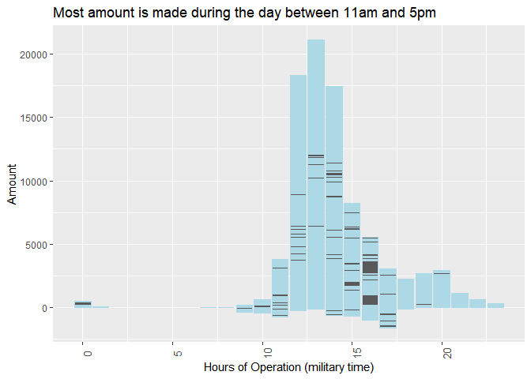
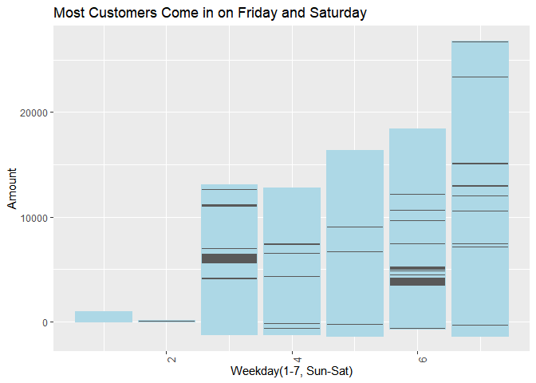
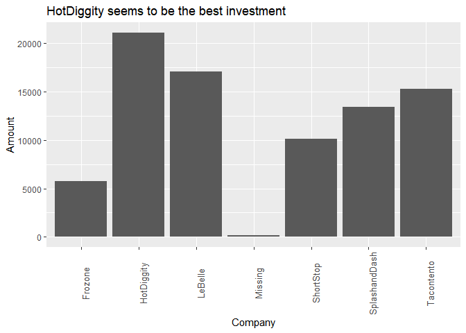

```r
library(tidyverse)
```

```
## Warning: package 'tidyverse' was built under R version 4.1.3
```

```
## -- Attaching packages --------------------------------------- tidyverse 1.3.2 --
## v ggplot2 3.3.5     v purrr   0.3.4
## v tibble  3.1.6     v dplyr   1.0.7
## v tidyr   1.1.4     v stringr 1.4.0
## v readr   2.1.1     v forcats 0.5.1
## -- Conflicts ------------------------------------------ tidyverse_conflicts() --
## x dplyr::filter() masks stats::filter()
## x dplyr::lag()    masks stats::lag()
```

```r
library(lubridate)
```

```
## 
## Attaching package: 'lubridate'
## 
## The following objects are masked from 'package:base':
## 
##     date, intersect, setdiff, union
```

```r
library(readr)
library(haven)
library(downloader)
```

```
## Warning: package 'downloader' was built under R version 4.1.3
```

```r
library(foreign)
library(readxl)
library(corrplot)
```

```
## Warning: package 'corrplot' was built under R version 4.1.3
```

```
## corrplot 0.92 loaded
```


```r
temp1 <- tempfile()
download("https://github.com/WJC-Data-Science/DTS350/raw/master/sales.csv", temp1, mode = "wb")
sales <- read_csv(temp1)
```

```
## Rows: 15656 Columns: 4
## -- Column specification --------------------------------------------------------
## Delimiter: ","
## chr  (2): Name, Type
## dbl  (1): Amount
## dttm (1): Time
## 
## i Use `spec()` to retrieve the full column specification for this data.
## i Specify the column types or set `show_col_types = FALSE` to quiet this message.
```

```r
head(sales)
```

```
## # A tibble: 6 x 4
##   Name       Type           Time                Amount
##   <chr>      <chr>          <dttm>               <dbl>
## 1 Tacontento Food(prepared) 2016-05-16 19:01:00    3  
## 2 Tacontento Food(prepared) 2016-05-16 19:01:00    1.5
## 3 Tacontento Food(prepared) 2016-05-16 19:04:00    3  
## 4 Tacontento Food(prepared) 2016-05-16 19:04:00    3  
## 5 Tacontento Food(prepared) 2016-05-16 19:04:00    1.5
## 6 Tacontento Food(prepared) 2016-05-16 19:04:00    1
```

```r
tail(sales)
```

```
## # A tibble: 6 x 4
##   Name    Type               Time                Amount
##   <chr>   <chr>              <dttm>               <dbl>
## 1 Frozone Food(pre-packaged) 2016-07-09 23:58:00   5   
## 2 Frozone Food(pre-packaged) 2016-07-10 00:33:00   5   
## 3 Frozone Food(pre-packaged) 2016-07-10 00:37:00   5   
## 4 Frozone Food(pre-packaged) 2016-07-10 00:47:00   5   
## 5 Missing Missing            2016-06-17 21:12:00 150   
## 6 Missing Missing            2016-04-20 19:01:00  -3.07
```

```r
sales <- with_tz(sales, tzone = "US/Mountain")
head(sales)
```

```
## # A tibble: 6 x 4
##   Name       Type           Time                Amount
##   <chr>      <chr>          <dttm>               <dbl>
## 1 Tacontento Food(prepared) 2016-05-16 13:01:00    3  
## 2 Tacontento Food(prepared) 2016-05-16 13:01:00    1.5
## 3 Tacontento Food(prepared) 2016-05-16 13:04:00    3  
## 4 Tacontento Food(prepared) 2016-05-16 13:04:00    3  
## 5 Tacontento Food(prepared) 2016-05-16 13:04:00    1.5
## 6 Tacontento Food(prepared) 2016-05-16 13:04:00    1
```


```r
hourlydat <- sales %>%
  mutate(hourly = ceiling_date(Time, "hour")) %>%
  mutate(daily = ceiling_date(Time, "day")) %>%
  mutate(Hour = hour(hourly)) %>%
  group_by(Name, Hour) 
head(hourlydat)
```

```
## # A tibble: 6 x 7
## # Groups:   Name, Hour [1]
##   Name  Type  Time                Amount hourly              daily              
##   <chr> <chr> <dttm>               <dbl> <dttm>              <dttm>             
## 1 Taco~ Food~ 2016-05-16 13:01:00    3   2016-05-16 14:00:00 2016-05-17 00:00:00
## 2 Taco~ Food~ 2016-05-16 13:01:00    1.5 2016-05-16 14:00:00 2016-05-17 00:00:00
## 3 Taco~ Food~ 2016-05-16 13:04:00    3   2016-05-16 14:00:00 2016-05-17 00:00:00
## 4 Taco~ Food~ 2016-05-16 13:04:00    3   2016-05-16 14:00:00 2016-05-17 00:00:00
## 5 Taco~ Food~ 2016-05-16 13:04:00    1.5 2016-05-16 14:00:00 2016-05-17 00:00:00
## 6 Taco~ Food~ 2016-05-16 13:04:00    1   2016-05-16 14:00:00 2016-05-17 00:00:00
## # ... with 1 more variable: Hour <int>
```


```r
ggplot(hourlydat, aes(x=Hour, y=Amount )) +
  geom_bar(stat="identity",color="lightblue" )+
  theme(axis.text.x = element_text(angle = 90, size = 10))+
  labs(x="Hours of Operation (military time)", y="Amount", title="Most amount is made during the day between 11am and 5pm")
```

<!-- -->
#My suggestion would be to open between 9am and 10am and close around 10pm.

```r
dailydat <- sales %>%
  mutate(daily = ceiling_date(Time, "day")) %>%
  mutate(Daily = wday(daily)) %>%
  group_by(Name, Daily) 
head(dailydat)
```

```
## # A tibble: 6 x 6
## # Groups:   Name, Daily [1]
##   Name       Type           Time                Amount daily               Daily
##   <chr>      <chr>          <dttm>               <dbl> <dttm>              <dbl>
## 1 Tacontento Food(prepared) 2016-05-16 13:01:00    3   2016-05-17 00:00:00     3
## 2 Tacontento Food(prepared) 2016-05-16 13:01:00    1.5 2016-05-17 00:00:00     3
## 3 Tacontento Food(prepared) 2016-05-16 13:04:00    3   2016-05-17 00:00:00     3
## 4 Tacontento Food(prepared) 2016-05-16 13:04:00    3   2016-05-17 00:00:00     3
## 5 Tacontento Food(prepared) 2016-05-16 13:04:00    1.5 2016-05-17 00:00:00     3
## 6 Tacontento Food(prepared) 2016-05-16 13:04:00    1   2016-05-17 00:00:00     3
```


```r
ggplot(dailydat, aes(x=Daily, y=Amount )) +
  geom_bar(stat="identity",color="lightblue" )+
  theme(axis.text.x = element_text(angle = 90, size = 10))+
  labs(x="Weekday(1-7, Sun-Sat)", y="Amount", title="Most Customers Come in on Friday and Saturday")
```

<!-- -->
#It seems that most customers come in on friday and saturday. I would open the store on Tuesday through Saturday 

```r
sumsales<- sales%>%
  group_by(Name)%>%
  summarise(across(Amount, sum))
sumsales
```

```
## # A tibble: 7 x 2
##   Name          Amount
##   <chr>          <dbl>
## 1 Frozone        5741.
## 2 HotDiggity    21119.
## 3 LeBelle       17089.
## 4 Missing         147.
## 5 ShortStop     10101.
## 6 SplashandDash 13428.
## 7 Tacontento    15264.
```


```r
ggplot(sumsales, aes(x=Name, y=Amount )) +
  geom_bar(stat="identity" )+
  theme(axis.text.x = element_text(angle = 90, size = 10))+
  labs(x="Company", y="Amount", title="HotDiggity seems to be the best investment")
```

<!-- -->
#It seems that HotDiggity, with the other recomendations that I have made would bes the best when investing in these companies. 
